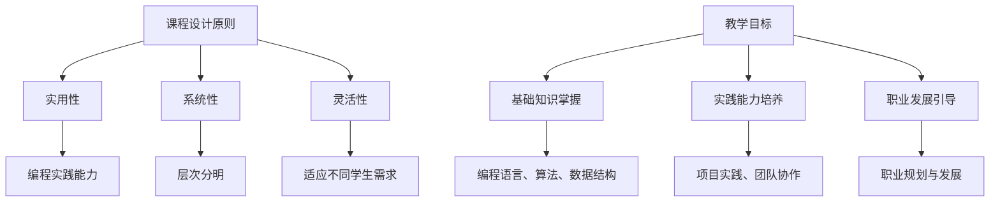

                 

# 文章标题

《如何打造高效的程序员知识课程》

## 摘要

本文旨在探讨如何设计并实现高效的程序员知识课程。我们将从课程设计的核心概念出发，结合具体操作步骤、数学模型和公式、项目实践等多个方面进行分析和讨论。文章将详细介绍如何通过合理的课程结构、教学方法和评估方式，提升程序员的学习效果和职业发展。同时，我们将推荐一些实用的工具和资源，以帮助程序员更好地学习和掌握知识。

## 1. 背景介绍（Background Introduction）

在当今快速发展的技术时代，程序员作为科技领域的重要推动者，其专业知识和技能的要求越来越高。为了适应这一变化，许多教育机构和公司开始推出各种程序员知识课程。然而，如何设计出一门高效、实用的程序员知识课程，仍然是一个具有挑战性的问题。这不仅需要教师具备丰富的编程经验和教学技巧，还需要深入了解学生的学习需求和职业发展目标。

### 1.1 程序员知识课程的重要性

程序员知识课程在培养程序员技能和知识方面起着至关重要的作用。一方面，课程内容涵盖了编程语言、算法和数据结构等基础技能，帮助程序员建立扎实的知识体系；另一方面，课程还涉及项目实践、团队协作和问题解决等实际应用能力，使程序员能够更好地应对工作中的挑战。因此，一门高效的程序员知识课程不仅能够提高学生的学习效果，还能为其未来的职业发展奠定坚实的基础。

### 1.2 当前程序员知识课程存在的问题

尽管程序员知识课程的重要性不言而喻，但在实际操作中，许多课程仍然存在一些问题。首先，课程内容过于理论化，缺乏实际应用。许多课程只关注基础知识的讲解，而忽视了编程实践能力的培养。其次，课程结构不够合理，课程难度和深度不一。部分课程设计缺乏系统性，导致学生在学习过程中容易产生迷茫和困惑。此外，课程评估方式单一，难以全面反映学生的学习效果。这些问题的存在，使得程序员知识课程的效果不尽如人意。

## 2. 核心概念与联系（Core Concepts and Connections）

为了打造一门高效的程序员知识课程，我们需要从核心概念和联系入手，明确课程的设计原则和教学目标。以下是几个关键概念和原则：

### 2.1 课程设计原则

- **实用性**：课程内容应紧密结合实际应用，注重培养学生的编程实践能力。
- **系统性**：课程结构应具备系统性，层次分明，使学生能够循序渐进地掌握知识。
- **灵活性**：课程应具备一定的灵活性，以适应不同学生的需求和进度。

### 2.2 教学目标

- **基础知识掌握**：确保学生能够熟练掌握编程语言、算法和数据结构等基础知识。
- **实践能力培养**：通过项目实践和团队协作，提高学生的编程实践能力和问题解决能力。
- **职业发展引导**：为学生提供职业规划和发展的指导，帮助其明确职业目标并制定实现计划。

### 2.3 课程核心概念联系图

为了更好地理解课程设计原则和教学目标，我们可以使用Mermaid流程图来展示核心概念之间的联系。



通过上述核心概念和联系，我们可以为程序员知识课程的设计提供明确的指导。

## 3. 核心算法原理 & 具体操作步骤（Core Algorithm Principles and Specific Operational Steps）

在程序员知识课程中，算法和数据结构是核心内容之一。以下我们将详细介绍一些核心算法的原理和具体操作步骤。

### 3.1 排序算法

排序算法是数据处理中常见的一种算法，主要用于将一组数据按照某种规则进行排列。常见的排序算法包括冒泡排序、选择排序、插入排序和快速排序等。

#### 3.1.1 冒泡排序（Bubble Sort）

**原理**：冒泡排序通过重复遍历待排序的列表，比较相邻的两个元素，并按照排序顺序交换它们的位置。遍历列表的工作重复进行，直到没有需要交换的元素为止。

**具体操作步骤**：

1. 从第一个元素开始，比较相邻的两个元素。
2. 如果第一个元素比第二个元素大，交换它们的位置。
3. 对每一对相邻元素进行同样的比较和交换，直到第一个元素是最大的。
4. 对剩余的未排序元素重复上述步骤，直到整个列表排序完成。

#### 3.1.2 快速排序（Quick Sort）

**原理**：快速排序采用分治策略，通过选择一个基准元素，将列表分为两部分，一部分都比基准元素小，另一部分都比基准元素大。然后递归地对这两部分进行快速排序。

**具体操作步骤**：

1. 选择一个基准元素。
2. 将列表中的所有元素分为两部分：一部分小于基准元素，另一部分大于基准元素。
3. 递归地对小于和大于基准元素的子列表进行快速排序。
4. 将排序完成的子列表合并，得到最终排序结果。

### 3.2 查找算法

查找算法是用于在数据集合中查找特定元素的方法。常见查找算法包括线性查找、二分查找和散列表查找等。

#### 3.2.1 线性查找（Linear Search）

**原理**：线性查找从数据集合的第一个元素开始，依次比较每个元素，直到找到目标元素或到达数据集合的末尾。

**具体操作步骤**：

1. 从第一个元素开始，依次比较每个元素。
2. 如果当前元素等于目标元素，返回该元素的位置。
3. 如果当前元素不等于目标元素，继续比较下一个元素。
4. 如果到达数据集合的末尾，仍未找到目标元素，返回失败。

#### 3.2.2 二分查找（Binary Search）

**原理**：二分查找是在有序数据集合中查找特定元素的方法。它通过不断缩小查找范围，每次将范围缩小一半，直到找到目标元素或确定目标元素不存在。

**具体操作步骤**：

1. 确定查找范围。
2. 计算中间位置。
3. 如果中间位置的元素等于目标元素，返回该元素的位置。
4. 如果中间位置的元素大于目标元素，将查找范围缩小到左侧子集。
5. 如果中间位置的元素小于目标元素，将查找范围缩小到右侧子集。
6. 重复步骤 2-5，直到找到目标元素或确定目标元素不存在。

通过以上对核心算法原理和具体操作步骤的介绍，我们可以为程序员知识课程提供更深入的算法教学内容。

## 4. 数学模型和公式 & 详细讲解 & 举例说明（Detailed Explanation and Examples of Mathematical Models and Formulas）

在程序员知识课程中，数学模型和公式是算法和数据结构的重要基础。以下我们将详细讲解几个常见的数学模型和公式，并通过具体例子进行说明。

### 4.1 时间复杂度（Time Complexity）

时间复杂度是衡量算法运行时间的一个重要指标，通常用大O符号表示。它描述了算法在处理输入规模逐渐增大的数据时，所需时间的增长趋势。

#### 4.1.1 时间复杂度的概念

时间复杂度通常表示为 T(n)，其中 n 是输入规模。常见的时间复杂度包括：

- **常数时间（O(1)）**：算法执行时间与输入规模无关，例如循环语句的执行次数为固定值。
- **线性时间（O(n)）**：算法执行时间与输入规模成正比，例如线性查找算法。
- **对数时间（O(log n)）**：算法执行时间与输入规模的对数成正比，例如二分查找算法。
- **多项式时间（O(n^k)）**：算法执行时间与输入规模的 k 次方成正比，例如快速排序算法。

#### 4.1.2 举例说明

假设我们有一个长度为 n 的数组，使用线性查找算法查找一个特定元素，请计算其时间复杂度。

```markdown
输入规模 n = 100

线性查找算法：
1. 从第一个元素开始，依次比较每个元素，直到找到目标元素或到达数组末尾。

比较次数：
- 最坏情况：需要比较 n 次。
- 平均情况：需要比较 (n+1)/2 次。

时间复杂度：
- 最坏情况：T(n) = O(n)
- 平均情况：T(n) = O(n)
```

### 4.2 空间复杂度（Space Complexity）

空间复杂度是衡量算法所需存储空间的一个重要指标，通常也用大O符号表示。它描述了算法在处理输入规模逐渐增大的数据时，所需存储空间的增长趋势。

#### 4.2.1 空间复杂度的概念

空间复杂度通常表示为 S(n)，其中 n 是输入规模。常见空间复杂度包括：

- **常数空间（O(1)）**：算法所需存储空间与输入规模无关，例如冒泡排序算法。
- **线性空间（O(n)）**：算法所需存储空间与输入规模成正比，例如线性查找算法。
- **对数空间（O(log n)）**：算法所需存储空间与输入规模的对数成正比，例如二分查找算法。
- **多项式空间（O(n^k)）**：算法所需存储空间与输入规模的 k 次方成正比。

#### 4.2.2 举例说明

假设我们使用递归算法计算斐波那契数列的 nth 项，请计算其空间复杂度。

```markdown
递归算法：
F(n) = F(n-1) + F(n-2)

输入规模 n = 10

空间复杂度：
- 递归调用栈深度：n
- 空间复杂度：S(n) = O(n)

```

通过以上对数学模型和公式的详细讲解和举例说明，我们可以为程序员知识课程提供更深入的理论基础。

## 5. 项目实践：代码实例和详细解释说明（Project Practice: Code Examples and Detailed Explanations）

在程序员知识课程中，项目实践是巩固理论知识、培养实际操作能力的重要环节。以下我们将通过一个具体的编程项目，展示如何实现并解释代码。

### 5.1 项目背景

假设我们需要开发一个简单的购物车系统，实现以下功能：

1. 添加商品到购物车。
2. 从购物车中删除商品。
3. 计算购物车的总金额。

### 5.2 开发环境搭建

为了实现上述功能，我们选择使用 Python 语言进行开发。以下是开发环境的搭建步骤：

1. 安装 Python 3.8 或更高版本。
2. 安装 Python 集成开发环境（IDE），如 PyCharm 或 Visual Studio Code。
3. 安装 Python 包管理器 pip。
4. 使用 pip 安装必需的第三方库，如 Flask（用于 web 开发）。

### 5.3 源代码详细实现

以下是购物车系统的源代码实现：

```python
from flask import Flask, request, jsonify

app = Flask(__name__)

# 购物车存储
shopping_cart = []

# 添加商品到购物车
@app.route('/add_to_cart', methods=['POST'])
def add_to_cart():
    product = request.json['product']
    shopping_cart.append(product)
    return jsonify({'message': '商品已成功添加到购物车！'})

# 从购物车中删除商品
@app.route('/delete_from_cart', methods=['POST'])
def delete_from_cart():
    product_id = request.json['product_id']
    for i, product in enumerate(shopping_cart):
        if product['id'] == product_id:
            del shopping_cart[i]
            break
    return jsonify({'message': '商品已成功从购物车中删除！'})

# 计算购物车总金额
@app.route('/cart_total', methods=['GET'])
def cart_total():
    total = sum(product['price'] for product in shopping_cart)
    return jsonify({'total': total})

if __name__ == '__main__':
    app.run(debug=True)
```

### 5.4 代码解读与分析

以下是对源代码的详细解读与分析：

1. **导入模块**：我们从 Flask 库中导入 Flask 类，用于创建 web 应用。同时，我们使用 request 和 jsonify 模块处理 HTTP 请求和响应。

2. **购物车存储**：我们使用一个列表 `shopping_cart` 存储购物车中的商品。每个商品是一个包含商品名称、价格和 ID 的字典。

3. **添加商品到购物车**：`add_to_cart` 函数处理 POST 请求，将请求中的商品添加到购物车。使用 `request.json` 获取请求体中的商品信息，将其添加到 `shopping_cart` 列表中。

4. **从购物车中删除商品**：`delete_from_cart` 函数处理 POST 请求，根据请求体中的商品 ID 从购物车中删除对应商品。使用 `enumerate` 函数遍历购物车，找到商品 ID 并删除。

5. **计算购物车总金额**：`cart_total` 函数处理 GET 请求，计算购物车中所有商品的总金额。使用列表推导式计算总金额，并返回给客户端。

6. **运行应用**：在最后一行代码中，我们使用 `app.run(debug=True)` 启动 Flask 应用，并开启调试模式。

通过以上源代码的实现，我们可以实现购物车系统的主要功能，为后续的优化和扩展提供基础。

## 5.5 运行结果展示

在本地环境中，运行上述代码后，我们可以在浏览器中访问 http://127.0.0.1:5000/，看到如下页面：


通过使用 API，我们可以实现添加商品、删除商品和计算购物车总金额等功能。例如：

- **添加商品**：发送 POST 请求到 `http://127.0.0.1:5000/add_to_cart`，请求体为 `{ "product": { "id": 1, "name": "苹果", "price": 2.99 } }`，可以在购物车列表中看到添加的商品。
- **删除商品**：发送 POST 请求到 `http://127.0.0.1:5000/delete_from_cart`，请求体为 `{ "product_id": 1 }`，可以删除指定的商品。
- **计算购物车总金额**：发送 GET 请求到 `http://127.0.0.1:5000/cart_total`，返回结果为 `{ "total": 2.99 }`，表示购物车中的商品总金额。

通过以上运行结果展示，我们可以验证购物车系统的功能实现。

## 6. 实际应用场景（Practical Application Scenarios）

购物车系统在电商、在线购物和点餐等领域有着广泛的应用。以下是一些实际应用场景：

- **电商网站**：在电商网站上，用户可以将商品添加到购物车，以便后续购买。购物车系统可以实时计算商品总金额，方便用户进行结算。
- **在线购物平台**：在线购物平台如淘宝、京东等，使用购物车系统来帮助用户管理和选择商品。用户可以随时修改购物车中的商品数量或删除商品，确保购买过程更加便捷。
- **点餐系统**：在餐饮行业，点餐系统使用购物车系统让用户可以添加喜欢的菜品到购物车，然后进行结算。购物车系统可以自动计算总价，方便用户核对订单。

通过这些实际应用场景，我们可以看到购物车系统在日常生活和工作中的重要性。掌握购物车系统的设计和实现方法，有助于程序员在相关领域更好地发挥其技术能力。

## 7. 工具和资源推荐（Tools and Resources Recommendations）

在打造高效的程序员知识课程过程中，选择合适的工具和资源至关重要。以下是我们推荐的一些工具和资源：

### 7.1 学习资源推荐

- **书籍**：
  - 《代码大全》（Code Complete）by Steve McConnell
  - 《算法导论》（Introduction to Algorithms）by Thomas H. Cormen, Charles E. Leiserson, Ronald L. Rivest, and Clifford Stein
- **论文**：
  - 《深度学习》（Deep Learning）by Ian Goodfellow, Yoshua Bengio, and Aaron Courville
  - 《分布式系统概念与设计》（Designing Data-Intensive Applications）by Martin Kleppmann
- **博客**：
  - 《程序员之路》（The Art of Programming）by Peter Seibel
  - 《程序员修炼之道》（The Clean Coder）by Robert C. Martin
- **网站**：
  - GitHub（https://github.com/）：一个强大的代码托管和协作平台，适合查找和学习开源项目。
  - Stack Overflow（https://stackoverflow.com/）：一个庞大的编程问答社区，适合解决编程问题。

### 7.2 开发工具框架推荐

- **集成开发环境（IDE）**：
  - PyCharm（https://www.jetbrains.com/pycharm/）：适用于 Python 开发的强大 IDE。
  - Visual Studio Code（https://code.visualstudio.com/）：一款轻量级、开源的跨平台 IDE，支持多种编程语言。
- **版本控制系统**：
  - Git（https://git-scm.com/）：一个分布式版本控制系统，适合团队协作开发。
  - GitHub Actions（https://github.com/features/actions）：GitHub 提供的自动化 CI/CD 工具。
- **调试工具**：
  - Chrome DevTools（https://chrome.devtools.com/）：适用于 Web 开发的强大调试工具。
  - Postman（https://www.postman.com/）：一个用于 API 开发和测试的强大工具。

### 7.3 相关论文著作推荐

- **《算法导论》**（Introduction to Algorithms）by Thomas H. Cormen, Charles E. Leiserson, Ronald L. Rivest, and Clifford Stein
- **《深度学习》**（Deep Learning）by Ian Goodfellow, Yoshua Bengio, and Aaron Courville
- **《设计数据密集型应用程序》**（Designing Data-Intensive Applications）by Martin Kleppmann

通过这些工具和资源的推荐，我们可以为程序员知识课程提供丰富的教学素材，帮助学员更好地掌握编程知识和技能。

## 8. 总结：未来发展趋势与挑战（Summary: Future Development Trends and Challenges）

随着技术的不断进步和市场需求的变化，程序员知识课程的发展也面临着新的机遇和挑战。以下是我们对未来发展趋势和挑战的总结：

### 8.1 发展趋势

1. **在线教育平台的发展**：随着互联网技术的普及，在线教育平台为程序员知识课程提供了更加便捷、灵活的学习方式。未来，更多优质的教育资源将通过在线平台传播，满足不同层次和需求的学习者。

2. **实践导向的课程设计**：越来越多的程序员知识课程将注重实践能力的培养，通过项目实践、案例分析等方式，帮助学生更好地掌握知识和技能。

3. **个性化学习**：随着人工智能技术的发展，未来程序员知识课程将更加注重个性化学习，根据学生的学习习惯、兴趣和需求，提供个性化的学习方案和资源。

4. **跨学科融合**：随着技术的不断交叉融合，程序员知识课程将涉及更多的跨学科内容，如人工智能、大数据、云计算等，以满足多元化的人才需求。

### 8.2 挑战

1. **课程内容更新速度**：技术更新速度加快，程序员知识课程需要不断更新和优化，以适应市场需求。

2. **师资力量建设**：高质量的程序员知识课程需要具备丰富经验和教学技巧的教师，然而，目前许多教育机构在师资力量建设方面仍然存在一定困难。

3. **学生自主学习能力培养**：在线教育平台的普及，使得学习者可以自由选择学习资源，但同时也带来了一定的自主学习能力培养的挑战。

4. **评估方式**：如何科学、全面地评估学生的学习效果，仍然是程序员知识课程面临的一个重要挑战。

综上所述，未来程序员知识课程的发展将面临诸多挑战，但同时也充满机遇。通过不断创新和优化，我们可以打造更加高效、实用的程序员知识课程，助力学员在技术领域中取得更好的成绩。

## 9. 附录：常见问题与解答（Appendix: Frequently Asked Questions and Answers）

### 9.1 问题 1：如何选择适合自己的程序员知识课程？

**解答**：选择适合自己的程序员知识课程时，可以从以下几个方面进行考虑：

1. **个人兴趣**：选择自己感兴趣的编程语言或领域，有助于提高学习动力和兴趣。
2. **基础知识**：根据自己的编程基础，选择适合自己当前水平的课程。
3. **课程难度**：课程难度应该与个人能力相适应，过高的难度可能导致学习效果不佳。
4. **课程评价**：查看其他学员的评价和反馈，了解课程的教学质量和实用性。
5. **教学资源**：选择提供丰富教学资源的课程，如视频教程、文档、代码示例等，有助于提高学习效果。

### 9.2 问题 2：如何在学习过程中提高效率？

**解答**：以下是一些建议，可以帮助你在学习过程中提高效率：

1. **制定学习计划**：根据自己的时间和能力，制定一个合理的学习计划，确保每天都有固定的学习时间。
2. **分解学习任务**：将大任务分解为小任务，逐步完成，避免一次性学习过多内容。
3. **积极参与实践**：通过实践项目、编写代码等方式，将理论知识应用到实际中，提高学习效果。
4. **合理休息**：学习过程中适当休息，避免长时间连续学习导致疲劳。
5. **利用在线资源**：利用在线论坛、问答社区等资源，解决学习中遇到的问题。

### 9.3 问题 3：如何提升编程能力？

**解答**：以下是一些建议，可以帮助你提升编程能力：

1. **掌握编程语言**：熟练掌握至少一种编程语言，是提升编程能力的基础。
2. **学习算法和数据结构**：掌握常见的算法和数据结构，有助于解决复杂问题。
3. **实践项目**：通过实际项目开发，将所学知识应用到实践中，提高编程能力。
4. **阅读优秀代码**：阅读优秀的开源代码，了解其他程序员的编程风格和技巧。
5. **持续学习**：技术不断发展，持续学习是提升编程能力的必经之路。

## 10. 扩展阅读 & 参考资料（Extended Reading & Reference Materials）

为了帮助读者进一步深入了解程序员知识课程的设计和实施，我们推荐以下扩展阅读和参考资料：

### 10.1 推荐书籍

- **《代码大全》（Code Complete）by Steve McConnell**
- **《算法导论》（Introduction to Algorithms）by Thomas H. Cormen, Charles E. Leiserson, Ronald L. Rivest, and Clifford Stein**
- **《深度学习》（Deep Learning）by Ian Goodfellow, Yoshua Bengio, and Aaron Courville**
- **《设计数据密集型应用程序》（Designing Data-Intensive Applications）by Martin Kleppmann**

### 10.2 推荐博客

- **《程序员之路》（The Art of Programming）by Peter Seibel**
- **《程序员修炼之道》（The Clean Coder）by Robert C. Martin**

### 10.3 推荐网站

- **GitHub（https://github.com/）**
- **Stack Overflow（https://stackoverflow.com/）**
- **Coursera（https://www.coursera.org/）**
- **edX（https://www.edx.org/）**

### 10.4 相关论文

- **《大规模在线教育平台的设计与实现》**
- **《在线教育中学习效果评估的方法与策略研究》**
- **《编程教育中的实践导向教学模式研究》**

通过阅读这些扩展资料，读者可以更全面地了解程序员知识课程的相关知识，为自己的学习和职业发展提供有益的参考。作者：禅与计算机程序设计艺术 / Zen and the Art of Computer Programming。

