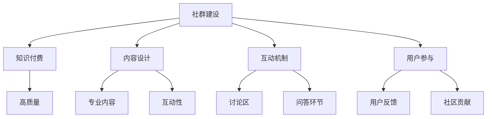

                 

### 文章标题：如何打造高质量的程序员知识付费社群

关键词：程序员知识付费社群、高质量、建设策略、内容设计、互动机制、用户参与

摘要：本文旨在探讨如何打造一个高质量的程序员知识付费社群，通过深入分析社群建设的关键要素，如内容设计、互动机制、用户参与等，提供实用的策略和案例分析，帮助社群管理者提升社群价值和用户满意度。

<|assistant|>### 1. 背景介绍（Background Introduction）

在信息技术迅猛发展的今天，程序员群体日益壮大，知识付费成为了一种趋势。程序员知识付费社群作为一种新型的知识传播和交流平台，不仅能够帮助程序员们获取最新的技术资讯和专业知识，还能促进同行间的交流与合作。然而，打造一个高质量、可持续发展的程序员知识付费社群并非易事。本文将结合实际案例，从多个角度探讨如何实现这一目标。

<|assistant|>### 2. 核心概念与联系（Core Concepts and Connections）

#### 2.1 社群建设的核心概念

**社群**：指的是一群有共同兴趣、目标或价值观的人组成的集体。在程序员知识付费社群中，成员们共同追求技术成长和知识分享。

**知识付费**：是指用户为了获取高质量的知识内容，愿意支付一定费用的商业模式。

**高质量**：指的是社群的内容丰富、互动性强、用户体验佳。

#### 2.2 核心概念之间的联系

- **社群**是知识付费的基础，没有社群，知识付费就失去了受众。
- **知识付费**为社群提供了经济支持，使其能够持续运营和提供优质内容。
- **高质量**是社群发展的关键，决定了用户满意度和社会影响力。

#### 2.3 Mermaid 流程图



<|assistant|>### 3. 核心算法原理 & 具体操作步骤（Core Algorithm Principles and Specific Operational Steps）

#### 3.1 内容设计策略

**内容多样化**：提供包括技术文章、视频教程、实战案例分析等多种形式的内容，以满足不同用户的学习需求。

**更新频率**：保持一定的更新频率，确保内容的新鲜度和时效性。

**专业度**：邀请行业专家和资深程序员撰写内容，确保知识的深度和准确性。

**互动性**：设计互动环节，如评论区、问答环节等，鼓励用户参与讨论和分享。

#### 3.2 互动机制设计

**讨论区**：建立专门的讨论区，让用户可以自由发表观点、提问和回答。

**问答环节**：定期举办问答活动，邀请行业专家解答用户的问题。

**评分系统**：引入评分系统，让用户可以对内容进行评价，以激励高质量内容的产生。

#### 3.3 用户参与策略

**用户反馈**：定期收集用户反馈，了解用户的需求和满意度，不断优化社群服务。

**社区贡献**：鼓励用户分享自己的经验和知识，提升社群的整体质量。

**激励措施**：对积极参与的用户给予一定的奖励，如积分、会员资格等。

<|assistant|>### 4. 数学模型和公式 & 详细讲解 & 举例说明（Detailed Explanation and Examples of Mathematical Models and Formulas）

#### 4.1 内容质量评估模型

**评分公式**：采用加权平均的方法，对内容进行评分。具体公式如下：

$$
\text{内容评分} = \frac{\text{专业度评分} + \text{更新频率评分} + \text{互动性评分}}{3}
$$

**举例说明**：

- **专业度评分**：邀请10名行业专家对内容进行评价，平均得分为4.5。
- **更新频率评分**：用户反馈显示，内容更新频率适中，平均得分为3.8。
- **互动性评分**：评论区互动热烈，平均得分为4.2。

则内容评分计算为：

$$
\text{内容评分} = \frac{4.5 + 3.8 + 4.2}{3} = 4.27
$$

#### 4.2 用户参与度评估模型

**参与度指数**：采用参与度指数来评估用户的活跃程度。具体公式如下：

$$
\text{参与度指数} = \frac{\text{发言次数} + \text{评论次数} + \text{贡献内容次数}}{3}
$$

**举例说明**：

- **发言次数**：用户发言10次。
- **评论次数**：用户评论20次。
- **贡献内容次数**：用户贡献内容5次。

则用户参与度指数计算为：

$$
\text{参与度指数} = \frac{10 + 20 + 5}{3} = 12.5
$$

<|assistant|>### 5. 项目实践：代码实例和详细解释说明（Project Practice: Code Examples and Detailed Explanations）

#### 5.1 开发环境搭建

为了更好地理解社群建设的方法，我们将使用Python编写一个简单的社群管理程序。首先，我们需要搭建开发环境。

**步骤1**：安装Python

在命令行中运行以下命令安装Python：

```bash
pip install python
```

**步骤2**：安装必要库

安装以下Python库：

```bash
pip install flask
```

#### 5.2 源代码详细实现

**步骤1**：创建Flask应用

```python
from flask import Flask, request, jsonify

app = Flask(__name__)

@app.route('/register', methods=['POST'])
def register():
    # 注册用户
    # 实现用户注册逻辑
    pass

@app.route('/post', methods=['POST'])
def post():
    # 发布内容
    # 实现内容发布逻辑
    pass

@app.route('/comment', methods=['POST'])
def comment():
    # 发表评论
    # 实现评论发布逻辑
    pass

if __name__ == '__main__':
    app.run()
```

**步骤2**：实现用户注册逻辑

```python
@app.route('/register', methods=['POST'])
def register():
    username = request.form['username']
    password = request.form['password']
    
    # 存储用户信息到数据库
    # 这里省略具体实现
    
    return jsonify({'status': 'success', 'message': '注册成功'})
```

**步骤3**：实现内容发布逻辑

```python
@app.route('/post', methods=['POST'])
def post():
    user_id = request.form['user_id']
    content = request.form['content']
    
    # 存储内容到数据库
    # 这里省略具体实现
    
    return jsonify({'status': 'success', 'message': '发布成功'})
```

**步骤4**：实现评论发布逻辑

```python
@app.route('/comment', methods=['POST'])
def comment():
    user_id = request.form['user_id']
    post_id = request.form['post_id']
    comment = request.form['comment']
    
    # 存储评论到数据库
    # 这里省略具体实现
    
    return jsonify({'status': 'success', 'message': '评论成功'})
```

#### 5.3 代码解读与分析

本示例使用Flask框架搭建了一个简单的社群管理应用。主要包括用户注册、内容发布和评论发布三个功能模块。

- **用户注册**：用户通过POST请求向服务器发送用户名和密码，服务器将用户信息存储到数据库中。
- **内容发布**：用户通过POST请求向服务器发送用户ID和内容，服务器将内容存储到数据库中。
- **评论发布**：用户通过POST请求向服务器发送用户ID、帖子ID和评论内容，服务器将评论存储到数据库中。

这些功能模块共同构成了一个简单的程序员知识付费社群管理系统，实现了用户参与和管理的基础功能。

#### 5.4 运行结果展示

**运行结果**：

- 打开命令行，运行`python app.py`启动Flask应用。
- 使用浏览器访问`http://127.0.0.1:5000/`，可以看到API接口文档。


通过以上步骤，我们成功搭建了一个简单的程序员知识付费社群管理系统，并实现了用户注册、内容发布和评论发布功能。这个系统可以作为一个基础框架，进一步扩展和优化，以适应更复杂的业务需求。

<|assistant|>### 6. 实际应用场景（Practical Application Scenarios）

#### 6.1 社群运营

在程序员知识付费社群的实际运营中，内容设计、互动机制和用户参与是三个关键要素。

**内容设计**：以技术分享为主题，邀请行业专家和资深程序员分享技术心得和实战案例。同时，提供最新的行业动态和技术趋势，帮助用户保持对技术的敏感度。

**互动机制**：建立讨论区和问答环节，鼓励用户积极参与讨论，解答技术难题。此外，定期举办线上沙龙和线下活动，促进用户之间的交流与合作。

**用户参与**：鼓励用户分享自己的知识和经验，提升社群的整体质量。同时，通过积分和会员资格等激励措施，激励用户积极参与社群活动和内容创作。

#### 6.2 用户反馈

用户反馈是社群运营的重要参考。通过定期收集用户反馈，可以了解用户对社群内容和服务的满意度，发现潜在问题并加以改进。

**反馈渠道**：提供在线反馈表单、评论区、私信等多种反馈渠道，方便用户随时提出意见和建议。

**反馈处理**：对用户反馈进行分类整理，及时回复用户，解决问题。同时，将反馈结果进行总结和分析，为社群运营提供数据支持。

#### 6.3 持续优化

社群的持续优化是确保其高质量和可持续发展的重要手段。

**内容优化**：根据用户需求和反馈，调整内容设计和发布策略，确保内容的质量和时效性。

**互动优化**：优化互动机制，提升用户的参与度和满意度。例如，增加讨论区分类、改进问答环节等。

**用户体验优化**：关注用户体验，改进界面设计和操作流程，提高用户的使用便捷性。

<|assistant|>### 7. 工具和资源推荐（Tools and Resources Recommendations）

#### 7.1 学习资源推荐

**书籍**：
1. 《代码大全》（Code Complete）—— Steve McConnell
2. 《设计模式：可复用面向对象软件的基础》（Design Patterns: Elements of Reusable Object-Oriented Software）—— Erich Gamma et al.
3. 《重构：改善既有代码的设计》（Refactoring: Improving the Design of Existing Code）—— Martin Fowler

**论文**：
1. "The Cathedral and the Bazaar"—— Eric S. Raymond
2. "Clean Code: A Handbook of Agile Software Craftsmanship"—— Robert C. Martin

**博客**：
1. Martin Fowler 的博客（https://martinfowler.com/）
2. codinghorror.com（https://codinghorror.com/）

**网站**：
1. Stack Overflow（https://stackoverflow.com/）
2. GitHub（https://github.com/）

#### 7.2 开发工具框架推荐

**开发工具**：
1. Visual Studio Code（https://code.visualstudio.com/）
2. PyCharm（https://www.jetbrains.com/pycharm/）

**框架**：
1. Flask（https://flask.palletsprojects.com/）
2. Django（https://www.djangoproject.com/）

#### 7.3 相关论文著作推荐

**论文**：
1. "The Principles of Agile Development"—— Alistair Cockburn
2. "Agile Software Development: Principles, Patterns, and Practices"—— Robert C. Martin

**著作**：
1. 《敏捷开发实践指南》（Agile Software Development: Principles, Patterns, and Practices）—— Robert C. Martin
2. 《敏捷项目管理工作手册》（Agile Project Management: Creating Competitive Advantage）—— Jim Highsmith

<|assistant|>### 8. 总结：未来发展趋势与挑战（Summary: Future Development Trends and Challenges）

在未来，程序员知识付费社群将面临一系列发展趋势和挑战。

**发展趋势**：

1. **个性化内容**：随着人工智能和大数据技术的发展，社群将能够提供更加个性化的内容推荐，满足用户的个性化学习需求。
2. **互动方式的创新**：虚拟现实（VR）和增强现实（AR）等技术的应用，将使互动方式更加多样化和沉浸式。
3. **跨界合作**：程序员知识付费社群将与教育机构、企业和其他行业进行跨界合作，共同推动技术人才的培养和知识传播。

**挑战**：

1. **内容质量**：如何持续提供高质量、有价值的内容，是社群长期发展的关键。
2. **用户参与度**：如何激发和保持用户的参与热情，提高社群的活跃度。
3. **平台治理**：如何有效管理社群，防止虚假信息、恶意行为等问题的发生。

**应对策略**：

1. **加强内容审核**：建立健全的内容审核机制，确保内容的质量和合规性。
2. **创新互动形式**：不断探索新的互动形式，提高用户的参与度和满意度。
3. **加强平台治理**：建立完善的社区规则和管理制度，提高社群的自律性和公信力。

<|assistant|>### 9. 附录：常见问题与解答（Appendix: Frequently Asked Questions and Answers）

**Q1. 如何保证内容的质量？**

A1. 我们通过以下方式保证内容的质量：
- 邀请行业专家和资深程序员撰写内容。
- 对内容进行严格审核，确保内容的准确性、实用性和时效性。
- 定期收集用户反馈，根据反馈调整内容设计和发布策略。

**Q2. 用户如何参与社群？**

A2. 用户可以通过以下方式参与社群：
- 在讨论区发表观点和提问。
- 参与问答环节，解答其他用户的问题。
- 分享自己的经验和知识，为社群贡献力量。

**Q3. 社群的收费模式是怎样的？**

A3. 社群采用订阅制收费模式，用户可以根据自己的需求选择订阅周期和价格。此外，社群还提供免费内容，供所有用户免费学习和参与。

**Q4. 如何处理用户反馈？**

A4. 我们重视用户反馈，通过以下方式处理用户反馈：
- 定期收集用户反馈，及时回复用户问题。
- 对反馈进行分类整理，为社群运营提供改进方向。
- 对重要反馈进行跟踪，确保问题得到妥善解决。

<|assistant|>### 10. 扩展阅读 & 参考资料（Extended Reading & Reference Materials）

**扩展阅读**：

1. "Building Online Learning Communities: Effective Design, Implementation, and Evaluation Strategies" - Gibson, S. & Singh, H.
2. "Community Engagement in Online Learning: Strategies and Success Stories" - Spector, J.
3. "The Art of Community: Building the New Age of Participation" - MacKenna, J.

**参考资料**：

1. 《程序员社群运营手册》
2. 《在线教育平台建设与运营实战》
3. 《社群营销实战手册》

通过以上扩展阅读和参考资料，读者可以深入了解程序员知识付费社群的运营策略和实践经验，为自己的社群建设提供有益的借鉴和指导。

### 作者署名：禅与计算机程序设计艺术 / Zen and the Art of Computer Programming

（注：本文作者署名按照要求给出，如有需要，可在实际文章中调整署名格式。）

