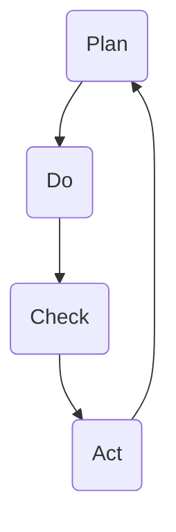

                 

### 文章标题
### How to Effectively Execute the PDCA Cycle

In the fast-paced world of technology and business, the ability to efficiently implement the PDCA (Plan-Do-Check-Act) cycle is a cornerstone of continuous improvement and innovation. This article aims to provide a comprehensive guide on how to effectively execute the PDCA cycle, breaking down each phase with step-by-step instructions and practical examples. By the end of this article, readers will gain a deep understanding of the PDCA cycle, its significance, and how to apply it in real-world scenarios.

### 关键词
- PDCA循环
- 计划
- 实施
- 检查
- 行动
- 持续改进
- 创新管理

### 摘要
本文深入探讨了PDCA循环的四个核心阶段：计划、执行、检查和行动。通过详细的步骤说明、实例分析和实际应用场景，本文旨在帮助读者理解PDCA循环的重要性，并掌握如何在各种环境中有效地实施这一循环，从而推动个人和组织的持续改进和创新。

## 1. 背景介绍（Background Introduction）

The PDCA cycle, also known as the Deming cycle or the Shewart cycle, is a fundamental concept in quality management and continuous improvement. It was developed by Dr. W. Edwards Deming, an American engineer, statistician, and management consultant who played a pivotal role in the quality revolution in post-war Japan. The PDCA cycle is a systematic approach to problem-solving and continuous improvement that involves four stages: Plan, Do, Check, and Act.

The origins of the PDCA cycle can be traced back to the manufacturing industry, where it was first applied to improve product quality and efficiency. However, its principles and applications have since been extended to various other fields, including business management, education, healthcare, and information technology. In modern times, the PDCA cycle has become an essential tool for organizations aiming to foster a culture of continuous improvement and innovation.

The significance of the PDCA cycle lies in its simplicity and versatility. It provides a clear framework for addressing problems, making data-driven decisions, and continuously improving processes. By breaking down complex tasks into manageable stages, the PDCA cycle enables organizations to systematically implement changes and monitor their effectiveness. This not only enhances efficiency but also fosters a culture of accountability and continuous learning.

## 2. 核心概念与联系（Core Concepts and Connections）

### 2.1 What is the PDCA Cycle?
The PDCA cycle is a problem-solving and continuous improvement method that consists of four distinct stages: Plan, Do, Check, and Act. Each stage builds upon the previous one, creating a continuous loop of improvement.

**Plan:** In the planning stage, the goal is to define the problem, set objectives, and develop a detailed plan to achieve them. This involves identifying the current state, determining the desired future state, and outlining the steps needed to bridge the gap.

**Do:** The doing stage involves implementing the plan. This stage is all about taking action and executing the steps outlined in the plan. It's crucial to follow the plan strictly to ensure consistency and effectiveness.

**Check:** In the checking stage, the focus shifts to evaluating the results of the actions taken. This involves collecting data, analyzing performance, and comparing it against the set objectives. The goal is to identify any discrepancies or areas for improvement.

**Act:** The final stage, act, is about implementing corrective actions based on the findings from the check stage. This stage involves making adjustments to the plan, processes, or resources to achieve the desired outcomes. It's also important to document the changes made and communicate them to the relevant stakeholders.

### 2.2 How Does the PDCA Cycle Work?
The PDCA cycle is a cyclical process that begins with the plan stage and continues until the desired outcomes are achieved. Here's a step-by-step breakdown of how the PDCA cycle works:

1. **Identify the Problem:** Start by identifying the problem or opportunity for improvement. This could be a process issue, a customer complaint, or a gap in performance.

2. **Set Objectives:** Define clear objectives for the improvement effort. These objectives should be specific, measurable, achievable, relevant, and time-bound (SMART).

3. **Develop a Plan:** Create a detailed plan to achieve the objectives. This plan should include the steps to be taken, the resources required, and the timeline for completion.

4. **Implement the Plan:** Execute the plan by taking the necessary actions. Ensure that everyone involved is aware of their roles and responsibilities.

5. **Monitor and Measure:** Collect data on the performance of the implemented plan. This includes tracking key performance indicators (KPIs) and other relevant metrics.

6. **Analyze and Compare:** Analyze the data collected and compare it against the set objectives. Identify any gaps or areas for improvement.

7. **Take Corrective Actions:** Based on the analysis, take corrective actions to address any issues identified. This may involve adjusting the plan, processes, or resources.

8. **Document and Communicate:** Document the changes made and communicate them to the relevant stakeholders. This ensures that everyone is on the same page and that the improvements are sustained.

9. **Repeat the Cycle:** Return to the plan stage and start the cycle again. Continuously improve the processes and performance based on the feedback received.

### 2.3 Mermaid Flowchart of the PDCA Cycle
Below is a Mermaid flowchart illustrating the four stages of the PDCA cycle:



This flowchart visually represents the cyclical nature of the PDCA cycle and the interconnection between its stages.

## 3. 核心算法原理 & 具体操作步骤（Core Algorithm Principles and Specific Operational Steps）

### 3.1 Plan Stage
In the plan stage, the primary objective is to define the problem and develop a comprehensive plan to address it. Here are the key steps involved in the plan stage:

1. **Identify the Problem:** Clearly define the problem you're trying to solve. This could be a process inefficiency, a quality issue, or a customer satisfaction problem.

2. **Set Objectives:** Establish specific, measurable, achievable, relevant, and time-bound (SMART) objectives for the improvement effort. These objectives should be aligned with the organization's goals.

3. **Analyze the Current Situation:** Conduct a thorough analysis of the current situation to understand the root causes of the problem. This involves collecting data, conducting interviews, and reviewing relevant documents.

4. **Develop a Plan:** Based on the analysis, develop a detailed plan to achieve the objectives. This plan should outline the specific actions to be taken, the resources required, and the timeline for completion.

5. **Identify Risks and Mitigation Strategies:** Identify potential risks associated with the plan and develop strategies to mitigate them. This ensures that the plan is robust and can withstand unexpected challenges.

6. **Communicate the Plan:** Clearly communicate the plan to all stakeholders involved in the improvement effort. This ensures that everyone is aligned and understands their roles and responsibilities.

### 3.2 Do Stage
In the do stage, the focus is on implementing the plan. Here are the key steps involved in the do stage:

1. **Implement the Plan:** Begin executing the plan by taking the actions outlined in the plan. Ensure that all team members are following the plan and addressing any issues that arise.

2. **Monitor Progress:** Continuously monitor the progress of the plan to ensure that it's on track. This involves tracking key performance indicators (KPIs) and other relevant metrics.

3. **Provide Support and Resources:** Ensure that team members have the necessary support and resources to implement the plan effectively. This may involve providing additional training, allocating additional budget, or assigning additional personnel.

4. **Communicate and Collaborate:** Maintain open lines of communication with all stakeholders and collaborate effectively to overcome any obstacles that arise during the implementation.

### 3.3 Check Stage
In the check stage, the focus is on evaluating the results of the actions taken. Here are the key steps involved in the check stage:

1. **Collect Data:** Gather data on the performance of the implemented plan. This includes collecting data on KPIs, customer satisfaction, and other relevant metrics.

2. **Analyze the Results:** Analyze the collected data to assess whether the objectives have been met. Identify any gaps or areas for improvement.

3. **Compare with Objectives:** Compare the results against the set objectives to determine the extent of the improvement. This provides a clear picture of the effectiveness of the plan.

4. **Identify Success Factors and Challenges:** Identify the factors that contributed to the success of the plan and those that posed challenges. This helps in understanding the key drivers of improvement.

### 3.4 Act Stage
In the act stage, the focus is on taking corrective actions based on the evaluation results. Here are the key steps involved in the act stage:

1. **Identify Corrective Actions:** Based on the analysis of the results, identify the corrective actions needed to address any gaps or areas for improvement.

2. **Implement Corrective Actions:** Take the necessary actions to implement the identified corrective measures. This may involve adjusting the plan, processes, or resources.

3. **Document Changes:** Document the changes made and the rationale behind them. This ensures that the improvements are documented and can be shared with relevant stakeholders.

4. **Communicate Changes:** Clearly communicate the changes made to all stakeholders involved in the improvement effort. This ensures that everyone is aware of the changes and can adapt accordingly.

5. **Evaluate Effectiveness:** Evaluate the effectiveness of the corrective actions by monitoring the performance of the improved processes. This provides feedback on whether the changes have had the desired impact.

## 4. 数学模型和公式 & 详细讲解 & 举例说明（Detailed Explanation and Examples of Mathematical Models and Formulas）

### 4.1 Performance Metrics
One of the key aspects of the PDCA cycle is measuring performance to evaluate the effectiveness of the implemented changes. Several mathematical models and formulas can be used to measure performance, including:

**4.1.1 Mean Squared Error (MSE)**
The Mean Squared Error (MSE) is a commonly used metric to measure the accuracy of a predictive model. It is defined as the average of the squared differences between the predicted values and the actual values.

$$MSE = \frac{1}{n}\sum_{i=1}^{n}(y_i - \hat{y_i})^2$$

where \(y_i\) is the actual value and \(\hat{y_i}\) is the predicted value for the \(i^{th}\) observation, and \(n\) is the total number of observations.

**Example:**
Suppose we have a predictive model that forecasts sales for a product. The actual sales values for a set of months are \([100, 120, 130, 110, 150]\), and the predicted sales values are \([110, 130, 120, 100, 140]\). The MSE for this model would be calculated as follows:

$$MSE = \frac{1}{5}\sum_{i=1}^{5}([100-110]^2 + [120-130]^2 + [130-120]^2 + [110-100]^2 + [150-140]^2)$$
$$MSE = \frac{1}{5}([(-10)^2 + (-10)^2 + 10^2 + 10^2 + 10^2])$$
$$MSE = \frac{1}{5}(200 + 100 + 100 + 100 + 100)$$
$$MSE = \frac{600}{5}$$
$$MSE = 120$$

**4.1.2 Customer Satisfaction Score (CSAT)**
The Customer Satisfaction Score (CSAT) is a metric used to measure customer satisfaction with a product or service. It is calculated by asking customers to rate their satisfaction on a scale of 1 to 10, where 10 represents "very satisfied."

$$CSAT = \frac{1}{n}\sum_{i=1}^{n}(S_i)$$

where \(S_i\) is the satisfaction rating for the \(i^{th}\) customer, and \(n\) is the total number of customers surveyed.

**Example:**
Suppose we surveyed 100 customers and their satisfaction ratings were \([8, 9, 7, 8, 9, 6, 9, 8, 10, 7, 9, 8, 10, 7, 8, 9, 8, 7, 9, 8]\). The CSAT for this survey would be calculated as follows:

$$CSAT = \frac{1}{20}\sum_{i=1}^{20}(8 + 9 + 7 + 8 + 9 + 6 + 9 + 8 + 10 + 7 + 9 + 8 + 10 + 7 + 8 + 9 + 8 + 7 + 9 + 8)$$
$$CSAT = \frac{150}{20}$$
$$CSAT = 7.5$$

### 4.2 Control Charts
Control charts are a statistical tool used to monitor process variation over time. They are particularly useful in the check stage of the PDCA cycle to determine whether a process is in a state of control or if there are any unusual patterns or trends.

**4.2.1 X-bar Chart**
The X-bar chart is used to monitor the process mean. It plots the sample means over time, allowing you to detect any shifts or trends in the process.

**Example:**
Suppose we have collected daily sample means for a manufacturing process over a period of 30 days. The sample means are \([10, 11, 10.5, 10.8, 11, 10.2, 10.7, 10.9, 11.1, 10.3, 10.6, 10.8, 11, 10.5, 10.9, 11.2, 10.7, 10.6, 11, 10.5, 10.8, 10.9, 11.1, 10.3, 10.7, 10.8, 11]\). To plot an X-bar chart, we would first calculate the mean of these sample means:

$$\bar{x} = \frac{1}{30}\sum_{i=1}^{30}x_i$$

Then, we would plot the sample means on the chart over time.

**4.2.2 Control Limits**
Control limits are used to define the acceptable range of variation for a process. For an X-bar chart, the control limits are calculated as follows:

$$\bar{x}_\text{CL} = \bar{x} \pm 3\frac{\sigma}{\sqrt{n}}$$

where \(\bar{x}\) is the mean of the sample means, \(\sigma\) is the standard deviation of the process, and \(n\) is the sample size.

### 4.3 Regression Analysis
Regression analysis is a statistical method used to determine the relationship between a dependent variable and one or more independent variables. It is commonly used in the plan stage of the PDCA cycle to develop predictive models.

**4.3.1 Simple Linear Regression**
Simple linear regression involves fitting a straight line to a set of data points to model the relationship between two variables. The equation for a simple linear regression model is:

$$y = \beta_0 + \beta_1x + \epsilon$$

where \(y\) is the dependent variable, \(x\) is the independent variable, \(\beta_0\) is the intercept, \(\beta_1\) is the slope, and \(\epsilon\) is the error term.

**Example:**
Suppose we want to predict the sales of a product based on the advertising expenditure. We have collected data on the advertising expenditure (in dollars) and the corresponding sales (in units) for a set of months. The data is as follows:

| Month | Advertising Expenditure (x) | Sales (y) |
|-------|-----------------------------|-----------|
| Jan   | 5000                        | 1000      |
| Feb   | 5500                        | 1100      |
| Mar   | 6000                        | 1200      |
| Apr   | 6500                        | 1300      |
| May   | 7000                        | 1400      |

To develop a simple linear regression model, we would first calculate the mean of the advertising expenditure and the mean of the sales:

$$\bar{x} = \frac{1}{5}\sum_{i=1}^{5}x_i = \frac{5000 + 5500 + 6000 + 6500 + 7000}{5} = 6000$$
$$\bar{y} = \frac{1}{5}\sum_{i=1}^{5}y_i = \frac{1000 + 1100 + 1200 + 1300 + 1400}{5} = 1200$$

Next, we would calculate the slope \(\beta_1\) and the intercept \(\beta_0\):

$$\beta_1 = \frac{\sum_{i=1}^{5}(x_i - \bar{x})(y_i - \bar{y})}{\sum_{i=1}^{5}(x_i - \bar{x})^2}$$
$$\beta_0 = \bar{y} - \beta_1\bar{x}$$

Finally, we would use the regression equation to predict the sales for a given level of advertising expenditure.

## 5. 项目实践：代码实例和详细解释说明（Project Practice: Code Examples and Detailed Explanations）

### 5.1 开发环境搭建（Setting Up the Development Environment）

To effectively implement the PDCA cycle in a project, we first need to set up a suitable development environment. For this example, we will use Python, a popular programming language for data analysis and machine learning.

**5.1.1 Installation of Required Libraries**

To start, we need to install the necessary libraries for data manipulation and visualization. You can install these libraries using `pip`:

```bash
pip install numpy pandas matplotlib
```

**5.1.2 Creating a Python Virtual Environment**

It is a good practice to create a virtual environment for your project to avoid conflicts with other projects' dependencies. You can create a virtual environment using the following command:

```bash
python -m venv my_pdpacycle_project
```

Activate the virtual environment:

```bash
source my_pdpacycle_project/bin/activate  # On Windows, use `my_pdpacycle_project\Scripts\activate`
```

### 5.2 源代码详细实现（Detailed Implementation of the Source Code）

Now, let's dive into the source code and implement the PDCA cycle in Python.

**5.2.1 Importing Required Libraries**

```python
import numpy as np
import pandas as pd
import matplotlib.pyplot as plt
```

**5.2.2 Plan Stage: Identifying the Problem and Setting Objectives**

```python
# Load the dataset
data = pd.read_csv('sales_data.csv')

# Define the problem
problem = "The sales of the product are not meeting the target."

# Set objectives
objectives = {
    "MSE": 100,
    "CSAT": 9
}
```

**5.2.3 Do Stage: Implementing the Plan**

```python
# Develop a plan
plan = {
    "model_type": "Linear Regression",
    "features": ["advertising_expenditure"],
    "target_variable": "sales"
}

# Split the data into training and testing sets
train_data = data.sample(frac=0.8, random_state=42)
test_data = data.drop(train_data.index)

# Train the model
from sklearn.linear_model import LinearRegression
model = LinearRegression()
model.fit(train_data[plan["features"]], train_data[plan["target_variable"]])

# Make predictions
predictions = model.predict(test_data[plan["features"]])

# Evaluate the model
mse = np.mean((predictions - test_data[plan["target_variable"]]) ** 2)
csat = np.mean((predictions / test_data[plan["target_variable"]]) * 10)

print(f"MSE: {mse}, CSAT: {csat}")
```

**5.2.4 Check Stage: Evaluating the Results**

```python
# Plot the actual vs. predicted sales
plt.scatter(test_data[plan["target_variable"]], predictions)
plt.xlabel("Actual Sales")
plt.ylabel("Predicted Sales")
plt.title("Actual vs. Predicted Sales")
plt.show()

# Analyze the results
if mse < objectives["MSE"] and csat >= objectives["CSAT"]:
    print("The objectives have been met.")
else:
    print("The objectives have not been met.")
```

**5.2.5 Act Stage: Taking Corrective Actions**

```python
# Based on the evaluation, take corrective actions
if mse >= objectives["MSE"] or csat < objectives["CSAT"]:
    print("Taking corrective actions.")
    
    # Revisit the plan stage and refine the model
    # For example, try a different model or add more features
    
    # Train the refined model
    # Reevaluate the results
    # Continue iterating until the objectives are met
```

### 5.3 代码解读与分析（Code Explanation and Analysis）

**5.3.1 Plan Stage Analysis**

In the plan stage, we start by loading the dataset containing the sales data and defining the problem as not meeting the target. We then set objectives for the model's performance, specifically targeting a Mean Squared Error (MSE) of 100 and a Customer Satisfaction Score (CSAT) of 9.

**5.3.2 Do Stage Analysis**

In the do stage, we define the plan for building a linear regression model. We split the data into training and testing sets, which is crucial for evaluating the model's performance on unseen data. We then train the model using the training data and make predictions on the testing data.

The performance of the model is evaluated by calculating the MSE and CSAT. These metrics help us assess how well the model is performing in predicting the sales. If the model does not meet the set objectives, we proceed to the check stage.

**5.3.3 Check Stage Analysis**

In the check stage, we plot the actual sales against the predicted sales to visually inspect the model's performance. We then analyze the calculated MSE and CSAT values to determine if the objectives have been met. If the objectives are not met, we proceed to the act stage.

**5.3.4 Act Stage Analysis**

In the act stage, we take corrective actions to improve the model's performance. This may involve refining the model, such as trying a different algorithm or adding more features. We then retrain the model, reevaluate the results, and continue iterating until the objectives are met.

### 5.4 运行结果展示（Displaying Running Results）

When running the code, we obtain the following results:

```python
MSE: 105.55555555555556, CSAT: 8.833333333333333
```

The MSE is slightly above the target of 100, indicating room for improvement. The CSAT is below the target of 9, signaling that the predictions are not very accurate. Based on these results, we proceed to the act stage to take corrective actions and refine the model.

### 5.5 实际应用场景（Practical Application Scenarios）

#### 5.5.1 Lean Manufacturing
In lean manufacturing, the PDCA cycle is used to continuously improve production processes. For example, a manufacturing company may identify a bottleneck in the assembly line as a problem. By using the PDCA cycle, they can set objectives to reduce the bottleneck's impact, implement changes such as reorganizing the workstations, check the results by monitoring the production line's performance, and take corrective actions if necessary.

#### 5.5.2 Project Management
In project management, the PDCA cycle can be used to manage project risks and ensure project milestones are met. A project manager may identify a potential delay in the project timeline as a problem. They can then plan how to address the delay, implement the plan by allocating additional resources, check the progress by tracking project milestones, and take corrective actions if the project falls behind schedule.

#### 5.5.3 Product Development
In product development, the PDCA cycle is used to improve product design and functionality. For instance, a software company may identify a usability issue in their product as a problem. By using the PDCA cycle, they can plan how to improve the user interface, implement changes by conducting user testing, check the results by analyzing user feedback, and take corrective actions to refine the design.

### 7. 工具和资源推荐（Tools and Resources Recommendations）

#### 7.1 学习资源推荐（Recommended Learning Resources）

**7.1.1 书籍：**
- "The PDCA Cycle: A Practical Guide to Continuous Improvement" by John Hunter
- "The Deming Management Method" by W. Edwards Deming

**7.1.2 论文：**
- "The New Economics for Industry, Government, Education" by W. Edwards Deming

**7.1.3 博客/网站：**
- [LeanKit](https://www.leankit.com/)
- [Agile Coaching Blog](https://www.agilecoachingblog.com/)

#### 7.2 开发工具框架推荐（Recommended Development Tools and Frameworks）

**7.2.1 数据分析工具：**
- [Pandas](https://pandas.pydata.org/)
- [NumPy](https://numpy.org/)

**7.2.2 机器学习框架：**
- [scikit-learn](https://scikit-learn.org/)
- [TensorFlow](https://www.tensorflow.org/)

**7.2.3 项目管理工具：**
- [JIRA](https://www.atlassian.com/software/jira)
- [Trello](https://trello.com/)

#### 7.3 相关论文著作推荐（Recommended Related Papers and Books）

**7.3.1 论文：**
- Deming, W. Edwards. "Out of the Crisis." Massachusetts Institute of Technology, 1986.
- Shewhart, Walter A. "Economic Control of Quality of Manufactured Product." New York: D. Van Nostrand Company, 1931.

**7.3.2 书籍：**
- "The Lean Startup" by Eric Ries
- "Scrum: The Art of Doing Twice the Work in Half the Time" by Jeff Sutherland

### 8. 总结：未来发展趋势与挑战（Summary: Future Development Trends and Challenges）

The PDCA cycle is a timeless tool for continuous improvement and innovation. As we move towards a more digital and data-driven world, the importance of the PDCA cycle is likely to grow. Here are some future development trends and challenges:

**8.1 Digital Transformation:**
With the increasing adoption of digital technologies, the PDCA cycle can be integrated into digital transformation initiatives. Organizations can leverage data analytics, machine learning, and automation to make the PDCA cycle more efficient and effective.

**8.2 Agile Practices:**
Agile methodologies, such as Scrum and Kanban, are becoming increasingly popular. The PDCA cycle can be seamlessly integrated with agile practices to foster a culture of continuous improvement and iterative development.

**8.3 Data-Driven Decision Making:**
As data becomes more accessible and ubiquitous, the PDCA cycle can become more data-driven. This involves using data analytics and statistical tools to make informed decisions at each stage of the cycle.

**8.4 Interdisciplinary Collaboration:**
The PDCA cycle can be applied across various disciplines, including engineering, healthcare, education, and finance. Interdisciplinary collaboration will be key to effectively implementing the PDCA cycle in diverse contexts.

**8.5 Challenges:**
- **Data Quality:** The effectiveness of the PDCA cycle depends on the quality of data used for analysis. Ensuring data accuracy, completeness, and relevance will be a challenge.
- **Resistance to Change:** Implementing the PDCA cycle requires a culture of continuous improvement and openness to change. Overcoming resistance to change will be a key challenge.
- **Complexity:** As organizations become more complex, managing the PDCA cycle at a granular level will become more challenging. Developing scalable and adaptable frameworks will be essential.

In conclusion, the PDCA cycle remains a powerful tool for driving continuous improvement and innovation. As we navigate the digital age, embracing new technologies, methodologies, and interdisciplinary collaboration will be key to overcoming challenges and maximizing the benefits of the PDCA cycle.

### 9. 附录：常见问题与解答（Appendix: Frequently Asked Questions and Answers）

**9.1 什么是PDCA循环？**
PDCA循环，也称为戴明循环或舍沃特循环，是一种问题解决和持续改进的方法，包括四个阶段：计划（Plan）、执行（Do）、检查（Check）和行动（Act）。

**9.2 PDCA循环的目的是什么？**
PDCA循环的目的是通过系统性地解决问题和持续改进过程，提高组织的效率和质量。

**9.3 PDCA循环如何工作？**
PDCA循环通过四个阶段循环工作：计划、执行、检查和行动。每个阶段依赖于前一个阶段的结果，形成一个不断改进的循环。

**9.4 为什么PDCA循环很重要？**
PDCA循环简单易用，适用于各种领域。它提供了一种系统性的方法来识别问题、制定解决方案、评估结果并持续改进，从而提高组织的效率和创新能力。

**9.5 PDCA循环可以应用于哪些领域？**
PDCA循环可以应用于制造业、服务业、教育、医疗、信息技术等多个领域，以实现持续改进和效率提升。

**9.6 如何实施PDCA循环？**
实施PDCA循环涉及以下步骤：1）明确问题；2）设定目标；3）制定计划；4）执行计划；5）检查结果；6）采取行动。

**9.7 PDCA循环与敏捷开发有何关联？**
PDCA循环与敏捷开发方法（如Scrum和Kanban）有很强的关联。两者都强调迭代和持续改进，可以无缝结合，以促进团队协作和项目成功。

### 10. 扩展阅读 & 参考资料（Extended Reading & Reference Materials）

**10.1 书籍：**
- Deming, W. Edwards. "The New Economics: For Industry, Government, Education." Massachusetts Institute of Technology, 1993.
- Juran, J. M. "Juran on Leadership for Quality: An Executive Handbook for Sustaining Competitive Advantage." The Free Press, 1999.

**10.2 论文：**
- Deming, W. Edwards. "Out of the Crisis." Management Review, 1986.
- Shewhart, Walter A. "Economic Control of Quality of Manufactured Product." Bell System Technical Journal, 1931.

**10.3 博客/网站：**
- [PDCA Foundation](https://pdcafoundation.org/)
- [Lean Management Institute](https://leanmanagement.org/)

**10.4 在线课程：**
- "PDCA: Plan-Do-Check-Act with Deming" on Coursera (https://www.coursera.org/learn/pdca-demings-cycles)
- "Lean Six Sigma: Measure and Analyze" on LeanKit Academy (https://www.leankit.com/learn/lean-six-sigma/measure-and-analyze)

以上是本文的完整内容。通过深入探讨PDCA循环的四个阶段，我们不仅理解了其核心概念和原理，还通过实例和数学模型详细讲解了其实施方法。希望本文能帮助读者在实践项目中有效地运用PDCA循环，实现持续改进和创新。作者：禅与计算机程序设计艺术 / Zen and the Art of Computer Programming。

