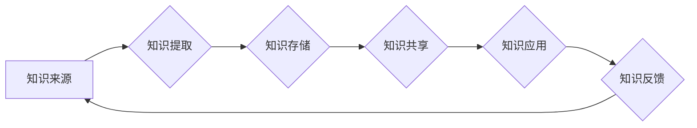

                 

## 知识管理：如何有效利用组织智慧

> 关键词：知识管理、组织智慧、知识共享、知识提取、知识存储、知识应用、知识图谱

## 1. 背景介绍

在当今信息爆炸的时代，知识已成为企业最重要的资产之一。如何有效地管理和利用组织中的知识，是企业持续发展和竞争力的关键。知识管理 (Knowledge Management，KM) 应运而生，旨在帮助组织收集、存储、共享、应用和创造知识，从而提升组织的效率、创新能力和决策水平。

传统的知识管理方法往往依赖于文档库、邮件列表等静态存储方式，难以满足快速变化的业务需求和知识的动态性。随着人工智能 (AI) 技术的快速发展，特别是深度学习和自然语言处理 (NLP) 的突破，知识管理迎来了新的机遇。AI 技术可以帮助组织自动提取、分类、关联和理解知识，并将其转化为可应用的洞察和决策支持。

## 2. 核心概念与联系

**2.1 知识管理的核心概念**

* **知识：** 指个人或组织通过经验、学习、观察和思考获得的理解、技能、信息和见解。
* **知识共享：** 指组织成员之间分享知识的活动，包括知识的创建、传播、交流和应用。
* **知识提取：** 指从各种数据源中自动提取有价值的知识，例如文本、图像、音频和视频。
* **知识存储：** 指将提取的知识以结构化和可搜索的方式存储，以便于检索和利用。
* **知识应用：** 指将知识应用于实际问题解决，例如决策支持、产品创新和流程优化。

**2.2 知识管理与人工智能的联系**

AI 技术可以赋能知识管理，提升其效率和智能化水平。

* **知识提取：** AI 算法可以自动识别和提取文本中的关键信息、关系和概念，例如命名实体识别、关系抽取和文本分类。
* **知识存储：** AI 可以帮助构建知识图谱，将知识以图示的方式表示，并建立知识之间的关联关系。
* **知识推荐：** AI 可以根据用户的需求和历史行为，推荐相关的知识资源。
* **知识问答：** AI 可以理解自然语言问题，并从知识库中找到相应的答案。

**2.3 知识管理流程图**



## 3. 核心算法原理 & 具体操作步骤

**3.1 算法原理概述**

知识管理的核心算法主要包括：

* **自然语言处理 (NLP) 算法：** 用于处理和理解自然语言文本，例如词嵌入、句法分析、语义分析等。
* **机器学习 (ML) 算法：** 用于从数据中学习知识和模式，例如分类、聚类、回归等。
* **深度学习 (DL) 算法：** 用于处理复杂的数据模式，例如卷积神经网络 (CNN)、循环神经网络 (RNN) 等。

**3.2 算法步骤详解**

1. **数据收集：** 从各种数据源收集相关知识，例如文档、网站、数据库、社交媒体等。
2. **数据预处理：** 对收集到的数据进行清洗、格式化和转换，例如去除噪声、标准化文本、标记实体等。
3. **知识提取：** 使用 NLP 算法提取文本中的关键信息、关系和概念，例如命名实体识别、关系抽取、文本分类等。
4. **知识表示：** 将提取的知识以结构化和可搜索的方式表示，例如知识图谱、本体、关系数据库等。
5. **知识存储：** 将知识表示存储在知识库中，以便于检索和利用。
6. **知识共享：** 通过各种平台和工具，例如知识库、协作平台、社交网络等，促进知识的共享和传播。
7. **知识应用：** 将知识应用于实际问题解决，例如决策支持、产品创新、流程优化等。

**3.3 算法优缺点**

* **优点：** 自动化知识提取、提高知识发现效率、增强知识共享和应用。
* **缺点：** 需要大量高质量的数据训练、算法复杂度高、知识表达和理解仍存在挑战。

**3.4 算法应用领域**

* **企业知识管理：** 帮助企业收集、存储、共享和应用内部知识，提升企业效率和创新能力。
* **医疗保健：** 自动提取医疗文献中的知识，辅助医生诊断和治疗。
* **金融服务：** 分析金融数据，识别风险和机会，支持投资决策。
* **教育：** 个性化学习推荐、知识问答系统、智能辅导系统等。

## 4. 数学模型和公式 & 详细讲解 & 举例说明

**4.1 数学模型构建**

知识管理的数学模型通常基于图论、信息论和统计学等理论。

* **知识图谱：** 将知识表示为节点和边构成的图，节点代表实体，边代表关系。
* **信息熵：** 用于度量知识的不确定性，越高的信息熵表示知识的不确定性越大。
* **贝叶斯网络：** 用于表示知识之间的概率关系，可以用于知识推理和预测。

**4.2 公式推导过程**

* **知识相似度计算：** 可以使用余弦相似度、Jaccard 指数等方法计算两个知识项之间的相似度。

$$
\text{余弦相似度} = \frac{\mathbf{A} \cdot \mathbf{B}}{\|\mathbf{A}\| \|\mathbf{B}\|},
$$

其中，$\mathbf{A}$ 和 $\mathbf{B}$ 是两个知识项的向量表示，$\cdot$ 表示点积，$\|\mathbf{A}\|$ 和 $\|\mathbf{B}\|$ 表示向量的模长。

* **知识推荐算法：** 可以使用协同过滤、内容过滤等方法进行知识推荐。

**4.3 案例分析与讲解**

* **知识图谱构建：** 可以使用 NLP 算法从文本数据中提取实体和关系，构建知识图谱。例如，可以从新闻文章中提取人物、事件和地点，构建人物关系图谱。

## 5. 项目实践：代码实例和详细解释说明

**5.1 开发环境搭建**

* Python 3.x
* TensorFlow 或 PyTorch
* NLTK 或 SpaCy

**5.2 源代码详细实现**

```python
# 使用 NLTK 提取文本中的命名实体
import nltk

text = "苹果公司发布了新款 iPhone 15。"
tokens = nltk.word_tokenize(text)
entities = nltk.ne_chunk(tokens)

print(entities)
```

**5.3 代码解读与分析**

* `nltk.word_tokenize(text)` 将文本分割成单词。
* `nltk.ne_chunk(tokens)` 使用命名实体识别模型对单词进行标记，识别出实体。

**5.4 运行结果展示**

```
(S
  (PERSON Apple)
  (ORG 公司)
  (PRODUCT iPhone 15))
```

## 6. 实际应用场景

* **企业知识库：** 自动提取员工文档中的知识，构建企业知识库，方便员工查找和共享知识。
* **客户服务机器人：** 使用知识图谱和自然语言处理技术，构建客户服务机器人，自动回答客户常见问题。
* **产品研发：** 分析市场数据和用户反馈，提取产品需求和改进建议，辅助产品研发。

**6.4 未来应用展望**

* **个性化知识推荐：** 根据用户的兴趣和需求，推荐个性化的知识资源。
* **智能知识问答：** 使用深度学习技术，构建更智能的知识问答系统，能够理解复杂的问题并给出更准确的答案。
* **知识融合：** 将不同类型知识融合在一起，构建更完整的知识体系。

## 7. 工具和资源推荐

**7.1 学习资源推荐**

* **书籍：**
    * 《知识管理：从理论到实践》
    * 《知识管理：构建智慧型组织》
* **在线课程：**
    * Coursera: Knowledge Management
    * edX: Introduction to Knowledge Management

**7.2 开发工具推荐**

* **知识图谱构建工具：**
    * Neo4j
    * GraphDB
* **自然语言处理工具：**
    * NLTK
    * SpaCy
    * Stanford CoreNLP

**7.3 相关论文推荐**

* **D.W. Marquardt, "Knowledge Management: A Review of the Literature," Journal of Knowledge Management, 2000.**
* **T. Nonaka and H. Takeuchi, "The Knowledge-Creating Company," Oxford University Press, 1995.**

## 8. 总结：未来发展趋势与挑战

**8.1 研究成果总结**

AI 技术为知识管理带来了新的机遇，可以帮助组织自动化知识提取、构建知识图谱、个性化知识推荐等。

**8.2 未来发展趋势**

* **更智能的知识管理系统：** 使用深度学习技术，构建更智能的知识管理系统，能够理解复杂的问题并给出更准确的答案。
* **知识融合：** 将不同类型知识融合在一起，构建更完整的知识体系。
* **知识资产管理：** 将知识视为企业资产，进行管理和评估。

**8.3 面临的挑战**

* **知识表达和理解：** 知识的表达和理解仍然是一个挑战，需要进一步的研究和发展。
* **数据质量：** 知识管理需要大量高质量的数据，而数据质量问题仍然是一个普遍存在的问题。
* **伦理问题：** AI 技术在知识管理中的应用也面临着伦理问题，例如数据隐私、算法偏见等。

**8.4 研究展望**

未来，知识管理将更加智能化、个性化和融合化。AI 技术将继续推动知识管理的发展，帮助组织更好地利用知识，实现持续创新和发展。

## 9. 附录：常见问题与解答

**9.1 如何构建知识图谱？**

可以使用 NLP 算法从文本数据中提取实体和关系，构建知识图谱。

**9.2 如何进行知识推荐？**

可以使用协同过滤、内容过滤等方法进行知识推荐。

**9.3 如何评估知识管理系统的效果？**

可以使用知识发现率、知识共享率、知识应用率等指标评估知识管理系统的效果。


作者：禅与计算机程序设计艺术 / Zen and the Art of Computer Programming 
<end_of_turn>

