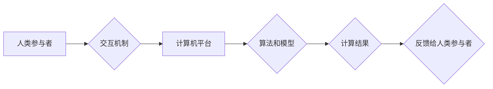

                 

## 科技向善的力量：利用人类计算造福人类

> 关键词： 人类计算、人工智能、协同计算、分布式计算、科技伦理、社会影响、可持续发展

### 1. 背景介绍

科技发展日新月异，人工智能（AI）作为科技发展的重要方向，正在深刻地改变着我们的生活。从自动驾驶到医疗诊断，从个性化教育到科学研究，AI技术的应用范围不断拓展，为人类社会带来了前所未有的机遇。然而，AI技术的发展也引发了人们对伦理、安全和社会影响的担忧。如何确保AI技术向善，造福人类，是摆在我们面前的重大挑战。

人类计算，作为一种新型的计算模式，以其独特的优势，为解决这一挑战提供了新的思路。人类计算是指利用人类的智慧、创造力和判断力，与计算机技术相结合，共同完成复杂的任务。这种模式强调人机协同，充分发挥人类和机器各自的优势，从而实现更高效、更智能的计算。

### 2. 核心概念与联系

#### 2.1 人类计算的本质

人类计算的核心概念是将人类的认知能力与计算机的计算能力相结合，形成一个协同的计算体系。

* **人类的优势:** 人类拥有强大的创造力、想象力和解决复杂问题的能力，能够进行抽象思维、理解上下文信息和做出基于情感和道德判断的决策。
* **计算机的优势:** 计算机拥有高速的计算能力、海量存储能力和精确的逻辑处理能力，能够快速处理大量数据、执行重复性任务和进行精确的计算。

#### 2.2 人类计算的架构

人类计算的架构通常包括以下几个关键要素：

* **人类参与者:** 包括专家、学者、普通民众等，他们提供人类的智慧、经验和判断力。
* **计算机平台:** 提供计算资源、数据存储和算法执行环境。
* **交互机制:** 允许人类参与者与计算机平台进行交互，例如通过界面输入数据、查看结果、提出问题等。
* **算法和模型:** 帮助计算机平台理解人类的输入，并根据人类的指令进行计算和决策。

**Mermaid 流程图**



### 3. 核心算法原理 & 具体操作步骤

#### 3.1 算法原理概述

人类计算的核心算法原理是将人类的智慧融入到计算机算法中，从而提升算法的智能性和适应性。常见的算法类型包括：

* **启发式算法:** 基于人类的经验和直觉，设计出一些启发性的规则，引导计算机进行搜索和决策。
* **机器学习算法:** 利用计算机学习人类的知识和模式，从而自动改进算法的性能。
* **深度学习算法:** 构建复杂的网络结构，模拟人类大脑的神经网络，能够处理更复杂的数据和任务。

#### 3.2 算法步骤详解

具体操作步骤取决于具体的算法类型和应用场景。以下是一个基于启发式算法的人类计算流程示例：

1. **问题定义:** 明确需要解决的问题，并将其转化为计算机可以理解的形式。
2. **知识获取:** 收集与问题相关的知识和数据，包括专家意见、文献资料、用户反馈等。
3. **规则设计:** 基于人类的经验和直觉，设计出一些启发性的规则，指导计算机进行搜索和决策。
4. **算法实现:** 将规则转化为计算机代码，并构建相应的算法模型。
5. **数据处理:** 将收集到的数据输入到算法模型中，并进行处理和分析。
6. **结果输出:** 根据算法的计算结果，输出相应的解决方案或建议。
7. **反馈和改进:** 收集用户反馈，并根据反馈信息对算法进行改进和优化。

#### 3.3 算法优缺点

**优点:**

* 能够解决传统算法难以解决的复杂问题。
* 能够更好地适应变化的环境和需求。
* 能够利用人类的智慧和经验，提高算法的智能性和可靠性。

**缺点:**

* 算法设计和实现需要人类的参与，成本较高。
* 算法的性能和准确性依赖于人类提供的知识和数据质量。
* 算法的解释性和透明度较低，难以理解算法的决策过程。

#### 3.4 算法应用领域

人类计算的应用领域非常广泛，包括：

* **科学研究:** 协助科学家进行数据分析、模型构建和实验设计。
* **医疗诊断:** 辅助医生进行疾病诊断、治疗方案制定和风险评估。
* **金融分析:** 帮助金融机构进行风险管理、投资决策和欺诈检测。
* **教育教学:** 提供个性化学习方案、智能辅导和知识评估。
* **创意设计:** 辅助设计师进行创意构思、方案设计和作品制作。

### 4. 数学模型和公式 & 详细讲解 & 举例说明

#### 4.1 数学模型构建

人类计算的数学模型通常基于概率论、统计学和信息论等学科。

* **概率论:** 用于描述人类决策的随机性，以及算法对不同输入的响应概率。
* **统计学:** 用于分析人类行为模式和数据趋势，并构建预测模型。
* **信息论:** 用于量化人类知识和信息的价值，以及算法的效率和准确性。

#### 4.2 公式推导过程

例如，在基于机器学习的人类计算模型中，可以使用贝叶斯定理来描述人类知识对算法的影响：

$$P(H|D) = \frac{P(D|H)P(H)}{P(D)}$$

其中：

* $P(H|D)$ 是给定证据 $D$ 下假设 $H$ 的概率。
* $P(D|H)$ 是假设 $H$ 下观察到证据 $D$ 的概率。
* $P(H)$ 是假设 $H$ 的先验概率。
* $P(D)$ 是观察到证据 $D$ 的概率。

#### 4.3 案例分析与讲解

假设我们有一个人类计算模型用于识别图像中的物体。

* $H$ 是假设图像中包含特定物体的事件。
* $D$ 是图像特征数据。
* $P(D|H)$ 是给定特定物体存在的情况下，观察到特定特征数据的概率。
* $P(H)$ 是特定物体存在于图像中的先验概率。
* $P(D)$ 是观察到特定特征数据的概率。

通过贝叶斯定理，我们可以根据人类提供的知识和图像特征数据，计算出图像中特定物体存在的概率。

### 5. 项目实践：代码实例和详细解释说明

#### 5.1 开发环境搭建

* **操作系统:** Linux 或 macOS
* **编程语言:** Python
* **库和框架:** TensorFlow、PyTorch、Scikit-learn 等

#### 5.2 源代码详细实现

以下是一个简单的基于机器学习的人类计算模型的代码示例，用于识别手写数字：

```python
import tensorflow as tf
from tensorflow.keras.datasets import mnist

# 加载 MNIST 数据集
(x_train, y_train), (x_test, y_test) = mnist.load_data()

# 数据预处理
x_train = x_train.astype('float32') / 255
x_test = x_test.astype('float32') / 255

# 定义模型
model = tf.keras.models.Sequential([
    tf.keras.layers.Flatten(input_shape=(28, 28)),
    tf.keras.layers.Dense(128, activation='relu'),
    tf.keras.layers.Dropout(0.2),
    tf.keras.layers.Dense(10, activation='softmax')
])

# 编译模型
model.compile(optimizer='adam',
              loss='sparse_categorical_crossentropy',
              metrics=['accuracy'])

# 训练模型
model.fit(x_train, y_train, epochs=5)

# 评估模型
loss, accuracy = model.evaluate(x_test, y_test)
print('Test loss:', loss)
print('Test accuracy:', accuracy)
```

#### 5.3 代码解读与分析

* 该代码使用 TensorFlow 库构建了一个简单的深度学习模型，用于识别手写数字。
* 模型包含一个全连接层和一个 softmax 层，用于分类。
* 使用 Adam 优化器和交叉熵损失函数进行训练。
* 训练完成后，使用测试集评估模型的性能。

#### 5.4 运行结果展示

运行该代码后，会输出模型在测试集上的损失值和准确率。

### 6. 实际应用场景

#### 6.1 医疗诊断辅助

人类计算可以帮助医生更快、更准确地诊断疾病。例如，可以利用专家知识和患者病历数据，构建一个机器学习模型，用于识别潜在的疾病风险。

#### 6.2 科学研究加速

人类计算可以加速科学研究，例如，可以利用人类的智慧和计算机的计算能力，进行大型科学模拟和数据分析，从而更快地发现新的科学规律。

#### 6.3 个性化教育

人类计算可以提供个性化的学习方案，根据学生的学习进度和需求，定制相应的学习内容和教学方法。

#### 6.4 创意设计辅助

人类计算可以辅助设计师进行创意设计，例如，可以利用人类的想象力和计算机的生成能力，共同设计出新的产品和艺术作品。

#### 6.4 未来应用展望

随着人工智能技术的不断发展，人类计算的应用场景将更加广泛，例如：

* **自动驾驶:** 利用人类的驾驶经验和计算机的感知能力，构建更安全的自动驾驶系统。
* **机器人协作:** 利用人类的指令和机器人的执行能力，实现更灵活和高效的机器人协作。
* **虚拟现实:** 利用人类的想象力和计算机的渲染能力，构建更逼真的虚拟现实体验。

### 7. 工具和资源推荐

#### 7.1 学习资源推荐

* **书籍:**

    * 《人类计算：人工智能与人类智慧的协同》
    * 《深度学习》
    * 《机器学习》

* **在线课程:**

    * Coursera: 人工智能课程
    * edX: 深度学习课程
    * Udacity: 机器学习工程师课程

#### 7.2 开发工具推荐

* **编程语言:** Python
* **机器学习库:** TensorFlow、PyTorch、Scikit-learn
* **数据可视化工具:** Matplotlib、Seaborn

#### 7.3 相关论文推荐

* **人类计算的定义和分类**
* **人类计算的算法和模型**
* **人类计算的应用案例和未来展望**

### 8. 总结：未来发展趋势与挑战

#### 8.1 研究成果总结

人类计算作为一种新型的计算模式，在解决复杂问题、提升算法智能性和适应性方面展现出巨大的潜力。

#### 8.2 未来发展趋势

* **更智能的人类计算模型:** 利用更先进的机器学习算法和深度学习技术，构建更智能、更灵活的人类计算模型。
* **更广泛的人类计算应用:** 将人类计算应用于更多领域，例如自动驾驶、机器人协作、虚拟现实等。
* **更有效的协同机制:** 设计更有效的交互机制，更好地连接人类和计算机，实现更紧密的协同。

#### 8.3 面临的挑战

* **算法解释性和透明度:** 提升人类计算模型的解释性和透明度，使其决策过程更加可理解和可信赖。
* **数据安全和隐私保护:** 确保人类计算过程中数据的安全和隐私，避免数据泄露和滥用。
* **伦理和社会影响:** 关注人类计算的伦理和社会影响，确保其发展方向符合人类利益。

#### 8.4 研究展望

未来，人类计算的研究将继续深入，探索更智能、更安全、更可持续的人类计算模式，为人类社会创造更大的价值。

### 9. 附录：常见问题与解答

* **什么是人类计算？**

人类计算是一种新型的计算模式，将人类的智慧与计算机的计算能力相结合，共同完成复杂的任务。

* **人类计算有哪些优势？**

人类计算能够解决传统算法难以解决的复杂问题，更好地适应变化的环境和需求，并利用人类的智慧和经验，提高算法的智能性和可靠性。

* **人类计算有哪些应用场景？**

人类计算的应用场景非常广泛，包括科学研究、医疗诊断、金融分析、教育教学、创意设计等。

* **人类计算面临哪些挑战？**

人类计算面临着算法解释性和透明度、数据安全和隐私保护、伦理和社会影响等挑战。


作者：禅与计算机程序设计艺术 / Zen and the Art of Computer Programming 
<end_of_turn>

