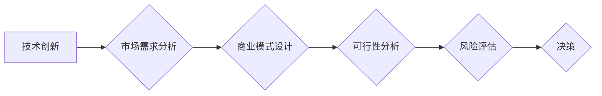

                 

## 程序员如何评估创业机会

> 关键词：创业机会、技术评估、市场分析、商业模式、可行性分析、程序员思维、风险评估

## 1. 背景介绍

作为一名程序员，你可能拥有着颠覆性的技术想法，渴望将之付诸实践，打造属于自己的创业项目。然而，仅仅拥有技术创新并不能保证创业成功的概率。 成功的创业需要对市场、用户、商业模式等多方面进行深入的评估和分析。本文将从程序员的视角出发，探讨如何评估创业机会，帮助你理性判断项目的可行性和成功潜力。

## 2. 核心概念与联系

创业机会的评估是一个复杂的过程，涉及到技术、市场、商业模式等多个维度。 我们可以将其抽象为一个流程图，以便更好地理解各个环节之间的联系：



**核心概念原理和架构:**

* **技术创新:**  创业机会的核心往往源于一项具有创新性的技术，它可以解决现有问题，提供新的价值，或者颠覆现有模式。
* **市场需求分析:**  技术创新需要有市场需求作为支撑。 创业者需要深入了解目标用户的痛点、需求和行为，验证技术创新是否能够满足市场需求。
* **商业模式设计:**  商业模式是指企业如何创造、传递和捕获价值的模式。 创业者需要设计一个可行的商业模式，明确收入来源、成本结构、客户获取策略等关键要素。
* **可行性分析:**  可行性分析是指对创业项目的各项要素进行评估，判断其是否能够实现预期目标。 
* **风险评估:**  创业项目不可避免地存在风险，创业者需要识别和评估潜在风险，制定相应的应对措施。
* **决策:**  最终，创业者需要根据对创业机会的评估结果，做出是否启动项目的决策。

## 3. 核心算法原理 & 具体操作步骤

在评估创业机会的过程中，程序员可以运用其擅长的算法思维和逻辑分析能力，帮助进行更深入的分析和判断。 以下是一些常用的算法和操作步骤：

### 3.1  算法原理概述

* **数据分析算法:**  程序员可以利用数据分析算法，从海量数据中挖掘出有价值的信息，例如用户行为分析、市场趋势分析等。
* **预测算法:**  程序员可以利用预测算法，预测未来市场需求、用户行为等，为创业项目提供决策依据。
* **优化算法:**  程序员可以利用优化算法，优化创业项目的各项指标，例如成本控制、资源分配等。

### 3.2  算法步骤详解

1. **数据收集:**  收集与创业项目相关的各种数据，例如市场数据、用户数据、竞争对手数据等。
2. **数据清洗:**  对收集到的数据进行清洗和处理，去除无效数据、错误数据等。
3. **数据分析:**  利用数据分析算法，对数据进行分析，挖掘出有价值的信息。
4. **模型构建:**  根据分析结果，构建预测模型或优化模型。
5. **模型评估:**  对模型进行评估，验证其准确性和有效性。
6. **决策支持:**  根据模型预测结果，为创业项目决策提供支持。

### 3.3  算法优缺点

* **优点:**  算法可以帮助程序员进行更深入、更准确的分析，提高决策的科学性。
* **缺点:**  算法的准确性依赖于数据的质量和模型的构建，如果数据不准确或模型构建不当，算法的结果可能存在偏差。

### 3.4  算法应用领域

* **市场分析:**  预测市场需求、分析用户行为、识别市场趋势等。
* **商业模式设计:**  优化定价策略、选择合适的销售渠道、设计有效的营销方案等。
* **风险评估:**  识别潜在风险、评估风险程度、制定风险应对措施等。

## 4. 数学模型和公式 & 详细讲解 & 举例说明

在评估创业机会的过程中，程序员可以利用数学模型和公式进行量化分析，例如：

### 4.1  数学模型构建

* **市场规模模型:**  可以利用市场规模模型，预测目标市场的规模和增长潜力。
* **用户增长模型:**  可以利用用户增长模型，预测用户数量的增长趋势。
* **收入模型:**  可以利用收入模型，预测项目的收入潜力。

### 4.2  公式推导过程

例如，一个简单的市场规模模型可以表示为：

$$
Market Size = Target Population * Penetration Rate * Average Revenue Per User
$$

其中：

* **Target Population:** 目标用户群体数量
* **Penetration Rate:** 市场渗透率，即目标用户群体中使用该产品的比例
* **Average Revenue Per User:** 每位用户的平均收入

### 4.3  案例分析与讲解

假设目标用户群体为1000万人，市场渗透率为10%，每位用户的平均收入为100元，则该市场的规模为：

$$
Market Size = 10,000,000 * 0.1 * 100 = 1,000,000,000 元
$$

## 5. 项目实践：代码实例和详细解释说明

以下是一个简单的 Python 代码实例，用于计算市场规模：

```python
target_population = 10000000  # 目标用户群体数量
penetration_rate = 0.1  # 市场渗透率
average_revenue_per_user = 100  # 每位用户的平均收入

market_size = target_population * penetration_rate * average_revenue_per_user

print(f"该市场的规模为：{market_size} 元")
```

### 5.1  开发环境搭建

* Python 3.x 环境
* Jupyter Notebook 或其他 Python IDE

### 5.2  源代码详细实现

代码已在上述章节中提供。

### 5.3  代码解读与分析

代码首先定义了三个变量，分别代表目标用户群体数量、市场渗透率和每位用户的平均收入。然后，利用公式计算市场规模，并使用 f-string 格式化输出结果。

### 5.4  运行结果展示

运行代码后，输出结果为：

```
该市场的规模为：1000000000 元
```

## 6. 实际应用场景

程序员可以将上述算法和模型应用于各种创业机会的评估，例如：

* **SaaS 产品:**  评估市场规模、用户增长潜力、收入模式等。
* **移动应用:**  分析用户行为、预测下载量、评估盈利能力等。
* **电商平台:**  预测商品销量、优化库存管理、设计营销策略等。

### 6.4  未来应用展望

随着人工智能技术的不断发展，程序员将能够利用更先进的算法和模型，进行更深入、更精准的创业机会评估。

## 7. 工具和资源推荐

### 7.1  学习资源推荐

* **书籍:**  《Lean Startup》、《The Mom Test》、《Zero to One》
* **在线课程:**  Coursera、edX、Udacity 等平台上的创业课程
* **博客和网站:**  TechCrunch、VentureBeat、Product Hunt 等

### 7.2  开发工具推荐

* **数据分析工具:**  Python、R、Tableau、Power BI 等
* **预测模型工具:**  Scikit-learn、TensorFlow、PyTorch 等
* **项目管理工具:**  Trello、Asana、Jira 等

### 7.3  相关论文推荐

* **市场规模预测:**  "Forecasting Market Size: A Review of Methods and Applications"
* **用户增长模型:**  "Modeling User Growth in Social Networks"
* **收入模型:**  "Revenue Modeling for SaaS Products"

## 8. 总结：未来发展趋势与挑战

### 8.1  研究成果总结

本文探讨了程序员如何评估创业机会，介绍了算法思维、数学模型、代码实例等相关内容，并推荐了一些学习资源和工具。

### 8.2  未来发展趋势

未来，人工智能技术将进一步推动创业机会评估的智能化和自动化，程序员将能够利用更先进的算法和模型，进行更深入、更精准的分析。

### 8.3  面临的挑战

* **数据质量:**  算法的准确性依赖于数据的质量，如何获取高质量的数据仍然是一个挑战。
* **模型构建:**  如何构建准确、有效的模型仍然是一个技术难题。
* **伦理问题:**  人工智能技术在创业机会评估中的应用，也需要考虑伦理问题，例如数据隐私、算法偏见等。

### 8.4  研究展望

未来，需要进一步研究人工智能技术在创业机会评估中的应用，探索更先进的算法和模型，并解决相关伦理问题。

## 9. 附录：常见问题与解答

* **Q1: 如何获取高质量的数据？**

A1: 可以通过以下方式获取高质量的数据：

* **公开数据:**  政府网站、学术机构、行业协会等机构发布的公开数据。
* **第三方平台:**  一些第三方平台提供数据服务，例如数据湖、数据市场等。
* **用户调研:**  通过问卷调查、访谈等方式收集用户数据。

* **Q2: 如何构建准确有效的模型？**

A2: 构建准确有效的模型需要以下步骤：

* **数据预处理:**  对数据进行清洗、转换、特征工程等处理。
* **模型选择:**  根据实际需求选择合适的模型，例如线性回归、逻辑回归、决策树等。
* **模型训练:**  利用训练数据训练模型，并调整模型参数。
* **模型评估:**  利用测试数据评估模型的性能，例如准确率、召回率、F1-score等。

* **Q3:  人工智能技术在创业机会评估中的应用会带来哪些伦理问题？**

A3:  人工智能技术在创业机会评估中的应用，也需要考虑以下伦理问题：

* **数据隐私:**  需要确保用户数据的隐私安全，避免滥用用户数据。
* **算法偏见:**  算法模型可能会存在偏见，导致不公平的结果，需要进行算法审计和优化。
* **透明度和可解释性:**  算法模型的决策过程需要透明可解释，避免黑箱决策。


作者：禅与计算机程序设计艺术 / Zen and the Art of Computer Programming 
<end_of_turn>

