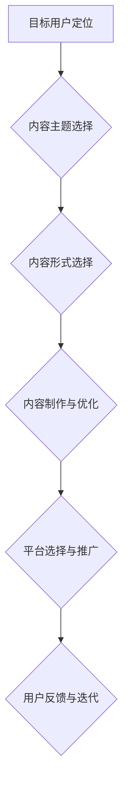

                 

## 程序员如何进行知识付费的内容规划

> 关键词：知识付费、程序员、内容规划、技术博客、在线课程、技术社区、品牌建设、市场营销

## 1. 背景介绍

随着互联网的蓬勃发展和科技的日新月异，程序员的需求量持续增长，同时也催生了知识付费市场的新机遇。程序员拥有丰富的技术经验和专业技能，可以通过知识付费的方式分享他们的知识和经验，帮助其他程序员提升技能，并获得经济回报。

然而，知识付费并非易事。想要在激烈的市场竞争中脱颖而出，程序员需要进行精心策划的内容规划，才能吸引目标用户，建立品牌影响力，最终实现商业成功。

## 2. 核心概念与联系

知识付费的核心概念在于将程序员的专业知识和技能转化为有价值的内容，并通过线上平台进行销售和传播。

**知识付费内容规划的流程图：**



**核心概念解释：**

* **目标用户定位:** 首先要明确目标用户的需求和痛点，例如初学者、进阶程序员、特定领域专家等。
* **内容主题选择:** 根据目标用户的需求，选择具有价值和吸引力的技术主题，例如编程语言、框架、算法、设计模式等。
* **内容形式选择:** 根据目标用户和内容主题，选择合适的知识付费形式，例如技术博客文章、在线课程、视频教程、电子书等。
* **内容制作与优化:** 制作高质量、易于理解的内容，并进行优化，例如排版、图片、视频等。
* **平台选择与推广:** 选择合适的知识付费平台，并进行有效的推广，例如微信公众号、知乎、B站等。
* **用户反馈与迭代:** 收集用户反馈，不断迭代和改进内容，以满足用户的需求。

## 3. 核心算法原理 & 具体操作步骤

**3.1 算法原理概述**

知识付费内容规划的核心算法可以看作是一个迭代优化算法，其目标是最大化用户价值和商业收益。

**3.2 算法步骤详解**

1. **数据收集与分析:** 收集用户数据，例如用户画像、阅读习惯、付费行为等，分析用户需求和痛点。
2. **内容主题挖掘:** 基于用户数据分析，挖掘具有价值和吸引力的技术主题。
3. **内容形式选择:** 根据用户数据和主题特性，选择合适的知识付费形式。
4. **内容制作与优化:** 制作高质量、易于理解的内容，并进行优化，例如排版、图片、视频等。
5. **平台选择与推广:** 选择合适的知识付费平台，并进行有效的推广，例如微信公众号、知乎、B站等。
6. **用户反馈收集与分析:** 收集用户反馈，例如评论、评分、购买行为等，分析用户对内容的接受度和满意度。
7. **内容迭代优化:** 根据用户反馈，不断迭代和改进内容，以满足用户的需求。

**3.3 算法优缺点**

* **优点:** 能够根据用户需求和市场变化进行动态调整，提高内容的价值和吸引力。
* **缺点:** 需要持续收集和分析用户数据，并进行内容迭代优化，需要投入一定的成本和时间。

**3.4 算法应用领域**

该算法可以应用于各种知识付费领域，例如编程、设计、营销、管理等。

## 4. 数学模型和公式 & 详细讲解 & 举例说明

**4.1 数学模型构建**

知识付费内容规划可以构建一个数学模型，以量化用户价值和商业收益。

**用户价值模型:**

$$
UV = \sum_{i=1}^{n} \frac{U_i}{C_i}
$$

其中：

* $UV$ 表示用户价值
* $U_i$ 表示用户 $i$ 的价值
* $C_i$ 表示用户 $i$ 的成本

**商业收益模型:**

$$
BR = \sum_{i=1}^{n} P_i \times Q_i
$$

其中：

* $BR$ 表示商业收益
* $P_i$ 表示产品 $i$ 的价格
* $Q_i$ 表示产品 $i$ 的销量

**4.2 公式推导过程**

用户价值模型的推导过程基于用户行为分析，假设用户价值与用户获取的知识价值和付出的成本成正比。商业收益模型的推导过程基于市场需求分析，假设商业收益与产品价格和销量成正比。

**4.3 案例分析与讲解**

假设一个程序员发布了一门在线课程，课程价格为 100 元，销量为 100 人，则商业收益为 100 元/人 * 100 人 = 10000 元。

如果课程能够帮助用户提升技能，并获得更高的薪资，则用户价值将大于课程成本，从而实现知识付费的价值传递。

## 5. 项目实践：代码实例和详细解释说明

**5.1 开发环境搭建**

* 操作系统: Windows/macOS/Linux
* 编程语言: Python
* 开发工具: VS Code/Sublime Text
* 知识付费平台: Teachable/Udemy/Thinkific

**5.2 源代码详细实现**

```python
# 知识付费内容规划工具

def analyze_user_data(user_data):
    # 分析用户数据，例如用户画像、阅读习惯、付费行为等
    pass

def recommend_content_themes(user_data):
    # 基于用户数据分析，推荐具有价值和吸引力的技术主题
    pass

def select_content_format(theme):
    # 根据主题特性，选择合适的知识付费形式
    pass

def create_content(theme, format):
    # 制作高质量、易于理解的内容
    pass

def promote_content(platform):
    # 选择合适的平台，进行有效的推广
    pass

def collect_user_feedback(content):
    # 收集用户反馈，例如评论、评分、购买行为等
    pass

def iterate_content(feedback):
    # 根据用户反馈，不断迭代和改进内容
    pass

# 示例用法
user_data = {
    "age": 25,
    "occupation": "software engineer",
    "interests": ["python", "machine learning"],
}

theme = recommend_content_themes(user_data)
format = select_content_format(theme)
content = create_content(theme, format)
platform = "youtube"
promote_content(platform)
feedback = collect_user_feedback(content)
iterate_content(feedback)
```

**5.3 代码解读与分析**

该代码示例展示了知识付费内容规划工具的基本框架，包括用户数据分析、主题推荐、内容形式选择、内容制作、推广、用户反馈收集和内容迭代等步骤。

**5.4 运行结果展示**

运行该代码示例，可以生成一份知识付费内容规划报告，包括目标用户画像、推荐内容主题、内容形式选择、推广平台建议等。

## 6. 实际应用场景

**6.1 在线课程平台**

程序员可以利用在线课程平台，例如 Teachable、Udemy、Thinkific 等，发布编程语言、框架、算法、设计模式等方面的在线课程。

**6.2 技术博客**

程序员可以开设技术博客，分享自己的编程经验、技术文章、项目案例等，并通过广告、赞助、会员订阅等方式获得收入。

**6.3 技术社区**

程序员可以参与技术社区，例如 Stack Overflow、GitHub、知乎等，回答用户问题、分享技术 insights，并通过社区积分、赞赏等方式获得收益。

**6.4 咨询服务**

程序员可以提供技术咨询服务，例如代码审计、性能优化、架构设计等，并根据服务内容和时间收费。

**6.5 书籍出版**

程序员可以撰写技术书籍，例如编程语言教程、框架指南、算法讲解等，并通过出版社或自出版平台进行销售。

**6.4 未来应用展望**

随着人工智能、虚拟现实、增强现实等技术的不断发展，知识付费的应用场景将更加丰富多样。例如，程序员可以利用人工智能技术，开发个性化学习方案，并通过虚拟现实或增强现实技术，提供更加沉浸式的学习体验。

## 7. 工具和资源推荐

**7.1 学习资源推荐**

* **在线课程平台:** Coursera、edX、Udacity、Udemy
* **技术博客:** Hacker News、Medium、Dev.to
* **技术社区:** Stack Overflow、GitHub、知乎

**7.2 开发工具推荐**

* **代码编辑器:** VS Code、Sublime Text、Atom
* **版本控制系统:** Git、GitHub
* **项目管理工具:** Trello、Asana、Jira

**7.3 相关论文推荐**

* **The Economics of Online Education**
* **The Impact of Online Learning on Student Outcomes**
* **The Future of Knowledge Sharing**

## 8. 总结：未来发展趋势与挑战

**8.1 研究成果总结**

知识付费已成为一种重要的知识传播和商业模式，程序员可以通过知识付费的方式分享他们的专业技能，并获得经济回报。

**8.2 未来发展趋势**

* **个性化学习:** 利用人工智能技术，开发个性化学习方案，满足不同用户的学习需求。
* **沉浸式学习:** 利用虚拟现实或增强现实技术，提供更加沉浸式的学习体验。
* **跨平台融合:** 将知识付费内容整合到多个平台，例如社交媒体、游戏平台等。

**8.3 面临的挑战**

* **内容质量:** 确保知识付费内容的质量和价值，避免低质量内容的泛滥。
* **用户信任:** 建立用户对知识付费平台和内容的信任，避免知识付费市场的不规范现象。
* **商业模式创新:** 探索新的知识付费商业模式，提高知识付费的盈利能力。

**8.4 研究展望**

未来，知识付费领域将继续发展和创新，程序员需要不断学习和提升，才能在知识付费市场中取得成功。


## 9. 附录：常见问题与解答

**9.1 如何选择合适的知识付费平台？**

选择合适的知识付费平台需要考虑以下因素：

* **目标用户群体:** 不同的平台拥有不同的用户群体，需要选择与目标用户群体相匹配的平台。
* **内容形式:** 不同的平台支持不同的内容形式，例如视频、音频、文字等，需要选择支持目标内容形式的平台。
* **平台费用:** 不同的平台有不同的费用结构，需要根据自身预算选择合适的平台。

**9.2 如何提高知识付费内容的质量？**

提高知识付费内容的质量需要以下几点：

* **深入研究主题:** 对目标主题进行深入研究，确保内容的准确性和深度。
* **清晰易懂的表达:** 使用简洁明了的语言，避免使用过于专业的术语。
* **丰富的案例分析:** 通过案例分析，使内容更加生动形象，更容易理解。
* **持续更新:** 定期更新内容，保持内容的时效性和价值。


作者：禅与计算机程序设计艺术 / Zen and the Art of Computer Programming 
<end_of_turn>

