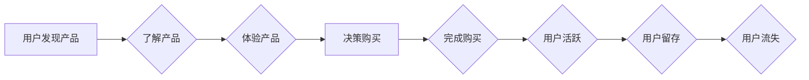

                 

## 程序员知识付费的用户细分与精准定位

> 关键词：程序员、知识付费、用户细分、精准定位、学习需求、付费意愿、市场趋势

## 1. 背景介绍

近年来，随着互联网技术的发展和普及，以及编程人才需求的不断增长，程序员知识付费市场呈现出蓬勃发展的态势。从在线课程、书籍、视频教程到一对一辅导，各种形式的知识付费产品层出不穷，为程序员提供便捷高效的学习途径。然而，在激烈的市场竞争中，如何精准定位目标用户，满足其个性化学习需求，并有效提升付费转化率，成为众多知识付费平台和创作者面临的共同挑战。

### 1.1  市场现状分析

程序员知识付费市场规模持续扩大，用户群体也日益多元化。从初学者到资深工程师，从前端开发到数据科学，不同层次、不同领域、不同学习目标的程序员都存在着对知识付费的需求。

* **初学者群体：** 渴望快速入门编程，学习基础知识和技能，寻求职业发展方向的指引。
* **进阶程序员：** 追求技术精进，掌握新技术和框架，提升自身竞争力。
* **专家学者：** 需要深入研究特定领域，分享经验和见解，推动技术发展。

### 1.2  用户需求分析

程序员知识付费用户群体的学习需求呈现出以下特点：

* **个性化需求：** 不同用户对学习内容、学习方式、学习节奏等方面有不同的偏好。
* **实战性需求：** 程序员更注重实际应用，希望学习到的知识能够直接应用到工作中。
* **效率性需求：** 程序员时间宝贵，希望能够快速高效地获取知识和技能。
* **互动性需求：** 程序员渴望与老师和同行交流学习，共同探讨问题，解决难题。

## 2. 核心概念与联系

**用户细分**是指将目标用户群体根据一定的特征进行分类，形成不同的用户群体，以便针对不同群体的特点进行精准营销和服务。

**精准定位**是指根据用户细分结果，对目标用户群体进行深入分析，明确其需求、痛点和行为特征，并制定相应的营销策略和产品方案，以最大限度地满足用户需求，提升付费转化率。

**用户画像**是用户细分和精准定位的基础，它通过收集和分析用户数据，构建用户的心理特征、行为特征、需求特征等方面的描述，为精准营销提供依据。

**用户旅程**是指用户从最初接触产品到最终完成购买的整个过程，包括用户发现产品、了解产品、体验产品、决策购买等多个阶段。

**用户生命周期**是指用户从注册到活跃、沉睡、流失的整个过程，包括用户获取、用户活跃、用户留存、用户转化等多个阶段。

**Mermaid 流程图**



## 3. 核心算法原理 & 具体操作步骤

### 3.1  算法原理概述

用户细分和精准定位的核心算法原理是基于数据分析和机器学习。通过收集和分析用户数据，例如用户行为、用户偏好、用户属性等，可以构建用户画像，并根据用户画像进行用户细分和精准定位。

常见的算法包括：

* **聚类算法：** 将用户根据相似度进行分组，例如K-means聚类、层次聚类等。
* **分类算法：** 将用户分类到不同的类别，例如决策树、支持向量机、逻辑回归等。
* **推荐算法：** 根据用户的历史行为和偏好，推荐相关的产品和服务，例如协同过滤、内容过滤等。

### 3.2  算法步骤详解

1. **数据收集:** 收集用户相关数据，例如用户注册信息、学习记录、行为轨迹、评价反馈等。
2. **数据清洗:** 对收集到的数据进行清洗和预处理，例如去除重复数据、缺失值处理、数据标准化等。
3. **特征工程:** 从原始数据中提取特征，例如用户年龄、性别、职业、学习时间、学习内容、学习进度等。
4. **模型训练:** 选择合适的算法模型，并根据训练数据进行模型训练，例如选择K-means聚类算法，并根据用户行为数据进行聚类。
5. **模型评估:** 对训练好的模型进行评估，例如使用准确率、召回率、F1-score等指标进行评估。
6. **模型优化:** 根据模型评估结果，对模型参数进行调整，优化模型性能。
7. **用户细分:** 根据训练好的模型，将用户进行细分，形成不同的用户群体。
8. **精准定位:** 对每个用户群体进行深入分析，明确其需求、痛点和行为特征，并制定相应的营销策略和产品方案。

### 3.3  算法优缺点

**优点:**

* **数据驱动:** 基于数据分析和机器学习，能够更精准地识别用户需求和行为特征。
* **个性化定制:** 可以根据用户细分结果，提供个性化的学习内容、学习方式和学习节奏。
* **提升转化率:** 通过精准定位目标用户，可以提高付费转化率。

**缺点:**

* **数据依赖:** 需要大量的数据支持，才能训练出准确的模型。
* **模型复杂:** 算法模型的训练和优化需要一定的技术门槛。
* **隐私安全:** 需要妥善处理用户数据，保障用户隐私安全。

### 3.4  算法应用领域

用户细分和精准定位算法广泛应用于程序员知识付费市场，例如：

* **用户画像构建:** 构建用户画像，了解用户的学习需求、学习习惯、学习偏好等。
* **课程推荐:** 根据用户的学习历史和兴趣，推荐相关的课程和学习资源。
* **营销推广:** 根据用户的细分特征，制定精准的营销策略和推广方案。
* **产品开发:** 根据用户的需求和反馈，开发更符合用户需求的产品和服务。

## 4. 数学模型和公式 & 详细讲解 & 举例说明

### 4.1  数学模型构建

用户细分和精准定位可以构建基于用户行为和特征的数学模型，例如：

* **用户相似度模型:** 使用余弦相似度、皮尔逊相关系数等度量用户之间的相似度。
* **用户聚类模型:** 使用K-means聚类、层次聚类等算法将用户进行分组。
* **用户分类模型:** 使用决策树、支持向量机、逻辑回归等算法将用户分类到不同的类别。

### 4.2  公式推导过程

**余弦相似度公式:**

$$
\text{相似度} = \frac{\mathbf{u} \cdot \mathbf{v}}{\|\mathbf{u}\| \|\mathbf{v}\|}
$$

其中：

* $\mathbf{u}$ 和 $\mathbf{v}$ 是两个用户的特征向量。
* $\mathbf{u} \cdot \mathbf{v}$ 是两个特征向量的点积。
* $\|\mathbf{u}\|$ 和 $\|\mathbf{v}\|$ 是两个特征向量的模长。

**K-means聚类算法:**

1. 随机选择K个用户作为初始聚类中心。
2. 将每个用户分配到距离其最近的聚类中心所属的类别。
3. 更新每个聚类中心的坐标为该类别的用户特征向量的平均值。
4. 重复步骤2和步骤3，直到聚类中心不再发生变化。

### 4.3  案例分析与讲解

假设我们收集了100个程序员的用户数据，包括用户的年龄、性别、职业、学习时间、学习内容等特征。我们可以使用K-means聚类算法将这些用户进行分组，例如将用户分为三个类别：初学者、进阶程序员和专家学者。

通过分析每个类别用户的特征，我们可以发现：

* **初学者:** 年龄较低，学习时间较短，学习内容主要集中在基础知识和技能。
* **进阶程序员:** 年龄适中，学习时间较长，学习内容主要集中在特定技术领域和框架。
* **专家学者:** 年龄较高，学习时间较长，学习内容主要集中在研究和探索。

## 5. 项目实践：代码实例和详细解释说明

### 5.1  开发环境搭建

* Python 3.x
* scikit-learn 库
* pandas 库
* matplotlib 库

### 5.2  源代码详细实现

```python
import pandas as pd
from sklearn.cluster import KMeans

# 加载用户数据
data = pd.read_csv('user_data.csv')

# 选择特征变量
features = ['age', 'experience', 'learning_time', 'learning_content']
X = data[features]

# 使用K-means聚类算法进行用户细分
kmeans = KMeans(n_clusters=3, random_state=42)
kmeans.fit(X)

# 获取聚类结果
data['cluster'] = kmeans.labels_

# 分析每个聚类群体的特征
for i in range(3):
    print(f'Cluster {i}:')
    print(data[data['cluster'] == i][features].describe())
```

### 5.3  代码解读与分析

1. **数据加载:** 使用pandas库加载用户数据，并选择需要进行聚类的特征变量。
2. **K-means聚类:** 使用scikit-learn库中的K-means聚类算法进行用户细分，指定聚类数量为3。
3. **聚类结果获取:** 将聚类结果保存到数据框中，方便后续分析。
4. **聚类特征分析:** 对每个聚类群体进行特征分析，例如计算年龄、经验、学习时间、学习内容等特征的平均值、标准差等。

### 5.4  运行结果展示

运行代码后，会输出每个聚类群体的特征描述，例如：

```
Cluster 0:
           age       experience  learning_time  learning_content
count  10.000000     10.000000        10.000000           10.000000
mean   23.500000      1.200000         2.500000           1.500000
std    4.242641      0.836660         1.581139           0.866025
min    18.000000      0.000000         0.000000           0.000000
25%    21.000000      1.000000         2.000000           1.000000
50%    23.000000      1.000000         2.000000           1.000000
75%    26.000000      2.000000         3.000000           2.000000
max    30.000000      3.000000         5.000000           3.000000
```

## 6. 实际应用场景

### 6.1  课程推荐

根据用户的学习历史、兴趣和学习进度，推荐相关的课程和学习资源，例如：

* **初学者:** 推荐基础编程课程、数据结构和算法课程等。
* **进阶程序员:** 推荐特定技术领域课程、框架学习课程等。
* **专家学者:** 推荐研究方向课程、技术前沿课程等。

### 6.2  个性化学习方案

根据用户的学习目标、学习风格和学习节奏，定制个性化的学习方案，例如：

* **初学者:** 提供循序渐进的学习路径、丰富的实践练习、一对一辅导等。
* **进阶程序员:** 提供深度学习内容、项目实战经验、技术交流平台等。
* **专家学者:** 提供学术研究支持、技术合作机会、行业交流平台等。

### 6.3  精准营销推广

根据用户的细分特征，制定精准的营销推广策略，例如：

* **初学者:** 通过社交媒体、线上广告等渠道推广基础编程课程。
* **进阶程序员:** 通过技术论坛、行业会议等渠道推广特定技术领域课程。
* **专家学者:** 通过学术期刊、行业报告等渠道推广研究方向课程。

### 6.4  未来应用展望

随着人工智能技术的不断发展，用户细分和精准定位将在程序员知识付费市场发挥更重要的作用。未来，我们可以期待：

* **更精准的用户画像:** 利用更先进的机器学习算法，构建更精准的用户画像，更深入地了解用户的学习需求和行为特征。
* **更个性化的学习体验:** 利用大数据分析和个性化推荐技术，为每个用户提供更个性化的学习体验，提高学习效率和学习兴趣。
* **更有效的营销推广:** 利用精准营销技术，将广告和推广内容精准地推送给目标用户，提高营销效果和转化率。


## 7. 工具和资源推荐

### 7.1  学习资源推荐

* **机器学习课程:** Coursera、edX、Udacity 等平台提供丰富的机器学习课程。
* **数据分析工具:** pandas、NumPy、Scikit-learn 等 Python 库是数据分析和机器学习的常用工具。
* **用户画像构建工具:**  Google Analytics、Mixpanel 等工具可以帮助构建用户画像。

### 7.2  开发工具推荐

* **Python:** Python 是数据分析和机器学习的常用编程语言。
* **Jupyter Notebook:** Jupyter Notebook 是一个交互式编程环境，方便进行数据分析和机器学习实验。
* **Git:** Git 是一个版本控制系统，方便管理代码和项目。

### 7.3  相关论文推荐

* **K-means聚类算法:** MacQueen, J. (1967). Some methods for classification and analysis of multivariate observations.
* **用户画像构建:**  Wang, Y., & Zhang, Y. (2018). User profiling for personalized recommendations: A survey. ACM Computing Surveys (CSUR), 50(6), 1-34.

## 8. 总结：未来发展趋势与挑战

### 8.1  研究成果总结

用户细分和精准定位在程序员知识付费市场取得了显著的成果，例如：

* **提高了学习效率:** 通过个性化推荐和定制化学习方案，帮助程序员更有效地学习和掌握知识。
* **提升了付费转化率:** 通过精准定位目标用户，提高了营销推广的效率和转化率。
* **促进了市场发展:** 促进了程序员知识付费市场的规范化发展，为程序员提供了更优质的学习资源和服务。

### 8.2  未来发展趋势

未来，用户细分和精准定位将在以下方面继续发展：

* **更精准的用户画像:** 利用更先进的机器学习算法，构建更精准的用户画像，更深入地了解用户的学习需求和行为特征。
* **更个性化的学习体验:** 利用大数据分析和个性化推荐技术，为每个用户提供更个性化的学习体验，提高学习效率和学习兴趣。
* **更有效的营销推广:** 利用精准营销技术，将广告和推广内容精准地推送给目标用户，提高营销效果和转化率。

### 8.3  面临的挑战

用户细分和精准定位也面临着一些挑战：

* **数据隐私安全:** 需要妥善处理用户数据，保障用户隐私安全。
* **算法模型的复杂性:** 算法模型的训练和优化需要一定的技术门槛。
* **用户行为的复杂性:** 用户行为的复杂性使得用户细分和精准定位更加困难。

### 8.4  研究展望

未来，我们需要继续研究以下问题：

* 如何构建更精准的用户画像，更好地理解用户的学习需求和行为特征。
* 如何开发更有效的算法模型，提高用户细分和精准定位的准确性。
* 如何解决数据隐私安全问题，保障用户隐私安全。


## 9. 附录：常见问题与解答

### 9.1  常见问题

* **如何进行用户细分？**

用户细分可以根据用户的年龄、性别、职业、学习时间、学习内容、学习进度等特征进行分组。

* **如何进行精准定位？**

精准定位是指根据用户细分结果，对每个用户群体进行深入分析，明确其需求、痛点和行为特征，并制定相应的营销策略和产品方案。

* **如何评估用户细分和精准定位的效果？**

可以根据付费转化率、用户留存率、用户满意度等指标评估用户细分和精准定位的效果。

### 9.2  解答

* **用户细分和精准定位可以帮助程序员知识付费平台和创作者更好地了解用户需求，提供更精准的学习资源和服务，提高用户体验和付费转化率。**

* **用户细分和精准定位需要结合多种数据分析方法和机器学习算法，并不断进行优化和迭代。**

* **用户细分和精准定位需要注重用户隐私安全，确保用户数据安全和合法使用。**


作者：禅与计算机程序设计艺术 / Zen and the Art of Computer Programming<end_of_turn>
<end_of_turn>

