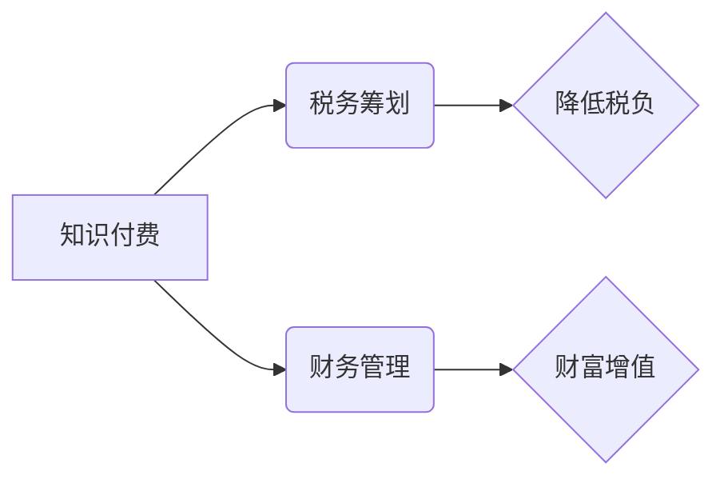

                 

## 程序员知识付费的税务筹划与财务管理

> 关键词：知识付费、程序员、税务筹划、财务管理、个人所得税、税收政策、投资理财

## 1. 背景介绍

近年来，随着互联网技术的发展和知识经济的兴起，知识付费行业蓬勃发展，程序员作为技术人才，也成为了知识付费领域的佼佼者。许多程序员通过线上课程、书籍、博客等方式分享自己的技术经验和知识，并从中获得收益。然而，知识付费也带来了新的挑战，例如税务筹划和财务管理。

程序员知识付费的税务筹划和财务管理，对于程序员来说至关重要。合理的税务筹划可以有效降低税负，提高收入可支配性。而良好的财务管理则可以帮助程序员更好地规划财务，实现财富增值。

## 2. 核心概念与联系

**2.1 知识付费模式**

知识付费是指通过付费的方式获取知识和技能。它涵盖了多种形式，例如：

* **在线课程:**  通过视频、音频、文字等形式，教授特定技能或知识。
* **书籍出版:**  将知识和经验以书本形式出版，供读者学习。
* **博客和公众号:**  通过定期发布文章，分享技术经验和见解，并通过广告、会员等方式获取收益。
* **技术咨询:**  为企业或个人提供技术咨询服务，解决技术难题。

**2.2 税务筹划**

税务筹划是指在法律允许的范围内，通过合理安排收入和支出，降低税负的一种行为。

**2.3 财务管理**

财务管理是指企业或个人管理资金的活动，包括筹集资金、分配资金、控制资金和利用资金等。

**2.4 核心概念关系图**



## 3. 核心算法原理 & 具体操作步骤

**3.1 算法原理概述**

本节将介绍程序员知识付费的税务筹划和财务管理中常用的算法原理，例如：

* **个人所得税计算算法:**  根据程序员的收入情况，计算应缴纳的个人所得税。
* **投资理财算法:**  根据程序员的风险承受能力和投资目标，选择合适的投资理财产品。
* **财务预算算法:**  根据程序员的收入和支出情况，制定合理的财务预算。

**3.2 算法步骤详解**

**3.2.1 个人所得税计算算法**

1. **确定应纳税所得:**  程序员的知识付费收入属于个人所得，需要从总收入中扣除各项费用和支出，例如：

    * **成本费用:**  课程制作、书籍出版、网站维护等成本。
    * **经营性支出:**  办公费用、宣传费用等。
    * **个人支出:**  生活费、医疗费等。

2. **计算税率:**  根据程序员的应纳税所得额，确定相应的个人所得税税率。

3. **计算税额:**  将应纳税所得额乘以相应的税率，得到应缴纳的个人所得税。

**3.2.2 投资理财算法**

1. **风险评估:**  根据程序员的风险承受能力，评估其投资风险偏好。

2. **目标设定:**  根据程序员的投资目标，例如：

    * **短期目标:**  例如，购买房产、结婚等。
    * **长期目标:**  例如，退休规划、子女教育等。

3. **产品选择:**  根据风险评估和目标设定，选择合适的投资理财产品，例如：

    * **低风险产品:**  例如，银行存款、国债等。
    * **中风险产品:**  例如，基金、股票等。
    * **高风险产品:**  例如，期货、虚拟货币等。

4. **资产配置:**  根据程序员的风险承受能力和投资目标，合理配置资产，分散投资风险。

**3.3 算法优缺点**

**3.3.1 个人所得税计算算法**

* **优点:**  计算简单，易于理解。
* **缺点:**  税率固定，无法根据实际情况进行调整。

**3.3.2 投资理财算法**

* **优点:**  可以根据程序员的风险承受能力和投资目标，选择合适的投资产品。
* **缺点:**  投资风险不可控，存在亏损风险。

**3.4 算法应用领域**

* **个人所得税申报:**  程序员可以使用个人所得税计算算法，准确计算应缴纳的个人所得税。
* **投资理财规划:**  程序员可以使用投资理财算法，制定合理的投资理财计划。
* **财务预算管理:**  程序员可以使用财务预算算法，制定合理的财务预算，控制支出，提高财务管理效率。

## 4. 数学模型和公式 & 详细讲解 & 举例说明

**4.1 数学模型构建**

**4.1.1 个人所得税计算模型**

$$
Tax = \begin{cases}
0 & \text{if Income} \leq Threshold \\
(Income - Threshold) * Rate & \text{if Income} > Threshold
\end{cases}
$$

其中：

* **Tax:**  应缴纳的个人所得税
* **Income:**  程序员的应纳税所得
* **Threshold:**  免税额度
* **Rate:**  个人所得税税率

**4.2 公式推导过程**

个人所得税计算模型基于以下原则：

* **累进税率:**  收入越高，税率越高。
* **免税额度:**  收入低于一定水平，不需缴纳个人所得税。

**4.3 案例分析与讲解**

假设程序员的应纳税所得为 100,000 元，免税额度为 5,000 元，个人所得税税率为：

* 0-5,000 元：0%
* 5,001-30,000 元：5%
* 30,001-120,000 元：10%
* 120,001 元以上：20%

根据公式，程序员应缴纳的个人所得税为：

$$
Tax = (100,000 - 5,000) * 10\% = 9,500
$$

## 5. 项目实践：代码实例和详细解释说明

**5.1 开发环境搭建**

本示例使用 Python 语言进行开发，所需环境包括：

* Python 3.x 版本
* Jupyter Notebook 或 VS Code 等代码编辑器

**5.2 源代码详细实现**

```python
def calculate_tax(income, threshold, rate_table):
  """
  计算个人所得税

  Args:
    income: 应纳税所得
    threshold: 免税额度
    rate_table: 税率表

  Returns:
    应缴纳的个人所得税
  """
  tax = 0
  for income_range, rate in rate_table:
    if income > income_range[0]:
      tax += (min(income, income_range[1]) - income_range[0]) * rate
      income -= (min(income, income_range[1]) - income_range[0])
  return tax

# 税率表
rate_table = [
  (0, 5000, 0),
  (5001, 30000, 0.05),
  (30001, 120000, 0.1),
  (120001, float('inf'), 0.2)
]

# 程序员的应纳税所得
income = 100000

# 免税额度
threshold = 5000

# 计算个人所得税
tax = calculate_tax(income, threshold, rate_table)

# 打印结果
print(f"应缴纳的个人所得税为: {tax}")
```

**5.3 代码解读与分析**

* `calculate_tax()` 函数接收程序员的应纳税所得、免税额度和税率表作为参数，并根据税率表计算应缴纳的个人所得税。
* 税率表是一个列表，每个元素是一个元组，包含收入范围和对应的税率。
* 函数首先将收入与每个收入范围进行比较，计算应缴纳的税额。
* 最后，将所有收入范围的税额相加，得到最终的应缴纳税额。

**5.4 运行结果展示**

```
应缴纳的个人所得税为: 9500
```

## 6. 实际应用场景

**6.1 程序员知识付费平台**

程序员知识付费平台可以利用上述算法，为程序员提供税务筹划和财务管理服务，例如：

* **自动计算个人所得税:**  根据程序员的收入情况，自动计算应缴纳的个人所得税。
* **提供税务筹划建议:**  根据程序员的收入情况和税收政策，提供合理的税务筹划建议。
* **帮助程序员制定财务预算:**  根据程序员的收入和支出情况，帮助程序员制定合理的财务预算。

**6.2 个人财务管理软件**

个人财务管理软件可以集成上述算法，帮助程序员进行个人财务管理，例如：

* **记录收入和支出:**  记录程序员的知识付费收入和个人支出。
* **分析财务状况:**  分析程序员的财务状况，例如资产、负债、现金流等。
* **制定财务计划:**  根据程序员的财务状况和目标，制定合理的财务计划。

**6.4 未来应用展望**

随着人工智能技术的不断发展，程序员知识付费的税务筹划和财务管理将更加智能化和自动化。例如：

* **智能税务筹划:**  利用人工智能算法，根据程序员的个人情况和税收政策，自动制定最优的税务筹划方案。
* **个性化财务管理:**  根据程序员的个人需求和风险偏好，提供个性化的财务管理服务。
* **区块链技术应用:**  利用区块链技术，提高知识付费平台的透明度和安全性，并实现更便捷的税务管理。

## 7. 工具和资源推荐

**7.1 学习资源推荐**

* **税务政策法规:**  国家税务总局官网
* **财务管理书籍:**  《财务管理导论》、《财务报表分析》
* **在线课程:**  Coursera、Udemy 等平台

**7.2 开发工具推荐**

* **Python:**  Python 语言
* **Jupyter Notebook:**  代码编辑器
* **VS Code:**  代码编辑器

**7.3 相关论文推荐**

* **知识付费市场研究:**  《中国知识付费市场发展现状及趋势分析》
* **税务筹划算法:**  《基于机器学习的个人所得税筹划算法研究》

## 8. 总结：未来发展趋势与挑战

**8.1 研究成果总结**

本文章介绍了程序员知识付费的税务筹划和财务管理，并探讨了相关算法原理、代码实现以及实际应用场景。

**8.2 未来发展趋势**

未来，程序员知识付费的税务筹划和财务管理将更加智能化和自动化，并与人工智能、区块链等新技术深度融合。

**8.3 面临的挑战**

* **税收政策复杂:**  税收政策不断变化，需要不断更新算法和模型。
* **数据安全问题:**  个人财务数据需要得到有效保护。
* **技术人才短缺:**  开发和维护智能税务筹划和财务管理系统需要专业的技术人才。

**8.4 研究展望**

未来研究方向包括：

* **开发更智能的税务筹划算法:**  利用深度学习等人工智能技术，开发更智能的税务筹划算法，能够根据程序员的个性化情况提供更精准的建议。
* **构建更安全的个人财务管理系统:**  利用区块链技术，构建更安全的个人财务管理系统，保障个人财务数据的安全和隐私。
* **探索新的知识付费模式:**  探索新的知识付费模式，例如订阅制、会员制等，提高程序员的收入可持续性。

## 9. 附录：常见问题与解答

**9.1 如何选择合适的投资理财产品？**

选择投资理财产品时，需要根据自己的风险承受能力和投资目标进行选择。低风险产品适合风险承受能力较低的投资者，而高风险产品适合风险承受能力较高的投资者。

**9.2 如何制定合理的财务预算？**

制定财务预算时，需要记录自己的收入和支出，并根据自己的财务目标制定合理的支出计划。

**9.3 如何进行税务筹划？**

税务筹划需要根据自己的收入情况和税收政策，合理安排收入和支出，降低税负。


作者：禅与计算机程序设计艺术 / Zen and the Art of Computer Programming 
<end_of_turn>

