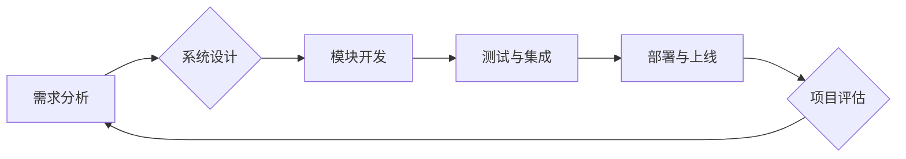

                 

##  系统思考对于管理复杂项目的重要性

> 关键词：系统思考、复杂项目、项目管理、系统架构、系统设计、迭代开发、风险管理、团队协作

### 1. 背景介绍

在当今科技日新月异的时代，软件开发项目越来越复杂，涉及的领域更加广泛，团队规模也越来越庞大。传统的项目管理方法论在面对这些复杂项目时，往往显得力不从心。 

传统项目管理方法通常采用瀑布式开发模式，将项目划分为多个独立的阶段，每个阶段完成之后再进入下一个阶段。这种模式在项目规模较小、需求相对稳定时较为有效。然而，当项目规模扩大、需求变化频繁、技术环境复杂时，瀑布式开发模式的局限性就显现出来。

例如，在开发大型分布式系统时，系统架构的复杂性、技术栈的多样性、团队成员的分布式工作模式等因素都会对项目管理带来极大的挑战。如果仍然采用传统的瀑布式开发模式，可能会导致项目进度滞后、成本超支、质量下降等问题。

因此，我们需要一种更加适合管理复杂项目的全新方法论，而系统思考正是其中一种重要的解决方案。

### 2. 核心概念与联系

系统思考是一种以整体为导向的思维方式，它强调系统内部各个部分之间的相互联系和相互作用，以及系统与外部环境之间的相互影响。

在项目管理领域，系统思考可以帮助我们更好地理解复杂项目的整体结构、识别潜在的风险和问题，并制定更加有效的解决方案。

**系统思考的核心理念包括：**

* **整体性:**  项目是一个整体，各个部分相互关联，不能孤立地看待。
* **相互作用:** 系统中的各个部分之间存在着相互作用和反馈关系。
* **动态性:** 系统是一个动态变化的系统，需要不断地适应环境变化。
* **循环性:** 系统中的过程和反馈机制往往是循环性的。
* **层次性:** 系统可以被分解成不同的层次，每个层次都有其独特的特性和功能。

**系统思考与项目管理的关系:**

系统思考可以帮助项目经理从全局角度看待项目，识别项目中的关键要素和潜在风险，并制定更加有效的项目管理策略。

**Mermaid 流程图:**

### 3. 核心算法原理 & 具体操作步骤

系统思考的核心算法并非一个具体的算法，而是指一种思维方式和方法论。它强调通过观察、分析、建模和迭代的方式来理解和解决复杂问题。

**3.1 算法原理概述**

系统思考的算法原理可以概括为以下几个步骤：

1. **定义系统边界:** 首先需要明确项目的范围和目标，确定哪些因素属于系统内部，哪些因素属于外部环境。
2. **识别关键要素:** 分析系统内部各个部分之间的相互关系，识别出对项目影响最大的关键要素。
3. **建模和模拟:** 使用模型和模拟工具来模拟系统的行为，预测系统的动态变化和潜在风险。
4. **迭代优化:** 根据模型的分析结果和实际情况的反馈，不断调整和优化系统的设计和运作方式。

**3.2 算法步骤详解**

1. **需求分析:** 
    * 通过与客户、用户和相关利益相关者进行深入沟通，全面了解项目的需求和目标。
    * 使用用例图、用户故事等方法来描述系统的功能和行为。
2. **系统设计:** 
    * 基于需求分析的结果，设计系统的整体架构和各个模块的功能。
    * 使用 UML 图像等工具来描述系统的结构和数据流。
3. **模块开发:** 
    * 将系统分解成多个独立的模块，并分别进行开发和测试。
    * 使用敏捷开发方法，例如 Scrum 和 Kanban，来提高开发效率和响应能力。
4. **测试与集成:** 
    * 对每个模块进行单元测试，确保模块的功能正确。
    * 对各个模块进行集成测试，验证模块之间的接口和数据流是否正常。
5. **部署与上线:** 
    * 将经过测试的系统部署到生产环境中。
    * 进行系统验收和用户培训。
6. **项目评估:** 
    * 对项目进行评估，分析项目的成功与否，总结经验教训。
    * 根据评估结果，改进项目管理方法和流程。

**3.3 算法优缺点**

**优点:**

* 能够有效地管理复杂项目，识别潜在风险和问题。
* 能够提高项目团队的协作效率和沟通能力。
* 能够促进项目迭代发展，提高项目的适应性和灵活性。

**缺点:**

* 需要团队成员具备较强的系统思考能力和分析能力。
* 需要投入更多的时间和精力进行系统建模和分析。
* 对于项目规模较小、需求相对稳定的项目，系统思考的应用可能显得过于复杂。

**3.4 算法应用领域**

系统思考在软件开发项目管理、产品设计、业务流程优化、城市规划、环境保护等多个领域都有广泛的应用。

### 4. 数学模型和公式 & 详细讲解 & 举例说明

系统思考中常用的数学模型和公式主要用于描述系统中的动态变化和反馈机制。

**4.1 数学模型构建**

常用的数学模型包括差分方程、微分方程、状态转移图等。

* **差分方程:** 用于描述离散时间系统中的动态变化。
* **微分方程:** 用于描述连续时间系统中的动态变化。
* **状态转移图:** 用于描述系统状态之间的转换关系。

**4.2 公式推导过程**

例如，我们可以使用差分方程来描述系统中变量的变化趋势。假设系统中有一个变量 X，它的变化趋势由以下差分方程描述：

$$
X_{t+1} = aX_t + b
$$

其中，$X_t$ 表示变量 X 在时间 t 的值，$X_{t+1}$ 表示变量 X 在时间 t+1 的值，a 和 b 是常数。

这个公式表示，变量 X 在下一个时间点的值等于它当前的值乘以常数 a 加上常数 b。

**4.3 案例分析与讲解**

例如，我们可以使用差分方程来描述人口增长模型。假设一个国家的人口增长率为 2%，那么我们可以使用以下差分方程来描述人口变化趋势：

$$
P_{t+1} = 1.02P_t
$$

其中，$P_t$ 表示时间 t 的人口数量，$P_{t+1}$ 表示时间 t+1 的人口数量。

这个公式表示，人口在下一个时间点的值等于它当前的值乘以 1.02。

### 5. 项目实践：代码实例和详细解释说明

系统思考在实际项目实践中可以应用于各个阶段，例如需求分析、系统设计、模块开发、测试与集成等。

**5.1 开发环境搭建**

系统思考的实践并不依赖于特定的开发环境，它更是一种思维方式和方法论。

**5.2 源代码详细实现**

由于系统思考本身不是一个具体的算法，因此没有相应的源代码实现。

**5.3 代码解读与分析**

系统思考的应用需要通过分析、建模和迭代的方式来实现，而不是通过代码实现。

**5.4 运行结果展示**

系统思考的应用结果是通过分析模型和观察系统行为来体现的，而不是通过运行代码来展示的。

### 6. 实际应用场景

系统思考在软件开发项目管理中有很多实际应用场景，例如：

* **需求分析:** 通过系统思考，可以帮助项目经理更好地理解客户的需求，识别需求之间的相互依赖关系，并制定更加合理的解决方案。
* **系统设计:** 通过系统思考，可以帮助项目团队设计更加合理的系统架构，并考虑系统各个模块之间的相互影响和反馈关系。
* **风险管理:** 通过系统思考，可以帮助项目团队识别潜在的风险，并制定相应的风险应对策略。
* **团队协作:** 通过系统思考，可以帮助项目团队成员更好地理解彼此的角色和职责，并提高团队的协作效率。

**6.4 未来应用展望**

随着人工智能、大数据等技术的不断发展，系统思考在软件开发项目管理中的应用将会更加广泛和深入。例如，我们可以利用人工智能技术来辅助系统建模和分析，提高系统思考的效率和准确性。

### 7. 工具和资源推荐

**7.1 学习资源推荐**

* **书籍:**
    * 《系统思考》 - Peter Senge
    * 《第五项修炼》 - Jim Collins
    * 《复杂》 - Melanie Mitchell
* **在线课程:**
    * Coursera 上的《系统思考》课程
    * edX 上的《系统思考与复杂系统》课程

**7.2 开发工具推荐**

* **UML 图像工具:**
    * StarUML
    * Lucidchart
* **系统建模工具:**
    * AnyLogic
    * Stella Architect

**7.3 相关论文推荐**

* **《系统思考的应用》** - Peter Senge
* **《复杂系统中的系统思考》** - Melanie Mitchell
* **《系统思考在软件工程中的应用》** -  John Sterman

### 8. 总结：未来发展趋势与挑战

**8.1 研究成果总结**

系统思考已经成为一种成熟的项目管理方法论，它能够有效地管理复杂项目，提高项目团队的协作效率和沟通能力。

**8.2 未来发展趋势**

未来，系统思考将会更加深入地应用于软件开发项目管理，并与人工智能、大数据等新兴技术相结合，形成更加强大的系统思考工具和方法。

**8.3 面临的挑战**

系统思考的应用需要团队成员具备较强的系统思考能力和分析能力，这对于一些项目团队来说可能是一个挑战。

**8.4 研究展望**

未来，我们需要继续研究和探索系统思考的应用方法，并将其与其他项目管理方法相结合，形成更加完善的项目管理体系。

### 9. 附录：常见问题与解答

**常见问题:**

* 系统思考与传统的项目管理方法有什么区别？
* 如何培养系统思考的能力？
* 系统思考的应用有哪些局限性？

**解答:**

* 系统思考与传统的项目管理方法相比，更加注重整体性、相互作用和动态变化，能够更好地应对复杂项目。
* 培养系统思考的能力需要通过学习相关书籍和课程，并不断地实践和反思。
* 系统思考的应用需要团队成员具备较强的系统思考能力和分析能力，对于项目规模较小、需求相对稳定的项目，系统思考的应用可能显得过于复杂。

作者：禅与计算机程序设计艺术 / Zen and the Art of Computer Programming 
<end_of_turn>

