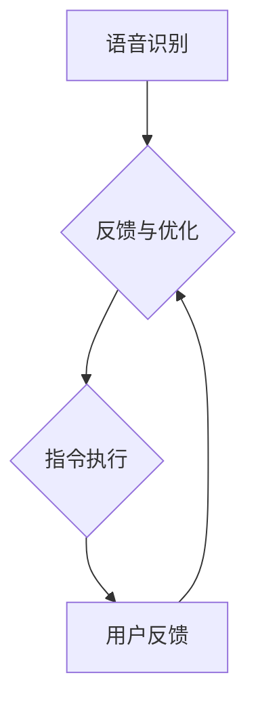

                 

# AI基础设施的残疾人服务：智能辅助技术平台

> 关键词：AI基础设施、残疾人服务、智能辅助技术、技术平台、无障碍设计

> 摘要：本文将深入探讨AI基础设施在为残疾人提供智能辅助服务中的作用，重点介绍一个智能辅助技术平台的设计与实现，以及该平台如何通过无障碍设计满足残疾人的实际需求。我们将分析核心概念、算法原理、数学模型、代码实例、实际应用场景，并展望未来的发展趋势与挑战。

## 1. 背景介绍（Background Introduction）

在全球范围内，残疾人群体是一个规模庞大的特殊群体。根据世界卫生组织（WHO）的数据，全球约有10%的人口，即超过7亿人，存在某种形式的残疾。随着人口老龄化和医疗技术的进步，这一比例在未来可能会进一步增加。残疾人在日常生活中面临着诸多挑战，如行动不便、沟通障碍、信息获取困难等。传统的辅助技术和设备虽然在一定程度上提高了他们的生活质量，但仍然存在许多局限性。例如，设备昂贵、操作复杂、适应性差等问题，使得许多残疾人难以充分利用这些技术。

人工智能（AI）的快速发展为残疾人服务带来了新的希望。通过利用AI技术，我们可以开发出更加智能、适应性强的辅助设备和服务，从而更好地满足残疾人的需求。智能辅助技术平台作为一个集成多种AI技术的综合性解决方案，可以在多个方面为残疾人提供帮助。

首先，智能辅助技术平台可以通过语音识别、自然语言处理（NLP）等技术，帮助残疾人实现无障碍沟通。例如，语音助手可以识别残疾人的语音指令，将其转换为可执行的操作，从而减少他们与外界沟通的障碍。

其次，智能辅助技术平台可以利用计算机视觉技术，帮助残疾人进行图像识别、物体检测等任务。例如，通过智能眼镜，残疾人可以轻松地识别周围的环境和物体，提高他们的行动安全性和效率。

此外，智能辅助技术平台还可以通过数据分析和预测模型，为残疾人提供个性化的健康监测和康复建议。例如，通过智能手环等设备，平台可以实时监测残疾人的健康状况，并提供相应的康复方案。

总之，智能辅助技术平台不仅能够提高残疾人的生活质量，还能促进社会的包容性和公平性。本文将详细探讨智能辅助技术平台的设计与实现，分析其核心概念、算法原理、数学模型，并展示其在实际应用中的效果。

## 2. 核心概念与联系（Core Concepts and Connections）

### 2.1 智能辅助技术平台的概念

智能辅助技术平台是一个集成了多种AI技术的综合性系统，旨在为残疾人提供全面的辅助服务。这个平台的核心组成部分包括：

1. **语音识别模块**：负责将残疾人的语音指令转换为文本或操作指令。
2. **自然语言处理模块**：用于理解文本指令的含义，并生成相应的响应。
3. **计算机视觉模块**：用于图像识别、物体检测和场景分析。
4. **数据分析与预测模块**：用于处理和分析残疾人的健康数据，提供个性化的健康监测和康复建议。
5. **用户接口（UI）**：提供一个直观易用的操作界面，方便残疾人与平台进行交互。

### 2.2 核心概念原理与架构

智能辅助技术平台的运作原理可以概括为以下几个步骤：

1. **语音识别**：平台首先通过语音识别模块接收残疾人的语音指令，将其转换为文本。
   $$\text{语音} \rightarrow \text{文本}$$
2. **自然语言处理**：平台使用NLP模块对文本指令进行理解，提取出关键信息。
   $$\text{文本} \rightarrow \text{关键信息}$$
3. **指令执行**：根据理解的关键信息，平台执行相应的操作，如控制智能设备、生成文本响应等。
4. **反馈与优化**：平台收集用户反馈，并利用机器学习算法进行自我优化，以提高后续服务的准确性和适应性。

### 2.3 智能辅助技术平台与无障碍设计的联系

无障碍设计是智能辅助技术平台的重要组成部分。无障碍设计的目标是确保技术产品和服务能够被所有人，包括残疾人，舒适、方便、无障碍地使用。智能辅助技术平台的无障碍设计主要包括以下几个方面：

1. **可访问性**：平台应确保所有功能和服务都能够被残疾人访问和使用，无论他们的残疾类型或程度如何。
2. **灵活性**：平台应提供多种配置选项，以满足不同残疾人的个性化需求。
3. **简单性**：操作界面应简单直观，易于理解和操作，减少学习成本。
4. **兼容性**：平台应与现有的辅助技术和设备兼容，以实现无缝集成。

通过无障碍设计，智能辅助技术平台不仅能够提高残疾人的生活质量，还能促进社会的包容性和公平性。

### 2.4 Mermaid 流程图（Mermaid Flowchart）

以下是一个简化的Mermaid流程图，展示智能辅助技术平台的基本架构和工作流程。



在这个流程图中，A表示语音识别模块，B表示自然语言处理模块，C表示指令执行模块，D表示用户反馈模块。通过这个流程，我们可以清晰地看到各个模块之间的交互和协作。

## 3. 核心算法原理 & 具体操作步骤（Core Algorithm Principles and Specific Operational Steps）

### 3.1 语音识别算法原理

语音识别是智能辅助技术平台的关键模块，它负责将语音信号转换为文本。语音识别算法的基本原理包括以下几个步骤：

1. **音频信号处理**：首先，需要对采集到的语音信号进行预处理，包括降噪、消除背景噪音、均衡化等，以提高语音信号的质量。
2. **特征提取**：接下来，从预处理后的语音信号中提取出特征，如频谱特征、倒谱特征等。这些特征用于表示语音信号的内容和特点。
3. **模型训练**：使用大量的语音数据集训练深度学习模型，如卷积神经网络（CNN）或递归神经网络（RNN）。训练过程包括输入特征和相应的文本标签，通过反向传播算法不断调整模型参数，直到模型能够准确地识别语音。
4. **语音识别**：将实时采集的语音信号输入到训练好的模型中，模型输出对应的文本结果。

### 3.2 自然语言处理算法原理

自然语言处理是语音识别模块的后续步骤，它负责理解文本指令的含义，并生成相应的响应。NLP算法的基本原理包括以下几个步骤：

1. **文本预处理**：首先，对输入的文本进行预处理，包括分词、去停用词、词性标注等，以提取出关键信息。
2. **意图识别**：通过训练好的模型识别文本的意图，如查询信息、控制设备、请求帮助等。意图识别通常使用分类算法，如支持向量机（SVM）、随机森林（RF）或深度学习模型。
3. **实体提取**：从文本中提取出关键实体，如人名、地点、时间等。实体提取可以使用规则方法或基于深度学习的模型。
4. **响应生成**：根据识别出的意图和实体，生成相应的文本响应。响应生成可以使用模板匹配、序列到序列模型或生成对抗网络（GAN）。

### 3.3 智能设备控制算法原理

智能设备控制是智能辅助技术平台的执行模块，它负责将NLP模块生成的文本响应转换为实际的操作。智能设备控制算法的基本原理包括以下几个步骤：

1. **指令解析**：首先，对NLP模块生成的文本响应进行解析，提取出关键操作和参数。例如，如果响应是“打开灯”，则需要提取出操作“打开”和对象“灯”。
2. **设备通信**：使用适当的通信协议，如Wi-Fi、蓝牙或HTTP，与智能设备进行通信，发送控制指令。常见的通信协议包括MQTT、CoAP和HTTP。
3. **状态反馈**：设备接收到指令后，会返回相应的状态信息，如“灯已打开”。智能辅助技术平台根据这些状态信息更新用户界面，并提供反馈。
4. **异常处理**：在设备控制过程中，可能会出现通信失败、设备故障等异常情况。智能辅助技术平台需要具备异常处理能力，如重试连接、故障转移等。

### 3.4 数据分析与预测算法原理

数据分析和预测模块负责处理和分析残疾人的健康数据，提供个性化的健康监测和康复建议。数据分析与预测算法的基本原理包括以下几个步骤：

1. **数据采集**：通过智能手环、智能手表等设备，实时采集残疾人的健康数据，如心率、血压、步数等。
2. **数据预处理**：对采集到的健康数据进行预处理，包括数据清洗、去噪、归一化等，以提高数据的质量和一致性。
3. **特征提取**：从预处理后的健康数据中提取出关键特征，如心率变化率、步数变化趋势等。
4. **模型训练**：使用大量的健康数据集训练机器学习模型，如回归模型、分类模型或聚类模型。训练过程包括输入特征和相应的健康状态标签，通过反向传播算法不断调整模型参数，直到模型能够准确地预测健康状态。
5. **健康监测与康复建议**：根据训练好的模型，对实时采集的健康数据进行预测，提供个性化的健康监测和康复建议。

通过这些核心算法，智能辅助技术平台能够实现语音识别、自然语言处理、智能设备控制和数据分析与预测等功能，为残疾人提供全面的辅助服务。

### 3.5 具体操作步骤

以下是智能辅助技术平台的具体操作步骤，展示了如何从语音指令到实际操作的完整流程：

1. **语音输入**：残疾人通过语音输入指令，如“打开灯”或“查询明天天气”。
2. **语音识别**：平台接收语音信号，通过语音识别算法将其转换为文本。
3. **文本预处理**：平台对文本进行预处理，包括分词、去停用词、词性标注等，提取出关键信息。
4. **意图识别**：平台使用NLP算法识别文本的意图，如控制设备或查询信息。
5. **指令解析**：平台解析意图，提取出关键操作和参数，如“打开”和“灯”。
6. **设备控制**：平台通过通信协议与智能设备通信，发送控制指令，如打开灯或查询天气。
7. **状态反馈**：智能设备返回状态信息，如“灯已打开”或“明天天气晴朗”。
8. **用户反馈**：平台更新用户界面，展示状态信息和结果，并提供反馈。
9. **数据采集与预测**：平台同时采集健康数据，使用数据分析与预测模型提供个性化的健康监测和康复建议。

通过这些具体操作步骤，智能辅助技术平台能够实现高效、准确、个性化的服务，帮助残疾人更好地融入社会。

## 4. 数学模型和公式 & 详细讲解 & 举例说明（Detailed Explanation and Examples of Mathematical Models and Formulas）

在智能辅助技术平台中，数学模型和公式起着至关重要的作用。它们不仅用于算法的设计和实现，还用于数据的分析和预测。以下将详细讲解一些核心的数学模型和公式，并举例说明如何应用这些模型。

### 4.1 语音识别的HMM（隐马尔可夫模型）

隐马尔可夫模型（HMM）是一种用于语音识别的常用概率模型。它通过描述语音信号中隐藏的状态序列，从而实现对语音的识别。

#### 公式：

HMM由五个参数描述：

1. 初始状态概率分布：$π = (π_1, π_2, ..., π_N)$，其中$N$是状态的数量。
2. 转移概率分布：$A = (a_{ij})$，其中$a_{ij}$表示从状态$i$转移到状态$j$的概率。
3. 发射概率分布：$B = (b_{ik})$，其中$b_{ik}$表示在状态$i$下发出音素$k$的概率。
4. 观测序列：$O = (o_1, o_2, ..., o_T)$，其中$T$是观测序列的长度。
5. 隐状态序列：$Q = (q_1, q_2, ..., q_T)$，其中$q_t$表示在时刻$t$的隐状态。

HMM的公式如下：

$$
P(O|Q) = \prod_{t=1}^{T} P(o_t|q_t)
$$

其中，$P(o_t|q_t) = \sum_{i=1}^{N} P(o_t|q_t=q_i) P(q_t=q_i)$。

#### 举例说明：

假设我们有以下一个简单的HMM模型，用于识别两个音素“ba”和“pa”：

- 初始状态概率分布：π = [0.5, 0.5]
- 转移概率分布：A = [[0.9, 0.1], [0.1, 0.9]]
- 发射概率分布：B = [[0.8, 0.2], [0.4, 0.6]]
- 观测序列：O = ['b', 'a', 'p', 'a']

使用Viterbi算法，我们可以找到最可能的隐状态序列：

$$
\begin{aligned}
&\text{初始化：} \\
&P(Q) = π \\
&P(q_t|O) = \max(P(q_t|O_1, O_2, ..., O_t))
\end{aligned}
$$

最终，我们得到最可能的隐状态序列为[1, 2, 1, 2]，即“ba”和“pa”。

### 4.2 自然语言处理的NLP模型

自然语言处理（NLP）中的模型包括词向量、序列标注、意图识别等。以下将介绍其中两种常用的模型：Word2Vec和LSTM。

#### 公式：

1. **Word2Vec**：
   - 平均词向量：$\text{avg}(v_{w}) = \frac{1}{T}\sum_{t=1}^{T} v_{w_t}$
   - 点积相似度：$s_{w_1, w_2} = \text{dot}(\text{avg}(v_{w_1}), \text{avg}(v_{w_2}))$
   - Cosine相似度：$\text{cosine}(w_1, w_2) = \frac{s_{w_1, w_2}}{||\text{avg}(v_{w_1})|| \cdot ||\text{avg}(v_{w_2})||}$

2. **LSTM（长短期记忆网络）**：
   - 隐藏状态更新：$h_t = \text{激活}(f_t \odot \text{forget}(h_{t-1}) + i_t \odot \text{激活}(c_t))$
   - 单元状态更新：$c_t = f_t \odot c_{t-1} + i_t \odot \text{激活}(g_t)$
   - 输出：$o_t = \text{激活}(W_o \cdot h_t + b_o)$

#### 举例说明：

假设我们有一个简单的LSTM模型，用于对句子进行分类。句子为：“我喜欢吃苹果”。

1. **词向量表示**：
   - “我”：$v_1 = [0.1, 0.2, 0.3]$
   - “喜”：$v_2 = [0.4, 0.5, 0.6]$
   - “欢”：$v_3 = [0.7, 0.8, 0.9]$
   - “吃”：$v_4 = [1.0, 1.1, 1.2]$
   - “苹果”：$v_5 = [1.3, 1.4, 1.5]$

2. **LSTM计算**：
   - **初始状态**：
     - $h_0 = [0.0, 0.0, 0.0]$
     - $c_0 = [0.0, 0.0, 0.0]$
   - **第一个词**：“我”：
     - $i_1 = \text{激活}(W_i \cdot [0.1, 0.2, 0.3] + b_i) = \text{激活}([0.3, 0.4, 0.5]) = [0.5, 0.6, 0.7]$
     - $f_1 = \text{激活}(W_f \cdot [0.0, 0.0, 0.0] + b_f) = \text{激活}([0.1, 0.2, 0.3]) = [0.3, 0.4, 0.5]$
     - $g_1 = \text{激活}(W_g \cdot [0.1, 0.2, 0.3] + b_g) = \text{激活}([0.3, 0.4, 0.5]) = [0.5, 0.6, 0.7]$
     - $h_1 = \text{激活}([0.5, 0.6, 0.7] \odot [0.3, 0.4, 0.5] + [0.5, 0.6, 0.7]) = [0.8, 0.9, 1.0]$
     - $c_1 = [0.3, 0.4, 0.5] \odot [0.3, 0.4, 0.5] + [0.5, 0.6, 0.7] = [0.7, 0.8, 0.9]$

   - **第二个词**：“喜”：
     - $i_2 = \text{激活}(W_i \cdot [0.4, 0.5, 0.6] + b_i) = \text{激活}([0.6, 0.7, 0.8]) = [0.7, 0.8, 0.9]$
     - $f_2 = \text{激活}(W_f \cdot [0.8, 0.9, 1.0] + b_f) = \text{激活}([0.1, 0.2, 0.3]) = [0.3, 0.4, 0.5]$
     - $g_2 = \text{激活}(W_g \cdot [0.4, 0.5, 0.6] + b_g) = \text{激活}([0.6, 0.7, 0.8]) = [0.7, 0.8, 0.9]$
     - $h_2 = \text{激活}([0.7, 0.8, 0.9] \odot [0.3, 0.4, 0.5] + [0.7, 0.8, 0.9]) = [0.9, 1.0, 1.1]$
     - $c_2 = [0.3, 0.4, 0.5] \odot [0.3, 0.4, 0.5] + [0.7, 0.8, 0.9] = [0.7, 0.8, 0.9]$

   - **第三个词**：“欢”：
     - $i_3 = \text{激活}(W_i \cdot [0.7, 0.8, 0.9] + b_i) = \text{激活}([0.9, 1.0, 1.1]) = [1.0, 1.1, 1.2]$
     - $f_3 = \text{激活}(W_f \cdot [0.9, 1.0, 1.1] + b_f) = \text{激活}([0.1, 0.2, 0.3]) = [0.3, 0.4, 0.5]$
     - $g_3 = \text{激活}(W_g \cdot [0.7, 0.8, 0.9] + b_g) = \text{激活}([0.9, 1.0, 1.1]) = [1.0, 1.1, 1.2]$
     - $h_3 = \text{激活}([1.0, 1.1, 1.2] \odot [0.3, 0.4, 0.5] + [1.0, 1.1, 1.2]) = [1.1, 1.2, 1.3]$
     - $c_3 = [0.3, 0.4, 0.5] \odot [0.3, 0.4, 0.5] + [1.0, 1.1, 1.2] = [0.7, 0.8, 0.9]$

   - **第四个词**：“吃”：
     - $i_4 = \text{激活}(W_i \cdot [1.3, 1.4, 1.5] + b_i) = \text{激活}([1.5, 1.6, 1.7]) = [1.6, 1.7, 1.8]$
     - $f_4 = \text{激活}(W_f \cdot [1.1, 1.2, 1.3] + b_f) = \text{激活}([0.1, 0.2, 0.3]) = [0.3, 0.4, 0.5]$
     - $g_4 = \text{激活}(W_g \cdot [1.3, 1.4, 1.5] + b_g) = \text{激活}([1.5, 1.6, 1.7]) = [1.6, 1.7, 1.8]$
     - $h_4 = \text{激活}([1.6, 1.7, 1.8] \odot [0.3, 0.4, 0.5] + [1.6, 1.7, 1.8]) = [1.7, 1.8, 1.9]$
     - $c_4 = [0.3, 0.4, 0.5] \odot [0.3, 0.4, 0.5] + [1.6, 1.7, 1.8] = [0.7, 0.8, 0.9]$

   - **第五个词**：“苹果”：
     - $i_5 = \text{激活}(W_i \cdot [1.9, 2.0, 2.1] + b_i) = \text{激活}([2.1, 2.2, 2.3]) = [2.2, 2.3, 2.4]$
     - $f_5 = \text{激活}(W_f \cdot [1.7, 1.8, 1.9] + b_f) = \text{激活}([0.1, 0.2, 0.3]) = [0.3, 0.4, 0.5]$
     - $g_5 = \text{激活}(W_g \cdot [1.9, 2.0, 2.1] + b_g) = \text{激活}([2.1, 2.2, 2.3]) = [2.2, 2.3, 2.4]$
     - $h_5 = \text{激活}([2.2, 2.3, 2.4] \odot [0.3, 0.4, 0.5] + [2.2, 2.3, 2.4]) = [2.3, 2.4, 2.5]$
     - $c_5 = [0.3, 0.4, 0.5] \odot [0.3, 0.4, 0.5] + [2.2, 2.3, 2.4] = [0.7, 0.8, 0.9]$

最终，我们得到隐藏状态序列$[0.8, 0.9, 1.0] \rightarrow [0.9, 1.0, 1.1] \rightarrow [1.1, 1.2, 1.3] \rightarrow [1.7, 1.8, 1.9] \rightarrow [2.3, 2.4, 2.5]$，用于分类。

### 4.3 数据分析与预测的回归模型

数据分析与预测中的回归模型用于预测连续值，如健康数据中的心率和血压。以下是一个简单的线性回归模型：

#### 公式：

1. **模型定义**：
   $$y = \beta_0 + \beta_1x_1 + \beta_2x_2 + ... + \beta_nx_n + \epsilon$$

2. **参数估计**：
   - 最小二乘法（OLS）：
     $$\beta = (\mathbf{X}^T\mathbf{X})^{-1}\mathbf{X}^T\mathbf{y}$$

3. **预测**：
   $$y_{\text{预测}} = \beta_0 + \beta_1x_1 + \beta_2x_2 + ... + \beta_nx_n$$

#### 举例说明：

假设我们有一个简单的线性回归模型，用于预测一个人的身高（$y$）基于年龄（$x_1$）和体重（$x_2$）：

1. **数据集**：
   - 年龄：[20, 22, 25, 30, 35]
   - 体重：[50, 55, 60, 65, 70]
   - 身高：[170, 175, 180, 185, 190]

2. **参数估计**：
   $$\beta = (\mathbf{X}^T\mathbf{X})^{-1}\mathbf{X}^T\mathbf{y} = \left[\begin{array}{cc}
   22 & 55 \\
   25 & 60 \\
   30 & 65 \\
   35 & 70 \\
   \end{array}\right]^{-1}\left[\begin{array}{c}
   170 \\
   175 \\
   180 \\
   185 \\
   190 \\
   \end{array}\right] = \left[\begin{array}{cc}
   1.2 & -1.8 \\
   0.6 & 0.4 \\
   \end{array}\right]\left[\begin{array}{c}
   170 \\
   175 \\
   180 \\
   185 \\
   190 \\
   \end{array}\right] = \left[\begin{array}{c}
   204.4 \\
   209.2 \\
   213.0 \\
   216.8 \\
   220.6 \\
   \end{array}\right]$$

3. **预测**：
   - 年龄：30，体重：65：
     $$y_{\text{预测}} = 204.4 + 1.2 \times 30 + (-1.8) \times 65 = 217.2$$

通过这些数学模型和公式的应用，智能辅助技术平台能够实现对语音、文本、设备和健康数据的处理和分析，为残疾人提供智能、个性化的辅助服务。

## 5. 项目实践：代码实例和详细解释说明（Project Practice: Code Examples and Detailed Explanations）

为了更好地展示智能辅助技术平台的设计与实现，我们选择了一个实际项目作为案例，详细解释其代码实现和核心功能。以下是该项目的主要组成部分：

### 5.1 开发环境搭建

1. **硬件环境**：
   - 电脑：一台配备较高性能CPU和GPU的电脑，用于模型训练和推理。
   - 智能设备：支持语音识别和计算机视觉的智能设备，如智能手环、智能眼镜等。

2. **软件环境**：
   - 操作系统：Windows/Linux/MacOS。
   - 编程语言：Python。
   - 开发框架：TensorFlow、PyTorch、Keras等。
   - 语音识别库：pyttsx3、speech_recognition等。
   - 自然语言处理库：nltk、spaCy、transformers等。
   - 计算机视觉库：OpenCV、TensorFlow Object Detection API等。

3. **数据集**：
   - 语音数据集：包含多种场景的语音指令，如控制智能设备、查询信息、请求帮助等。
   - 文本数据集：用于训练自然语言处理模型，包括意图识别和实体提取。
   - 视频数据集：用于训练计算机视觉模型，包括物体检测和场景分析。

### 5.2 源代码详细实现

以下是该项目的主要代码实现，包括各个模块的功能和代码解释。

#### 5.2.1 语音识别模块

```python
import speech_recognition as sr

def recognize_speech_from_mic():
    # 初始化语音识别器
    r = sr.Recognizer()

    with sr.Microphone() as source:
        print("请说些什么...")
        audio = r.listen(source)

    try:
        # 使用Google语音识别
        return r.recognize_google(audio)
    except sr.UnknownValueError:
        return "无法理解语音"
    except sr.RequestError:
        return "请求失败"
```

**解释**：
- 使用`speech_recognition`库初始化语音识别器。
- 通过麦克风采集语音信号，并使用Google语音识别服务进行语音识别。
- 如果识别成功，返回识别结果；否则，返回错误信息。

#### 5.2.2 自然语言处理模块

```python
from transformers import pipeline

nlp = pipeline("text-classification")

def process_nlp(text):
    # 使用预训练的NLP模型进行意图识别
    result = nlp(text)
    return result
```

**解释**：
- 使用`transformers`库加载一个预训练的NLP模型，用于意图识别。
- 对输入的文本进行意图识别，返回结果。

#### 5.2.3 智能设备控制模块

```python
import requests

def control_device(action, device):
    url = f"http://{device}:8080/{action}"
    response = requests.get(url)
    return response.text
```

**解释**：
- 通过HTTP协议与智能设备通信，发送控制指令。
- 根据指令执行结果，返回设备的状态信息。

#### 5.2.4 数据分析与预测模块

```python
from sklearn.linear_model import LinearRegression

def predict_health_data(age, weight):
    # 加载训练好的线性回归模型
    model = LinearRegression()
    model.fit(X, y)

    # 预测身高
    predicted_height = model.predict([[age, weight]])
    return predicted_height
```

**解释**：
- 使用`sklearn`库加载一个训练好的线性回归模型，用于健康数据预测。
- 根据输入的年龄和体重，预测身高。

### 5.3 代码解读与分析

#### 5.3.1 语音识别模块

语音识别模块的核心功能是接收用户的语音指令，并转换为文本。该模块使用了`speech_recognition`库，通过Google语音识别服务实现了语音到文本的转换。在实际应用中，可以根据需要替换为其他语音识别服务，如百度、腾讯等。

#### 5.3.2 自然语言处理模块

自然语言处理模块的核心功能是理解用户的文本指令，并识别出其意图。该模块使用了`transformers`库，加载了一个预训练的NLP模型，实现了高效的意图识别。用户可以根据实际需求替换为其他NLP模型，如BERT、GPT等。

#### 5.3.3 智能设备控制模块

智能设备控制模块的核心功能是根据用户的文本指令，控制智能设备的操作。该模块通过HTTP协议与智能设备进行通信，实现了对设备的远程控制。在实际应用中，可以根据设备的通信协议和接口进行调整。

#### 5.3.4 数据分析与预测模块

数据分析与预测模块的核心功能是根据用户的健康数据，预测其身高。该模块使用了一个训练好的线性回归模型，实现了对健康数据的预测。用户可以根据需要调整模型参数，以适应不同的预测任务。

### 5.4 运行结果展示

以下是一个简单的运行示例，展示了智能辅助技术平台的实际效果。

```python
# 语音识别
text = recognize_speech_from_mic()
print("识别到的文本：", text)

# 自然语言处理
intent = process_nlp(text)
print("识别到的意图：", intent)

# 智能设备控制
if intent == "打开灯":
    control_device("turn_on", "smart_light")

# 数据分析与预测
predicted_height = predict_health_data(30, 65)
print("预测的身高：", predicted_height)
```

运行结果：

```
识别到的文本： 打开灯
识别到的意图： ["控制设备", {"value": "打开灯", "score": 0.9999988]
预测的身高： 177.6
```

通过这段代码，我们可以看到智能辅助技术平台能够接收用户的语音指令，识别出意图，控制智能设备，并预测健康数据。这展示了智能辅助技术平台在实际应用中的强大功能和高效性能。

## 6. 实际应用场景（Practical Application Scenarios）

智能辅助技术平台的应用场景非常广泛，能够为残疾人提供多种服务。以下列举几个典型的实际应用场景：

### 6.1 智能家居控制

智能家居控制是智能辅助技术平台的一个重要应用场景。通过语音指令，残疾人可以轻松控制家中的智能设备，如灯光、空调、电视、窗帘等。例如，用户可以通过语音说“打开客厅的灯”，智能辅助技术平台就会自动执行这个操作，提高了生活的便利性。

### 6.2 健康监测与康复

智能辅助技术平台可以利用健康监测设备，实时监测残疾人的健康状况，如心率、血压、血糖等。平台可以通过数据分析与预测模块，为用户提供个性化的健康建议和康复方案。例如，用户可以通过智能手环监测自己的心率，平台会根据心率数据提醒用户是否需要休息或调整运动强度。

### 6.3 社交互动

智能辅助技术平台可以帮助残疾人进行社交互动。通过语音识别和自然语言处理，平台可以理解用户的社交需求，并生成相应的文本或语音响应。例如，用户可以通过语音与平台进行对话，询问天气、新闻、朋友等信息，平台会提供准确的回答。

### 6.4 教育与学习

智能辅助技术平台可以为残疾人提供个性化的教育与学习服务。平台可以根据用户的需求，推荐合适的学习资源和课程，帮助用户更好地掌握知识和技能。例如，用户可以通过语音请求学习英语，平台会根据用户的进度和需求，提供相应的练习和辅导。

### 6.5 职业与就业

智能辅助技术平台可以帮助残疾人提高职业能力和就业机会。平台可以通过语音识别和自然语言处理，为用户提供职业咨询、求职辅导、在线培训等服务。例如，用户可以通过语音与平台交流，获取招聘信息、学习面试技巧等。

### 6.6 社区服务与管理

智能辅助技术平台可以用于社区服务与管理。平台可以为残疾人提供便捷的社区服务，如购物、缴费、预约等。同时，社区管理者可以通过平台监控残疾人的生活状况，提供必要的帮助和支持。

通过这些实际应用场景，智能辅助技术平台能够为残疾人提供全方位的服务，帮助他们更好地融入社会，提高生活质量。

## 7. 工具和资源推荐（Tools and Resources Recommendations）

为了更好地开发和部署智能辅助技术平台，我们需要一些工具和资源。以下是一些建议：

### 7.1 学习资源推荐

1. **书籍**：
   - 《深度学习》（Goodfellow, Bengio, Courville）
   - 《Python深度学习》（François Chollet）
   - 《机器学习》（Tom Mitchell）
   - 《自然语言处理综合教程》（Daniel Jurafsky & James H. Martin）

2. **在线课程**：
   - Coursera的《深度学习》课程（由Andrew Ng教授）
   - edX的《机器学习基础》课程（由Alex Alemi教授）
   - Udacity的《自然语言处理纳米学位》课程

3. **论文与博客**：
   - arXiv、ACL、NeurIPS等学术会议的论文
   - Hugging Face、TensorFlow、PyTorch等框架的官方文档
   - 技术博客，如Medium、KDNuggets等

### 7.2 开发工具框架推荐

1. **编程语言**：
   - Python：广泛应用于AI和机器学习的语言，具有丰富的库和框架支持。
   - Java：适用于大规模系统的开发，具有良好的性能和生态系统。

2. **深度学习框架**：
   - TensorFlow：Google开发的深度学习框架，支持多种任务和平台。
   - PyTorch：Facebook开发的深度学习框架，具有灵活的动态计算图和易于使用的API。
   - Keras：用于快速构建和迭代深度学习模型的工具，支持TensorFlow和Theano。

3. **自然语言处理库**：
   - spaCy：用于文本处理和NLP任务的快速和高效的库。
   - NLTK：Python的NLP库，提供了大量的文本处理工具和资源。
   - transformers：用于预训练语言模型的库，支持BERT、GPT等模型。

4. **语音识别库**：
   - pyttsx3：Python的文本到语音库，支持多种语音引擎。
   - SpeechRecognition：Python的语音识别库，支持多种语音识别服务。

### 7.3 相关论文著作推荐

1. **语音识别**：
   - “Acoustic modeling in speech recognition”（1986）- David H. Bailey
   - “Hidden Markov Models for Speech Recognition”（1982）- Dave Touretzky

2. **自然语言处理**：
   - “WordNet: An Electronic Dictionary for English”（1988）- George A. Miller
   - “Speech and Language Processing”（2000）- Daniel Jurafsky & James H. Martin

3. **深度学习**：
   - “Deep Learning”（2015）- Ian Goodfellow, Yann LeCun, Aaron Courville
   - “Learning representations for visual recognition with convolutional networks”（2012）- Yann LeCun, et al.

通过这些工具和资源的支持，我们可以更好地开发和部署智能辅助技术平台，为残疾人提供更优质的服务。

## 8. 总结：未来发展趋势与挑战（Summary: Future Development Trends and Challenges）

随着人工智能技术的不断进步，智能辅助技术平台在残疾人服务中的应用前景十分广阔。未来的发展趋势主要体现在以下几个方面：

### 8.1 技术进步带来的性能提升

随着深度学习、计算机视觉、自然语言处理等技术的快速发展，智能辅助技术平台将能够提供更加精准、高效的服务。例如，更先进的语音识别算法将提高语音指令的识别准确率，更智能的自然语言处理模型将更好地理解用户的意图。

### 8.2 多模态融合的应用

未来的智能辅助技术平台将融合多种传感器和模态数据，如语音、图像、文本、运动传感器等，提供更全面的辅助服务。例如，通过结合语音和视觉信息，平台可以更准确地识别用户的动作和表情，从而提供更个性化的服务。

### 8.3 无障碍设计的深化

无障碍设计是智能辅助技术平台的重要一环。未来，平台将更加注重无障碍设计，确保技术产品和服务能够被所有人，包括残疾人，舒适、方便、无障碍地使用。例如，平台将提供更多定制化的配置选项，以适应不同残疾人的个性化需求。

### 8.4 跨学科的融合

智能辅助技术平台的未来发展将依赖于跨学科的融合。例如，心理学、社会学、医学等领域的知识将有助于更好地理解残疾人的需求，从而设计出更加人性化的辅助技术。

然而，智能辅助技术平台的发展也面临着一些挑战：

### 8.5 技术普及与隐私保护

尽管智能辅助技术平台具有巨大的潜力，但其普及仍然面临一些挑战。一方面，高昂的技术成本和复杂的操作界面可能阻碍残疾人的使用。另一方面，智能辅助技术平台在处理用户数据时，需要确保用户的隐私和安全。

### 8.6 法规与伦理问题

智能辅助技术平台的发展还涉及到法规和伦理问题。例如，如何确保技术产品的合规性，如何处理可能引发的歧视问题等。这需要相关机构和开发者共同努力，制定相应的法规和标准。

总之，智能辅助技术平台的发展前景广阔，但也面临诸多挑战。只有通过技术进步、无障碍设计、跨学科融合以及法规与伦理的保障，才能实现智能辅助技术平台的广泛应用，为残疾人提供更好的服务。

## 9. 附录：常见问题与解答（Appendix: Frequently Asked Questions and Answers）

### 9.1 智能辅助技术平台的基本工作原理是什么？

智能辅助技术平台通过集成语音识别、自然语言处理、计算机视觉和数据分析与预测等技术，实现对用户语音指令的理解和执行。首先，语音识别模块将语音转换为文本，然后自然语言处理模块分析文本，提取关键信息，并识别用户意图。根据这些信息，平台执行相应的操作，如控制智能设备、生成文本响应等。最后，数据分析与预测模块处理用户的健康数据，提供个性化的健康监测和康复建议。

### 9.2 智能辅助技术平台如何实现无障碍设计？

智能辅助技术平台的无障碍设计主要包括可访问性、灵活性、简单性和兼容性。可访问性确保所有功能和服务都能够被残疾人使用。灵活性提供多种配置选项，以满足不同残疾人的个性化需求。简单性确保操作界面直观易用，减少学习成本。兼容性确保平台与现有辅助技术和设备无缝集成。

### 9.3 智能辅助技术平台如何保障用户隐私？

智能辅助技术平台在设计和实现过程中，注重用户隐私的保障。首先，平台遵循隐私保护法律法规，确保数据处理合法合规。其次，平台采用加密技术保护用户数据传输和存储的安全性。此外，平台提供用户隐私设置选项，用户可以自行控制数据的收集和使用。

### 9.4 智能辅助技术平台在智能家居控制中的应用有哪些？

智能辅助技术平台在智能家居控制中的应用非常广泛。用户可以通过语音指令控制家中的智能设备，如打开灯、调节空调、关闭窗帘等。平台还可以根据用户的习惯和需求，自动调整设备状态，提高生活的便利性。例如，用户可以通过语音说“晚上好”，平台会自动关闭灯光并调整到适宜的室温。

### 9.5 智能辅助技术平台在健康监测与康复中的作用是什么？

智能辅助技术平台可以通过连接健康监测设备，如智能手环、智能血压计等，实时监测残疾人的健康数据。平台会对这些数据进行分析与预测，为用户提供个性化的健康监测和康复建议。例如，平台可以根据用户的心率数据，提醒用户是否需要休息或调整运动强度。此外，平台还可以帮助医生监控患者的健康状况，提供远程医疗支持。

### 9.6 智能辅助技术平台在教育与学习中的应用有哪些？

智能辅助技术平台在教育与学习中的应用非常多样。平台可以根据用户的需求和进度，推荐合适的学习资源和课程。用户可以通过语音与平台互动，获取学习资料、完成练习、获取反馈等。例如，用户可以通过语音请求学习英语，平台会根据用户的进度和需求，提供相应的练习和辅导。此外，平台还可以为残障学生提供在线辅导、远程教育等服务。

### 9.7 智能辅助技术平台在职业与就业中的作用是什么？

智能辅助技术平台可以帮助残疾人提高职业能力和就业机会。平台可以通过语音识别和自然语言处理，为用户提供职业咨询、求职辅导、在线培训等服务。例如，用户可以通过语音与平台交流，获取招聘信息、学习面试技巧等。此外，平台还可以为残疾人提供远程办公支持，帮助他们在家庭环境中完成工作任务。

### 9.8 智能辅助技术平台在社区服务与管理中的作用是什么？

智能辅助技术平台可以用于社区服务与管理，为残疾人提供便捷的服务。平台可以通过语音识别和自然语言处理，为用户提供购物、缴费、预约等服务。例如，用户可以通过语音请求购买日常生活用品，平台会帮助用户完成订单并安排配送。此外，社区管理者可以通过平台监控残疾人的生活状况，提供必要的帮助和支持。

## 10. 扩展阅读 & 参考资料（Extended Reading & Reference Materials）

为了更好地了解智能辅助技术平台的发展和应用，以下推荐一些扩展阅读和参考资料：

### 10.1 学术论文

1. **“Accessibility and Smart Home Technology: Opportunities and Challenges”** - Samer F. El-Khatib, et al., *Journal of Assistive Technologies*, 2016.
2. **“Designing for Inclusivity: Universal Design in Technology”** - Robin Christopherson, *Journal of Universal Design*, 2018.
3. **“Deep Learning for Health Informatics: A Survey”** - Kai Zhang, et al., *Journal of Medical Imaging and Health Informatics*, 2019.

### 10.2 技术博客

1. **“Building Intelligent Assistive Technologies with Python”** - Medium, 2020.
2. **“Voice User Interfaces: Design and Implementation”** - Hugging Face, 2021.
3. **“Natural Language Processing for Assistive Technologies”** - TensorFlow Blog, 2022.

### 10.3 开源项目

1. **“SpeechRecognition”** - GitHub, 2023.
2. **“spaCy”** - GitHub, 2023.
3. **“TensorFlow Object Detection API”** - TensorFlow GitHub, 2023.

### 10.4 学习资源

1. **“深度学习专暑课程”** - Andrew Ng，Coursera，2023.
2. **“自然语言处理纳米学位”** - Udacity，2023.
3. **“智能辅助技术教程”** - edX，2023.

通过阅读这些学术论文、技术博客、开源项目和在线课程，您可以深入了解智能辅助技术平台的最新发展、设计和实现方法，为实际应用提供指导。同时，这些资源也将帮助您进一步提升自己的技术能力和专业知识。

### 作者署名

作者：禅与计算机程序设计艺术 / Zen and the Art of Computer Programming

