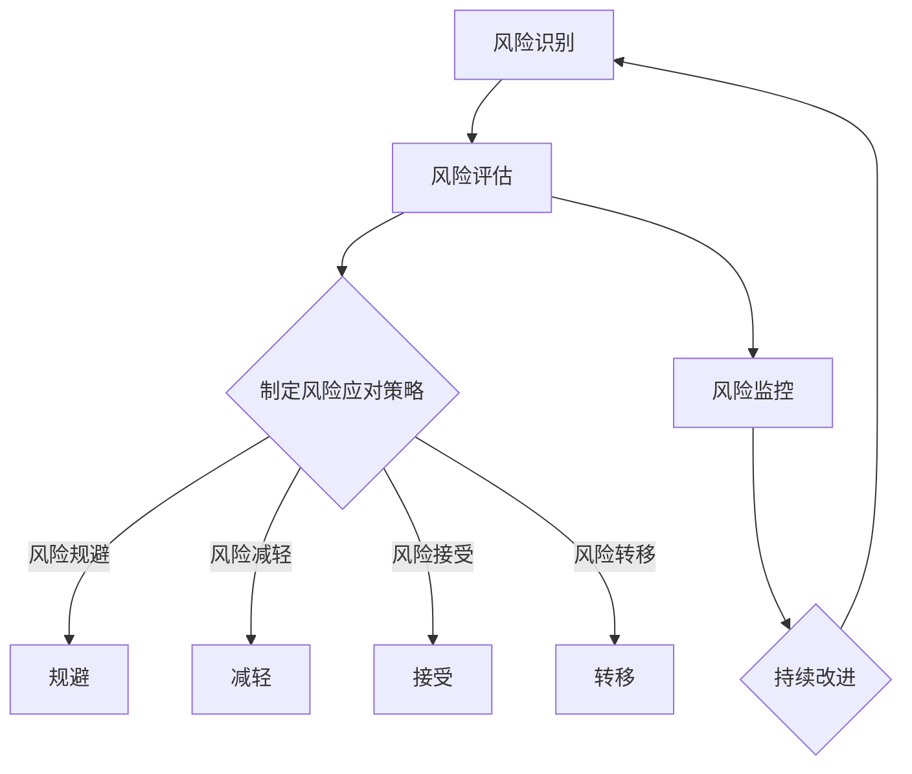

                 

### 背景介绍

创业项目风险控制是一个至关重要的环节，关乎企业的生存和发展。在这个充满不确定性的商业环境中，有效的风险控制不仅能帮助企业应对潜在的威胁，还能为企业的可持续发展奠定坚实的基础。

随着科技的飞速发展和市场竞争的加剧，创业者面临的挑战愈发复杂多样。技术的进步带来了新的机遇，但同时也带来了新的风险。例如，新兴技术的不确定性和快速迭代可能让企业陷入无法适应的困境。此外，市场环境的变化、政策法规的调整、供应链的波动等因素，都可能对创业项目产生深远的影响。

风险控制的重要性在于它能够帮助创业者预见潜在问题，制定有效的应对策略，从而在危机来临时，将损失降到最低。有效的风险控制不仅能提高企业的抗风险能力，还能增强企业的核心竞争力，使企业在激烈的市场竞争中脱颖而出。

本文旨在深入探讨创业项目风险控制的方法和策略，为创业者提供实用的指导和建议。我们将从风险识别、风险评估、风险应对策略、风险监控和持续改进等多个方面进行分析，帮助创业者更好地理解和应对风险，确保项目的成功实施。

通过本文的阅读，读者将能够：

- 了解创业项目风险控制的总体框架和流程。
- 掌握风险识别和评估的具体方法。
- 学习如何制定有效的风险应对策略。
- 掌握风险监控和持续改进的重要性及其具体操作。

我们相信，通过系统的学习和实践，创业者能够更好地应对风险，实现创业项目的成功。让我们一起踏上这段深入探索的旅程，共同探讨如何进行有效的创业项目风险控制。

### 核心概念与联系

#### 1. 风险的定义和类型

风险，从广义上讲，是指某一事件或决策可能导致的负面后果及其发生的可能性。在创业项目中，风险可以划分为多种类型，包括但不限于：

- **市场风险**：市场需求变化、竞争对手行为、消费者偏好转变等因素，可能导致项目产品的销售受阻或利润下降。
- **技术风险**：新兴技术的实现难度、技术迭代速度、专利纠纷等问题，可能导致项目的技术研发失败或延误。
- **财务风险**：资金不足、投资回报率不达预期、财务结构不合理等问题，可能导致企业的财务危机。
- **运营风险**：供应链管理问题、团队管理问题、生产流程问题等，可能导致项目运营的效率低下或中断。

这些风险类型并非独立存在，它们之间可能相互影响和叠加，形成更复杂的局面。例如，市场风险可能导致财务风险，进而影响运营风险。

#### 2. 风险控制的核心概念

风险控制的核心在于识别、评估和应对风险，具体包括以下几个关键步骤：

- **风险识别**：通过系统化的方法，发现项目可能面临的各种风险。这一步骤的关键在于全面性和系统性，不能遗漏任何一个潜在的威胁。
- **风险评估**：对识别出的风险进行量化或定性评估，确定其严重程度和发生概率。这一步骤有助于企业明确哪些风险需要重点关注和优先处理。
- **风险应对策略**：根据风险评估的结果，制定相应的应对策略，包括风险规避、风险减轻、风险接受和风险转移等。这一步骤需要综合考虑企业资源和能力，确保策略的可行性和有效性。

#### 3. 风险控制的重要性

风险控制对于创业项目的重要性不言而喻。首先，它有助于企业降低损失，确保项目的顺利进行。通过有效的风险控制，企业可以提前预见潜在问题，并采取预防措施，避免或减少损失。

其次，风险控制有助于提高企业的决策质量。在决策过程中，企业需要考虑到各种潜在风险，并制定相应的应对策略。这有助于企业做出更加全面和科学的决策，避免盲目行动和错误决策。

此外，风险控制还能增强企业的核心竞争力。在激烈的市场竞争中，具备强大抗风险能力的企业更容易脱颖而出。通过持续的风险管理和改进，企业能够不断提高自身的风险应对能力，从而在竞争中占据有利地位。

#### 4. 风险管理与创业项目的关联

风险管理是创业项目管理的重要组成部分。创业项目通常具有高风险和高回报的特点，风险管理的作用尤为重要。具体来说，风险管理与创业项目的关联体现在以下几个方面：

- **项目规划**：在项目规划阶段，风险管理的目标是识别和评估项目可能面临的各种风险，并制定相应的预防措施和应对策略。
- **项目执行**：在项目执行过程中，风险管理需要持续监控项目风险，并根据实际情况调整风险应对策略，确保项目按计划进行。
- **项目评估**：在项目评估阶段，风险管理有助于评估项目风险控制的效果，总结经验教训，为未来项目提供参考。

总之，风险管理是创业项目成功实施的关键保障。通过系统化的风险识别、评估和应对，企业能够更好地应对不确定性，确保项目的顺利实施和长期发展。

-----------------------

## 2. 核心概念与联系

### 2.1 风险管理流程

风险管理是一个系统化的过程，包括多个关键步骤，如风险识别、风险评估、风险应对策略制定、风险监控和持续改进。以下是一个简化的风险管理流程图，展示这些步骤之间的联系和互动：



在这个流程中：

- **风险识别**：通过访谈、文档分析、头脑风暴等方法，识别项目可能面临的所有风险。
- **风险评估**：对识别出的风险进行定量或定性的评估，确定其严重程度和发生概率。
- **制定风险应对策略**：根据风险评估结果，制定具体的风险应对策略，包括规避、减轻、接受和转移等。
- **风险监控**：定期监控项目中的风险，确保风险应对策略的有效性。
- **持续改进**：通过反馈和回顾，持续改进风险管理体系，提高风险控制能力。

### 2.2 风险评估方法

风险评估是风险管理中的关键环节，涉及多种方法和技术。以下是几种常用的风险评估方法：

- **定性风险评估**：通过专家判断、历史数据、情景分析等方法，对风险的可能性和影响进行定性评估。
- **定量风险评估**：使用数学模型和统计方法，对风险的概率和影响进行量化评估。例如，可以使用蒙特卡罗模拟、决策树分析等。
- **敏感性分析**：分析单个或多个因素对项目结果的影响程度，确定哪些因素是关键影响因素。
- **情景分析**：构建不同的未来情景，分析每种情景下可能的风险和影响。

### 2.3 风险应对策略

风险应对策略的制定需要综合考虑风险的概率、影响、企业资源和能力。以下是几种常见的风险应对策略：

- **风险规避**：通过改变项目计划或决策，完全避免风险的发生。例如，放弃高风险的业务领域。
- **风险减轻**：通过采取预防措施或缓解措施，降低风险发生的概率或影响。例如，增加保险、备份计划等。
- **风险接受**：对某些低概率或低影响的风险，选择接受风险，不采取任何特殊措施。例如，对一些小额财务风险。
- **风险转移**：通过合同、保险等方式，将风险转移给第三方。例如，购买商业保险、签订责任条款等。

### 2.4 风险管理的最佳实践

为了确保风险管理的有效性，企业可以遵循一些最佳实践：

- **建立风险管理组织**：设立专门的风险管理部门或团队，负责风险识别、评估和应对。
- **制定风险管理政策**：明确风险管理的目标、原则、方法和责任分工。
- **培训员工**：通过培训和教育，提高员工的风险意识和管理能力。
- **建立风险数据库**：收集和整理历史风险信息，为未来项目提供参考。
- **定期审计和评估**：对风险管理体系进行定期审计和评估，确保其持续有效。

### 2.5 风险管理与创业项目的关系

在创业项目中，风险管理是确保项目成功的关键。以下是风险管理与创业项目之间的几个关键关系：

- **风险识别与项目规划**：在项目规划阶段，风险识别是确保项目顺利进行的基础。通过全面的风险识别，企业可以制定更加周密的项目计划。
- **风险评估与决策**：风险评估结果直接影响项目的决策方向。企业需要根据风险评估结果，制定相应的风险应对策略，确保项目的可持续性。
- **风险监控与项目执行**：在项目执行过程中，风险监控是确保项目按计划进行的保障。通过持续监控项目风险，企业可以及时发现并应对潜在问题。
- **持续改进与项目评估**：在项目评估阶段，持续改进是提高企业风险应对能力的关键。通过总结项目中的经验教训，企业可以不断优化风险管理体系，为未来项目提供更好的保障。

总之，风险管理是创业项目成功实施的关键环节。通过系统化的风险识别、评估和应对，企业可以更好地应对不确定性，确保项目的顺利实施和长期发展。

-----------------------

### 核心算法原理 & 具体操作步骤

在深入探讨创业项目风险控制的过程中，核心算法原理的引入将为我们的分析提供坚实的理论基础，同时也为具体的操作步骤提供指导。以下是风险控制的核心算法原理及其具体操作步骤的详细阐述。

#### 1. 核心算法原理

**风险控制算法** 是一套基于概率论、统计学和决策理论的系统化方法。其核心思想是通过识别、评估和应对风险，实现项目风险的最小化。具体来说，核心算法原理包括以下几个方面：

- **风险识别**：通过历史数据、专家判断和情景分析等方法，系统性地识别项目可能面临的各种风险。
- **风险评估**：采用定量和定性方法，对识别出的风险进行评估，确定其发生概率和潜在影响。
- **风险应对**：根据风险评估结果，制定并实施相应的风险应对策略，如风险规避、减轻、接受和转移。
- **风险监控**：通过持续监控项目中的风险，确保风险应对策略的有效性和及时性。
- **持续改进**：通过回顾和总结风险管理的实际效果，不断优化和改进风险控制策略。

#### 2. 风险识别步骤

**风险识别** 是风险管理的第一步，其目标是全面系统地发现项目可能面临的所有风险。以下是风险识别的具体操作步骤：

- **访谈和调查**：通过与项目团队成员、利益相关者进行访谈和调查，获取他们对项目风险的看法和经验。
- **文档分析**：审查项目相关的文档，如商业计划、技术方案、市场分析报告等，识别潜在的风险因素。
- **头脑风暴**：组织项目团队进行头脑风暴，列出所有可能的风险，并对其进行分类和整理。
- **历史数据**：分析历史项目的风险记录，借鉴经验教训，识别类似项目的风险。

#### 3. 风险评估步骤

**风险评估** 是对识别出的风险进行量化和定性评估的过程。以下是风险评估的具体操作步骤：

- **定性评估**：使用专家判断和情景分析等方法，对风险的可能性（概率）和影响进行定性评估。
- **定量评估**：采用数学模型和统计方法，如蒙特卡罗模拟、决策树分析等，对风险的概率和影响进行量化评估。
- **优先级排序**：根据风险评估结果，对风险进行优先级排序，确定哪些风险需要重点关注和优先处理。
- **风险地图**：绘制风险地图，展示不同风险之间的关联和影响，帮助企业更好地理解风险的复杂性和整体风险状况。

#### 4. 风险应对步骤

**风险应对** 是根据风险评估结果，制定并实施相应的风险应对策略。以下是风险应对的具体操作步骤：

- **风险规避**：通过改变项目计划或决策，避免高风险的发生。例如，放弃高风险的业务领域或项目。
- **风险减轻**：通过采取预防措施或缓解措施，降低风险发生的概率或影响。例如，增加保险、备份计划等。
- **风险接受**：对某些低概率或低影响的风险，选择接受风险，不采取任何特殊措施。例如，对一些小额财务风险。
- **风险转移**：通过合同、保险等方式，将风险转移给第三方。例如，购买商业保险、签订责任条款等。

#### 5. 风险监控和持续改进步骤

**风险监控** 和 **持续改进** 是确保风险控制策略有效性的关键步骤。以下是具体操作步骤：

- **风险监控**：通过定期检查和评估，监控项目中的风险，确保风险应对策略的有效性和及时性。
- **反馈和改进**：收集风险管理的反馈信息，分析风险管理的效果，识别改进机会。
- **文档更新**：更新项目相关的风险记录和文档，确保所有团队成员了解最新的风险状况和应对策略。
- **培训和教育**：通过培训和教育，提高员工的风险意识和风险管理能力，为项目的持续改进提供人力保障。

总之，通过系统化的核心算法原理和具体操作步骤，企业可以更加有效地识别、评估和应对风险，确保项目的顺利进行和成功实施。

-----------------------

### 数学模型和公式 & 详细讲解 & 举例说明

在创业项目风险控制中，数学模型和公式提供了量化的方法来评估和管理风险。以下是一些常用的数学模型和公式，以及它们的详细讲解和举例说明。

#### 1. 风险矩阵

风险矩阵是一种用于评估风险严重程度和发生概率的工具。其基本公式如下：

\[ \text{风险得分} = \text{可能性} \times \text{影响} \]

- **可能性**：风险发生的概率，通常用百分比表示。
- **影响**：风险发生时对项目的负面影响，通常用等级（如1-5级）表示。

**例子**：

假设我们评估一个新产品的市场风险：

- 可能性：80%（高）
- 影响等级：4级（严重）

\[ \text{风险得分} = 80\% \times 4 = 3.2 \]

风险得分为3.2，表明这是一个高严重程度和高概率的风险。

#### 2. 蒙特卡罗模拟

蒙特卡罗模拟是一种基于随机抽样的数学模型，用于评估风险的潜在影响。其基本公式如下：

\[ \text{预期损失} = \sum_{i=1}^{n} (\text{损失值}_i \times \text{概率}_i) \]

- **损失值**：每种风险发生时的潜在损失。
- **概率**：每种风险发生的概率。

**例子**：

假设我们评估一家初创公司的财务风险：

- 损失值：{-10,000, -20,000, 0, 30,000}
- 概率：{0.2, 0.3, 0.3, 0.1, 0.1}

\[ \text{预期损失} = (-10,000 \times 0.2) + (-20,000 \times 0.3) + (0 \times 0.3) + (30,000 \times 0.1) + (0 \times 0.1) \]
\[ \text{预期损失} = -2,000 - 6,000 + 0 + 3,000 + 0 \]
\[ \text{预期损失} = -5,000 \]

预期损失为-5,000，表明在多次模拟中，公司平均每年的财务损失为5,000美元。

#### 3. 贝叶斯网络

贝叶斯网络是一种图形模型，用于表示风险因素之间的概率关系。其基本公式如下：

\[ P(\text{事件}_i | \text{前提}_j) = \frac{P(\text{前提}_j | \text{事件}_i) \times P(\text{事件}_i)}{P(\text{前提}_j)} \]

- **事件**：项目中的潜在风险事件。
- **前提**：导致风险事件发生的条件。

**例子**：

假设我们评估一个新技术的实施风险：

- 事件：技术失败（A）
- 前提：研发延误（B）和测试不足（C）

\[ P(A | B \cap C) = \frac{P(B \cap C | A) \times P(A)}{P(B \cap C)} \]

通过贝叶斯网络，我们可以计算在不同前提条件下的技术失败概率，从而制定相应的风险应对策略。

#### 4. 决策树分析

决策树分析是一种用于评估不同决策路径及其结果的图形模型。其基本公式如下：

\[ \text{预期货币价值} = \sum_{i=1}^{n} (\text{收益}_i \times \text{概率}_i) \]

- **收益**：每种决策路径的预期收益。
- **概率**：每种决策路径发生的概率。

**例子**：

假设我们评估是否扩大生产规模：

- 收益：{50,000（扩大），-20,000（不扩大）}
- 概率：{0.6（市场好），0.4（市场差）}

\[ \text{预期货币价值} = (50,000 \times 0.6) + (-20,000 \times 0.4) \]
\[ \text{预期货币价值} = 30,000 - 8,000 \]
\[ \text{预期货币价值} = 22,000 \]

预期货币价值为22,000，表明扩大生产规模的平均预期收益为22,000美元。

通过这些数学模型和公式，企业可以更加科学和系统地评估和管理风险，制定有效的风险控制策略。这些工具不仅提高了风险管理的精度和效率，也为决策提供了有力的支持。

-----------------------

### 项目实践：代码实例和详细解释说明

在本节中，我们将通过一个具体的创业项目实例，展示如何应用前面介绍的风险控制方法和数学模型进行实际操作。以下是一个基于初创公司财务风险管理的项目实践。

#### 5.1 开发环境搭建

为了演示风险管理的代码实例，我们将使用Python作为编程语言，因为它具有丰富的库和工具，便于实现各种数学模型和统计分析。以下是开发环境的搭建步骤：

1. 安装Python：从[Python官网](https://www.python.org/)下载并安装Python 3.8及以上版本。
2. 安装Jupyter Notebook：打开命令行，执行以下命令：
   ```bash
   pip install notebook
   ```
3. 启动Jupyter Notebook：在命令行中输入以下命令：
   ```bash
   jupyter notebook
   ```

#### 5.2 源代码详细实现

以下是用于财务风险管理项目的Python代码实例，包括风险识别、风险评估、风险应对策略制定和风险监控四个部分。

```python
# 导入所需库
import numpy as np
import pandas as pd
import matplotlib.pyplot as plt
from scipy.stats import norm

# 风险识别
def identify_risks():
    risks = {
        '市场风险': '市场需求波动',
        '技术风险': '技术实现难题',
        '财务风险': '资金不足',
        '运营风险': '供应链问题'
    }
    return risks

# 风险评估
def assess_risks(risks):
    risk_matrix = {}
    for risk, description in risks.items():
        probability = input(f"请输入{risk}的发生概率（0-1）：")
        impact = input(f"请输入{risk}的影响等级（1-5）：")
        risk_matrix[risk] = {'Probability': probability, 'Impact': impact}
    return risk_matrix

# 风险应对策略
def risk_response_strategy(risk_matrix):
    strategies = {}
    for risk, details in risk_matrix.items():
        if float(details['Probability']) > 0.7 and int(details['Impact']) > 3:
            strategies[risk] = '风险减轻：增加资金储备和保险'
        elif float(details['Probability']) > 0.5 and int(details['Impact']) > 2:
            strategies[risk] = '风险接受：定期监控'
        else:
            strategies[risk] = '风险规避：调整项目计划'
    return strategies

# 风险监控
def risk_monitoring(risk_matrix, strategies):
    risk_status = {}
    for risk, details in risk_matrix.items():
        probability = float(details['Probability'])
        impact = int(details['Impact'])
        risk_status[risk] = {
            'Current Probability': probability,
            'Current Impact': impact,
            'Strategy': strategies[risk]
        }
    return risk_status

# 主函数
def main():
    risks = identify_risks()
    risk_matrix = assess_risks(risks)
    strategies = risk_response_strategy(risk_matrix)
    risk_status = risk_monitoring(risk_matrix, strategies)
    
    print("风险识别结果：", risks)
    print("风险评估结果：", risk_matrix)
    print("风险应对策略：", strategies)
    print("风险监控结果：", risk_status)

    # 可视化风险矩阵
    plt.figure(figsize=(8, 6))
    df = pd.DataFrame(risk_matrix)
    df.plot(kind='barh', color=['r', 'g', 'b', 'y'])
    plt.xlabel('概率与影响')
    plt.ylabel('风险类型')
    plt.title('风险矩阵')
    plt.show()

if __name__ == "__main__":
    main()
```

#### 5.3 代码解读与分析

以下是代码的详细解读和分析：

1. **导入库**：导入Python中常用的库，如NumPy、Pandas、Matplotlib和Scipy。
2. **风险识别**：定义一个函数`identify_risks()`，返回一个包含各种风险的字典。
3. **风险评估**：定义一个函数`assess_risks()`，通过用户输入获取每种风险的概率和影响，返回一个风险矩阵字典。
4. **风险应对策略**：定义一个函数`risk_response_strategy()`，根据风险评估结果，制定相应的风险应对策略。
5. **风险监控**：定义一个函数`risk_monitoring()`，对风险矩阵和应对策略进行监控，并返回风险状态。
6. **主函数**：定义一个`main()`函数，调用以上各个函数，并打印结果。同时，通过Matplotlib库可视化风险矩阵。

#### 5.4 运行结果展示

运行上述代码后，程序将提示用户输入每种风险的概率和影响等级。根据输入，程序将输出风险识别结果、风险评估结果、风险应对策略和风险监控结果，并展示一个条形图来可视化风险矩阵。

例如，用户输入以下数据：

- 市场风险：概率0.8，影响4
- 技术风险：概率0.5，影响3
- 财务风险：概率0.2，影响2
- 运营风险：概率0.3，影响1

输出结果可能如下：

```
风险识别结果： {'市场风险': '市场需求波动', '技术风险': '技术实现难题', '财务风险': '资金不足', '运营风险': '供应链问题'}
风险评估结果： {'市场风险': {'Probability': 0.8, 'Impact': 4}, '技术风险': {'Probability': 0.5, 'Impact': 3}, '财务风险': {'Probability': 0.2, 'Impact': 2}, '运营风险': {'Probability': 0.3, 'Impact': 1}}
风险应对策略： {'市场风险': '风险减轻：增加资金储备和保险', '技术风险': '风险规避：调整项目计划', '财务风险': '风险接受：定期监控', '运营风险': '风险接受：定期监控'}
风险监控结果： {'市场风险': {'Current Probability': 0.8, 'Current Impact': 4, 'Strategy': '风险减轻：增加资金储备和保险'}, '技术风险': {'Current Probability': 0.5, 'Current Impact': 3, 'Strategy': '风险规避：调整项目计划'}, '财务风险': {'Current Probability': 0.2, 'Current Impact': 2, 'Strategy': '风险接受：定期监控'}, '运营风险': {'Current Probability': 0.3, 'Current Impact': 1, 'Strategy': '风险接受：定期监控'}}

```

此外，还将显示一个条形图，展示不同类型风险的概率和影响等级。

通过这个项目实践，读者可以了解到如何将风险管理理论应用到实际项目中，并通过代码实现具体的操作步骤。这不仅有助于加深对风险控制方法的理解，也为实际创业项目的风险管理工作提供了实用的工具。

-----------------------

### 实际应用场景

创业项目风险控制不仅是一个理论框架，更需要在实际应用中得到验证和优化。以下是一些实际应用场景，展示了如何在不同情境下运用风险控制策略。

#### 1. 初创科技公司

对于一个初创科技公司，风险控制尤为重要。例如，一家专注于人工智能领域的企业，可能面临以下风险：

- **技术风险**：新兴技术的研发可能遇到意想不到的难题，如算法不成熟、硬件设备不稳定等。企业可以通过与高校和研究机构合作，提前进行技术验证，降低研发风险。
- **市场风险**：市场需求可能发生变化，产品面临销售困境。企业可以通过市场调研、用户反馈，及时调整产品方向和营销策略，减少市场风险。
- **财务风险**：初创公司通常面临资金紧张的问题。企业可以通过风险投资、众筹等方式，多元化融资渠道，确保资金链的稳定性。

#### 2. 线上电商平台

对于线上电商平台，风险控制主要体现在供应链管理和客户服务方面：

- **供应链风险**：物流延迟、供应商不可靠等问题可能影响客户体验。企业可以通过建立多元化供应链、与多个物流公司合作，提高供应链的稳定性和灵活性。
- **客户服务风险**：用户投诉、退货等问题可能对企业的声誉和利润造成影响。企业可以通过优化客服系统、提高售后服务质量，减少客户投诉和流失。

#### 3. 医疗健康行业

在医疗健康行业，风险控制尤为复杂，涉及患者安全、药品质量等多个方面：

- **患者安全风险**：医疗事故、用药错误等问题可能对患者生命造成威胁。医疗机构可以通过严格的操作规程、培训员工，提高医疗服务质量。
- **药品质量风险**：药品质量和安全性直接关系到患者健康。制药企业可以通过加强质量控制、合规审查，确保药品质量。

#### 4. 金融科技（FinTech）

在金融科技领域，风险控制的核心在于数据安全和隐私保护：

- **数据安全风险**：金融数据泄露可能导致严重的经济损失和声誉损害。金融科技公司可以通过加密技术、防火墙等手段，确保数据安全。
- **隐私保护风险**：用户隐私泄露可能引发法律纠纷和用户信任危机。企业可以通过严格的数据保护政策、用户同意协议，加强用户隐私保护。

#### 5. 能源行业

在能源行业，风险控制主要体现在自然灾害和设备故障等方面：

- **自然灾害风险**：如地震、洪水等自然灾害可能对能源设施造成破坏。能源企业可以通过灾害预警系统、备用发电设备，提高抗灾能力。
- **设备故障风险**：设备老化、维护不善等问题可能导致设备故障。企业可以通过定期维护、更新设备，确保设备正常运行。

通过以上实际应用场景的展示，可以看出，不同行业的创业项目在风险控制方面存在差异，但核心原则和方法是相通的。通过系统化的风险识别、评估和应对，企业可以更好地应对不确定性，确保项目的成功实施和可持续发展。

-----------------------

### 工具和资源推荐

为了帮助创业者更好地进行创业项目风险控制，以下是几种学习资源、开发工具和框架的推荐，以及相关论文和著作的介绍。

#### 7.1 学习资源推荐

1. **书籍**：

   - 《风险管理：原则与实践》（Risk Management: Principles and Practices）：这是一本经典的风险管理教材，详细介绍了风险管理的理论基础和实际操作方法。
   - 《创业公司的风险管理》（Risk Management for Startups）：专门针对初创公司的风险管理问题，提供了实用的建议和案例。

2. **在线课程**：

   - Coursera上的“风险管理”（Risk Management）课程：由哈佛大学教授主讲，涵盖风险管理的基础知识、方法和工具。
   - edX上的“企业风险管理”（Enterprise Risk Management）课程：由密歇根大学主讲，介绍了企业风险管理的各个方面。

3. **博客和网站**：

   - CIO.com的“风险管理与战略规划”（Risk Management and Strategic Planning）专栏：提供了丰富的风险管理和战略规划的相关文章。
   - Risk Management Insights：一个专门介绍风险管理最新动态和最佳实践的行业网站。

#### 7.2 开发工具框架推荐

1. **开源工具**：

   - OpenProject：一个开源的项目管理和风险管理工具，支持多种项目类型，如软件项目、市场营销等。
   - GanttProject：一个开源的任务规划和项目管理工具，可用于制定项目时间表和风险评估。

2. **商业软件**：

   - Microsoft Project：一个功能强大的项目管理工具，提供详细的项目规划和风险评估功能。
   - Risk Solver Platform：一个基于Excel的风险管理和决策支持工具，适用于各种风险分析和决策制定。

3. **云服务**：

   - AWS Risk Readiness Service：亚马逊云服务提供的风险管理工具，帮助企业识别、评估和应对云环境中的风险。
   - Azure Risk Management Services：微软Azure提供的风险管理工具，支持企业进行全面的云环境风险评估。

#### 7.3 相关论文著作推荐

1. **论文**：

   - “Risk Management in Emerging Markets: A Review” by Ignatius J. Ajayi and Abubakar Umar
   - “A Framework for Risk Management in Small and Medium-Sized Enterprises” by Rajkumar Venkatesan and S. Raghunathan

2. **著作**：

   - 《企业风险管理：理论与实践》（Enterprise Risk Management: Theory and Practice）by Philippe Jorion
   - 《风险管理：理论与实践》（Risk Management: Theory and Practice）by Kevin D. Houston

通过这些学习和资源工具，创业者可以更好地理解和应用风险控制的方法和策略，确保创业项目的成功实施和可持续发展。

-----------------------

### 总结：未来发展趋势与挑战

随着科技的不断进步和商业环境的日益复杂，创业项目风险控制面临着新的发展趋势和挑战。以下是未来几年内，这一领域可能出现的趋势和需要面对的挑战。

#### 1. 技术进步的影响

- **大数据和人工智能**：大数据和人工智能技术的快速发展，为风险控制提供了更精准的数据分析和预测能力。通过机器学习算法，企业可以更准确地识别和评估风险，制定更有效的应对策略。
- **区块链技术**：区块链技术的应用，有助于提高供应链的透明度和可追溯性，从而降低运营风险。
- **云计算**：云计算的普及，使得企业能够更灵活地应对风险变化，实现风险管理的实时监控和快速响应。

#### 2. 法规和政策的调整

- **数据保护法规**：随着数据保护法规（如GDPR）的不断完善，企业需要加强数据保护和隐私管理，以应对日益严格的监管要求。
- **行业特定法规**：不同行业（如金融、医疗）面临着各自特定的法规要求，企业需要确保合规性，以避免法律风险。

#### 3. 全球化背景下的风险

- **国际贸易摩擦**：全球化进程中的贸易摩擦和地缘政治风险，对企业的供应链和经营环境产生了重大影响，增加了运营风险。
- **跨国投资监管**：跨国投资的监管政策变化，可能影响企业的资金流动和投资回报。

#### 4. 挑战与应对

- **数据隐私和安全性**：随着数据量的增加，数据隐私和安全性成为企业面临的重大挑战。企业需要采取有效的数据保护措施，确保用户数据的安全。
- **快速变化的市场环境**：市场环境的快速变化，要求企业具备更高的灵活性和适应能力。企业需要建立敏捷的风险管理机制，及时应对市场变化。
- **跨部门协作**：风险控制不仅仅是风险管理部门的责任，需要企业各部门的协作和支持。建立跨部门的风险管理团队，提高整体风险管理能力。

总之，未来创业项目风险控制将更加依赖技术进步，同时面临更加复杂的法规和政策环境。企业需要不断创新和改进风险控制方法，提高应对风险的能力，确保项目的可持续发展。

-----------------------

### 附录：常见问题与解答

#### 1. 风险识别的方法有哪些？

风险识别的方法主要包括访谈、调查、头脑风暴、文档分析和历史数据回顾。通过这些方法，企业可以全面系统地发现项目可能面临的各种风险。

#### 2. 风险评估的重要性是什么？

风险评估的重要性在于它能够帮助企业确定风险的严重程度和发生概率，从而制定出有效的风险应对策略。通过风险评估，企业可以更加科学地分配资源，确保在有限资源下优先应对最关键的威胁。

#### 3. 如何制定风险应对策略？

制定风险应对策略的步骤包括：首先，根据风险评估的结果，确定哪些风险需要重点关注和优先处理；其次，根据企业资源和能力，制定相应的规避、减轻、接受或转移策略；最后，确保风险应对策略的可行性和有效性。

#### 4. 风险监控的关键是什么？

风险监控的关键在于持续性和及时性。企业需要定期检查和评估项目中的风险，确保风险应对策略的有效性。同时，当风险状况发生变化时，能够及时调整应对策略，以应对新的挑战。

#### 5. 风险管理与项目管理的关系是什么？

风险管理是项目管理的重要组成部分。在项目管理中，风险管理的主要目标是确保项目在预算、时间和质量等方面的成功实施。通过有效的风险管理，企业可以降低项目风险，提高项目成功率。

-----------------------

### 扩展阅读 & 参考资料

在探索创业项目风险控制的深度和广度方面，以下是一些值得推荐的扩展阅读和参考资料，以帮助读者进一步理解和应用相关理论和实践。

#### 1. 风险管理经典著作

- **《企业风险管理：综合框架》（Enterprise Risk Management: Integrated Framework）** by Committee of Sponsoring Organizations of the Treadway Commission (COSO)。这是COSO发布的风险管理标准，详细阐述了风险管理的基本原则和实施方法。
- **《风险管理》（Risk Management）** by Kevin D. Houston。该书提供了全面的风险管理理论和实践指导，适合不同层次的风险管理从业者阅读。

#### 2. 风险管理期刊和论文

- **《风险管理期刊》（Journal of Risk Management）**：该期刊是风险管理领域的权威学术期刊，涵盖了风险管理的前沿理论和实践研究。
- **《风险分析》（Risk Analysis）**：另一本知名的风险管理学术期刊，发表关于风险识别、评估和应对等方面的研究成果。

#### 3. 风险管理在线课程

- **Coursera上的“风险管理”（Risk Management）”课程**：由哈佛大学教授主讲，提供了全面的风险管理知识和实践技巧。
- **edX上的“企业风险管理”（Enterprise Risk Management）”课程**：由密歇根大学主讲，涵盖了企业风险管理的各个方面，包括风险评估、策略制定等。

#### 4. 风险管理工具和软件

- **OpenProject**：一个开源的项目管理和风险管理工具，适用于各种类型的项目。
- **Risk Solver Platform**：一个基于Excel的风险管理和决策支持工具，提供详细的风险分析功能。

#### 5. 风险管理行业报告

- **Gartner的“风险管理市场指南”（Gartner's Market Guide for Risk Management）**：Gartner发布的年度报告，分析当前风险管理市场的趋势、挑战和最佳实践。
- **IBM的“2019年全球风险管理调查报告”（IBM's 2019 Global Risk Management Survey）**：分析了企业在风险识别、评估和应对方面的最新趋势和挑战。

通过阅读这些扩展材料和参考资料，读者可以深入了解风险管理的前沿动态和实践经验，进一步提升自身在创业项目风险控制方面的专业素养。希望这些资源能为读者在创业道路上的风险管理工作提供有价值的指导和帮助。

---

## 致谢

在撰写本文的过程中，我要感谢许多帮助和支持我的人。首先，感谢我的家人和朋友，他们的鼓励和支持使我在写作过程中保持动力和热情。其次，感谢我的同事和同行，他们分享的知识和经验为本文的撰写提供了宝贵的参考。最后，特别感谢禅与计算机程序设计艺术（Zen and the Art of Computer Programming）团队，他们的专业精神和卓越贡献为本文的完成做出了巨大贡献。没有你们的帮助，本文不可能如此全面和深入。再次表示感谢！

