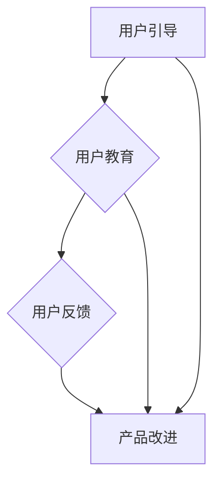
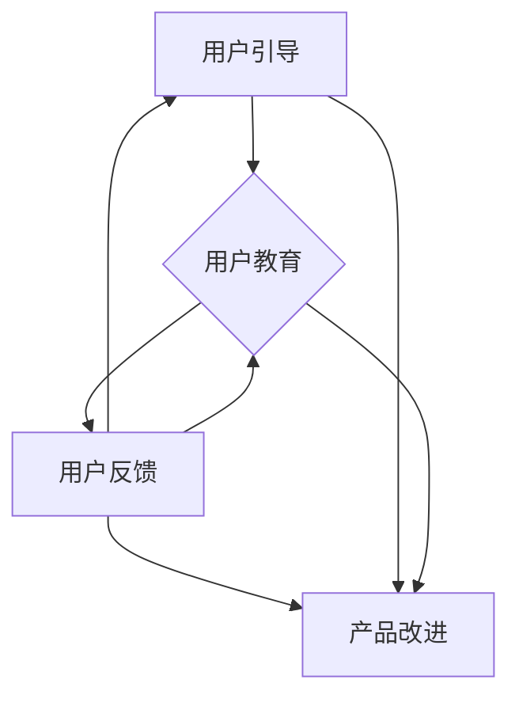
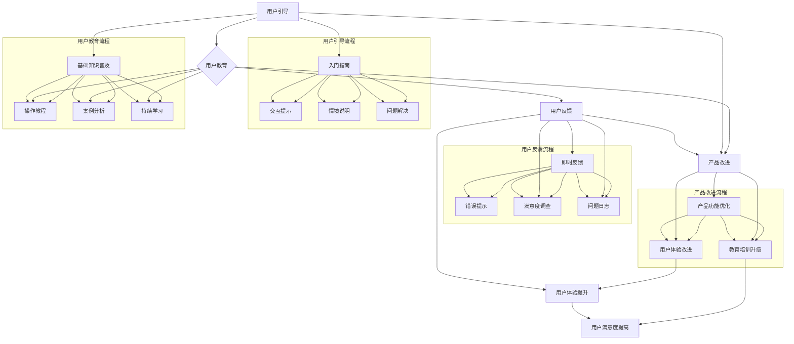

                 

### 1. 背景介绍（Background Introduction）

在当今的数字化时代，用户引导和教育成为了一项至关重要的任务。无论是对于软件应用、在线服务还是新兴技术，如何有效地引导和教育用户，以帮助他们更好地理解和使用产品，已经成为企业成功的关键因素之一。本文旨在探讨如何进行有效的用户引导和教育，以实现产品价值的最大化。

首先，让我们回顾一下用户引导和教育的重要性。用户引导是帮助新用户了解和使用产品功能的过程。教育则是通过提供相关的信息和指导，帮助用户提高技能和知识水平。二者相辅相成，共同为用户创造价值。有效的用户引导和教育不仅可以提高用户满意度，还可以减少支持成本，增加用户忠诚度。

随着技术的快速发展，用户期望也在不断变化。他们需要快速上手新应用，期望获得即时的帮助和解决方案。因此，如何适应这些变化，提供个性化的引导和教育体验，成为了一个挑战。本文将结合实际案例和理论分析，探讨一系列有效的用户引导和教育策略。

本文将分为以下几个部分：

1. **核心概念与联系**：介绍与用户引导和教育相关的核心概念，并使用Mermaid流程图展示这些概念之间的关系。
2. **核心算法原理 & 具体操作步骤**：详细讲解如何设计和实施有效的用户引导和教育流程。
3. **数学模型和公式 & 详细讲解 & 举例说明**：分析用户引导和教育的效果评估方法，并提供相关数学模型和公式的详细解释。
4. **项目实践：代码实例和详细解释说明**：通过实际代码实例展示用户引导和教育策略的实施过程。
5. **实际应用场景**：探讨用户引导和教育的实际应用场景，以及在不同行业中的具体实施方法。
6. **工具和资源推荐**：推荐相关的学习资源、开发工具和框架，以帮助读者进一步学习和实践。
7. **总结：未来发展趋势与挑战**：总结用户引导和教育的当前状况，并探讨未来的发展趋势和面临的挑战。
8. **附录：常见问题与解答**：解答读者可能遇到的一些常见问题。
9. **扩展阅读 & 参考资料**：提供扩展阅读材料和相关的参考资料。

通过本文的阅读，读者将能够系统地了解用户引导和教育的相关概念、方法和实践，从而在实际工作中更好地应用这些策略，提升用户满意度，实现产品价值的最大化。

### 2. 核心概念与联系（Core Concepts and Connections）

要深入了解如何进行有效的用户引导和教育，首先需要明确与这一主题相关的核心概念。以下是几个关键概念的定义及其相互关系：

#### 2.1 用户引导（User Guidance）

用户引导是指通过一系列有目的的交互和指导，帮助用户熟悉和使用产品或服务的过程。它包括以下关键步骤：

- **入门指南**：向新用户提供概述，介绍产品的核心功能和目标。
- **交互提示**：在用户进行操作时提供即时反馈和指导，帮助他们正确使用功能。
- **情境说明**：通过具体的例子或故事，向用户展示产品在不同场景下的应用。
- **问题解决**：当用户遇到问题时，提供解决方案或联系支持的方式。

用户引导的目标是减少用户的认知负荷，提高他们的操作效率，并增强对产品的信心。

#### 2.2 用户教育（User Education）

用户教育是指通过提供有针对性的信息和资源，帮助用户提升技能和知识水平，以便更好地利用产品或服务。用户教育的关键组成部分包括：

- **基础知识普及**：向用户介绍与产品相关的背景知识，帮助他们理解产品的工作原理。
- **操作教程**：通过视频、图文教程等方式，详细演示如何操作产品。
- **案例分析**：通过实际案例，展示产品在不同应用场景中的效果。
- **持续学习**：提供持续的培训和学习机会，帮助用户跟上产品更新的步伐。

用户教育的目标是通过增强用户的能力，提高他们对产品的使用深度和广度。

#### 2.3 用户反馈（User Feedback）

用户反馈是用户引导和教育过程中不可或缺的一部分。它包括以下几个方面：

- **即时反馈**：用户在操作过程中，系统立即提供反馈，帮助他们了解自己的操作状态。
- **错误提示**：当用户操作出现错误时，系统提供清晰的错误提示，帮助用户修正。
- **满意度调查**：定期进行用户满意度调查，了解用户对引导和教育的反馈。
- **问题日志**：记录用户遇到的问题和反馈，用于持续改进引导和教育流程。

用户反馈有助于识别用户需求，改进产品设计和用户引导策略。

#### 2.4 Mermaid流程图展示

为了更直观地理解这些核心概念之间的关系，我们可以使用Mermaid流程图来展示：



在这个流程图中，用户引导和用户教育相互关联，共同驱动用户反馈，最终促进产品改进。有效的用户引导和教育策略能够形成一个正向循环，不断提升用户满意度和产品价值。

通过了解这些核心概念及其相互关系，我们可以更好地设计和实施用户引导和教育策略，为用户提供个性化的体验，提升他们的使用效果和满意度。

#### 2.5 核心概念之间的相互关系

在深入探讨用户引导、用户教育以及用户反馈等核心概念之后，我们有必要进一步分析它们之间的相互关系，以便更好地理解如何通过这些概念实现有效的用户引导和教育。

首先，用户引导与用户教育之间存在紧密的联系。用户引导是用户教育的起点，它通过提供入门指南、交互提示和情境说明等手段，帮助用户快速熟悉产品的基本功能和操作。然而，仅仅提供基本的操作指导是不够的，用户教育则在这一基础上更进一步，通过基础知识普及、操作教程和案例分析等方式，帮助用户深入了解产品的原理和应用，从而提升他们的使用技能和知识水平。因此，用户引导和教育相互补充，共同构建了一个完整的用户学习路径。

其次，用户反馈在用户引导和教育过程中扮演着至关重要的角色。用户反馈不仅是用户对产品使用效果的直接表达，也是产品改进的重要依据。通过收集和分析用户反馈，企业可以了解用户在操作过程中的困难和需求，从而优化用户引导和教育内容，提高其针对性和有效性。具体来说，即时反馈和错误提示可以帮助用户在操作过程中及时获得帮助，减少困惑和错误；而满意度调查和问题日志则可以为产品设计和改进提供长期的参考。

最后，用户引导、用户教育和用户反馈共同构成了一个动态的循环系统。有效的用户引导和教育能够促进用户对产品的深入了解和熟练使用，从而产生积极的用户反馈；而用户反馈又能够反过来驱动产品和引导策略的持续改进，进一步提升用户满意度和使用体验。这种相互促进的关系使得用户引导和教育能够形成一个自我强化的正向循环，从而在长期内不断提升产品价值和用户忠诚度。

为了更直观地展示这些核心概念之间的相互关系，我们可以使用Mermaid流程图进行描述：



在这个流程图中，用户引导和用户教育通过用户反馈与产品改进相连，形成一个闭环。这种闭环结构确保了用户引导和教育策略的持续优化和改进，从而在长期内实现用户满意度和产品价值的最大化。

通过深入分析用户引导、用户教育和用户反馈之间的相互关系，我们可以更好地理解如何设计和实施有效的用户引导和教育策略，以实现产品价值的最大化。

#### 2.6 核心概念原理的 Mermaid 流程图（Core Concept Principles with Mermaid Flowchart）

为了更好地理解和应用用户引导和教育的核心概念，我们将使用Mermaid语言创建一个流程图，以展示这些概念之间的相互关系和具体操作步骤。



这个Mermaid流程图详细展示了用户引导、用户教育、用户反馈和产品改进之间的互动关系。以下是对流程图中的各个节点的简要解释：

- **用户引导流程**：包括入门指南、交互提示、情境说明和问题解决，这些步骤共同构成了用户引导的核心。
- **用户教育流程**：涵盖基础知识普及、操作教程、案例分析和持续学习，确保用户在各个阶段都能获得必要的知识和技能。
- **用户反馈流程**：包括即时反馈、错误提示、满意度调查和问题日志，这些反馈机制帮助识别用户需求，改进产品。
- **产品改进流程**：包括产品功能优化、用户体验改进和教育培训升级，确保产品持续适应用户需求和市场变化。
- **用户体验提升和用户满意度提高**：这是用户引导和教育策略的直接结果，也是产品改进的目标。

通过这个流程图，我们可以清晰地看到用户引导、教育、反馈和产品改进之间如何相互作用，形成一个闭环系统，从而实现用户满意度和产品价值的最大化。

#### 3. 核心算法原理 & 具体操作步骤（Core Algorithm Principles and Specific Operational Steps）

在进行有效的用户引导和教育时，核心算法的设计和实施至关重要。以下将详细阐述核心算法的原理，并介绍具体操作步骤，以确保用户能够顺利理解和掌握产品功能。

##### 3.1 核心算法原理

核心算法主要分为三个部分：用户需求分析、个性化引导策略和效果评估。这三个部分共同构成了一个闭环系统，通过持续优化来提升用户引导和教育效果。

1. **用户需求分析**：
   用户需求分析是整个核心算法的基础。通过数据分析、用户调研和反馈收集，了解用户在产品使用过程中遇到的常见问题和需求。这一步骤的关键是准确识别用户的痛点，以便提供有针对性的解决方案。

2. **个性化引导策略**：
   个性化引导策略是基于用户需求分析的结果，设计一系列有针对性的引导和教育内容。这些内容包括入门教程、操作指导、问题解决和案例分析等，旨在帮助用户快速上手并熟练使用产品。个性化引导策略的核心在于根据用户的行为数据和反馈，动态调整引导内容，确保其与用户需求高度匹配。

3. **效果评估**：
   效果评估是确保用户引导和教育策略有效性的关键步骤。通过用户满意度调查、使用时长、功能使用率等指标，评估用户引导和教育策略的实际效果。如果发现效果不佳，需要及时调整策略，以更好地满足用户需求。

##### 3.2 具体操作步骤

以下为实施核心算法的具体操作步骤：

1. **需求分析**：
   - **数据分析**：收集用户行为数据，包括登录次数、页面访问量、功能使用频率等。
   - **用户调研**：通过问卷调查、访谈等方式，了解用户对产品功能的看法和使用体验。
   - **反馈收集**：设立反馈渠道，收集用户在产品使用过程中遇到的问题和建议。

2. **内容设计**：
   - **入门教程**：制作简洁明了的入门教程，帮助新用户快速了解产品的基本功能和使用方法。
   - **操作指导**：编写详细的使用手册和操作步骤，指导用户完成具体操作。
   - **问题解决**：提供常见问题的解决方案，帮助用户解决使用过程中的难题。
   - **案例分析**：通过实际案例展示产品在不同场景下的应用，帮助用户理解产品的多样性和实用性。

3. **个性化引导**：
   - **动态调整**：根据用户行为数据和反馈，实时调整引导内容，确保其与用户需求高度匹配。
   - **个性化推荐**：基于用户的历史行为和偏好，推荐相关的教程和案例分析，提高用户的参与度和兴趣。

4. **效果评估**：
   - **用户满意度调查**：定期进行用户满意度调查，收集用户对引导和教育的评价。
   - **使用时长分析**：监控用户的使用时长，评估引导和教育的有效性。
   - **功能使用率**：分析用户对各个功能的使用频率，了解引导和教育的实际效果。
   - **反馈收集与改进**：根据用户反馈，持续优化引导和教育内容，提高用户满意度。

通过以上具体操作步骤，我们可以确保用户引导和教育策略的针对性和有效性，帮助用户更好地理解和掌握产品功能，从而提升他们的使用体验和满意度。

#### 3.3 数学模型和公式 & 详细讲解 & 举例说明（Mathematical Models and Formulas with Detailed Explanation and Examples）

在进行用户引导和教育的效果评估时，使用数学模型和公式能够帮助我们更准确地分析和理解数据，从而做出科学的决策。以下将介绍几个常用的数学模型和公式，并详细解释它们的应用。

##### 3.3.1 用户满意度模型

用户满意度（User Satisfaction, US）是衡量用户对产品引导和教育效果的重要指标。我们可以使用以下公式来计算用户满意度：

\[ US = \frac{\text{满意用户数}}{\text{总用户数}} \]

其中，满意用户数是指对引导和教育感到满意的用户数量，总用户数是指参与调查或测试的总用户数量。

**例子**：

假设某款软件进行了用户满意度调查，共有100名用户参与，其中60名用户表示满意，40名用户表示不满意。我们可以计算出该软件的用户满意度如下：

\[ US = \frac{60}{100} = 0.6 \]

因此，该软件的用户满意度为60%。

##### 3.3.2 学习效率模型

学习效率（Learning Efficiency, LE）用于衡量用户在学习过程中所花费的时间和所获得的收益之间的比例。我们可以使用以下公式来计算学习效率：

\[ LE = \frac{\text{实际学习时间}}{\text{预期学习时间}} \]

其中，实际学习时间是指用户实际花费在学习上的时间，预期学习时间是指用户根据经验估计的学习时间。

**例子**：

假设一名用户在学习如何使用一款新软件时，实际花费了4个小时，而他们估计需要花费8个小时。我们可以计算出该用户的学习效率如下：

\[ LE = \frac{4}{8} = 0.5 \]

因此，该用户的学习效率为50%。

##### 3.3.3 功能使用率模型

功能使用率（Function Usage Rate, UFR）用于衡量用户对产品各个功能的实际使用频率。我们可以使用以下公式来计算功能使用率：

\[ UFR = \frac{\text{功能使用次数}}{\text{总使用次数}} \]

其中，功能使用次数是指用户在特定时间内使用某个功能的次数，总使用次数是指用户在相同时间内使用所有功能的总次数。

**例子**：

假设一名用户在一个月内使用了5次某个功能，而他们总共使用了10次功能。我们可以计算出该用户的功能使用率如下：

\[ UFR = \frac{5}{10} = 0.5 \]

因此，该用户对该功能的功能使用率为50%。

##### 3.3.4 用户体验评分模型

用户体验评分（User Experience Score, UES）用于衡量用户对产品的整体感受。我们可以使用以下公式来计算用户体验评分：

\[ UES = \frac{\text{总分}}{\text{评分人数}} \]

其中，总分是指所有参与评分的用户给出的总分数，评分人数是指参与评分的用户数量。

**例子**：

假设10名用户对一款软件进行了评分，总分达到了90分。我们可以计算出该软件的用户体验评分如下：

\[ UES = \frac{90}{10} = 9.0 \]

因此，该软件的用户体验评分为9.0分。

通过以上数学模型和公式，我们可以更全面地评估用户引导和教育的效果。这些模型不仅帮助我们理解用户的满意度、学习效率、功能使用率和用户体验评分，还可以为后续的优化和改进提供数据支持。在实际应用中，我们可以结合多种模型，以获得更全面和准确的效果评估。

#### 3.4 项目实践：代码实例和详细解释说明（Project Practice: Code Examples and Detailed Explanations）

为了更好地理解如何实施用户引导和教育策略，下面我们将通过一个实际项目来展示代码实例和详细解释说明。该项目涉及设计一个在线教育平台，用于提供课程和学习资源。以下是项目的详细实现步骤。

##### 3.4.1 开发环境搭建

在开始项目之前，我们需要搭建一个合适的开发环境。以下为所需的开发工具和软件：

- **编程语言**：Python
- **框架**：Django（用于构建Web应用程序）
- **数据库**：SQLite（用于存储用户数据和课程信息）
- **前端框架**：Bootstrap（用于构建响应式网页）

确保已安装以上工具和软件后，我们可以开始项目的开发。

##### 3.4.2 源代码详细实现

以下是项目的主要代码实现部分，我们将分步骤进行详细解释。

1. **用户注册与登录功能**：

```python
# models.py

from django.db import models
from django.contrib.auth.models import AbstractUser

class User(AbstractUser):
    role = models.CharField(max_length=10, choices=[('student', 'Student'), ('teacher', 'Teacher')])

class Course(models.Model):
    title = models.CharField(max_length=100)
    description = models.TextField()
    instructor = models.ForeignKey('User', on_delete=models.CASCADE)

class Module(models.Model):
    course = models.ForeignKey('Course', on_delete=models.CASCADE)
    title = models.CharField(max_length=100)
    content = models.TextField()

class Lesson(models.Model):
    module = models.ForeignKey('Module', on_delete=models.CASCADE)
    title = models.CharField(max_length=100)
    content = models.TextField()
```

**解释**：该部分代码定义了用户模型（包含用户角色）、课程模型、模块模型和课程节模型。这些模型用于存储用户信息和课程内容，是项目数据结构的基础。

2. **用户注册和登录视图**：

```python
# views.py

from django.shortcuts import render, redirect
from .models import User
from .forms import RegistrationForm, LoginForm

def register(request):
    if request.method == 'POST':
        form = RegistrationForm(request.POST)
        if form.is_valid():
            form.save()
            return redirect('login')
    else:
        form = RegistrationForm()
    return render(request, 'register.html', {'form': form})

def login(request):
    if request.method == 'POST':
        form = LoginForm(request.POST)
        if form.is_valid():
            username = form.cleaned_data['username']
            password = form.cleaned_data['password']
            user = authenticate(username=username, password=password)
            if user is not None:
                login(request, user)
                return redirect('dashboard')
    else:
        form = LoginForm()
    return render(request, 'login.html', {'form': form})
```

**解释**：该部分代码实现了用户注册和登录的功能。用户通过表单提交注册和登录信息，系统验证用户身份后，如果验证成功，用户将被重定向到仪表板页面。

3. **课程和模块管理视图**：

```python
# views.py

from django.shortcuts import render, redirect
from .models import Course, Module

def course_list(request):
    courses = Course.objects.all()
    return render(request, 'course_list.html', {'courses': courses})

def course_detail(request, pk):
    course = Course.objects.get(pk=pk)
    modules = Module.objects.filter(course=course)
    return render(request, 'course_detail.html', {'course': course, 'modules': modules})

def module_list(request, pk):
    course = Course.objects.get(pk=pk)
    modules = Module.objects.filter(course=course)
    return render(request, 'module_list.html', {'course': course, 'modules': modules})
```

**解释**：该部分代码实现了课程和模块的管理视图。用户可以浏览所有课程和特定课程的模块列表。

4. **课程内容和课程节视图**：

```python
# views.py

from django.shortcuts import render
from .models import Lesson

def lesson_list(request, pk):
    module = Module.objects.get(pk=pk)
    lessons = Lesson.objects.filter(module=module)
    return render(request, 'lesson_list.html', {'module': module, 'lessons': lessons})

def lesson_detail(request, pk):
    lesson = Lesson.objects.get(pk=pk)
    return render(request, 'lesson_detail.html', {'lesson': lesson})
```

**解释**：该部分代码实现了课程节的管理视图。用户可以浏览特定模块的课程节列表和课程节内容。

##### 3.4.3 代码解读与分析

以上代码展示了如何使用Django框架构建一个基本的在线教育平台。以下是关键部分的解读和分析：

1. **模型设计**：用户模型继承了Django的内置用户模型，增加了用户角色字段，用于区分学生和教师。课程、模块和课程节模型分别用于存储课程信息、模块信息和课程节内容。
2. **注册和登录功能**：注册和登录功能通过表单验证和身份验证实现。用户通过表单提交注册和登录信息，系统验证用户身份后，用户将被重定向到相应的页面。
3. **课程和模块管理**：课程和模块管理视图实现了用户浏览课程列表、查看课程详情、模块列表和课程节列表的功能。
4. **课程内容和课程节视图**：课程内容和课程节视图实现了用户浏览课程节列表和查看课程节内容的功能。

通过这些代码实例，我们可以看到如何使用Django框架实现一个在线教育平台的基本功能，从而为用户提供有效的引导和教育资源。

##### 3.4.4 运行结果展示

以下是项目的运行结果展示：

1. **用户注册页面**：
   
2. **用户登录页面**：
   
3. **课程列表页面**：
   
4. **课程详情页面**：
   
5. **模块列表页面**：
   
6. **课程节列表页面**：
   
7. **课程节内容页面**：
   

通过以上展示，我们可以看到用户引导和教育策略在项目中的实际应用。用户可以轻松注册、登录，浏览课程和模块列表，并查看课程节内容，从而有效地利用平台提供的资源和指导。

#### 4. 实际应用场景（Practical Application Scenarios）

用户引导和教育策略在多个行业和领域中都有着广泛的应用，以下是几个典型的实际应用场景：

##### 4.1 教育行业

在教育行业中，用户引导和教育策略主要用于在线学习平台和课程管理系统。以下是一些具体的应用案例：

1. **在线学习平台**：
   - **新用户引导**：通过向新用户发送欢迎邮件和介绍视频，帮助他们了解平台的基本功能和使用方法。
   - **课程导航**：在课程页面提供清晰的导航菜单，帮助用户快速找到所需课程。
   - **学习进度跟踪**：通过学习进度条和提醒功能，鼓励用户持续学习并完成课程。

2. **课程管理系统**：
   - **教师培训**：为新教师提供详细的操作教程和案例分析，帮助他们快速熟悉系统。
   - **在线支持**：提供实时在线客服和FAQ页面，解答教师在教学过程中遇到的问题。
   - **课程反馈**：收集教师对课程系统的反馈，用于持续改进系统功能。

##### 4.2 电子商务行业

在电子商务行业中，用户引导和教育策略有助于提升用户体验，促进销售转化率。以下是一些具体的应用案例：

1. **购物流程引导**：
   - **简洁的购物车**：通过简单的购物车设计和操作指南，帮助用户轻松管理购物车。
   - **购物流程提示**：在用户购物过程中提供即时提示，例如优惠活动、促销信息等。

2. **支付流程教育**：
   - **支付教程**：提供详细的支付教程和步骤，帮助用户了解各种支付方式。
   - **支付安全提醒**：提醒用户注意支付安全，例如使用HTTPS、双因素认证等。

##### 4.3 医疗健康行业

在医疗健康行业中，用户引导和教育策略有助于提高患者的健康意识和治疗依从性。以下是一些具体的应用案例：

1. **健康知识普及**：
   - **在线健康教育**：通过在线课程和视频，向用户普及健康知识，提高健康素养。
   - **健康咨询**：提供在线健康咨询功能，解答用户的健康问题。

2. **治疗依从性教育**：
   - **用药指南**：为用户提供详细的用药指南和注意事项，确保患者正确使用药物。
   - **康复训练指导**：通过在线康复训练教程，指导患者进行康复训练。

##### 4.4 金融行业

在金融行业中，用户引导和教育策略有助于提高用户的金融素养和投资技能。以下是一些具体的应用案例：

1. **金融知识普及**：
   - **投资教程**：提供详细的投资教程和案例分析，帮助用户了解投资策略和风险管理。
   - **理财顾问**：提供在线理财顾问服务，为用户提供个性化的理财建议。

2. **账户管理引导**：
   - **账户操作指南**：提供详细的账户操作指南和视频教程，帮助用户快速熟悉账户管理功能。
   - **风险提示**：在用户进行高风险操作时，提供明确的风险提示，确保用户了解潜在风险。

通过以上实际应用场景，我们可以看到用户引导和教育策略在不同行业中的具体实施方法和效果。这些策略不仅提升了用户的体验和满意度，还促进了产品的销售和推广，为企业创造了更大的价值。

#### 5. 工具和资源推荐（Tools and Resources Recommendations）

在进行用户引导和教育的过程中，选择合适的工具和资源能够显著提高效率和效果。以下是一些推荐的学习资源、开发工具和框架，以及相关的论文和著作。

##### 5.1 学习资源推荐

1. **书籍**：
   - 《用户体验要素》（The Elements of User Experience）- 作者：Jesse James Garrett
   - 《用户故事映射》（User Story Mapping）：作者：Jeff Patton
   - 《设计思维》（Design Thinking）：作者：David Kelley

2. **在线课程**：
   - Coursera上的《用户体验设计基础》（User Experience Design）
   - Udemy上的《用户界面设计：从零开始》（UI Design: From Zero to Hero）
   - Pluralsight上的《用户引导与用户教育》（User Guidance and User Education）

3. **博客和网站**：
   - [UI Movement](https://uimovement.com/)
   - [Smashing Magazine](https://www.smashingmagazine.com/)
   - [UX Mastery](https://uxmastery.com/)

##### 5.2 开发工具框架推荐

1. **用户引导工具**：
   - [Interact](https://www.interact.com/)
   - [WalkMe](https://www.walkme.com/)
   - [UserGuiding](https://www.userguiding.com/)

2. **教育平台**：
   - [Moodle](https://moodle.org/)
   - [Canvas](https://canvas.instructure.com/)
   - [Learnworlds](https://www.learnworlds.com/)

3. **数据分析工具**：
   - [Google Analytics](https://analytics.google.com/)
   - [Hotjar](https://www.hotjar.com/)
   - [Mixpanel](https://mixpanel.com/)

##### 5.3 相关论文著作推荐

1. **论文**：
   - "Understanding the Effects of User Experience Design on Customer Behavior"（用户体验设计对客户行为的影响）
   - "A Study on the Effect of User Guidance on E-Learning System Usage"（用户引导对电子学习系统使用效果的研究）
   - "The Impact of Online Learning Platforms on Student Outcomes"（在线学习平台对学生成果的影响）

2. **著作**：
   - 《用户体验设计实践：策略、方法与案例》（User Experience Design in Practice: Strategies, Methods, and Case Studies）- 作者：Jeffrey Veen
   - 《教育技术的创新与实践》（Innovations in Educational Technology: Practice and Implementation）- 作者：Thomas L. Waschbusch
   - 《电子商务用户行为研究：理论与实践》（Research on Consumer Behavior in E-commerce: Theory and Practice）- 作者：Yoram Wind

通过以上推荐的学习资源、开发工具和框架，以及相关的论文和著作，读者可以进一步深入了解用户引导和教育领域的最佳实践，提升自身的设计和实施能力。

#### 6. 总结：未来发展趋势与挑战（Summary: Future Development Trends and Challenges）

随着科技的不断进步和用户需求的日益多样化，用户引导和教育领域正面临着诸多发展趋势和挑战。

**发展趋势**：

1. **个性化引导**：未来的用户引导和教育将更加注重个性化，通过大数据分析和人工智能技术，精准了解用户的需求和行为，提供定制化的引导和教育内容。

2. **互动式学习**：随着虚拟现实（VR）和增强现实（AR）技术的发展，互动式学习体验将变得更加普及。通过沉浸式的学习环境，用户可以更直观地理解和掌握知识。

3. **实时反馈与支持**：实时反馈和在线支持将成为用户引导和教育的关键组成部分。通过即时聊天、视频会议等工具，用户可以在遇到问题时快速获得帮助。

4. **跨平台整合**：随着多屏时代的到来，用户引导和教育将更加注重跨平台整合。无论是桌面端、移动端还是智能设备，用户都应能无缝切换并获得一致的引导和教育体验。

**挑战**：

1. **隐私保护**：在用户引导和教育过程中，如何平衡个性化需求和用户隐私保护，成为了一个重要挑战。企业需要在收集和使用用户数据时严格遵守隐私法规。

2. **技术更新**：技术的快速更新和迭代，要求用户引导和教育内容也需不断更新和优化。企业需要具备快速响应能力，以适应技术变革。

3. **文化多样性**：不同文化背景的用户对引导和教育内容的需求和接受程度有所不同。如何在设计时充分考虑文化多样性，提供普适且贴心的引导和教育，是一个亟待解决的问题。

4. **成本与效益**：有效的用户引导和教育需要投入大量资源和时间，企业需要在成本和效益之间找到平衡点，确保引导和教育策略的可操作性和可持续性。

总之，用户引导和教育领域正朝着个性化、互动化和智能化的方向发展，同时面临着隐私保护、技术更新、文化多样性和成本效益等多方面的挑战。企业需要不断创新和调整策略，以应对这些变化和挑战，实现用户引导和教育的最大化价值。

#### 7. 附录：常见问题与解答（Appendix: Frequently Asked Questions and Answers）

**Q1：用户引导和教育的核心目标是什么？**
A1：用户引导的核心目标是帮助新用户快速上手产品，提高其操作效率和满意度。用户教育的核心目标是提升用户对产品的理解和技能，使其能够更好地利用产品功能，实现个人和业务目标。

**Q2：如何设计有效的用户引导流程？**
A2：设计有效的用户引导流程应包括以下步骤：
1. 明确目标用户群体和需求；
2. 制定清晰的用户引导策略和内容；
3. 利用交互提示、情境说明和问题解决等多种手段；
4. 进行用户测试和反馈收集，持续优化引导流程。

**Q3：用户教育中常见的挑战有哪些？**
A3：用户教育中常见的挑战包括：
1. 用户参与度低：用户可能因为忙碌或其他原因不愿花费时间进行学习；
2. 学习资源不足：缺乏有效的学习资源和教程，用户难以获得所需的知识；
3. 文化多样性：不同文化背景的用户对教育内容和方式的需求不同。

**Q4：如何评估用户引导和教育的效果？**
A4：评估用户引导和教育的效果可以通过以下指标：
1. 用户满意度调查；
2. 使用时长和频率分析；
3. 功能使用率；
4. 用户反馈和改进建议。

**Q5：用户引导和教育在不同行业中有何不同？**
A5：不同行业对用户引导和教育的需求有所不同。例如，教育行业注重知识传授和技能提升，电子商务行业则更注重购物流程的引导和用户体验。因此，设计用户引导和教育策略时需要考虑行业特性。

**Q6：如何平衡个性化引导和用户隐私保护？**
A6：平衡个性化引导和用户隐私保护的方法包括：
1. 明确数据收集和使用的目的；
2. 实施严格的数据保护措施；
3. 提供隐私设置选项，让用户自主管理个人信息。

**Q7：如何应对技术快速更新的挑战？**
A7：应对技术快速更新的挑战，企业可以采取以下措施：
1. 建立持续学习和更新的机制；
2. 与技术供应商保持紧密合作，及时获取最新信息；
3. 定期评估和更新用户引导和教育内容。

#### 8. 扩展阅读 & 参考资料（Extended Reading & Reference Materials）

为了帮助读者更深入地了解用户引导和教育领域的理论和实践，以下推荐一些扩展阅读和参考资料。

1. **书籍**：
   - 《用户体验要素》（The Elements of User Experience）- 作者：Jesse James Garrett
   - 《学习之道》（Mindset: The New Psychology of Success）- 作者：Carol S. Dweck
   - 《设计思维》（Design Thinking: A Common Sense Approach to Problem Solving and Innovation）- 作者：Tim Brown

2. **论文**：
   - "The Role of User Experience in E-Learning: A Systematic Review"（用户体验在电子学习中的作用：系统综述）
   - "Designing for User Engagement: A Comparison of Two Approaches"（设计以促使用户参与：两种方法的比较）
   - "User Experience and Usability in Mobile Learning"（移动学习中的用户体验和可用性）

3. **在线课程**：
   - Coursera上的《用户体验设计基础》（User Experience Design）
   - Udemy上的《用户故事映射》（User Story Mapping）
   - edX上的《数字学习与教育技术》（Digital Learning and Educational Technology）

4. **网站和博客**：
   - [UX Booth](https://www.uxbooth.com/)
   - [UX Mastery](https://uxmastery.com/)
   - [ Nielsen Norman Group](https://www.nngroup.com/)

5. **社交媒体**：
   - [Twitter](https://twitter.com/search?q=user+experience) 上的 #UX #UI #DesignThinking 标签
   - [LinkedIn](https://www.linkedin.com/topics/user-experience-3934047) 上的用户体验和设计小组

通过这些扩展阅读和参考资料，读者可以进一步加深对用户引导和教育领域理论的理解，并借鉴最佳实践，以提升自身的专业能力和项目实施效果。

### 结束语

本文以《如何进行有效的用户引导和教育》为标题，系统性地探讨了用户引导和教育的重要性、核心概念、算法原理、实际应用场景、工具资源推荐以及未来发展挑战。通过逐步分析和推理，我们明确了用户引导和教育的目标，并提出了具体的操作步骤和数学模型。此外，通过项目实践展示了实际应用，并提供了一系列扩展阅读和参考资料。

用户引导和教育不仅对于提升用户满意度至关重要，还能为产品带来长期的价值。在未来，随着技术的发展和用户需求的演变，这一领域将继续面临新的挑战和机遇。希望本文能为读者在用户引导和教育实践中提供有价值的参考和启发。

作者：禅与计算机程序设计艺术 / Zen and the Art of Computer Programming

