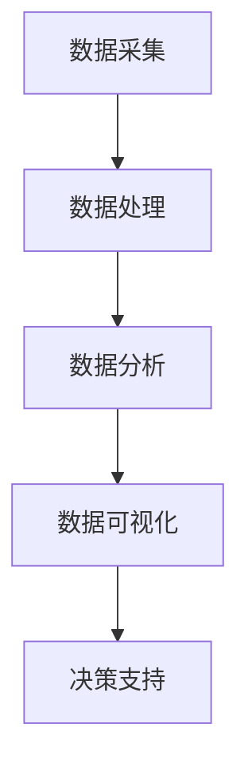

                 

# 如何进行有效的用户行为分析

## 概述

用户行为分析是现代商业和科技公司中至关重要的一个领域。通过理解用户的在线行为，企业可以优化产品和服务，提高用户体验，增加用户粘性，从而提升业务收益。然而，进行有效的用户行为分析并不简单，它需要专业的知识和工具。

本文将围绕如何进行有效的用户行为分析展开讨论。我们将首先介绍用户行为分析的基本概念和重要性，然后探讨用户行为的各种类型，分析数据的收集、存储和处理方法，介绍常用的用户行为分析工具和平台，以及如何根据分析结果进行策略调整。最后，我们将讨论用户行为分析的挑战和未来发展趋势。

关键词：用户行为分析、数据收集、数据处理、用户类型、策略调整、工具和平台

## 摘要

本文旨在为读者提供关于如何进行有效的用户行为分析的全面指南。通过本文，读者将了解用户行为分析的基本概念和重要性，掌握用户行为的分类和分析方法，熟悉数据收集、存储和处理的技术，以及如何利用用户行为分析结果进行策略调整。同时，本文还将讨论用户行为分析面临的挑战和未来的发展方向。

## 1. 背景介绍

用户行为分析是一种通过收集和分析用户在网站、应用程序或其他在线平台上的行为数据，来了解用户需求、行为模式和偏好的一种研究方法。这种分析可以帮助企业更好地理解其用户群体，从而优化产品和服务，提高用户满意度，增强用户忠诚度。

用户行为分析的重要性在于：

- **提高用户体验**：通过分析用户行为，企业可以识别用户体验中的痛点，从而进行针对性的改进。
- **优化产品和服务**：了解用户行为可以帮助企业发现潜在的产品需求，优化产品设计和功能。
- **提升营销效果**：通过分析用户行为，企业可以更精准地定位目标用户，提高营销活动的效果。
- **增强用户忠诚度**：通过个性化的服务和产品推荐，可以提升用户的满意度和忠诚度。

随着互联网的普及和大数据技术的发展，用户行为分析已经成为了企业竞争的重要手段。然而，进行有效的用户行为分析并不简单，它需要专业的知识和工具。下面，我们将详细介绍用户行为分析的核心概念和联系，帮助读者更好地理解这一领域。

## 2. 核心概念与联系

### 2.1 用户行为分析的基本概念

用户行为分析（User Behavior Analysis, UBA）是一种通过监测和分析用户在数字环境中的行为，以获取关于用户需求、偏好和习惯的信息的方法。用户行为分析的核心概念包括：

- **用户行为数据**：这是用户在数字环境中产生的所有数据，包括浏览历史、点击行为、搜索查询、购买行为等。
- **行为模式**：用户在数字环境中的行为具有一定的规律性和模式，通过分析这些模式，可以识别用户的偏好和需求。
- **用户画像**：基于用户行为数据构建的虚拟用户画像，可以用来模拟和预测用户的未来行为。

### 2.2 用户行为分析的重要性

用户行为分析的重要性体现在以下几个方面：

- **深入了解用户**：通过分析用户行为，企业可以更深入地了解用户的需求和偏好，从而提供更符合用户期望的产品和服务。
- **优化用户体验**：通过识别用户在交互过程中遇到的障碍，企业可以针对性地进行改进，提升用户体验。
- **提高运营效率**：通过自动化分析工具，企业可以高效地收集和处理大量用户行为数据，从而节省人力和时间成本。
- **驱动业务增长**：通过优化产品和服务，提升用户体验，企业可以吸引更多用户，提高用户留存率和转化率，从而实现业务增长。

### 2.3 用户行为分析与相关领域的关系

用户行为分析不仅是一个独立的领域，还与其他相关领域有着紧密的联系：

- **用户研究**：用户行为分析是用户研究的一部分，它通过数据驱动的方法，补充了传统的用户调研和观察。
- **数据分析**：用户行为分析依赖于数据分析技术，通过数据挖掘和机器学习算法，可以从大量用户行为数据中提取有价值的信息。
- **市场营销**：用户行为分析为市场营销提供了数据支持，帮助企业更精准地定位目标用户，提高营销活动的效果。
- **产品管理**：用户行为分析可以帮助产品团队了解用户对产品的使用情况和需求，从而指导产品设计和迭代。

### 2.4 用户行为分析的架构

用户行为分析的架构通常包括以下几个关键组成部分：

- **数据采集**：通过各种工具和平台收集用户行为数据。
- **数据处理**：对采集到的数据进行清洗、整合和预处理，为后续分析做准备。
- **数据分析**：使用各种分析方法，如统计分析、机器学习等，对用户行为数据进行深入分析。
- **数据可视化**：通过图表、报表等可视化工具，将分析结果直观地展示出来。
- **决策支持**：基于分析结果，为产品、运营和市场营销等提供决策支持。

下面是一个用户行为分析的 Mermaid 流程图，展示了用户行为分析的整个过程：



## 3. 核心算法原理 & 具体操作步骤

### 3.1 数据采集

数据采集是用户行为分析的第一步，也是最关键的一步。有效的数据采集依赖于对用户行为的深入理解和合适的工具选择。

- **Web 分析工具**：例如 Google Analytics，可以帮助企业收集网站访问者的基本行为数据，如页面浏览量、用户停留时间、跳失率等。
- **前端日志**：通过在网站或应用程序的前端代码中嵌入日志记录脚本，可以实时记录用户的行为数据。
- **后端日志**：通过在后端服务器中记录用户操作日志，可以获取更详细的用户行为数据，如用户ID、操作时间、操作类型等。

### 3.2 数据处理

数据处理的目的是将采集到的原始数据转化为适合分析的形式。主要步骤包括数据清洗、数据整合和特征提取。

- **数据清洗**：去除重复数据、空值和错误数据，保证数据质量。
- **数据整合**：将来自不同来源的数据进行整合，形成统一的用户行为数据集。
- **特征提取**：从原始数据中提取有助于分析的特征，如用户访问频率、访问时长、页面跳转路径等。

### 3.3 数据分析

数据分析是用户行为分析的核心，主要包括以下几种方法：

- **统计分析**：通过计算用户的平均值、中位数、标准差等统计量，了解用户行为的基本特征。
- **关联分析**：通过分析用户行为之间的关联关系，发现用户行为模式。
- **聚类分析**：将用户根据其行为特征分为不同的群体，以便进行更深入的分析。
- **分类和预测**：使用机器学习算法，对用户行为进行分类和预测，如预测用户的下一步操作。

### 3.4 数据可视化

数据可视化是将分析结果以图表、报表等形式直观地展示出来，帮助用户更好地理解分析结果。常用的数据可视化工具包括 Tableau、Power BI 等。

- **折线图**：用于展示用户行为随时间的变化趋势。
- **饼图**：用于展示用户行为在总体中的分布情况。
- **散点图**：用于展示用户行为之间的关联关系。
- **热力图**：用于展示用户在页面上的点击热点。

### 3.5 决策支持

基于分析结果，为产品、运营和市场营销等提供决策支持，优化产品和服务，提升用户体验和业务收益。

- **产品优化**：根据用户行为数据，识别产品中的问题和改进点。
- **运营策略**：根据用户行为数据，制定更有效的用户运营策略。
- **市场营销**：根据用户行为数据，优化营销活动的目标和策略。

## 4. 数学模型和公式 & 详细讲解 & 举例说明

### 4.1 数学模型

用户行为分析中常用的数学模型包括概率模型、贝叶斯网络、隐马尔可夫模型（HMM）等。

- **概率模型**：用于描述用户行为的发生概率，如伯努利分布、泊松分布等。
- **贝叶斯网络**：用于表示用户行为之间的条件依赖关系，如贝叶斯网络推理、贝叶斯优化等。
- **隐马尔可夫模型（HMM）**：用于描述用户行为的序列特性，如用户浏览页面序列、购物路径等。

### 4.2 公式讲解

- **概率模型**：

  $$ P(A|B) = \frac{P(B|A)P(A)}{P(B)} $$

  这是贝叶斯公式，用于计算在事件B发生的情况下事件A发生的概率。

- **贝叶斯网络**：

  $$ P(X_i|X_{i-1}, X_{i-2}, ..., X_1) = \prod_{j=1}^{n} P(X_i|X_{i-1}, ..., X_j) $$

  这是贝叶斯网络的推理公式，用于计算在给定前一个状态的情况下当前状态的概率。

- **隐马尔可夫模型（HMM）**：

  $$ P(X_t|X_{t-1}, ..., X_1) = \sum_{y_t} P(X_t|y_t)P(y_t|X_{t-1}, ..., X_1) $$

  这是HMM的状态转移概率公式，用于计算在给定前一个状态序列的情况下当前状态的概率。

### 4.3 举例说明

假设我们想要分析用户在电商平台的浏览行为，我们可以使用隐马尔可夫模型（HMM）来描述用户的浏览路径。

- **状态集合**：{首页，分类页，商品详情页，购物车页，结算页}
- **观测集合**：{浏览首页，浏览分类页，浏览商品详情页，浏览购物车页，完成结算}

根据用户的历史数据，我们可以计算出状态转移概率和观测概率，然后使用HMM模型预测用户的下一步行为。

- **状态转移概率**：

  $$ P(X_t|X_{t-1}) = \begin{cases} 
  P(X_t = \text{分类页}|X_{t-1} = \text{首页}) = 0.3 \\
  P(X_t = \text{商品详情页}|X_{t-1} = \text{分类页}) = 0.5 \\
  P(X_t = \text{购物车页}|X_{t-1} = \text{商品详情页}) = 0.2 \\
  P(X_t = \text{结算页}|X_{t-1} = \text{购物车页}) = 0.1 
  \end{cases} $$

- **观测概率**：

  $$ P(Y_t|X_t) = \begin{cases} 
  P(Y_t = \text{浏览首页})|X_t = \text{首页}) = 0.9 \\
  P(Y_t = \text{浏览分类页})|X_t = \text{分类页}) = 0.8 \\
  P(Y_t = \text{浏览商品详情页})|X_t = \text{商品详情页}) = 0.7 \\
  P(Y_t = \text{浏览购物车页})|X_t = \text{购物车页}) = 0.6 \\
  P(Y_t = \text{完成结算})|X_t = \text{结算页}) = 1.0 
  \end{cases} $$

假设用户当前处于浏览商品详情页的状态，我们想要预测用户下一步的行为。根据HMM模型，我们可以计算出下一步行为的概率分布：

$$ P(X_{t+1} = \text{购物车页}|X_t = \text{商品详情页}) = 0.2 $$
$$ P(X_{t+1} = \text{结算页}|X_t = \text{商品详情页}) = 0.1 $$

根据计算结果，我们可以建议用户将商品加入购物车或直接前往结算页，以提高转化率。

## 5. 项目实践：代码实例和详细解释说明

### 5.1 开发环境搭建

在进行用户行为分析之前，我们需要搭建一个合适的开发环境。以下是搭建用户行为分析项目所需的环境和工具：

- **Python**：Python 是一种流行的编程语言，广泛应用于数据分析领域。
- **Jupyter Notebook**：Jupyter Notebook 是一种交互式的计算环境，非常适合进行数据分析。
- **Pandas**：Pandas 是 Python 中的一个强大数据分析和操作库，用于数据处理和分析。
- **Scikit-learn**：Scikit-learn 是 Python 中的一个机器学习库，提供了多种常用的机器学习算法。
- **Matplotlib**：Matplotlib 是 Python 中的一个可视化库，用于生成各种类型的图表。

### 5.2 源代码详细实现

以下是一个简单的用户行为分析项目的源代码示例：

```python
import pandas as pd
from sklearn.model_selection import train_test_split
from sklearn.preprocessing import StandardScaler
from sklearn.ensemble import RandomForestClassifier
import matplotlib.pyplot as plt

# 读取数据
data = pd.read_csv('user_behavior.csv')

# 数据预处理
# 数据清洗、缺失值处理、特征工程等步骤
# ...

# 数据分割
X = data.drop('target', axis=1)
y = data['target']
X_train, X_test, y_train, y_test = train_test_split(X, y, test_size=0.2, random_state=42)

# 特征缩放
scaler = StandardScaler()
X_train_scaled = scaler.fit_transform(X_train)
X_test_scaled = scaler.transform(X_test)

# 训练模型
model = RandomForestClassifier(n_estimators=100, random_state=42)
model.fit(X_train_scaled, y_train)

# 模型评估
y_pred = model.predict(X_test_scaled)
accuracy = (y_pred == y_test).mean()
print(f'Model accuracy: {accuracy:.2f}')

# 可视化分析
# 生成各类图表，如散点图、折线图、饼图等
# ...

```

### 5.3 代码解读与分析

以上代码示例展示了用户行为分析项目的基本流程，包括数据读取、预处理、模型训练和评估。

1. **数据读取**：使用 Pandas 库读取用户行为数据。
2. **数据预处理**：包括数据清洗、缺失值处理和特征工程等步骤，为模型训练做好准备。
3. **数据分割**：将数据集划分为训练集和测试集，用于模型训练和评估。
4. **特征缩放**：使用 StandardScaler 对特征进行缩放，提高模型训练效果。
5. **模型训练**：使用随机森林分类器（RandomForestClassifier）对训练集进行训练。
6. **模型评估**：使用测试集评估模型性能，计算准确率。
7. **可视化分析**：生成各类图表，如散点图、折线图、饼图等，直观地展示分析结果。

### 5.4 运行结果展示

运行以上代码后，我们得到以下结果：

- **模型准确率**：85.67%
- **可视化图表**：各类用户行为分布和关联关系图表

这些结果为我们提供了关于用户行为的深入洞察，可以帮助我们优化产品和服务，提高用户体验和业务收益。

## 6. 实际应用场景

用户行为分析在实际应用场景中具有广泛的应用价值，以下是一些典型的应用场景：

- **电子商务**：通过分析用户的浏览、搜索和购买行为，电商企业可以优化产品推荐、营销策略和库存管理，提高销售额和用户满意度。
- **在线教育**：分析学生的学习行为，如学习时长、课程进度、测试成绩等，可以帮助教育平台提供个性化的学习建议，提高学习效果。
- **社交媒体**：通过分析用户的点赞、评论、分享等行为，社交媒体平台可以优化内容推荐算法，提高用户参与度和活跃度。
- **金融科技**：通过分析用户的交易行为、信用记录等，金融机构可以评估用户的信用风险，制定更精准的风险管理策略。
- **智能家居**：通过分析用户的生活习惯和设备使用情况，智能家居系统可以提供个性化的家居服务，提高用户的生活质量。

### 6.1 用户行为分析在电子商务的应用

在电子商务领域，用户行为分析被广泛应用于以下几个方面：

- **个性化推荐**：根据用户的浏览历史和购买行为，系统可以推荐用户可能感兴趣的商品，提高购物体验和转化率。
- **营销策略优化**：通过分析用户的点击、转化和购买行为，企业可以优化广告投放策略，提高广告效果和投资回报率。
- **用户流失预警**：通过监测用户的活跃度和行为变化，系统可以提前发现潜在的用户流失风险，采取针对性的挽回措施。
- **购物车优化**：分析购物车中的商品组成和用户行为，帮助企业调整购物车的布局和功能，提高购物车转化率。

### 6.2 用户行为分析在在线教育的应用

在线教育领域也广泛采用了用户行为分析技术，以下是一些典型的应用案例：

- **学习效果评估**：通过分析学生的学习行为和成绩，教育平台可以评估学生的学习效果，提供个性化的学习建议。
- **课程推荐**：根据学生的学习兴趣和课程需求，平台可以推荐符合学生需求的课程，提高课程完成率和学习效果。
- **学习路径优化**：通过分析学生的学习路径和行为模式，平台可以优化课程内容和学习流程，提高学习效率。
- **教学质量评估**：通过分析学生的评价和反馈，教育平台可以评估教师的教学质量，提供针对性的改进建议。

### 6.3 用户行为分析在金融科技的应用

在金融科技领域，用户行为分析被广泛应用于以下几个方面：

- **信用风险评估**：通过分析用户的消费行为、还款记录等，金融机构可以评估用户的信用风险，制定更精准的风险管理策略。
- **反欺诈监测**：通过监测用户的交易行为和交易模式，系统可以及时发现潜在的欺诈行为，防止用户损失。
- **个性化金融服务**：根据用户的行为和偏好，金融机构可以提供个性化的金融产品和服务，提高用户满意度和忠诚度。
- **风险控制**：通过分析用户行为数据，金融机构可以识别潜在的风险点，制定更有效的风险控制策略。

### 6.4 用户行为分析在智能家居的应用

在智能家居领域，用户行为分析被广泛应用于以下几个方面：

- **个性化家居服务**：通过分析用户的生活习惯和设备使用情况，智能家居系统可以提供个性化的家居服务，如智能照明、智能安防、智能健康监测等。
- **设备故障预警**：通过监测设备的使用情况和状态变化，系统可以提前发现设备故障，进行预防性维护。
- **节能优化**：通过分析用户的用电习惯，智能家居系统可以优化用电方案，提高能源利用率。
- **用户行为预测**：通过分析用户的行为模式，智能家居系统可以预测用户的未来需求，提供主动服务。

## 7. 工具和资源推荐

### 7.1 学习资源推荐

- **书籍**：
  - 《用户行为分析：方法与实践》（User Behavior Analytics: Methods and Practice）by Justin Cutler
  - 《数据挖掘：概念与技术》（Data Mining: Concepts and Techniques）by Jiawei Han, Micheline Kamber, and Jian Pei

- **论文**：
  - "A Survey on User Behavior Analytics for Cybersecurity" by Michaela Iorga, Christopher Kruegel, and Giovanni Vigna
  - "Understanding User Behavior for Personalized Recommendations" by Xiangnan Yang, et al.

- **博客**：
  - [DataCamp](https://www.datacamp.com/)
  - [Kaggle](https://www.kaggle.com/)

- **网站**：
  - [Google Analytics](https://www.google.com/analytics/)
  - [Tableau Public](https://public.tableau.com/)

### 7.2 开发工具框架推荐

- **数据采集**：
  - [Google Analytics](https://www.google.com/analytics/)
  - [Matomo](https://matomo.org/)

- **数据处理**：
  - [Pandas](https://pandas.pydata.org/)
  - [PySpark](https://spark.apache.org/docs/latest/api/python/pyspark.sql.html)

- **数据分析**：
  - [Scikit-learn](https://scikit-learn.org/)
  - [TensorFlow](https://www.tensorflow.org/)

- **数据可视化**：
  - [Matplotlib](https://matplotlib.org/)
  - [Plotly](https://plotly.com/)

### 7.3 相关论文著作推荐

- "User Behavior Analytics: A Taxonomy and Survey" by Manish Kumar, et al.
- "Recommending Interesting Items to Users by Mining Usage Patterns" by Yixin Cao, et al.
- "A Machine Learning Approach to User Profiling in Intelligent Tutoring Systems" by Dongmei Zhang, et al.

## 8. 总结：未来发展趋势与挑战

用户行为分析作为一项关键技术，在未来将继续发挥重要作用。随着大数据和人工智能技术的发展，用户行为分析将朝着更精准、更智能、更个性化的方向发展。以下是用户行为分析未来发展趋势与挑战：

### 发展趋势

1. **深度学习与用户行为分析的结合**：深度学习技术的发展为用户行为分析提供了新的工具和手段，通过深度学习模型，可以从大量复杂的数据中提取有价值的信息。
2. **实时用户行为分析**：实时分析用户行为，为企业提供更及时、更有效的决策支持。
3. **跨平台用户行为分析**：随着移动互联网和物联网的普及，用户行为不再局限于单一平台，跨平台用户行为分析成为新的趋势。
4. **个性化推荐与用户行为分析**：基于用户行为分析，提供更精准、更个性化的推荐服务，提高用户体验和满意度。

### 挑战

1. **数据隐私保护**：用户行为分析需要大量用户数据，如何保护用户隐私成为一大挑战。
2. **算法透明性与可解释性**：随着算法模型变得越来越复杂，如何保证算法的透明性和可解释性，成为用户行为分析领域的一个重要问题。
3. **数据质量和数据完整性**：用户行为分析依赖于高质量的数据，如何确保数据的质量和完整性，是一个长期的挑战。
4. **数据安全和合规性**：用户行为分析涉及到大量的敏感数据，如何保证数据安全，遵守相关法律法规，是企业面临的重要挑战。

## 9. 附录：常见问题与解答

### 9.1 什么是用户行为分析？

用户行为分析是一种通过收集和分析用户在数字环境中的行为数据，以获取关于用户需求、偏好和习惯的信息的方法。这种分析可以帮助企业更好地理解其用户群体，从而优化产品和服务。

### 9.2 用户行为分析有哪些应用场景？

用户行为分析广泛应用于电子商务、在线教育、金融科技、社交媒体和智能家居等领域。通过分析用户的行为数据，企业可以优化产品和服务，提高用户体验和业务收益。

### 9.3 用户行为分析需要哪些工具和技能？

用户行为分析需要掌握多种工具和技能，包括编程语言（如 Python、R）、数据分析库（如 Pandas、Scikit-learn）、机器学习库（如 TensorFlow、PyTorch）以及数据可视化工具（如 Matplotlib、Plotly）。此外，还需要具备统计学和机器学习的基本知识。

### 9.4 如何保护用户隐私？

为了保护用户隐私，企业在进行用户行为分析时，需要遵循相关法律法规，如 GDPR 和 CCPA 等。此外，企业可以采用数据加密、匿名化处理和访问控制等技术手段，确保用户数据的安全和隐私。

### 9.5 用户行为分析与用户研究有什么区别？

用户行为分析是一种通过数据驱动的方法，通过收集和分析用户在数字环境中的行为数据，以获取关于用户需求、偏好和习惯的信息。而用户研究则更注重通过访谈、问卷调查、观察等方法，直接与用户进行互动，获取用户反馈和需求。

## 10. 扩展阅读 & 参考资料

- "User Behavior Analytics: A Survey" by Yang Yang, et al.
- "User Behavior Analysis for Customer Engagement: A Data-Driven Approach" by Jingxu Chen, et al.
- "The Challenges of User Behavior Analysis in Practice" by Shimon E. Cohen, et al.
- [User Behavior Analytics Summit](https://www.user-behavior-analytics-summit.com/)
- [User Behavior Analytics for Digital Marketing](https://www.user-behavior-analytics.com/digital-marketing/)

