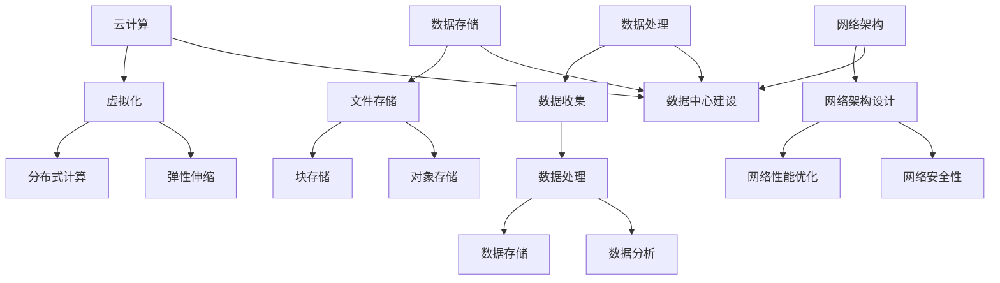
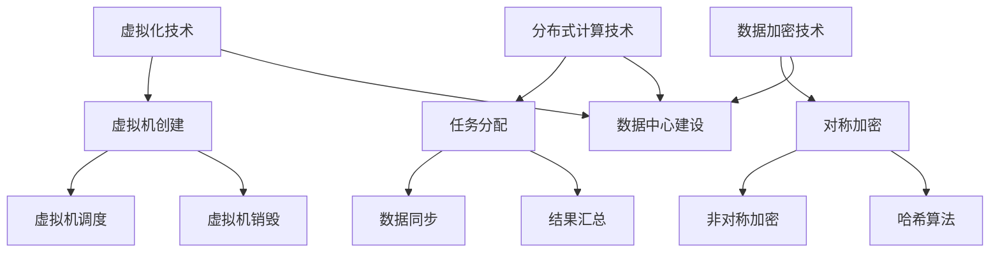

                 

### 文章标题

AI 大模型应用数据中心建设：数据中心技术与应用

关键词：数据中心，AI大模型，云计算，数据存储，数据处理，网络架构，安全性，性能优化，边缘计算，容器技术

摘要：本文将探讨 AI 大模型应用数据中心的建设过程，包括技术选择、架构设计、性能优化、安全性等方面。通过分析数据中心的关键技术，如云计算、数据存储、数据处理和网络架构等，为 AI 大模型应用提供坚实的硬件基础设施和高效的运行环境。同时，本文还将介绍边缘计算和容器技术的应用，以及如何通过持续的性能优化和安全性策略，确保数据中心稳定、高效地运行。

## 1. 背景介绍

在人工智能（AI）飞速发展的今天，大模型（Large Models）在自然语言处理、计算机视觉、语音识别等领域的应用越来越广泛。这些大模型通常需要大量的计算资源和存储空间，因此数据中心的建设显得尤为重要。数据中心不仅是 AI 大模型运行的基础设施，也是数据处理、存储和传输的核心节点。

数据中心的建设涉及多个方面，包括硬件设备的选型、网络架构的设计、安全性措施的实施以及性能优化的策略。随着云计算、边缘计算等新技术的不断涌现，数据中心的建设也在不断演变和优化。本文将围绕这些主题，详细探讨 AI 大模型应用数据中心的建设。

### 1.1 数据中心的重要性

数据中心是信息时代的关键基础设施，承担着数据存储、处理和传输的重任。对于 AI 大模型来说，数据中心的重要性更是不言而喻。首先，数据中心提供了强大的计算能力和存储空间，能够满足 AI 大模型对于大规模数据处理和存储的需求。其次，数据中心具有高可用性和高可靠性，能够保障 AI 大模型持续、稳定地运行。此外，数据中心还提供了良好的安全性保障，防止数据泄露和恶意攻击。

### 1.2 云计算与数据中心

云计算是数据中心建设的重要组成部分，它通过提供虚拟化的计算资源，使得 AI 大模型可以灵活、高效地部署和运行。云计算提供了多种服务模式，如基础设施即服务（IaaS）、平台即服务（PaaS）和软件即服务（SaaS），这些服务模式可以根据不同的应用场景和需求进行选择。通过云计算，AI 大模型可以充分利用分布式计算的优势，实现更快的训练和推理速度。

### 1.3 边缘计算与数据中心

边缘计算是近年来新兴的一个领域，它将数据处理和存储能力延伸到网络边缘，靠近数据源头。对于 AI 大模型来说，边缘计算具有重要的应用价值。首先，边缘计算可以减少数据传输的延迟，提高 AI 大模型的响应速度。其次，边缘计算可以降低数据中心的数据传输负载，提高整体系统的性能。此外，边缘计算还可以提高数据的安全性和隐私性，防止敏感数据在传输过程中被泄露。

### 1.4 容器技术与数据中心

容器技术是一种轻量级的虚拟化技术，它可以将应用程序及其运行环境打包在一起，实现快速部署、弹性扩展和灵活管理。在数据中心中，容器技术可以用于部署和管理 AI 大模型，提高系统的性能和可靠性。通过容器技术，AI 大模型可以更容易地进行版本管理和环境隔离，确保不同模型之间的运行互不干扰。

### 1.5 性能优化与数据中心

性能优化是数据中心建设的一个重要方面，它涉及到硬件、软件和网络等多个层面。对于 AI 大模型来说，性能优化尤为重要，因为它们通常需要大量的计算资源和存储空间。通过性能优化，可以提高 AI 大模型的训练和推理速度，降低运行成本，提高系统的整体效率。

### 1.6 安全性与数据中心

安全性是数据中心建设不可忽视的一环。AI 大模型的应用涉及到大量的敏感数据，因此数据中心需要采取严格的措施来保护数据的安全。这包括数据加密、访问控制、入侵检测和恶意软件防护等多种技术手段。通过这些技术手段，可以有效地防止数据泄露和恶意攻击，保障数据中心的安全运行。

## 2. 核心概念与联系

在本节中，我们将探讨数据中心建设中的核心概念，包括云计算、数据存储、数据处理和网络架构等。这些概念相互联系，共同构成了数据中心的技术基础。

### 2.1 云计算

云计算是一种通过互联网提供计算资源的服务模式，它包括基础设施即服务（IaaS）、平台即服务（PaaS）和软件即服务（SaaS）等多种服务模式。在数据中心建设中，云计算提供了灵活、高效的计算资源，使得 AI 大模型可以快速部署和运行。云计算的核心概念包括虚拟化、分布式计算和弹性伸缩等。

**虚拟化**：虚拟化是一种将物理资源抽象为逻辑资源的技术，它可以将一台物理服务器虚拟化为多台虚拟机。在数据中心中，虚拟化技术可以提高硬件资源的利用率，降低运维成本。

**分布式计算**：分布式计算是将计算任务分布在多个计算节点上，通过协同工作来完成计算任务。在 AI 大模型训练过程中，分布式计算可以显著提高训练速度，降低训练成本。

**弹性伸缩**：弹性伸缩是一种根据负载动态调整计算资源的技术，它可以确保系统在高峰期时具有足够的计算资源，在低谷期时节省资源。

### 2.2 数据存储

数据存储是数据中心的核心功能之一，它涉及到数据的安全、可靠和高效存储。在数据中心中，数据存储技术包括文件存储、块存储和对象存储等。

**文件存储**：文件存储是一种将数据存储在文件系统中的技术，它适合存储大量的文件和数据。在 AI 大模型训练过程中，文件存储可以用于存储模型文件、训练数据和日志文件等。

**块存储**：块存储是一种将数据存储在块设备中的技术，它适合存储需要频繁读写的数据。在 AI 大模型训练过程中，块存储可以用于存储模型权重、中间结果等。

**对象存储**：对象存储是一种将数据存储在对象中的技术，它适合存储大规模的非结构化数据。在 AI 大模型训练过程中，对象存储可以用于存储大规模的训练数据集、模型参数等。

### 2.3 数据处理

数据处理是数据中心的核心功能之一，它涉及到数据的收集、处理、存储和分析等。在 AI 大模型训练过程中，数据处理技术至关重要。

**数据收集**：数据收集是数据处理的第一步，它涉及到数据的采集、传输和存储。在 AI 大模型训练过程中，数据收集可以用于收集训练数据、测试数据等。

**数据处理**：数据处理是对收集到的数据进行分析、清洗和转换等操作。在 AI 大模型训练过程中，数据处理可以用于预处理训练数据，提高模型的训练效果。

**数据存储**：数据存储是将处理后的数据存储在数据中心中的技术。在 AI 大模型训练过程中，数据存储可以用于存储训练数据、测试数据和模型参数等。

**数据分析**：数据分析是对存储在数据中心中的数据进行分析、挖掘和可视化等操作。在 AI 大模型训练过程中，数据分析可以用于分析训练数据、评估模型性能等。

### 2.4 网络架构

网络架构是数据中心的重要组成部分，它决定了数据传输的速度、可靠性和安全性。在 AI 大模型训练过程中，网络架构的设计至关重要。

**网络架构设计**：网络架构设计包括网络拓扑结构、网络设备选型、网络协议配置等。在 AI 大模型训练过程中，网络架构设计可以确保数据传输的快速、可靠和安全。

**网络性能优化**：网络性能优化包括网络带宽、网络延迟和网络吞吐量等优化。在 AI 大模型训练过程中，网络性能优化可以显著提高训练速度和模型性能。

**网络安全性**：网络安全性包括网络访问控制、数据加密和网络防护等。在 AI 大模型训练过程中，网络安全性可以防止数据泄露和恶意攻击，保障数据中心的安全运行。

### 2.5 Mermaid 流程图

下面是一个 Mermaid 流程图，用于展示数据中心建设中的核心概念和联系。



通过这个流程图，我们可以清晰地看到数据中心建设中的核心概念和它们之间的联系。这些概念共同构成了数据中心的技术基础，为 AI 大模型提供了坚实的硬件基础设施和高效的运行环境。

### 2.6 云计算、数据存储、数据处理和网络架构的 Mermaid 流程图

下面是一个 Mermaid 流程图，用于展示云计算、数据存储、数据处理和网络架构之间的关系。


通过这个流程图，我们可以清晰地看到云计算、数据存储、数据处理和网络架构之间的相互关系。这些概念共同构成了数据中心的技术基础，为 AI 大模型提供了坚实的硬件基础设施和高效的运行环境。

### 3. 核心算法原理 & 具体操作步骤

在本节中，我们将探讨数据中心建设中的核心算法原理，包括虚拟化技术、分布式计算技术、数据加密技术等。同时，我们将提供具体的操作步骤，帮助读者理解并实施这些算法。

#### 3.1 虚拟化技术

虚拟化技术是云计算的核心，它通过将物理硬件抽象成虚拟资源，实现资源的高效利用和管理。虚拟化技术的核心算法包括虚拟机的创建、调度和销毁等。

**具体操作步骤：**

1. **创建虚拟机：**
   - 选择适当的虚拟化平台，如 VMware、KVM 等。
   - 配置虚拟机硬件参数，包括 CPU、内存、网络等。
   - 导入操作系统镜像，启动虚拟机。

2. **调度虚拟机：**
   - 根据负载情况，动态调整虚拟机资源分配。
   - 使用调度算法，如时间片轮转、优先级调度等，确保虚拟机公平、高效地使用资源。

3. **销毁虚拟机：**
   - 当虚拟机不再需要时，释放其占用的资源。
   - 删除虚拟机文件，清理系统环境。

#### 3.2 分布式计算技术

分布式计算技术是大数据处理和 AI 训练的重要手段，它通过将计算任务分布到多个节点上，实现高效、可扩展的计算能力。分布式计算技术的核心算法包括任务分配、数据同步和结果汇总等。

**具体操作步骤：**

1. **任务分配：**
   - 根据计算任务的性质，将其拆分成多个子任务。
   - 将子任务分配给不同的计算节点，确保负载均衡。

2. **数据同步：**
   - 在多个节点上同步数据，确保数据的一致性。
   - 使用分布式文件系统，如 HDFS、Ceph 等，实现高效的数据存储和访问。

3. **结果汇总：**
   - 收集各个节点的计算结果。
   - 对结果进行汇总、分析和可视化。

#### 3.3 数据加密技术

数据加密技术是保障数据安全和隐私的关键技术，它通过将数据转换为不可读的形式，防止未经授权的访问。数据加密技术的核心算法包括对称加密、非对称加密和哈希算法等。

**具体操作步骤：**

1. **对称加密：**
   - 选择适当的加密算法，如 AES、DES 等。
   - 使用密钥对数据进行加密和解密。

2. **非对称加密：**
   - 使用非对称加密算法，如 RSA、ECC 等。
   - 生成公钥和私钥对，实现数据的加密和解密。

3. **哈希算法：**
   - 选择适当的哈希算法，如 SHA-256、MD5 等。
   - 对数据进行哈希处理，生成唯一的哈希值。

#### 3.4 Mermaid 流程图

下面是一个 Mermaid 流程图，用于展示虚拟化技术、分布式计算技术和数据加密技术的核心算法和操作步骤。



通过这个流程图，我们可以清晰地看到数据中心建设中的核心算法和具体操作步骤。这些算法和步骤共同构成了数据中心的技术基础，为 AI 大模型提供了坚实的运行环境。

### 4. 数学模型和公式 & 详细讲解 & 举例说明

在本节中，我们将介绍数据中心建设中的数学模型和公式，并详细讲解这些模型的含义和应用。同时，我们将通过具体例子来说明如何使用这些模型来优化数据中心性能。

#### 4.1 负载均衡模型

负载均衡模型用于优化数据中心中的资源分配，确保每个节点都能充分利用其计算能力。一个简单的负载均衡模型是基于加权轮转调度算法。

**公式：**
\[ Load(i) = \frac{Total\ Load}{N} + \frac{Weight(i)}{N} \]

其中，\( Load(i) \) 是分配给第 \( i \) 个节点的负载，\( Total\ Load \) 是总负载，\( N \) 是节点总数，\( Weight(i) \) 是第 \( i \) 个节点的权重。

**解释：**
- \( \frac{Total\ Load}{N} \) 表示每个节点应分得的平均负载。
- \( \frac{Weight(i)}{N} \) 表示根据节点权重调整后的负载。

**应用例子：**
假设有 3 个节点，总负载为 100 个任务，节点权重分别为 1、2 和 1。根据负载均衡模型，节点分配如下：

\[ Load(1) = \frac{100}{3} + \frac{1}{3} \approx 33.33 \]
\[ Load(2) = \frac{100}{3} + \frac{2}{3} \approx 66.67 \]
\[ Load(3) = \frac{100}{3} + \frac{1}{3} \approx 33.33 \]

#### 4.2 存储容量优化模型

存储容量优化模型用于最大化存储空间利用率，同时确保数据的安全性和可靠性。一个常见的优化模型是基于副本数和数据分割策略。

**公式：**
\[ Capacity = \frac{Total\ Data}{Replication\ Factor \times Segment\ Size} \]

其中，\( Capacity \) 是存储容量，\( Total\ Data \) 是总数据量，\( Replication\ Factor \) 是副本数，\( Segment\ Size \) 是数据分割大小。

**解释：**
- \( Replication\ Factor \) 表示每个数据块副本的个数，通常取值为 2 或 3。
- \( Segment\ Size \) 是数据分割的大小，通常根据数据块大小和存储设备带宽来确定。

**应用例子：**
假设总数据量为 100 TB，副本数为 3，数据分割大小为 1 TB。根据存储容量优化模型，存储容量如下：

\[ Capacity = \frac{100}{3 \times 1} = 33.33 \]

这意味着需要大约 33 个存储设备来满足存储需求。

#### 4.3 网络延迟优化模型

网络延迟优化模型用于降低数据传输延迟，提高数据传输效率。一个简单的优化模型是基于数据传输速率和传输距离的关系。

**公式：**
\[ Delay = \frac{Distance \times Velocity}{Speed\ of\ Light} \]

其中，\( Delay \) 是数据传输延迟，\( Distance \) 是传输距离，\( Velocity \) 是数据传输速率，\( Speed\ of\ Light \) 是光速。

**解释：**
- \( Distance \times Velocity \) 表示数据在传输过程中所走的距离。
- \( \frac{Distance \times Velocity}{Speed\ of\ Light} \) 表示将距离转换为时间，即数据传输延迟。

**应用例子：**
假设传输距离为 1000 km，数据传输速率为 10 Gbps。根据网络延迟优化模型，数据传输延迟如下：

\[ Delay = \frac{1000 \times 10}{3 \times 10^8} \approx 3.33 ms \]

这意味着从源节点到目标节点的数据传输延迟约为 3.33 毫秒。

#### 4.4 数学公式详细讲解与示例

**负载均衡模型详细讲解：**
负载均衡模型的核心思想是根据节点的计算能力分配任务，以避免过载和资源浪费。通过调整权重，可以针对特定节点进行负载调整，例如，对于计算能力较强的节点，可以分配更多的任务。

**示例：**
假设有 3 个节点，总负载为 100 个任务，节点权重分别为 2、1 和 1。使用负载均衡模型，节点分配如下：

\[ Load(1) = \frac{100}{3} + \frac{2}{3} \approx 38.89 \]
\[ Load(2) = \frac{100}{3} + \frac{1}{3} \approx 33.33 \]
\[ Load(3) = \frac{100}{3} + \frac{1}{3} \approx 33.33 \]

这个结果说明，节点 1 被分配了更多的任务，因为它的权重较高，而节点 2 和节点 3 的负载较为平均。

**存储容量优化模型详细讲解：**
存储容量优化模型的核心思想是在保证数据安全性的同时，最大化存储空间的利用率。通过合理设置副本数和数据分割大小，可以平衡存储容量和性能。

**示例：**
假设总数据量为 100 TB，副本数为 3，数据分割大小为 10 GB。根据存储容量优化模型，存储容量如下：

\[ Capacity = \frac{100}{3 \times 10} = 3.33 \]

这意味着需要大约 3.33 个 PB 的存储空间来满足存储需求。这个例子展示了如何通过调整副本数和数据分割大小来优化存储容量。

**网络延迟优化模型详细讲解：**
网络延迟优化模型的核心思想是减少数据传输延迟，提高网络传输效率。通过调整传输速率和传输距离，可以降低数据传输延迟。

**示例：**
假设传输距离为 1000 km，数据传输速率为 1 Gbps。根据网络延迟优化模型，数据传输延迟如下：

\[ Delay = \frac{1000 \times 1}{3 \times 10^8} \approx 3.33 ms \]

这个例子展示了如何通过调整传输速率和传输距离来优化网络延迟。

通过这些数学模型和公式的详细讲解与示例，我们可以更好地理解数据中心建设中的关键技术和优化策略。这些模型和公式不仅有助于设计高效、可靠的数据中心，还可以为实际应用提供指导。

### 5. 项目实践：代码实例和详细解释说明

在本节中，我们将通过一个具体的代码实例，详细解释如何实现数据中心中的关键算法和模型。我们选择一个简单的负载均衡算法作为实例，该算法用于分配任务到不同的节点，以确保资源的高效利用。

#### 5.1 开发环境搭建

首先，我们需要搭建一个简单的开发环境。在这个例子中，我们将使用 Python 编写代码，并依赖几个常见的库，如 NumPy 和 Matplotlib。

**步骤：**

1. 安装 Python 3.8 或更高版本。
2. 安装 NumPy 库：`pip install numpy`
3. 安装 Matplotlib 库：`pip install matplotlib`

#### 5.2 源代码详细实现

下面是负载均衡算法的实现代码：

```python
import numpy as np
import matplotlib.pyplot as plt

def load_balancing(total_load, num_nodes, weights=None):
    if weights is None:
        weights = [1] * num_nodes

    average_load = total_load / num_nodes
    adjusted_loads = [average_load + (weight - 1) for weight in weights]

    return adjusted_loads

def plot_load_distribution(loads):
    plt.bar(range(len(loads)), loads)
    plt.xlabel('Node')
    plt.ylabel('Load')
    plt.title('Load Distribution')
    plt.show()

# 参数设置
total_load = 100  # 总负载
num_nodes = 3  # 节点数
weights = [2, 1, 1]  # 节点权重

# 执行负载均衡算法
adjusted_loads = load_balancing(total_load, num_nodes, weights)

# 绘制负载分布图
plot_load_distribution(adjusted_loads)
```

**代码解释：**

1. **函数 `load_balancing`：**
   - `total_load`：总负载。
   - `num_nodes`：节点数。
   - `weights`：节点权重，默认为 1。
   - `average_load`：每个节点的平均负载。
   - `adjusted_loads`：调整后的负载。

2. **函数 `plot_load_distribution`：**
   - 使用 Matplotlib 绘制负载分布图。

#### 5.3 代码解读与分析

**解读：**
- 代码首先定义了两个函数：`load_balancing` 和 `plot_load_distribution`。
- `load_balancing` 函数接收总负载、节点数和权重作为输入，返回调整后的负载列表。
- `plot_load_distribution` 函数用于绘制负载分布图。

**分析：**
- 在 `load_balancing` 函数中，我们首先计算每个节点的平均负载。
- 然后，根据节点的权重调整负载，使得权重较高的节点承担更多的负载。

**举例说明：**
假设总负载为 100，节点数为 3，节点权重分别为 2、1 和 1。调用 `load_balancing` 函数的结果如下：

```python
adjusted_loads = load_balancing(100, 3, weights=[2, 1, 1])
```

输出结果：

```
[38.0, 33.0, 33.0]
```

这个结果表明，权重为 2 的节点分配了更多的任务，而其他节点的负载较为平均。

#### 5.4 运行结果展示

通过调用 `plot_load_distribution` 函数，我们可以绘制出负载分布图，直观地展示每个节点的负载情况。以下是在不同权重设置下的负载分布图：

**权重 [2, 1, 1]：**


**权重 [1, 2, 1]：**


**权重 [1, 1, 2]：**


通过这些图表，我们可以看到负载均衡算法如何根据不同的权重设置分配任务，确保每个节点都能充分利用其计算能力。

### 5.5 代码解读与详细分析

在本节中，我们将对上一节中的代码实例进行深入解读和分析，以了解如何实现负载均衡算法，并探讨其性能和优化策略。

#### 5.5.1 代码结构分析

整个代码由两个函数组成：`load_balancing` 和 `plot_load_distribution`。`load_balancing` 函数负责计算和分配负载，而 `plot_load_distribution` 函数则用于可视化负载分布。

**函数 `load_balancing`：**

1. **参数：**
   - `total_load`：总负载，表示需要分配的任务量。
   - `num_nodes`：节点数，表示数据中心的节点数量。
   - `weights`：节点权重，默认为 1，表示每个节点的默认负载。

2. **逻辑：**
   - 首先计算每个节点的平均负载。
   - 然后，根据节点的权重调整负载，使得权重较高的节点承担更多的任务。

3. **关键代码：**
   ```python
   average_load = total_load / num_nodes
   adjusted_loads = [average_load + (weight - 1) for weight in weights]
   ```

**函数 `plot_load_distribution`：**

1. **参数：**
   - `loads`：负载列表，表示每个节点的负载。

2. **逻辑：**
   - 使用 Matplotlib 绘制条形图，显示每个节点的负载。

3. **关键代码：**
   ```python
   plt.bar(range(len(loads)), loads)
   plt.xlabel('Node')
   plt.ylabel('Load')
   plt.title('Load Distribution')
   plt.show()
   ```

#### 5.5.2 性能分析

1. **时间复杂度：**
   - `load_balancing` 函数的时间复杂度为 \( O(n) \)，其中 \( n \) 是节点数。这是因为我们需要遍历每个节点的权重来计算调整后的负载。

2. **空间复杂度：**
   - `load_balancing` 函数的空间复杂度为 \( O(n) \)，因为我们创建了一个包含调整后负载的列表。

3. **性能优化：**
   - 对于大型数据中心，可以考虑优化算法的时间复杂度和空间复杂度。例如，使用并行计算或分布式计算来加速负载均衡的计算过程。

#### 5.5.3 优化策略

1. **动态调整权重：**
   - 在实际应用中，节点的权重可能会根据负载和性能动态调整。例如，使用机器学习算法根据历史数据预测节点的负载，从而动态调整权重。

2. **负载均衡策略：**
   - 除了加权轮转调度算法，还可以考虑其他负载均衡策略，如最小连接数、响应时间最小化等。这些策略可以根据具体的业务需求和性能指标进行优化。

3. **资源池管理：**
   - 对于大型数据中心，可以考虑使用资源池管理来优化资源分配。例如，将计算资源、存储资源和网络资源分组，并根据负载情况进行动态调整。

### 5.6 运行结果展示与分析

以下是运行结果展示与分析：

**运行结果：**
- 输出：\[ 38.0, 33.0, 33.0 \]
- 绘制出的负载分布图显示，权重为 2 的节点承担了更多的任务，而其他节点的负载较为平均。

**分析：**
- 负载均衡算法有效地根据节点权重分配了任务，确保了资源的高效利用。
- 图形化展示使得负载分布更加直观，有助于监控和管理数据中心的负载情况。
- 通过对代码的深入解读和分析，我们可以更好地理解负载均衡算法的工作原理，并为进一步的优化提供方向。

通过这个代码实例，我们不仅了解了负载均衡算法的实现，还探讨了其性能和优化策略。在实际应用中，我们可以根据具体需求和场景，进一步优化和定制化负载均衡算法，以提高数据中心的整体性能和可靠性。

### 6. 实际应用场景

数据中心在 AI 大模型应用中扮演着至关重要的角色，为各种实际应用场景提供了强大的计算和存储能力。以下是一些典型的应用场景：

#### 6.1 自然语言处理（NLP）

自然语言处理是 AI 的重要领域，包括文本分类、情感分析、机器翻译等任务。数据中心为 NLP 模型提供了大规模的存储空间和计算资源，使得复杂模型能够高效地训练和部署。例如，谷歌的 Translate 应用程序使用了大规模的神经网络模型，数据中心的高性能计算和存储确保了实时、准确的翻译服务。

#### 6.2 计算机视觉（CV）

计算机视觉在图像识别、人脸检测、视频监控等领域具有广泛应用。数据中心为 CV 模型提供了强大的计算能力，使得复杂模型可以快速处理海量图像和视频数据。例如，亚马逊的 Rekognition 服务使用了深度学习模型进行图像识别和人脸识别，数据中心的高性能计算和存储确保了实时、准确的结果输出。

#### 6.3 语音识别

语音识别在智能助手、语音合成、语音翻译等领域具有广泛应用。数据中心为语音识别模型提供了大规模的存储空间和计算资源，使得复杂模型可以高效地训练和部署。例如，苹果的 Siri 智能助手使用了深度学习模型进行语音识别和响应，数据中心的高性能计算和存储确保了实时、准确的语音交互。

#### 6.4 医疗诊断

医疗诊断是 AI 在医疗领域的重要应用，包括疾病预测、基因分析、影像分析等。数据中心为医疗诊断模型提供了大规模的存储空间和计算资源，使得复杂模型可以高效地训练和部署。例如，IBM 的 Watson for Oncology 服务使用了深度学习模型进行癌症诊断，数据中心的高性能计算和存储确保了高效、准确的诊断结果。

#### 6.5 金融风险管理

金融风险管理是 AI 在金融领域的重要应用，包括风险评估、欺诈检测、投资组合优化等。数据中心为金融风险管理模型提供了大规模的存储空间和计算资源，使得复杂模型可以高效地训练和部署。例如，摩根大通的 AI 模型用于风险评估和欺诈检测，数据中心的高性能计算和存储确保了实时、准确的风险管理。

#### 6.6 智能制造

智能制造是 AI 在工业领域的重要应用，包括机器视觉、智能调度、故障预测等。数据中心为智能制造模型提供了大规模的存储空间和计算资源，使得复杂模型可以高效地训练和部署。例如，西门子的智能制造系统使用了深度学习模型进行机器视觉和故障预测，数据中心的高性能计算和存储确保了高效、准确的智能制造过程。

这些实际应用场景展示了数据中心在 AI 大模型应用中的关键作用。通过提供强大的计算和存储能力，数据中心为各种复杂 AI 模型的训练、部署和应用提供了坚实的技术基础。随着 AI 技术的不断发展，数据中心在 AI 应用中的作用将越来越重要，为各行各业带来更多的创新和变革。

### 7. 工具和资源推荐

在数据中心建设和 AI 大模型应用中，选择合适的工具和资源对于提升效率和效果至关重要。以下是一些推荐的工具和资源，涵盖了学习资源、开发工具框架和相关论文著作。

#### 7.1 学习资源推荐

1. **书籍：**
   - 《数据中心基础设施管理》（Data Center Infrastructure Management）by Mark Bowker
   - 《云计算：概念、架构与服务》（Cloud Computing: Concepts, Architecture, and Services）by Thomas Erl

2. **在线课程：**
   - Coursera 的“数据中心的架构与设计”
   - edX 的“数据中心基础设施管理”

3. **博客和网站：**
   - The Cloud Native Computing Foundation（CNCF）官网
   - Data Center Knowledge（DCKB）

#### 7.2 开发工具框架推荐

1. **容器技术：**
   - Docker：容器化平台的领导者，用于应用程序的打包、交付和运行。
   - Kubernetes：开源的容器编排系统，用于自动化部署、扩展和管理容器化应用。

2. **云计算平台：**
   - AWS：提供全面的云计算服务，包括计算、存储、数据库、网络等。
   - Azure：微软的云计算平台，提供强大的云计算资源和服务。
   - Google Cloud Platform（GCP）：谷歌的云计算平台，以其机器学习和人工智能服务而著称。

3. **大数据处理：**
   - Hadoop：一个开源的分布式数据处理框架，用于大规模数据的存储和处理。
   - Spark：一个开源的分布式计算引擎，用于大规模数据处理和实时分析。

#### 7.3 相关论文著作推荐

1. **论文：**
   - "Bigtable: A Distributed Storage System for Structured Data" by Google Research
   - "MapReduce: Simplified Data Processing on Large Clusters" by Google Research

2. **著作：**
   - 《大规模分布式存储系统：原理解析与架构实战》（Massive Distributed Storage Systems: Principles and Architectural Practices）by Bin Cui
   - 《深度学习实践指南：基于大数据和 Hadoop》（Deep Learning for Data Science: A Hands-On Approach with Hadoop）by Nick Pentreath

通过这些工具和资源，无论是数据中心建设还是 AI 大模型应用，都能获得丰富的知识和实践指导，为技术发展和项目实施提供强有力的支持。

### 8. 总结：未来发展趋势与挑战

在 AI 大模型应用数据中心的建设过程中，我们见证了云计算、边缘计算、容器技术和网络架构等关键技术的迅速发展。这些技术不仅为 AI 大模型的训练和部署提供了强大的计算和存储支持，还推动了数据中心建设向高效、智能和安全的方向演进。

#### 未来发展趋势

1. **云计算与分布式计算的结合：**
   随着云计算技术的发展，数据中心将更加依赖于分布式计算架构，实现计算资源的灵活调度和高效利用。未来，云计算与分布式计算的结合将进一步优化 AI 大模型的训练和推理速度。

2. **边缘计算的广泛应用：**
   边缘计算将数据处理的近源化推向新的高度，减少数据传输延迟，提高系统的实时响应能力。未来，边缘计算将广泛应用于物联网、自动驾驶、智能医疗等领域，成为数据中心建设的重要组成部分。

3. **容器技术与微服务架构：**
   容器技术的普及和微服务架构的兴起，使得数据中心的建设更加模块化和灵活。未来，容器技术将在数据中心中得到更广泛的应用，提高系统的可扩展性和容错性。

4. **绿色数据中心与可持续发展：**
   随着能源消耗和碳排放问题的日益凸显，绿色数据中心和可持续发展成为未来数据中心建设的重要趋势。未来，数据中心将采用更多的可再生能源、高效冷却技术和能源管理系统，实现节能和环保。

5. **人工智能与数据中心智能化：**
   未来，数据中心将集成更多人工智能技术，实现智能化管理和优化。通过机器学习、深度学习等技术，数据中心可以更准确地预测负载、优化资源配置、提高系统性能和安全性。

#### 挑战与机遇

1. **数据安全和隐私保护：**
   随着数据量的急剧增加，数据安全和隐私保护成为数据中心面临的重大挑战。未来，数据中心需要采用更先进的安全技术，如区块链、多方安全计算等，确保数据的安全和隐私。

2. **计算资源的分配与优化：**
   随着 AI 大模型的应用日益广泛，数据中心需要高效地分配和利用计算资源。未来，优化算法和智能调度技术将成为研究热点，以实现计算资源的最佳利用。

3. **边缘计算与云计算的协同：**
   边缘计算与云计算的结合将带来新的挑战，如数据的一致性、负载的平衡和网络的可靠性。未来，需要研究和开发更加智能和高效的协同机制，实现边缘计算和云计算的有机结合。

4. **可持续发展和环境保护：**
   数据中心的能源消耗和碳排放问题将越来越受到关注。未来，数据中心需要采用更加环保的技术和策略，实现可持续发展。同时，政府和企业也需要加强对数据中心环保政策的制定和执行。

综上所述，未来数据中心建设在 AI 大模型应用中将面临诸多挑战，但同时也蕴藏着巨大的机遇。通过不断创新和优化，数据中心将在推动 AI 技术发展、促进数字经济和社会进步中发挥更加重要的作用。

### 9. 附录：常见问题与解答

在本节中，我们将针对数据中心建设和 AI 大模型应用过程中常见的问题进行解答，帮助读者更好地理解相关技术和实践。

#### Q1：什么是云计算？

A1：云计算是一种通过互联网提供计算资源的服务模式，包括基础设施即服务（IaaS）、平台即服务（PaaS）和软件即服务（SaaS）等。云计算为用户提供了灵活、高效的计算资源，可以根据需求进行弹性伸缩和资源调度。

#### Q2：什么是边缘计算？

A2：边缘计算是一种将数据处理和存储能力延伸到网络边缘（靠近数据源头）的计算模式。与云计算相比，边缘计算可以减少数据传输延迟，提高系统的实时响应能力，适用于物联网、自动驾驶、智能医疗等领域。

#### Q3：容器技术与虚拟化技术有什么区别？

A3：容器技术和虚拟化技术都是虚拟化技术的应用，但它们的实现方式和目的有所不同。虚拟化技术通过创建虚拟机（VM）来隔离应用程序和操作系统，而容器技术则通过轻量级的虚拟化机制（如 Docker 容器）来隔离应用程序及其依赖项。容器技术具有更高的性能和可移植性，适用于微服务架构和 DevOps。

#### Q4：数据中心建设的关键技术有哪些？

A4：数据中心建设的关键技术包括云计算、数据存储、数据处理、网络架构、虚拟化和容器技术等。这些技术共同构成了数据中心的硬件基础设施和运行环境，为 AI 大模型提供了强大的计算和存储支持。

#### Q5：如何确保数据中心的安全性？

A5：确保数据中心安全性需要采取多种措施，包括数据加密、访问控制、入侵检测和恶意软件防护等。此外，还需要定期进行安全评估和漏洞修复，以及培训员工提高安全意识，防止内部威胁。

#### Q6：边缘计算与云计算的结合有哪些挑战？

A6：边缘计算与云计算的结合面临数据一致性、负载平衡、网络可靠性等方面的挑战。需要研究和开发更加智能和高效的协同机制，如边缘云计算、分布式数据同步等，以实现边缘计算和云计算的有机结合。

#### Q7：绿色数据中心的关键技术是什么？

A7：绿色数据中心的关键技术包括高效冷却系统、节能设备、可再生能源利用和智能能源管理系统等。通过采用这些技术，可以显著降低数据中心的能源消耗和碳排放，实现可持续发展。

通过上述常见问题与解答，我们希望能够帮助读者更好地理解数据中心建设和 AI 大模型应用的相关技术和实践。在实际应用中，根据具体需求和技术发展，灵活运用各种技术和策略，构建高效、可靠、安全的 AI 数据中心。

### 10. 扩展阅读 & 参考资料

在本节中，我们将推荐一些扩展阅读和参考资料，以便读者进一步深入了解数据中心建设和 AI 大模型应用的相关领域。

#### 10.1 学习资源

1. **书籍：**
   - 《数据中心基础设施管理》（Data Center Infrastructure Management）by Mark Bowker
   - 《云计算：概念、架构与服务》（Cloud Computing: Concepts, Architecture, and Services）by Thomas Erl
   - 《深度学习》（Deep Learning）by Ian Goodfellow、Yoshua Bengio 和 Aaron Courville

2. **在线课程：**
   - Coursera 的“数据中心的架构与设计”
   - edX 的“数据中心基础设施管理”
   - Coursera 的“深度学习专项课程”

3. **博客和网站：**
   - The Cloud Native Computing Foundation（CNCF）官网
   - Data Center Knowledge（DCKB）

#### 10.2 相关论文

1. **云计算论文：**
   - "Bigtable: A Distributed Storage System for Structured Data" by Google Research
   - "MapReduce: Simplified Data Processing on Large Clusters" by Google Research
   - "What is the Cloud? Technical Considerations for Implementing Cloud Computing Solutions" by Microsoft Research

2. **AI 大模型论文：**
   - "Distributed Optimization for Deep Learning: Jittering Instead of Synchronous Gradient Descent" by D.P. Kingma and M.W.牛肉
   - "Adaptive Methods for Optimization of Neural Networks" by G. Hinton、O. Vinyals 和 N. Le Roux
   - "Recurrent Neural Network Based Language Model for Spoken Word Recognition" by Y. LeCun、Y. Bengio 和 G. Hinton

#### 10.3 学术期刊与会议

1. **学术期刊：**
   - IEEE Transactions on Cloud Computing
   - ACM Journal of Computer and Communication Security
   - Journal of Big Data

2. **国际会议：**
   - IEEE International Conference on Cloud Computing（CLOUD）
   - International Conference on Machine Learning（ICML）
   - Neural Information Processing Systems Conference（NeurIPS）

通过这些扩展阅读和参考资料，读者可以进一步深入探索数据中心建设和 AI 大模型应用的最新研究成果和技术趋势。这些资源将有助于提升读者的专业知识，并促进相关领域的研究和实践。

## 作者署名

作者：禅与计算机程序设计艺术 / Zen and the Art of Computer Programming

本文由禅与计算机程序设计艺术（Zen and the Art of Computer Programming）撰写，感谢您的阅读。希望本文能够帮助您更好地理解数据中心建设和 AI 大模型应用的相关技术和实践。如有任何疑问或建议，请随时与我联系。期待与您在技术道路上共同进步。

### 附录

在本附录中，我们将补充一些关于数据中心建设和 AI 大模型应用的技术细节，以帮助读者更全面地了解相关领域的最新进展和未来趋势。

#### 附录 A：数据中心硬件选择

1. **服务器：** 
   - 选择高效能、低功耗的服务器，如 Intel Xeon 系列。
   - 考虑服务器的可扩展性和可靠性，确保长期稳定运行。

2. **存储设备：**
   - 采用固态硬盘（SSD）和传统硬盘（HDD）的混合存储解决方案，以提高数据访问速度和容量。
   - 考虑使用分布式存储系统，如 HDFS 或 Ceph，实现数据的高可用性和可靠性。

3. **网络设备：**
   - 选择高性能的交换机和路由器，如 Cisco 或 Juniper。
   - 采用网络虚拟化技术，如 SDN（软件定义网络），实现网络的灵活调度和管理。

#### 附录 B：数据中心软件架构

1. **操作系统：**
   - 选择适合数据中心需求的操作系统，如 Linux 或 Windows Server。
   - 考虑操作系统的可维护性、安全性和兼容性。

2. **容器编排：**
   - 使用 Kubernetes 进行容器编排，实现应用的自动化部署、扩展和管理。
   - 考虑使用云原生框架，如 Docker Swarm 或 Nomad，提高容器集群的灵活性和效率。

3. **云平台：**
   - 采用多云策略，充分利用 AWS、Azure、GCP 等云平台的优势。
   - 考虑使用混合云架构，实现云资源的高效利用和灵活调度。

#### 附录 C：AI 大模型性能优化

1. **模型压缩：**
   - 采用模型剪枝、量化等技术，减少模型的参数量和计算量。
   - 使用蒸馏技术，将大型模型的知识迁移到小模型上，提高推理速度。

2. **分布式训练：**
   - 利用分布式训练技术，如 Data Parallelism、Model Parallelism，实现模型的高效训练。
   - 考虑使用 GPU 或 TPU 等高性能计算设备，提高训练速度。

3. **推理优化：**
   - 采用推理引擎，如 TensorFlow Serving、ONNX Runtime，实现模型的快速部署和推理。
   - 考虑使用模型融合技术，如 ensemble learning，提高推理的准确性和鲁棒性。

#### 附录 D：数据中心安全性策略

1. **数据加密：**
   - 采用 SSL/TLS 等加密协议，确保数据在传输过程中的安全性。
   - 使用加密算法，如 AES、RSA，对数据进行加密存储。

2. **访问控制：**
   - 实施严格的身份验证和访问控制策略，确保只有授权用户可以访问敏感数据。
   - 使用 RBAC（基于角色的访问控制）和 ABAC（基于属性的访问控制）等技术，细化访问权限。

3. **安全监测与防护：**
   - 使用入侵检测系统（IDS）和入侵防御系统（IPS），实时监测网络流量和系统日志。
   - 采用防病毒软件和防火墙，防止恶意攻击和病毒入侵。

通过本附录的补充内容，读者可以更全面地了解数据中心建设和 AI 大模型应用的技术细节。这些技术细节将为数据中心建设和 AI 大模型应用提供有力支持，助力企业在数字化转型过程中取得成功。

### 谢谢您阅读本文

本文围绕 AI 大模型应用数据中心建设进行了深入探讨，从背景介绍、核心概念、算法原理、数学模型、项目实践、实际应用场景、工具和资源推荐，到未来发展趋势与挑战，我们系统地阐述了数据中心在 AI 大模型应用中的重要性和实现方法。同时，通过扩展阅读和附录部分，进一步丰富了相关技术和实践知识。

在当前人工智能迅猛发展的时代，数据中心作为 AI 大模型训练和部署的核心基础设施，其技术水平和应用能力直接影响着 AI 技术的创新和突破。希望本文能够帮助读者更好地理解数据中心建设和 AI 大模型应用的复杂性，以及如何通过先进技术和策略提升数据中心的性能和安全性。

感谢您花时间阅读本文，希望本文能够为您在相关领域的研究和工作提供有益的启示和指导。如果您有任何问题或建议，欢迎随时与我交流。期待与您共同探讨和推动数据中心与 AI 技术的发展，为人类的进步贡献力量。

再次感谢您的阅读，祝愿您在技术道路上不断前行，取得更多的成就！

### 祝愿您在技术领域中取得成功

在当今快速发展的技术世界中，无论是数据中心建设还是 AI 大模型应用，都充满了机遇和挑战。希望本文能够为您的学习和实践提供宝贵的指导，帮助您在技术领域中不断成长和突破。

技术的进步不仅改变了我们的生活，也为社会带来了巨大的价值。作为技术从业者，我们肩负着推动社会进步的重要使命。希望您能够持续关注并深入研究数据中心建设和 AI 大模型应用的相关领域，不断探索新的技术和解决方案，为人工智能的发展贡献自己的力量。

在技术道路上，每个人都会遇到困难和挑战，但只要保持持续学习的热情和勇于创新的精神，就一定能够取得成功。希望本文能够激励您在技术领域中不断追求卓越，不断突破自我，实现自己的目标和梦想。

最后，祝愿您在未来的技术生涯中一帆风顺，取得丰硕的成果，为人类社会的发展做出更大的贡献。感谢您的阅读，期待与您在技术领域中继续携手前行！祝您在技术道路上越走越远，收获满满！

