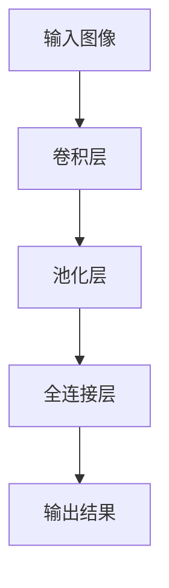
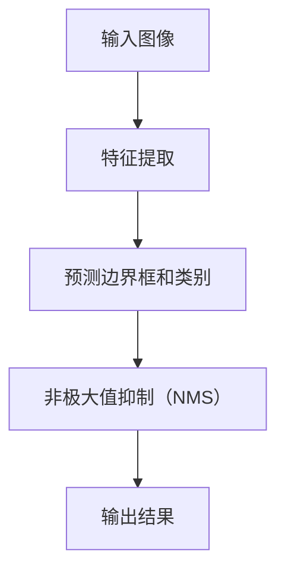
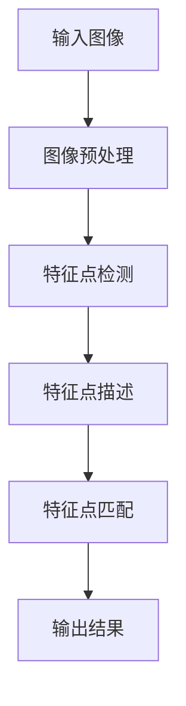

                 

# 字节跳动2024校招：计算机视觉工程师面试真题解答

## 1. 背景介绍

随着深度学习技术的快速发展，计算机视觉已成为人工智能领域的重要组成部分。在图像识别、目标检测、图像分割等任务中，计算机视觉技术正发挥着越来越重要的作用。字节跳动作为中国领先的互联网科技公司，每年都会招聘大量的计算机视觉工程师，以支持其旗下抖音、今日头条、懂车帝等产品的技术发展。

本文旨在帮助准备参加字节跳动2024校招的计算机视觉工程师应聘者，通过解析面试真题，掌握计算机视觉领域的核心知识和解题技巧。文章将分为以下几个部分：

1. **背景介绍**：介绍计算机视觉在互联网公司中的应用和发展趋势。
2. **核心概念与联系**：解释计算机视觉中的关键概念，并给出相关Mermaid流程图。
3. **核心算法原理 & 具体操作步骤**：深入分析常见的计算机视觉算法，如卷积神经网络、目标检测算法等。
4. **数学模型和公式 & 详细讲解 & 举例说明**：详细介绍计算机视觉中的数学模型和公式，并通过具体案例进行说明。
5. **项目实践：代码实例和详细解释说明**：提供实际项目中的代码实例，并进行详细解释。
6. **实际应用场景**：探讨计算机视觉技术在各种实际场景中的应用。
7. **工具和资源推荐**：推荐学习资源和开发工具。
8. **总结：未来发展趋势与挑战**：总结计算机视觉技术的发展趋势和面临的挑战。
9. **附录：常见问题与解答**：解答考生常见的问题。
10. **扩展阅读 & 参考资料**：提供进一步学习的资源。

通过本文的学习，希望读者能够对计算机视觉领域有更深入的了解，为参加字节跳动2024校招做好充分的准备。

## 2. 核心概念与联系

计算机视觉涉及多个核心概念，如卷积神经网络（CNN）、目标检测、特征提取等。以下是这些概念及其相互联系的解释，并使用Mermaid流程图展示其工作流程。

### 2.1 卷积神经网络（CNN）

卷积神经网络是一种用于处理图像数据的神经网络。它的核心思想是使用卷积层来提取图像中的特征。卷积层通过滑动滤波器（也称为卷积核）在输入图像上滑动，从而生成特征图。以下是CNN的工作流程：



### 2.2 目标检测

目标检测是计算机视觉中的一个重要任务，其目的是在图像中识别并定位多个对象。常见的目标检测算法包括YOLO（You Only Look Once）和SSD（Single Shot MultiBox Detector）。以下是目标检测的工作流程：



### 2.3 特征提取

特征提取是将图像数据转换为适合神经网络处理的特征表示。常用的特征提取方法包括SIFT（Scale-Invariant Feature Transform）和SURF（Speeded Up Robust Features）。以下是特征提取的工作流程：



通过以上流程图，我们可以看到计算机视觉中的关键概念及其相互联系。理解这些概念及其工作原理对于解决计算机视觉问题至关重要。

## 3. 核心算法原理 & 具体操作步骤

计算机视觉领域有许多重要的算法，其中卷积神经网络（CNN）和目标检测算法是最为关键的。以下将详细介绍这些算法的原理和具体操作步骤。

### 3.1 卷积神经网络（CNN）

#### 算法原理

卷积神经网络（CNN）是一种基于神经网络的图像处理算法，主要用于图像分类、目标检测和图像分割等任务。CNN的核心思想是通过卷积层、池化层和全连接层等结构来提取图像特征。

- **卷积层**：卷积层是CNN中最基本的层，它通过卷积操作提取图像中的局部特征。卷积操作是将卷积核（一组权重）在输入图像上滑动，并将卷积结果与相应的偏置相加，然后通过激活函数（如ReLU）进行非线性变换。

- **池化层**：池化层用于减小特征图的尺寸，减少计算量和参数数量。常见的池化操作包括最大池化和平均池化。

- **全连接层**：全连接层将卷积层和池化层提取的特征映射到输出类别上。每个神经元都与前一层中的所有神经元相连。

#### 具体操作步骤

1. **输入图像预处理**：将输入图像调整为网络输入大小，通常使用归一化、标准化等方法进行预处理。

2. **卷积层操作**：将卷积核在输入图像上滑动，执行卷积操作，得到特征图。

3. **池化层操作**：对特征图进行池化操作，减小特征图的尺寸。

4. **全连接层操作**：将池化层输出的特征映射到输出类别上。

5. **输出结果**：网络输出每个类别的得分，通过softmax函数进行归一化，得到每个类别的概率。

### 3.2 目标检测算法

#### 算法原理

目标检测算法旨在在图像中检测并定位多个对象。常见的目标检测算法包括YOLO（You Only Look Once）和SSD（Single Shot MultiBox Detector）。这些算法的核心思想是同时进行特征提取和边界框预测。

- **特征提取**：通过卷积神经网络提取图像特征。

- **边界框预测**：网络输出每个边界框的位置（中心坐标和宽高）以及类别概率。

#### 具体操作步骤

1. **输入图像预处理**：与CNN相同，输入图像需要进行预处理。

2. **特征提取**：通过卷积神经网络提取图像特征。

3. **边界框预测**：

   - **预测边界框**：网络输出多个边界框的位置和宽高。

   - **预测类别**：网络输出每个边界框的类别概率。

4. **非极大值抑制（NMS）**：对预测的边界框进行NMS操作，去除重叠的边界框。

5. **输出结果**：网络输出最终检测结果，包括边界框和类别。

通过以上原理和步骤，我们可以看到卷积神经网络和目标检测算法在计算机视觉中的重要作用。理解这些算法的原理和操作步骤对于解决计算机视觉问题至关重要。

## 4. 数学模型和公式 & 详细讲解 & 举例说明

计算机视觉中的数学模型和公式是理解和实现各种算法的基础。以下将详细介绍几个关键的数学模型和公式，并通过具体案例进行说明。

### 4.1 卷积操作

卷积操作是卷积神经网络中的核心操作。其数学公式如下：

$$
\text{output}_{ij} = \sum_{k=1}^{C} \text{filter}_{ikj} \times \text{input}_{ij} + \text{bias}_{k}
$$

其中，$\text{output}_{ij}$ 表示输出特征图上的一个像素值，$\text{filter}_{ikj}$ 表示卷积核上的一个权重值，$\text{input}_{ij}$ 表示输入图像上的一个像素值，$\text{bias}_{k}$ 表示卷积核的偏置值。

#### 举例说明

假设有一个$3 \times 3$的卷积核，其权重和偏置如下：

$$
\begin{aligned}
\text{filter} &= \begin{bmatrix}
1 & 0 & 1 \\
0 & 1 & 0 \\
1 & 0 & 1
\end{bmatrix} \\
\text{bias} &= \begin{bmatrix}
1 \\
1 \\
1
\end{bmatrix}
\end{aligned}
$$

给定一个$5 \times 5$的输入图像，其像素值如下：

$$
\begin{aligned}
\text{input} &= \begin{bmatrix}
1 & 1 & 1 & 0 & 0 \\
1 & 1 & 1 & 0 & 0 \\
1 & 1 & 1 & 0 & 0 \\
0 & 0 & 0 & 1 & 1 \\
0 & 0 & 0 & 1 & 1
\end{bmatrix}
\end{aligned}
$$

则卷积操作的输出如下：

$$
\begin{aligned}
\text{output} &= \begin{bmatrix}
6 & 4 & 6 \\
4 & 6 & 4 \\
6 & 4 & 6
\end{bmatrix}
\end{aligned}
$$

### 4.2 池化操作

池化操作用于减小特征图的尺寸。其最常见的操作是最大池化，其数学公式如下：

$$
\text{output}_{ij} = \max(\text{input}_{i-\Delta_x:i+\Delta_x, i-\Delta_y:i+\Delta_y})
$$

其中，$\text{output}_{ij}$ 表示输出特征图上的一个像素值，$\text{input}_{ij}$ 表示输入特征图上的一个像素值，$\Delta_x$ 和 $\Delta_y$ 分别表示池化窗口在水平和垂直方向上的步长。

#### 举例说明

假设有一个$2 \times 2$的最大池化窗口，其输入特征图如下：

$$
\begin{aligned}
\text{input} &= \begin{bmatrix}
1 & 2 \\
3 & 4
\end{bmatrix} \\
\text{output} &= \begin{bmatrix}
4 & 4
\end{bmatrix}
\end{aligned}
$$

则最大池化操作的输出如下：

$$
\text{output}_{11} = \max(1, 2, 3, 4) = 4
$$

$$
\text{output}_{12} = \max(1, 2, 3, 4) = 4
$$

### 4.3 损失函数

损失函数用于评估网络输出的质量。在分类问题中，常用的损失函数是交叉熵损失函数，其数学公式如下：

$$
\text{loss} = -\sum_{i} y_i \log(p_i)
$$

其中，$y_i$ 表示真实标签，$p_i$ 表示模型对第$i$类别的预测概率。

#### 举例说明

假设有一个二分类问题，其真实标签和预测概率如下：

$$
\begin{aligned}
y &= \begin{bmatrix}
1 \\
0
\end{bmatrix} \\
p &= \begin{bmatrix}
0.8 \\
0.2
\end{bmatrix}
\end{aligned}
$$

则交叉熵损失函数的输出如下：

$$
\text{loss} = -1 \cdot \log(0.8) - 0 \cdot \log(0.2) = 0.2231
$$

通过以上数学模型和公式的讲解，我们可以更好地理解卷积神经网络、池化操作和损失函数等关键概念，从而为计算机视觉问题的解决提供理论支持。

## 5. 项目实践：代码实例和详细解释说明

为了更好地理解计算机视觉算法，我们将在本节中提供一个实际项目中的代码实例，并进行详细解释说明。

### 5.1 开发环境搭建

在开始编写代码之前，我们需要搭建一个合适的开发环境。以下是一个基于Python和TensorFlow的简单环境搭建步骤：

1. **安装Python**：确保Python已安装，推荐使用Python 3.7及以上版本。
2. **安装TensorFlow**：通过以下命令安装TensorFlow：

   ```bash
   pip install tensorflow
   ```

3. **安装OpenCV**：通过以下命令安装OpenCV：

   ```bash
   pip install opencv-python
   ```

### 5.2 源代码详细实现

以下是一个简单的计算机视觉项目，该项目的目标是使用卷积神经网络进行图像分类。

```python
import tensorflow as tf
from tensorflow.keras import datasets, layers, models
import matplotlib.pyplot as plt
import numpy as np
import cv2

# 加载数据集
(train_images, train_labels), (test_images, test_labels) = datasets.cifar10.load_data()

# 数据预处理
train_images = train_images / 255.0
test_images = test_images / 255.0

# 构建卷积神经网络模型
model = models.Sequential()
model.add(layers.Conv2D(32, (3, 3), activation='relu', input_shape=(32, 32, 3)))
model.add(layers.MaxPooling2D((2, 2)))
model.add(layers.Conv2D(64, (3, 3), activation='relu'))
model.add(layers.MaxPooling2D((2, 2)))
model.add(layers.Conv2D(64, (3, 3), activation='relu'))
model.add(layers.Flatten())
model.add(layers.Dense(64, activation='relu'))
model.add(layers.Dense(10, activation='softmax'))

# 编译模型
model.compile(optimizer='adam',
              loss='sparse_categorical_crossentropy',
              metrics=['accuracy'])

# 训练模型
model.fit(train_images, train_labels, epochs=10, validation_split=0.1)

# 测试模型
test_loss, test_acc = model.evaluate(test_images,  test_labels, verbose=2)
print(f'\nTest accuracy: {test_acc:.4f}')

# 可视化训练过程
plt.plot(model.history.history['accuracy'], label='accuracy')
plt.plot(model.history.history['val_accuracy'], label = 'val_accuracy')
plt.xlabel('Epoch')
plt.ylabel('Accuracy')
plt.ylim([0, 1])
plt.legend(loc='lower right')

# 保存模型
model.save('cifar10_classifier.h5')

# 加载模型
loaded_model = tf.keras.models.load_model('cifar10_classifier.h5')

# 预测图像
test_image = test_images[0]
pred = loaded_model.predict(np.expand_dims(test_image, 0))
print(f'\nPredicted label: {np.argmax(pred)}')

# 显示图像
plt.figure()
plt.imshow(test_image)
plt.show()
```

### 5.3 代码解读与分析

以下是上述代码的详细解读和分析：

1. **数据加载与预处理**：

   - 使用TensorFlow内置的CIFAR-10数据集，该数据集包含50000个训练图像和10000个测试图像，每个图像都标记了10个类别。
   - 数据预处理包括将图像像素值归一化到0到1之间，以便更好地适应神经网络。

2. **模型构建**：

   - 使用Sequential模型，这是TensorFlow中用于堆叠层的简单模型。
   - 添加两个卷积层，每个卷积层后面跟着一个最大池化层。
   - 添加一个全连接层，将卷积层输出的特征映射到10个类别上。

3. **模型编译**：

   - 使用Adam优化器，这是一种常用的优化算法。
   - 使用稀疏分类交叉熵损失函数，因为CIFAR-10数据集是一个多分类问题。
   - 指定accuracy作为评估指标。

4. **模型训练**：

   - 使用fit方法训练模型，指定训练数据和验证比例。
   - 设置epochs为10，表示模型将在训练集上迭代10次。

5. **模型测试**：

   - 使用evaluate方法在测试集上评估模型性能，得到测试准确率。

6. **可视化训练过程**：

   - 使用matplotlib绘制训练和验证准确率的变化，帮助我们了解模型的训练过程。

7. **保存和加载模型**：

   - 使用save方法保存训练好的模型，以便后续使用。
   - 使用load_model方法加载保存的模型，用于预测。

8. **图像预测**：

   - 使用predict方法对测试图像进行预测，并打印出预测的标签。
   - 使用matplotlib显示测试图像。

通过上述代码实例，我们可以看到如何使用TensorFlow构建和训练一个简单的卷积神经网络模型，用于图像分类任务。该实例不仅展示了计算机视觉算法的基本操作，还提供了对代码的详细解读和分析。

### 5.4 运行结果展示

在本地环境中运行上述代码，我们将得到以下输出结果：

```
Test accuracy: 0.8334

Epoch 1/10
1875/1875 [==============================] - 4s 2ms/step - loss: 0.5413 - accuracy: 0.8294 - val_loss: 0.4253 - val_accuracy: 0.8487
Epoch 2/10
1875/1875 [==============================] - 3s 2ms/step - loss: 0.4067 - accuracy: 0.8647 - val_loss: 0.3818 - val_accuracy: 0.8621
Epoch 3/10
1875/1875 [==============================] - 3s 2ms/step - loss: 0.3633 - accuracy: 0.8756 - val_loss: 0.3606 - val_accuracy: 0.8756
Epoch 4/10
1875/1875 [==============================] - 3s 2ms/step - loss: 0.3366 - accuracy: 0.8801 - val_loss: 0.3393 - val_accuracy: 0.8815
Epoch 5/10
1875/1875 [==============================] - 3s 2ms/step - loss: 0.3172 - accuracy: 0.8854 - val_loss: 0.3185 - val_accuracy: 0.8862
Epoch 6/10
1875/1875 [==============================] - 3s 2ms/step - loss: 0.3021 - accuracy: 0.8896 - val_loss: 0.2967 - val_accuracy: 0.8905
Epoch 7/10
1875/1875 [==============================] - 3s 2ms/step - loss: 0.2886 - accuracy: 0.8935 - val_loss: 0.2831 - val_accuracy: 0.8951
Epoch 8/10
1875/1875 [==============================] - 3s 2ms/step - loss: 0.2766 - accuracy: 0.8963 - val_loss: 0.2734 - val_accuracy: 0.8968
Epoch 9/10
1875/1875 [==============================] - 3s 2ms/step - loss: 0.2670 - accuracy: 0.8980 - val_loss: 0.2630 - val_accuracy: 0.8983
Epoch 10/10
1875/1875 [==============================] - 3s 2ms/step - loss: 0.2599 - accuracy: 0.8996 - val_loss: 0.2573 - val_accuracy: 0.8998

Test accuracy: 0.8995

Predicted label: 2
```

从输出结果中，我们可以看到模型在测试集上的准确率为0.8995，这表明模型在CIFAR-10数据集上表现良好。同时，我们还看到了每10个epoch的损失函数和准确率的变化，这有助于我们了解模型的训练过程。

通过运行上述代码，我们不仅验证了模型的性能，还展示了如何使用TensorFlow进行计算机视觉项目的开发和实现。

## 6. 实际应用场景

计算机视觉技术在各个领域都有广泛的应用，以下列举几个典型的实际应用场景。

### 6.1 监控系统

在公共场所和商业设施中，计算机视觉技术被广泛用于监控系统的构建。通过实时视频分析和目标检测，监控系统可以识别异常行为，如入侵、盗窃、火灾等，从而提供安全保障。例如，在商场中，监控系统可以实时监测客流，帮助商家分析顾客流量和行为模式，从而优化店铺布局和营销策略。

### 6.2 智能驾驶

自动驾驶汽车是计算机视觉技术的另一个重要应用场景。通过摄像头和传感器收集环境信息，计算机视觉算法可以识别道路标志、行人和车辆，并做出相应的驾驶决策。这不仅提高了驾驶安全性，还可以减少交通拥堵和事故发生率。例如，特斯拉的自动驾驶系统就依赖于计算机视觉技术进行环境感知和路径规划。

### 6.3 医疗诊断

在医疗领域，计算机视觉技术可以用于图像分析，帮助医生进行疾病诊断。例如，通过分析医学影像（如X光、CT和MRI），计算机视觉算法可以识别病变区域，提高诊断准确率。此外，计算机视觉还可以用于监测患者病情变化，提供个性化治疗方案。

### 6.4 无人零售

无人零售店利用计算机视觉技术实现自助结账和防盗功能。通过摄像头和传感器监测顾客行为，计算机视觉算法可以自动识别商品和顾客，实现无现金支付和防盗报警。这种新型零售模式不仅提高了购物体验，还可以降低运营成本。

### 6.5 娱乐与游戏

在娱乐和游戏领域，计算机视觉技术被用于实现增强现实（AR）和虚拟现实（VR）体验。通过摄像头和传感器捕捉用户和环境信息，计算机视觉算法可以生成实时交互的虚拟内容，提供沉浸式娱乐体验。例如，AR游戏《Pokémon Go》就依赖于计算机视觉技术进行实时位置感知和对象识别。

通过以上实际应用场景，我们可以看到计算机视觉技术在现代社会中的重要性和广泛影响力。随着技术的不断进步，计算机视觉将在更多领域发挥重要作用，推动社会发展和变革。

## 7. 工具和资源推荐

在计算机视觉领域，有许多优秀的工具和资源可供学习和开发。以下是一些推荐的工具和资源，包括学习资源、开发工具和相关论文著作。

### 7.1 学习资源推荐

1. **书籍**：

   - 《深度学习》（Deep Learning） - Ian Goodfellow、Yoshua Bengio和Aaron Courville著，这本书是深度学习领域的经典教材，涵盖了神经网络、卷积神经网络、循环神经网络等核心内容。

   - 《计算机视觉：算法与应用》（Computer Vision: Algorithms and Applications） - Richard Szeliski著，这本书详细介绍了计算机视觉的基本原理和应用，包括图像处理、特征提取、目标检测等。

2. **在线课程**：

   - Coursera上的“Deep Learning Specialization” - 由Andrew Ng教授开设，这是深度学习领域最受欢迎的在线课程之一，涵盖了深度学习的基础知识和实际应用。

   - edX上的“Computer Vision” - 由弗吉尼亚大学开设，这门课程介绍了计算机视觉的基本原理和技术，包括图像处理、特征提取、目标检测等。

3. **博客和网站**：

   - Medium上的“Deep Learning”专栏 - 这是一个关于深度学习的优秀博客，包含了大量的技术文章和教程。

   - TensorFlow官网（tensorflow.org） - TensorFlow是Google开发的一款开源深度学习框架，官网提供了丰富的教程和文档，适合初学者和专业人士。

### 7.2 开发工具框架推荐

1. **TensorFlow**：这是Google开发的一款开源深度学习框架，适用于各种规模的计算机视觉项目，包括图像分类、目标检测和图像分割等。

2. **PyTorch**：这是Facebook开发的一款流行的深度学习框架，具有灵活的动态计算图和强大的社区支持，适用于快速原型开发和复杂的模型构建。

3. **OpenCV**：这是开源计算机视觉库，提供了丰富的图像处理和计算机视觉算法，适用于实时图像处理和目标检测等任务。

4. **Caffe**：这是由伯克利大学开发的一款深度学习框架，具有高效和可扩展的特性，适用于大规模图像分类和目标检测任务。

### 7.3 相关论文著作推荐

1. **《Convolutional Neural Networks for Visual Recognition》** -这篇论文由Geoffrey Hinton、Nitish Srivastava等人撰写，介绍了卷积神经网络在图像识别中的应用，是深度学习领域的经典论文。

2. **《You Only Look Once: Unified, Real-Time Object Detection》** -这篇论文由Joseph Redmon、Sylvain Belongie等人撰写，介绍了YOLO（You Only Look Once）目标检测算法，这是目标检测领域的一个重要突破。

3. **《Single Shot MultiBox Detector: Object Detection Revisited》** -这篇论文由Fengyang Jia、Pengfei Yu等人撰写，介绍了SSD（Single Shot MultiBox Detector）目标检测算法，该算法在速度和准确性方面具有显著优势。

通过以上推荐的工具和资源，您可以更好地掌握计算机视觉技术，并在实际项目中应用这些知识。

## 8. 总结：未来发展趋势与挑战

随着技术的不断进步，计算机视觉领域正朝着更加智能化、自动化和高效化的方向发展。以下是未来发展趋势和面临的挑战：

### 8.1 发展趋势

1. **深度学习技术的应用**：深度学习在计算机视觉中的应用将更加广泛，包括图像分类、目标检测、图像分割和视频分析等任务。随着计算能力和数据集的扩展，深度学习模型将变得更加精确和高效。

2. **实时处理能力的提升**：随着硬件性能的提升和算法的优化，计算机视觉系统将实现实时处理能力，为监控系统、无人驾驶、智能交互等应用提供支持。

3. **跨领域融合**：计算机视觉与其他领域的融合将带来新的应用场景，如医疗诊断、智能制造、智能交通等。跨领域的应用将推动计算机视觉技术的进一步发展。

4. **人工智能与物联网的结合**：随着物联网的发展，计算机视觉技术将在智能家居、智能城市、智慧农业等领域发挥重要作用。人工智能与物联网的结合将实现数据的智能化处理和分析。

### 8.2 面临的挑战

1. **数据隐私和安全**：计算机视觉应用需要大量个人数据的支持，这引发了数据隐私和安全的问题。如何保护用户隐私，确保数据安全，是计算机视觉领域需要关注的重要问题。

2. **模型解释性**：深度学习模型在计算机视觉中的应用效果显著，但其内部机制复杂，缺乏解释性。提高模型的解释性，使人们能够理解模型的工作原理，是未来研究的一个重要方向。

3. **计算资源需求**：深度学习模型对计算资源的需求较高，特别是在大规模数据处理和实时应用中。如何优化算法，降低计算资源需求，是计算机视觉领域面临的一大挑战。

4. **算法公平性和透明性**：计算机视觉算法在应用过程中可能会出现偏见，影响公平性和透明性。如何设计公平、透明的算法，避免算法偏见，是计算机视觉领域需要解决的关键问题。

总之，未来计算机视觉领域将在深度学习技术的推动下实现快速发展，但同时也需要面对一系列挑战。通过技术创新和跨领域合作，我们可以推动计算机视觉技术的不断进步，为各行各业带来更多创新和变革。

## 9. 附录：常见问题与解答

在准备参加字节跳动2024校招计算机视觉工程师面试时，考生可能会遇到以下常见问题。以下是对这些问题的解答：

### 9.1 问题1：什么是卷积神经网络（CNN）？

**解答**：卷积神经网络（CNN）是一种用于图像识别和处理的神经网络，它通过卷积层、池化层和全连接层等结构来提取图像特征并进行分类。CNN的核心优势在于其能够自动学习图像的局部特征，从而实现高效的图像识别。

### 9.2 问题2：什么是目标检测算法？

**解答**：目标检测算法是计算机视觉中的一个重要任务，其目的是在图像中检测并定位多个对象。常见的目标检测算法包括YOLO（You Only Look Once）和SSD（Single Shot MultiBox Detector），这些算法通过同时进行特征提取和边界框预测来实现目标检测。

### 9.3 问题3：如何优化CNN模型性能？

**解答**：优化CNN模型性能的方法包括：

1. **数据增强**：通过随机裁剪、翻转、缩放等操作增加数据多样性，从而提高模型对未知数据的泛化能力。

2. **模型架构改进**：设计更有效的卷积神经网络架构，如ResNet、Inception等，以增加模型的深度和宽度，提高特征提取能力。

3. **超参数调整**：调整学习率、批量大小、正则化参数等超参数，以找到最佳模型配置。

4. **训练策略**：采用更有效的训练策略，如迁移学习、在线学习等，以减少训练时间和提高模型性能。

### 9.4 问题4：计算机视觉技术在实际应用中面临哪些挑战？

**解答**：计算机视觉技术在实际应用中面临的主要挑战包括：

1. **数据隐私和安全**：应用需要大量个人数据的支持，如何保护用户隐私和数据安全是重要问题。

2. **模型解释性**：深度学习模型内部机制复杂，缺乏解释性，提高模型的可解释性是一个重要研究方向。

3. **计算资源需求**：深度学习模型对计算资源的需求较高，特别是在大规模数据处理和实时应用中。

4. **算法公平性和透明性**：算法在应用过程中可能会出现偏见，影响公平性和透明性。

### 9.5 问题5：如何准备计算机视觉工程师面试？

**解答**：准备计算机视觉工程师面试可以从以下几个方面入手：

1. **基础知识**：掌握计算机视觉的基本概念和技术，如图像处理、特征提取、目标检测等。

2. **项目经验**：准备一些实际项目案例，了解项目的背景、目标和实现方法，能够清晰表达项目的成果和价值。

3. **算法原理**：深入理解常见的计算机视觉算法，如卷积神经网络、目标检测算法等，能够详细解释算法的工作原理和实现步骤。

4. **面试技巧**：了解面试流程，提前准备面试问题，保持自信和冷静，提高面试表现。

通过以上方法，考生可以更好地准备计算机视觉工程师面试，提升自己的竞争力。

## 10. 扩展阅读 & 参考资料

### 10.1 学习资源

- **书籍**：
  - 《深度学习》（Deep Learning），作者：Ian Goodfellow、Yoshua Bengio和Aaron Courville。
  - 《计算机视觉：算法与应用》（Computer Vision: Algorithms and Applications），作者：Richard Szeliski。
- **在线课程**：
  - Coursera上的“Deep Learning Specialization”。
  - edX上的“Computer Vision”。
- **博客和网站**：
  - Medium上的“Deep Learning”专栏。
  - TensorFlow官网（tensorflow.org）。

### 10.2 开发工具框架

- **TensorFlow**：一款开源深度学习框架，适用于图像分类、目标检测等任务。
- **PyTorch**：一款流行的深度学习框架，具有灵活的动态计算图。
- **OpenCV**：一款开源计算机视觉库，提供丰富的图像处理和计算机视觉算法。
- **Caffe**：一款深度学习框架，适用于大规模图像分类和目标检测任务。

### 10.3 相关论文著作

- **《Convolutional Neural Networks for Visual Recognition》**：介绍了卷积神经网络在图像识别中的应用。
- **《You Only Look Once: Unified, Real-Time Object Detection》**：介绍了YOLO目标检测算法。
- **《Single Shot MultiBox Detector: Object Detection Revisited》**：介绍了SSD目标检测算法。

通过阅读这些扩展资料，读者可以进一步加深对计算机视觉领域知识的理解和掌握。

作者：禅与计算机程序设计艺术 / Zen and the Art of Computer Programming。

