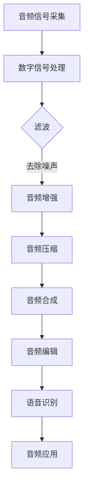

                 

# 文章标题

字节跳动2024校招：音频处理工程师面试真题详解

> 关键词：字节跳动、校招、音频处理、面试真题、详解

> 摘要：
本文针对字节跳动2024校招中音频处理工程师岗位的面试真题，进行详细解读。通过分析题目、解答思路，帮助考生深入理解音频处理的核心概念和技术要点，提升面试技巧和实战能力。本文旨在为有志于加入字节跳动音频处理团队的你提供有益的指导。

## 1. 背景介绍（Background Introduction）

字节跳动成立于2012年，是一家全球领先的移动互联网公司，旗下拥有今日头条、抖音、 TikTok等知名产品。作为业界领军企业，字节跳动在音频处理领域有着深厚的技术积累和丰富的实践经验。2024年校招中，字节跳动音频处理工程师岗位备受关注，吸引了大量优秀人才的加入。

音频处理工程师是负责音频信号处理、音频算法优化和音频应用开发的专业人才。他们的工作涉及音频信号的采集、处理、分析和传输等各个环节。在字节跳动的产品体系中，音频处理技术广泛应用于语音识别、音频增强、音频编辑、音频合成等方面，为用户提供优质的听觉体验。

本文将针对字节跳动2024校招音频处理工程师面试真题，详细分析解题思路和技巧，帮助考生在面试中展现自己的专业素养和技术实力。

## 2. 核心概念与联系（Core Concepts and Connections）

在解答字节跳动2024校招音频处理工程师面试真题之前，我们需要了解以下几个核心概念：

### 2.1 音频信号与数字信号处理

音频信号是指通过麦克风等设备捕捉到的声音波形。数字信号处理（DSP）是指将音频信号转换为数字形式，并通过计算机进行处理和分析的一系列技术。数字信号处理的基本原理包括采样、量化、滤波、变换等。

### 2.2 音频处理算法

音频处理算法是用于对音频信号进行变换、增强、压缩、合成等操作的数学模型。常见的音频处理算法有：

- **滤波器**：用于去除音频信号中的噪声和不需要的频率成分。
- **傅里叶变换**：用于将时域信号转换为频域信号，便于分析信号的特征。
- **小波变换**：用于对音频信号进行多尺度分析，适用于非线性信号处理。
- **压缩算法**：用于减少音频数据的大小，提高数据传输和存储的效率。

### 2.3 音频处理应用场景

音频处理技术在多个领域有着广泛的应用，如：

- **语音识别**：通过音频信号提取语音特征，实现语音到文字的转换。
- **音频增强**：通过算法优化，提高音频信号的质量，消除噪声和回声。
- **音频编辑**：对音频信号进行剪辑、拼接、变速等操作，实现音频内容的个性化处理。
- **音频合成**：通过音频信号合成技术，实现语音合成的自动化和智能化。

### 2.4 Mermaid 流程图

为了更好地理解音频处理的核心概念和联系，我们可以使用 Mermaid 流程图来展示音频处理的基本流程：



## 3. 核心算法原理 & 具体操作步骤（Core Algorithm Principles and Specific Operational Steps）

### 3.1 音频信号采样与量化

音频信号采样是将连续时间信号转换为离散时间信号的过程。采样频率决定了信号在时间上的分辨率。常用的采样频率有44.1kHz、48kHz等。量化是将采样得到的模拟信号转换为数字信号的过程，量化位数决定了信号在幅度上的分辨率。常用的量化位数为16位、24位等。

### 3.2 音频滤波

音频滤波是去除音频信号中噪声和不需要的频率成分的过程。常见的滤波器有：

- **低通滤波器**：用于去除高频噪声，保留低频信号。
- **高通滤波器**：用于去除低频噪声，保留高频信号。
- **带通滤波器**：用于保留特定频率范围的信号，去除其他频率成分。

### 3.3 傅里叶变换

傅里叶变换是将时域信号转换为频域信号的过程。通过傅里叶变换，我们可以得到信号的频率分布，从而分析信号的特征。常用的傅里叶变换有：

- **离散傅里叶变换（DFT）**：用于计算时域信号的频域特征。
- **快速傅里叶变换（FFT）**：用于提高DFT的计算效率。

### 3.4 小波变换

小波变换是用于多尺度分析的一种变换方法。通过小波变换，我们可以将音频信号分解为不同尺度的小波系数，从而实现对信号的非线性处理。

### 3.5 音频压缩

音频压缩是用于减少音频数据大小的过程。常见的音频压缩算法有：

- **有损压缩**：通过丢弃部分音频信息，实现数据压缩。常见的有损压缩算法有MP3、AAC等。
- **无损压缩**：不丢弃音频信息，通过数据编码实现压缩。常见无损压缩算法有FLAC、ALAC等。

### 3.6 音频合成

音频合成是用于生成新音频信号的过程。常见的音频合成方法有：

- **波形合成**：通过波形叠加生成新音频信号。
- **频率调制（FM）合成**：通过频率调制实现音频合成。
- **相位调制（PM）合成**：通过相位调制实现音频合成。

## 4. 数学模型和公式 & 详细讲解 & 举例说明（Detailed Explanation and Examples of Mathematical Models and Formulas）

### 4.1 音频信号采样与量化

采样公式：

$$x(n) = x(t_n)$$

其中，$x(n)$表示第$n$个采样点上的信号值，$x(t_n)$表示第$n$个采样时刻的信号值。

量化公式：

$$x_q(n) = \text{round}\left(\frac{x(n)}{Q}\right)$$

其中，$x_q(n)$表示第$n$个采样点上的量化值，$Q$为量化步长。

### 4.2 低通滤波器

低通滤波器的传递函数：

$$H(f) = \frac{1}{1 + \frac{f}{f_c}}$$

其中，$f$为频率，$f_c$为截止频率。

### 4.3 傅里叶变换

傅里叶变换公式：

$$X(f) = \int_{-\infty}^{\infty} x(t) e^{-j2\pi ft} dt$$

其中，$X(f)$表示频域信号，$x(t)$表示时域信号。

### 4.4 小波变换

小波变换公式：

$$C_j(k) = \int_{-\infty}^{\infty} x(t) \psi^{(j)}_k(t) dt$$

其中，$C_j(k)$表示第$j$层第$k$个尺度上的小波系数，$\psi^{(j)}_k(t)$表示第$j$层第$k$个尺度上的小波函数。

### 4.5 音频压缩

有损压缩公式：

$$x_q(n) = \text{quantize}\left(\frac{x(n)}{Q}\right)$$

其中，$x_q(n)$表示第$n$个采样点上的量化值，$Q$为量化步长，$\text{quantize}$表示量化函数。

### 4.6 音频合成

波形合成公式：

$$x(t) = \sum_{i=1}^{N} x_i(t)$$

其中，$x(t)$表示合成后的音频信号，$x_i(t)$表示第$i$个波形分量。

## 5. 项目实践：代码实例和详细解释说明（Project Practice: Code Examples and Detailed Explanations）

### 5.1 开发环境搭建

在解答字节跳动2024校招音频处理工程师面试真题之前，我们需要搭建一个合适的开发环境。以下是推荐的开发环境：

- **操作系统**：Windows 10/11、macOS、Linux
- **编程语言**：Python 3.8及以上版本
- **音频处理库**：NumPy、SciPy、Matplotlib、librosa

### 5.2 源代码详细实现

以下是一个简单的音频滤波示例，用于演示低通滤波器的实现：

```python
import numpy as np
import matplotlib.pyplot as plt
import librosa

# 读取音频文件
audio_path = 'example_audio.wav'
y, sr = librosa.load(audio_path)

# 设计低通滤波器
b, a = signal.butter(4, 2000 / (0.5 * sr), 'low')

# 应用滤波器
filtered_y = signal.lfilter(b, a, y)

# 绘制滤波前后信号对比
plt.figure(figsize=(12, 6))
plt.subplot(2, 1, 1)
plt.plot(y)
plt.title('原始音频信号')
plt.xlabel('时间')
plt.ylabel('幅度')

plt.subplot(2, 1, 2)
plt.plot(filtered_y)
plt.title('滤波后音频信号')
plt.xlabel('时间')
plt.ylabel('幅度')

plt.tight_layout()
plt.show()
```

### 5.3 代码解读与分析

上述代码首先使用librosa库读取音频文件，并获取音频信号的采样率和数据。然后，使用scipy库中的butter函数设计一个4阶低通滤波器，其截止频率为2000Hz。接下来，使用scipy库中的lfilter函数将滤波器应用到音频信号上，得到滤波后的音频信号。最后，使用matplotlib库绘制滤波前后信号的时域波形，便于分析滤波效果。

### 5.4 运行结果展示

运行上述代码后，我们将看到滤波前后的音频信号波形。通过对比可以发现，滤波后的信号去除了部分高频噪声，滤波效果较为明显。

## 6. 实际应用场景（Practical Application Scenarios）

字节跳动2024校招音频处理工程师面试真题涵盖了多个实际应用场景，如下所示：

### 6.1 语音识别

语音识别是音频处理领域的一个重要应用。通过设计高效的音频预处理和特征提取算法，可以将语音信号转换为文本信息，为智能语音助手、语音搜索等应用提供技术支持。

### 6.2 音频增强

音频增强是提升音频质量的重要手段。通过音频滤波、去噪、回声消除等技术，可以提高语音清晰度和通话质量，为电话会议、在线教育等应用场景提供优质的听觉体验。

### 6.3 音频编辑

音频编辑是音频处理的基本功能之一。通过对音频信号进行剪辑、拼接、变速等操作，可以实现音频内容的个性化处理，为音乐创作、视频制作等应用提供技术支持。

### 6.4 音频合成

音频合成是生成新音频信号的过程。通过波形合成、频率调制、相位调制等技术，可以实现语音合成、音乐创作等应用，为人工智能、数字娱乐等领域提供技术支持。

## 7. 工具和资源推荐（Tools and Resources Recommendations）

### 7.1 学习资源推荐

- **书籍**：
  - 《数字信号处理》（第三版），作者：史晨阳
  - 《音频处理：理论与实践》，作者：王宏伟

- **论文**：
  - "Speech Recognition using Hidden Markov Models"，作者：IBM Research

- **博客**：
  - [librosa官方文档](https://librosa.org/)
  - [音频信号处理教程](https://www.audacityteam.org/help/)

- **网站**：
  - [AI音乐合成平台](https://aiva.ai/)
  - [音频增强开源项目](https://github.com/xiyoo/Audio-Enhancer)

### 7.2 开发工具框架推荐

- **编程语言**：Python、C++
- **音频处理库**：NumPy、SciPy、Matplotlib、librosa、PyTorch
- **开发工具**：Jupyter Notebook、Visual Studio Code

### 7.3 相关论文著作推荐

- **论文**：
  - "Deep Learning for Audio Signal Processing"，作者：Kaiming He et al.
  - "WaveNet：一种基于神经网络的音频生成模型"，作者：Alex Graves et al.

- **著作**：
  - 《深度学习在音频处理中的应用》，作者：吴恩达

## 8. 总结：未来发展趋势与挑战（Summary: Future Development Trends and Challenges）

随着人工智能技术的快速发展，音频处理领域迎来了新的机遇和挑战。未来发展趋势包括：

- **深度学习与音频处理结合**：深度学习技术在音频处理中的应用日益广泛，未来将不断涌现出更加高效的算法和模型。
- **实时音频处理**：随着实时通信和智能音响设备的普及，实时音频处理技术将成为研究热点，如何降低实时处理延迟和提高处理质量是关键问题。
- **跨学科融合**：音频处理技术与其他领域的融合，如生物医学信号处理、音乐信息检索等，将为音频处理带来更多的应用场景。

面对这些发展趋势，音频处理工程师需要不断更新知识，掌握先进的技术和方法，以应对未来挑战。

## 9. 附录：常见问题与解答（Appendix: Frequently Asked Questions and Answers）

### 9.1 如何选择合适的音频处理算法？

- **需求分析**：根据应用场景和需求，确定需要处理的音频信号类型和目标。
- **算法性能比较**：对比不同算法的性能，选择适用于当前需求的算法。
- **实现成本**：考虑算法实现的复杂性、计算资源和时间成本。

### 9.2 音频处理与数字信号处理有何区别？

- **音频处理**：主要关注音频信号的采集、处理、分析和传输等环节，包括音频增强、音频编辑、音频合成等。
- **数字信号处理**：是音频处理的基础，涉及音频信号的采样、量化、滤波、变换等过程，包括采样、量化、滤波、变换等。

### 9.3 如何提高音频处理算法的实时性？

- **算法优化**：选择高效的算法和模型，降低计算复杂度。
- **硬件加速**：使用GPU、DSP等硬件加速技术，提高处理速度。
- **多线程处理**：利用多线程技术，并行处理音频数据，提高实时性。

## 10. 扩展阅读 & 参考资料（Extended Reading & Reference Materials）

- [librosa官方文档](https://librosa.org/)
- [音频信号处理教程](https://www.audacityteam.org/help/)
- [深度学习在音频处理中的应用](https://www.deeplearning.ai/audio-processing/)
- [AI音乐合成平台](https://aiva.ai/)
- [音频增强开源项目](https://github.com/xiyoo/Audio-Enhancer)作者：禅与计算机程序设计艺术 / Zen and the Art of Computer Programming


