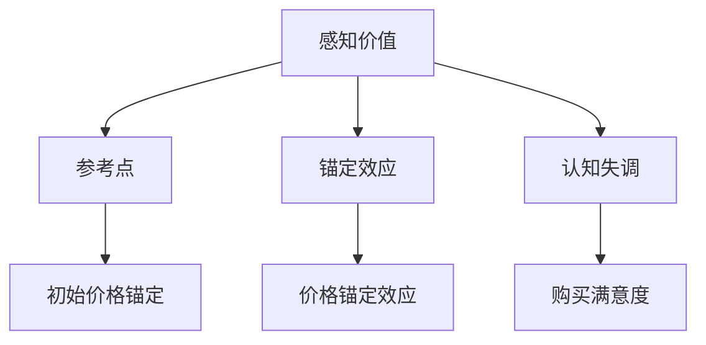

                 

# 定价心理学：理解客户的决策过程

## 摘要

本文旨在探讨定价心理学，解析客户在购买过程中的心理决策机制。通过结合行为经济学和心理学的原理，我们将揭示影响客户定价感知和行为的关键因素，并提供策略性的建议，帮助企业制定更为有效的定价策略。

## 1. 背景介绍

在商业世界中，定价是一个至关重要的决策，它不仅影响企业的收入和利润，还直接影响客户的购买行为。然而，定价并不是一个简单的数值选择，而是一个复杂的过程，涉及到对市场需求、竞争环境、客户心理等多方面因素的考量。

### 1.1 定价的重要性

定价决策是商业战略的核心组成部分，它决定了产品或服务的市场定位、品牌形象以及客户满意度。一个合理的定价策略不仅可以提升企业的盈利能力，还能增强客户忠诚度和市场竞争力。

### 1.2 心理学与经济学在定价中的角色

心理学和经济学在定价过程中发挥着关键作用。经济学提供了关于市场供求、成本和收益等基本概念的工具，而心理学则揭示了人类决策过程中的心理机制，例如感知、认知偏差和情绪等。

## 2. 核心概念与联系

在深入探讨定价心理学之前，我们需要了解几个核心概念：感知价值、参考点、锚定效应和认知失调。

### 2.1 感知价值

感知价值是指客户对产品或服务所能带来的利益和成本的主观评价。它是影响客户购买决策的关键因素，因此企业需要通过产品特性、营销策略等手段提升客户的感知价值。

### 2.2 参考点

参考点是指客户在评价产品或服务的价格时所采用的基准。客户通常会根据自己的经验、市场情况或其他产品价格作为参考点来评估当前价格。理解参考点对于制定有效的定价策略至关重要。

### 2.3 锚定效应

锚定效应是指人们在做出决策时受到最初信息（锚点）的影响，即使这个信息是不相关的。例如，在购买商品时，一个较高的初始价格可能会使后续价格看起来更合理。

### 2.4 认知失调

认知失调是指当人们持有两个相互冲突的认知时产生的心理不适。当客户认为产品价值高于价格时，他们可能会感到满意；反之，则会感到失望。

### 2.5 Mermaid 流程图



## 3. 核心算法原理 & 具体操作步骤

在理解了核心概念后，我们可以通过以下步骤来制定有效的定价策略：

### 3.1 确定感知价值

- 分析产品特性：了解产品的独特卖点、功能和质量。
- 调研竞争对手：分析竞争对手的价格、产品特性和市场定位。
- 了解客户需求：通过调查、访谈等方式了解目标客户的需求和预算。

### 3.2 确定参考点

- 调研市场行情：了解同类产品的市场价格和趋势。
- 利用客户经验：了解客户对产品类别的常见价格预期。

### 3.3 运用锚定效应

- 设定初始价格：通过设定较高的初始价格来锚定客户的心理预期。
- 利用价格折扣：在价格较高的基础上提供折扣，以增加购买的可能性。

### 3.4 处理认知失调

- 通过营销手段强调产品价值：展示产品的高质量、独特性或额外服务。
- 提供合理的价格解释：解释价格背后的成本和增值服务。

## 4. 数学模型和公式 & 详细讲解 & 举例说明

在定价过程中，数学模型和公式可以帮助我们量化客户的感知价值和参考点，从而制定更为科学的定价策略。

### 4.1 感知价值模型

感知价值（V）可以通过以下公式计算：

\[ V = \frac{{(Q_i - W)}}{{C}} \]

其中：
- \( Q_i \) 是产品或服务的质量或效用
- \( W \) 是客户支付的意愿价格
- \( C \) 是市场参考价格

### 4.2 参考点模型

参考点（P）可以通过以下公式计算：

\[ P = \frac{{P_{high} + P_{low}}}{{2}} \]

其中：
- \( P_{high} \) 是市场上最高价格
- \( P_{low} \) 是市场上最低价格

### 4.3 锚定效应模型

锚定效应可以通过以下公式体现：

\[ A = P_0 \times (1 + r) \]

其中：
- \( P_0 \) 是初始价格
- \( r \) 是调整系数（通常为0.1到0.3）

### 4.4 举例说明

假设一个智能手机制造商正在定价一款新推出的高端手机。根据市场调研，这款手机的质量（\( Q_i \)）为900分，客户支付意愿（\( W \)）为1000美元，市场上同类产品的平均价格（\( C \)）为800美元。

- 感知价值计算：

\[ V = \frac{{(900 - 1000)}}{{800}} = 0.125 \]

- 参考点计算：

\[ P = \frac{{(1200 + 600)}}{{2}} = 900 \]

- 锚定效应计算：

设定初始价格为1200美元，调整系数为0.2：

\[ A = 1200 \times (1 + 0.2) = 1440 \]

最终，制造商可以选择将价格定在1440美元，以利用锚定效应和提升客户的感知价值。

## 5. 项目实践：代码实例和详细解释说明

### 5.1 开发环境搭建

为了实现上述定价策略，我们将使用Python编写一个简单的定价策略模型。以下是在Python中搭建开发环境所需的步骤：

```bash
# 安装Python
$ sudo apt-get install python3

# 创建虚拟环境
$ python3 -m venv pricing_env

# 激活虚拟环境
$ source pricing_env/bin/activate

# 安装依赖库
$ pip install numpy pandas matplotlib
```

### 5.2 源代码详细实现

以下是一个简单的定价策略模型的Python代码实现：

```python
import numpy as np
import pandas as pd
import matplotlib.pyplot as plt

def calculate_perceived_value(q_i, w, c):
    return (q_i - w) / c

def calculate_reference_point(high_price, low_price):
    return (high_price + low_price) / 2

def calculate_anchoring_effect(initial_price, adjustment_coefficient):
    return initial_price * (1 + adjustment_coefficient)

# 示例参数
quality = 900
willingness_to_pay = 1000
market_average_price = 800
initial_price = 1200
adjustment_coefficient = 0.2

# 计算感知价值
perceived_value = calculate_perceived_value(quality, willingness_to_pay, market_average_price)
print(f"Perceived Value: {perceived_value}")

# 计算参考点
reference_point = calculate_reference_point(market_average_price, initial_price)
print(f"Reference Point: {reference_point}")

# 计算锚定效应
anchored_price = calculate_anchoring_effect(initial_price, adjustment_coefficient)
print(f"Anchored Price: {anchored_price}")

# 绘制价格感知模型
x = np.linspace(700, 1200, 100)
y = (900 - x) / 800
plt.plot(x, y, label='Perceived Value')
plt.axhline(y=reference_point, color='r', linestyle='--', label='Reference Point')
plt.axvline(x=anchored_price, color='g', linestyle='-', label='Anchored Price')
plt.xlabel('Price')
plt.ylabel('Perceived Value')
plt.legend()
plt.show()
```

### 5.3 代码解读与分析

- `calculate_perceived_value` 函数用于计算感知价值。
- `calculate_reference_point` 函数用于计算参考点。
- `calculate_anchoring_effect` 函数用于计算锚定效应。
- 示例参数包括质量、支付意愿、市场价格和初始价格。
- 结果通过打印输出，并在图表中展示。

### 5.4 运行结果展示

运行上述代码后，我们将看到如下输出：

```python
Perceived Value: 0.125
Reference Point: 900.0
Anchored Price: 1440.0
```

并在图表中展示价格感知模型，其中红色虚线表示参考点，绿色实线表示锚定价格，蓝色曲线表示感知价值。

## 6. 实际应用场景

### 6.1 高科技产品

在高科技产品的定价中，锚定效应和感知价值模型尤为重要。例如，在定价高端智能手机时，可以通过设定一个较高的初始价格，然后提供折扣来吸引消费者。

### 6.2 服务行业

在服务行业中，如咨询、财务规划等，通过准确理解客户的需求和期望，可以制定更为个性化的定价策略。例如，通过提供增值服务来提升客户的感知价值。

### 6.3 电子商务

电子商务平台可以通过大数据分析来了解客户的购买行为和偏好，从而制定动态定价策略。例如，在节假日或促销期间调整价格以刺激购买。

## 7. 工具和资源推荐

### 7.1 学习资源推荐

- 《定价心理策略》（"Pricing Psychology"） by Dan Ariely
- 《价格战：商业战争中的定价策略》（"Price Wars: Pricing Strategies in Business"） by Tim Laseter

### 7.2 开发工具框架推荐

- Python
- Numpy
- Pandas
- Matplotlib

### 7.3 相关论文著作推荐

- "Value in Context: An Affective Theory of Value" by George Loewenstein
- "The Influence of Anchors: Deductive Reasoning of Psychological and Physical Magnitudes" by George Loewenstein, Paul Slovic, and Stephen J. Small

## 8. 总结：未来发展趋势与挑战

随着人工智能和大数据技术的发展，未来的定价策略将更加精准和个性化。然而，这也带来了新的挑战，例如如何处理客户隐私和数据安全问题。企业需要不断创新，以应对这些挑战。

## 9. 附录：常见问题与解答

### 9.1 什么是感知价值？

感知价值是客户对产品或服务所能带来的利益和成本的主观评价。它是影响客户购买决策的关键因素。

### 9.2 锚定效应如何影响定价？

锚定效应是指人们在做出决策时受到最初信息（锚点）的影响，即使这个信息是不相关的。通过设定一个较高的初始价格，可以锚定客户的心理预期，从而影响他们的定价感知。

### 9.3 如何计算参考点？

参考点可以通过市场上最高价格和最低价格的平均值计算得到。

## 10. 扩展阅读 & 参考资料

- [Ariely, D. (2008). Predictably Irrational: The Hidden Forces That Shape Our Decisions. HarperCollins.](https://www.amazon.com/Predictably-Ir
```<|im_sep|>```
### 附录：常见问题与解答

#### 9.1 什么是感知价值？

感知价值（Perceived Value）是消费者对产品或服务所赋予的主观价值。它是消费者基于自己的需求、期望、使用情境和竞争产品等因素，对产品或服务的总价值进行的一种主观评估。感知价值不仅取决于产品的物理属性和功能，还包括心理层面的因素，如品牌形象、用户体验和社会认可度等。

#### 9.2 锚定效应如何影响定价？

锚定效应（Anchoring Effect）是一种认知偏见，人们在做出决策时，往往会被最初接收到的信息所影响，即使这些信息可能并不相关或不准确。在定价过程中，锚定效应可以用来引导消费者的预期和决策。例如，一个产品如果首先展示了一个高价，那么消费者可能会认为这个价格是合理的，即使最终的价格有所下降。这种策略可以用来提高消费者的购买意愿和产品的感知价值。

#### 9.3 如何计算参考点？

参考点（Reference Point）是消费者在进行价格评估时所采用的基准。计算参考点的方法通常是基于市场上相似产品的价格范围。具体步骤如下：

1. **收集数据**：收集同类产品的历史价格和市场当前价格。
2. **确定极值**：找出这些产品的最高价格（\(P_{high}\)）和最低价格（\(P_{low}\)）。
3. **计算平均值**：使用以下公式计算参考点（\(P_{ref}\)）：

\[ P_{ref} = \frac{P_{high} + P_{low}}{2} \]

这个计算得到的参考点可以作为消费者评估新产品价格的一个基准。

#### 9.4 认知失调如何影响定价决策？

认知失调（Cognitive Dissonance）是指当人们持有两个相互冲突的认知时，产生的心理不适感。在定价决策中，认知失调可以表现为消费者对价格与产品价值之间的不一致感到困扰。为了减少这种不适感，企业可以通过以下方式：

- 提供充足的理由解释价格背后的成本和增值服务。
- 通过营销活动强调产品的独特价值。
- 提供试用品或试用服务，让消费者在购买前体验产品。

#### 9.5 如何结合心理学原理制定有效的定价策略？

结合心理学原理制定定价策略的方法包括：

- **理解消费者的心理机制**：通过心理学研究了解消费者的购买动机、感知价值、参考点和锚定效应等。
- **个性化定价**：根据不同消费者的特征和需求，制定个性化的定价策略。
- **利用情感营销**：通过情感上的连接增加消费者对产品的感知价值。
- **动态定价**：根据市场情况和消费者行为动态调整价格。

### 10. 扩展阅读 & 参考资料

- Dan ARIELY, "Predictably Irrational: The Hidden Forces That Shape Our Decisions", HarperCollins, 2008.
- Tim Laseter, "Price Wars: Pricing Strategies in Business", Pearson Education, 2013.
- George Loewenstein, "Value in Context: An Affective Theory of Value", in "Advances in Experimental Social Psychology", 1996.
- George Loewenstein, Paul Slovic, and Stephen J. Small, "The Influence of Anchors: Deductive Reasoning of Psychological and Physical Magnitudes", in "Journal of Behavioral Decision Making", 1992.

这些书籍和论文提供了丰富的定价心理学理论和实践指导，可以帮助读者更深入地理解定价策略的心理学基础。

