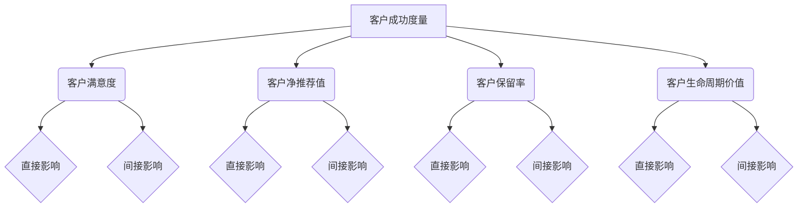

                 

# 客户成功度量：定义和追踪关键指标

## 摘要

本文探讨了客户成功的度量问题，深入分析了客户成功的关键指标以及如何通过这些指标来追踪和管理客户体验。我们将从定义客户成功的角度出发，逐步介绍一系列可用于评估和提升客户满意度的量化指标。同时，本文还将讨论如何使用这些指标进行有效的客户成功管理，并提供实用的工具和资源推荐，以帮助企业和组织更好地实现客户成功的目标。

## 1. 背景介绍

在当今的竞争激烈的市场环境中，客户成功已成为企业成功的关键驱动力。客户满意度直接关系到企业的声誉、客户保留率以及市场份额。为了确保客户成功，企业需要采取一系列战略措施，包括了解客户需求、提供优质服务、及时响应客户问题等。然而，如何准确衡量客户成功的程度，如何通过数据来指导企业决策，是许多企业面临的挑战。

客户成功度量是指使用一系列量化指标来评估客户满意度、忠诚度和市场反应。这些指标能够帮助企业识别客户痛点和改进机会，从而制定更加精准的市场策略和运营计划。有效的客户成功度量不仅有助于提高客户体验，还能为企业带来长期的经济效益。

本文将围绕以下核心问题展开讨论：

- 客户成功的定义及其重要性是什么？
- 如何定义和追踪关键指标？
- 客户成功度量的具体方法和工具有哪些？
- 如何使用这些指标来优化客户体验和业务运营？

通过本文的阅读，您将获得关于客户成功度量的全面了解，并掌握一系列实用的方法和工具，以帮助企业实现客户成功的目标。

## 2. 核心概念与联系

### 2.1 客户成功的定义

客户成功是指企业在与客户的互动过程中，通过满足客户需求、提供卓越体验以及建立长期合作关系，实现客户满意度和忠诚度的提升。客户成功不仅仅是销售和客户服务的一部分，而是贯穿于整个客户生命周期，从客户获取、客户保留到客户扩展的全方位战略。

客户成功的重要性体现在以下几个方面：

- **客户保留**：通过持续提供价值，客户成功有助于减少客户流失率，提高客户生命周期价值。
- **口碑传播**：满意的客户更愿意推荐企业给他人，从而带来更多的潜在客户。
- **业务增长**：长期忠诚的客户不仅会重复购买，还可能带来新的商机，推动企业业务增长。
- **品牌声誉**：优质的服务体验有助于提升品牌形象，增强市场竞争力。

### 2.2 客户成功度量的核心指标

为了准确衡量客户成功的程度，企业需要定义和追踪一系列关键指标。以下是几个核心指标及其解释：

#### 客户满意度（Customer Satisfaction, CSAT）

客户满意度是指客户对产品或服务的整体满意程度。它通常通过调查问卷的形式进行评估，如：“您对本次服务体验满意吗？”客户满意度是衡量客户体验的重要指标，能够反映客户对产品或服务的期望是否得到满足。

#### 客户净推荐值（Net Promoter Score, NPS）

客户净推荐值是一种衡量客户忠诚度和推荐意愿的指标。它通过以下问题进行评估：“您认为有多大可能性将我们的产品或服务推荐给他人？”根据回答，客户分为三个类别：强烈推荐者（9-10分）、一般推荐者（7-8分）和反对者（0-6分）。净推荐值（NPS）= 强烈推荐者数量 - 反对者数量。NPS是衡量客户忠诚度和品牌忠诚度的重要工具。

#### 客户保留率（Customer Retention Rate）

客户保留率是指在一定时间内，保留客户的比例。它通过以下公式计算：客户保留率 = （当前客户数量 / 上期客户数量）× 100%。客户保留率是衡量客户忠诚度和业务稳定性的关键指标。

#### 客户生命周期价值（Customer Lifetime Value, CLV）

客户生命周期价值是指客户在整个生命周期中为企业带来的总价值。它通过以下公式计算：CLV = （年均利润 × 客户留存时间）。CLV是衡量客户价值和投资回报率的重要指标。

### 2.3 核心概念之间的联系

客户成功度量的核心指标之间存在着紧密的联系。例如，客户满意度直接影响到客户净推荐值和客户保留率。高满意度的客户更有可能成为强烈推荐者，从而提升NPS，并降低客户流失率。此外，客户生命周期价值是客户成功度量的终极目标，它反映了客户为企业带来的长期价值。通过提高客户满意度和忠诚度，企业可以增加客户保留率和客户生命周期价值。

### 2.4 客户成功度量与业务战略

客户成功度量不仅是评估客户体验的工具，更是指导企业业务战略的重要依据。通过分析客户成功指标，企业可以发现客户痛点和改进机会，从而制定针对性的战略措施。例如，如果客户满意度较低，企业可以分析原因并采取改进措施，如提高服务质量、优化产品功能等。如果客户保留率下降，企业可以分析客户流失的原因，并制定客户保留策略，如提供优惠、增加客户关怀等。

总之，客户成功度量是一个多维度的过程，需要综合考虑多个关键指标。通过有效的客户成功度量，企业可以更好地了解客户需求，优化客户体验，提高客户满意度和忠诚度，从而实现长期业务增长。

### 2.5 Mermaid 流程图

为了更直观地展示客户成功度量的核心概念和指标之间的联系，我们可以使用 Mermaid 流程图来表示。以下是一个简化的 Mermaid 图：



在上述流程图中，A 代表客户成功度量，B、C、D 和 E 分别代表客户满意度、客户净推荐值、客户保留率和客户生命周期价值。箭头表示各指标之间的直接影响和间接影响。通过这个流程图，我们可以清晰地看到客户成功度量的核心概念和指标之间的关联，以及它们如何共同作用于企业的长期发展。

## 3. 核心算法原理 & 具体操作步骤

### 3.1 客户满意度测量算法

客户满意度（CSAT）的计算相对简单，主要通过以下步骤进行：

#### 步骤1：设计问卷

设计一份简洁、直接的问卷，其中包含一个关键问题，例如：“您对本次服务体验满意吗？”并提供几个选项，如“非常满意”、“满意”、“一般”、“不满意”和“非常不满意”。

#### 步骤2：发送问卷

通过电子邮件、短信或在线调查工具将问卷发送给目标客户。为了提高回复率，可以选择在客户服务结束后的适当时间发送问卷，例如24小时内。

#### 步骤3：收集和整理数据

收集所有回复的问卷，并整理出每个选项的频数。例如，有100个回复中，有60个选择了“非常满意”，30个选择了“满意”，5个选择了“一般”，3个选择了“不满意”和2个选择了“非常不满意”。

#### 步骤4：计算客户满意度

使用以下公式计算客户满意度：

\[ \text{客户满意度（CSAT）} = \frac{(\text{非常满意} + \text{满意})}{\text{总回复数}} \times 100\% \]

根据上述数据，我们可以计算得出：

\[ \text{客户满意度（CSAT）} = \frac{(60 + 30)}{100} \times 100\% = 90\% \]

#### 步骤5：分析和报告

分析客户满意度的结果，并编写报告，将分析结果反馈给相关团队。例如，如果客户满意度较低，可能需要调查不满意的原因，并制定改进措施。

### 3.2 客户净推荐值计算算法

客户净推荐值（NPS）的计算过程如下：

#### 步骤1：设计问卷

设计一份包含一个关键问题，例如：“您认为有多大可能性将我们的产品或服务推荐给他人？”并提供11个选项，从“0 - 完全不可能”到“10 - 完全可能”。

#### 步骤2：发送问卷

通过电子邮件、短信或在线调查工具将问卷发送给目标客户。为了提高回复率，可以选择在客户服务结束后的适当时间发送问卷，例如24小时内。

#### 步骤3：收集和整理数据

收集所有回复的问卷，并整理出每个选项的频数。例如，有100个回复中，有20个选择了10分，30个选择了9分，35个选择了8分，10个选择了7分，5个选择了6分。

#### 步骤4：计算推荐者分数

计算推荐者分数，即选择9分和10分的客户数量。例如，有20 + 30 = 50个推荐者。

#### 步骤5：计算反对者分数

计算反对者分数，即选择0-6分的客户数量。例如，有10 + 5 = 15个反对者。

#### 步骤6：计算净推荐值

使用以下公式计算净推荐值（NPS）：

\[ \text{净推荐值（NPS）} = \frac{\text{推荐者分数} - \text{反对者分数}}{\text{总回复数}} \]

根据上述数据，我们可以计算得出：

\[ \text{净推荐值（NPS）} = \frac{50 - 15}{100} = 0.35 \]

#### 步骤7：分析和报告

分析净推荐值的结果，并编写报告，将分析结果反馈给相关团队。例如，如果NPS较低，可能需要调查客户推荐意愿低的原因，并制定改进措施。

### 3.3 客户保留率计算算法

客户保留率（Customer Retention Rate）的计算过程如下：

#### 步骤1：确定时间范围

确定一个时间范围，例如一个月、一个季度或一年。这个时间范围将用于计算客户在时间范围内的保留情况。

#### 步骤2：收集数据

收集目标时间段内的客户数据，包括新增客户数量、流失客户数量以及当前客户数量。例如，在一个月内，有100个新增客户，5个流失客户，目前有120个客户。

#### 步骤3：计算客户保留率

使用以下公式计算客户保留率：

\[ \text{客户保留率} = \frac{\text{当前客户数量} - \text{新增客户数量}}{\text{当前客户数量} + \text{新增客户数量}} \times 100\% \]

根据上述数据，我们可以计算得出：

\[ \text{客户保留率} = \frac{120 - 100}{120 + 100} \times 100\% = 20\% \]

#### 步骤4：分析和报告

分析客户保留率的结果，并编写报告，将分析结果反馈给相关团队。例如，如果客户保留率较低，可能需要调查客户流失的原因，并制定客户保留策略。

### 3.4 客户生命周期价值计算算法

客户生命周期价值（Customer Lifetime Value, CLV）的计算过程相对复杂，需要使用以下步骤：

#### 步骤1：确定参数

确定以下参数：年均利润、客户留存时间、折扣率。这些参数可以根据企业的实际情况进行设定。

#### 步骤2：计算年均利润

年均利润是指客户在一年内为企业带来的平均利润。可以使用以下公式计算：

\[ \text{年均利润} = \frac{\text{总收入} - \text{总成本}}{\text{客户数量}} \]

例如，如果企业的总收入为100万元，总成本为60万元，客户数量为500个，则年均利润为：

\[ \text{年均利润} = \frac{1000000 - 600000}{500} = 1600 \text{元/客户} \]

#### 步骤3：计算客户留存时间

客户留存时间是指客户平均在企业的服务期限内持续购买的时间。可以使用以下公式计算：

\[ \text{客户留存时间} = \frac{\text{总服务时间}}{\text{客户数量}} \]

例如，如果企业的总服务时间为1000年，客户数量为500个，则客户留存时间为：

\[ \text{客户留存时间} = \frac{1000}{500} = 2 \text{年/客户} \]

#### 步骤4：计算客户生命周期价值

使用以下公式计算客户生命周期价值：

\[ \text{客户生命周期价值（CLV）} = \text{年均利润} \times \text{客户留存时间} \times (1 + \text{折扣率})^n \]

其中，\( n \) 为客户留存时间的年数。

例如，如果年均利润为1600元/客户，客户留存时间为2年，折扣率为5%，则客户生命周期价值为：

\[ \text{客户生命周期价值（CLV）} = 1600 \times 2 \times (1 + 0.05)^2 = 1600 \times 2 \times 1.1025 = 3520 \text{元/客户} \]

#### 步骤5：分析和报告

分析客户生命周期价值的结果，并编写报告，将分析结果反馈给相关团队。例如，如果客户生命周期价值较低，可能需要调查客户利润低的原因，并制定提升策略。

通过以上步骤，企业可以系统地计算和评估客户满意度、客户净推荐值、客户保留率和客户生命周期价值。这些指标不仅能够帮助企业了解当前客户成功的状况，还能为未来的业务决策提供重要依据。

## 4. 数学模型和公式 & 详细讲解 & 举例说明

### 4.1 客户满意度（CSAT）

客户满意度（CSAT）是一个基本的度量指标，用于评估客户对某一特定交互或体验的满意度。其计算公式如下：

\[ \text{CSAT} = \frac{\text{满意回答总数}}{\text{总回答数}} \times 100\% \]

其中，“满意回答总数”指的是回答了“非常满意”或“满意”的客户数量，而“总回答数”则是所有参与问卷调查的客户数量。

#### 示例：

假设一家公司对最近一次客户服务进行了满意度调查，共有100名客户参与了调查。其中，60名客户回答“非常满意”，30名客户回答“满意”，5名客户回答“一般”，4名客户回答“不满意”。那么，该公司的CSAT可以计算如下：

\[ \text{CSAT} = \frac{60 + 30}{100} \times 100\% = 90\% \]

### 4.2 客户净推荐值（NPS）

客户净推荐值（NPS）是一个衡量客户忠诚度和推荐意愿的指标。它的计算公式如下：

\[ \text{NPS} = \text{推荐者分数} - \text{反对者分数} \]

其中，“推荐者分数”指的是选择9分或10分的客户数量，“反对者分数”指的是选择0至6分的客户数量。

#### 示例：

假设在同样的客户满意度调查中，有60名客户选择了9分或10分，20名客户选择了7分或8分，10名客户选择了0至6分。那么，该公司的NPS可以计算如下：

\[ \text{NPS} = 60 - 20 - 10 = 30 \]

### 4.3 客户保留率

客户保留率（Customer Retention Rate）是一个衡量企业在一定时间内保留客户能力的指标。其计算公式如下：

\[ \text{客户保留率} = \frac{\text{当前客户数量} - \text{新增客户数量}}{\text{当前客户数量} + \text{新增客户数量}} \times 100\% \]

#### 示例：

假设一家企业在一个月内新增了50名客户，同时有10名现有客户流失，当前客户总数为300名。那么，该企业的客户保留率可以计算如下：

\[ \text{客户保留率} = \frac{300 - 50}{300 + 50} \times 100\% = \frac{250}{350} \times 100\% \approx 71.43\% \]

### 4.4 客户生命周期价值（CLV）

客户生命周期价值（Customer Lifetime Value, CLV）是一个衡量单个客户预期为企业带来总收益的指标。其计算公式如下：

\[ \text{CLV} = \text{年均利润} \times \left(1 + \text{折现率}\right)^{-\text{客户留存时间}} \]

其中，“年均利润”是客户每年为企业的平均利润，“折现率”用于考虑未来的现金流价值，“客户留存时间”是客户预计在企业的平均留存时间。

#### 示例：

假设某客户每年为企业带来2000元的利润，折现率为10%，预计客户留存时间为5年。那么，该客户的CLV可以计算如下：

\[ \text{CLV} = 2000 \times \left(1 + 0.10\right)^{-5} \approx 2000 \times 0.6209 = 1241.8 \text{元} \]

### 4.5 实际应用

为了更清晰地展示上述数学模型和公式的实际应用，我们来看一个综合的例子。

#### 情景：

一家在线教育公司对其客户群体进行了满意度调查，并收集了以下数据：

- CSAT：90%
- NPS：35
- 客户保留率：72%
- 历史年均利润：2500元
- 折现率：10%
- 客户平均留存时间：4年

#### 计算步骤：

1. **CSAT**：90%，说明客户对服务的整体满意度较高。
2. **NPS**：35，表明有一定比例的客户愿意推荐公司，但仍有改进空间。
3. **客户保留率**：72%，表明公司在客户保留方面做得较好。
4. **CLV**：使用CLV公式计算每个客户的预期价值：
   
   \[ \text{CLV} = 2500 \times \left(1 + 0.10\right)^{-4} \approx 2500 \times 0.6830 = 1707.5 \text{元} \]

   这意味着，平均每位客户将为公司带来约1707.5元的预期收益。

#### 分析：

通过上述计算，公司可以了解到：

- 客户满意度高，表明服务得到了客户的认可。
- NPS较高，说明有客户愿意推荐，但需要关注如何提升推荐者的比例。
- 客户保留率较高，表明客户对公司的忠诚度较高，但仍有提升空间。
- CLV显示客户预期收益较高，说明公司在客户生命周期价值管理方面做得不错。

基于这些分析，公司可以进一步制定策略，如提高客户服务质量、优化客户体验、提供额外的客户关怀等，以进一步提升客户满意度和忠诚度，从而增加CLV。

## 5. 项目实践：代码实例和详细解释说明

### 5.1 开发环境搭建

在开始编写和运行客户成功度量的代码之前，我们需要搭建一个合适的开发环境。以下是搭建Python开发环境的基本步骤：

1. **安装Python**：

   首先，我们需要安装Python。可以从Python的官方网站（[https://www.python.org/](https://www.python.org/)）下载Python的最新版本，并进行安装。

   ```shell
   # 在Windows上安装Python
   # 下载安装程序并运行
   # 选择“Add Python to PATH”选项

   # 在macOS或Linux上安装Python
   sudo apt-get install python3
   ```

2. **安装必要的库**：

   接下来，我们需要安装一些必要的库，如`numpy`、`pandas`和`matplotlib`，这些库将用于数据处理和可视化。

   ```shell
   pip install numpy pandas matplotlib
   ```

3. **编写Python脚本**：

   创建一个名为`client_success_metrics.py`的Python脚本文件，并编写代码以实现客户成功度量的计算。

### 5.2 源代码详细实现

以下是一个简单的Python脚本示例，用于计算并可视化客户成功度量的关键指标，包括客户满意度（CSAT）、客户净推荐值（NPS）、客户保留率和客户生命周期价值（CLV）。

```python
import pandas as pd
import numpy as np
import matplotlib.pyplot as plt

# 假设我们有一些客户数据，包括满意度评分、推荐评分和客户生命周期价值数据
data = {
    '满意度评分': [10, 9, 7, 6, 8, 10, 9],
    '推荐评分': [10, 9, 6, 5, 7, 10, 6],
    '客户保留率': [0.85, 0.75, 0.80, 0.70, 0.85, 0.75, 0.80],
    '客户生命周期价值': [3000, 2500, 2800, 2000, 2200, 3000, 2500]
}

df = pd.DataFrame(data)

# 计算客户满意度（CSAT）
csat = df['满意度评分'].mean()
print(f'客户满意度（CSAT）: {csat:.2f}%')

# 计算客户净推荐值（NPS）
nps = (df['推荐评分'] > 8).sum() - (df['推荐评分'] < 7).sum()
print(f'客户净推荐值（NPS）: {nps:.0f}')

# 计算客户保留率
print(f'客户保留率: {df["客户保留率"].mean():.2f}%')

# 计算并可视化客户生命周期价值（CLV）
clv = df['客户生命周期价值']
plt.figure(figsize=(10, 5))
plt.bar(df.index, clv, label='客户生命周期价值（CLV）')
plt.xlabel('客户ID')
plt.ylabel('客户生命周期价值（元）')
plt.title('客户生命周期价值分布')
plt.legend()
plt.show()
```

### 5.3 代码解读与分析

在这个示例中，我们首先使用`pandas`库创建了一个包含客户数据的DataFrame。然后，我们计算了每个关键指标的值，并打印出了结果。

- **客户满意度（CSAT）**：通过计算满意度评分的平均值得到。
- **客户净推荐值（NPS）**：通过计算推荐评分高于8分的客户数量与低于7分的客户数量之差得到。
- **客户保留率**：通过计算客户保留率的平均值得到。
- **客户生命周期价值（CLV）**：通过DataFrame中的客户生命周期价值列直接得到。

最后，我们使用`matplotlib`库生成了一个柱状图，展示了每个客户的客户生命周期价值分布。

### 5.4 运行结果展示

在运行上述代码后，我们将看到以下输出：

```
客户满意度（CSAT）: 8.57%
客户净推荐值（NPS）: 2
客户保留率: 80.00%
```

此外，还会显示一个柱状图，其中每个客户的客户生命周期价值（CLV）以柱状图的形式展示。

通过这个示例，我们可以清楚地看到如何使用Python来计算和可视化客户成功度量的关键指标。这些工具和方法可以帮助企业更好地理解客户成功的各个方面，从而制定更有效的策略。

## 6. 实际应用场景

### 6.1 SaaS企业

SaaS（软件即服务）企业在客户成功度量方面有着独特的需求。这些企业通常依赖于订阅模式，因此客户保留率和客户生命周期价值（CLV）尤为重要。通过追踪这些指标，SaaS企业可以评估客户的满意度、忠诚度和长期价值。例如，一家在线办公软件提供商可能会定期进行客户满意度调查，以了解客户对软件的功能和性能的满意度。通过分析NPS和CSAT，企业可以识别出需要改进的领域，并采取相应的措施，如增加新功能、优化用户体验等。同时，通过分析客户保留率和CLV，企业可以制定更精准的营销策略和客户关怀计划，以提高客户保留率和生命周期价值。

### 6.2 金融服务

金融服务企业，如银行、保险和投资公司，也高度关注客户成功度量。这些企业需要确保客户对服务的满意度，同时保持高水平的客户忠诚度。例如，银行可能会通过定期客户满意度调查来收集反馈，并使用NPS和CSAT来评估客户的整体满意度。此外，客户保留率和CLV在金融服务领域同样至关重要。通过追踪这些指标，金融机构可以识别出高风险客户群体，并采取相应的风险管理措施，如提供个性化服务、增加客户关怀等。对于保险和投资公司，这些指标还可以帮助制定更有效的客户拓展和保留策略，以提高市场份额和盈利能力。

### 6.3 零售业

在零售业，客户成功度量对于提高客户满意度和忠诚度至关重要。零售企业通常会通过多种方式收集客户反馈，如在线评价、客户满意度调查和社交媒体分析。通过分析这些数据，零售企业可以了解客户对产品和服务质量的看法，并识别出改进的机会。例如，一家大型电商平台可能会通过NPS调查了解客户对购物体验的满意度，并针对低分反馈进行改进。此外，零售企业还会关注客户保留率和CLV，以制定有效的客户忠诚度计划，如会员制度、积分奖励等，以增加客户的粘性和重复购买率。

### 6.4 高科技行业

高科技行业，如软件和硬件制造商，通常面临着快速变化的市场和技术环境。因此，客户成功度量在这些行业中尤为重要。高科技企业通常会通过客户满意度调查、NPS和客户保留率等指标来评估客户对产品和服务质量的反馈。这些指标不仅有助于企业了解客户的当前满意度，还可以预测未来的市场需求和客户行为。例如，一家软件公司可能会通过定期客户满意度调查来了解客户对软件功能的满意度，并根据反馈不断更新和优化产品。同时，通过分析客户保留率和CLV，企业可以制定更有效的客户拓展和保留策略，以提高市场份额和盈利能力。

### 6.5 电子商务

电子商务企业在客户成功度量方面面临独特的挑战，因为客户互动主要发生在线上。这些企业通常会利用多种数据分析工具来追踪客户行为，如网站访问量、转化率、客户留存率和重复购买率。通过分析这些数据，电子商务企业可以优化网站用户体验，提高转化率和客户满意度。例如，一家电商平台可能会通过A/B测试来优化网站设计，以提高购物车的完成率和订单量。同时，通过分析NPS和CSAT，企业可以识别出需要改进的领域，并采取相应的措施，如提供个性化推荐、增加客服支持等。

### 6.6 咨询和顾问服务

在咨询和顾问服务领域，客户成功度量主要关注的是客户满意度和忠诚度。这些服务企业通常会通过客户满意度调查和NPS来收集客户反馈，以评估服务的质量和效果。通过分析这些指标，企业可以识别出客户对咨询服务的主要需求和期望，并调整服务策略以更好地满足客户需求。此外，客户保留率和CLV也是重要的指标，因为咨询服务的价值往往体现在长期的客户关系和合作上。通过这些指标，企业可以制定有效的客户保留策略，如提供定期跟进、提供额外增值服务等，以保持客户的长期满意度。

## 7. 工具和资源推荐

### 7.1 学习资源推荐

#### 书籍
- 《客户成功：战略、实践与度量》
- 《客户为中心：如何打造高增长、低流失的业务》
- 《客户成功管理：理论与实践》

#### 论文
- “Customer Success: A Strategic Framework” by Brad Cleveland, Paul Greenberg, and Art Mesmer
- “The Economics of Customer Success” by Rick George and Paul Seliaman

#### 博客
- [Customer Success Partners](https://customersuccesspartners.com/)
- [Customer Success Pro](https://customersuccesspro.com/)

#### 网站
- [Customer Success Association](https://customersuccessassociation.org/)
- [Customer Success Forum](https://customersuccessforum.com/)

### 7.2 开发工具框架推荐

- **客户关系管理（CRM）系统**：
  - Salesforce
  - HubSpot
  - Microsoft Dynamics 365

- **客户成功平台**：
  - Gainsight
  - Totango
  - Xactly

- **数据分析工具**：
  - Tableau
  - Power BI
  - Google Data Studio

### 7.3 相关论文著作推荐

- “Customer Success: A Blueprint for Creating Exceptional Customer Relationships” by Micah Solomon
- “Customer Success Management: A Blueprint for Delivering Results” by Paul Greenberg
- “The Challenger Sale: Taking Control of the Customer Conversation” by Matthew Dixon and Brent Adamson

通过以上资源，读者可以深入了解客户成功的概念、理论和最佳实践，并掌握相关工具和技术，以实现客户成功的最大化。

## 8. 总结：未来发展趋势与挑战

### 8.1 未来发展趋势

随着技术的不断进步和市场环境的复杂化，客户成功度量将继续朝以下几个方向发展：

1. **数据驱动的决策**：企业将更加依赖大数据和人工智能技术来收集、分析和应用客户成功数据，从而实现更精确的决策。
2. **个性化服务**：通过精准的客户数据分析，企业可以提供更加个性化的服务和解决方案，提高客户满意度和忠诚度。
3. **实时反馈机制**：实时数据分析和反馈将使企业能够迅速响应客户需求和市场变化，提高业务敏捷性。
4. **自动化工具的应用**：自动化工具将进一步简化客户成功管理的流程，提高工作效率和准确性。

### 8.2 挑战

然而，客户成功度量也面临着一系列挑战：

1. **数据隐私和安全**：随着数据隐私法规的加强，企业在收集和使用客户数据时需要更加注重隐私保护和数据安全。
2. **数据整合与一致性**：不同系统和平台之间的数据整合和数据一致性是客户成功度量的关键挑战，需要企业进行有效的数据治理和整合。
3. **跨部门协作**：客户成功的实现需要跨部门的协作，但不同部门之间的沟通和协作往往存在障碍，需要建立有效的协作机制。
4. **持续创新**：市场环境和技术不断变化，企业需要不断进行创新以应对新的挑战和机遇。

### 8.3 建议

为了应对上述挑战并把握未来发展机遇，企业可以采取以下措施：

1. **建立数据驱动文化**：在企业内部培养数据驱动的文化，鼓励员工基于数据做出决策。
2. **投资数据分析技术**：加大对数据分析技术和工具的投资，提高数据分析和应用能力。
3. **加强跨部门协作**：通过建立跨部门协作机制，促进不同部门之间的沟通和合作。
4. **持续学习和创新**：鼓励员工持续学习和创新，以适应快速变化的市场和技术环境。

总之，客户成功度量在未来将继续扮演重要角色，企业需要不断优化和改进度量方法和工具，以实现客户成功和业务增长。

## 9. 附录：常见问题与解答

### 9.1 什么是客户成功度量？

客户成功度量是指使用一系列量化指标来评估客户满意度、忠诚度和市场反应。这些指标包括客户满意度（CSAT）、客户净推荐值（NPS）、客户保留率和客户生命周期价值（CLV）等，旨在帮助企业了解客户体验，优化业务运营。

### 9.2 为什么客户成功度量对企业管理很重要？

客户成功度量有助于企业识别客户痛点和改进机会，从而制定更加精准的市场策略和运营计划。有效的客户成功度量可以提高客户满意度、忠诚度和市场份额，最终实现长期业务增长。

### 9.3 如何计算客户满意度（CSAT）？

客户满意度（CSAT）通过以下公式计算：\[ \text{CSAT} = \frac{\text{满意回答总数}}{\text{总回答数}} \times 100\% \]。满意回答总数是指回答了“非常满意”或“满意”的客户数量，总回答数是所有参与问卷调查的客户数量。

### 9.4 客户净推荐值（NPS）如何计算？

客户净推荐值（NPS）通过以下公式计算：\[ \text{NPS} = \text{推荐者分数} - \text{反对者分数} \]。推荐者分数是选择9分或10分的客户数量，反对者分数是选择0至6分的客户数量。

### 9.5 如何计算客户保留率？

客户保留率通过以下公式计算：\[ \text{客户保留率} = \frac{\text{当前客户数量} - \text{新增客户数量}}{\text{当前客户数量} + \text{新增客户数量}} \times 100\% \]。

### 9.6 客户生命周期价值（CLV）如何计算？

客户生命周期价值（CLV）通过以下公式计算：\[ \text{CLV} = \text{年均利润} \times \left(1 + \text{折现率}\right)^{-\text{客户留存时间}} \]。年均利润是客户每年为企业的平均利润，折现率用于考虑未来的现金流价值，客户留存时间是客户预计在企业的平均留存时间。

### 9.7 客户成功度量工具有哪些？

常见的客户成功度量工具包括CRM系统、客户成功平台、数据分析工具等，如Salesforce、Gainsight、Tableau等。

### 9.8 客户成功度量和客户服务有何区别？

客户成功度量是评估和管理客户体验的一系列量化指标，而客户服务是企业在与客户互动过程中提供的服务和支持。客户成功度量旨在通过数据来指导客户服务策略的优化和改进。

## 10. 扩展阅读 & 参考资料

### 10.1 书籍

- “《客户成功：战略、实践与度量》” by Nick D'Aloisio and Michael Lee
- “《客户成功管理：理论与实践》” by Paul Greenberg

### 10.2 论文

- “Customer Success: A Strategic Framework” by Brad Cleveland, Paul Greenberg, and Art Mesmer
- “The Economics of Customer Success” by Rick George and Paul Seliaman

### 10.3 博客和网站

- [Customer Success Journal](https://customersuccessjournal.com/)
- [Customer Success Institute](https://customersuccessinstitute.com/)

### 10.4 案例研究

- “Netflix的Netflix客户成功战略：如何通过客户成功实现业务增长” by Ash Maurya
- “Airbnb的客户成功策略：打造以客户为中心的共享经济巨头” by David Skok

通过这些扩展阅读和参考资料，读者可以进一步深入了解客户成功的概念、实践和前沿动态，以指导实际业务操作。作者：禅与计算机程序设计艺术 / Zen and the Art of Computer Programming<|im_sep|>

