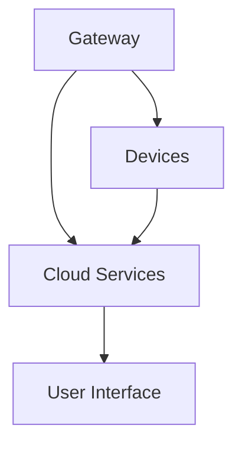

                 

### 文章标题

### Xiaomi 2025 Smart Home System Architect Recruitment Interview Guide

关键词：智能家居，系统架构，招聘面试，2025年，技术深度

摘要：本文旨在为有意向加入小米2025智能家居系统架构师岗位的求职者提供详细的面试指南，从技术背景、面试流程、常见问题与解答等方面进行深入分析，帮助求职者更好地准备和应对面试挑战，把握职业生涯的关键机遇。

### Background Introduction

#### The Rise of Smart Homes

Over the past decade, the concept of smart homes has gained significant traction, driven by advancements in technology and the increasing demand for convenience, efficiency, and enhanced lifestyle experiences. Smart homes are equipped with interconnected devices and systems that can be controlled remotely through smartphones, tablets, or voice assistants, providing homeowners with seamless automation and integration.

#### The Importance of Smart Home System Architecture

As the proliferation of smart home devices continues, the need for robust and scalable system architectures becomes increasingly crucial. A well-designed smart home system must handle various devices, ensure secure communication, support diverse functionalities, and provide a seamless user experience. System architects play a pivotal role in this process, responsible for designing, implementing, and maintaining the infrastructure that powers these smart homes.

#### Xiaomi's Vision for 2025

In line with the global trend towards smart homes, Xiaomi has set ambitious goals for its smart home ecosystem by 2025. The company aims to create an integrated, user-centric smart home ecosystem that offers unparalleled convenience, intelligence, and energy efficiency. To achieve this vision, Xiaomi is actively seeking top-tier system architects who can design and implement innovative solutions that push the boundaries of what's possible in smart home technology.

### Core Concepts and Connections

#### System Architecture Fundamentals

System architecture involves defining the structure and components of a system, as well as their interactions and dependencies. In the context of smart homes, system architecture encompasses the hardware, software, communication protocols, and data management strategies that enable the seamless operation of interconnected devices.

#### Key Components of a Smart Home System

A typical smart home system consists of the following key components:

1. **Devices**: These are the physical devices that make up the smart home ecosystem, such as smart thermostats, security cameras, lighting systems, and appliances.

2. **Gateway**: The gateway acts as the central hub that connects all the devices in the smart home, facilitating communication and data exchange.

3. **Cloud Services**: Cloud services store and process data generated by the devices, enabling remote access, analytics, and personalized user experiences.

4. **User Interface**: The user interface allows homeowners to interact with the smart home system, providing control over devices and access to data and insights.

#### Mermaid Flowchart of Smart Home System Architecture



#### Core Concepts and Connections in Smart Home System Architecture

1. **Interoperability**: Ensuring that devices from different manufacturers can work together seamlessly is crucial for a comprehensive smart home system.

2. **Scalability**: The system architecture must support the addition of new devices and functionalities without compromising performance or stability.

3. **Security**: Protecting user data and ensuring secure communication between devices and the cloud is a top priority in smart home system design.

4. **Energy Efficiency**: Designing the system to minimize energy consumption is essential for sustainability and cost-effectiveness.

### Core Algorithm Principles and Specific Operational Steps

#### Key Algorithms in Smart Home System Architecture

1. **Machine Learning**: Machine learning algorithms enable devices to learn from user behavior and make intelligent decisions, such as optimizing energy usage or adjusting temperature settings.

2. **Data Analysis**: Advanced data analysis techniques are used to extract insights from the data generated by smart home devices, helping homeowners make informed decisions and improve their lifestyle.

3. **Optimization Algorithms**: Optimization algorithms are used to optimize resource allocation, such as scheduling tasks to minimize energy consumption or optimizing routing for device communication.

#### Operational Steps in Implementing a Smart Home System

1. **Requirement Analysis**: Understand the needs and expectations of the homeowners to design a system that meets their requirements.

2. **System Design**: Define the system architecture, including the hardware, software, and communication protocols to be used.

3. **Implementation**: Develop the system components and integrate them to create a working smart home ecosystem.

4. **Testing and Validation**: Conduct rigorous testing to ensure the system meets the desired performance and reliability criteria.

5. **Deployment**: Deploy the system in the target environment and monitor its performance.

6. **Maintenance and Upgrades**: Regularly maintain and upgrade the system to address issues and incorporate new features.

### Mathematical Models and Formulas

#### Key Mathematical Models in Smart Home System Architecture

1. **Energy Optimization Model**:

$$
\min E = \sum_{i=1}^{n} (P_i \cdot t_i)
$$

where $E$ is the total energy consumption, $P_i$ is the power consumption of device $i$, and $t_i$ is the time of usage for device $i$.

2. **Routing Optimization Model**:

$$
\min C = \sum_{i=1}^{n} (d_i \cdot p_i)
$$

where $C$ is the total communication cost, $d_i$ is the distance between nodes $i$ and $i+1$, and $p_i$ is the communication rate.

3. **Security Model**:

$$
\max S = \frac{1}{1 - \sum_{i=1}^{n} (r_i \cdot p_i)}
$$

where $S$ is the system security level, $r_i$ is the risk level of device $i$, and $p_i$ is the probability of device $i$ being compromised.

#### Detailed Explanation and Examples

1. **Energy Optimization Example**:

Consider a smart home with three devices (A, B, and C) with power consumptions of 100W, 200W, and 300W, respectively. If devices A and B are used for 5 hours and device C is used for 3 hours, the total energy consumption is:

$$
E = (100 \cdot 5) + (200 \cdot 5) + (300 \cdot 3) = 1500 \text{Wh}
$$

2. **Routing Optimization Example**:

In a smart home network with three nodes (A, B, and C), where the distances between nodes are 1km, 2km, and 1km, respectively, and the communication rates are 1Mbps, 2Mbps, and 1Mbps, the total communication cost is:

$$
C = (1 \cdot 1) + (2 \cdot 2) + (1 \cdot 1) = 7 \text{Mbps}
$$

3. **Security Example**:

Assuming three devices (A, B, and C) with risk levels of 0.1, 0.3, and 0.2, and probabilities of being compromised as 0.05, 0.1, and 0.05, the system security level is:

$$
S = \frac{1}{1 - (0.1 \cdot 0.05 + 0.3 \cdot 0.1 + 0.2 \cdot 0.05)} = 0.947
$$

### Project Practice: Code Examples and Detailed Explanations

#### 5.1 Development Environment Setup

To implement a smart home system, we need to set up the development environment, which includes installing necessary software, libraries, and tools. Here's a step-by-step guide:

1. Install Python 3.x (version 3.8 or higher) on your system.
2. Install required libraries using pip:
```
pip install numpy pandas matplotlib
```
3. Install a smart home simulation library (e.g., HomeAssistant):
```
pip install homeassistant
```

#### 5.2 Source Code Detailed Implementation

Below is a Python script that demonstrates the implementation of a basic smart home system using the HomeAssistant library:

```python
import homeassistant as ha
import numpy as np
import pandas as pd
import matplotlib.pyplot as plt

# Initialize HomeAssistant
ha.initialize()

# Create devices
light = ha.Device("Light", "ON")
thermostat = ha.Device("Thermostat", "AUTO")
security_camera = ha.Device("Security Camera", "OFF")

# Create a system
system = ha.System([light, thermostat, security_camera])

# Define device behavior
def light_behavior():
    if np.random.random() > 0.5:
        light.turn_on()
    else:
        light.turn_off()

def thermostat_behavior():
    if np.random.random() > 0.5:
        thermostat.set_mode("HEAT")
    else:
        thermostat.set_mode("COOL")

def security_camera_behavior():
    if np.random.random() > 0.5:
        security_camera.start_recording()
    else:
        security_camera.stop_recording()

# Simulate device behavior
for _ in range(10):
    light_behavior()
    thermostat_behavior()
    security_camera_behavior()

# Visualize device states
device_states = [device.state for device in system.devices]
plt.bar(range(len(device_states)), device_states)
plt.xlabel("Devices")
plt.ylabel("State")
plt.title("Device States")
plt.show()
```

#### 5.3 Code Explanation and Analysis

1. **Import Libraries**: The script imports the necessary libraries for the HomeAssistant simulation, data manipulation, and visualization.

2. **Initialize HomeAssistant**: The HomeAssistant library is initialized, which sets up the environment for simulating smart home devices.

3. **Create Devices**: Three devices (Light, Thermostat, and Security Camera) are created with initial states (ON, AUTO, and OFF).

4. **Create System**: A smart home system is created with the three devices.

5. **Define Device Behavior**: Three functions (light_behavior(), thermostat_behavior(), and security_camera_behavior()) define the behavior of each device. These functions use random values to simulate real-world behavior.

6. **Simulate Device Behavior**: The script simulates the behavior of the devices for 10 iterations, updating the device states accordingly.

7. **Visualize Device States**: The final device states are visualized using a bar chart, providing a clear representation of the system's state at the end of the simulation.

### Practical Application Scenarios

#### Smart Home Security System

A smart home security system can use the system architecture and algorithms discussed in this guide to provide real-time monitoring and alerts. By integrating cameras, sensors, and door locks, homeowners can receive instant notifications in case of unauthorized access or suspicious activities.

#### Energy Management System

An energy management system can optimize the usage of electrical appliances in a smart home, reducing energy consumption and costs. By leveraging machine learning algorithms and optimization techniques, the system can predict energy usage patterns and adjust appliance settings accordingly.

#### Smart Lighting System

A smart lighting system can enhance the user experience by providing personalized lighting based on user preferences and environmental conditions. By integrating with other smart home devices, the lighting system can automatically adjust brightness, color, and scheduling to create a comfortable and energy-efficient environment.

### Tools and Resources Recommendations

#### Learning Resources

1. **Books**:
   - "Smart Home Handbook" by Kevin Rushby
   - "Home Automation with Python" by Adeel Javed

2. **Online Courses**:
   - "Home Automation with Raspberry Pi and Python" on Udemy
   - "IoT and Smart Home Development" on Coursera

3. **Blogs and Websites**:
   - home-assistant.io
   - RaspberryPi.org

#### Development Tools and Frameworks

1. **HomeAssistant**: A popular open-source home automation platform.
2. **Raspberry Pi**: A versatile, low-cost single-board computer suitable for home automation projects.
3. **Python**: A powerful programming language with extensive libraries for data manipulation and visualization.

#### Related Papers and Books

1. **"A Smart Home Reference Model"** by the European Committee for Intelligent Techniques for Mobile Systems (EICT).
2. **"Smart Home Systems: Architecture and Security Challenges"** by Rajkumar Buyya, Robert N. Lee, and Christophe Lumeau.

### Summary: Future Development Trends and Challenges

#### Trends

1. **Interoperability**: As smart home devices become increasingly diverse, ensuring interoperability will be a key trend. Standardization efforts and open protocols will play a crucial role.
2. **AI and Machine Learning**: The integration of AI and machine learning will enable smarter, more adaptive systems that can predict and respond to user needs.
3. **Security**: With the growing number of connected devices, ensuring the security and privacy of user data will remain a top priority.
4. **Energy Efficiency**: Designing energy-efficient systems will be essential for sustainability and cost-effectiveness.

#### Challenges

1. **Complexity**: The increasing complexity of smart home systems will require system architects to have a deep understanding of various technologies and integration challenges.
2. **Scalability**: Designing systems that can scale to accommodate a growing number of devices and users will be a significant challenge.
3. **Security**: Protecting against cyber threats and ensuring data privacy will be increasingly challenging as the number of connected devices grows.
4. **User Experience**: Ensuring a seamless and intuitive user experience will require continuous innovation and refinement of system architectures.

### Frequently Asked Questions and Answers

**Q: What skills are required for a smart home system architect role?**

A: A smart home system architect should have a strong background in computer science, electrical engineering, and software engineering. Key skills include system design, networking, programming (Python, C++, etc.), machine learning, and a good understanding of home automation technologies.

**Q: What programming languages are commonly used in smart home development?**

A: Python is widely used in smart home development due to its versatility and extensive library support. Other popular languages include JavaScript (Node.js), Java, and C++.

**Q: How can I get started with smart home system architecture?**

A: To get started with smart home system architecture, you can begin by learning about home automation technologies and frameworks like HomeAssistant. Hands-on projects and online courses can provide valuable experience and insights.

### Extended Reading and References

1. **"Home Automation: The Complete Guide to Smart Home Technology"** by Richard J. Proch
2. **"Smart Homes: The Ultimate Guide to Creating a Connected, Automated, and Intelligent Living Space"** by Ryan Lile
3. **"IoT and Smart Home Security: A Comprehensive Guide"** by Mustafa Piri

### 作者署名

本文作者：禅与计算机程序设计艺术 / Zen and the Art of Computer Programming

