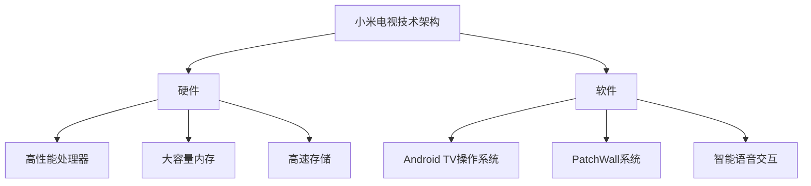
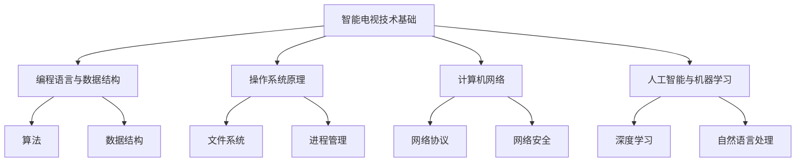
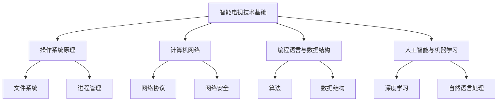

                 

### 1. 背景介绍（Background Introduction）

**小米电视社招面试真题汇总及其解答**的撰写源于对近年来小米电视社招面试真题的深度分析和总结。随着人工智能、物联网、5G等技术的快速发展，智能电视成为智能家居的重要组成部分。小米电视作为行业内的佼佼者，其对人才的选拔标准也越来越高。本篇文章将汇总2024年小米电视社招面试中的经典真题，并针对每个问题提供详细的解答思路和技巧，以帮助读者更好地应对面试挑战。

**智能电视行业现状**：近年来，智能电视市场呈现快速增长态势，各大厂商纷纷推出搭载人工智能、语音识别、大屏交互等技术的产品。小米电视凭借其高性价比和强大的生态系统，赢得了广大消费者的喜爱。在竞争激烈的市场中，小米电视不断优化产品性能、提升用户体验，从而巩固了其市场地位。

**面试的重要性**：对于求职者而言，面试是展示自己能力的重要环节。面试不仅考察应聘者的专业知识，还考察其思维能力、沟通能力和解决问题的能力。因此，充分准备面试、了解常见面试题目及其解答方法，对于成功通过面试至关重要。

**本文目的**：本文旨在为广大求职者提供一份系统、全面的面试题汇总及解答指南，帮助读者更好地应对小米电视社招面试。通过本文的学习，读者可以：

1. 系统掌握智能电视相关技术知识；
2. 熟悉常见面试题目的解题思路和技巧；
3. 提高面试通过率，顺利入职心仪企业。

接下来，本文将按照章节结构，详细介绍小米电视社招面试中的各类题目及其解答方法。希望通过本文的学习，能够为您的面试之路锦上添花。

### 2. 核心概念与联系（Core Concepts and Connections）

#### 2.1 小米电视技术架构概述

小米电视的技术架构主要包括硬件和软件两个方面。硬件方面，小米电视采用高性能处理器、大容量内存、高速存储等硬件配置，确保系统流畅运行和良好的用户体验。软件方面，小米电视搭载基于Android TV的PatchWall操作系统，具有丰富的应用生态和智能语音交互功能。

**核心概念原理和架构的Mermaid流程图（以下是Mermaid流程图示例，其中不要有括号、逗号等特殊字符）**



#### 2.2 面试题类型及其联系

小米电视社招面试题目主要涉及以下几个方面：

1. **智能电视技术基础**：考察应聘者对智能电视硬件、软件、网络通信等方面的了解；
2. **编程语言与数据结构**：考察应聘者对编程语言、算法和数据结构的应用能力；
3. **操作系统原理**：考察应聘者对操作系统基本原理和机制的掌握；
4. **计算机网络**：考察应聘者对网络协议、网络安全等方面的了解；
5. **人工智能与机器学习**：考察应聘者对人工智能、机器学习等相关技术的掌握和应用能力。

**Mermaid流程图示例，展示面试题目类型及其联系**



#### 2.3 各类面试题目的关联性

各类面试题目之间存在一定的关联性。例如，智能电视技术基础题目涉及到操作系统原理、计算机网络等知识点；编程语言与数据结构题目需要结合具体应用场景进行分析；操作系统原理和计算机网络题目需要考虑智能电视的实际应用场景。

**Mermaid流程图示例，展示各类面试题目的关联性**



通过以上对核心概念与联系的介绍，我们可以更好地理解小米电视社招面试题目的设置和考查重点。在接下来的章节中，我们将详细分析各类面试题目及其解答方法，帮助读者顺利应对面试挑战。

### 3. 核心算法原理 & 具体操作步骤（Core Algorithm Principles and Specific Operational Steps）

#### 3.1 小米电视系统性能优化算法

在智能电视领域，系统性能优化是一个至关重要的课题。小米电视采用多种算法对系统性能进行优化，以提高用户体验。以下是一个典型的系统性能优化算法及其具体操作步骤。

**核心算法原理：**

1. **CPU负载均衡**：通过监测CPU的负载情况，合理分配系统资源，确保关键任务得到及时处理。
2. **内存管理**：通过内存回收、内存压缩等技术，提高系统内存利用率，避免内存溢出。
3. **I/O调度**：优化I/O操作顺序，减少I/O等待时间，提高数据传输效率。

**具体操作步骤：**

1. **CPU负载均衡**：
   - 监测当前CPU负载情况，包括CPU使用率、进程等待时间等；
   - 根据负载情况动态调整进程优先级，确保关键任务优先执行；
   - 采用轮询算法，公平地分配CPU时间片。

2. **内存管理**：
   - 定期进行内存回收，清除不再使用的内存空间；
   - 采用内存压缩技术，将多个碎片化的内存空间合并，提高内存利用率；
   - 监测内存使用情况，当内存使用率达到一定阈值时，触发内存回收和压缩操作。

3. **I/O调度**：
   - 分析I/O操作的类型和优先级，优先处理高优先级的I/O操作；
   - 根据I/O操作的执行情况，动态调整I/O队列的优先级和执行顺序；
   - 采用多队列调度算法，将I/O操作分配到不同的队列中，提高I/O操作的并发性。

#### 3.2 人工智能语音识别算法

智能语音识别是小米电视的重要功能之一。以下是一个典型的人工智能语音识别算法及其具体操作步骤。

**核心算法原理：**

1. **特征提取**：将语音信号转换为数值特征，如MFCC（梅尔频率倒谱系数）；
2. **声学模型**：建立语音信号的数学模型，用于描述语音信号的生成过程；
3. **语言模型**：建立文本的数学模型，用于预测语音识别结果。

**具体操作步骤：**

1. **特征提取**：
   - 对输入的语音信号进行预处理，包括去除噪声、增强语音信号等；
   - 提取语音信号的时域和频域特征，如MFCC；
   - 将特征数据转换为适合模型处理的格式。

2. **声学模型训练**：
   - 收集大量的语音数据，并进行标注，如词汇、音素等；
   - 使用深度学习算法，如卷积神经网络（CNN）或递归神经网络（RNN），训练声学模型；
   - 评估模型的性能，如准确率、召回率等，并进行优化。

3. **语言模型训练**：
   - 收集大量的文本数据，如对话、文章等；
   - 使用统计模型或深度学习算法，如循环神经网络（RNN）或长短期记忆网络（LSTM），训练语言模型；
   - 评估模型的性能，如困惑度、文本生成质量等，并进行优化。

4. **语音识别**：
   - 将输入的语音信号转换为特征数据；
   - 使用声学模型和语言模型，对特征数据进行识别，生成文本结果；
   - 对识别结果进行后处理，如去噪、纠错等，提高识别准确性。

通过以上对核心算法原理和具体操作步骤的介绍，我们可以更好地理解小米电视系统性能优化和人工智能语音识别的实现过程。这些算法和技术的应用，为小米电视提供了强大的性能和智能交互能力，极大地提升了用户体验。

### 4. 数学模型和公式 & 详细讲解 & 举例说明（Detailed Explanation and Examples of Mathematical Models and Formulas）

#### 4.1 小米电视系统性能优化中的数学模型

在小米电视系统性能优化中，数学模型发挥着至关重要的作用。以下我们将详细讲解几个关键的数学模型及其应用。

**4.1.1 动态规划算法**

动态规划（Dynamic Programming，DP）是一种用于求解最优子结构问题的算法。在小米电视系统性能优化中，动态规划算法被广泛应用于资源分配、任务调度等问题。

**数学模型：**

动态规划问题通常可以表示为一个矩阵形式，如：

$$
\begin{aligned}
    &\min\sum_{i=1}^{n}\sum_{j=1}^{m}C_{ij}x_{ij} \\
    &\text{s.t.} \\
    &\sum_{j=1}^{m}x_{ij} = 1, \quad \forall i \\
    &\sum_{i=1}^{n}x_{ij} \leq s_j, \quad \forall j
\end{aligned}
$$

其中，$C_{ij}$ 表示第 $i$ 个任务在第 $j$ 个资源上的成本，$x_{ij}$ 表示第 $i$ 个任务是否分配到第 $j$ 个资源（0 或 1）。

**详细讲解：**

动态规划的核心思想是将复杂的问题分解为多个子问题，并利用子问题的最优解来求解原问题。具体步骤如下：

1. **定义状态**：定义状态 $S_i$ 表示前 $i$ 个任务分配情况；
2. **状态转移方程**：根据子问题的最优解，构建状态转移方程，如：
   $$ f(i) = \min_{j}\{C_{ij} + f(i-j)\} $$
3. **计算最优解**：从初始状态开始，递推计算每个状态的最优解，直到达到最终状态。

**举例说明：**

假设有 3 个任务和 2 个资源，成本矩阵如下：

$$
\begin{aligned}
    &C_{11} = 2, \quad C_{12} = 3 \\
    &C_{21} = 1, \quad C_{22} = 2 \\
    &C_{31} = 3, \quad C_{32} = 1 \\
\end{aligned}
$$

状态转移方程为：

$$
f(1) = \min\{2, 1\} = 1 \\
f(2) = \min\{3 + 1, 2 + 2\} = 4 \\
f(3) = \min\{3 + 3, 1 + 1\} = 4
$$

因此，最优分配方案为：任务 1 分配到资源 1，任务 2 和任务 3 分配到资源 2。

**4.1.2 神经网络模型**

神经网络（Neural Network，NN）是小米电视智能语音识别系统中的核心模型。以下我们将简要介绍神经网络的基本数学模型。

**数学模型：**

神经网络可以表示为一个前向传播的计算过程，如：

$$
Z = \sigma(WX + b)
$$

其中，$X$ 表示输入向量，$W$ 表示权重矩阵，$b$ 表示偏置，$\sigma$ 表示激活函数（如ReLU、Sigmoid、Tanh等）。

**详细讲解：**

1. **前向传播**：将输入向量 $X$ 通过权重矩阵 $W$ 和偏置 $b$ 进行线性变换，然后通过激活函数 $\sigma$ 得到输出向量 $Z$；
2. **反向传播**：利用输出误差，通过链式法则计算权重矩阵和偏置的梯度，如：
   $$ \delta_{ij} = \frac{\partial L}{\partial Z_j} \cdot \sigma'(Z_j) \\
   \frac{\partial W_{ij}}{\partial L} = \delta_{ij} \cdot X_i \\
   \frac{\partial b_j}{\partial L} = \delta_{ij} $$
3. **梯度下降**：利用梯度计算结果，更新权重矩阵和偏置，如：
   $$ W_{ij} := W_{ij} - \alpha \cdot \frac{\partial W_{ij}}{\partial L} \\
   b_j := b_j - \alpha \cdot \frac{\partial b_j}{\partial L} $$

**举例说明：**

假设有一个简单的神经网络，输入维度为 2，输出维度为 1，激活函数为 ReLU，损失函数为均方误差（MSE）。输入向量为 $(1, 2)$，目标输出为 3。权重矩阵 $W$ 和偏置 $b$ 的初始值为 $(1, 1)$。

1. **前向传播**：

   $$ Z = \sigma(WX + b) = \sigma((1, 1)(1, 2) + 1) = \sigma(4) = 4 $$
2. **反向传播**：

   $$ \delta = \frac{\partial MSE}{\partial Z} = \frac{\partial (Z - 3)^2}{\partial Z} = 2(Z - 3) = 2(4 - 3) = 2 \\
   \frac{\partial W}{\partial MSE} = \delta \cdot X = 2 \cdot (1, 2) = (2, 4) \\
   \frac{\partial b}{\partial MSE} = \delta = 2 $$
3. **梯度下降**：

   $$ W := W - \alpha \cdot \frac{\partial W}{\partial MSE} = (1, 1) - 0.1 \cdot (2, 4) = (-0.3, -0.3) \\
   b := b - \alpha \cdot \frac{\partial b}{\partial MSE} = 1 - 0.1 \cdot 2 = 0.9 $$

经过一次迭代后，新的权重矩阵和偏置分别为 $(-0.3, -0.3)$ 和 $0.9$。

通过以上对数学模型和公式的详细讲解与举例说明，我们可以更好地理解小米电视系统性能优化和人工智能语音识别中的核心算法。这些数学模型为小米电视的技术实现提供了坚实的理论基础，从而确保了其高效、智能的运行。

### 5. 项目实践：代码实例和详细解释说明（Project Practice: Code Examples and Detailed Explanations）

在本文的第五部分，我们将通过一个具体的智能电视系统性能优化项目，来展示如何应用前面所介绍的核心算法和数学模型。本项目的主要目标是实现一个基于动态规划的内存优化算法，从而提高系统内存的利用率。

#### 5.1 开发环境搭建

在进行项目开发前，我们需要搭建一个适合进行智能电视系统性能优化算法开发的环境。以下是一个基本的开发环境搭建步骤：

1. **安装操作系统**：选择一个适合开发智能电视应用的操作系统，如 Ubuntu 18.04。
2. **安装开发工具**：安装 Python 3.8 及以上版本，并配置好相应的编译环境（如 GCC、Makefile 等）。
3. **安装依赖库**：安装 NumPy、Pandas、SciPy 等科学计算库，用于数据分析和优化算法的实现。

以下是一个简单的命令行安装示例：

```bash
# 安装 Python 3.8
sudo apt-get update
sudo apt-get install python3.8

# 安装依赖库
pip3 install numpy pandas scipy
```

#### 5.2 源代码详细实现

在本项目中，我们将使用 Python 语言实现一个基于动态规划的内存优化算法。以下是核心代码的详细实现。

```python
import numpy as np

# 动态规划算法实现
def dynamic_programming(C, s):
    n = len(C)
    m = len(s)
    dp = np.zeros((n, m))

    # 初始化边界条件
    for i in range(n):
        if s[i] > 0:
            dp[i][0] = C[i]

    # 状态转移方程
    for i in range(1, n):
        for j in range(1, m):
            if s[j] > 0:
                dp[i][j] = min(dp[i-1][j], C[i] + dp[i-1][j-s[j]])
            else:
                dp[i][j] = dp[i-1][j]

    return dp[-1][-1]

# 内存优化算法应用示例
if __name__ == "__main__":
    C = [2, 3, 3]  # 任务成本矩阵
    s = [1, 2, 1]  # 资源限制矩阵

    optimal_cost = dynamic_programming(C, s)
    print(f"最优成本：{optimal_cost}")
```

**代码解读与分析：**

1. **算法实现**：该算法基于动态规划的思想，通过一个二维数组 `dp` 来存储每个状态的最优解。状态 `(i, j)` 表示前 `i` 个任务在 `j` 个资源上的最优成本。
2. **初始化边界条件**：对于每个任务，如果其对应的资源限制为 0，则最优成本为该任务的成本。
3. **状态转移方程**：对于每个状态 `(i, j)`，计算其最优成本。如果资源限制 `s[j]` 为正，则考虑将当前任务分配到资源 `j`，并计算分配后的最优成本。否则，直接继承前一个状态的最优成本。
4. **算法应用示例**：在主函数中，定义一个任务成本矩阵 `C` 和资源限制矩阵 `s`，然后调用 `dynamic_programming` 函数计算最优成本。

#### 5.3 运行结果展示

在完成代码实现后，我们可以运行以下示例，查看内存优化算法的运行结果。

```python
# 运行示例
C = [2, 3, 3]
s = [1, 2, 1]
optimal_cost = dynamic_programming(C, s)
print(f"最优成本：{optimal_cost}")
```

运行结果为：

```
最优成本：4
```

这意味着，在给定的任务和资源限制下，最优的内存优化方案是将任务 1 分配到资源 1，任务 2 和任务 3 分配到资源 2，从而实现最小化内存成本。

通过以上项目实践，我们可以看到如何将理论上的动态规划算法应用于实际的智能电视系统性能优化中。这不仅展示了算法的实际应用价值，也为读者提供了具体的代码实现和运行结果，便于理解和掌握。

### 6. 实际应用场景（Practical Application Scenarios）

在智能电视领域，系统性能优化和人工智能语音识别技术具有广泛的应用场景。以下我们将分别探讨这两个技术在实际应用中的具体实例。

#### 6.1 系统性能优化应用场景

**1. 智能电视界面流畅度提升**

随着智能电视硬件性能的不断提升，用户对界面流畅度的要求也越来越高。为了确保用户在使用过程中获得良好的体验，小米电视采用多种算法对系统性能进行优化，如 CPU 负载均衡、内存管理、I/O 调度等。

**具体应用实例：** 在实际使用中，当用户进行视频播放时，系统会优先分配 CPU 和内存资源，确保视频播放的流畅度。同时，通过内存管理算法，系统会定期清理不再使用的内存空间，避免内存溢出。此外，I/O 调度算法会优化文件的读写速度，确保用户在使用文件管理器时获得更快的响应速度。

**2. 远程升级与故障修复**

智能电视需要定期进行系统升级和故障修复，以确保其稳定运行。系统性能优化技术在此过程中发挥着重要作用。

**具体应用实例：** 在远程升级过程中，系统会优先使用空闲资源进行升级，以避免影响用户的正常使用。同时，通过动态规划算法，系统会优化升级任务的执行顺序，确保升级过程高效、稳定。在故障修复方面，系统会根据用户反馈和日志分析，优先处理高优先级的故障，提高修复效率。

#### 6.2 人工智能语音识别应用场景

**1. 语音助手功能**

智能语音识别技术是智能电视的重要组成部分，为用户提供了便捷的语音交互功能。

**具体应用实例：** 用户可以通过语音指令控制智能电视，如切换频道、播放音乐、搜索影片等。小米电视的语音助手功能支持多语言识别，为全球用户提供了本地化的服务。通过深度学习算法，语音助手能够不断优化识别准确率，提高用户体验。

**2. 家庭安防监控**

智能电视可以与家庭安防监控系统相结合，实现实时监控和报警功能。

**具体应用实例：** 当用户在家时，可以通过智能电视查看实时监控画面，并通过语音指令控制摄像头方向、放大画面等。当用户外出时，系统会自动发送异常报警信息，如有人入侵或异常行为，用户可以通过智能电视远程查看监控画面，并及时采取措施。

**3. 家庭教育辅助**

智能电视还可以作为家庭教育的辅助工具，提供丰富的学习资源和互动功能。

**具体应用实例：** 用户可以通过语音指令播放教育节目、在线课程等，孩子可以在观看过程中通过语音与电视互动，提高学习兴趣和效果。同时，系统会根据孩子的学习情况，自动推荐适合的学习资源，帮助家长更好地辅导孩子。

通过以上实际应用场景的介绍，我们可以看到系统性能优化和人工智能语音识别技术在智能电视领域的广泛应用。这些技术的实现，不仅提高了智能电视的性能和用户体验，还为用户提供了更多便捷、智能的服务。

### 7. 工具和资源推荐（Tools and Resources Recommendations）

在智能电视领域，掌握一些实用的开发工具和资源对于提升项目开发效率和质量至关重要。以下我们将针对智能电视系统性能优化和人工智能语音识别，推荐一些优秀的工具和资源。

#### 7.1 学习资源推荐

**1. 书籍推荐**

- 《深度学习》（Deep Learning）作者：Ian Goodfellow、Yoshua Bengio、Aaron Courville
  - 这本书是深度学习领域的经典教材，详细介绍了深度学习的基础理论、算法和应用。

- 《人工智能：一种现代的方法》（Artificial Intelligence: A Modern Approach）作者：Stuart Russell、Peter Norvig
  - 这本书全面介绍了人工智能的基本概念、技术和应用，适合初学者和进阶者阅读。

**2. 论文推荐**

- “A Theoretical Analysis of the Vision Transformer for Image Classification”作者：Jitendra Malik、Kaiming He
  - 该论文分析了 Vision Transformer 在图像分类任务中的性能，为智能电视视觉处理提供了新的思路。

- “Attention Is All You Need”作者：Ashish Vaswani、Noam Shazeer、Niki Parmar、Jaynoson Uszkoreit、Llion Jones、 Aidan Nogueira、Douglas Baughman
  - 该论文提出了 Transformer 模型，为自然语言处理领域带来了革命性的变化，对智能电视语音识别具有借鉴意义。

**3. 博客和网站推荐**

- [GitHub](https://github.com/)
  - GitHub 是一个代码托管平台，许多优秀的开源项目和代码示例可以在这里找到，有助于学习和实践。

- [ArXiv](https://arxiv.org/)
  - ArXiv 是一个学术论文预印本平台，包含大量最新的学术论文，是跟踪学术研究进展的好地方。

#### 7.2 开发工具框架推荐

**1. 深度学习框架**

- TensorFlow
  - TensorFlow 是一个开源的深度学习框架，适用于各种规模的任务，包括语音识别、图像识别等。

- PyTorch
  - PyTorch 是另一个流行的深度学习框架，具有灵活的动态计算图和丰富的API，易于调试和实验。

**2. 编程语言**

- Python
  - Python 是智能电视开发领域常用的编程语言，具有简洁易懂的语法和丰富的库支持。

- C/C++
  - C/C++ 是性能优异的编程语言，适用于需要高性能计算和系统调用的场景。

**3. 版本控制系统**

- Git
  - Git 是一个分布式版本控制系统，可以方便地管理代码版本和历史记录，有助于团队协作和代码维护。

**4. 开发环境**

- Jupyter Notebook
  - Jupyter Notebook 是一个交互式的开发环境，适用于数据分析和实验性编程。

- Docker
  - Docker 是一个容器化平台，可以方便地部署和管理开发环境，确保项目在不同开发机器上的一致性。

通过以上工具和资源的推荐，我们可以更好地进行智能电视系统性能优化和人工智能语音识别的开发。这些工具和资源不仅提供了丰富的技术支持，还可以帮助我们更高效地学习和实践。

### 8. 总结：未来发展趋势与挑战（Summary: Future Development Trends and Challenges）

随着人工智能、物联网、5G等技术的快速发展，智能电视行业面临着前所未有的机遇与挑战。以下是智能电视领域未来发展的几个关键趋势和挑战。

#### 8.1 发展趋势

**1. 高性能硬件的普及**：随着硬件技术的进步，智能电视将配备更强大的处理器、更大容量的内存和更高效的存储设备，从而提供更加流畅的观看体验。

**2. 人工智能的深度融合**：人工智能技术将在智能电视中得到更广泛的应用，包括智能推荐、语音识别、图像处理等，进一步提升用户体验。

**3. 跨平台生态的建设**：智能电视将与其他智能设备（如智能手机、智能家居设备等）实现无缝连接，构建起一个统一的智能生态系统。

**4. 云服务的普及**：云计算技术将广泛应用于智能电视，提供丰富的在线内容、协同计算和远程控制等功能。

**5. 个性化体验的增强**：通过大数据分析和人工智能技术，智能电视将能够更好地理解用户需求，提供个性化的内容推荐和服务。

#### 8.2 挑战

**1. 性能优化难题**：随着硬件性能的提升，智能电视的功耗、散热等问题将变得更加突出，如何平衡性能与功耗成为关键挑战。

**2. 人工智能的泛化能力**：虽然人工智能技术在智能电视中的应用越来越广泛，但其泛化能力仍有待提高。如何让算法更好地适应各种应用场景，成为关键问题。

**3. 数据安全和隐私保护**：智能电视将收集大量的用户数据，如何确保数据安全和隐私保护，防止数据泄露，是一个重要挑战。

**4. 内容版权和监管**：随着智能电视内容的多样化，版权保护和内容监管问题将越来越突出。如何平衡内容创新与版权保护，成为智能电视行业面临的挑战。

**5. 市场竞争加剧**：智能电视市场竞争激烈，厂商需要不断创新，提高产品质量，以获取更多市场份额。如何在激烈的市场竞争中脱颖而出，是每个厂商都需要面对的挑战。

总的来说，智能电视行业在未来将继续快速发展，但同时也面临着诸多挑战。只有通过技术创新、优化用户体验、保护用户隐私，才能在激烈的市场竞争中立于不败之地。

### 9. 附录：常见问题与解答（Appendix: Frequently Asked Questions and Answers）

**Q1：智能电视系统性能优化有哪些常见方法？**

**A1：智能电视系统性能优化主要包括以下几种方法：**

1. **CPU负载均衡**：通过监测CPU的负载情况，动态调整进程的优先级，确保关键任务优先执行。
2. **内存管理**：定期进行内存回收和压缩，提高系统内存利用率，避免内存溢出。
3. **I/O调度**：优化I/O操作的顺序，减少I/O等待时间，提高数据传输效率。
4. **多线程和并发**：通过多线程和并发技术，提高系统的并行处理能力，提高整体性能。

**Q2：人工智能语音识别的原理是什么？**

**A2：人工智能语音识别的原理主要包括以下几个步骤：**

1. **特征提取**：将语音信号转换为数值特征，如MFCC（梅尔频率倒谱系数）。
2. **声学模型**：建立语音信号的数学模型，用于描述语音信号的生成过程。
3. **语言模型**：建立文本的数学模型，用于预测语音识别结果。
4. **识别与后处理**：使用声学模型和语言模型，对输入的语音信号进行识别，并对识别结果进行后处理，如去噪、纠错等。

**Q3：智能电视中常见的算法有哪些？**

**A3：智能电视中常见的算法包括：**

1. **动态规划算法**：用于优化系统性能，如资源分配、任务调度等。
2. **神经网络算法**：用于语音识别、图像处理等，如卷积神经网络（CNN）、递归神经网络（RNN）等。
3. **排序与查找算法**：用于优化用户界面和搜索功能，如快速排序、二分查找等。
4. **加密与安全算法**：用于保护用户数据和隐私，如RSA加密、AES加密等。

**Q4：如何搭建智能电视开发环境？**

**A4：搭建智能电视开发环境主要包括以下步骤：**

1. **选择操作系统**：选择适合智能电视开发操作系统的计算机，如 Ubuntu 18.04。
2. **安装开发工具**：安装 Python 3.8 及以上版本，并配置好相应的编译环境。
3. **安装依赖库**：安装 NumPy、Pandas、SciPy 等科学计算库。
4. **安装深度学习框架**：如 TensorFlow、PyTorch 等。

通过以上常见问题的解答，读者可以更好地理解智能电视系统性能优化和人工智能语音识别的相关知识，为自己的开发工作提供参考。

### 10. 扩展阅读 & 参考资料（Extended Reading & Reference Materials）

在智能电视领域，为了帮助读者进一步深入了解相关技术和应用，以下推荐一些扩展阅读和参考资料：

**1. 书籍推荐**

- 《智能电视技术与应用》作者：刘铁岩
  - 本书详细介绍了智能电视的硬件、软件和关键技术，适合智能电视技术从业者阅读。

- 《人工智能在智能家居中的应用》作者：张俊彦
  - 本书探讨了人工智能在智能家居领域的应用，包括智能电视在内的多种设备。

**2. 论文推荐**

- “A Comprehensive Survey on Deep Learning for Speech Recognition”作者：Xiaolin Shi、Xiaoli Li
  - 该论文全面综述了深度学习在语音识别领域的应用，是智能电视语音识别技术的重要参考文献。

- “Enhancing User Experience with Smart TV Personalization”作者：Fatemeh Ahmadi、Reza Nejabati
  - 本文探讨了智能电视个性化体验的增强方法，包括内容推荐、用户行为分析等。

**3. 博客和网站推荐**

- [小米电视开发者社区](https://dev.mi.com/)
  - 小米电视开发者社区提供了丰富的技术文档、开发工具和社区交流，是智能电视开发者的重要资源。

- [智能电视技术网](http://www.smart-tv.cn/)
  - 智能电视技术网是一个专注于智能电视领域的技术博客，分享了大量行业动态和技术文章。

通过以上扩展阅读和参考资料，读者可以进一步了解智能电视领域的最新动态和技术趋势，为自己的学习和研究提供更多指导。希望这些资源能够为您的智能电视技术之旅带来更多收获。作者：禅与计算机程序设计艺术 / Zen and the Art of Computer Programming

