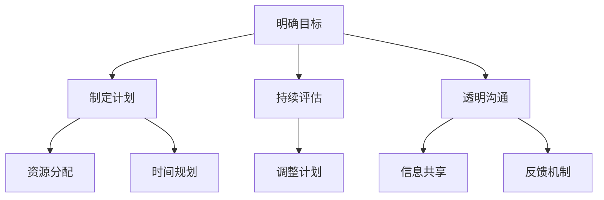

                 

# 巴菲特目标管理法则的团队应用

## 摘要

本文探讨了沃伦·巴菲特的目标管理法则如何应用于团队管理中。通过详细分析其核心原则，我们揭示了如何在团队中建立明确的目标、制定合理的计划和实施有效的监控，从而提高团队的协作效率和达成率。文章不仅为管理者提供了实用的工具和方法，也为团队成员指明了如何在工作中实现个人和团队目标。

## 1. 背景介绍（Background Introduction）

### 1.1 沃伦·巴菲特及其目标管理法则

沃伦·巴菲特是美国著名的投资家，被誉为“股神”。他的投资哲学和管理理念在全球范围内产生了深远的影响。巴菲特的成功不仅在于他的投资技巧，更在于他对目标管理的深刻理解和应用。

巴菲特的目标管理法则主要包括以下几点：

- **明确的目标**：确定明确且可衡量的目标，使团队成员清楚地了解他们的任务和职责。
- **持续的评估**：定期评估目标的进展情况，及时调整计划和资源分配。
- **透明和开放的沟通**：建立透明的沟通机制，使团队成员能够了解整个团队的目标和进展。
- **合理的计划**：制定详细的计划，确保每个成员都知道自己的角色和责任。

### 1.2 团队管理中的目标管理

在团队管理中，目标管理法则具有至关重要的作用。一个有效的目标管理过程可以帮助团队：

- 提高协作效率，减少内耗。
- 明确团队成员的职责和期望，提高工作满意度。
- 提升团队的执行力和达成率。

## 2. 核心概念与联系（Core Concepts and Connections）

### 2.1 目标管理法则的核心概念

巴菲特的目标管理法则包含以下核心概念：

#### **明确的目标**

明确的目标是目标管理的第一步。它要求团队成员对他们的任务和期望有清晰的认识。一个明确的目标通常具有以下特点：

- **具体性**：目标应当具体，明确描述要达成的成果。
- **可衡量性**：目标应当能够量化，以便评估进展和成果。
- **可实现性**：目标应当是可实现的，避免过于理想化。

#### **持续的评估**

持续的评估是目标管理的关键环节。它帮助团队：

- **及时调整计划**：根据评估结果，及时调整资源和计划，以更好地达成目标。
- **发现潜在问题**：通过评估，可以发现和解决可能影响目标达成的潜在问题。

#### **透明和开放的沟通**

透明和开放的沟通是团队协作的基础。它要求：

- **信息共享**：团队成员之间共享关键信息和资源。
- **反馈机制**：建立有效的反馈机制，鼓励团队成员表达意见和提出建议。

#### **合理的计划**

合理的计划是目标管理的基础。它包括：

- **资源分配**：合理分配人力、物力和财力等资源。
- **时间规划**：制定详细的进度表，确保任务按时完成。

### 2.2 Mermaid 流程图



## 3. 核心算法原理 & 具体操作步骤（Core Algorithm Principles and Specific Operational Steps）

### 3.1 确定目标

#### 3.1.1 自我评估

- **了解个人优势**：分析个人的技能、经验和兴趣，确定能够在团队中发挥优势的目标。
- **设定目标**：根据团队的需求和个人的优势，设定具体的、可衡量的目标。

#### 3.1.2 团队协作

- **团队讨论**：团队成员共同讨论并确定团队的整体目标。
- **个体目标与团队目标的对齐**：确保每个成员的目标与团队目标一致。

### 3.2 制定计划

#### 3.2.1 资源评估

- **评估现有资源**：分析团队现有的人力、物力和财力资源。
- **补充资源需求**：根据目标，确定需要补充的资源，如人员、设备和资金。

#### 3.2.2 时间规划

- **分解任务**：将大目标分解为一系列小任务，确保每个任务都有明确的时间表。
- **制定时间表**：为每个任务制定详细的时间规划，包括起始时间和截止时间。

### 3.3 持续评估

#### 3.3.1 进度跟踪

- **实时监控**：通过监控工具实时跟踪任务的进展情况。
- **定期汇报**：定期向团队汇报任务的进展，确保所有成员都对当前状态有清晰的认识。

#### 3.3.2 问题解决

- **识别问题**：在评估过程中，识别可能影响目标达成的潜在问题。
- **解决问题**：针对发现的问题，制定解决方案并实施。

### 3.4 透明和开放的沟通

#### 3.4.1 信息共享

- **公开会议**：定期组织公开会议，分享关键信息和进展。
- **透明报告**：定期发布透明报告，让所有成员了解团队的整体状态。

#### 3.4.2 反馈机制

- **建立反馈渠道**：鼓励团队成员提出意见和建议。
- **及时反馈**：对成员的建议和反馈给予及时回应和反馈。

## 4. 数学模型和公式 & 详细讲解 & 举例说明（Detailed Explanation and Examples of Mathematical Models and Formulas）

### 4.1 目标达成率的计算

目标达成率可以用以下公式表示：

$$
目标达成率 = \frac{实际达成目标数}{计划目标总数}
$$

#### 4.1.1 实例说明

假设一个团队计划完成5个目标，实际完成了4个，则目标达成率为：

$$
目标达成率 = \frac{4}{5} = 0.8
$$

### 4.2 资源利用率的计算

资源利用率可以用以下公式表示：

$$
资源利用率 = \frac{实际使用资源}{计划使用资源}
$$

#### 4.2.1 实例说明

假设一个团队计划使用100小时的编程时间，实际使用了80小时，则资源利用率为：

$$
资源利用率 = \frac{80}{100} = 0.8
$$

## 5. 项目实践：代码实例和详细解释说明（Project Practice: Code Examples and Detailed Explanations）

### 5.1 开发环境搭建

为了演示巴菲特目标管理法则的应用，我们选择一个简单的项目：开发一个简单的网站。首先，我们需要搭建开发环境。

#### 5.1.1 安装必要的软件

- **操作系统**：Windows/Linux/MacOS
- **编程语言**：HTML/CSS/JavaScript
- **文本编辑器**：Visual Studio Code/Notepad++

### 5.2 源代码详细实现

#### 5.2.1 目标制定

- **个人目标**：
  - 学习HTML基础知识。
  - 学习CSS样式表设计。
  - 学习JavaScript基础。

- **团队目标**：
  - 完成一个简单的网页设计。
  - 实现网站的交互功能。

#### 5.2.2 计划制定

- **资源评估**：
  - 编程时间：每周10小时。
  - 设备：笔记本电脑。
  - 资源：网络资源（在线教程和文档）。

- **时间规划**：
  - 第1周：学习HTML基础知识。
  - 第2周：学习CSS样式表设计。
  - 第3周：学习JavaScript基础。
  - 第4周：实现网页的交互功能。

### 5.3 代码解读与分析

#### 5.3.1 HTML基础代码

```html
<!DOCTYPE html>
<html>
<head>
    <title>我的第一个网页</title>
    <link rel="stylesheet" type="text/css" href="styles.css">
</head>
<body>
    <h1>欢迎来到我的网站</h1>
    <p>这是一个简单的HTML网页。</p>
    <button onclick="alert('按钮被点击了')">点击这里</button>
</body>
</html>
```

#### 5.3.2 CSS样式表

```css
body {
    font-family: Arial, sans-serif;
    background-color: #f2f2f2;
}

h1 {
    color: #333;
    text-align: center;
}

p {
    font-size: 16px;
    color: #666;
}

button {
    background-color: #4CAF50;
    color: white;
    padding: 10px 20px;
    border: none;
    cursor: pointer;
}

button:hover {
    background-color: #3e8e41;
}
```

#### 5.3.3 JavaScript代码

```javascript
function showAlert() {
    alert('按钮被点击了');
}
```

### 5.4 运行结果展示

通过浏览器打开HTML文件，可以看到一个包含标题、段落和按钮的网页。点击按钮，会弹出一个提示框，显示“按钮被点击了”。

## 6. 实际应用场景（Practical Application Scenarios）

### 6.1 企业管理

在企业中，巴菲特的目标管理法则可以帮助管理层：

- **明确业务目标**：确保每个部门都清楚自己的目标和责任。
- **优化资源配置**：合理分配人力、物力和财力，提高资源利用率。
- **提升执行效率**：通过持续的评估和调整，提高团队的执行效率。

### 6.2 项目管理

在项目管理中，目标管理法则可以：

- **明确项目目标**：确保项目团队了解项目的总体目标和具体任务。
- **提高项目质量**：通过持续的评估和反馈，及时发现和解决问题。
- **缩短项目周期**：通过合理的计划和资源分配，缩短项目周期。

## 7. 工具和资源推荐（Tools and Resources Recommendations）

### 7.1 学习资源推荐

- **书籍**：
  - 《巴菲特的投资法则》
  - 《智慧投资》
- **论文**：
  - 《目标管理的理论与实践》
  - 《团队目标管理：方法与应用》
- **博客**：
  - 巴菲特的官方博客
  - 《投资与管理》
- **网站**：
  - 沃伦·巴菲特官方网站
  - 伯克希尔·哈撒韦公司官网

### 7.2 开发工具框架推荐

- **开发环境**：
  - Visual Studio Code
  - Git
- **项目管理工具**：
  - JIRA
  - Trello
- **编程语言**：
  - Python
  - Java

### 7.3 相关论文著作推荐

- **《目标管理与团队执行力提升研究》**
- **《目标管理在项目管理中的应用与实践》**
- **《目标管理：理论与实践》**

## 8. 总结：未来发展趋势与挑战（Summary: Future Development Trends and Challenges）

### 8.1 发展趋势

- **数字化管理**：随着数字化技术的普及，目标管理将更加依赖数字工具和平台。
- **个性化目标管理**：未来目标管理将更加注重个性化，根据团队成员的个性和需求制定目标。

### 8.2 挑战

- **数据准确性**：如何确保数据的准确性和实时性，是目标管理面临的主要挑战。
- **团队协作**：在远程工作环境下，如何保持高效的团队协作和沟通。

## 9. 附录：常见问题与解答（Appendix: Frequently Asked Questions and Answers）

### 9.1 问题1

**Q：如何确保目标管理的有效性？**

**A：确保目标管理的有效性需要以下几个步骤：**
- 明确目标，确保每个成员都了解目标的具体内容。
- 制定详细的计划，包括资源分配和时间规划。
- 持续评估目标的进展情况，及时调整计划和资源。
- 建立透明和开放的沟通机制，鼓励团队成员提出意见和建议。

### 9.2 问题2

**Q：目标管理适用于所有团队吗？**

**A：目标管理适用于大多数团队，但具体应用时需要根据团队的类型和特点进行调整。例如，对于创业团队，目标管理可以帮助明确方向和目标，提高团队执行力；对于大型企业，目标管理可以优化资源配置，提高整体效率。**

## 10. 扩展阅读 & 参考资料（Extended Reading & Reference Materials）

- **《巴菲特与索罗斯的投资习惯》**
- **《目标管理：策略与实践》**
- **《团队目标管理》**

[作者：禅与计算机程序设计艺术 / Zen and the Art of Computer Programming]

