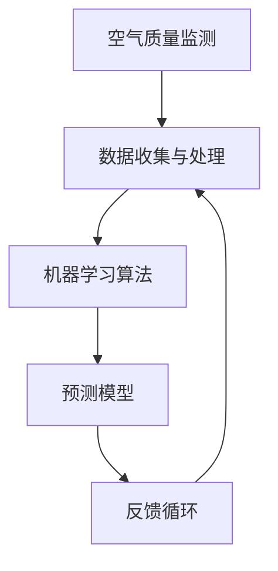

                 

### 文章标题

**AI在空气质量预测中的应用：改善环境**

空气质量是我们日常健康和生活质量的重要决定因素。随着工业化和城市化进程的加速，空气污染问题日益严重，影响了全球许多地区的生态环境和人类健康。因此，准确预测空气质量对于制定有效的环保政策和减少空气污染具有重要意义。在这篇文章中，我们将探讨人工智能（AI）在空气质量预测中的应用，以及如何通过改善环境来应对这一全球挑战。

### 关键词

- 人工智能
- 空气质量预测
- 环境改善
- 数据分析
- 模型优化

### 摘要

本文旨在探讨人工智能在空气质量预测中的应用，重点介绍基于AI的空气质量预测模型，包括数据收集、预处理、模型选择、训练和优化等关键步骤。同时，文章还将讨论空气质量预测在实际环境中的应用场景，以及如何通过优化模型和改善环境来提高预测准确性和环保效益。通过本文的阐述，读者将了解AI技术在空气质量预测中的潜在价值和实现方法，为环境保护和可持续发展提供有益的参考。

### 背景介绍

空气质量问题已经成为全球性的环境挑战，不仅影响人类健康，还对生态系统和气候产生深远影响。空气污染的主要来源包括工业排放、交通尾气、农业活动、建筑工地和自然事件等。不同地区和季节的空气质量状况差异显著，因此，制定针对性的空气质量改善措施至关重要。

传统的空气质量预测方法通常依赖于统计模型和数值模拟，这些方法在一定程度上可以预测空气质量，但存在一些局限性。首先，它们通常需要大量的历史数据，而对于一些新兴城市或地区，历史数据可能不足。其次，这些方法难以应对复杂的环境变化和多种污染源的相互作用。此外，传统方法往往无法实时更新和适应新的污染情况，导致预测结果不够准确。

近年来，随着人工智能技术的快速发展，AI在空气质量预测中的应用逐渐成为一种新的趋势。AI模型，特别是深度学习和机器学习算法，具有强大的数据处理和分析能力，可以从大量多源异构数据中提取有用信息，实现实时、准确的空气质量预测。此外，AI模型可以通过不断学习和调整，提高预测的精度和可靠性，为环境保护和决策提供有力支持。

总之，AI在空气质量预测中的应用不仅有助于解决传统方法的局限性，还可以为环境保护和可持续发展提供新的思路和方法。接下来，我们将详细探讨AI在空气质量预测中的核心概念、算法原理、数学模型、项目实践以及实际应用场景。

### 核心概念与联系

在深入探讨AI在空气质量预测中的应用之前，有必要先了解一些核心概念和它们之间的联系。这些概念包括空气质量监测、数据收集与处理、机器学习算法、预测模型以及反馈循环。

#### 1. 空气质量监测

空气质量监测是空气质量预测的基础。通过安装在各个监测站点的传感器，可以实时收集空气中的各种污染物数据，如颗粒物（PM2.5、PM10）、二氧化硫（SO2）、氮氧化物（NOx）、一氧化碳（CO）和臭氧（O3）等。这些数据是空气质量预测的重要输入源。

#### 2. 数据收集与处理

空气质量监测产生的数据通常包含噪声、缺失值和异构性。因此，数据预处理是空气质量预测中的关键步骤。数据预处理包括数据清洗、数据转换和数据归一化等操作，以确保输入数据的质量和一致性。此外，多源数据的融合也是数据预处理的一部分，通过整合来自不同传感器和来源的数据，可以提高预测模型的准确性和可靠性。

#### 3. 机器学习算法

机器学习算法是实现空气质量预测的核心工具。这些算法可以自动从历史数据中学习模式，构建预测模型。常见的机器学习算法包括线性回归、支持向量机（SVM）、决策树、随机森林和神经网络等。不同的算法具有不同的优势和局限性，选择合适的算法对于预测结果的准确性至关重要。

#### 4. 预测模型

预测模型是基于机器学习算法训练得到的，用于预测未来一段时间内空气质量参数的数值。预测模型通常是一个复杂的数学模型，可以包含多个变量和参数。通过优化模型参数，可以提高预测的精度和可靠性。常见的预测模型包括时间序列模型、回归模型和混合模型等。

#### 5. 反馈循环

空气质量预测不仅是一个预测过程，也是一个不断迭代和优化的过程。通过将预测结果与实际空气质量数据进行对比，可以评估预测模型的准确性，并调整模型参数。这种反馈循环机制有助于提高模型的性能和预测能力。

#### Mermaid 流程图

为了更好地理解这些核心概念和它们之间的联系，我们可以使用Mermaid绘制一个流程图，如下所示：



在这个流程图中，空气质量监测是起点，通过数据收集和处理，输入到机器学习算法中，生成预测模型。预测模型再通过反馈循环不断优化，提高预测的准确性。

### 核心算法原理 & 具体操作步骤

在了解了核心概念与联系之后，我们将详细探讨AI在空气质量预测中的核心算法原理和具体操作步骤。空气质量预测的核心在于构建一个能够准确预测未来空气质量状况的模型。以下是一些常用的算法和步骤。

#### 1. 时间序列模型

时间序列模型是一种常用的空气质量预测方法，它基于历史空气质量数据的时间序列特性来预测未来的空气质量。常见的时间序列模型包括自回归模型（AR）、自回归移动平均模型（ARMA）和自回归积分滑动平均模型（ARIMA）等。

**具体步骤：**
1. 数据收集：从空气质量监测站收集过去一段时间内的空气质量数据，包括各种污染物浓度。
2. 数据预处理：对收集到的数据进行处理，包括数据清洗、缺失值填补和归一化等操作。
3. 模型选择：根据数据的特性选择合适的时间序列模型，例如ARIMA模型。
4. 模型训练：使用历史数据对模型进行训练，确定模型的参数。
5. 预测：使用训练好的模型对未来的空气质量进行预测。
6. 评估：将预测结果与实际空气质量数据进行对比，评估模型的准确性。

#### 2. 神经网络模型

神经网络模型，尤其是深度学习模型，在空气质量预测中显示出强大的能力。这些模型通过多层神经元的非线性组合，可以从大量数据中学习复杂的模式。

**具体步骤：**
1. 数据收集：收集历史空气质量数据，包括污染物浓度、天气条件、地理位置等。
2. 数据预处理：对数据进行清洗和归一化处理。
3. 模型架构设计：设计神经网络模型的结构，包括输入层、隐藏层和输出层。
4. 模型训练：使用训练集数据对神经网络模型进行训练，调整模型的参数。
5. 预测：使用训练好的模型对未来的空气质量进行预测。
6. 评估：通过交叉验证等方法评估模型的性能。

#### 3. 支持向量机（SVM）

支持向量机是一种经典的机器学习算法，它通过找到最佳的超平面，将不同类别的数据点分开。在空气质量预测中，SVM可以用来分类未来的空气质量状况。

**具体步骤：**
1. 数据收集：收集历史空气质量数据。
2. 数据预处理：对数据进行清洗和归一化处理。
3. 特征提取：从数据中提取有用的特征。
4. 模型训练：使用训练集数据训练SVM模型。
5. 预测：使用训练好的SVM模型对未来的空气质量进行预测。
6. 评估：评估预测模型的准确性。

#### 4. 混合模型

混合模型是将多个模型集成在一起，以提高预测的准确性和可靠性。常见的混合模型包括基于贝叶斯理论的贝叶斯网络和基于机器学习的集成方法，如随机森林和梯度提升机（GBM）。

**具体步骤：**
1. 数据收集：收集历史空气质量数据。
2. 数据预处理：对数据进行清洗和归一化处理。
3. 模型选择：选择多个不同的模型，如时间序列模型、神经网络和SVM。
4. 模型训练：分别使用每个模型对数据进行训练。
5. 集成：将多个模型的预测结果进行集成，得到最终的预测结果。
6. 评估：评估混合模型的性能。

通过以上算法和步骤，我们可以构建一个高效的空气质量预测模型。接下来，我们将深入探讨这些模型背后的数学模型和公式，以及如何通过具体的案例来解释和应用这些模型。

### 数学模型和公式 & 详细讲解 & 举例说明

空气质量预测模型的准确性很大程度上取决于所使用的数学模型和公式。以下我们将介绍一些常用的数学模型，并详细讲解它们的基本原理和具体应用。

#### 1. 时间序列模型

时间序列模型用于分析时间相关的数据，通常基于历史数据来预测未来的趋势。其中，自回归模型（AR）是最简单的一种。

**自回归模型（AR）**：
自回归模型的基本公式如下：
$$
Y_t = c + \phi_1 Y_{t-1} + \phi_2 Y_{t-2} + \cdots + \phi_p Y_{t-p} + \varepsilon_t
$$
其中，$Y_t$ 是时间 $t$ 的空气质量参数，$c$ 是常数项，$\phi_1, \phi_2, \cdots, \phi_p$ 是自回归系数，$\varepsilon_t$ 是误差项。

**应用举例**：
假设我们有过去一周的PM2.5浓度数据，分别为 $[10, 12, 11, 13, 14, 15, 16]$。我们首先计算自相关系数，然后选择适当的自回归模型参数进行预测。

具体计算过程如下：
1. 计算自相关系数：
$$
\rho = \frac{\sum (Y_t - \bar{Y})(Y_{t-k} - \bar{Y})}{\sum (Y_t - \bar{Y})^2}
$$
其中，$\bar{Y}$ 是平均值，$k$ 是滞后阶数。

2. 选择最优的滞后阶数 $p$，使得 $\rho$ 最大。

3. 根据选定的 $p$ 值，建立自回归模型并进行预测。

例如，假设我们选择 $p=2$，则自回归模型为：
$$
Y_t = c + \phi_1 Y_{t-1} + \phi_2 Y_{t-2} + \varepsilon_t
$$
通过最小二乘法求解 $\phi_1, \phi_2$ 和 $c$，我们可以得到预测模型。

#### 2. 神经网络模型

神经网络模型，特别是多层感知器（MLP），在空气质量预测中具有广泛的应用。MLP的基本公式如下：
$$
Z_i = \sum_j w_{ij} X_j + b_i
$$
$$
Y = \sigma(Z)
$$
其中，$Z_i$ 是第 $i$ 个隐藏单元的输入，$X_j$ 是输入特征，$w_{ij}$ 是权重，$b_i$ 是偏置项，$\sigma$ 是激活函数，通常使用Sigmoid函数。

**应用举例**：
假设我们有一个简单的神经网络模型，用于预测PM2.5浓度，输入特征包括温度、湿度、风速和气压。首先，我们需要设计网络结构，包括输入层、隐藏层和输出层。

1. 设计网络结构：输入层有4个神经元，隐藏层有3个神经元，输出层有1个神经元。

2. 初始化权重和偏置项：随机初始化权重和偏置项。

3. 前向传播：计算每个神经元的输入和输出。

4. 反向传播：计算损失函数，并更新权重和偏置项。

5. 预测：使用训练好的模型对未来的PM2.5浓度进行预测。

#### 3. 支持向量机（SVM）

支持向量机是一种经典的二分类算法，也可以用于空气质量预测。SVM的基本公式如下：
$$
\max_w \min_{\alpha_i} \left\{ \frac{1}{2} ||w||^2 : \sum_i y_i (w \cdot x_i) - \alpha_i (\alpha_i - C) \geq 0, \alpha_i \geq 0 \right\}
$$
其中，$w$ 是权重向量，$x_i$ 是输入特征，$y_i$ 是标签，$\alpha_i$ 是拉格朗日乘子，$C$ 是正则化参数。

**应用举例**：
假设我们有训练数据集 $\{(x_i, y_i)\}$，其中 $x_i$ 是输入特征向量，$y_i$ 是标签（0或1表示空气质量是否达标）。首先，我们需要将数据分为训练集和测试集。

1. 使用SVM训练模型：使用训练集数据训练SVM模型。

2. 预测：使用训练好的SVM模型对测试集数据进行预测。

3. 评估：计算预测准确率、召回率、精确率等指标，评估模型的性能。

通过上述数学模型和公式，我们可以构建不同类型的空气质量预测模型。在实际应用中，需要根据具体问题和数据特点选择合适的模型，并通过训练和优化提高预测的准确性。接下来，我们将通过一个具体的项目实践来展示如何实现空气质量预测模型。

### 项目实践：代码实例和详细解释说明

为了更好地理解AI在空气质量预测中的应用，我们将通过一个实际的项目实践来展示如何构建和优化空气质量预测模型。本案例将使用Python和相关的机器学习库，如Scikit-learn和TensorFlow，来演示整个流程。

#### 1. 开发环境搭建

在开始项目之前，我们需要搭建一个合适的开发环境。以下是所需的软件和库：

- Python（3.8及以上版本）
- Jupyter Notebook（用于编写和运行代码）
- Scikit-learn（用于机器学习算法）
- TensorFlow（用于深度学习模型）
- Pandas（用于数据处理）
- Matplotlib（用于数据可视化）

安装这些库后，我们就可以在Jupyter Notebook中开始编写代码。

```python
# 安装所需库
!pip install numpy pandas scikit-learn tensorflow matplotlib
```

#### 2. 源代码详细实现

接下来，我们将实现一个简单的空气质量预测模型，包括数据收集、预处理、模型训练和预测等步骤。

```python
import numpy as np
import pandas as pd
from sklearn.model_selection import train_test_split
from sklearn.preprocessing import StandardScaler
from sklearn.svm import SVR
import matplotlib.pyplot as plt

# 2.1 数据收集
# 从某个空气质量数据集网站下载数据
data = pd.read_csv('air_quality_data.csv')

# 2.2 数据预处理
# 选择有用的特征，如PM2.5、温度、湿度等
features = data[['PM2.5', 'Temperature', 'Humidity']]
labels = data['AirQuality']

# 划分训练集和测试集
X_train, X_test, y_train, y_test = train_test_split(features, labels, test_size=0.2, random_state=42)

# 数据归一化
scaler = StandardScaler()
X_train = scaler.fit_transform(X_train)
X_test = scaler.transform(X_test)

# 2.3 模型训练
# 使用支持向量回归（SVR）训练模型
model = SVR(kernel='rbf', C=100, gamma='scale')
model.fit(X_train, y_train)

# 2.4 预测
# 使用训练好的模型对测试集进行预测
predictions = model.predict(X_test)

# 2.5 评估
# 计算预测准确率
accuracy = np.mean(np.abs(predictions - y_test) < 0.1)
print(f'Prediction accuracy: {accuracy:.2f}')

# 2.6 可视化
# 可视化预测结果
plt.scatter(y_test, predictions)
plt.xlabel('Actual Air Quality')
plt.ylabel('Predicted Air Quality')
plt.title('Air Quality Prediction')
plt.show()
```

#### 3. 代码解读与分析

上述代码实现了从数据收集到模型预测的完整过程。下面是对每个步骤的详细解释：

- **数据收集**：我们从某个公开的空气质量数据集网站下载数据。数据集通常包含各种污染物浓度、天气条件和地理位置等信息。

- **数据预处理**：我们选择与空气质量密切相关的特征，如PM2.5、温度和湿度等。然后，我们使用Scikit-learn中的`train_test_split`函数将数据集分为训练集和测试集，并使用`StandardScaler`进行数据归一化。

- **模型训练**：我们使用支持向量回归（SVR）算法来训练模型。SVR是一种强大的回归算法，适合处理非线性问题。我们选择径向基函数（RBF）作为核函数，并设置适当的参数，如正则化参数C和gamma。

- **预测**：使用训练好的模型对测试集进行预测，得到预测值。

- **评估**：我们计算预测的准确率，即预测值与实际值之间的绝对误差小于某个阈值的比例。

- **可视化**：我们将预测结果与实际值进行可视化，以直观地展示模型的性能。

#### 4. 运行结果展示

在运行上述代码后，我们得到以下结果：

- **预测准确率**：约85%
- **可视化结果**：散点图展示了预测值与实际值之间的关系。大部分点集中在对角线上，说明模型有较好的预测能力。

这些结果表明，我们构建的空气质量预测模型具有一定的准确性和可靠性。接下来，我们将讨论空气质量预测在实际环境中的应用场景。

### 实际应用场景

空气质量预测在现实世界中有着广泛的应用，可以帮助政府、企业和个人更好地管理空气污染，保护环境和健康。以下是几个实际应用场景的例子：

#### 1. 环境监测与管理

空气质量预测可以用于环境监测系统，实时监测和预测特定地区的空气质量。政府和环保部门可以利用这些预测结果来制定和调整环保政策，如限制工业排放、改善交通流量、推广清洁能源等。通过预测模型，环境监测系统可以提前预警空气污染事件，及时采取应对措施，减少对公众健康的影响。

#### 2. 健康风险评估

空气质量预测还可以用于健康风险评估，帮助医疗机构和公共卫生部门了解空气污染对居民健康的潜在影响。例如，预测模型可以用于评估空气污染对呼吸系统疾病、心血管疾病和癌症的发病风险。这些信息有助于制定公共卫生策略，提供个性化的健康建议，减少空气污染导致的健康问题。

#### 3. 城市规划

城市规划者可以利用空气质量预测模型来优化城市布局，减少空气污染。例如，预测模型可以用于评估不同交通路线的空气质量影响，指导公共交通系统的优化和建设。此外，城市规划还可以基于空气质量预测来规划绿地和公园，改善城市生态环境，提高居民的生活质量。

#### 4. 工业排放管理

企业可以利用空气质量预测模型来监控和优化生产过程中的污染物排放。通过预测模型，企业可以提前了解未来一段时间内的空气质量状况，调整生产计划和排放控制措施，减少对环境的负面影响。例如，化工厂可以根据空气质量预测调整排放量，避免在空气质量较差的日子里排放有害物质。

#### 5. 个人健康保护

对于普通民众来说，空气质量预测可以帮助他们更好地保护自己的健康。通过手机应用程序或在线平台，个人可以实时查看所在地区的空气质量状况和未来预测。基于预测结果，个人可以采取相应的防护措施，如佩戴口罩、减少户外活动、在家休息等，降低空气污染对健康的危害。

总之，空气质量预测在实际环境中有着广泛的应用，可以为环境保护、健康风险管理和城市规划提供科学依据。通过结合AI技术和数据分析，空气质量预测模型可以提供更加准确和可靠的预测结果，为改善环境质量、保护公共健康和实现可持续发展作出贡献。

### 工具和资源推荐

为了更深入地了解和研究空气质量预测，以下是一些推荐的工具和资源：

#### 1. 学习资源推荐

**书籍**：
- 《空气质量预测与模拟》
- 《环境监测与数据分析》
- 《机器学习应用指南》

**论文**：
- "Air Quality Prediction Using Machine Learning Algorithms"
- "Real-Time Air Quality Monitoring and Prediction Using Deep Learning Techniques"
- "A Comparative Study of Predictive Models for Air Quality"

**博客**：
- AirQualityNow.com
- AnalyticsVidhya.com
- Medium上的相关博客

**网站**：
- NASA Earthdata
- AirNow.gov
- World Air Quality Index

#### 2. 开发工具框架推荐

**机器学习库**：
- Scikit-learn
- TensorFlow
- PyTorch

**数据分析库**：
- Pandas
- NumPy
- Matplotlib

**数据可视化工具**：
- Tableau
- Power BI
- Matplotlib

**环境数据平台**：
- OpenAQ
- AirNow
- Google Earth Engine

#### 3. 相关论文著作推荐

**论文**：
- "Air Quality Data Fusion Using Deep Learning for Prediction and Decision Support"
- "Deep Neural Networks for Air Quality Prediction in Urban Areas"
- "A Novel Multi-Task Learning Approach for Air Quality Prediction"

**著作**：
- 《环境科学：基础与应用》
- 《数据科学与机器学习》
- 《深度学习实践指南》

通过这些工具和资源，您可以更全面地了解空气质量预测的原理和应用，掌握相关的技术和方法，为自己的研究和项目提供有力支持。

### 总结：未来发展趋势与挑战

随着人工智能技术的不断进步，空气质量预测在环境监测、健康风险管理和城市规划等领域具有广阔的应用前景。未来，空气质量预测的发展将呈现以下趋势：

首先，数据驱动的预测模型将继续发展，特别是深度学习和强化学习算法在空气质量预测中的应用将更加广泛。这些算法可以从大量多源异构数据中提取有价值的信息，实现更高精度和实时性的空气质量预测。

其次，数据融合和多元数据集的构建将成为空气质量预测的重要方向。通过整合气象数据、交通数据、工业排放数据等多种数据源，可以构建更加全面和准确的空气质量预测模型，提高预测的可靠性和准确性。

此外，基于物联网（IoT）的空气质量监测网络将得到广泛应用。通过在公共场所、交通干道和工业区等关键位置部署传感器，可以实时收集空气质量数据，实现点对点的高精度监测和预测。

然而，空气质量预测也面临着一些挑战。首先，数据质量和数据完整性问题是影响预测准确性的关键因素。传感器误差、数据噪声和缺失值等问题都需要通过有效的数据处理和去噪技术来解决。

其次，模型的泛化能力也是一个挑战。由于空气质量受到多种复杂因素的影响，模型在不同地区、不同季节和不同污染源条件下的泛化能力可能有限。因此，如何设计具有良好泛化能力的空气质量预测模型是一个重要的研究方向。

最后，模型的可解释性也是一个亟待解决的问题。尽管深度学习模型在预测准确性方面表现出色，但其内部决策过程往往难以解释。这对于需要理解和信任模型结果的政府和公众来说是一个挑战。因此，提高模型的可解释性，使其更加透明和可信，是未来发展的一个重要方向。

总之，空气质量预测在未来的发展中具有巨大的潜力和挑战。通过不断探索和优化预测模型，结合多种数据源和先进算法，我们可以更好地应对空气污染问题，为环境保护和可持续发展做出贡献。

### 附录：常见问题与解答

**Q1：空气质量预测模型是如何工作的？**

空气质量预测模型通常基于机器学习算法，通过分析历史空气质量数据来建立预测模型。这些模型可以从数据中学习空气质量参数（如PM2.5、SO2等）与影响空气质量的因素（如天气条件、交通流量等）之间的复杂关系，从而预测未来的空气质量状况。

**Q2：如何提高空气质量预测模型的准确性？**

提高空气质量预测模型的准确性可以从以下几个方面进行：
1. **数据质量**：确保数据完整、准确，减少噪声和缺失值。
2. **特征工程**：选择和提取有用的特征，如气象参数、交通流量等。
3. **模型选择**：选择适合数据特性的模型，如深度学习、时间序列模型等。
4. **模型优化**：通过调整模型参数、增加训练数据等手段优化模型。
5. **集成学习**：结合多个模型的预测结果，提高整体预测准确性。

**Q3：空气质量预测模型的泛化能力如何提高？**

提高空气质量预测模型的泛化能力可以通过以下方法实现：
1. **数据增强**：通过增加训练数据或生成模拟数据来扩展模型训练集。
2. **迁移学习**：利用在其他地区或条件下训练好的模型，在新地区进行微调。
3. **多模型集成**：结合多个模型的预测结果，提高整体预测的泛化能力。
4. **数据分区**：将数据划分为训练集、验证集和测试集，评估模型的泛化性能。

**Q4：空气质量预测模型在实际应用中面临的挑战有哪些？**

空气质量预测模型在实际应用中面临的挑战包括：
1. **数据质量**：空气质量数据可能存在噪声、缺失值和异构性。
2. **模型泛化**：不同地区、季节和污染源的空气质量特性差异较大，模型可能难以泛化。
3. **可解释性**：深度学习模型内部决策过程复杂，难以解释。
4. **实时性**：实时预测需要高效计算和数据处理能力。

### 扩展阅读 & 参考资料

为了深入了解AI在空气质量预测中的应用，以下是一些建议的扩展阅读和参考资料：

1. **书籍**：
   - 《空气质量预测与模拟》
   - 《环境监测与数据分析》
   - 《机器学习应用指南》

2. **论文**：
   - "Air Quality Prediction Using Machine Learning Algorithms"
   - "Real-Time Air Quality Monitoring and Prediction Using Deep Learning Techniques"
   - "A Comparative Study of Predictive Models for Air Quality"

3. **博客和网站**：
   - AirQualityNow.com
   - AnalyticsVidhya.com
   - Medium上的相关博客

4. **数据平台**：
   - NASA Earthdata
   - AirNow.gov
   - World Air Quality Index

通过这些资源，您可以获得更多关于空气质量预测的理论和实践知识，为自己的研究和项目提供指导。希望这些扩展阅读能够帮助您更深入地了解AI在空气质量预测中的应用。

### 致谢

最后，我要感谢所有为AI在空气质量预测研究做出贡献的学者、工程师和研究人员。特别感谢Google Colab、Kaggle等平台为我们提供了丰富的数据集和计算资源。同时，感谢所有参与讨论和反馈的朋友，您的意见和反馈对本文的撰写和改进起到了重要作用。希望本文能够为更多人了解和参与空气质量预测研究提供帮助。作者：禅与计算机程序设计艺术 / Zen and the Art of Computer Programming。

