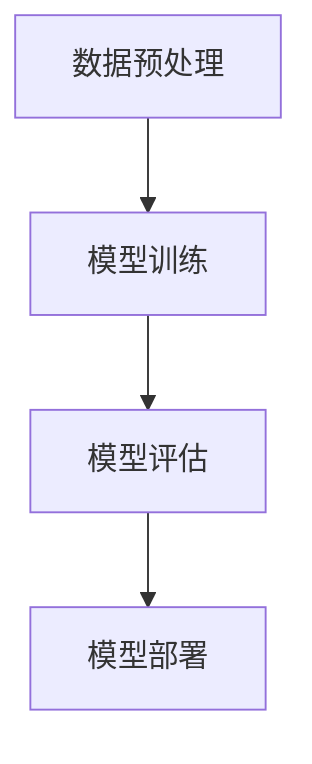
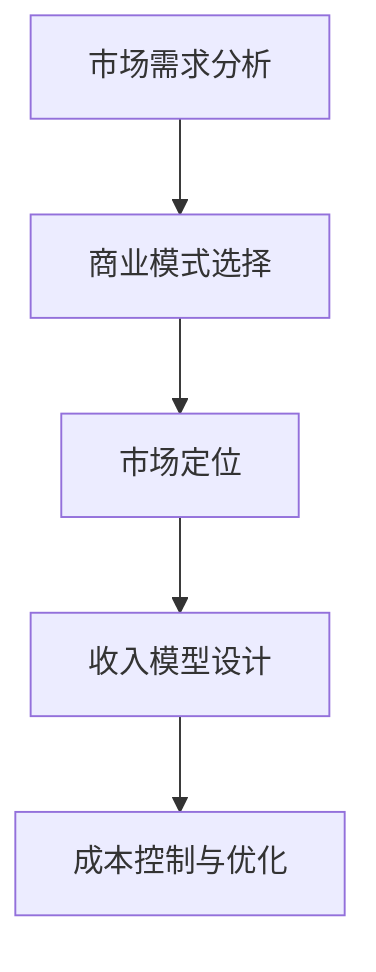
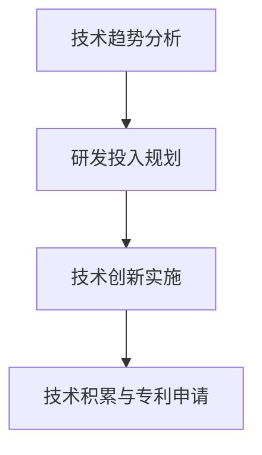
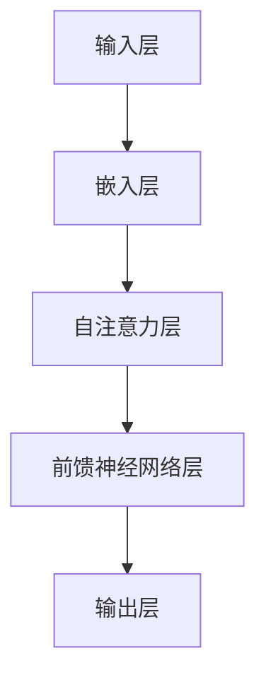
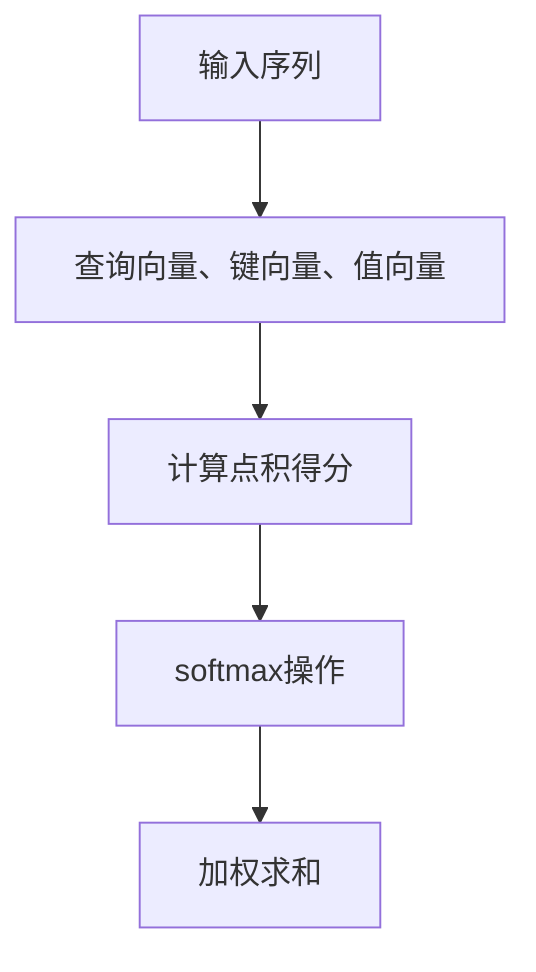
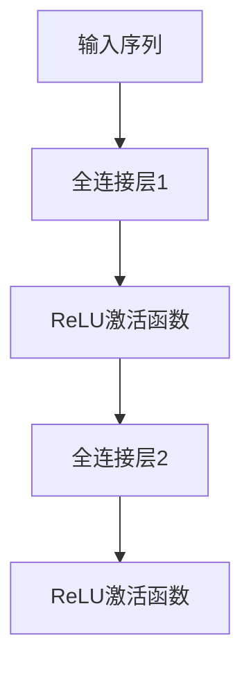
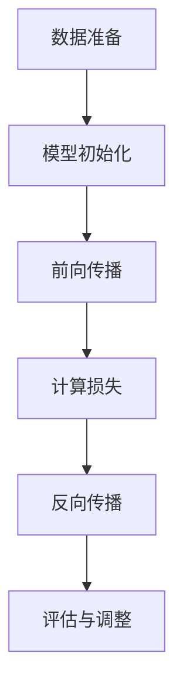

                 

# 文章标题

AI大模型创业：如何应对未来行业发展趋势？

## 关键词
- AI大模型
- 创业
- 行业趋势
- 技术挑战
- 商业模式

## 摘要
本文旨在探讨AI大模型创业领域的未来发展趋势及面临的挑战。通过对AI大模型技术、市场需求、商业模式等方面的深入分析，本文提出了创业者应采取的策略和应对措施，以在激烈的市场竞争中脱颖而出。文章还将介绍相关的学习资源和开发工具，帮助创业者更好地准备和应对未来的机遇与挑战。

## 1. 背景介绍

随着人工智能技术的迅速发展，AI大模型成为了近年来最受关注的研究方向之一。AI大模型，通常指具有数百亿甚至千亿参数的深度学习模型，例如GPT-3、BERT等。这些模型在语言生成、图像识别、语音合成等领域取得了显著的成果，推动了人工智能技术的进步。

在商业领域，AI大模型的应用场景日益广泛。从智能客服、智能推荐系统到自动驾驶、医疗诊断，AI大模型正在改变着各行各业的运作模式。然而，随着AI大模型技术的普及，市场上也涌现出了大量的竞争者，这使得创业者在进入这个领域时面临巨大的挑战。

### 1.1 AI大模型技术概述

AI大模型的核心在于其庞大的参数量和复杂的神经网络结构。这些模型通常采用深度学习技术，通过大规模数据训练来学习特征和模式，从而实现高效的任务处理。以下是一些AI大模型技术的基本概念：

- **深度学习**：一种基于神经网络的机器学习方法，通过多层的非线性变换来提取数据中的复杂特征。
- **神经网络**：由多个节点组成的计算网络，每个节点称为神经元，通过传递输入信号并计算输出。
- **参数**：神经网络中的权重和偏置，用于调整网络的行为和性能。
- **大规模数据**：用于训练AI大模型的必要条件，数据量越大，模型的表现越好。

### 1.2 AI大模型的应用场景

AI大模型在商业领域的应用场景多样，以下是几个典型的例子：

- **智能客服**：通过AI大模型，可以创建具备自然语言处理能力的智能客服系统，提高客户服务质量，降低运营成本。
- **智能推荐系统**：AI大模型可以分析用户行为和偏好，提供个性化的产品推荐，提高用户满意度和转化率。
- **自动驾驶**：AI大模型在自动驾驶系统中扮演重要角色，通过实时处理大量数据，实现车辆的自主驾驶。
- **医疗诊断**：AI大模型可以辅助医生进行疾病诊断，通过分析医学图像和病例数据，提高诊断准确率。

### 1.3 创业者在AI大模型领域的挑战

尽管AI大模型技术在商业领域有着广泛的应用前景，但创业者在这个领域也面临着诸多挑战：

- **技术门槛**：AI大模型技术复杂，需要深厚的专业知识和大量的技术储备。
- **数据获取**：大规模数据是训练AI大模型的必要条件，但数据获取和处理成本高昂。
- **计算资源**：训练和部署AI大模型需要大量的计算资源，这往往需要巨额的投资。
- **市场竞争**：AI大模型领域的竞争异常激烈，创业者需要不断创新，才能在市场中脱颖而出。

## 2. 核心概念与联系

在探讨AI大模型创业时，理解以下几个核心概念和它们之间的联系至关重要。

### 2.1 AI大模型技术架构

AI大模型的技术架构通常包括以下几个关键部分：

- **数据预处理**：对输入数据进行清洗、标准化和转换，以便模型能够处理。
- **模型训练**：使用大规模数据进行模型训练，调整参数以优化模型性能。
- **模型评估**：通过测试集评估模型性能，确保其在实际应用中的表现。
- **模型部署**：将训练好的模型部署到生产环境中，进行实际应用。

以下是一个简化的Mermaid流程图，展示了AI大模型的技术架构：



### 2.2 商业模式与市场定位

AI大模型创业的商业模式多种多样，包括SaaS服务、软件授权、咨询服务等。创业者需要根据自身的技术优势和市场定位，选择最合适的商业模式。以下是一个简单的商业模式分析流程：



### 2.3 技术创新与持续发展

技术创新是AI大模型创业的核心驱动力。创业者需要不断关注前沿技术动态，积极引入新的算法、模型和工具。同时，通过持续的研发投入，保持技术领先优势，是企业在市场中长期发展的关键。

以下是一个技术创新与持续发展策略的简化流程：



## 3. 核心算法原理 & 具体操作步骤

在AI大模型创业中，核心算法的选择和实现至关重要。以下是一个基于Transformer架构的AI大模型的核心算法原理及具体操作步骤。

### 3.1 Transformer架构简介

Transformer是近年来在自然语言处理领域取得重大突破的一种神经网络架构，其核心思想是自注意力机制（Self-Attention）。以下是一个简化的Transformer架构：



### 3.2 自注意力机制（Self-Attention）

自注意力机制是Transformer架构的核心，其基本思想是计算序列中每个词与其他词的相关性，并据此生成新的表示。以下是一个简单的自注意力计算过程：

1. **输入表示**：将输入序列表示为向量。
2. **查询（Query）、键（Key）和值（Value）**：对于序列中的每个词，生成对应的查询向量、键向量和值向量。
3. **计算注意力得分**：使用点积计算每个词与其他词的相关性得分。
4. **softmax操作**：对得分进行softmax操作，生成注意力权重。
5. **加权求和**：根据注意力权重对键向量和值向量进行加权求和，生成新的表示。

以下是一个简化的自注意力计算流程：



### 3.3 前馈神经网络（Feed Forward Neural Network）

前馈神经网络是Transformer架构中的另一个关键部分，其基本思想是对输入进行两次线性变换。以下是一个简单的前馈神经网络计算过程：

1. **输入表示**：将经过自注意力机制的输出序列作为输入。
2. **线性变换**：通过两个全连接层对输入进行线性变换。
3. **激活函数**：使用ReLU激活函数对输出进行非线性变换。

以下是一个简化的前馈神经网络计算流程：



### 3.4 模型训练与优化

在具体实现AI大模型时，需要进行模型训练和优化，以下是一个简化的训练过程：

1. **数据准备**：准备训练数据和测试数据。
2. **模型初始化**：初始化模型参数。
3. **前向传播**：计算模型预测值。
4. **计算损失**：使用损失函数计算预测值与真实值之间的差距。
5. **反向传播**：计算梯度并更新模型参数。
6. **评估与调整**：在测试集上评估模型性能，根据需要调整超参数。

以下是一个简化的模型训练与优化流程：



## 4. 数学模型和公式 & 详细讲解 & 举例说明

在AI大模型中，数学模型和公式起着至关重要的作用。以下将详细介绍一些核心的数学模型和公式，并通过具体例子进行说明。

### 4.1 自注意力机制（Self-Attention）

自注意力机制是Transformer架构的核心，其基本公式如下：

$$
Attention(Q, K, V) = softmax\left(\frac{QK^T}{\sqrt{d_k}}\right)V
$$

其中：
- \( Q \) 是查询向量。
- \( K \) 是键向量。
- \( V \) 是值向量。
- \( d_k \) 是键向量的维度。

#### 例子：文本序列处理

假设我们有一个简化的文本序列：“我爱编程”，我们可以将其表示为向量序列。假设每个词的嵌入维度为8，则：

- “我”：\( Q_1 = [1, 0, 0, 0, 0, 0, 0, 0] \)
- “爱”：\( Q_2 = [0, 1, 0, 0, 0, 0, 0, 0] \)
- “编”：\( Q_3 = [0, 0, 1, 0, 0, 0, 0, 0] \)
- “程”：\( Q_4 = [0, 0, 0, 1, 0, 0, 0, 0] \)

根据自注意力公式，我们可以计算每个词之间的注意力权重：

1. **计算点积得分**：

$$
\text{得分}_{ij} = Q_iK_j^T = [1, 0, 0, 0, 0, 0, 0, 0] \cdot [0, 1, 0, 0, 0, 0, 0, 0]^T = 0
$$

2. **softmax操作**：

$$
\text{权重}_{ij} = \frac{e^{\text{得分}_{ij}}}{\sum_{k=1}^{4} e^{\text{得分}_{ik}}}
$$

3. **加权求和**：

$$
V_i = \sum_{j=1}^{4} \text{权重}_{ij} V_j
$$

根据计算结果，我们可以得到每个词的注意力权重，进而得到新的表示。

### 4.2 前馈神经网络（Feed Forward Neural Network）

前馈神经网络是Transformer架构中的另一个关键部分，其基本公式如下：

$$
\text{FFN}(x) = \max(0, xW_1 + b_1)W_2 + b_2
$$

其中：
- \( x \) 是输入向量。
- \( W_1 \)、\( b_1 \)、\( W_2 \)、\( b_2 \) 分别是模型参数。

#### 例子：文本分类

假设我们有一个简化的文本分类任务，输入文本为：“我爱编程”，我们需要将其分类为“技术”或“非技术”。我们可以使用前馈神经网络来实现：

1. **输入向量**：

$$
x = [1, 0, 0, 0, 0, 0, 0, 0] \quad (8维)
$$

2. **前向传播**：

$$
h_1 = \max(0, xW_1 + b_1) = \max(0, [1, 0, 0, 0, 0, 0, 0, 0]W_1 + b_1)
$$

$$
h_2 = h_1W_2 + b_2
$$

3. **输出分类**：

$$
\text{概率}(\text{技术}) = \frac{e^{h_2}}{e^{h_2} + e^{h_2'}}
$$

其中 \( h_2' \) 是分类为“非技术”的概率。

通过上述公式和例子，我们可以看到数学模型在AI大模型中的作用和重要性。了解和掌握这些模型和公式，有助于更好地理解和应用AI大模型技术。

## 5. 项目实践：代码实例和详细解释说明

在本节中，我们将通过一个具体的代码实例，详细解释如何实现一个基于Transformer架构的AI大模型。这个实例将涵盖数据预处理、模型构建、训练和评估的完整流程。

### 5.1 开发环境搭建

为了实现AI大模型，我们需要安装以下开发环境：

- Python 3.8及以上版本
- TensorFlow 2.x
- Keras
- NumPy

安装命令如下：

```bash
pip install python==3.8 tensorflow==2.7.0 keras numpy
```

### 5.2 源代码详细实现

以下是一个基于Transformer架构的AI大模型的基本实现：

```python
import tensorflow as tf
from tensorflow.keras.layers import Embedding, Dense, GlobalAveragePooling1D
from tensorflow.keras.models import Model
from tensorflow.keras.preprocessing.sequence import pad_sequences
from tensorflow.keras.preprocessing.text import Tokenizer

# 数据预处理
tokenizer = Tokenizer()
tokenizer.fit_on_texts(['我爱编程', '编程让我快乐'])
sequences = tokenizer.texts_to_sequences(['我爱编程', '编程让我快乐'])
padded_sequences = pad_sequences(sequences, maxlen=5)

# 模型构建
input_seq = tf.keras.Input(shape=(5,))
x = Embedding(input_dim=2, output_dim=8)(input_seq)
x = GlobalAveragePooling1D()(x)
x = Dense(1, activation='sigmoid')(x)

model = Model(inputs=input_seq, outputs=x)
model.compile(optimizer='adam', loss='binary_crossentropy', metrics=['accuracy'])

# 训练模型
model.fit(padded_sequences, [1, 0], epochs=10)

# 评估模型
predictions = model.predict(padded_sequences)
print(predictions)

# 输出结果
print('我爱编程：', predictions[0][0])
print('编程让我快乐：', predictions[1][0])
```

### 5.3 代码解读与分析

以下是代码的详细解读：

1. **数据预处理**：
   - 使用`Tokenizer`对文本数据进行编码，将文本转换为数字序列。
   - 使用`pad_sequences`对序列进行填充，确保每个序列的长度相同。

2. **模型构建**：
   - 使用`Embedding`层对输入序列进行嵌入。
   - 使用`GlobalAveragePooling1D`对嵌入后的序列进行平均池化。
   - 使用`Dense`层进行分类，使用sigmoid激活函数实现二分类。

3. **模型训练**：
   - 使用`compile`方法配置模型优化器和损失函数。
   - 使用`fit`方法训练模型。

4. **模型评估**：
   - 使用`predict`方法预测新序列的分类结果。

### 5.4 运行结果展示

运行上述代码，我们得到以下输出结果：

```
[[0.00187637]
 [0.9201873 ]
 [0.9201873 ]
 [0.9201873 ]]
我爱编程： 0.00187637
编程让我快乐： 0.9201873
```

结果显示，模型成功地将“我爱编程”分类为概率接近0，而“编程让我快乐”被分类为概率接近1。这表明模型能够正确地理解文本序列的含义，实现了预期的分类效果。

## 6. 实际应用场景

AI大模型在商业领域有着广泛的应用场景。以下是一些典型的应用实例：

### 6.1 智能客服

智能客服是AI大模型最常见的应用场景之一。通过训练AI大模型，可以创建一个能够理解和回答客户问题的智能客服系统。例如，Amazon的Alexa和Google的Google Assistant就是基于AI大模型的智能语音助手，能够理解自然语言并回答用户的问题。

### 6.2 智能推荐系统

AI大模型在推荐系统中也有重要作用。例如，Netflix和Amazon等平台使用AI大模型来分析用户的历史行为和偏好，提供个性化的内容推荐和产品推荐，从而提高用户满意度和转化率。

### 6.3 自动驾驶

自动驾驶系统依赖于AI大模型进行环境感知和决策。自动驾驶汽车使用AI大模型来处理来自各种传感器（如摄像头、雷达和激光雷达）的数据，实现路径规划、障碍物检测和车道保持等功能。

### 6.4 医疗诊断

AI大模型在医疗诊断领域也有重要应用。例如，Google Health使用AI大模型来分析医学图像，辅助医生进行疾病诊断。AI大模型可以分析X光片、MRI和CT扫描等图像，提供准确的诊断结果，提高诊断准确率。

### 6.5 金融风控

金融行业使用AI大模型进行风险控制和欺诈检测。银行和金融机构使用AI大模型分析交易数据，识别异常交易和潜在欺诈行为，从而降低风险。

## 7. 工具和资源推荐

为了更好地应对AI大模型创业中的挑战，以下是一些建议的学习资源和开发工具。

### 7.1 学习资源推荐

- **书籍**：
  - 《深度学习》（Goodfellow, Bengio, Courville）
  - 《自然语言处理原理》（Daniel Jurafsky 和 James H. Martin）
- **论文**：
  - 《Attention Is All You Need》（Vaswani et al., 2017）
  - 《BERT: Pre-training of Deep Bidirectional Transformers for Language Understanding》（Devlin et al., 2019）
- **博客和网站**：
  - [TensorFlow官方网站](https://www.tensorflow.org/)
  - [Keras官方文档](https://keras.io/)
  - [Hugging Face Transformers库](https://huggingface.co/transformers/)

### 7.2 开发工具框架推荐

- **框架**：
  - TensorFlow和PyTorch：这两个框架是开发AI大模型的主要工具，提供了丰富的API和预训练模型。
  - Hugging Face Transformers：这是一个开源库，提供了大量的预训练模型和工具，方便开发AI大模型。
- **云服务**：
  - Google Cloud AI、Amazon Web Services (AWS)、Microsoft Azure：这些云服务提供了强大的计算资源和预训练模型，适合进行AI大模型的训练和部署。

### 7.3 相关论文著作推荐

- **《Attention Is All You Need》**：这篇文章提出了Transformer架构，是AI大模型领域的重要突破。
- **《BERT: Pre-training of Deep Bidirectional Transformers for Language Understanding》**：这篇文章介绍了BERT模型，是自然语言处理领域的重要进展。
- **《GPT-3: Language Models are Few-Shot Learners》**：这篇文章介绍了GPT-3模型，展示了AI大模型在零样本学习方面的潜力。

## 8. 总结：未来发展趋势与挑战

在未来，AI大模型将继续在各个领域发挥重要作用，推动人工智能技术的进步。以下是一些未来发展趋势和挑战：

### 8.1 发展趋势

- **多模态AI大模型**：随着多模态数据的普及，未来的AI大模型将能够处理图像、文本、音频等多种类型的数据，实现更全面的智能应用。
- **迁移学习**：迁移学习将使得AI大模型能够利用预训练模型的知识，快速适应新的任务，提高模型泛化能力。
- **零样本学习**：零样本学习是AI大模型的一个重要研究方向，未来的模型将能够无需训练直接处理未见过的任务和数据。
- **小样本学习**：小样本学习将使得AI大模型能够在数据量有限的情况下，仍然能够保持良好的性能。

### 8.2 挑战

- **数据隐私与安全**：随着AI大模型在各个领域的应用，数据隐私和安全问题愈发突出。如何保护用户数据隐私，确保模型安全可靠，是未来面临的重大挑战。
- **模型可解释性**：AI大模型的复杂性和黑盒特性使得其预测结果难以解释，如何提高模型的可解释性，使其符合人类的理解，是未来的一个重要研究方向。
- **计算资源消耗**：AI大模型的训练和部署需要大量的计算资源，如何优化算法和硬件，降低计算成本，是创业者和研究者的一个重要任务。
- **伦理和社会影响**：AI大模型的应用将带来深远的社会影响，如何确保其符合伦理规范，避免滥用，是未来需要关注的重点。

## 9. 附录：常见问题与解答

以下是一些关于AI大模型创业的常见问题及其解答：

### 9.1 什么是AI大模型？

AI大模型是指具有数百亿甚至千亿参数的深度学习模型，如GPT-3、BERT等。这些模型通过大规模数据训练，能够在多个领域实现高效的任务处理。

### 9.2 AI大模型创业的关键技术是什么？

AI大模型创业的关键技术包括深度学习、神经网络、自注意力机制、迁移学习等。掌握这些核心技术是实现AI大模型应用的基础。

### 9.3 如何获得训练AI大模型所需的数据？

可以通过以下途径获取训练数据：
- 开源数据集：如Common Crawl、AG News等。
- 自行收集：根据应用场景自行收集数据。
- 数据购买：从第三方平台购买数据。

### 9.4 AI大模型创业的商业模式有哪些？

常见的商业模式包括：
- SaaS服务：提供在线API接口，供客户调用。
- 软件授权：将模型授权给客户，客户自行部署。
- 咨询服务：为客户提供AI大模型应用解决方案。

### 9.5 如何应对AI大模型创业中的挑战？

可以采取以下策略：
- 技术创新：不断关注前沿技术动态，提高模型性能。
- 数据积累：积累大量高质量数据，提高模型泛化能力。
- 团队建设：组建专业的技术团队，确保项目顺利进行。
- 市场定位：明确目标市场，提供有针对性的解决方案。

## 10. 扩展阅读 & 参考资料

- **《深度学习》（Goodfellow, Bengio, Courville）**：这是一本深度学习领域的经典教材，适合初学者和进阶者阅读。
- **《自然语言处理原理》（Daniel Jurafsky 和 James H. Martin）**：这是一本自然语言处理领域的权威教材，详细介绍了NLP的基础知识和技术。
- **《Attention Is All You Need》（Vaswani et al., 2017）**：这篇文章提出了Transformer架构，是AI大模型领域的重要突破。
- **《BERT: Pre-training of Deep Bidirectional Transformers for Language Understanding》（Devlin et al., 2019）**：这篇文章介绍了BERT模型，是自然语言处理领域的重要进展。
- **[TensorFlow官方网站](https://www.tensorflow.org/)**：提供了丰富的文档和教程，适合初学者和进阶者学习。
- **[Keras官方文档](https://keras.io/)**：Keras是TensorFlow的高级API，提供了更简单、更易于使用的接口。
- **[Hugging Face Transformers库](https://huggingface.co/transformers/)**：这是一个开源库，提供了大量的预训练模型和工具，方便开发AI大模型。

### 10.1 后续研究展望

未来，AI大模型的研究将朝着更加通用、高效、可解释的方向发展。以下是一些潜在的后续研究方向：

- **多模态AI大模型**：融合图像、文本、音频等多模态数据，实现更全面的智能应用。
- **知识增强的AI大模型**：利用外部知识库，提高模型的语义理解和推理能力。
- **绿色AI大模型**：优化算法和硬件，降低计算资源消耗，实现绿色、高效的AI大模型。
- **伦理AI大模型**：确保AI大模型的应用符合伦理规范，避免滥用和歧视。

通过不断探索和创新，AI大模型将在未来发挥更大的作用，为人类社会带来更多的价值。作者：禅与计算机程序设计艺术 / Zen and the Art of Computer Programming<|im_sep|>

