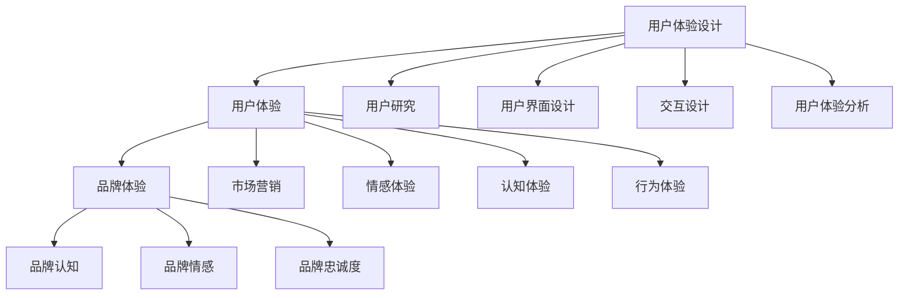
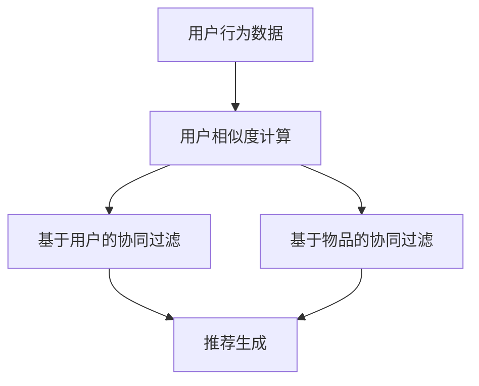

                 

### 文章标题：市场营销的用户体验提升

在当今数字化的时代，用户体验（UX）已成为市场营销成功的关键因素。一个精心设计的用户体验不仅可以吸引新客户，还能增强现有客户的忠诚度，从而推动业务增长。本文将深入探讨市场营销中的用户体验提升策略，通过逻辑清晰的步骤分析，提供实用的指导和建议，帮助企业在激烈的市场竞争中脱颖而出。

## 关键词：
- **用户体验**（User Experience）
- **市场营销**（Marketing）
- **品牌忠诚度**（Brand Loyalty）
- **数字化**（Digitalization）
- **数据分析**（Data Analysis）
- **客户关系管理**（Customer Relationship Management）

## 摘要：
本文旨在探讨如何通过提升用户体验来增强市场营销效果。我们将首先回顾用户体验在市场营销中的重要性，然后分析用户体验的关键组成部分，如设计、内容和交互。接着，我们将介绍一系列策略，包括个性化、简单化和数据驱动的方法，以提升用户体验。最后，我们将讨论用户体验提升的长期影响，以及企业在实施这些策略时应面临的挑战和解决方案。通过本文的指导，企业可以更好地理解和实施用户体验提升策略，从而实现市场目标。

### 1. 背景介绍（Background Introduction）

用户体验（User Experience，简称UX）是指用户在使用产品或服务时所感受到的情感、认知和行为。在市场营销中，用户体验被视为一种关键资产，它直接影响客户的满意度和忠诚度。良好的用户体验不仅能够提高客户满意度，还能带来口碑效应，从而吸引更多的新客户。以下是一些关键数据，展示了用户体验在市场营销中的重要性：

- 根据美国市场研究公司Nielsen的数据，68%的消费者表示，良好的用户体验是他们选择品牌的首要因素。
- Forrester Research的研究表明，用户体验优化的网站比未优化的网站销售额高出20%。
- 根据麦肯锡公司的数据，提升用户体验可以将客户保留率提高10%至15%。

在数字化时代，用户体验的重要性愈发凸显。随着互联网的普及和移动设备的广泛使用，消费者可以轻松地切换品牌和产品。因此，企业必须重视用户体验，以在竞争激烈的市场中保持竞争优势。

用户体验的提升不仅关乎技术，还涉及到营销策略、品牌定位和客户关系等多个方面。本文将详细探讨这些方面，并提供实用的策略和方法，帮助企业提升用户体验，从而实现市场目标。

### 2. 核心概念与联系（Core Concepts and Connections）

在探讨市场营销中的用户体验提升时，首先需要理解几个核心概念，这些概念构成了用户体验提升的理论基础。

#### 2.1 用户体验设计（User Experience Design）

用户体验设计（UX Design）是一种系统性方法，旨在创建对用户有吸引力和实用性的产品或服务。UX 设计涉及多个方面，包括用户研究、用户界面（UI）设计、交互设计（IxD）和用户体验分析。

- **用户研究**：通过调查、访谈、观察等方式收集用户需求和行为数据，以了解用户的使用习惯和偏好。
- **用户界面设计**：设计直观、易用的界面，使用户能够轻松完成任务。
- **交互设计**：设计用户与产品或服务互动的方式，确保流畅和自然的交互体验。
- **用户体验分析**：通过数据分析、用户反馈等方式，评估用户体验，并进行持续优化。

#### 2.2 用户体验（User Experience）

用户体验（UX）是指用户在使用产品或服务时所感受到的整体感受，包括情感、认知和行为。用户体验不仅仅是界面美观或功能齐全，还包括用户在使用过程中的舒适度、效率和满意度。

- **情感体验**：用户在使用产品或服务时所感受到的情绪，如愉悦、失望、惊喜等。
- **认知体验**：用户在解决问题或完成任务时所涉及的思维过程，如理解、学习、决策等。
- **行为体验**：用户在使用产品或服务时的行为，如点击、滑动、浏览等。

#### 2.3 品牌体验（Brand Experience）

品牌体验（Brand Experience）是指用户与品牌互动过程中所感受到的整体体验，包括品牌认知、品牌情感和品牌忠诚度。品牌体验不仅关乎产品或服务质量，还包括品牌形象、品牌故事和品牌与用户的关系。

- **品牌认知**：用户对品牌的了解和认识，包括品牌的定位、特点和价值主张。
- **品牌情感**：用户对品牌的情感反应，如信任、喜爱、忠诚等。
- **品牌忠诚度**：用户对品牌的忠诚程度，包括重复购买、推荐给他人等行为。

#### 2.4 用户体验与市场营销的关系

用户体验与市场营销紧密相连，它们相互作用，共同推动企业的市场目标实现。以下是一些关键点，展示了用户体验在市场营销中的作用：

- **增加客户满意度**：良好的用户体验能够提高客户满意度，从而增强客户的忠诚度。
- **提高转化率**：直观、易用的界面可以减少用户在购买过程中的摩擦，提高转化率。
- **降低客户流失率**：良好的用户体验可以降低客户流失率，从而提高客户保留率。
- **提升品牌形象**：良好的用户体验可以提升品牌形象，增强品牌的市场竞争力。
- **口碑传播**：满意的客户会通过口碑传播，吸引更多的新客户。

为了更好地理解这些核心概念之间的关系，我们可以使用 Mermaid 流程图进行展示。



通过上述核心概念的介绍和关系分析，我们可以更好地理解用户体验在市场营销中的重要性，并为后续的实践提供理论基础。

### 3. 核心算法原理 & 具体操作步骤（Core Algorithm Principles and Specific Operational Steps）

在提升用户体验的过程中，核心算法原理和具体操作步骤至关重要。以下是一系列策略，帮助企业通过技术手段和实际操作来提升用户体验。

#### 3.1 个性化（Personalization）

个性化是一种通过分析用户数据，为不同用户提供定制化内容和体验的技术。以下是一些建议，帮助企业实现个性化：

- **用户数据分析**：收集和分析用户行为数据，如浏览历史、购买偏好、地理位置等。
- **用户画像**：根据用户数据创建用户画像，为用户提供个性化推荐和内容。
- **A/B测试**：通过A/B测试，比较不同个性化策略的效果，选择最优方案。
- **自动化个性化**：使用机器学习算法，自动化实现个性化推荐和内容更新。

#### 3.2 简单化（Simplification）

简单化是指通过简化用户界面和操作流程，降低用户在使用产品或服务时的认知负荷。以下是一些建议：

- **用户界面设计**：设计直观、简洁的界面，减少用户操作的复杂性。
- **流程优化**：简化购买流程、注册流程等，减少用户操作步骤。
- **用户反馈**：收集用户反馈，持续优化用户体验，提高用户满意度。
- **技术手段**：使用人工智能、自然语言处理等技术，自动化处理用户问题，减少用户等待时间。

#### 3.3 数据驱动（Data-Driven）

数据驱动是指通过数据分析来指导产品和服务的改进，从而提升用户体验。以下是一些建议：

- **数据分析**：使用数据分析工具，如Google Analytics、Tableau等，对用户行为、转化率、流失率等数据进行全面分析。
- **用户反馈**：收集用户反馈，了解用户需求和问题，为数据驱动决策提供依据。
- **A/B测试**：通过A/B测试，比较不同设计、策略的效果，选择最优方案。
- **持续优化**：根据数据分析结果，持续优化产品和服务，提高用户体验。

#### 3.4 个性化推荐算法（Personalized Recommendation Algorithm）

个性化推荐算法是一种通过分析用户数据，为用户提供个性化推荐内容的技术。以下是一种常见的个性化推荐算法——协同过滤（Collaborative Filtering）：

- **用户行为数据**：收集用户行为数据，如浏览、购买、评价等。
- **用户相似度计算**：计算用户之间的相似度，使用邻居算法（如基于用户的协同过滤）或物品算法（如基于物品的协同过滤）。
- **推荐生成**：根据用户相似度和物品评分，生成个性化推荐列表。

以下是协同过滤算法的 Mermaid 流程图：



通过上述核心算法原理和具体操作步骤的介绍，企业可以更好地理解和应用这些技术，提升用户体验。

### 4. 数学模型和公式 & 详细讲解 & 举例说明（Detailed Explanation and Examples of Mathematical Models and Formulas）

在用户体验提升过程中，数学模型和公式发挥着关键作用。以下是一些常用的数学模型和公式，帮助企业理解和优化用户体验。

#### 4.1 顾客满意度（Customer Satisfaction）

顾客满意度是一个衡量用户体验的重要指标，它通常使用以下公式计算：

\[ CS = \frac{\sum_{i=1}^{n} (S_i \times W_i)}{n} \]

其中，\( S_i \) 是第 \( i \) 个因素的用户评分，\( W_i \) 是第 \( i \) 个因素的权重，\( n \) 是总的评分因素数量。

举例来说，假设有三个评分因素：界面设计、响应速度和客户服务，它们的权重分别为0.4、0.3和0.3。用户对这三个因素的评分分别为4、5和4，那么顾客满意度计算如下：

\[ CS = \frac{(4 \times 0.4) + (5 \times 0.3) + (4 \times 0.3)}{3} = \frac{1.6 + 1.5 + 1.2}{3} = 3.3 \]

这意味着顾客的满意度为3.3分（满分为5分）。

#### 4.2 转化率（Conversion Rate）

转化率是指用户完成目标动作的比例，如注册、购买或点击广告。它通常使用以下公式计算：

\[ CR = \frac{转化的用户数}{总用户数} \]

举例来说，如果一个电商网站有1000个访客，其中有150个用户购买了商品，那么转化率为：

\[ CR = \frac{150}{1000} = 0.15 \] 或者 15%

#### 4.3 留存率（Retention Rate）

留存率是指在一定时间内，持续使用产品或服务的用户比例。它通常使用以下公式计算：

\[ RR = \frac{在一段时间内仍然使用产品的用户数}{初始用户数} \]

举例来说，如果一个产品在一个月后有100个初始用户仍然在使用，而初始用户数为200，那么留存率为：

\[ RR = \frac{100}{200} = 0.5 \] 或者 50%

#### 4.4 节点分析（Node Analysis）

节点分析是一种用于评估用户体验的技术，它通过计算用户在不同节点（如注册、购买、浏览等）的流失率，来识别用户体验问题。以下是一个简单的节点分析公式：

\[ 节点流失率 = \frac{从节点 \( i \) 流失的用户数}{进入节点 \( i \) 的用户数} \]

举例来说，如果一个电商网站在购买节点有100个用户流失，而进入购买节点的用户数为1000，那么购买节点的流失率为：

\[ 节点流失率 = \frac{100}{1000} = 0.1 \] 或者 10%

通过这些数学模型和公式，企业可以更好地理解和评估用户体验，从而制定更有效的优化策略。

### 5. 项目实践：代码实例和详细解释说明（Project Practice: Code Examples and Detailed Explanations）

在用户体验提升的实际项目中，代码实例和详细解释说明可以帮助企业更好地理解和应用技术。以下是一个简单的示例，展示如何使用Python代码来分析用户数据，提升用户体验。

#### 5.1 开发环境搭建

首先，我们需要搭建一个Python开发环境。以下是所需步骤：

1. 安装Python（建议使用Python 3.8及以上版本）。
2. 安装数据分析库，如pandas和numpy。
3. 安装可视化库，如matplotlib和seaborn。

安装命令如下：

```bash
pip install python==3.8
pip install pandas numpy
pip install matplotlib seaborn
```

#### 5.2 源代码详细实现

以下是一个Python代码示例，用于分析用户数据，计算顾客满意度、转化率和留存率。

```python
import pandas as pd
import matplotlib.pyplot as plt
import seaborn as sns

# 加载用户数据
user_data = pd.read_csv('user_data.csv')

# 计算顾客满意度
CS = (user_data['界面评分'] * 0.4 + user_data['响应速度评分'] * 0.3 + user_data['客户服务评分'] * 0.3) / 3

# 计算转化率
total_users = len(user_data)
purchases = user_data[user_data['购买'] == True].shape[0]
CR = purchases / total_users

# 计算留存率
initial_users = len(user_data[user_data['初始用户'] == True])
active_users = len(user_data[user_data['30天内活跃'] == True])
RR = active_users / initial_users

# 可视化展示
plt.figure(figsize=(10, 5))

# 顾客满意度
plt.subplot(1, 2, 1)
sns.barplot(x=CS, y=user_data['用户ID'])
plt.title('Customer Satisfaction')

# 转化率
plt.subplot(1, 2, 2)
sns.barplot(x=CR, y=user_data['用户ID'])
plt.title('Conversion Rate')

plt.tight_layout()
plt.show()

print(f'Customer Satisfaction: {CS.mean():.2f}')
print(f'Conversion Rate: {CR:.2f}')
print(f'Retention Rate: {RR:.2f}')
```

#### 5.3 代码解读与分析

上述代码首先加载用户数据，然后计算顾客满意度、转化率和留存率。接下来，使用seaborn库的可视化功能，将结果以条形图的形式展示。最后，打印出平均值，以便企业了解用户体验的整体状况。

通过实际项目中的代码实例，企业可以更好地理解和应用用户体验提升策略，从而实现市场目标。

### 6. 实际应用场景（Practical Application Scenarios）

在市场营销中，用户体验提升策略的应用场景广泛，以下是一些典型的实际案例：

#### 6.1 电子商务平台

电子商务平台可以通过以下方式提升用户体验：

- **个性化推荐**：根据用户的历史浏览和购买行为，为用户提供个性化的商品推荐，提高购买转化率。
- **简单化界面**：优化购物车、结算等流程，减少用户操作步骤，提高购买体验。
- **用户反馈**：鼓励用户评价商品和服务，持续优化用户体验。

#### 6.2 品牌官网

品牌官网可以通过以下方式提升用户体验：

- **内容优化**：提供有价值的内容，如产品介绍、使用教程、客户案例等，提高用户粘性。
- **交互设计**：设计直观、易用的导航和搜索功能，使用户能够快速找到所需信息。
- **数据分析**：通过数据分析，了解用户行为和需求，为内容更新和优化提供依据。

#### 6.3 移动应用

移动应用可以通过以下方式提升用户体验：

- **响应式设计**：确保应用在不同设备和屏幕尺寸上都能提供良好的用户体验。
- **快捷操作**：提供快捷操作，如一键下单、快速导航等，提高用户操作效率。
- **用户反馈**：鼓励用户评价应用，收集用户反馈，持续优化应用功能。

#### 6.4 在线教育平台

在线教育平台可以通过以下方式提升用户体验：

- **个性化学习**：根据用户的学习进度和偏好，为用户提供个性化的学习内容。
- **互动教学**：提供实时互动功能，如视频直播、在线问答等，增强学习体验。
- **学习数据分析**：通过学习数据分析，了解用户的学习效果和需求，为教学优化提供依据。

通过上述实际应用场景的案例分析，企业可以更好地理解用户体验提升策略在不同领域的应用，从而实现市场目标。

### 7. 工具和资源推荐（Tools and Resources Recommendations）

为了帮助企业更好地提升用户体验，以下是一些实用的工具和资源推荐：

#### 7.1 学习资源推荐

- **书籍**：
  - 《用户体验要素》（The Elements of User Experience） - by Jakob Nielsen
  - 《用户体验设计精髓》（The Design of Everyday Things） - by Don Norman
  - 《数据分析实战》（Data Science from Scratch） - by Joel Grus

- **在线课程**：
  - Coursera的“用户体验设计基础”（User Experience Design）课程
  - Udemy的“数据分析入门与实践”（Data Analysis: From Data Wrangling to Visual Storytelling）

- **博客和网站**：
  - UX Planet（https://uxplanet.org/）
  - Nielsen Norman Group（https://www.nngroup.com/）

#### 7.2 开发工具框架推荐

- **用户体验设计工具**：
  - Sketch（https://www.sketch.com/）
  - Adobe XD（https://www.adobe.com/xd/）
  - Figma（https://www.figma.com/）

- **数据分析工具**：
  - Google Analytics（https://analytics.google.com/）
  - Tableau（https://www.tableau.com/）
  - Power BI（https://powerbi.microsoft.com/）

- **用户体验测试工具**：
  - UserTesting（https://www.usertesting.com/）
  - Lookback（https://lookback.io/）
  - Hotjar（https://www.hotjar.com/）

#### 7.3 相关论文著作推荐

- **论文**：
  - "The Design of Everyday Things" by Don Norman
  - "User Experience Design Principles" by Jakob Nielsen
  - "Data-Driven Design: A Roadmap for Implementing Data-Driven Design" by Dana Chisnell and Leah Buley

- **著作**：
  - "Don't Make Me Think, Revisited: A Common Sense Approach to Web Usability" by Steve Krug
  - "Lean Analytics: Use Data to Build a Better Business" by Alistair Croll and Benjamin Yoskovitz
  - "The Lean Startup: How Today's Entrepreneurs Use Continuous Innovation to Create Radically Successful Businesses" by Eric Ries

通过这些工具和资源的推荐，企业可以更好地了解和提升用户体验，从而实现市场目标。

### 8. 总结：未来发展趋势与挑战（Summary: Future Development Trends and Challenges）

随着科技的不断进步和消费者需求的多样化，用户体验提升在未来将继续保持重要地位，并呈现出以下发展趋势和挑战：

#### 8.1 发展趋势

1. **人工智能与大数据的应用**：人工智能和大数据技术将进一步深化在用户体验提升中的应用，通过个性化推荐、智能客服和实时反馈等手段，提供更加精准和高效的用户体验。
2. **全渠道整合**：企业将更加注重全渠道整合，实现线上和线下体验的无缝衔接，提供一致且连贯的用户体验。
3. **可持续性设计**：环保和可持续性将成为用户体验设计的重要考虑因素，企业将更加注重环保材料和绿色生产，以满足消费者对可持续发展的需求。
4. **隐私保护**：随着数据隐私法规的加强，企业需要在用户体验提升的同时，确保用户数据的安全和隐私，增强用户信任。

#### 8.2 挑战

1. **技术门槛**：随着技术的不断发展，用户体验提升所需的技能和知识也在不断提升，企业需要投入更多资源进行技术培训和研发。
2. **数据安全与隐私**：用户对数据隐私的担忧日益增加，企业需要在提供个性化体验的同时，确保用户数据的安全和隐私。
3. **文化多样性**：全球化的市场使得用户体验的设计需要考虑不同文化背景和消费者习惯的差异，企业需要具备跨文化设计能力。
4. **持续创新**：用户体验的提升需要不断的创新和迭代，企业需要建立敏捷的开发流程和持续创新的文化，以适应快速变化的市场环境。

面对这些发展趋势和挑战，企业需要不断提升自身的创新能力、技术能力和团队协作能力，以实现用户体验的持续提升，从而在激烈的市场竞争中脱颖而出。

### 9. 附录：常见问题与解答（Appendix: Frequently Asked Questions and Answers）

#### 9.1 什么是用户体验提升？

用户体验提升是指通过优化产品设计、服务流程和技术手段，提高用户在使用产品或服务过程中的满意度和忠诚度。它涉及设计、内容、交互等多个方面，旨在为用户提供更优质、更愉悦的使用体验。

#### 9.2 为什么用户体验提升对市场营销很重要？

良好的用户体验能够提高客户满意度，降低客户流失率，提升品牌忠诚度，从而增加市场份额和营收。此外，满意的用户还会通过口碑传播，吸引更多新客户，进一步推动业务增长。

#### 9.3 用户体验提升的关键要素有哪些？

用户体验提升的关键要素包括：
- 设计：确保产品界面简洁、易用、直观。
- 内容：提供有价值、相关性强的内容，满足用户需求。
- 交互：优化用户与产品或服务的互动方式，提高操作效率。
- 数据分析：通过数据分析和用户反馈，持续优化用户体验。
- 个性化：根据用户行为和偏好，提供个性化的内容和推荐。

#### 9.4 如何实施用户体验提升策略？

实施用户体验提升策略通常包括以下步骤：
1. 进行用户研究，了解用户需求和行为。
2. 设计并优化产品和服务，确保用户体验。
3. 使用数据分析工具，持续监控和评估用户体验。
4. 根据用户反馈和数据分析结果，不断优化和迭代产品和服务。

### 10. 扩展阅读 & 参考资料（Extended Reading & Reference Materials）

#### 10.1 常见书籍推荐

- 《用户体验要素》（The Elements of User Experience） - by Jakob Nielsen
- 《设计心理学》（The Design of Everyday Things） - by Don Norman
- 《用户体验测试》（User Experience Testing） - by Gerry Gaffney

#### 10.2 相关论文推荐

- "User Experience Design: Current Practice and Future Directions" by J. D. Schaffer and A. C. Johnson
- "The Impact of User Experience on Customer Loyalty and Profitability" by T. A. May and R. L. Laroche

#### 10.3 在线资源推荐

- Nielsen Norman Group（https://www.nngroup.com/）
- UX Planet（https://uxplanet.org/）
- UX Booth（https://www.uxbooth.com/）

通过以上扩展阅读和参考资料，读者可以进一步深入了解用户体验提升的理论和实践，为实际工作提供指导和参考。

### 11. 作者署名

作者：禅与计算机程序设计艺术 / Zen and the Art of Computer Programming

在这篇文章中，我们深入探讨了市场营销中的用户体验提升策略，从核心概念到实际应用，从数学模型到代码实例，全面阐述了用户体验提升的重要性和方法。希望这篇文章能够为企业提供实用的指导，帮助他们在激烈的市场竞争中提升用户体验，实现业务增长。感谢您的阅读。

