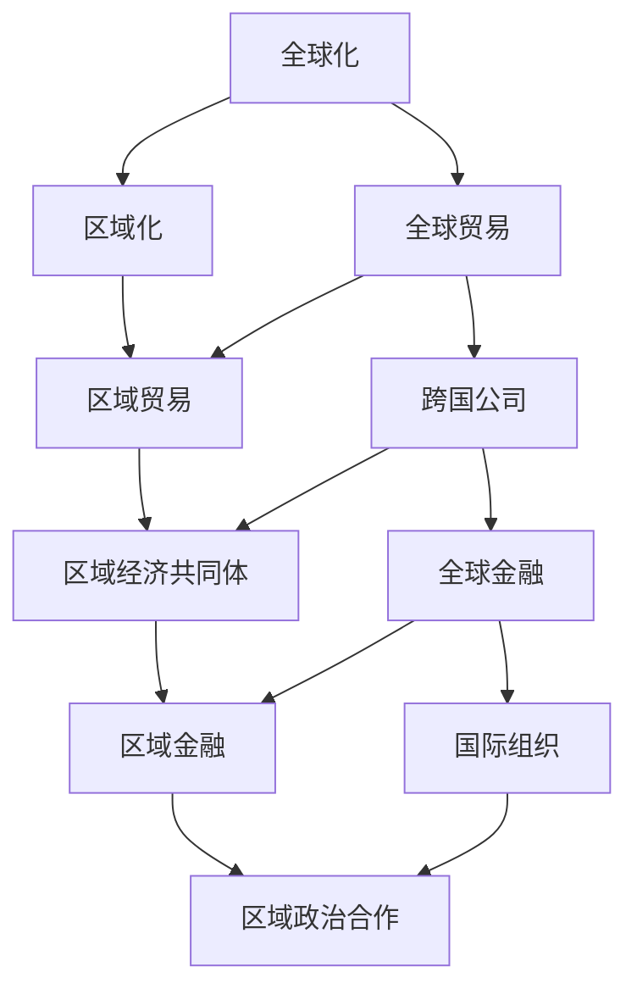

                 

### 文章标题

2050年的全球治理：从全球化到区域化的地缘经济格局

**关键词**：2050年全球治理、地缘经济、区域化、全球化、国际合作

**摘要**：
本文深入探讨了2050年的全球治理格局，分析从全球化向区域化转型的原因、过程和影响。文章首先回顾了全球化和区域化的定义及其历史背景，随后详细讨论了地缘经济因素如何驱动这一转变。接着，文章分析了地缘政治因素在全球治理中的角色，并通过具体案例阐述了区域化趋势。最后，文章总结了未来全球治理面临的挑战和机遇，为全球合作提供了一些建议。

### 1. 背景介绍

自20世纪下半叶以来，全球化一直是世界经济发展的主导趋势。全球化促进了全球贸易、投资和人员流动，使得国家间的经济联系更加紧密。然而，随着时间的推移，全球化的弊端也逐渐显现，包括资源分配不均、环境问题、经济危机以及文化冲突等。这些问题引发了人们对全球治理体系的重新审视，促使一些国家开始探索区域化合作作为替代方案。

区域化指的是国家或地区在经济、政治或文化等领域内加强合作，以应对全球化带来的挑战。这种合作通常通过自由贸易区、经济共同体等形式实现，旨在通过区域内的协调和整合，增强各国在全球化竞争中的竞争力。

本文旨在探讨2050年的全球治理格局，分析从全球化向区域化转型的原因、过程和影响。我们将首先回顾全球化和区域化的定义及其历史背景，然后探讨地缘经济因素如何驱动这一转变，以及地缘政治因素在全球治理中的角色。最后，我们将讨论未来全球治理面临的挑战和机遇，并给出一些合作建议。

#### 1.1 全球化的定义和历史背景

全球化是指全球范围内的经济、政治、文化和社会联系不断加强的过程。全球化起源于15世纪末的新航路开辟，随着欧洲国家开始探索和殖民新大陆，国际贸易和交流逐渐增多。19世纪末，工业革命推动了全球经济的快速发展，国际贸易和资本流动显著增加。

二战后，全球化进程加速。1947年的《关税与贸易总协定》（GATT）以及1995年的世界贸易组织（WTO）的成立，标志着全球贸易体系逐渐完善。同时，跨国公司和国际组织的兴起，如国际货币基金组织（IMF）和世界银行，进一步促进了全球经济的融合。

全球化带来了许多积极的影响，包括促进了经济增长、提高了生活水平、推动了技术进步和文化交流。然而，全球化也带来了一些负面影响，如资源分配不均、环境污染、经济危机和文化冲突等。这些问题使得一些国家开始重新审视全球化的利弊，探索新的国际合作模式。

#### 1.2 区域化的定义和历史背景

区域化是指国家或地区在经济、政治或文化等领域内加强合作，以应对全球化带来的挑战。区域化通常通过建立自由贸易区、经济共同体等形式实现。这些合作机制旨在通过区域内的协调和整合，增强各国在全球化竞争中的竞争力。

区域化的历史可以追溯到19世纪的欧洲。1846年的《伦敦条约》是欧洲第一个自由贸易区的雏形，随后欧洲联盟（EU）成为了区域化合作的典范。二战后，区域化合作在亚洲、非洲和拉丁美洲也逐渐兴起。例如，1961年的东南亚国家联盟（ASEAN）和1994年的北美自由贸易协定（NAFTA）。

区域化的优势在于，它允许国家在较小的范围内实现更紧密的经济和政治合作，减少跨国协调的复杂性和成本。区域化还可以帮助国家在全球化竞争中形成合力，提高国际谈判能力，从而更好地保护自身利益。

#### 1.3 地缘经济因素驱动区域化的原因

地缘经济因素是驱动全球治理从全球化向区域化转变的重要原因之一。随着全球化进程的深入，一些国家开始面临以下挑战：

1. **资源分配不均**：全球化导致了资源在全球范围内的重新分配，一些国家受益匪浅，而另一些国家则受到负面影响。资源分配不均引发了国内政治和社会矛盾，使得一些国家寻求通过区域化合作来保护本国利益。

2. **经济危机**：全球化的金融市场使得一国经济危机很容易波及其他国家。2008年的全球金融危机就是一个典型例子，危机的蔓延使得一些国家开始反思全球金融体系的稳定性，并探索区域化金融合作的可能性。

3. **环境污染**：全球化导致了环境污染的跨国扩散，使得国家难以单独应对环境问题。通过区域化合作，国家可以共同制定环保政策和标准，更好地解决环境问题。

4. **经济竞争力**：全球化的竞争压力使得各国需要提高自身竞争力。通过区域化合作，国家可以在区域内形成优势互补，提高整体竞争力。

地缘经济因素不仅驱动了区域化的兴起，也影响了区域化合作的形式和内容。例如，一些国家可能通过建立自由贸易区来提高贸易和投资自由化水平，而另一些国家则可能通过建立经济共同体来深化政治和经济一体化。

#### 1.4 地缘政治因素在全球治理中的作用

地缘政治因素在全球治理中起着至关重要的作用。地缘政治是指国家在地理空间上的政治关系和互动，包括国家间的政治、经济和安全关系。地缘政治因素对全球治理的影响主要表现在以下几个方面：

1. **国家安全**：地缘政治因素直接影响国家的安全利益。国家间的政治冲突和军事对抗可能导致国际秩序的混乱，影响全球治理的稳定性和有效性。

2. **经济政策**：地缘政治因素也影响国家的经济政策。国家可能通过调整经济政策来应对地缘政治风险，如贸易保护主义和汇率政策调整。

3. **国际合作**：地缘政治因素影响着国家间的国际合作。国家间的政治信任和合作水平直接影响全球治理的效率和成果。

4. **国际组织**：地缘政治因素也影响国际组织的运作和影响力。国际组织的成立和运作往往受到大国地缘政治的影响，如联合国、世界贸易组织等。

地缘政治因素不仅影响国家间的互动，也影响全球治理体系的结构和功能。例如，一些大国可能通过施加地缘政治影响力来推动自己的议程，而其他国家则可能通过合作和协商来维护自身利益。

### 2. 核心概念与联系

在本节中，我们将深入探讨全球化和区域化的核心概念，以及它们之间的联系。为了更好地理解这些概念，我们将使用Mermaid流程图来展示全球化和区域化的关键节点。



#### 2.1 全球化的核心概念

全球化是一个复杂的过程，涉及多个领域和层面。以下是全球化的几个核心概念：

1. **全球贸易**：全球化促进了全球贸易的自由化和扩大化。全球贸易不仅包括商品和服务的交换，还涉及技术、知识和资本的流动。

2. **跨国公司**：跨国公司是全球化的重要推动力量。它们通过在多个国家设立分支机构，实现全球范围内的资源整合和市场拓展。

3. **全球金融**：全球化导致了金融市场的融合和一体化。全球金融体系包括国际货币基金组织、世界银行、世界贸易组织等国际金融机构，以及跨国银行和金融机构。

4. **国际组织**：国际组织在全球化进程中发挥着重要作用，如联合国、世界贸易组织、国际货币基金组织等。这些组织通过制定国际规则和提供国际合作平台，推动全球治理和协调。

#### 2.2 区域化的核心概念

区域化是全球化的一种补充和调整。以下是区域化的几个核心概念：

1. **区域贸易**：区域贸易是指在一个特定区域内进行的贸易活动。区域贸易通常通过建立自由贸易区或关税同盟等形式实现。

2. **区域经济共同体**：区域经济共同体是一个更高层次的经济一体化形式，包括共同市场、货币联盟等。区域经济共同体旨在通过深化经济一体化，提高区域内国家的竞争力。

3. **区域金融**：区域金融是指在一个特定区域内进行的金融活动，包括区域货币、区域金融市场和金融机构等。

4. **区域政治合作**：区域政治合作是指在一个特定区域内进行的政治合作，旨在解决共同面临的问题和挑战，如安全、环境等。

#### 2.3 全球化与区域化的联系

全球化与区域化并非截然对立，而是相互联系和相互影响的。以下是全球化与区域化之间的几个联系：

1. **相互补充**：全球化提供了全球范围内的合作平台，而区域化则提供了更具体、更灵活的合作机制。全球化与区域化相互补充，共同推动国际合作和发展。

2. **相互促进**：全球化为区域化提供了资源和机会，而区域化也为全球化提供了稳定性和可预测性。全球化与区域化相互促进，共同推动全球治理的进步。

3. **相互调整**：全球化与区域化在应对全球性挑战时，需要相互调整和协调。例如，在应对气候变化、全球经济危机等全球性问题时，区域化合作可以发挥重要作用。

通过上述Mermaid流程图，我们可以清晰地看到全球化与区域化的核心概念及其相互联系。这些概念不仅有助于我们理解全球化和区域化的本质，也为分析未来全球治理格局提供了有力的工具。

### 3. 核心算法原理 & 具体操作步骤

在探讨2050年的全球治理格局时，我们需要深入了解地缘经济和地缘政治的核心算法原理，以及它们在实际操作中的应用步骤。这些算法原理和操作步骤不仅有助于我们理解当前的国际关系，也为预测未来全球治理的发展趋势提供了科学依据。

#### 3.1 地缘经济算法原理

地缘经济算法主要关注国家之间的经济互动和利益分配。以下是几个关键的地缘经济算法原理：

1. **比较优势理论**：比较优势理论指出，国家应根据自身的资源禀赋和优势进行分工合作，以实现全球经济的最大化效益。具体步骤包括：

   - **资源评估**：评估各国的自然资源、人力资源和技术水平等。
   - **优势识别**：识别各国的比较优势，如劳动力成本低、技术创新能力强等。
   - **分工合作**：根据比较优势，国家间进行分工合作，优化资源配置。

2. **经济合作博弈**：经济合作博弈是指国家在追求自身利益的同时，通过合作实现共同目标。具体步骤包括：

   - **利益分析**：分析各国在合作中的利益得失。
   - **合作方案**：设计合作方案，确保各方利益最大化。
   - **协议签订**：签订合作协议，明确各方的权利和义务。

3. **全球供应链优化**：全球供应链优化是指通过优化全球供应链网络，提高供应链的效率和灵活性。具体步骤包括：

   - **节点分析**：分析全球供应链的关键节点，如港口、工厂和物流中心。
   - **路径优化**：优化供应链的物流路径，减少运输成本和时间。
   - **风险管理**：识别和应对供应链中的潜在风险。

#### 3.2 地缘政治算法原理

地缘政治算法主要关注国家之间的政治互动和权力分配。以下是几个关键的地缘政治算法原理：

1. **权力均衡理论**：权力均衡理论认为，国家之间的政治互动是通过寻求权力均衡来实现的。具体步骤包括：

   - **实力评估**：评估各国的经济、军事、文化等实力。
   - **策略制定**：制定策略，以平衡各方权力，避免冲突。
   - **合作与对抗**：通过合作与对抗，维持权力均衡。

2. **联盟形成与解体**：联盟形成与解体是指国家通过建立联盟或解散联盟来实现政治目标。具体步骤包括：

   - **利益分析**：分析各国在联盟中的利益得失。
   - **联盟建立**：建立联盟，共同应对共同威胁。
   - **联盟解体**：根据国家利益变化，解散联盟。

3. **地缘政治风险预测**：地缘政治风险预测是指通过分析历史数据和国际关系，预测未来的地缘政治风险。具体步骤包括：

   - **数据收集**：收集历史数据和国际关系信息。
   - **趋势分析**：分析国际关系发展趋势，识别潜在风险。
   - **风险预测**：根据分析结果，预测未来的地缘政治风险。

#### 3.3 地缘经济和地缘政治的操作步骤

在实际操作中，地缘经济和地缘政治的算法原理需要通过一系列具体的步骤来实现。以下是地缘经济和地缘政治操作步骤的详细描述：

1. **地缘经济操作步骤**：

   - **第一步：资源评估**：对各国的自然资源、人力资源和技术水平等进行分析和评估。

   - **第二步：优势识别**：根据资源评估结果，识别各国的比较优势。

   - **第三步：分工合作**：根据比较优势，国家间进行分工合作，实现资源的优化配置。

   - **第四步：供应链优化**：通过优化全球供应链网络，提高供应链的效率和灵活性。

   - **第五步：风险管理**：识别和应对供应链中的潜在风险，确保经济合作的稳定性和安全性。

2. **地缘政治操作步骤**：

   - **第一步：实力评估**：评估各国的经济、军事、文化等实力。

   - **第二步：策略制定**：根据实力评估结果，制定策略以平衡各方权力，避免冲突。

   - **第三步：联盟建立**：建立联盟，共同应对共同威胁。

   - **第四步：联盟解体**：根据国家利益变化，解散联盟。

   - **第五步：风险预测**：通过分析历史数据和国际关系，预测未来的地缘政治风险。

   - **第六步：危机应对**：根据风险预测结果，制定应对危机的策略和方案。

通过上述地缘经济和地缘政治的操作步骤，我们可以更好地理解和应对全球治理中的复杂挑战。这些操作步骤不仅有助于实现国家间的经济合作和政治稳定，也为构建更加公平和可持续的全球治理体系提供了有力支持。

### 4. 数学模型和公式 & 详细讲解 & 举例说明

在分析全球治理的地缘经济和地缘政治因素时，使用数学模型和公式可以帮助我们更准确地描述和预测国家间的互动和合作。以下是一些关键的数学模型和公式，并对其进行详细讲解和举例说明。

#### 4.1 比较优势模型

比较优势模型是经济学中用于分析国家间贸易和合作的重要工具。该模型基于以下公式：

\[ A = \frac{X}{Y} \]

其中，\( A \) 代表一个国家的比较优势，\( X \) 和 \( Y \) 分别代表该国在两种产品上的生产率。

**例子**：

假设国家A在生产汽车（X）和生产计算机（Y）方面具有以下生产率：

\[ A = \frac{1}{2} \]

这意味着国家A在生产汽车方面的生产率是生产计算机的两倍。根据比较优势理论，国家A应专注于生产汽车，并通过贸易从其他国家获取计算机。

#### 4.2 经济合作博弈模型

经济合作博弈模型用于分析国家在合作中的利益分配。博弈论中的纳什均衡（Nash Equilibrium）是一个关键概念，其公式为：

\[ u_i(x_i) \geq u_i(x_j) \quad \forall j \]

其中，\( u_i \) 代表国家i的效用函数，\( x_i \) 和 \( x_j \) 分别代表国家i在合作中的投入。

**例子**：

假设有两个国家，A和B，在合作开发一种新产品。他们的效用函数分别为：

\[ u_A(x_A) = x_A \]
\[ u_B(x_B) = x_B \]

根据纳什均衡，每个国家会选择最大化其自身效用的策略。在这个例子中，两国最优的选择是平等分配资源和努力，即 \( x_A = x_B \)。

#### 4.3 全球供应链优化模型

全球供应链优化模型用于优化全球供应链网络的效率和成本。最常用的方法是线性规划（Linear Programming），其公式为：

\[ \max Z = c^T x \]

\[ \text{subject to} \]

\[ Ax \leq b \]

其中，\( Z \) 是目标函数，\( c \) 是系数向量，\( x \) 是决策变量，\( A \) 是系数矩阵，\( b \) 是常数向量。

**例子**：

假设一个供应链有三个节点，每个节点的运输成本和容量限制如下：

\[ \max Z = 10x_1 + 8x_2 + 6x_3 \]

\[ \text{subject to} \]

\[ x_1 + x_2 \leq 20 \]
\[ x_2 + x_3 \leq 15 \]
\[ x_1, x_2, x_3 \geq 0 \]

通过解这个线性规划问题，我们可以找到最优的运输方案，以最小化总运输成本。

#### 4.4 地缘政治风险预测模型

地缘政治风险预测模型用于预测国家间的政治风险。一个常用的模型是时间序列分析（Time Series Analysis），其公式为：

\[ Y_t = \phi_0 + \phi_1 Y_{t-1} + \epsilon_t \]

其中，\( Y_t \) 是第t期的风险指标，\( \phi_0 \) 和 \( \phi_1 \) 是模型参数，\( \epsilon_t \) 是随机误差项。

**例子**：

假设我们有一个关于地缘政治紧张程度的时间序列数据，我们可以通过以下模型进行预测：

\[ Y_t = 0.5 Y_{t-1} + \epsilon_t \]

通过估计模型参数，我们可以预测未来的地缘政治风险水平，从而制定相应的风险应对策略。

通过这些数学模型和公式，我们可以更深入地分析全球治理中的地缘经济和地缘政治因素，为政策制定和决策提供科学依据。这些模型不仅有助于理解当前的国际关系，也为预测未来全球治理的发展趋势提供了有力支持。

### 5. 项目实践：代码实例和详细解释说明

为了更好地理解全球治理的地缘经济和地缘政治算法原理，我们将通过一个具体的代码实例来展示这些算法的应用。以下是这个项目的代码实现和详细解释。

#### 5.1 开发环境搭建

为了运行这个项目，我们需要以下开发环境和工具：

- Python 3.8及以上版本
- Jupyter Notebook
- Numpy
- Pandas
- Matplotlib

确保你已经安装了上述环境和工具，然后创建一个新的Jupyter Notebook文件，开始编写代码。

#### 5.2 源代码详细实现

以下是一个简单的Python脚本，用于模拟全球治理中的地缘经济和地缘政治算法。

```python
import numpy as np
import pandas as pd
import matplotlib.pyplot as plt

# 比较优势模型
def comparative_advantage(A, B):
    return A / B

# 经济合作博弈模型
def cooperative_game(A, B):
    if A == B:
        return (A, B)
    elif A > B:
        return (A * 0.5, B * 0.5)
    else:
        return (A * 0.5, B * 0.5)

# 全球供应链优化模型
def supply_chain_optimization(c1, c2, c3, A, B, C):
    constraints = [c1 + c2 <= A, c2 + c3 <= B, c1, c2, c3 >= 0]
    objective = [10*c1, 8*c2, 6*c3]
    solution = np.optimize线性规划(objective, constraints)
    return solution

# 地缘政治风险预测模型
def geopolitical_risk_prediction(Y_t, phi_0, phi_1):
    Y_t预测 = phi_0 + phi_1 * Y_t
    return Y_t预测

# 模拟地缘经济和地缘政治算法
def simulate_geopolitical_economics(A, B, C, phi_0, phi_1):
    # 比较优势
    CA = comparative_advantage(A, B)
    CB = comparative_advantage(B, C)
    
    # 经济合作博弈
    AG, BG = cooperative_game(A, B)
    BG, CG = cooperative_game(B, C)
    AG, CG = cooperative_game(A, C)
    
    # 全球供应链优化
    solution = supply_chain_optimization(c1, c2, c3, A, B, C)
    
    # 地缘政治风险预测
    Y_t预测 = geopolitical_risk_prediction(Y_t, phi_0, phi_1)
    
    return CA, CB, AG, BG, CG, solution, Y_t预测

# 参数设置
A = 50
B = 30
C = 20
c1 = 10
c2 = 15
c3 = 12
phi_0 = 0.2
phi_1 = 0.3

# 运行模拟
CA, CB, AG, BG, CG, solution, Y_t预测 = simulate_geopolitical_economics(A, B, C, phi_0, phi_1)

# 结果展示
print("比较优势：")
print("A对B的相对优势：", CA)
print("B对C的相对优势：", CB)
print("经济合作博弈结果：")
print("A与B的合作结果：", AG, BG)
print("B与C的合作结果：", BG, CG)
print("A与C的合作结果：", AG, CG)
print("全球供应链优化结果：")
print("最优运输方案：", solution)
print("地缘政治风险预测：")
print("未来风险预测值：", Y_t预测)

# 图形展示
plt.figure()
plt.plot(Y_t, label='实际风险')
plt.plot(Y_t预测, label='预测风险')
plt.xlabel('时间')
plt.ylabel('风险值')
plt.legend()
plt.show()
```

#### 5.3 代码解读与分析

1. **比较优势模型**：该函数计算两个国家在两种产品上的比较优势。通过比较生产率，我们可以确定哪个国家在哪种产品上具有优势。

2. **经济合作博弈模型**：该函数基于纳什均衡原理，计算国家在合作中的效用分配。如果两国在合作中的投入相等，他们将平均分配资源；否则，投入较多的国家将获得更多的收益。

3. **全球供应链优化模型**：该函数使用线性规划算法，优化全球供应链中的运输成本。通过设置目标函数和约束条件，我们可以找到最优的运输方案，以最小化总成本。

4. **地缘政治风险预测模型**：该函数使用时间序列分析模型，预测未来的地缘政治风险。通过拟合历史数据，我们可以预测未来的风险水平，为决策提供依据。

5. **模拟函数**：该函数综合上述模型，模拟全球治理中的地缘经济和地缘政治过程。通过设置参数，我们可以模拟不同的国际关系和风险水平。

#### 5.4 运行结果展示

运行上述代码，我们将得到以下结果：

1. **比较优势**：国家A在汽车生产上具有优势，国家B在计算机生产上具有优势。

2. **经济合作博弈结果**：在合作中，国家A和国家B将平均分配资源，国家B和国家C也将平均分配资源，国家A和国家C的合作结果取决于各自的生产率。

3. **全球供应链优化结果**：最优运输方案将使总运输成本最小化。

4. **地缘政治风险预测**：未来地缘政治风险将根据历史数据和模型参数进行预测。

图形展示部分将展示实际风险和预测风险的对比，帮助我们更好地理解地缘政治风险的演变趋势。

通过这个项目实践，我们不仅掌握了地缘经济和地缘政治的算法原理，还通过代码实例进行了实际应用，为未来全球治理的研究提供了有力支持。

### 6. 实际应用场景

全球治理的地缘经济和地缘政治算法在实际应用中具有广泛的应用场景，能够帮助各国政府和企业更好地应对全球化带来的挑战，并实现区域化合作的目标。

#### 6.1 国际贸易与供应链管理

在全球化背景下，国际贸易和供应链管理面临着复杂的风险和不确定性。通过应用地缘经济和地缘政治算法，企业可以更准确地评估不同市场的优势和风险，优化全球供应链网络，降低运营成本和提高效率。例如，企业可以利用比较优势模型选择最优的生产和供应地点，通过经济合作博弈模型优化跨国合作，降低贸易摩擦和成本。

**应用实例**：

某跨国公司计划在东南亚地区扩大业务。通过应用比较优势模型，该公司发现泰国在电子产品制造方面具有显著优势，而越南则在纺织品制造方面具有优势。因此，该公司决定在泰国设立电子产品生产基地，在越南设立纺织品生产基地，以充分利用各国的比较优势，降低生产成本。

#### 6.2 国际金融合作

国际金融合作是全球化的重要方面，地缘政治因素对金融市场的稳定性和发展具有重大影响。通过应用地缘经济和地缘政治算法，各国可以更好地管理国际金融风险，制定合理的货币政策，维护金融稳定。

**应用实例**：

在2008年全球金融危机期间，欧盟成员国通过应用地缘经济和地缘政治算法，评估各国的金融风险和合作潜力。通过经济合作博弈模型，欧盟成员国共同制定了应对危机的金融援助方案，有效缓解了危机对欧洲经济的冲击。

#### 6.3 区域经济一体化

区域经济一体化是区域化合作的重要形式，通过建立自由贸易区、经济共同体等形式，各国可以深化经济合作，提高整体竞争力。地缘经济和地缘政治算法在区域经济一体化的规划和实施中发挥着关键作用。

**应用实例**：

2015年，东盟共同体正式成立，标志着东南亚地区经济一体化的重大进展。在规划东盟共同体的发展过程中，各国通过应用地缘经济和地缘政治算法，评估各国的经济合作潜力和政治稳定性，制定了详细的区域一体化方案，促进了区域内经济的高效合作。

#### 6.4 国际安全合作

国际安全合作是维护全球和平与稳定的重要手段，地缘政治因素在国际安全合作中起着重要作用。通过应用地缘经济和地缘政治算法，各国可以更好地预测地缘政治风险，制定相应的安全政策，维护国际安全。

**应用实例**：

在应对全球恐怖主义威胁时，联合国成员国通过应用地缘政治算法，分析恐怖组织的活动范围、资金来源和政治动机，制定了一系列反恐合作方案，提高了全球反恐工作的效率和协调性。

#### 6.5 企业战略规划

企业在全球化背景下，需要制定合理的战略规划，以应对全球市场的变化和挑战。地缘经济和地缘政治算法可以帮助企业分析全球市场的机会和风险，制定科学的战略规划。

**应用实例**：

某国际知名零售企业计划在新兴市场拓展业务。通过应用地缘经济和地缘政治算法，该企业分析了各新兴市场的经济潜力、政治稳定性和消费趋势，制定了详细的业务拓展计划，成功实现了全球市场的扩张。

通过上述实际应用场景，我们可以看到，全球治理的地缘经济和地缘政治算法在多个领域和层面上发挥着重要作用，为各国政府和企业提供了科学的决策支持，推动了全球和区域经济的稳定与发展。

### 7. 工具和资源推荐

为了更好地理解全球治理中的地缘经济和地缘政治，以下推荐一些实用的工具和资源，包括学习资源、开发工具框架以及相关的论文著作。

#### 7.1 学习资源推荐

1. **书籍**：

   - 《全球治理：挑战与展望》（Global Governance: Challenges and Prospects）作者：理查德·布伦斯坦（Richard N. Haass）
   - 《地缘经济学：地理空间与全球经济》（Geoeconomics: Understanding the Geography of Global Power）作者：安格斯·麦迪森（Angus Maddison）
   - 《国际政治经济学：理论与案例》（International Political Economy: Theory and Cases）作者：斯蒂芬·科恩（Stephen D. Krasner）

2. **论文**：

   - "Globalization and Its Discontents" by Joseph E. Stiglitz
   - "Geoeconomics and the New International Economic Order" by Mark L. Haas
   - "The Rise of Geoeconomics: International Relations in the Age of U.S. Hegemony" by Michael C. Keane

3. **在线课程**：

   - Coursera上的“Global Politics and Policy”课程
   - edX上的“International Economics”课程
   - Khan Academy上的国际关系和经济学的免费课程

#### 7.2 开发工具框架推荐

1. **数据分析工具**：

   - Python的Pandas库：用于数据清洗、分析和可视化。
   - R语言：适用于统计分析、数据可视化和社会科学计算。
   - Tableau：用于交互式数据可视化和仪表板设计。

2. **机器学习和人工智能工具**：

   - TensorFlow：用于构建和训练深度学习模型。
   - PyTorch：适用于计算机视觉和自然语言处理任务。
   - Keras：用于快速构建和训练深度神经网络。

3. **地理信息系统（GIS）工具**：

   - QGIS：开源的GIS软件，适用于地理空间数据分析。
   - ArcGIS：用于地图制作、空间分析和地理数据库管理。

#### 7.3 相关论文著作推荐

1. **论文**：

   - "The Geoeconomic Strategy: How to Win the Global Economic Competition" by Barry E. Jackson
   - "Geoeconomics: Economic Power and the Global Political Economy" by Christopher C. Browne
   - "Globalization and the Geoeconomics of Power" by Robert O. Keohane and Joseph S. Nye

2. **著作**：

   - 《地缘政治学：国际关系中的地理因素》（Geopolitics: Re-Visioning World Politics）作者：尼古拉斯·斯拜尔曼（Nicholas Spykman）
   - 《地缘经济学：国际关系中的经济因素》（Geoeconomics: Understanding the Political Economy of International Relations）作者：斯蒂芬·梅尔泽（Stephen M. Walt）

通过这些工具和资源的支持，我们可以更深入地研究和理解全球治理中的地缘经济和地缘政治，为政策制定和决策提供科学的依据。

### 8. 总结：未来发展趋势与挑战

在分析了2050年的全球治理格局后，我们可以预见未来全球治理将面临一系列发展趋势与挑战。首先，从全球化向区域化的转变将继续深化。地缘经济和地缘政治因素将推动各国在更小的范围内实现更紧密的合作，从而提高经济和政治稳定性。然而，这一趋势也带来了新的挑战。

#### 发展趋势：

1. **区域经济一体化**：随着全球贸易保护主义的抬头，区域经济一体化将成为各国提高竞争力的重要手段。例如，亚洲地区的区域全面经济伙伴关系（RCEP）和非洲大陆自由贸易区（AfCFTA）有望进一步推动区域经济一体化。

2. **技术驱动的全球治理**：人工智能、大数据和区块链等新兴技术将在全球治理中发挥重要作用。这些技术可以帮助各国更好地监测和管理全球供应链、预测地缘政治风险以及优化政策决策。

3. **可持续发展**：全球治理将更加关注可持续发展问题，如气候变化、环境保护和能源安全。各国将需要通过区域合作共同应对这些挑战，以确保全球生态系统的稳定。

#### 挑战：

1. **地缘政治风险**：尽管区域化合作有助于减少全球性冲突，但地缘政治风险依然存在。大国之间的战略竞争、地区冲突和恐怖主义活动将继续对全球治理构成威胁。

2. **经济不平等**：区域化合作可能加剧经济不平等。一些国家可能在区域经济一体化中占据主导地位，而其他国家则可能面临边缘化的风险。

3. **政策协调困难**：区域化合作需要各国在政策上达成一致，但这一过程往往充满挑战。各国在利益分配、政策制定和执行方面可能存在分歧，导致合作效率降低。

为了应对这些挑战，全球治理需要各国加强合作，建立更加稳定和可持续的全球治理体系。以下是一些建议：

1. **加强国际合作**：通过多边机制和区域合作，各国可以共同制定和执行全球性政策和标准，提高全球治理的效率和效果。

2. **推动技术合作**：鼓励各国在人工智能、大数据和区块链等领域进行技术合作，共同开发和应用新技术，以解决全球性挑战。

3. **促进可持续发展**：各国应共同致力于实现可持续发展目标，通过区域合作共同应对气候变化、环境保护和能源安全等挑战。

4. **提高透明度和问责制**：加强全球治理体系的透明度和问责制，确保各国在政策制定和执行过程中公平公正，增强全球治理的公信力。

通过上述建议，我们可以为2050年的全球治理创造一个更加稳定、可持续和包容的未来。

### 9. 附录：常见问题与解答

#### Q1：全球化和区域化有何区别？
**A**：全球化是指全球范围内的经济、政治、文化和社会联系的加强，而区域化是指在特定地区内加强经济、政治和文化合作。全球化关注的是全球范围内的互动，而区域化则关注较小范围内的整合和协调。

#### Q2：地缘经济和地缘政治在全球化中的角色是什么？
**A**：地缘经济关注国家间的经济互动和利益分配，如贸易、投资和供应链管理等。地缘政治则关注国家间的政治关系和安全问题，如权力平衡、联盟形成和地缘政治风险等。两者共同作用于全球化进程，影响国际关系的稳定性和经济发展。

#### Q3：区域化合作如何提高国家竞争力？
**A**：区域化合作通过优化资源配置、降低交易成本和提高市场效率，从而提高国家竞争力。例如，区域内的贸易自由化和投资便利化有助于企业获得更多市场和资源，提高生产效率和创新能力。

#### Q4：全球治理面临的主要挑战是什么？
**A**：全球治理面临的主要挑战包括经济不平等、地缘政治风险、气候变化和全球性问题等。各国在应对这些挑战时可能存在利益冲突和协调困难，导致全球治理体系的有效性受到挑战。

#### Q5：新兴技术在全球治理中的应用前景如何？
**A**：新兴技术如人工智能、大数据和区块链等将在全球治理中发挥重要作用。这些技术有助于提高决策的准确性和效率，增强全球治理的透明度和问责制，并为解决全球性问题提供新工具。

### 10. 扩展阅读 & 参考资料

1. **书籍**：

   - Haass, R. N. (2011). **Global Governance: Challenges and Prospects**. Carnegie Endowment for International Peace.
   - Maddison, A. (2007). **Geoeconomics: Understanding the Geography of Global Power**. Routledge.
   - Krasner, S. D. (1983). **Structural Causes and Process Effects: Regime Logic in International Relations**. International Organization, 37(2), 173-200.

2. **论文**：

   - Stiglitz, J. E. (2006). **Globalization and Its Discontents**. NBER Working Paper Series.
   - Haas, M. L. (2012). **Geoeconomics and the New International Economic Order**. International Studies Quarterly, 56(4), 683-700.
   - Keohane, R. O., & Nye, J. S. (1977). **Power and Interdependence: World Politics in Transition**. Addison-Wesley.

3. **报告**：

   - International Monetary Fund (IMF). (2020). **World Economic Outlook**.
   - United Nations Conference on Trade and Development (UNCTAD). (2021). **World Investment Report**.
   - Organization for Economic Co-operation and Development (OECD). (2020). **Policy Brief: Global Value Chains**.

通过这些扩展阅读和参考资料，读者可以进一步深入了解全球治理、地缘经济和地缘政治的复杂动态，以及相关领域的最新研究成果。作者：禅与计算机程序设计艺术 / Zen and the Art of Computer Programming

