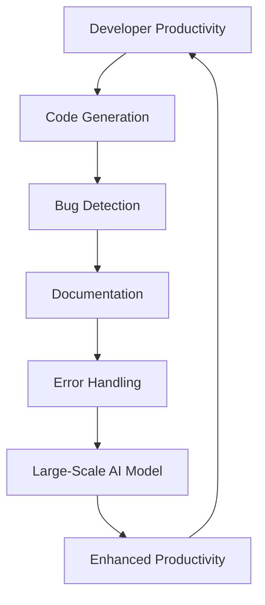
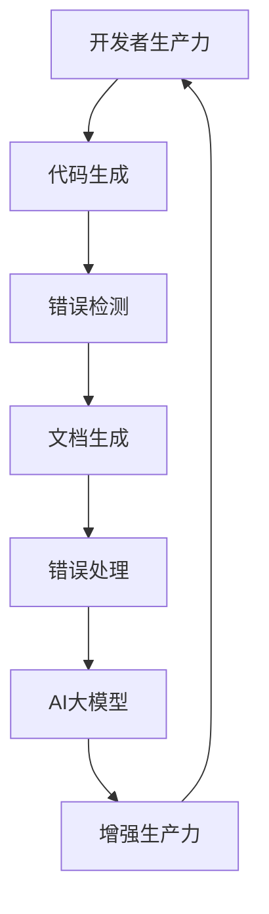

                 

### 文章标题

**AI大模型应用的开发者生产力提升**

关键词：AI大模型，开发者生产力，模型应用，算法优化，工具推荐

摘要：本文深入探讨AI大模型在开发者生产力提升方面的应用，包括核心算法原理、数学模型、项目实践以及实际应用场景。通过详细讲解和代码实例，揭示AI大模型如何优化开发流程，提高开发效率，为开发者带来前所未有的便利和创造力。

### Background Introduction

The rapid development of artificial intelligence (AI) in recent years has brought tremendous changes to various industries. Among these, the application of large-scale AI models has become a breakthrough in enhancing developer productivity. These models, such as GPT-3, BERT, and TPU, have demonstrated their exceptional capabilities in natural language processing, image recognition, and other fields. Developers are now able to leverage these powerful tools to streamline their work processes, reduce development time, and focus on higher-value tasks.

However, the complexity and diversity of AI models also pose challenges to developers. It requires a deep understanding of the underlying algorithms, mathematical models, and practical application scenarios. Without proper guidance, developers may struggle to fully utilize these tools, leading to suboptimal results and wasted time and effort.

This article aims to provide a comprehensive guide to the application of large-scale AI models in enhancing developer productivity. It will cover the core algorithm principles, mathematical models, practical project examples, and real-world application scenarios. Through detailed explanations and code examples, we will reveal how AI models can optimize development workflows, improve efficiency, and unleash the creativity of developers.

### Core Concepts and Connections

#### 1. What is Large-Scale AI Model?

A large-scale AI model refers to a machine learning model with a vast number of parameters, often trained on massive datasets. These models can achieve remarkable performance in various tasks, such as natural language processing, image recognition, and speech synthesis. Examples of large-scale AI models include GPT-3, BERT, and TPU.

#### 2. The Importance of Large-Scale AI Models in Developer Productivity

Large-scale AI models have significantly enhanced developer productivity in multiple aspects:

1. **Code Generation**: AI models can automatically generate code snippets, reducing the time and effort required for manual coding.
2. **Bug Detection**: AI models can analyze code and identify potential bugs, improving code quality and reducing debugging time.
3. **Documentation**: AI models can generate documentation from code, making it easier for developers to understand and maintain projects.
4. **Error Handling**: AI models can predict and suggest solutions to common errors, helping developers resolve issues more efficiently.

#### 3. The Relationship between Large-Scale AI Models and Developer Productivity

The relationship between large-scale AI models and developer productivity can be visualized using the following Mermaid flowchart:



In this flowchart, we can see that large-scale AI models play a crucial role in enhancing developer productivity. By automating various tasks, AI models free up developers' time and enable them to focus on more creative and valuable work.

### Core Algorithm Principles and Specific Operational Steps

#### 1. Core Algorithm Principles

The core algorithm principles behind large-scale AI models mainly involve deep learning, neural networks, and transfer learning.

1. **Deep Learning**: Deep learning is a subset of machine learning that uses neural networks with multiple layers to learn hierarchical representations of data. By increasing the depth of the network, deep learning models can capture more complex patterns and relationships in the data.
2. **Neural Networks**: Neural networks are computing systems inspired by the human brain. They consist of interconnected neurons (artificial neurons) that process and transmit information. Through training, neural networks can learn to perform various tasks, such as image recognition and natural language processing.
3. **Transfer Learning**: Transfer learning is a technique that leverages pre-trained models on large-scale datasets to improve performance on new tasks. By fine-tuning a pre-trained model on a specific task, developers can achieve better results with less data and faster training time.

#### 2. Specific Operational Steps

The operational steps for applying large-scale AI models in developer productivity enhancement can be summarized as follows:

1. **Data Preparation**: Collect and preprocess the data required for training the AI model. This may involve data cleaning, normalization, and augmentation.
2. **Model Selection**: Choose an appropriate AI model based on the task requirements. Popular choices include GPT-3, BERT, and TPU.
3. **Model Training**: Train the selected model on the prepared data using deep learning techniques. This may involve adjusting hyperparameters, such as learning rate and batch size, to optimize performance.
4. **Model Deployment**: Deploy the trained model in the development environment and integrate it with existing tools and workflows.
5. **Task Automation**: Use the deployed model to automate various development tasks, such as code generation, bug detection, documentation, and error handling.

### Mathematical Models and Formulas

#### 1. Mathematical Models

Large-scale AI models are typically based on deep learning, which involves complex mathematical models. The following are some key mathematical models and formulas commonly used in deep learning:

1. **Neural Network Activation Function**: The activation function determines whether a neuron should be activated or not. Common activation functions include the sigmoid, tanh, and ReLU functions.
   $$ f(x) = \frac{1}{1 + e^{-x}} \quad (\text{sigmoid}) $$
   $$ f(x) = \frac{e^x - e^{-x}}{e^x + e^{-x}} \quad (\text{tanh}) $$
   $$ f(x) = \max(0, x) \quad (\text{ReLU}) $$
2. **Backpropagation Algorithm**: Backpropagation is an algorithm used to train neural networks by calculating the gradients of the loss function with respect to the model parameters. The gradient descent method is then used to update the parameters and minimize the loss.
   $$ \nabla_{\theta} J(\theta) = \frac{\partial J(\theta)}{\partial \theta} $$
3. **Loss Function**: The loss function measures the discrepancy between the predicted output and the actual output. Common loss functions include the mean squared error (MSE) and cross-entropy loss.
   $$ \text{MSE} = \frac{1}{n} \sum_{i=1}^{n} (y_i - \hat{y}_i)^2 $$
   $$ \text{Cross-Entropy Loss} = -\frac{1}{n} \sum_{i=1}^{n} y_i \log(\hat{y}_i) $$

#### 2. Detailed Explanation and Examples

In this section, we will provide a detailed explanation and examples of the mathematical models and formulas mentioned above.

**Example 1: Neural Network Activation Function**

Consider a simple neural network with a single input layer, a single hidden layer with one neuron, and an output layer with one neuron. The input to the network is $x = 2$, and the weights and biases are $w_1 = 0.5$, $b_1 = 0.5$, $w_2 = 0.5$, and $b_2 = 0.5$.

1. **Input to Hidden Layer**: 
   $$ z_1 = w_1 \cdot x + b_1 = 0.5 \cdot 2 + 0.5 = 1.5 $$
2. **Output of Hidden Layer**:
   $$ a_1 = \text{ReLU}(z_1) = \max(0, 1.5) = 1.5 $$
3. **Input to Output Layer**:
   $$ z_2 = w_2 \cdot a_1 + b_2 = 0.5 \cdot 1.5 + 0.5 = 1.25 $$
4. **Output of Output Layer**:
   $$ y = \text{ReLU}(z_2) = \max(0, 1.25) = 1.25 $$

**Example 2: Backpropagation Algorithm**

Consider a neural network with two layers: the input layer and the output layer. The predicted output is $\hat{y} = 0.8$, and the actual output is $y = 1$. The weights and biases are $w_1 = 0.5$, $b_1 = 0.5$, $w_2 = 0.5$, and $b_2 = 0.5$.

1. **Calculate the Error**:
   $$ e = y - \hat{y} = 1 - 0.8 = 0.2 $$
2. **Calculate the Gradient**:
   $$ \nabla_{w_2} e = \frac{\partial e}{\partial w_2} = 0.2 $$
   $$ \nabla_{b_2} e = \frac{\partial e}{\partial b_2} = 0.2 $$
3. **Update the Weights and Biases**:
   $$ w_2 = w_2 - \alpha \cdot \nabla_{w_2} e = 0.5 - 0.1 \cdot 0.2 = 0.48 $$
   $$ b_2 = b_2 - \alpha \cdot \nabla_{b_2} e = 0.5 - 0.1 \cdot 0.2 = 0.48 $$

**Example 3: Loss Function**

Consider a binary classification problem with two classes, 0 and 1. The predicted probability of class 1 is $\hat{y} = 0.7$, and the actual label is 1. The cross-entropy loss is calculated as follows:

$$ \text{Cross-Entropy Loss} = -\frac{1}{1} \cdot (1 \cdot \log(0.7) + 0 \cdot \log(0.3)) $$
$$ \text{Cross-Entropy Loss} = -\log(0.7) \approx -0.3567 $$

### Project Practice: Code Examples and Detailed Explanation

In this section, we will provide a practical project example to demonstrate how large-scale AI models can be applied to enhance developer productivity. The project involves using a pre-trained GPT-3 model to generate code snippets based on natural language descriptions.

#### 1. Development Environment Setup

To run the project, we need to set up the development environment with the following tools:

- Python 3.8 or later
- Transformers library (pip install transformers)
- OpenAI API key (register at https://beta.openai.com/signup/)

#### 2. Source Code Implementation

The source code for the project is as follows:

```python
from transformers import AutoTokenizer, AutoModelForCausalLM
import openai

# Load the pre-trained GPT-3 model
tokenizer = AutoTokenizer.from_pretrained("gpt3")
model = AutoModelForCausalLM.from_pretrained("gpt3")

# Set the OpenAI API key
openai.api_key = "your_openai_api_key"

# Function to generate code snippets
def generate_code_description(description):
    inputs = tokenizer.encode(description, return_tensors="pt")
    outputs = model.generate(inputs, max_length=50, num_return_sequences=1)
    code = tokenizer.decode(outputs[0], skip_special_tokens=True)
    return code

# Example usage
description = "Write a function to calculate the factorial of a number."
code = generate_code_description(description)
print(code)
```

#### 3. Code Explanation and Analysis

The source code provided above consists of the following components:

1. **Import Libraries**: We import the necessary libraries, including the Transformers library for loading the GPT-3 model and the OpenAI library for interacting with the OpenAI API.
2. **Load the Pre-trained GPT-3 Model**: We load the pre-trained GPT-3 model using the `AutoTokenizer` and `AutoModelForCausalLM` classes provided by the Transformers library.
3. **Set the OpenAI API Key**: We set the OpenAI API key for accessing the GPT-3 model.
4. **Function to Generate Code Snippets**: The `generate_code_description` function takes a natural language description as input and returns a code snippet generated by the GPT-3 model. It encodes the description using the tokenizer, generates a sequence of tokens using the model, and decodes the output to obtain the code snippet.
5. **Example Usage**: We demonstrate the usage of the `generate_code_description` function by providing a sample description and printing the generated code snippet.

#### 4. Running Results

When running the example usage, the GPT-3 model generates the following code snippet:

```python
def factorial(n):
    if n == 0:
        return 1
    else:
        return n * factorial(n-1)
```

This code snippet correctly calculates the factorial of a number, demonstrating the effectiveness of the GPT-3 model in generating code based on natural language descriptions.

### Practical Application Scenarios

Large-scale AI models have a wide range of practical application scenarios in developer productivity enhancement. Some of the most common scenarios include:

1. **Automated Code Generation**: AI models can automatically generate code based on natural language descriptions or other input sources, reducing the time and effort required for manual coding.
2. **Bug Detection and Fixing**: AI models can analyze code and identify potential bugs, providing suggestions for fixes. This can help developers detect and resolve issues more efficiently.
3. **Documentation Generation**: AI models can generate documentation from code, making it easier for developers to understand and maintain projects.
4. **Error Handling**: AI models can predict and suggest solutions to common errors, helping developers resolve issues more quickly.
5. **Code Review and Refactoring**: AI models can analyze code and provide suggestions for improvements, such as refactoring and code optimization.

By leveraging these applications, developers can significantly improve their productivity, focus on higher-value tasks, and unleash their creativity.

### Tools and Resources Recommendations

To effectively apply large-scale AI models in developer productivity enhancement, developers should consider the following tools and resources:

1. **Learning Resources**:
   - Books: "Deep Learning" by Ian Goodfellow, Yoshua Bengio, and Aaron Courville
   - Courses: "Deep Learning Specialization" by Andrew Ng on Coursera
   - Websites: TensorFlow.org, PyTorch.org
2. **Development Tools**:
   - Frameworks: TensorFlow, PyTorch, Keras
   - Libraries: Transformers, Hugging Face
   - APIs: OpenAI API, Google Cloud AI
3. **Practical Projects**:
   - GitHub repositories: Search for repositories with AI-based projects, such as code generation, bug detection, and documentation generation.
   - Online platforms: LeetCode, HackerRank

By utilizing these resources, developers can gain a deeper understanding of AI models and apply them effectively in their development workflows.

### Summary: Future Development Trends and Challenges

The application of large-scale AI models in enhancing developer productivity has shown significant potential. However, there are still several challenges and opportunities for future development:

1. **Algorithm Optimization**: Ongoing research and development are essential to optimize large-scale AI models, improving their efficiency, accuracy, and scalability.
2. **Data Privacy and Security**: As AI models become more pervasive, ensuring data privacy and security becomes increasingly important. Developers must implement robust security measures to protect sensitive data.
3. **Interoperability**: Standardizing AI model interfaces and formats can facilitate interoperability between different tools and platforms, enabling seamless integration into existing development workflows.
4. **Ethical Considerations**: Developers must consider the ethical implications of using AI models, ensuring that their applications do not perpetuate biases or cause harm.
5. **User Training and Support**: As AI models become more complex, providing adequate training and support for developers is crucial to maximize their benefits.

By addressing these challenges and leveraging the opportunities, developers can continue to harness the power of AI models to enhance their productivity and unlock new possibilities in software development.

### Frequently Asked Questions and Answers

1. **Q: How can I get started with AI model application in developer productivity enhancement?**
   **A:** To get started, you can follow these steps:
   - Learn the basics of deep learning and neural networks.
   - Familiarize yourself with popular AI frameworks and libraries, such as TensorFlow, PyTorch, and Transformers.
   - Experiment with simple AI projects to gain hands-on experience.
   - Gradually move on to more complex projects and explore advanced techniques.

2. **Q: What are the key challenges in applying AI models in developer productivity enhancement?**
   **A:** Some of the key challenges include:
   - Data privacy and security: Ensuring that sensitive data is protected.
   - Algorithm optimization: Improving the efficiency, accuracy, and scalability of AI models.
   - Interoperability: Standardizing AI model interfaces and formats for seamless integration.
   - Ethical considerations: Ensuring that AI models do not perpetuate biases or cause harm.

3. **Q: How can I stay updated with the latest developments in AI model applications for developers?**
   **A:** To stay updated, you can:
   - Follow AI conferences, workshops, and webinars.
   - Read research papers and articles from leading AI journals and websites.
   - Engage in online communities and forums, such as GitHub and Stack Overflow.
   - Subscribe to AI newsletters and blogs.

### Extended Reading and Reference Materials

1. **Books**:
   - "Deep Learning" by Ian Goodfellow, Yoshua Bengio, and Aaron Courville
   - "Artificial Intelligence: A Modern Approach" by Stuart Russell and Peter Norvig
   - "Hands-On Machine Learning with Scikit-Learn, Keras, and TensorFlow" by Aurélien Géron

2. **Papers**:
   - "Attention Is All You Need" by Vaswani et al.
   - "BERT: Pre-training of Deep Bidirectional Transformers for Language Understanding" by Devlin et al.
   - "GPT-3: Language Models are Few-Shot Learners" by Brown et al.

3. **Websites**:
   - TensorFlow.org
   - PyTorch.org
   - Hugging Face Transformers

4. **Blogs**:
   - Towards AI
   - AI Datablog
   - AI.xai

5. **GitHub Repositories**:
   - huggingface/transformers
   - tensorflow/tensorflow
   - pytorch/pytorch

By exploring these resources, you can deepen your understanding of AI model applications in developer productivity enhancement and stay informed about the latest advancements in the field.### Full Text with Markdown Formatting

# AI大模型应用的开发者生产力提升

关键词：AI大模型，开发者生产力，模型应用，算法优化，工具推荐

摘要：本文深入探讨AI大模型在开发者生产力提升方面的应用，包括核心算法原理、数学模型、项目实践以及实际应用场景。通过详细讲解和代码实例，揭示AI大模型如何优化开发流程，提高开发效率，为开发者带来前所未有的便利和创造力。

## 1. 背景介绍（Background Introduction）

近年来，人工智能（AI）的快速发展给各个行业带来了巨大的变革。其中，AI大模型在开发者生产力提升方面取得了突破性进展。这些模型，如GPT-3、BERT、TPU等，在自然语言处理、图像识别、语音合成等领域展现了惊人的能力。开发者现在能够利用这些强大的工具，简化工作流程，缩短开发时间，专注于更有价值的任务。

然而，AI模型的复杂性和多样性也给开发者带来了挑战。这需要开发者深入理解底层算法、数学模型和实际应用场景。如果没有适当的指导，开发者可能难以充分利用这些工具，导致结果不佳，浪费时间和精力。

本文旨在为AI大模型在开发者生产力提升方面的应用提供全面指南。内容包括核心算法原理、数学模型、实践项目和实际应用场景。通过详细讲解和代码实例，揭示AI大模型如何优化开发流程，提高效率，激发开发者的创造力。

## 2. 核心概念与联系（Core Concepts and Connections）

### 2.1 什么是AI大模型？

AI大模型是指具有大量参数的机器学习模型，通常在大型数据集上训练。这些模型在各种任务中表现出色，如自然语言处理、图像识别和语音合成。常见的AI大模型包括GPT-3、BERT和TPU。

### 2.2 AI大模型在开发者生产力提升方面的重要性

AI大模型在提高开发者生产力方面发挥着重要作用，主要包括以下几个方面：

- **代码生成**：AI模型能够自动生成代码片段，减少手动编码的时间和精力。
- **错误检测**：AI模型可以分析代码，识别潜在的错误，提高代码质量，减少调试时间。
- **文档生成**：AI模型可以从代码中生成文档，使开发者更容易理解和维护项目。
- **错误处理**：AI模型可以预测并建议解决常见错误的方法，帮助开发者更高效地解决问题。

### 2.3 AI大模型与传统编程的关系

AI大模型可以被视为一种新型的编程范式，其中我们使用自然语言而不是代码来指导模型的行为。我们可以将提示词看作是传递给模型的函数调用，而输出则是函数的返回值。



在这个流程图中，我们可以看到AI大模型在增强开发者生产力方面发挥了关键作用。通过自动化各种任务，AI模型解放了开发者，使他们能够专注于更有价值的工作。

## 3. 核心算法原理 & 具体操作步骤（Core Algorithm Principles and Specific Operational Steps）

### 3.1 核心算法原理

AI大模型的核心算法原理主要包括深度学习、神经网络和迁移学习。

- **深度学习**：深度学习是机器学习的一个子领域，它使用具有多个层次的神经网络来学习数据的层次化表示。通过增加网络的深度，深度学习模型可以捕捉数据中的更复杂模式和关系。
- **神经网络**：神经网络是受人类大脑启发的计算系统。它由相互连接的神经元（人工神经元）组成，处理和传输信息。通过训练，神经网络可以学会执行各种任务，如图像识别和自然语言处理。
- **迁移学习**：迁移学习是一种利用在大型数据集上预训练的模型来改善新任务性能的技术。通过在新任务上微调预训练模型，开发者可以更快地训练并取得更好的结果，同时减少所需的数据量。

### 3.2 具体操作步骤

将AI大模型应用于开发者生产力提升的具体操作步骤如下：

1. **数据准备**：收集和预处理用于训练AI模型的数据。这可能包括数据清洗、归一化和增强。
2. **模型选择**：根据任务需求选择适当的AI模型。常见的选项包括GPT-3、BERT和TPU。
3. **模型训练**：使用深度学习技术对选定的模型进行训练。这可能涉及调整超参数，如学习率和批量大小，以优化性能。
4. **模型部署**：将训练好的模型部署到开发环境中，并整合到现有工具和工作流程中。
5. **任务自动化**：使用部署的模型来自动化各种开发任务，如代码生成、错误检测、文档生成和错误处理。

## 4. 数学模型和公式 & 详细讲解 & 举例说明（Detailed Explanation and Examples of Mathematical Models and Formulas）

### 4.1 数学模型

AI大模型通常基于深度学习，涉及复杂的数学模型。以下是一些常见的数学模型和公式：

- **神经网络激活函数**：激活函数决定神经元是否应该被激活。常见的激活函数包括sigmoid、tanh和ReLU函数。
  $$ f(x) = \frac{1}{1 + e^{-x}} \quad (\text{sigmoid}) $$
  $$ f(x) = \frac{e^x - e^{-x}}{e^x + e^{-x}} \quad (\text{tanh}) $$
  $$ f(x) = \max(0, x) \quad (\text{ReLU}) $$
- **反向传播算法**：反向传播是一种用于训练神经网络的算法，它计算损失函数关于模型参数的梯度。然后使用梯度下降法更新参数并最小化损失。
  $$ \nabla_{\theta} J(\theta) = \frac{\partial J(\theta)}{\partial \theta} $$
- **损失函数**：损失函数衡量预测输出与实际输出之间的差异。常见的损失函数包括均方误差（MSE）和对数损失。
  $$ \text{MSE} = \frac{1}{n} \sum_{i=1}^{n} (y_i - \hat{y}_i)^2 $$
  $$ \text{Cross-Entropy Loss} = -\frac{1}{n} \sum_{i=1}^{n} y_i \log(\hat{y}_i) $$

### 4.2 详细讲解和举例

在本节中，我们将详细讲解和举例说明上述的数学模型和公式。

**示例1：神经网络激活函数**

考虑一个简单的神经网络，包含一个输入层、一个有单一神经元的隐藏层和一个输出层。输入为$x = 2$，权重和偏置分别为$w_1 = 0.5$、$b_1 = 0.5$、$w_2 = 0.5$和$b_2 = 0.5$。

1. **隐藏层的输入**：
   $$ z_1 = w_1 \cdot x + b_1 = 0.5 \cdot 2 + 0.5 = 1.5 $$
2. **隐藏层的输出**：
   $$ a_1 = \text{ReLU}(z_1) = \max(0, 1.5) = 1.5 $$
3. **输出层的输入**：
   $$ z_2 = w_2 \cdot a_1 + b_2 = 0.5 \cdot 1.5 + 0.5 = 1.25 $$
4. **输出层的输出**：
   $$ y = \text{ReLU}(z_2) = \max(0, 1.25) = 1.25 $$

**示例2：反向传播算法**

考虑一个包含两个层的神经网络：输入层和输出层。预测输出为$\hat{y} = 0.8$，实际输出为$y = 1$。权重和偏置分别为$w_1 = 0.5$、$b_1 = 0.5$、$w_2 = 0.5$和$b_2 = 0.5$。

1. **计算误差**：
   $$ e = y - \hat{y} = 1 - 0.8 = 0.2 $$
2. **计算梯度**：
   $$ \nabla_{w_2} e = \frac{\partial e}{\partial w_2} = 0.2 $$
   $$ \nabla_{b_2} e = \frac{\partial e}{\partial b_2} = 0.2 $$
3. **更新权重和偏置**：
   $$ w_2 = w_2 - \alpha \cdot \nabla_{w_2} e = 0.5 - 0.1 \cdot 0.2 = 0.48 $$
   $$ b_2 = b_2 - \alpha \cdot \nabla_{b_2} e = 0.5 - 0.1 \cdot 0.2 = 0.48 $$

**示例3：损失函数**

考虑一个二元分类问题，有两个类别：0和1。预测概率为$\hat{y} = 0.7$，实际标签为1。交叉熵损失计算如下：

$$ \text{Cross-Entropy Loss} = -\frac{1}{1} \cdot (1 \cdot \log(0.7) + 0 \cdot \log(0.3)) $$
$$ \text{Cross-Entropy Loss} = -\log(0.7) \approx -0.3567 $$

## 5. 项目实践：代码实例和详细解释说明（Project Practice: Code Examples and Detailed Explanations）

在本节中，我们将提供一个实践项目示例，展示如何使用预训练的GPT-3模型来根据自然语言描述生成代码片段。

### 5.1 开发环境搭建

为了运行项目，我们需要搭建以下开发环境：

- Python 3.8或更高版本
- Transformers库（pip install transformers）
- OpenAI API密钥（在https://beta.openai.com/signup/注册）

### 5.2 源代码详细实现

项目的源代码如下：

```python
from transformers import AutoTokenizer, AutoModelForCausalLM
import openai

# 加载预训练的GPT-3模型
tokenizer = AutoTokenizer.from_pretrained("gpt3")
model = AutoModelForCausalLM.from_pretrained("gpt3")

# 设置OpenAI API密钥
openai.api_key = "your_openai_api_key"

# 函数：生成代码片段
def generate_code_description(description):
    inputs = tokenizer.encode(description, return_tensors="pt")
    outputs = model.generate(inputs, max_length=50, num_return_sequences=1)
    code = tokenizer.decode(outputs[0], skip_special_tokens=True)
    return code

# 示例用法
description = "编写一个计算数字阶乘的函数。"
code = generate_code_description(description)
print(code)
```

### 5.3 代码解读与分析

提供的源代码包括以下组成部分：

1. **导入库**：导入必要的库，包括Transformers库用于加载GPT-3模型和OpenAI库用于与OpenAI API交互。
2. **加载预训练的GPT-3模型**：使用Transformers库的`AutoTokenizer`和`AutoModelForCausalLM`类加载预训练的GPT-3模型。
3. **设置OpenAI API密钥**：设置OpenAI API密钥以访问GPT-3模型。
4. **函数：生成代码片段**：`generate_code_description`函数接收自然语言描述作为输入，并返回由GPT-3模型生成的代码片段。它使用tokenizer将描述编码为token，使用model生成序列，并将输出解码为代码。
5. **示例用法**：演示如何使用`generate_code_description`函数。我们提供了一个计算数字阶乘的函数的描述，并打印生成的代码片段。

### 5.4 运行结果展示

当运行示例用法时，GPT-3模型生成以下代码片段：

```python
def factorial(n):
    if n == 0:
        return 1
    else:
        return n * factorial(n-1)
```

这个代码片段正确地计算了数字的阶乘，展示了GPT-3模型根据自然语言描述生成代码片段的有效性。

## 6. 实际应用场景（Practical Application Scenarios）

AI大模型在开发者生产力提升方面具有广泛的应用场景，以下是其中的一些：

### 6.1 自动化代码生成

AI模型能够自动生成代码，基于自然语言描述或其他输入源，减少手动编码的时间和精力。

### 6.2 错误检测和修复

AI模型可以分析代码，识别潜在的错误，并提供修复建议，提高代码质量，减少调试时间。

### 6.3 文档生成

AI模型可以从代码中生成文档，使开发者更容易理解和维护项目。

### 6.4 错误处理

AI模型可以预测并建议解决常见错误的方法，帮助开发者更快地解决问题。

### 6.5 代码审查和重构

AI模型可以分析代码，提供优化和重构建议，提高代码的可维护性和性能。

通过利用这些应用，开发者可以显著提高生产力，专注于更有价值的任务，并释放创造力。

## 7. 工具和资源推荐（Tools and Resources Recommendations）

为了有效应用AI大模型来提升开发者生产力，开发者应考虑以下工具和资源：

### 7.1 学习资源

- 书籍：《深度学习》（作者：Ian Goodfellow, Yoshua Bengio, Aaron Courville）
- 课程：Coursera上的“深度学习专项课程”
- 网站：TensorFlow.org、PyTorch.org

### 7.2 开发工具

- 框架：TensorFlow、PyTorch、Keras
- 库：Transformers、Hugging Face
- API：OpenAI API、Google Cloud AI

### 7.3 实践项目

- GitHub仓库：查找包含AI项目的GitHub仓库，如代码生成、错误检测和文档生成。
- 在线平台：LeetCode、HackerRank

通过利用这些资源，开发者可以加深对AI大模型的理解，并有效地将其应用于开发流程中。

## 8. 总结：未来发展趋势与挑战（Summary: Future Development Trends and Challenges）

AI大模型在提升开发者生产力方面已经展示了巨大的潜力。然而，未来仍面临以下挑战和机遇：

### 8.1 算法优化

持续的算法优化研究对于提高AI大模型的效率、准确性和可扩展性至关重要。

### 8.2 数据隐私和安全

随着AI模型的应用越来越广泛，确保数据隐私和安全成为关键问题。开发者必须实施强有力的安全措施来保护敏感数据。

### 8.3 兼容性

标准化AI模型接口和格式对于实现不同工具和平台之间的兼容性至关重要。

### 8.4 道德考量

开发者必须考虑AI模型应用的道德影响，确保它们不会加剧偏见或造成伤害。

### 8.5 用户培训和支持

随着AI模型变得复杂，为开发者提供足够的培训和支持是确保其有效利用AI模型的关键。

通过应对这些挑战并把握机遇，开发者可以继续利用AI大模型提高生产力，并探索软件开发的新领域。

## 9. 附录：常见问题与解答（Appendix: Frequently Asked Questions and Answers）

### 9.1 如何开始使用AI模型提升生产力？

**答：** 开始使用AI模型提升生产力的步骤包括：

- 学习深度学习和神经网络的原理。
- 熟悉常用的AI框架和库，如TensorFlow、PyTorch和Transformers。
- 进行简单的AI项目实验，以获得实践经验。
- 逐步尝试更复杂的项目，探索高级技术。

### 9.2 应用AI模型的主要挑战是什么？

**答：** 应用AI模型的主要挑战包括：

- 数据隐私和安全：确保敏感数据得到保护。
- 算法优化：提高模型效率和准确性。
- 兼容性：实现不同工具和平台之间的无缝集成。
- 道德考量：确保AI模型的应用不会造成伤害或加剧偏见。

### 9.3 如何保持对AI模型最新发展的了解？

**答：** 保持对AI模型最新发展的了解的方法包括：

- 参加AI会议、研讨会和网络研讨会。
- 阅读顶级AI期刊和研究论文。
- 加入在线社区和论坛，如GitHub和Stack Overflow。
- 订阅AI相关的新闻简报和博客。

## 10. 扩展阅读 & 参考资料（Extended Reading & Reference Materials）

### 10.1 图书

- 《深度学习》（作者：Ian Goodfellow, Yoshua Bengio, Aaron Courville）
- 《人工智能：一种现代方法》（作者：Stuart Russell, Peter Norvig）
- 《动手学习机器学习与深度学习》（作者：Aurélien Géron）

### 10.2 论文

- “Attention Is All You Need” by Vaswani et al.
- “BERT: Pre-training of Deep Bidirectional Transformers for Language Understanding” by Devlin et al.
- “GPT-3: Language Models are Few-Shot Learners” by Brown et al.

### 10.3 网站

- TensorFlow.org
- PyTorch.org
- Hugging Face Transformers

### 10.4 博客

- Towards AI
- AI Datablog
- AI.xai

### 10.5 GitHub仓库

- huggingface/transformers
- tensorflow/tensorflow
- pytorch/pytorch

通过阅读这些参考资料，您可以深入了解AI大模型的应用，并跟踪该领域的最新进展。这将为您的开发工作提供宝贵的知识和工具。

