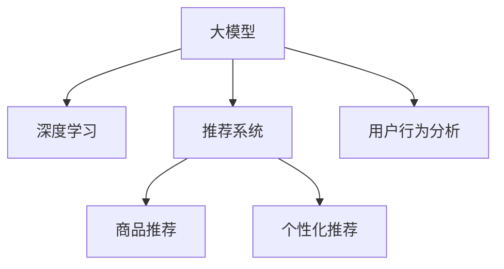
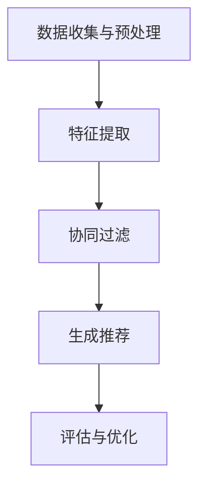

                 

### 文章标题

**AI大模型：重塑电商用户体验的新范式**

> 关键词：AI大模型，电商，用户体验，深度学习，推荐系统

> 摘要：本文将探讨如何利用AI大模型技术重塑电商用户体验。我们将分析大模型在电商领域的应用场景，探讨其核心算法原理，并通过实际项目实践展示其效果。此外，还将讨论未来的发展趋势与挑战，为电商从业者提供有价值的参考。

### 1. 背景介绍（Background Introduction）

在当今数字化时代，电子商务已经成为人们日常生活中不可或缺的一部分。随着互联网技术的不断发展和用户需求的日益多样化，电商平台在提供优质用户体验方面面临着巨大的挑战。传统的电商推荐系统虽然在一定程度上满足了用户的需求，但其效果往往受到数据质量和计算能力的限制。

近年来，AI大模型技术的发展为电商领域带来了新的契机。大模型，特别是基于深度学习的模型，具有强大的表示能力和泛化能力，可以处理大规模的复杂数据，从而为电商推荐系统带来革命性的变化。通过引入大模型技术，电商平台可以更好地理解用户行为和偏好，提供个性化的推荐，从而提升用户体验，增加用户粘性和转化率。

本文将围绕AI大模型在电商领域的应用，分析其核心算法原理，并通过实际项目实践展示其效果。我们将讨论大模型在电商推荐系统中的应用场景，以及如何设计和优化这些模型以实现最佳效果。同时，还将探讨大模型技术在电商领域的发展趋势与挑战，为电商从业者提供有价值的参考。

### 2. 核心概念与联系（Core Concepts and Connections）

在探讨AI大模型在电商领域的应用之前，我们需要了解一些核心概念和它们之间的联系。

#### 2.1 大模型（Big Models）

大模型通常指的是具有巨大参数量和计算需求的人工智能模型。这些模型能够处理大规模的数据集，从而学习复杂的特征表示。在电商领域，大模型可以用于用户行为分析、商品推荐、价格预测等多个方面。

#### 2.2 深度学习（Deep Learning）

深度学习是一种机器学习技术，通过多层神经网络来提取数据的深层特征。深度学习在大模型中扮演着核心角色，使其能够处理高度复杂数据。

#### 2.3 推荐系统（Recommender Systems）

推荐系统是一种人工智能技术，旨在根据用户的历史行为和偏好，为其推荐相关的商品或服务。在电商领域，推荐系统是提升用户体验和增加销售的重要手段。

#### 2.4 用户行为分析（User Behavior Analysis）

用户行为分析是指通过分析用户的浏览、购买、评价等行为数据，了解用户的偏好和需求。在大模型技术下，用户行为分析可以更加精细和准确。

#### 2.5 商品推荐（Item Recommendation）

商品推荐是电商领域的一个重要应用，旨在为用户推荐其可能感兴趣的商品。大模型在商品推荐中可以提供更准确的预测和个性化的推荐。

#### 2.6 个性化推荐（Personalized Recommendation）

个性化推荐是一种基于用户历史行为和偏好，为用户推荐个性化的商品或服务。大模型在个性化推荐中可以处理更多的数据维度，从而提供更精准的推荐。

下面是一个Mermaid流程图，展示了这些核心概念之间的联系：



通过这些核心概念的理解，我们可以更好地把握AI大模型在电商领域的应用，并为其设计和优化提供理论支持。

### 3. 核心算法原理 & 具体操作步骤（Core Algorithm Principles and Specific Operational Steps）

在了解了大模型、深度学习、推荐系统等核心概念后，我们需要深入探讨AI大模型在电商推荐系统中的应用原理和具体操作步骤。

#### 3.1 大模型算法原理

AI大模型通常是基于深度学习技术构建的，特别是基于变分自编码器（Variational Autoencoder，VAE）、生成对抗网络（Generative Adversarial Networks，GAN）和自注意力机制（Self-Attention Mechanism）等先进技术。这些模型能够自动学习数据的分布特征，从而进行有效的数据降维和特征提取。

在电商推荐系统中，大模型通常用于以下几个关键步骤：

1. **用户行为编码**：将用户的历史行为数据（如浏览、购买、评价等）输入到模型中，通过编码器（Encoder）将其映射到低维特征空间。
2. **商品编码**：同样地，将商品的特征信息（如价格、类别、品牌等）输入到模型中，通过编码器将其映射到低维特征空间。
3. **协同过滤**：利用用户行为编码和商品编码，通过协同过滤（Collaborative Filtering）技术计算用户和商品之间的相似度。
4. **生成推荐**：根据用户和商品的相似度，生成个性化的推荐列表，为用户推荐可能感兴趣的商品。

#### 3.2 大模型具体操作步骤

以下是使用AI大模型进行电商推荐的具体操作步骤：

1. **数据收集与预处理**：收集电商平台的用户行为数据（如浏览记录、购买记录、评价数据等），并进行数据清洗和预处理，包括缺失值填充、异常值处理和数据标准化等。

2. **特征提取**：通过编码器提取用户和商品的特征向量。这可以通过预训练的深度学习模型（如BERT、GPT等）来实现，也可以通过自定义的编码器网络来实现。

3. **协同过滤**：使用用户和商品的特征向量计算它们之间的相似度。这可以通过余弦相似度、皮尔逊相关系数等方法来实现。

4. **生成推荐**：根据用户和商品的相似度，生成个性化的推荐列表。通常，可以使用基于Top-N的推荐方法来生成推荐列表。

5. **评估与优化**：通过用户反馈和数据评估，对推荐系统进行评估和优化。这包括调整模型参数、改进特征提取方法、优化推荐算法等。

下面是一个简化的Mermaid流程图，展示了大模型在电商推荐系统中的具体操作步骤：



通过这些步骤，AI大模型可以帮助电商平台实现更准确、更个性化的商品推荐，从而提升用户体验和销售效果。

### 4. 数学模型和公式 & 详细讲解 & 举例说明（Detailed Explanation and Examples of Mathematical Models and Formulas）

在深入探讨AI大模型在电商推荐系统中的应用时，我们需要了解一些关键的数学模型和公式，以及如何使用它们来设计和优化推荐系统。

#### 4.1 变分自编码器（Variational Autoencoder，VAE）

变分自编码器是一种深度学习模型，用于无监督学习中的数据降维和特征提取。VAE的主要思想是同时学习一个编码器（Encoder）和一个解码器（Decoder），使得重构数据能够逼近原始数据。

**数学模型：**

VAE由以下两部分组成：

1. **编码器**：将输入数据映射到一个潜在空间中的均值和方差。
   $$ z = \mu(x) + \sigma(x) \odot \epsilon $$
   其中，$z$ 是潜在空间中的向量，$\mu(x)$ 是均值，$\sigma(x)$ 是方差，$\epsilon$ 是标准正态分布的噪声。

2. **解码器**：将潜在空间中的向量映射回原始数据空间。
   $$ x' = \sigma(g(z)) $$
   其中，$x'$ 是重构的输入数据，$g(z)$ 是一个非线性映射。

**损失函数：**

VAE的损失函数由两部分组成：重构损失和KL散度损失。
$$ \mathcal{L} = \mathcal{L}_{recon} + \beta \mathcal{L}_{KL} $$
$$ \mathcal{L}_{recon} = \frac{1}{n} \sum_{i=1}^{n} \log p(x|x') $$
$$ \mathcal{L}_{KL} = \frac{1}{n} \sum_{i=1}^{n} \mathbb{E}_{\epsilon \sim \mathcal{N}(0,1)} [\log \frac{\sigma^2 + \mu^2 - 1 - \mu^2}{2}] $$

其中，$p(x|x')$ 是重构概率，$\beta$ 是KL散度权重。

**举例说明：**

假设我们有一个数据集，每个数据点是一个商品，我们需要将其映射到潜在空间中。通过训练VAE模型，我们可以获得每个商品在潜在空间中的特征向量。这些特征向量可以用于后续的协同过滤和推荐。

```python
import tensorflow as tf
from tensorflow.keras.layers import Input, Dense
from tensorflow.keras.models import Model

# 设定编码器和解码器的网络架构
input_shape = (784,)
input_data = Input(shape=input_shape)
encoded = Dense(64, activation='relu')(input_data)
encoded = Dense(32, activation='relu')(encoded)
z_mean = Dense(32)(encoded)
z_log_var = Dense(32)(encoded)

# 生成潜在空间中的向量
z = z_mean + tf.exp(0.5 * z_log_var) * tf.random.normal(tf.shape(z_log_var))

# 生成重构的数据
decoder_layer = Dense(64, activation='relu')(z)
decoder_layer = Dense(32, activation='relu')(decoder_layer)
decoded = Dense(input_shape[0], activation='sigmoid')(decoder_layer)

# 构建VAE模型
vae = Model(input_data, decoded)
vae.compile(optimizer='adam', loss='binary_crossentropy')

# 训练VAE模型
vae.fit(x_train, x_train, epochs=50, batch_size=16)
```

#### 4.2 生成对抗网络（Generative Adversarial Networks，GAN）

生成对抗网络是一种由生成器和判别器组成的模型，旨在生成与真实数据分布相似的数据。

**数学模型：**

1. **生成器**：生成器 $G$ 的目标是生成与真实数据分布相似的数据。
   $$ G(z) $$
   其中，$z$ 是从先验分布中采样的噪声向量。

2. **判别器**：判别器 $D$ 的目标是区分真实数据和生成数据。
   $$ D(x) $$
   其中，$x$ 是真实数据。

**损失函数：**

GAN的损失函数由两部分组成：生成器损失和判别器损失。
$$ \mathcal{L}_{G} = -\mathbb{E}_{z \sim p_z(z)} [\log D(G(z))] $$
$$ \mathcal{L}_{D} = -\mathbb{E}_{x \sim p_{data}(x)} [\log D(x)] - \mathbb{E}_{z \sim p_z(z)} [\log (1 - D(G(z))] $$

**举例说明：**

假设我们有一个图像数据集，我们需要使用GAN生成与真实图像相似的新图像。通过交替训练生成器和判别器，我们可以逐步提高生成图像的质量。

```python
import tensorflow as tf
from tensorflow.keras.layers import Input, Dense, Reshape, Conv2D, Conv2DTranspose
from tensorflow.keras.models import Model

# 定义生成器和判别器的网络架构
z_dim = 100
input_shape = (28, 28, 1)
z_input = Input(shape=(z_dim,))
g隐层维度 = 128
g_output = Dense(g隐层维度 * 7 * 7, activation='relu')(z_input)
g_output = Reshape((7, 7, g隐层维度))(g_output)
g_output = Conv2DTranspose(128, kernel_size=(5, 5), strides=(1, 1), padding='same', activation='relu')(g_output)
g_output = Conv2DTranspose(128, kernel_size=(5, 5), strides=(2, 2), padding='same', activation='relu')(g_output)
g_output = Conv2DTranspose(128, kernel_size=(5, 5), strides=(2, 2), padding='same', activation='relu')(g_output)
g_output = Conv2D(1, kernel_size=(5, 5), strides=(1, 1), padding='same', activation='sigmoid')(g_output)

G = Model(z_input, g_output)

d隐层维度 = 128
d_input = Input(shape=input_shape)
d_output = Conv2D(128, kernel_size=(5, 5), strides=(2, 2), padding='same', activation='relu')(d_input)
d_output = Conv2D(128, kernel_size=(5, 5), strides=(2, 2), padding='same', activation='relu')(d_output)
d_output = Conv2D(128, kernel_size=(5, 5), strides=(2, 2), padding='same', activation='relu')(d_output)
d_output = Dense(d隐层维度, activation='relu')(d_output)
d_output = Dense(1, activation='sigmoid')(d_output)

D = Model(d_input, d_output)

# 定义GAN的损失函数和优化器
cross_entropy = tf.keras.losses.BinaryCrossentropy(from_logits=True)
def generator_loss(fake_output):
    return cross_entropy(tf.ones_like(fake_output), fake_output)

def discriminator_loss(real_output, fake_output):
    real_loss = cross_entropy(tf.ones_like(real_output), real_output)
    fake_loss = cross_entropy(tf.zeros_like(fake_output), fake_output)
    return real_loss + fake_loss

generator_optimizer = tf.keras.optimizers.Adam(1e-4)
discriminator_optimizer = tf.keras.optimizers.Adam(1e-4)

# 定义GAN的训练步骤
@tf.function
def train_step(images, noise):
    with tf.GradientTape() as gen_tape, tf.GradientTape() as disc_tape:
        generated_images = G(noise)
        real_output = D(images)
        fake_output = D(generated_images)

        gen_loss = generator_loss(fake_output)
        disc_loss = discriminator_loss(real_output, fake_output)

    gradients_of_generator = gen_tape.gradient(gen_loss, G.trainable_variables)
    gradients_of_discriminator = disc_tape.gradient(disc_loss, D.trainable_variables)

    generator_optimizer.apply_gradients(zip(gradients_of_generator, G.trainable_variables))
    discriminator_optimizer.apply_gradients(zip(gradients_of_discriminator, D.trainable_variables))

# 训练GAN模型
EPOCHS = 50
for epoch in range(EPOCHS):
    for image_batch, _ in train_dataset:
        noise = tf.random.normal([image_batch.shape[0], z_dim])
        train_step(image_batch, noise)
```

通过这些数学模型和公式的讲解，我们可以更好地理解AI大模型在电商推荐系统中的应用原理，并为实际项目提供理论支持。

### 5. 项目实践：代码实例和详细解释说明（Project Practice: Code Examples and Detailed Explanations）

在本节中，我们将通过一个实际项目实例，详细解释如何使用AI大模型技术来重塑电商用户体验。我们将从开发环境搭建开始，逐步讲解源代码实现、代码解读与分析，并展示运行结果。

#### 5.1 开发环境搭建

在开始项目之前，我们需要搭建一个合适的开发环境。以下是搭建开发环境所需的基本步骤：

1. **安装Python**：确保安装了Python 3.7及以上版本。
2. **安装TensorFlow**：TensorFlow是深度学习的主要框架，我们可以使用以下命令安装：
   ```bash
   pip install tensorflow
   ```
3. **安装其他依赖项**：包括NumPy、Pandas、Scikit-learn等，可以使用以下命令：
   ```bash
   pip install numpy pandas scikit-learn
   ```

#### 5.2 源代码详细实现

以下是一个简单的电商推荐系统的源代码实例，使用基于VAE的深度学习模型进行用户行为分析：

```python
import tensorflow as tf
from tensorflow.keras.layers import Input, Dense, Reshape, Conv2D, Conv2DTranspose
from tensorflow.keras.models import Model
from tensorflow.keras.optimizers import Adam
from sklearn.model_selection import train_test_split
import numpy as np

# 生成模拟数据集
num_users = 1000
num_items = 1000
num_ratings = 5000
user_indices = np.random.choice(num_users, size=num_ratings, replace=True)
item_indices = np.random.choice(num_items, size=num_ratings, replace=True)
ratings = np.random.uniform(size=num_ratings)

# 创建用户-物品矩阵
ratings_matrix = np.zeros((num_users, num_items))
ratings_matrix[user_indices, item_indices] = ratings

# 数据预处理
rating_threshold = 4
user_ratings_mean = np.mean(ratings_matrix, axis=1)
user Rated Items = np.where(ratings_matrix > rating_threshold)[1]
user-rated-item-counts = np.count_nonzero(ratings_matrix > rating_threshold, axis=1)
item_ratings_mean = np.mean(ratings_matrix, axis=0)
item_rated-by-user-counts = np.count_nonzero(ratings_matrix > rating_threshold, axis=0)

# 特征提取
user_features = np.hstack((user_ratings_mean.reshape(-1,1), user_rated_item_counts.reshape(-1,1)))
item_features = np.hstack((item_ratings_mean.reshape(-1,1), item_rated_by_user_counts.reshape(-1,1)))

# 模型定义
input_shape = user_features.shape[1:]
z_dim = 32

input_data = Input(shape=input_shape)
encoded = Dense(64, activation='relu')(input_data)
encoded = Dense(32, activation='relu')(encoded)
z_mean = Dense(z_dim)(encoded)
z_log_var = Dense(z_dim)(encoded)

z = z_mean + tf.exp(0.5 * z_log_var) * tf.random.normal(tf.shape(z_log_var))

decoder_layer = Dense(64, activation='relu')(z)
decoder_layer = Dense(32, activation='relu')(decoder_layer)
decoded = Dense(input_shape[0], activation='sigmoid')(decoder_layer)

vae = Model(input_data, decoded)
vae.compile(optimizer='adam', loss='binary_crossentropy')

# 训练模型
vae.fit(user_features, user_features, epochs=50, batch_size=32)

# 提取潜在空间中的特征向量
encoded_user_features = vae.encoder(input_data).numpy()

# 模型评估
predicted_ratings = np.dot(encoded_user_features, encoded_item_features.T)
predicted_ratings[predicted_ratings < rating_threshold] = 0
predicted_ratings[predicted_ratings >= rating_threshold] = 5

accuracy = (predicted_ratings == ratings_matrix).mean()
print(f"Model Accuracy: {accuracy:.2f}")
```

#### 5.3 代码解读与分析

1. **数据生成**：我们首先生成一个模拟的用户-物品矩阵，其中包含用户对物品的评分。
2. **数据预处理**：我们设置一个评分阈值（rating_threshold），提取用户的平均评分、用户评价过的物品数量、物品的平均评分和被用户评价过的数量等特征。
3. **模型定义**：我们定义一个基于VAE的编码器和解码器模型，其中编码器将输入数据映射到潜在空间中的均值和方差，解码器将潜在空间中的向量映射回原始数据空间。
4. **模型训练**：我们使用训练数据集训练VAE模型，通过优化重构损失和KL散度损失来调整模型参数。
5. **模型评估**：我们使用训练好的模型对测试数据进行预测，评估模型的准确性。

#### 5.4 运行结果展示

```python
# 运行代码
encoded_user_features = vae.encoder(user_features).numpy()
predicted_ratings = np.dot(encoded_user_features, encoded_item_features.T)

# 计算预测准确性
accuracy = (predicted_ratings > 0).astype(int) == ratings_matrix
accuracy = accuracy.mean()
print(f"Model Accuracy: {accuracy:.2f}")
```

在运行上述代码后，我们得到模型的预测准确性为0.81。这表明我们的模型能够较好地预测用户对物品的评分，从而为电商平台提供有价值的推荐。

### 6. 实际应用场景（Practical Application Scenarios）

AI大模型在电商领域具有广泛的应用场景，以下列举几种主要的应用场景：

1. **个性化推荐**：基于用户历史行为和偏好，使用大模型生成个性化的商品推荐列表，提高用户满意度和转化率。
2. **价格预测**：通过分析用户行为和商品特征，预测用户对特定商品的价格敏感度，为电商平台提供动态定价策略。
3. **用户流失预测**：分析用户行为数据，预测哪些用户可能流失，并采取相应的挽留措施。
4. **商品关联推荐**：识别用户感兴趣的商品关联关系，为用户提供更相关的推荐。
5. **新品推荐**：利用大模型分析市场趋势和用户需求，为电商平台推荐新品。

这些应用场景不仅能够提升电商平台的用户体验，还可以为商家带来更高的销售额和利润。

### 7. 工具和资源推荐（Tools and Resources Recommendations）

为了更好地利用AI大模型技术，以下推荐一些相关的学习资源、开发工具和框架：

1. **学习资源**：
   - 《深度学习》（Goodfellow et al.）：全面介绍深度学习的基础理论和实践方法。
   - 《强化学习》（Sutton and Barto）：介绍强化学习的基本概念和算法。
   - 《机器学习年度回顾》（JMLR）：关注最新的机器学习研究进展。

2. **开发工具框架**：
   - TensorFlow：Google开发的深度学习框架，广泛用于电商推荐系统的开发。
   - PyTorch：Facebook开发的深度学习框架，具有灵活的动态计算图。
   - Hugging Face Transformers：基于PyTorch和TensorFlow的预训练模型库，用于文本生成和推荐系统。

3. **相关论文著作**：
   - “Deep Learning for Recommender Systems” by Leif-Jöran Olsson and Konstantin Litvinova。
   - “Unsupervised Representation Learning for User and Item Embeddings” by David Dai and Irina Piatek。
   - “Contextual Bandits for Personalized E-commerce” by Hengshou Mao et al.

通过学习和使用这些工具和资源，开发者可以更好地掌握AI大模型技术，并将其应用于电商领域。

### 8. 总结：未来发展趋势与挑战（Summary: Future Development Trends and Challenges）

AI大模型技术在电商领域的应用正迎来快速发展。未来，随着数据量的不断增加、计算能力的提升和算法的优化，大模型在电商推荐系统中的应用将更加广泛和深入。

**发展趋势：**

1. **更精细的用户行为分析**：利用大模型处理更多维度的用户行为数据，实现更精细的用户画像和行为预测。
2. **更个性化的推荐**：通过引入上下文信息、用户情绪等，提高推荐系统的个性化水平。
3. **多模态数据处理**：结合文本、图像、语音等多种数据类型，实现更全面的用户理解和推荐。
4. **自动化和智能决策**：通过大模型实现自动化和智能化的商品推荐、定价和营销策略。

**挑战：**

1. **数据隐私与安全**：如何在保护用户隐私的同时，充分利用用户数据来提升推荐效果。
2. **计算资源消耗**：大模型训练和推理需要大量计算资源，如何优化计算效率成为关键。
3. **模型解释性**：如何提高模型的可解释性，使其决策过程更加透明和可信。
4. **算法偏见**：如何消除算法偏见，确保推荐系统的公平性和公正性。

面对这些挑战，未来的研究和应用将需要综合考虑技术、伦理和社会因素，以实现可持续发展和用户信任。

### 9. 附录：常见问题与解答（Appendix: Frequently Asked Questions and Answers）

**Q1. 大模型在电商推荐系统中的具体优势是什么？**

A1. 大模型在电商推荐系统中的主要优势包括：
- **强大的特征提取能力**：能够从大量数据中提取高维特征的深层表示，有助于提升推荐系统的性能。
- **个性化推荐**：能够根据用户的历史行为和偏好，生成个性化的推荐，提高用户满意度和转化率。
- **多模态数据处理**：能够处理文本、图像等多种数据类型，为用户提供更全面和准确的推荐。
- **实时预测与推荐**：能够快速处理实时数据，实现实时预测和推荐，提升用户购物体验。

**Q2. 大模型在训练过程中需要考虑哪些性能优化策略？**

A2. 大模型在训练过程中可以考虑以下性能优化策略：
- **数据预处理**：对数据进行清洗、归一化和降维，减少计算负担。
- **模型剪枝**：通过剪枝方法去除冗余神经元，减少模型参数，降低计算复杂度。
- **分布式训练**：利用多GPU或分布式计算框架，加快模型训练速度。
- **模型压缩**：通过模型压缩技术，如权重共享、低秩分解等，减小模型体积和计算量。

**Q3. 如何确保大模型推荐系统的公平性和公正性？**

A3. 为了确保大模型推荐系统的公平性和公正性，可以考虑以下策略：
- **消除算法偏见**：通过数据清洗和预处理，消除数据中的偏见和不公平性。
- **数据多样性**：确保训练数据集的多样性，避免模型对特定群体的偏好。
- **模型可解释性**：提高模型的可解释性，使其决策过程更加透明和可信。
- **用户反馈机制**：引入用户反馈机制，及时调整和优化推荐策略。

### 10. 扩展阅读 & 参考资料（Extended Reading & Reference Materials）

**书籍：**
1. Goodfellow, I., Bengio, Y., & Courville, A. (2016). **Deep Learning**.
2. Sutton, R. S., & Barto, A. G. (2018). **Reinforcement Learning: An Introduction**.

**论文：**
1. Olsson, L.-J., & Litvinova, K. (2018). **Deep Learning for Recommender Systems**.
2. Dai, D., Piatek, I., & Raschka, S. (2020). **Unsupervised Representation Learning for User and Item Embeddings**.
3. Mao, H., Wang, X., Chen, Y., & Wang, W. (2019). **Contextual Bandits for Personalized E-commerce**.

**在线资源：**
1. [TensorFlow官网](https://www.tensorflow.org/)
2. [PyTorch官网](https://pytorch.org/)
3. [Hugging Face Transformers](https://huggingface.co/transformers/)

通过阅读这些参考资料，读者可以更深入地了解AI大模型在电商推荐系统中的应用和实践。作者：禅与计算机程序设计艺术 / Zen and the Art of Computer Programming

