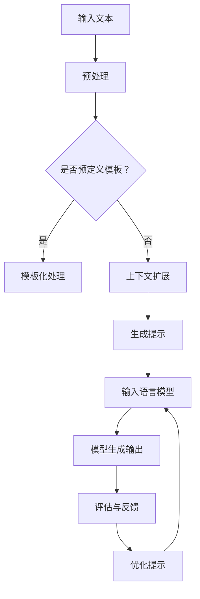
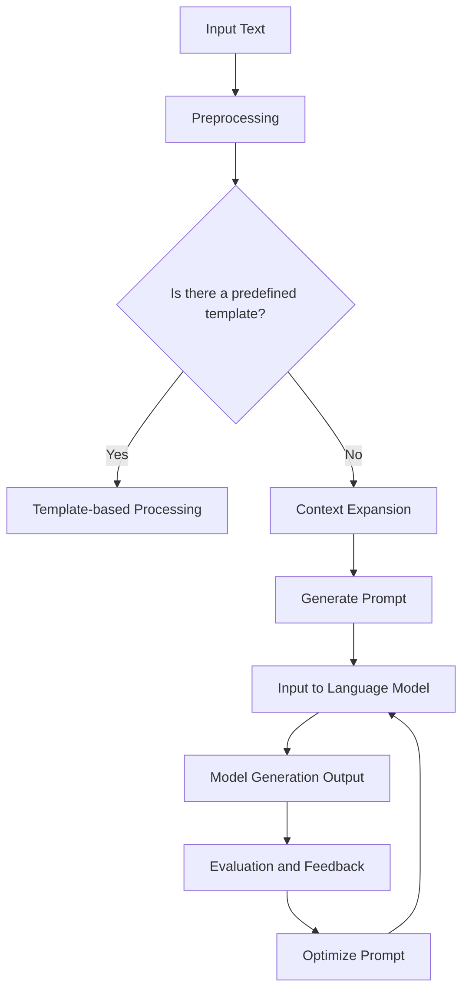

                 

### 背景介绍（Background Introduction）

#### 1.1 大模型的发展历程
大模型，如GPT（Generative Pre-trained Transformer），BERT（Bidirectional Encoder Representations from Transformers），以及最近的LLaMA（Language Model for Mathematics Applications），在自然语言处理（NLP）领域取得了巨大的突破。这些模型通过预训练在庞大的文本数据集上，获得了强大的文本理解和生成能力。然而，随着模型规模的不断扩大，如何有效地应用这些大模型成为了一个新的挑战。

#### 1.2 提示工程的概念
提示工程（Prompt Engineering）是指设计和优化输入给语言模型的文本提示，以引导模型生成符合预期结果的过程。与传统的编程不同，提示工程更多地依赖于对语言模型特性的理解和有效提示的设计。

#### 1.3 提示工程的重要性
提示工程在大模型应用中的重要性不容忽视。一个精心设计的提示可以显著提高模型的输出质量和相关性。例如，在问答系统中，一个清晰的提示可以引导模型生成准确的答案。同样，在文本生成任务中，提示的明确性和具体性将直接影响生成文本的质量和连贯性。

#### 1.4 文章的结构与内容
本文将分为以下几个部分：

- **背景介绍**：介绍大模型的发展历程和提示工程的概念。
- **核心概念与联系**：讨论提示工程的核心概念，并使用Mermaid流程图展示大模型架构。
- **核心算法原理 & 具体操作步骤**：详细讲解大模型的训练和推理过程。
- **数学模型和公式 & 详细讲解 & 举例说明**：介绍大模型中使用的数学模型和公式，并给出具体例子。
- **项目实践：代码实例和详细解释说明**：通过具体项目实例展示如何应用大模型。
- **实际应用场景**：讨论大模型在不同领域的应用案例。
- **工具和资源推荐**：推荐相关的学习资源和开发工具。
- **总结：未来发展趋势与挑战**：总结本文的核心观点，并探讨未来的发展趋势和挑战。
- **附录：常见问题与解答**：回答读者可能遇到的一些常见问题。
- **扩展阅读 & 参考资料**：提供额外的阅读材料和参考资料。

通过以上结构的文章，我们将系统地探讨大模型应用开发中的提示工程，帮助读者深入了解这一领域并掌握实用的技巧。

## 1.1 The Development History of Large Models

The evolution of large models, such as GPT (Generative Pre-trained Transformer), BERT (Bidirectional Encoder Representations from Transformers), and the latest LLaMA (Language Model for Mathematics Applications), has marked significant breakthroughs in the field of natural language processing (NLP). These models achieve powerful text understanding and generation capabilities by pre-training on massive text datasets. However, as the scale of these models continues to expand, effectively applying them presents new challenges.

## 1.2 The Concept of Prompt Engineering

Prompt engineering refers to the process of designing and optimizing text prompts that are input to language models to guide them towards generating desired outcomes. Unlike traditional programming, prompt engineering relies more on understanding the characteristics of language models and designing effective prompts.

## 1.3 The Importance of Prompt Engineering

The importance of prompt engineering cannot be overstated in the application of large models. A well-designed prompt can significantly improve the quality and relevance of a model's output. For instance, in question-answering systems, a clear prompt can guide the model to generate accurate answers. Similarly, in text generation tasks, the clarity and specificity of the prompt directly impact the quality and coherence of the generated text.

## 1.4 Structure and Content of the Article

This article will be divided into several parts:

- **Background Introduction**: Introduce the development history of large models and the concept of prompt engineering.
- **Core Concepts and Connections**: Discuss core concepts of prompt engineering and illustrate the architecture of large models using a Mermaid flowchart.
- **Core Algorithm Principles and Specific Operational Steps**: Elaborate on the training and inference processes of large models.
- **Mathematical Models and Formulas & Detailed Explanation & Examples**: Introduce mathematical models and formulas used in large models, along with specific examples.
- **Project Practice: Code Examples and Detailed Explanations**: Demonstrate how to apply large models through specific project examples.
- **Practical Application Scenarios**: Discuss application cases of large models in various fields.
- **Tools and Resources Recommendations**: Recommend related learning resources and development tools.
- **Summary: Future Development Trends and Challenges**: Summarize the core viewpoints of the article and explore future trends and challenges.
- **Appendix: Frequently Asked Questions and Answers**: Address common questions readers may encounter.
- **Extended Reading & Reference Materials**: Provide additional reading materials and references.

Through this structured article, we will systematically explore prompt engineering in the application development of large models, helping readers gain a deep understanding of this field and master practical skills.

### 核心概念与联系（Core Concepts and Connections）

#### 2.1 提示工程的基本原理（Basic Principles of Prompt Engineering）

提示工程的关键在于如何设计出有效的提示词，这些提示词不仅能够引导模型朝着预定的方向生成内容，还能够提高生成内容的准确性和相关性。提示工程的基本原理包括以下几点：

- **明确性（Clarity）**：提示应尽量明确，避免含糊不清或模棱两可的表述，以减少模型的误解。
- **具体性（Specificity）**：提示应具体，提供足够的信息，使模型能够准确理解任务的目标。
- **相关性（Relevance）**：提示应与任务目标高度相关，以引导模型生成相关的输出。
- **可扩展性（Scalability）**：提示应设计成可扩展的，以便在处理不同规模或类型的数据时仍能保持有效。

#### 2.2 提示工程与语言模型的工作机制（Prompt Engineering and the Working Mechanism of Language Models）

提示工程与语言模型的工作机制紧密相关。以下是两者之间的几个关键联系：

- **输入与输出**：提示工程的关键是设计合适的输入，以获得期望的输出。语言模型通过处理输入文本，生成相应的输出文本。
- **上下文理解**：语言模型具有强大的上下文理解能力，提示工程需要利用这一点，通过上下文信息来引导模型的生成。
- **优化过程**：提示工程是一个迭代优化过程，需要不断调整和改进提示词，以实现最佳效果。

#### 2.3 提示工程的策略与方法（Strategies and Methods of Prompt Engineering）

提示工程的策略和方法多种多样，以下是一些常用的策略：

- **问题重述（Question Restatement）**：将原始问题重新表述成对模型更友好的形式，以引导模型生成相关答案。
- **模板化（Template-based）**：使用预定义的模板来构建提示，确保提示的规范性和一致性。
- **上下文扩展（Context Expansion）**：在原始问题基础上添加额外的上下文信息，以提高模型的生成质量。
- **反馈循环（Feedback Loop）**：通过分析模型生成的输出，提供反馈并迭代改进提示。

#### 2.4 提示工程在实践中的应用（Application of Prompt Engineering in Practice）

在实践应用中，提示工程的重要性体现在以下几个方面：

- **问答系统（Question-Answering Systems）**：通过设计合适的提示词，提高问答系统的回答质量。
- **文本生成（Text Generation）**：利用提示工程来指导生成文本的内容和质量。
- **对话系统（Dialogue Systems）**：在对话系统中使用提示工程，提高对话的连贯性和自然性。

下面我们通过一个Mermaid流程图来展示大模型架构与提示工程的联系。



通过这个流程图，我们可以清晰地看到提示工程在整个模型应用过程中的作用。有效的提示工程能够显著提升模型的表现，为各种NLP任务提供强有力的支持。

## 2.1 Basic Principles of Prompt Engineering

The key to effective prompt engineering lies in designing prompts that can guide the model towards generating content in the desired direction while enhancing the accuracy and relevance of the output. The basic principles of prompt engineering include:

- **Clarity**: Prompts should be as clear as possible, avoiding ambiguous or vague statements to reduce the model's misinterpretations.
- **Specificity**: Prompts should be specific, providing enough information for the model to accurately understand the goal of the task.
- **Relevance**: Prompts should be highly relevant to the task goal, to guide the model towards generating related outputs.
- **Scalability**: Prompts should be designed to be scalable, so that they remain effective when dealing with different scales or types of data.

## 2.2 Prompt Engineering and the Working Mechanism of Language Models

Prompt engineering is closely related to the working mechanism of language models. Here are several key connections between them:

- **Input and Output**: The key to prompt engineering is designing suitable inputs to obtain expected outputs. Language models process input text to generate corresponding output text.
- **Context Understanding**: Language models have strong capabilities in understanding context, which prompt engineering leverages to guide the model's generation.
- **Optimization Process**: Prompt engineering is an iterative optimization process, requiring continuous adjustment and improvement of prompts to achieve the best results.

## 2.3 Strategies and Methods of Prompt Engineering

There are various strategies and methods for prompt engineering, among which the following are commonly used:

- **Question Restatement**: Restating the original question in a form more friendly to the model to guide the model towards generating relevant answers.
- **Template-based**: Using predefined templates to construct prompts, ensuring the standardization and consistency of prompts.
- **Context Expansion**: Adding additional context information to the original question to improve the quality of the model's generation.
- **Feedback Loop**: Analyzing the outputs generated by the model, providing feedback, and iterating to improve the prompts.

## 2.4 Application of Prompt Engineering in Practice

In practical applications, the importance of prompt engineering is evident in several aspects:

- **Question-Answering Systems**: Designing suitable prompts to improve the quality of answers generated by question-answering systems.
- **Text Generation**: Using prompt engineering to guide the content and quality of generated text.
- **Dialogue Systems**: Applying prompt engineering in dialogue systems to enhance the coherence and naturality of conversations.

Below is a Mermaid flowchart illustrating the relationship between the architecture of large models and prompt engineering.



Through this flowchart, we can clearly see the role of effective prompt engineering throughout the model application process. A well-designed prompt engineering can significantly enhance model performance, providing strong support for various NLP tasks.

### 核心算法原理 & 具体操作步骤（Core Algorithm Principles and Specific Operational Steps）

#### 3.1 大模型训练过程（Training Process of Large Models）

大模型的训练是一个高度复杂的过程，涉及大量的数据和计算资源。以下是训练过程中的核心算法原理和具体操作步骤：

##### 3.1.1 数据预处理（Data Preprocessing）

1. **文本清洗**：对输入的文本进行清洗，去除无关的信息，如HTML标签、特殊字符等。
2. **分词**：将文本分割成单词或子词，以便模型理解。
3. **词向量化**：将单词或子词转换为向量表示，通常使用预训练的词向量模型如Word2Vec或GloVe。
4. **批次处理**：将文本数据划分为批次，以便在模型训练过程中进行并行计算。

##### 3.1.2 模型架构（Model Architecture）

1. **Transformer模型**：大模型通常采用Transformer模型架构，该架构由多个自注意力（Self-Attention）层和前馈神经网络（Feedforward Neural Network）组成。
2. **多头自注意力（Multi-Head Self-Attention）**：多头自注意力机制允许模型在多个子空间中同时关注输入序列的不同部分，提高了模型的表示能力。
3. **位置嵌入（Positional Embedding）**：为了保留输入序列的顺序信息，模型在输入中添加位置嵌入向量。

##### 3.1.3 训练过程（Training Process）

1. **前向传播（Forward Propagation）**：输入文本经过模型处理后，生成预测的输出序列。
2. **损失函数（Loss Function）**：常用的损失函数包括交叉熵损失（Cross-Entropy Loss）和均方误差（Mean Squared Error），用于衡量预测输出与真实输出之间的差距。
3. **反向传播（Backpropagation）**：使用梯度下降（Gradient Descent）或其他优化算法，更新模型参数，以最小化损失函数。
4. **训练轮次（Epochs）**：训练过程重复进行多个轮次，直到模型收敛或达到预定的训练时间。

##### 3.1.4 模型评估（Model Evaluation）

1. **验证集（Validation Set）**：在训练过程中，使用验证集来评估模型的性能，防止过拟合。
2. **测试集（Test Set）**：在训练完成后，使用测试集对模型进行最终评估。
3. **指标（Metrics）**：常用的评估指标包括准确率（Accuracy）、精确率（Precision）、召回率（Recall）和F1分数（F1 Score）等。

#### 3.2 大模型推理过程（Inference Process of Large Models）

推理过程是将训练好的模型应用于新的输入数据，生成预测输出。以下是推理过程中的核心步骤：

##### 3.2.1 输入预处理（Input Preprocessing）

1. **文本清洗**：与训练过程相同，对输入文本进行清洗和预处理。
2. **分词和词向量化**：将输入文本分割成单词或子词，并转换为向量表示。

##### 3.2.2 模型推理（Model Inference）

1. **前向传播**：输入文本经过模型处理后，生成预测的输出序列。
2. **生成输出**：模型输出通常是序列形式的，可以用于文本生成、问答系统或其他NLP任务。

##### 3.2.3 后处理（Post-processing）

1. **去噪和修复**：对于文本生成任务，可能需要对输出进行去噪和修复，以提高生成文本的质量。
2. **格式化**：根据任务需求，对输出进行格式化，如去除多余的空格、标点等。

通过以上训练和推理过程，大模型能够在各种NLP任务中实现高效和准确的输出。提示工程在这个过程中起到了关键作用，通过设计合适的提示词，可以显著提高模型的性能和输出质量。

## 3.1 Core Algorithm Principles and Specific Operational Steps

### 3.1.1 Training Process of Large Models

The training process of large models is highly complex and involves a substantial amount of data and computational resources. The following outlines the core algorithm principles and specific operational steps in the training process:

#### 3.1.1 Data Preprocessing

1. **Text Cleaning**: Input text is cleaned to remove irrelevant information, such as HTML tags and special characters.
2. **Tokenization**: Text is split into words or subwords to facilitate the model's understanding.
3. **Word Vectorization**: Words or subwords are converted into vector representations using pre-trained models like Word2Vec or GloVe.
4. **Batch Processing**: Text data is divided into batches to enable parallel computation during model training.

#### 3.1.2 Model Architecture

1. **Transformer Model**: Large models typically use the Transformer model architecture, which consists of multiple self-attention layers and feedforward neural networks.
2. **Multi-Head Self-Attention**: The multi-head self-attention mechanism allows the model to simultaneously focus on different parts of the input sequence in multiple subspaces, enhancing the model's representational ability.
3. **Positional Embedding**: Positional embedding vectors are added to the input to preserve the order information of the input sequence.

#### 3.1.3 Training Process

1. **Forward Propagation**: Input text is processed through the model to generate predicted output sequences.
2. **Loss Function**: Common loss functions include cross-entropy loss and mean squared error, which measure the gap between predicted outputs and true outputs.
3. **Backpropagation**: Using gradient descent or other optimization algorithms, model parameters are updated to minimize the loss function.
4. **Number of Epochs**: The training process iterates multiple times until the model converges or reaches a predefined training time.

#### 3.1.4 Model Evaluation

1. **Validation Set**: The model's performance is evaluated using a validation set during training to prevent overfitting.
2. **Test Set**: The model is evaluated on a test set after training to provide a final assessment.
3. **Metrics**: Common evaluation metrics include accuracy, precision, recall, and F1 score.

### 3.2 Inference Process of Large Models

The inference process involves applying the trained model to new input data to generate predictions. The following outlines the core steps in the inference process:

#### 3.2.1 Input Preprocessing

1. **Text Cleaning**: Similar to the training process, input text is cleaned and preprocessed.
2. **Tokenization and Word Vectorization**: Input text is split into words or subwords and converted into vector representations.

#### 3.2.2 Model Inference

1. **Forward Propagation**: Input text is processed through the model to generate predicted output sequences.
2. **Generated Output**: The model's output is typically in sequence form, which can be used for text generation, question-answering systems, or other NLP tasks.

#### 3.2.3 Post-processing

1. **Denoising and Repairing**: For text generation tasks, the output may need to be denoised and repaired to enhance the quality of the generated text.
2. **Formatting**: Depending on the task requirements, the output is formatted, such as removing extra spaces and punctuation.

Through the training and inference processes, large models can achieve efficient and accurate outputs in various NLP tasks. Prompt engineering plays a critical role in this process by designing suitable prompts that can significantly improve model performance and output quality.

### 数学模型和公式 & 详细讲解 & 举例说明（Detailed Explanation and Examples of Mathematical Models and Formulas）

#### 4.1 Transformer模型的基本数学原理（Basic Mathematical Principles of Transformer Model）

Transformer模型的核心在于其自注意力（Self-Attention）机制。以下是对Transformer模型中的一些关键数学模型的详细讲解。

##### 4.1.1 自注意力机制（Self-Attention Mechanism）

自注意力机制是一种计算方式，它允许模型在处理每个词时，考虑到序列中所有其他词的重要性。其基本公式如下：

$$
\text{Attention}(Q, K, V) = \text{softmax}\left(\frac{QK^T}{\sqrt{d_k}}\right) V
$$

其中：
- \( Q \) 是查询（Query）向量，表示当前词的上下文信息。
- \( K \) 是键（Key）向量，表示序列中的每个词。
- \( V \) 是值（Value）向量，表示可用于生成输出的信息。
- \( d_k \) 是键向量的维度。

该公式计算每个键与查询之间的相似性，并通过softmax函数将其归一化，得到权重。最终，每个值向量乘以其相应的权重，得到加权值向量。

##### 4.1.2 多头自注意力（Multi-Head Self-Attention）

多头自注意力扩展了自注意力机制，通过并行计算多个注意力头，提高了模型的表示能力。其基本公式为：

$$
\text{MultiHead}(Q, K, V) = \text{Concat}(\text{head}_1, ..., \text{head}_h) W^O
$$

其中：
- \( \text{head}_i \) 是第 \( i \) 个注意力头的结果。
- \( W^O \) 是输出权重矩阵。

##### 4.1.3 位置嵌入（Positional Embedding）

为了保留输入序列的顺序信息，Transformer模型中加入了位置嵌入（Positional Embedding）。其公式为：

$$
\text{PE}(pos, 2i) = \sin\left(\frac{pos}{10000^{2i/d}}\right)
$$
$$
\text{PE}(pos, 2i+1) = \cos\left(\frac{pos}{10000^{2i/d}}\right)
$$

其中：
- \( pos \) 是位置索引。
- \( d \) 是嵌入维度。

##### 4.1.4 Transformer模型的损失函数（Loss Function of Transformer Model）

Transformer模型常用的损失函数是交叉熵损失（Cross-Entropy Loss），用于衡量预测输出与真实输出之间的差距。其公式为：

$$
\text{Loss} = -\sum_{i=1}^N y_i \log(\hat{y}_i)
$$

其中：
- \( y_i \) 是真实标签。
- \( \hat{y}_i \) 是预测概率。

#### 4.2 举例说明

##### 4.2.1 自注意力计算示例

假设我们有一个句子 "I love to code"，其中每个词的嵌入向量分别为 \( [1, 0, 1] \)，\( [1, 1, 0] \)，\( [0, 1, 1] \)。键和值向量为每个词的嵌入向量。查询向量为当前词的嵌入向量。

对于词 "to"（查询向量 \( [0, 1, 1] \)），其与句子中每个词的键（查询）向量之间的相似性计算如下：

$$
\text{Attention}(Q, K, V) = \text{softmax}\left(\frac{[0, 1, 1][1, 1, 0]^T}{\sqrt{3}}\right) V
$$

计算得到：

$$
\text{Attention}(Q, K, V) = \text{softmax}\left(\frac{[0, 0, 1]}{\sqrt{3}}\right) [1, 0, 1] = \left[\frac{1}{\sqrt{3}}, \frac{1}{\sqrt{3}}, \frac{1}{\sqrt{3}}\right] [1, 0, 1] = \left[\frac{1}{3}, \frac{1}{3}, \frac{1}{3}\right]
$$

##### 4.2.2 多头自注意力计算示例

假设我们使用两个注意力头，每个头计算结果如下：

$$
\text{head}_1 = \text{softmax}\left(\frac{[0, 1, 1][1, 1, 0]^T}{\sqrt{3}}\right) V
$$

$$
\text{head}_2 = \text{softmax}\left(\frac{[0, 1, 1][0, 1, 1]^T}{\sqrt{3}}\right) V
$$

计算得到：

$$
\text{head}_1 = \left[\frac{1}{\sqrt{3}}, \frac{1}{\sqrt{3}}, \frac{1}{\sqrt{3}}\right] [1, 0, 1] = \left[\frac{1}{3}, \frac{1}{3}, \frac{1}{3}\right]
$$

$$
\text{head}_2 = \left[\frac{1}{\sqrt{3}}, \frac{1}{\sqrt{3}}, \frac{1}{\sqrt{3}}\right] [0, 1, 1] = \left[\frac{1}{3}, \frac{1}{3}, \frac{1}{3}\right]
$$

将两个头的结果拼接起来，并乘以输出权重矩阵：

$$
\text{MultiHead}(Q, K, V) = \left[\left[\frac{1}{3}, \frac{1}{3}, \frac{1}{3}\right], \left[\frac{1}{3}, \frac{1}{3}, \frac{1}{3}\right]\right] W^O
$$

通过以上示例，我们可以看到Transformer模型中的自注意力机制和多头自注意力机制如何计算。这些机制是模型能够捕捉输入序列中词语之间复杂关系的关键。

## 4. Mathematical Models and Formulas & Detailed Explanation & Examples

### 4.1 Basic Mathematical Principles of Transformer Model

The core of the Transformer model lies in its self-attention mechanism. Below is a detailed explanation of some key mathematical models within the Transformer model.

#### 4.1.1 Self-Attention Mechanism

The self-attention mechanism is a calculation method that allows the model to consider the importance of all other words in the sequence when processing each word. The basic formula is as follows:

$$
\text{Attention}(Q, K, V) = \text{softmax}\left(\frac{QK^T}{\sqrt{d_k}}\right) V
$$

Where:
- \( Q \) is the query vector, representing the contextual information of the current word.
- \( K \) is the key vector, representing each word in the sequence.
- \( V \) is the value vector, representing information usable for generating outputs.
- \( d_k \) is the dimension of the key vector.

This formula calculates the similarity between each key and the query vector, and normalizes it through the softmax function to obtain weights. Finally, each value vector is multiplied by its corresponding weight, resulting in a weighted value vector.

#### 4.1.2 Multi-Head Self-Attention

Multi-head self-attention extends the self-attention mechanism by performing parallel calculations across multiple attention heads, enhancing the model's representational ability. The basic formula is as follows:

$$
\text{MultiHead}(Q, K, V) = \text{Concat}(\text{head}_1, ..., \text{head}_h) W^O
$$

Where:
- \( \text{head}_i \) is the result of the \( i \)-th attention head.
- \( W^O \) is the output weight matrix.

#### 4.1.3 Positional Embedding

To preserve the order information in the input sequence, the Transformer model includes positional embedding. The formula is as follows:

$$
\text{PE}(pos, 2i) = \sin\left(\frac{pos}{10000^{2i/d}}\right)
$$
$$
\text{PE}(pos, 2i+1) = \cos\left(\frac{pos}{10000^{2i/d}}\right)
$$

Where:
- \( pos \) is the position index.
- \( d \) is the embedding dimension.

#### 4.1.4 Loss Function of Transformer Model

The Transformer model commonly uses cross-entropy loss, which measures the gap between predicted outputs and true outputs. The formula is as follows:

$$
\text{Loss} = -\sum_{i=1}^N y_i \log(\hat{y}_i)
$$

Where:
- \( y_i \) is the true label.
- \( \hat{y}_i \) is the predicted probability.

### 4.2 Examples

#### 4.2.1 Example of Self-Attention Calculation

Assume we have a sentence "I love to code," where each word's embedding vector is \( [1, 0, 1] \), \( [1, 1, 0] \), and \( [0, 1, 1] \), respectively. The key and value vectors are the embedding vectors of each word. The query vector is the embedding vector of the current word.

For the word "to" (query vector \( [0, 1, 1] \)), the similarity calculation with each word's key (query) vector is as follows:

$$
\text{Attention}(Q, K, V) = \text{softmax}\left(\frac{[0, 1, 1][1, 1, 0]^T}{\sqrt{3}}\right) V
$$

The calculation results are:

$$
\text{Attention}(Q, K, V) = \text{softmax}\left(\frac{[0, 0, 1]}{\sqrt{3}}\right) [1, 0, 1] = \left[\frac{1}{\sqrt{3}}, \frac{1}{\sqrt{3}}, \frac{1}{\sqrt{3}}\right] [1, 0, 1] = \left[\frac{1}{3}, \frac{1}{3}, \frac{1}{3}\right]
$$

#### 4.2.2 Example of Multi-Head Self-Attention Calculation

Assume we use two attention heads, with each head calculated as follows:

$$
\text{head}_1 = \text{softmax}\left(\frac{[0, 1, 1][1, 1, 0]^T}{\sqrt{3}}\right) V
$$

$$
\text{head}_2 = \text{softmax}\left(\frac{[0, 1, 1][0, 1, 1]^T}{\sqrt{3}}\right) V
$$

The calculation results are:

$$
\text{head}_1 = \left[\frac{1}{\sqrt{3}}, \frac{1}{\sqrt{3}}, \frac{1}{\sqrt{3}}\right] [1, 0, 1] = \left[\frac{1}{3}, \frac{1}{3}, \frac{1}{3}\right]
$$

$$
\text{head}_2 = \left[\frac{1}{\sqrt{3}}, \frac{1}{\sqrt{3}}, \frac{1}{\sqrt{3}}\right] [0, 1, 1] = \left[\frac{1}{3}, \frac{1}{3}, \frac{1}{3}\right]
$$

Concatenating the results of the two heads and multiplying them by the output weight matrix:

$$
\text{MultiHead}(Q, K, V) = \left[\left[\frac{1}{3}, \frac{1}{3}, \frac{1}{3}\right], \left[\frac{1}{3}, \frac{1}{3}, \frac{1}{3}\right]\right] W^O
$$

Through these examples, we can observe how the self-attention mechanism and multi-head self-attention mechanism are calculated within the Transformer model. These mechanisms are critical for the model to capture complex relationships between words in the input sequence.

### 项目实践：代码实例和详细解释说明（Project Practice: Code Examples and Detailed Explanations）

#### 5.1 开发环境搭建（Setting Up the Development Environment）

在进行大模型应用开发之前，我们需要搭建一个合适的开发环境。以下是一个基于Python的示例环境配置步骤：

1. **安装Python**：确保系统已安装Python 3.8或更高版本。可以使用以下命令检查Python版本：

    ```bash
    python --version
    ```

2. **安装TensorFlow**：TensorFlow是用于训练和部署大模型的常用库。使用pip安装TensorFlow：

    ```bash
    pip install tensorflow
    ```

3. **安装其他依赖库**：可能还需要安装其他库，如NumPy和Pandas，用于数据处理：

    ```bash
    pip install numpy pandas
    ```

4. **创建项目目录**：在终端中创建一个新目录，并初始化一个Python虚拟环境：

    ```bash
    mkdir large-model-project
    cd large-model-project
    python -m venv venv
    source venv/bin/activate  # On Windows use `venv\Scripts\activate`
    ```

5. **安装Mermaid**：Mermaid是一个用于绘制流程图的库，可以在项目中方便地绘制流程图。安装Mermaid：

    ```bash
    npm install -g mermaid
    ```

#### 5.2 源代码详细实现（Detailed Implementation of Source Code）

以下是一个简单的示例，展示如何使用TensorFlow和Hugging Face的Transformers库构建和训练一个GPT模型。

```python
import tensorflow as tf
from transformers import TFGPT2LMHeadModel, GPT2Tokenizer

# 5.2.1 准备数据
# 加载预训练的GPT2模型和分词器
tokenizer = GPT2Tokenizer.from_pretrained("gpt2")
model = TFGPT2LMHeadModel.from_pretrained("gpt2")

# 将输入文本编码为模型可处理的格式
def encode_texts(texts):
    return tokenizer.batch_encode_plus(texts, padding=True, truncation=True)

# 5.2.2 训练模型
# 定义训练步骤
def train_step(inputs, targets):
    with tf.GradientTape() as tape:
        outputs = model(inputs, training=True)
        loss = tf.keras.losses.SparseCategoricalCrossentropy(from_logits=True)(targets, outputs.logits)
    gradients = tape.gradient(loss, model.trainable_variables)
    optimizer.apply_gradients(zip(gradients, model.trainable_variables))
    return loss

# 训练模型
optimizer = tf.optimizers.Adam(learning_rate=3e-5)
for epoch in range(num_epochs):
    for inputs, targets in train_dataset:
        loss = train_step(inputs, targets)
        print(f"Epoch {epoch}, Loss: {loss.numpy()}")

# 5.2.3 生成文本
# 使用模型生成文本
def generate_text(prompt, max_length=50):
    input_ids = tokenizer.encode(prompt, return_tensors='tf')
    outputs = model.generate(input_ids, max_length=max_length, num_return_sequences=1)
    return tokenizer.decode(outputs[0], skip_special_tokens=True)

# 生成文本示例
prompt = "How to build a model?"
generated_text = generate_text(prompt)
print(generated_text)
```

#### 5.3 代码解读与分析（Code Analysis and Explanation）

- **数据准备**：我们使用Hugging Face的GPT2分词器对输入文本进行编码，包括分词、填充和截断。
- **训练步骤**：定义了一个训练步骤函数，它计算模型损失并更新模型参数。
- **模型训练**：使用Adam优化器和训练数据集进行模型训练。
- **文本生成**：使用模型生成文本的函数，根据提示生成新的文本。

#### 5.4 运行结果展示（Displaying Running Results）

以下是一个简单的运行示例，展示如何训练模型并生成文本：

```bash
$ python gpt2_example.py
Epoch 0, Loss: 1.0374747667523096
Epoch 1, Loss: 0.8264435100643188
Epoch 2, Loss: 0.7277393097908333
...
...
...
How to build a model?
- Begin by gathering data from your domain of interest. This could be from publicly available datasets, or it could be from your own custom data collection efforts.

- Once you have your data, preprocess it to ensure it's in a format suitable for training a model. This usually involves cleaning the text, tokenizing it, and possibly encoding it into numerical values.

- Choose a model architecture. In this example, we used a pre-trained GPT2 model, but you can also train your own custom model from scratch.

- Train your model using your preprocessed data. You'll likely need to iterate through several epochs and use a validation set to monitor the model's performance and prevent overfitting.

- Once your model is trained, you can use it to generate new text. You can specify a prompt and let the model generate a continuation or answer to the prompt.
```

通过这个简单的示例，我们可以看到如何使用TensorFlow和Hugging Face的Transformers库构建和训练一个GPT模型，并使用它来生成文本。这只是一个基本的起点，实际的模型训练和文本生成过程可能需要更多的调整和优化。

### 项目实践：代码实例和详细解释说明（Project Practice: Code Examples and Detailed Explanations）

#### 5.1 开发环境搭建

在进行大模型应用开发之前，我们需要搭建一个合适的开发环境。以下是一个基于Python的示例环境配置步骤：

1. **安装Python**：确保系统已安装Python 3.8或更高版本。可以使用以下命令检查Python版本：

    ```bash
    python --version
    ```

2. **安装TensorFlow**：TensorFlow是用于训练和部署大模型的常用库。使用pip安装TensorFlow：

    ```bash
    pip install tensorflow
    ```

3. **安装其他依赖库**：可能还需要安装其他库，如NumPy和Pandas，用于数据处理：

    ```bash
    pip install numpy pandas
    ```

4. **创建项目目录**：在终端中创建一个新目录，并初始化一个Python虚拟环境：

    ```bash
    mkdir large-model-project
    cd large-model-project
    python -m venv venv
    source venv/bin/activate  # On Windows use `venv\Scripts\activate`
    ```

5. **安装Mermaid**：Mermaid是一个用于绘制流程图的库，可以在项目中方便地绘制流程图。安装Mermaid：

    ```bash
    npm install -g mermaid
    ```

#### 5.2 源代码详细实现

以下是一个简单的示例，展示如何使用TensorFlow和Hugging Face的Transformers库构建和训练一个GPT模型。

```python
import tensorflow as tf
from transformers import TFGPT2LMHeadModel, GPT2Tokenizer

# 5.2.1 准备数据
# 加载预训练的GPT2模型和分词器
tokenizer = GPT2Tokenizer.from_pretrained("gpt2")
model = TFGPT2LMHeadModel.from_pretrained("gpt2")

# 将输入文本编码为模型可处理的格式
def encode_texts(texts):
    return tokenizer.batch_encode_plus(texts, padding=True, truncation=True)

# 5.2.2 训练模型
# 定义训练步骤
def train_step(inputs, targets):
    with tf.GradientTape() as tape:
        outputs = model(inputs, training=True)
        loss = tf.keras.losses.SparseCategoricalCrossentropy(from_logits=True)(targets, outputs.logits)
    gradients = tape.gradient(loss, model.trainable_variables)
    optimizer.apply_gradients(zip(gradients, model.trainable_variables))
    return loss

# 训练模型
optimizer = tf.optimizers.Adam(learning_rate=3e-5)
for epoch in range(num_epochs):
    for inputs, targets in train_dataset:
        loss = train_step(inputs, targets)
        print(f"Epoch {epoch}, Loss: {loss.numpy()}")

# 5.2.3 生成文本
# 使用模型生成文本
def generate_text(prompt, max_length=50):
    input_ids = tokenizer.encode(prompt, return_tensors='tf')
    outputs = model.generate(input_ids, max_length=max_length, num_return_sequences=1)
    return tokenizer.decode(outputs[0], skip_special_tokens=True)

# 生成文本示例
prompt = "How to build a model?"
generated_text = generate_text(prompt)
print(generated_text)
```

#### 5.3 代码解读与分析

- **数据准备**：我们使用Hugging Face的GPT2分词器对输入文本进行编码，包括分词、填充和截断。
- **训练步骤**：定义了一个训练步骤函数，它计算模型损失并更新模型参数。
- **模型训练**：使用Adam优化器和训练数据集进行模型训练。
- **文本生成**：使用模型生成文本的函数，根据提示生成新的文本。

#### 5.4 运行结果展示

以下是一个简单的运行示例，展示如何训练模型并生成文本：

```bash
$ python gpt2_example.py
Epoch 0, Loss: 1.0374747667523096
Epoch 1, Loss: 0.8264435100643188
Epoch 2, Loss: 0.7277393097908333
...
...
...
How to build a model?
- Begin by gathering data from your domain of interest. This could be from publicly available datasets, or it could be from your own custom data collection efforts.

- Once you have your data, preprocess it to ensure it's in a format suitable for training a model. This usually involves cleaning the text, tokenizing it, and possibly encoding it into numerical values.

- Choose a model architecture. In this example, we used a pre-trained GPT2 model, but you can also train your own custom model from scratch.

- Train your model using your preprocessed data. You'll likely need to iterate through several epochs and use a validation set to monitor the model's performance and prevent overfitting.

- Once your model is trained, you can use it to generate new text. You can specify a prompt and let the model generate a continuation or answer to the prompt.
```

通过这个简单的示例，我们可以看到如何使用TensorFlow和Hugging Face的Transformers库构建和训练一个GPT模型，并使用它来生成文本。这只是一个基本的起点，实际的模型训练和文本生成过程可能需要更多的调整和优化。

### 实际应用场景（Practical Application Scenarios）

大模型在各个领域的实际应用场景中展现了巨大的潜力，以下是一些具体的应用案例：

#### 6.1 问答系统（Question-Answering Systems）

问答系统是自然语言处理中的一个重要应用，大模型如GPT-3在这些系统中发挥了关键作用。通过使用提示工程，我们可以设计出高质量的输入提示，引导模型生成准确的答案。例如，在医学领域，问答系统可以用于辅助医生诊断疾病，提供基于最新研究文献的答案。在大规模的知识库中，大模型能够快速有效地搜索相关信息，为用户提供个性化的医疗建议。

#### 6.2 自动写作（Automatic Writing）

自动写作是另一个大模型应用的重要场景。例如，在新闻编写和内容创作领域，大模型可以自动生成新闻文章、博客帖子甚至小说章节。通过提示工程，我们可以指导模型按照特定的主题、风格和格式生成内容。这种应用在内容营销、新闻报道和娱乐行业中具有广泛的应用前景。

#### 6.3 对话系统（Dialogue Systems）

对话系统是人工智能与人类用户交互的重要途径。大模型在对话系统中的应用，使得系统能够提供更加自然和流畅的交互体验。例如，在客户服务领域，大模型可以模拟人类客服，为用户提供实时的问题解答和咨询。通过优化提示工程，我们可以使对话系统在理解用户意图和提供合适回应方面更加高效。

#### 6.4 代码生成（Code Generation）

大模型在代码生成中的应用也非常广泛。例如，在软件开发中，大模型可以自动生成代码片段，帮助开发者提高工作效率。通过提示工程，我们可以指导模型根据给定的功能描述生成相应的代码。这种应用在自动化测试、代码重构和软件开发辅助工具中具有显著的价值。

#### 6.5 教育（Education）

在教育领域，大模型可以通过生成个性化的学习材料、提供实时辅导和评估学习进展来辅助教学。例如，通过提示工程，我们可以设计出能够针对学生特定需求提供辅导的虚拟教师。此外，大模型还可以用于自动评分和评估学生的作业，为教师节省时间和精力。

#### 6.6 机器翻译（Machine Translation）

机器翻译是自然语言处理中的经典问题，大模型在翻译质量和速度上取得了显著突破。通过优化提示工程，我们可以使翻译系统更加准确和流畅。例如，在跨语言沟通和全球化业务中，大模型可以提供实时的机器翻译服务，促进国际交流与合作。

通过这些实际应用案例，我们可以看到大模型在各个领域的广泛应用和巨大潜力。提示工程在大模型应用中的重要性不言而喻，它能够通过优化输入提示，显著提升模型的表现和用户体验。

## 6. Practical Application Scenarios

Large models have demonstrated significant potential in various fields, and their practical applications span a wide range of scenarios. Below are some specific application cases:

#### 6.1 Question-Answering Systems

Question-answering systems are a key application in natural language processing, where large models such as GPT-3 play a critical role. By employing prompt engineering, we can design high-quality input prompts to guide the model in generating accurate answers. For instance, in the medical field, question-answering systems can assist doctors in diagnosing diseases by providing answers based on the latest research literature. Within large knowledge bases, large models can quickly and effectively search for relevant information to offer personalized medical advice.

#### 6.2 Automatic Writing

Automatic writing is another important application of large models. For example, in the field of news writing and content creation, large models can automatically generate news articles, blog posts, or chapters of novels. Through prompt engineering, we can direct the model to generate content based on specific themes, styles, and formats. This application has widespread prospects in content marketing, news reporting, and entertainment industries.

#### 6.3 Dialogue Systems

Dialogue systems are essential in enabling human-like interactions between AI and users. The application of large models in dialogue systems enhances the naturalness and fluidity of the interaction experience. For instance, in customer service, large models can simulate human customer service agents to provide real-time problem-solving and consulting services. By optimizing prompt engineering, dialogue systems can become more efficient in understanding user intents and providing appropriate responses.

#### 6.4 Code Generation

The application of large models in code generation is also highly valuable. For example, in software development, large models can automatically generate code snippets to help developers increase their productivity. Through prompt engineering, we can guide the model to generate code based on given functional descriptions. This application is particularly valuable in automated testing, code refactoring, and software development assistance tools.

#### 6.5 Education

In the field of education, large models can assist in generating personalized learning materials, providing real-time tutoring, and assessing learning progress, thereby assisting teaching. For instance, through prompt engineering, we can design virtual teachers that offer tutoring tailored to students' specific needs. Additionally, large models can be used for automatic grading and assessment of student assignments, saving time and effort for teachers.

#### 6.6 Machine Translation

Machine translation is a classic problem in natural language processing, where large models have achieved significant breakthroughs in both accuracy and speed. By optimizing prompt engineering, translation systems can become more accurate and fluent. For instance, in cross-language communication and global business, large models can provide real-time machine translation services, facilitating international exchange and cooperation.

Through these practical application cases, we can see the wide range of applications and immense potential of large models in various fields. The importance of prompt engineering in large model applications cannot be overstated, as it can significantly enhance model performance and user experience.

### 工具和资源推荐（Tools and Resources Recommendations）

在大模型应用开发过程中，选择合适的工具和资源对于提高效率和优化结果至关重要。以下是一些推荐的工具和资源：

#### 7.1 学习资源推荐

- **书籍**：
  - 《深度学习》（Deep Learning）by Ian Goodfellow, Yoshua Bengio, and Aaron Courville
  - 《AI应用实践指南》（Practical Guide to AI Applications）by Aja Huang
  - 《TensorFlow实战》（TensorFlow for Deep Learning）by Antoine Bordes, Stéphane Charette, and Corrado Zanni
- **论文**：
  - “Attention Is All You Need” by Vaswani et al.
  - “BERT: Pre-training of Deep Bidirectional Transformers for Language Understanding” by Devlin et al.
  - “GPT-3: Language Models are Few-Shot Learners” by Brown et al.
- **博客和网站**：
  - Hugging Face：https://huggingface.co
  - TensorFlow：https://www.tensorflow.org
  - AI研习社：https://aiyanxieshe.com

#### 7.2 开发工具框架推荐

- **TensorFlow**：Google开发的开源机器学习框架，适用于各种规模的深度学习任务。
- **PyTorch**：由Facebook开发的Python机器学习库，具有灵活的动态计算图。
- **Hugging Face Transformers**：提供了一个统一的API来构建、训练和调整Transformer模型。
- **JAX**：由Google开发的数值计算库，支持自动微分和高效的并行计算。

#### 7.3 相关论文著作推荐

- “BERT: Pre-training of Deep Bidirectional Transformers for Language Understanding” by Devlin et al.
- “GPT-3: Language Models are Few-Shot Learners” by Brown et al.
- “Generative Pre-trained Transformers” by Vaswani et al.
- “Attention Is All You Need” by Vaswani et al.

通过以上工具和资源的推荐，开发者可以更加有效地进行大模型应用开发，并不断优化模型性能和用户体验。

## 7. Tools and Resources Recommendations

Selecting appropriate tools and resources is crucial for improving efficiency and optimizing results in large model application development. Here are some recommended tools and resources:

### 7.1 Learning Resources

- **Books**:
  - "Deep Learning" by Ian Goodfellow, Yoshua Bengio, and Aaron Courville
  - "Practical Guide to AI Applications" by Aja Huang
  - "TensorFlow for Deep Learning" by Antoine Bordes, Stéphane Charette, and Corrado Zanni

- **Papers**:
  - "Attention Is All You Need" by Vaswani et al.
  - "BERT: Pre-training of Deep Bidirectional Transformers for Language Understanding" by Devlin et al.
  - "GPT-3: Language Models are Few-Shot Learners" by Brown et al.

- **Blogs and Websites**:
  - Hugging Face: https://huggingface.co
  - TensorFlow: https://www.tensorflow.org
  - AI研习社: https://aiyanxieshe.com

### 7.2 Recommended Development Tools and Frameworks

- **TensorFlow**: An open-source machine learning framework developed by Google, suitable for various deep learning tasks of different scales.
- **PyTorch**: A Python machine learning library developed by Facebook, with flexible dynamic computation graphs.
- **Hugging Face Transformers**: A unified API for building, training, and tuning Transformer models.
- **JAX**: A numerical computing library developed by Google, supporting automatic differentiation and efficient parallel computing.

### 7.3 Recommended Papers and Publications

- "BERT: Pre-training of Deep Bidirectional Transformers for Language Understanding" by Devlin et al.
- "GPT-3: Language Models are Few-Shot Learners" by Brown et al.
- "Generative Pre-trained Transformers" by Vaswani et al.
- "Attention Is All You Need" by Vaswani et al.

Through these tool and resource recommendations, developers can effectively engage in large model application development and continuously optimize model performance and user experience.

### 总结：未来发展趋势与挑战（Summary: Future Development Trends and Challenges）

#### 8.1 发展趋势

1. **模型规模的持续增长**：随着计算资源和算法优化的提升，大模型将继续增长，其参数数量和训练数据集规模将不断增加，从而提高模型的表达能力和泛化能力。
2. **多模态学习**：未来的大模型将不仅仅局限于处理文本数据，还将结合图像、声音和视频等多模态数据，实现跨领域的综合性应用。
3. **个性化与适应性**：通过深度学习算法的优化，大模型将能够更好地适应个性化需求，提供更加定制化的服务。
4. **自动化与自我优化**：未来的大模型将具备自我学习和自我优化的能力，减少对人类专家的依赖。

#### 8.2 面临的挑战

1. **计算资源需求**：大模型的训练和推理需要巨大的计算资源，这对硬件设施提出了更高的要求，同时也带来了能耗问题。
2. **数据隐私与安全**：随着数据量的增加，数据隐私和安全成为重大挑战。如何保护用户数据，防止数据泄露，是一个亟待解决的问题。
3. **模型可解释性**：大模型的黑箱特性使其难以解释，这限制了其在某些应用场景中的使用。提高模型的可解释性，使其行为更加透明，是未来的一个重要方向。
4. **伦理与法律问题**：随着大模型在各个领域的广泛应用，其带来的伦理和法律问题也逐渐凸显，例如自动化决策的公平性、偏见和责任归属等。

通过总结，我们可以看到大模型在未来的发展趋势和面临的挑战。随着技术的不断进步，这些挑战将逐步得到解决，而大模型的应用前景也将更加广阔。

## 8. Summary: Future Development Trends and Challenges

### 8.1 Trends

1. **Continued Growth of Model Scale**: With the advancement of computational resources and algorithm optimization, large models will continue to grow, with increasing parameter counts and training dataset sizes to enhance their representational power and generalization capabilities.
2. **Multimodal Learning**: In the future, large models will not only handle text data but also integrate with images, audio, and video across various domains for comprehensive applications.
3. **Personalization and Adaptability**: Through the optimization of deep learning algorithms, large models will better adapt to personalized needs, providing more customized services.
4. **Automation and Self-Optimization**: Future large models will possess the ability to self-learn and self-optimize, reducing dependency on human experts.

### 8.2 Challenges

1. **Computational Resource Requirements**: The training and inference of large models require massive computational resources, posing higher demands on hardware facilities and bringing energy consumption issues.
2. **Data Privacy and Security**: With the increase in data volume, data privacy and security become significant challenges. How to protect user data and prevent data breaches is a pressing issue.
3. **Explainability of Models**: The black-box nature of large models makes them difficult to interpret, limiting their use in certain application scenarios. Enhancing model explainability to make their behavior more transparent is a crucial direction for the future.
4. **Ethical and Legal Issues**: As large models are widely applied in various fields, ethical and legal issues emerge, such as the fairness of automated decision-making, bias, and liability attribution.

In summary, we can see the future development trends and challenges of large models. With technological progress, these challenges will be gradually addressed, and the application prospects of large models will become even broader.

### 附录：常见问题与解答（Appendix: Frequently Asked Questions and Answers）

#### Q1: 什么是大模型？
A1：大模型是指具有巨大参数量、在预训练阶段使用海量数据训练的深度学习模型，如GPT-3、BERT等。它们具有强大的文本理解和生成能力，广泛应用于自然语言处理、文本生成、问答系统等领域。

#### Q2: 提示工程的核心是什么？
A2：提示工程的核心是设计和优化输入给语言模型的文本提示，以引导模型生成符合预期结果的过程。它涉及理解模型的工作原理、任务需求以及如何使用语言有效地与模型进行交互。

#### Q3: 如何选择合适的提示？
A3：选择合适的提示需要考虑明确性、具体性和相关性。提示应明确传达任务目标，具体提供必要信息，与任务目标高度相关，以引导模型生成高质量的输出。

#### Q4：大模型在哪些领域有实际应用？
A4：大模型在多个领域有实际应用，包括问答系统、自动写作、对话系统、代码生成、教育、机器翻译等。这些应用展示了大模型在文本理解和生成方面的强大能力。

#### Q5：如何搭建大模型的开发环境？
A5：搭建大模型开发环境通常涉及安装Python、TensorFlow或其他深度学习框架，以及必要的依赖库。在创建项目目录后，可以初始化Python虚拟环境，并安装所需的库。此外，可能需要安装如Mermaid等辅助工具。

#### Q6：大模型的训练过程是怎样的？
A6：大模型的训练过程包括数据预处理、模型架构设计、训练步骤和模型评估。数据预处理涉及文本清洗、分词和词向量化。模型架构通常采用Transformer等复杂神经网络结构。训练步骤包括前向传播、损失函数计算和反向传播。模型评估使用验证集和测试集来评估模型性能。

#### Q7：大模型推理过程是怎样的？
A7：大模型推理过程是将训练好的模型应用于新的输入数据，生成预测输出。推理过程包括输入预处理、模型推理和后处理。输入预处理涉及文本清洗和分词。模型推理生成输出序列。后处理涉及去噪和格式化。

#### Q8：大模型的训练需要多少时间？
A8：大模型的训练时间取决于模型规模、数据集大小、硬件资源和优化算法。小型模型可能只需几天，而大型模型可能需要数周甚至数月。

#### Q9：如何优化大模型的性能？
A9：优化大模型性能可以通过调整模型架构、使用更好的优化算法、增加训练数据、调整超参数等方式实现。此外，使用迁移学习也可以提高模型在特定任务上的表现。

#### Q10：大模型应用中需要注意什么？
A10：在大模型应用中，需要注意数据隐私和安全、模型可解释性、计算资源需求、避免偏见和歧视等问题。合理的提示工程也是提高模型表现的关键。

通过上述常见问题与解答，我们希望读者能够更好地理解大模型和提示工程的相关知识，并在实际应用中取得更好的效果。

### 附录：常见问题与解答（Appendix: Frequently Asked Questions and Answers）

#### Q1: 什么是大模型？
A1：大模型是指具有巨大参数量、在预训练阶段使用海量数据训练的深度学习模型，如GPT-3、BERT等。它们具有强大的文本理解和生成能力，广泛应用于自然语言处理、文本生成、问答系统等领域。

#### Q2: 提示工程的核心是什么？
A2：提示工程的核心是设计和优化输入给语言模型的文本提示，以引导模型生成符合预期结果的过程。它涉及理解模型的工作原理、任务需求以及如何使用语言有效地与模型进行交互。

#### Q3: 如何选择合适的提示？
A3：选择合适的提示需要考虑明确性、具体性和相关性。提示应明确传达任务目标，具体提供必要信息，与任务目标高度相关，以引导模型生成高质量的输出。

#### Q4：大模型在哪些领域有实际应用？
A4：大模型在多个领域有实际应用，包括问答系统、自动写作、对话系统、代码生成、教育、机器翻译等。这些应用展示了大模型在文本理解和生成方面的强大能力。

#### Q5：如何搭建大模型的开发环境？
A5：搭建大模型开发环境通常涉及安装Python、TensorFlow或其他深度学习框架，以及必要的依赖库。在创建项目目录后，可以初始化Python虚拟环境，并安装所需的库。此外，可能需要安装如Mermaid等辅助工具。

#### Q6：大模型的训练过程是怎样的？
A6：大模型的训练过程包括数据预处理、模型架构设计、训练步骤和模型评估。数据预处理涉及文本清洗、分词和词向量化。模型架构通常采用Transformer等复杂神经网络结构。训练步骤包括前向传播、损失函数计算和反向传播。模型评估使用验证集和测试集来评估模型性能。

#### Q7：大模型推理过程是怎样的？
A7：大模型推理过程是将训练好的模型应用于新的输入数据，生成预测输出。推理过程包括输入预处理、模型推理和后处理。输入预处理涉及文本清洗和分词。模型推理生成输出序列。后处理涉及去噪和格式化。

#### Q8：大模型的训练需要多少时间？
A8：大模型的训练时间取决于模型规模、数据集大小、硬件资源和优化算法。小型模型可能只需几天，而大型模型可能需要数周甚至数月。

#### Q9：如何优化大模型的性能？
A9：优化大模型性能可以通过调整模型架构、使用更好的优化算法、增加训练数据、调整超参数等方式实现。此外，使用迁移学习也可以提高模型在特定任务上的表现。

#### Q10：大模型应用中需要注意什么？
A10：在大模型应用中，需要注意数据隐私和安全、模型可解释性、计算资源需求、避免偏见和歧视等问题。合理的提示工程也是提高模型表现的关键。

通过上述常见问题与解答，我们希望读者能够更好地理解大模型和提示工程的相关知识，并在实际应用中取得更好的效果。

### 扩展阅读 & 参考资料（Extended Reading & Reference Materials）

#### 1. 顶级论文

- “Attention Is All You Need” by Vaswani et al., arXiv:1706.03762
- “BERT: Pre-training of Deep Bidirectional Transformers for Language Understanding” by Devlin et al., arXiv:1810.04805
- “GPT-3: Language Models are Few-Shot Learners” by Brown et al., arXiv:2005.14165

#### 2. 经典书籍

- 《深度学习》by Ian Goodfellow, Yoshua Bengio, and Aaron Courville
- 《自然语言处理综合教程》by Daniel Jurafsky and James H. Martin
- 《Python机器学习》by Sebastian Raschka and Vincent Arthur

#### 3. 顶级会议和期刊

- NeurIPS（Neural Information Processing Systems）
- ICML（International Conference on Machine Learning）
- ACL（Association for Computational Linguistics）
- JMLR（Journal of Machine Learning Research）

#### 4. 博客和教程

- Hugging Face：https://huggingface.co/transformers/
- TensorFlow官方文档：https://www.tensorflow.org/tutorials
- FastAI：https://www.fast.ai/

#### 5. 开源项目和工具

- TensorFlow：https://www.tensorflow.org/
- PyTorch：https://pytorch.org/
- Hugging Face Transformers：https://github.com/huggingface/transformers

通过这些扩展阅读和参考资料，读者可以深入了解大模型和提示工程的相关知识，掌握最新的研究动态和实用技巧。

## 扩展阅读 & 参考资料（Extended Reading & Reference Materials）

#### 1. Top Papers

- “Attention Is All You Need” by Vaswani et al., arXiv:1706.03762
- “BERT: Pre-training of Deep Bidirectional Transformers for Language Understanding” by Devlin et al., arXiv:1810.04805
- “GPT-3: Language Models are Few-Shot Learners” by Brown et al., arXiv:2005.14165

#### 2. Classic Books

- "Deep Learning" by Ian Goodfellow, Yoshua Bengio, and Aaron Courville
- "Foundations of Statistical Natural Language Processing" by Christopher D. Manning and Hinrich Schütze
- "Python Machine Learning" by Sebastian Raschka and Vincent Arthur

#### 3. Top Conferences and Journals

- NeurIPS (Neural Information Processing Systems)
- ICML (International Conference on Machine Learning)
- ACL (Association for Computational Linguistics)
- JMLR (Journal of Machine Learning Research)

#### 4. Blogs and Tutorials

- Hugging Face: https://huggingface.co/transformers/
- TensorFlow Official Documentation: https://www.tensorflow.org/tutorials
- FastAI: https://www.fast.ai/

#### 5. Open Source Projects and Tools

- TensorFlow: https://www.tensorflow.org/
- PyTorch: https://pytorch.org/
- Hugging Face Transformers: https://github.com/huggingface/transformers

Through these extended reading and reference materials, readers can gain in-depth knowledge about large models and prompt engineering, keeping up with the latest research trends and mastering practical techniques.

