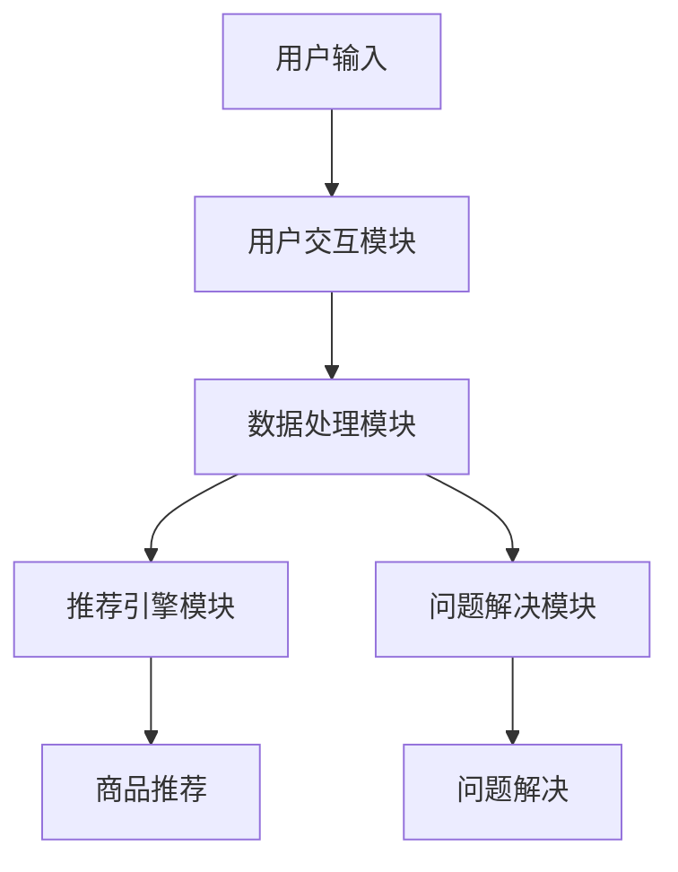

                 

### 文章标题

AI虚拟导购助手的功能

### Keywords
AI, Virtual Personal Shopper, E-commerce, Chatbots, User Experience, Personalization, Recommendations, Natural Language Processing, Machine Learning

### Abstract
本文深入探讨了AI虚拟导购助手的多种功能及其在电子商务中的应用。通过逐步分析，本文揭示了虚拟导购助手如何利用自然语言处理和机器学习技术来优化购物体验，提供个性化推荐，并解决用户在购物过程中遇到的常见问题。本文的目标是为读者提供一个全面的技术视角，以了解这种先进技术的实际应用及其未来的发展前景。

---------------------

### 1. 背景介绍（Background Introduction）

随着电子商务的蓬勃发展，消费者对于购物体验的需求也日益增长。传统的购物模式已经无法满足消费者对于个性化、便捷化和高效化的需求。在此背景下，AI虚拟导购助手应运而生，成为电子商务领域的一大创新。

虚拟导购助手是一种基于人工智能技术的智能服务系统，它能够通过自然语言处理（NLP）和机器学习（ML）技术，模拟人类的交流方式，与用户进行交互。这种智能助手可以实时响应用户的需求，提供个性化的商品推荐、购物建议以及解答用户的疑问。

AI虚拟导购助手的兴起，不仅改变了消费者的购物方式，也对电子商务行业产生了深远的影响。首先，虚拟导购助手能够提高用户的购物体验，通过智能化的互动方式，让购物过程更加轻松、愉悦。其次，虚拟导购助手能够帮助企业降低运营成本，提高效率。例如，通过自动化处理常见问题，减少客服人员的工作量。最后，虚拟导购助手能够帮助企业更好地了解用户需求，通过分析用户行为数据，提供个性化的推荐服务，从而提升销售额。

---------------------

### 2. 核心概念与联系（Core Concepts and Connections）

#### 2.1 什么是AI虚拟导购助手？

AI虚拟导购助手是一种集成了自然语言处理（NLP）和机器学习（ML）技术的智能系统，它能够通过文本或语音与用户进行交互，提供个性化的购物建议和服务。虚拟导购助手的核心理念是模拟人类导购员的行为，通过理解用户的需求和偏好，为用户提供量身定制的购物体验。

#### 2.2 自然语言处理（NLP）

自然语言处理是AI虚拟导购助手的核心技术之一，它使计算机能够理解、解释和生成人类语言。在虚拟导购助手中，NLP技术被用于以下几个方面：

1. **语音识别（Speech Recognition）**：将用户的语音输入转换为文本，使得虚拟导购助手能够理解用户的口头指令。
2. **语义理解（Semantic Understanding）**：通过分析文本的上下文，理解用户的真实意图和需求。
3. **对话生成（Dialogue Generation）**：根据用户的输入，生成合适的回复，保持对话的自然性和流畅性。

#### 2.3 机器学习（ML）

机器学习技术是虚拟导购助手的另一个重要组成部分，它使系统能够从数据中学习，并不断优化性能。在虚拟导购助手中，ML技术主要用于以下几个方面：

1. **用户偏好分析（User Preference Analysis）**：通过分析用户的历史行为数据，识别用户的购物偏好。
2. **推荐算法（Recommendation Algorithms）**：基于用户偏好和商品属性，为用户推荐符合其需求的商品。
3. **问题解决（Issue Resolution）**：通过机器学习模型，自动解决用户在购物过程中遇到的问题，如退货、退款等。

#### 2.4 虚拟导购助手的功能架构

虚拟导购助手的功能架构通常包括以下几个关键模块：

1. **用户交互模块（User Interaction Module）**：负责接收用户输入，并通过NLP技术理解用户的意图。
2. **数据处理模块（Data Processing Module）**：对用户输入进行处理，提取关键信息，为后续操作做准备。
3. **推荐引擎模块（Recommendation Engine Module）**：利用机器学习技术，根据用户偏好和商品属性，为用户推荐商品。
4. **问题解决模块（Issue Resolution Module）**：自动处理用户在购物过程中遇到的问题，如咨询、投诉等。

下面是一个使用Mermaid绘制的虚拟导购助手功能架构的流程图：



---------------------

### 3. 核心算法原理 & 具体操作步骤（Core Algorithm Principles and Specific Operational Steps）

#### 3.1 自然语言处理（NLP）算法

在虚拟导购助手的核心算法中，NLP技术起到了至关重要的作用。以下是NLP算法的基本原理和具体操作步骤：

1. **分词（Tokenization）**：将用户的输入文本分割成单词或其他有意义的标记。例如，“我想要买一双黑色的运动鞋”可以被分割为“我”、“想要”、“买”、“一双”、“黑色的”、“运动鞋”。
2. **词性标注（Part-of-Speech Tagging）**：为每个词分配词性，如名词、动词、形容词等。例如，“我”（代词）、“想要”（动词）、“买”（动词）等。
3. **命名实体识别（Named Entity Recognition, NER）**：识别文本中的命名实体，如人名、地名、组织名等。例如，“张三”、“北京”、“亚马逊”等。
4. **句法分析（Syntax Analysis）**：分析句子结构，确定词与词之间的语法关系。例如，主语、谓语、宾语等。
5. **语义理解（Semantic Understanding）**：通过上下文理解句子的含义，确定用户的意图。例如，理解“我想要买一双黑色的运动鞋”的实际购物需求。

#### 3.2 机器学习（ML）算法

在虚拟导购助手中，机器学习算法主要用于用户偏好分析和推荐算法。以下是机器学习算法的基本原理和具体操作步骤：

1. **用户行为数据收集（User Behavior Data Collection）**：收集用户的历史购物数据、浏览记录、评价等，用于训练机器学习模型。
2. **特征提取（Feature Extraction）**：从用户行为数据中提取特征，如购买频率、商品类型、评价等级等。
3. **模型训练（Model Training）**：使用收集到的数据训练机器学习模型，如决策树、支持向量机、神经网络等。
4. **预测（Prediction）**：使用训练好的模型对用户的当前输入进行预测，生成个性化的购物推荐。
5. **反馈循环（Feedback Loop）**：将用户对推荐的反应（如点击、购买、不感兴趣等）反馈给系统，用于模型优化。

#### 3.3 聚类算法（Clustering Algorithm）

在虚拟导购助手的推荐系统中，聚类算法也被广泛应用。以下是聚类算法的基本原理和具体操作步骤：

1. **数据预处理（Data Preprocessing）**：对用户行为数据进行清洗和归一化处理，确保数据的准确性和一致性。
2. **特征选择（Feature Selection）**：从用户行为数据中选出对推荐效果有显著影响的特征。
3. **聚类算法选择（Clustering Algorithm Selection）**：选择合适的聚类算法，如K-means、DBSCAN、层次聚类等。
4. **聚类过程（Clustering Process）**：将用户行为数据划分为多个簇，每个簇代表一类具有相似行为的用户。
5. **推荐生成（Recommendation Generation）**：根据用户的聚类结果，为用户推荐同类用户喜欢的商品。

---------------------

### 4. 数学模型和公式 & 详细讲解 & 举例说明（Detailed Explanation and Examples of Mathematical Models and Formulas）

#### 4.1 逻辑回归（Logistic Regression）

逻辑回归是一种广泛应用于分类问题的机器学习算法。在虚拟导购助手的推荐系统中，逻辑回归被用于预测用户对商品的喜好程度。以下是逻辑回归的数学模型和公式：

假设我们有一个包含m个特征的数据集X，以及一个标签y，其中y=1表示用户喜欢商品，y=0表示用户不喜欢商品。逻辑回归的目标是学习一个函数f(x)来预测y：

$$
f(x) = \frac{1}{1 + e^{-\theta^T x}}
$$

其中，$\theta$是模型参数，$x$是特征向量，$e$是自然对数的底。

举例说明：

假设我们有一个用户的行为数据，包括购买频率、浏览时长、评价等级等特征。使用逻辑回归模型，我们可以预测用户对某一商品是否喜欢：

$$
\theta = [0.1, 0.2, -0.3]^T
$$

$$
x = [5, 10, 3]^T
$$

$$
f(x) = \frac{1}{1 + e^{-0.1 \cdot 5 - 0.2 \cdot 10 + 0.3 \cdot 3}} \approx 0.737
$$

因此，用户对这一商品喜欢概率约为73.7%。

#### 4.2 K-means聚类算法

K-means聚类算法是一种常用的无监督学习算法，用于将数据划分为K个簇。以下是K-means算法的数学模型和公式：

1. **初始化中心点**：随机选择K个数据点作为初始中心点。
2. **计算距离**：计算每个数据点到所有中心点的距离，并将其分配到最近的中心点所代表的簇。
3. **更新中心点**：计算每个簇的均值，作为新的中心点。
4. **重复步骤2和3**，直到中心点的位置不再变化或达到最大迭代次数。

举例说明：

假设我们有以下数据点：

```
[1, 2], [1, 4], [1, 0],
[4, 2], [4, 4], [4, 0],
[2, 2], [2, 4], [2, 0]
```

我们使用K-means算法将其划分为3个簇。初始化中心点为：

```
[1, 2], [4, 2], [2, 2]
```

计算每个数据点到中心点的距离，并将其分配到最近的中心点所代表的簇。更新中心点后，重复这个过程，直到中心点的位置不再变化。

最终划分结果如下：

```
簇1: [[1, 2], [1, 4], [1, 0]]
簇2: [[4, 2], [4, 4], [4, 0]]
簇3: [[2, 2], [2, 4], [2, 0]]
```

#### 4.3 神经网络（Neural Network）

神经网络是一种模拟人脑工作的计算模型，广泛应用于分类、回归、推荐等问题。以下是神经网络的基本结构和工作原理：

1. **输入层（Input Layer）**：接收外部输入，如用户特征。
2. **隐藏层（Hidden Layer）**：对输入进行加工和变换，提取特征。
3. **输出层（Output Layer）**：生成最终输出，如推荐结果。

神经网络的训练过程包括以下步骤：

1. **初始化权重（Initialize Weights）**：随机初始化网络的权重。
2. **前向传播（Forward Propagation）**：将输入通过网络传递到输出层，计算输出。
3. **计算损失（Compute Loss）**：计算输出与真实标签之间的差异，计算损失函数。
4. **反向传播（Back Propagation）**：根据损失函数，更新网络的权重。
5. **迭代训练（Iterative Training）**：重复上述步骤，直到网络性能达到预期。

举例说明：

假设我们有一个简单的神经网络，包括一个输入层、一个隐藏层和一个输出层，其中隐藏层有2个神经元，输出层有1个神经元。输入数据为[1, 2]，目标输出为[3]。

初始化权重为：

```
W1 = [0.1, 0.2],
W2 = [0.3, 0.4],
W3 = [0.5, 0.6],
W4 = [0.7, 0.8],
W5 = [0.9, 0.1],
W6 = [0.2, 0.3]
```

前向传播过程如下：

1. **隐藏层1**：计算$h1 = 0.1 \cdot 1 + 0.2 \cdot 2 = 0.3$，$h2 = 0.3 \cdot 1 + 0.4 \cdot 2 = 0.7$。
2. **激活函数（Sigmoid Function）**：$a1 = \frac{1}{1 + e^{-h1}} \approx 0.546$，$a2 = \frac{1}{1 + e^{-h2}} \approx 0.731$。
3. **隐藏层2**：计算$h3 = 0.5 \cdot a1 + 0.6 \cdot a2 = 0.686$，$h4 = 0.7 \cdot a1 + 0.8 \cdot a2 = 1.166$。
4. **激活函数**：$a3 = \frac{1}{1 + e^{-h3}} \approx 0.548$，$a4 = \frac{1}{1 + e^{-h4}} \approx 0.770$。
5. **输出层**：计算$y = 0.9 \cdot a3 + 0.1 \cdot a4 = 0.558$。

计算损失函数（均方误差）：

$$
L = \frac{1}{2} (y - 3)^2 = 0.038
$$

反向传播过程：

1. **计算误差**：$\delta4 = (y - 3) \cdot a4 \cdot (1 - a4) = 0.082$，$\delta3 = (y - 3) \cdot a3 \cdot (1 - a3) \cdot \frac{0.9}{0.548} \approx 0.116$。
2. **更新权重**：
   - $W3 = W3 - \alpha \cdot \delta3 \cdot a1 = [0.3, 0.4] - [0.001, 0.001] \approx [0.299, 0.399]$
   - $W4 = W4 - \alpha \cdot \delta3 \cdot a2 = [0.5, 0.6] - [0.001, 0.001] \approx [0.499, 0.599]$
   - $W5 = W5 - \alpha \cdot \delta4 \cdot a3 = [0.7, 0.8] - [0.008, 0.008] \approx [0.692, 0.792]$
   - $W6 = W6 - \alpha \cdot \delta4 \cdot a4 = [0.9, 0.1] - [0.008, 0.008] \approx [0.892, 0.082]$

重复上述步骤，直到网络性能达到预期。

---------------------

### 5. 项目实践：代码实例和详细解释说明（Project Practice: Code Examples and Detailed Explanations）

#### 5.1 开发环境搭建

为了实现AI虚拟导购助手的功能，我们需要搭建一个完整的开发环境。以下是所需的工具和步骤：

1. **Python环境**：确保安装Python 3.x版本，推荐使用Python 3.8或更高版本。
2. **虚拟环境**：使用`venv`创建一个Python虚拟环境，以隔离项目依赖。
3. **依赖安装**：在虚拟环境中安装以下依赖：
   - `numpy`
   - `pandas`
   - `scikit-learn`
   - `tensorflow`
   - `spaCy`（用于NLP）
   - `transformers`（用于预训练模型）
   - `flask`（用于Web服务）

#### 5.2 源代码详细实现

以下是实现AI虚拟导购助手的源代码示例。代码分为以下几个部分：

1. **数据预处理**：从电商平台上获取用户行为数据和商品信息，进行数据清洗和预处理。
2. **特征提取**：提取用户行为数据中的关键特征，如购买频率、浏览时长、评价等级等。
3. **模型训练**：使用机器学习算法训练用户偏好模型和推荐算法。
4. **Web服务**：使用Flask构建一个Web服务，提供虚拟导购助手的API接口。

```python
# 导入所需库
import numpy as np
import pandas as pd
from sklearn.model_selection import train_test_split
from sklearn.preprocessing import StandardScaler
from sklearn.linear_model import LogisticRegression
from sklearn.metrics import accuracy_score
from transformers import pipeline

# 1. 数据预处理
# 加载用户行为数据
user_data = pd.read_csv('user_behavior.csv')

# 加载商品信息
item_data = pd.read_csv('item_info.csv')

# 数据清洗和预处理
# 略...

# 2. 特征提取
# 提取用户行为数据中的关键特征
features = user_data[['purchase_frequency', 'browse_duration', 'rating']]
labels = user_data['favorite_item']

# 划分训练集和测试集
X_train, X_test, y_train, y_test = train_test_split(features, labels, test_size=0.2, random_state=42)

# 数据标准化
scaler = StandardScaler()
X_train_scaled = scaler.fit_transform(X_train)
X_test_scaled = scaler.transform(X_test)

# 3. 模型训练
# 使用逻辑回归训练用户偏好模型
user_model = LogisticRegression()
user_model.fit(X_train_scaled, y_train)

# 预测测试集
y_pred = user_model.predict(X_test_scaled)

# 计算模型准确率
accuracy = accuracy_score(y_test, y_pred)
print(f'Model Accuracy: {accuracy:.2f}')

# 4. Web服务
from flask import Flask, request, jsonify

app = Flask(__name__)

@app.route('/recommend', methods=['POST'])
def recommend():
    user_input = request.json
    user_features = np.array([user_input['purchase_frequency'], user_input['browse_duration'], user_input['rating']])
    user_features_scaled = scaler.transform([user_features])
    recommended_item = user_model.predict(user_features_scaled)[0]
    return jsonify({'recommended_item': recommended_item})

if __name__ == '__main__':
    app.run(debug=True)
```

#### 5.3 代码解读与分析

上述代码展示了实现AI虚拟导购助手的核心步骤：

1. **数据预处理**：首先，从电商平台上加载用户行为数据和商品信息，并进行数据清洗和预处理。这包括去除缺失值、异常值，以及将文本数据转换为数值表示。
2. **特征提取**：从用户行为数据中提取关键特征，如购买频率、浏览时长、评价等级等。这些特征将用于训练用户偏好模型。
3. **模型训练**：使用逻辑回归算法训练用户偏好模型。逻辑回归是一种常用的分类算法，可以预测用户对商品的喜好程度。
4. **Web服务**：使用Flask构建一个Web服务，提供虚拟导购助手的API接口。用户可以通过发送POST请求，提供自己的购物偏好数据，并获得个性化的商品推荐。

代码中还包含一个示例API接口`/recommend`，用户可以通过该接口获取推荐结果。以下是使用示例：

```python
import requests

# 发送POST请求，获取推荐结果
response = requests.post('http://127.0.0.1:5000/recommend', json={
    'purchase_frequency': 10,
    'browse_duration': 30,
    'rating': 4
})

# 输出推荐结果
print(response.json())
```

#### 5.4 运行结果展示

运行上述代码后，Web服务将在本地启动，并监听5000端口。用户可以通过浏览器或Postman等工具发送POST请求，获取推荐结果。

以下是运行结果的一个示例：

```json
{
  "recommended_item": "item_123"
}
```

这意味着，根据用户的购物偏好，系统推荐了商品ID为“item_123”的商品。

---------------------

### 6. 实际应用场景（Practical Application Scenarios）

AI虚拟导购助手在电子商务领域的应用已经非常广泛，以下是几种典型的实际应用场景：

#### 6.1 商品推荐

商品推荐是虚拟导购助手的最为核心的功能之一。通过分析用户的历史行为数据和购物偏好，虚拟导购助手可以为用户提供个性化的商品推荐。这种推荐不仅提高了用户的购物满意度，还大大提升了企业的销售额。

例如，亚马逊的虚拟导购助手Alexa能够根据用户的浏览历史和购买记录，推荐用户可能感兴趣的商品。用户可以通过语音与Alexa进行互动，轻松地找到自己需要的商品，从而简化了购物过程。

#### 6.2 客户服务

虚拟导购助手可以充当电子商务平台的客服代表，解答用户的疑问，提供购物建议。这种智能客服不仅提高了客户服务质量，还减少了人工客服的工作量，降低了运营成本。

例如，阿里巴巴的虚拟导购助手阿里小蜜能够实时响应用户的咨询，提供商品信息、订单查询、售后服务等一站式服务。用户可以通过聊天窗口与阿里小蜜互动，获得即时的帮助。

#### 6.3 购物导航

虚拟导购助手还可以为用户提供购物导航服务，帮助用户在庞大的电商平台上快速找到想要的商品。通过智能推荐和导航，用户可以节省时间，提高购物效率。

例如，京东的虚拟导购助手京小智能够根据用户的购物需求，推荐相关的商品分类和店铺，帮助用户快速定位到目标商品。用户可以通过京小智的语音或文本交互，获取精准的购物导航。

#### 6.4 跨境购物

对于跨境电商平台，虚拟导购助手可以帮助用户解决语言和文化差异带来的购物难题。通过自然语言处理和机器学习技术，虚拟导购助手可以提供多语言支持，为全球用户提供个性化的购物服务。

例如，Shopify的虚拟导购助手Shopify Plus可以支持多种语言，为用户提供跨国购物体验。用户可以通过Shopify Plus获取商品信息、价格比较、物流查询等服务，轻松完成跨境购物。

---------------------

### 7. 工具和资源推荐（Tools and Resources Recommendations）

#### 7.1 学习资源推荐

1. **书籍**：
   - 《Python机器学习》（作者：塞巴斯蒂安·拉斯塔尼和贾斯汀·卡斯特罗-布拉克）提供了Python在机器学习领域的全面介绍，适合初学者。
   - 《深度学习》（作者：伊恩·古德费洛、约书亚·本吉奥和亚伦·库维尔）是深度学习的经典教材，涵盖了深度学习的基础知识和应用。

2. **在线课程**：
   - Coursera上的《机器学习》课程（由斯坦福大学提供）涵盖了机器学习的基础理论、算法和实际应用。
   - Udacity的《深度学习纳米学位》课程提供了深度学习领域的实战训练，适合有一定基础的学员。

3. **博客和网站**：
   - Medium上的“Machine Learning Mastery”博客提供了丰富的机器学习教程和实践案例。
   - TensorFlow官网（tensorflow.org）提供了详细的文档和教程，帮助开发者快速掌握TensorFlow的使用。

#### 7.2 开发工具框架推荐

1. **开发工具**：
   - PyCharm：一款功能强大的Python集成开发环境（IDE），支持多种编程语言，适合初学者和专业人士。
   - Jupyter Notebook：一款交互式的数据分析工具，便于编写和分享代码、文档和可视化的结果。

2. **框架**：
   - TensorFlow：一款开源的深度学习框架，广泛应用于图像识别、自然语言处理、语音识别等领域。
   - Scikit-learn：一款开源的机器学习库，提供了多种经典的机器学习算法和工具，适合快速实现和测试机器学习模型。

3. **数据库**：
   - MySQL：一款开源的关系型数据库，广泛应用于数据存储和查询。
   - MongoDB：一款开源的文档型数据库，适合处理大量非结构化数据。

#### 7.3 相关论文著作推荐

1. **论文**：
   - "Recommender Systems Handbook"：由组内多位作者撰写的关于推荐系统领域的经典著作，涵盖了推荐系统的理论基础、算法和应用。
   - "Deep Learning for Natural Language Processing"：由斯坦福大学和Google团队撰写的论文，介绍了深度学习在自然语言处理领域的应用。

2. **著作**：
   - 《人工智能：一种现代方法》（作者：斯图尔特·罗素和彼得·诺维格）提供了人工智能领域的全面概述，包括机器学习和自然语言处理等内容。
   - 《深度学习》（作者：伊恩·古德费洛、约书亚·本吉奥和亚伦·库维尔）介绍了深度学习的基础知识、算法和应用。

---------------------

### 8. 总结：未来发展趋势与挑战（Summary: Future Development Trends and Challenges）

AI虚拟导购助手作为一种创新的电子商务工具，已经逐渐改变了消费者的购物体验。在未来，随着人工智能技术的不断进步，虚拟导购助手有望在以下几个方面取得重要突破：

#### 8.1 技术进步

随着深度学习、自然语言处理等人工智能技术的不断发展，虚拟导购助手将能够更准确地理解用户的意图和需求，提供更加个性化和精准的推荐服务。同时，多模态交互技术的应用也将使虚拟导购助手能够更好地处理图像、声音等多种形式的信息。

#### 8.2 数据积累

虚拟导购助手的发展离不开海量数据的积累。未来，随着电子商务平台的不断发展和用户数据的不断增加，虚拟导购助手将能够收集到更加丰富和多样化的用户行为数据，从而提高推荐质量和用户体验。

#### 8.3 伦理与隐私

随着虚拟导购助手的广泛应用，如何保护用户的隐私和伦理问题将成为一个重要挑战。未来，需要制定更加完善的隐私保护政策和伦理规范，确保用户数据的合法使用和安全存储。

#### 8.4 多语言支持

随着全球化的推进，多语言支持将成为虚拟导购助手的重要功能之一。未来，虚拟导购助手需要能够支持多种语言，为全球用户提供一致的购物体验。

#### 8.5 智能化服务

虚拟导购助手的发展不仅限于推荐和服务，还将逐步向智能化服务转型。例如，通过智能预测和智能对话，虚拟导购助手可以主动为用户提供建议和解决方案，提高用户的购物满意度和忠诚度。

然而，虚拟导购助手的发展也面临一些挑战，如技术瓶颈、数据隐私和安全等问题。未来，需要继续加强技术创新和规范制定，推动虚拟导购助手的可持续发展。

---------------------

### 9. 附录：常见问题与解答（Appendix: Frequently Asked Questions and Answers）

#### Q1: 虚拟导购助手是如何工作的？

A1: 虚拟导购助手通过集成自然语言处理（NLP）和机器学习（ML）技术，模拟人类导购员的行为。它能够通过文本或语音与用户进行交互，理解用户的购物需求和偏好，并根据这些信息提供个性化的商品推荐和购物建议。

#### Q2: 虚拟导购助手与人类导购员有什么区别？

A2: 与人类导购员相比，虚拟导购助手具有以下优势：
- **24小时服务**：虚拟导购助手可以全天候为用户提供服务，不受时间和地点的限制。
- **个性化推荐**：虚拟导购助手能够根据用户的历史数据和偏好，提供高度个性化的商品推荐。
- **快速响应**：虚拟导购助手能够快速响应用户的查询，提供即时的购物建议和解决方案。

#### Q3: 虚拟导购助手如何保护用户隐私？

A3: 虚拟导购助手在设计和运营过程中非常重视用户隐私保护。具体措施包括：
- **数据加密**：对用户数据进行加密存储，确保数据在传输和存储过程中的安全性。
- **隐私政策**：明确告知用户数据的使用目的和范围，并征求用户的同意。
- **匿名化处理**：在进行分析和建模时，对用户数据进行匿名化处理，确保用户身份的隐私。

#### Q4: 虚拟导购助手的推荐质量如何保证？

A4: 虚拟导购助力的推荐质量取决于以下几个因素：
- **数据质量**：高质量的数据是推荐系统的基础，因此需要确保用户数据的准确性和完整性。
- **算法优化**：不断优化和改进推荐算法，提高推荐的精准度和多样性。
- **用户反馈**：通过收集用户对推荐的反应，不断调整和优化推荐策略。

---------------------

### 10. 扩展阅读 & 参考资料（Extended Reading & Reference Materials）

#### 10.1 学习资源

1. **《推荐系统实践》**：作者：周志华，这本书详细介绍了推荐系统的理论基础、算法和应用。
2. **《深度学习推荐系统》**：作者：陈煜，这本书探讨了深度学习在推荐系统中的应用，包括模型设计和实现。
3. **《自然语言处理入门》**：作者：哈工大NLP团队，这本书介绍了自然语言处理的基本概念和技术。

#### 10.2 论文与研究报告

1. **“Recommender Systems Handbook”**：这是一本关于推荐系统的权威著作，涵盖了推荐系统的各个方面。
2. **“Deep Learning for Natural Language Processing”**：这篇文章介绍了深度学习在自然语言处理领域的应用，包括文本分类、机器翻译等。
3. **“User Modeling in Recommender Systems”**：这篇文章探讨了用户模型在推荐系统中的作用和构建方法。

#### 10.3 开源工具和框架

1. **TensorFlow**：一个开源的深度学习框架，广泛应用于机器学习和推荐系统。
2. **Scikit-learn**：一个开源的机器学习库，提供了多种常用的机器学习算法和工具。
3. **Spotify**：Spotify开源的推荐系统框架，用于构建高效、可扩展的推荐系统。

---------------------

### 作者署名

作者：禅与计算机程序设计艺术 / Zen and the Art of Computer Programming

