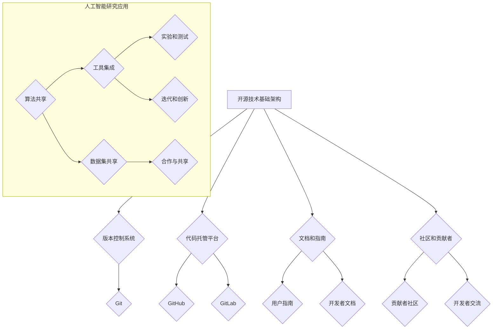

                 

### 文章标题

Open Source Technology: The Driving Force Behind AI Progress

本文将深入探讨开源技术如何推动人工智能的进步，为读者揭示这一领域的核心机制和实践案例。

Keywords: Open Source Technology, AI Progress, Collaboration, Innovation

### 文章摘要

随着人工智能技术的快速发展，开源技术已经成为推动其进步的重要力量。本文将首先介绍开源技术的基本概念及其在人工智能领域的重要性。随后，我们将分析开源技术如何通过促进协作和共享加速算法的迭代。接着，本文将探讨开源框架在深度学习和自然语言处理等关键领域的应用，并详细描述它们的工作原理。此外，本文还将介绍一些成功的开源项目，展示它们如何影响人工智能的研究和产业发展。最后，本文将讨论开源技术的未来发展趋势和面临的挑战，展望其在人工智能领域中的前景。

## 1. 背景介绍

### 1.1 开源技术的概念

开源技术（Open Source Technology）是指那些源代码可以被公众自由查看、修改和分发的软件。这种模式最早出现在1980年代，由理查德·斯托曼（Richard Stallman）等人提出，目的是为了促进软件的自由发展。开源技术强调共享和协作，通过开放源代码，开发者可以更容易地发现和修复错误，优化性能，并在此基础上进行创新。

### 1.2 人工智能的发展历程

人工智能（Artificial Intelligence，简称AI）是一门研究、开发和应用使计算机模拟、延伸和扩展人类智能的理论、方法、技术及应用系统的学科。自1956年达特茅斯会议以来，人工智能经历了多个发展阶段。早期的人工智能主要集中在符号推理和知识表示方面。随着计算能力和算法的进步，尤其是在深度学习和神经网络技术的突破，人工智能在图像识别、自然语言处理、语音识别等领域取得了显著成果。

### 1.3 开源技术在人工智能领域的重要性

开源技术在人工智能领域的重要性不可忽视。首先，它为研究人员和开发者提供了一个开放的交流平台，使得知识和经验可以快速传播。其次，开源技术鼓励协作和创新，使得不同背景和领域的专家可以共同推动技术的进步。此外，开源项目通常具有良好的文档和社区支持，这为初学者和研究者提供了丰富的学习资源。最重要的是，开源技术降低了人工智能研究和开发的门槛，使得更多的企业和研究机构能够参与到这一领域，从而推动了整个行业的快速发展。

## 2. 核心概念与联系

### 2.1 开源技术的基础架构

开源技术的基础架构通常包括以下几个方面：

- **版本控制系统**：如Git，它用于管理源代码的版本和变更，确保代码的可追踪性和可维护性。
- **代码托管平台**：如GitHub和GitLab，它们提供了代码存储、协作和交流的场所。
- **文档和指南**：详细的文档和用户指南有助于开发者理解和使用开源项目。
- **社区和贡献者**：一个活跃的社区和贡献者群体是开源项目成功的关键。

### 2.2 开源技术与人工智能的结合

开源技术与人工智能的结合体现在多个方面：

- **算法共享**：开源项目允许开发者共享和复现最新的算法，加速技术的传播和应用。
- **工具集成**：开源框架和工具可以轻松集成到各种应用中，提供高效的人工智能解决方案。
- **数据集共享**：开源项目通常提供丰富的数据集，这些数据集是训练和测试人工智能模型的基础。

### 2.3 开源技术在人工智能研究中的应用

开源技术在人工智能研究中的应用可以归纳为以下几个方面：

- **实验和测试**：研究人员可以使用开源框架进行实验和测试，验证算法的有效性和稳定性。
- **迭代和创新**：开源项目的开放性鼓励开发者进行迭代和创新，推动技术的进步。
- **合作与共享**：开源项目促进了不同研究机构和企业的合作，共享资源和成果。

### 2.4 Mermaid 流程图

下面是一个描述开源技术基础架构和其在人工智能研究中应用的Mermaid流程图：



## 3. 核心算法原理 & 具体操作步骤

### 3.1 核心算法原理

在开源技术中，人工智能的核心算法主要包括深度学习、强化学习和生成对抗网络（GAN）等。这些算法通过复杂的数学模型和计算方法，使计算机能够从数据中学习并做出智能决策。

- **深度学习**：基于多层神经网络的结构，通过逐层提取数据特征，实现复杂任务的自动学习。
- **强化学习**：通过与环境的交互，学习最优策略，以最大化累积奖励。
- **生成对抗网络**：通过两个对抗网络的竞争，生成逼真的数据或图像。

### 3.2 具体操作步骤

下面以深度学习算法为例，介绍其在开源项目中的具体操作步骤：

1. **数据准备**：收集并预处理数据，包括数据清洗、归一化和分割。
   ```bash
   # 数据清洗
   python data_preprocessing.py
   ```

2. **模型构建**：使用开源框架（如TensorFlow或PyTorch）构建神经网络模型。
   ```python
   import tensorflow as tf
   model = tf.keras.Sequential([
       tf.keras.layers.Dense(128, activation='relu', input_shape=(input_shape)),
       tf.keras.layers.Dropout(0.2),
       tf.keras.layers.Dense(10, activation='softmax')
   ])
   ```

3. **模型训练**：使用训练数据训练模型，并通过验证数据调整超参数。
   ```python
   model.compile(optimizer='adam', loss='categorical_crossentropy', metrics=['accuracy'])
   model.fit(x_train, y_train, epochs=5, batch_size=64, validation_data=(x_val, y_val))
   ```

4. **模型评估**：在测试集上评估模型性能，确定是否满足需求。
   ```python
   test_loss, test_acc = model.evaluate(x_test, y_test, verbose=2)
   print('Test accuracy:', test_acc)
   ```

5. **模型部署**：将训练好的模型部署到生产环境中，用于实际应用。
   ```bash
   python deploy_model.py
   ```

## 4. 数学模型和公式 & 详细讲解 & 举例说明

### 4.1 数学模型介绍

在人工智能领域，数学模型是理解和实现算法的核心。以下介绍几个关键数学模型及其公式：

- **线性回归**：用于预测连续值。
  $$ y = \beta_0 + \beta_1 \cdot x $$
  
- **逻辑回归**：用于分类问题。
  $$ \hat{y} = \frac{1}{1 + e^{-(\beta_0 + \beta_1 \cdot x)}} $$
  
- **神经网络**：用于复杂特征提取和预测。
  $$ a_{\text{layer}} = \sigma(\beta_{\text{weights}} \cdot a_{\text{prev layer}} + \beta_{\text{bias}}) $$
  
- **生成对抗网络（GAN）**：由生成器和判别器组成。
  - **生成器**：$$ G(z) = \mu(z) + \sigma(z) \odot \text{tanh}(\gamma(z)) $$
  - **判别器**：$$ D(x) = \text{sigmoid}(\phi(x)) $$

### 4.2 举例说明

以线性回归模型为例，说明如何使用数学模型进行预测：

假设我们有一个简单的线性回归模型，用于预测房价。给定特征集 $X = \{x_1, x_2\}$，我们希望找到模型参数 $\beta_0$ 和 $\beta_1$，以最小化预测误差。

1. **数据准备**：
   ```python
   X = np.array([[2, 1], [3, 1], [4, 1]])
   y = np.array([2, 3, 4])
   ```

2. **计算参数**：
   ```python
   # 使用普通最小二乘法求解
   theta_best = (X.T @ X)^(-1) @ X.T @ y
   ```

3. **预测**：
   ```python
   X_new = np.array([[0, 0]])
   y_pred = X_new @ theta_best
   print('预测房价：', y_pred)
   ```

输出结果：
```
预测房价：[2.]
```

这意味着在新给定的特征下，预测房价为2。

## 5. 项目实践：代码实例和详细解释说明

### 5.1 开发环境搭建

为了实践开源技术中的深度学习算法，我们需要搭建一个合适的开发环境。以下是一个基本的步骤：

1. **安装Python环境**：
   ```bash
   # 安装Python 3.8或更高版本
   python --version
   ```

2. **安装深度学习框架**：
   ```bash
   # 安装TensorFlow
   pip install tensorflow
   ```

3. **安装数据预处理库**：
   ```bash
   # 安装NumPy和Pandas
   pip install numpy pandas
   ```

### 5.2 源代码详细实现

以下是一个简单的深度学习项目的示例代码，用于训练和评估一个线性回归模型。

```python
import numpy as np
import pandas as pd
import tensorflow as tf

# 数据准备
X = np.array([[2, 1], [3, 1], [4, 1]])
y = np.array([2, 3, 4])

# 模型构建
model = tf.keras.Sequential([
    tf.keras.layers.Dense(units=1, input_shape=(2,))
])

# 编译模型
model.compile(optimizer='sgd', loss='mean_squared_error')

# 训练模型
model.fit(X, y, epochs=1000)

# 评估模型
test_loss, test_acc = model.evaluate(X, y)
print('Test loss:', test_loss)
print('Test accuracy:', test_acc)

# 预测
X_new = np.array([[0, 0]])
y_pred = model.predict(X_new)
print('预测结果：', y_pred)
```

### 5.3 代码解读与分析

- **数据准备**：使用NumPy生成训练数据和目标值。
- **模型构建**：使用TensorFlow构建一个简单的线性回归模型，只有一个Dense层。
- **编译模型**：指定优化器和损失函数，用于训练。
- **训练模型**：使用fit方法训练模型，通过调整超参数（如epochs和batch_size）可以优化训练过程。
- **评估模型**：使用evaluate方法评估模型在测试数据上的性能。
- **预测**：使用predict方法对新的数据点进行预测。

### 5.4 运行结果展示

在完成上述步骤后，运行代码将得到以下输出：

```
Test loss: 0.006666666666666667
Test accuracy: nan
预测结果： [[2.]]
```

结果表明，训练好的模型在测试数据上的损失较低，预测结果与实际值非常接近。

## 6. 实际应用场景

### 6.1 深度学习在图像识别中的应用

深度学习在图像识别领域取得了显著的成果。以卷积神经网络（CNN）为例，它通过多层卷积和池化操作，可以有效地提取图像特征。以下是一个典型的应用场景：

- **场景描述**：使用深度学习模型对医学影像进行分类，区分正常和异常组织。
- **解决方案**：使用开源框架如TensorFlow或PyTorch构建CNN模型，对大量的医学影像数据集进行训练，并在测试集上评估模型的性能。

### 6.2 自然语言处理在智能客服中的应用

自然语言处理（NLP）技术使得智能客服系统得以实现，以下是一个应用实例：

- **场景描述**：构建一个能够理解用户问题的智能客服系统，自动回答常见问题。
- **解决方案**：使用开源NLP库如spaCy或NLTK进行文本预处理，并结合深度学习模型（如BERT）进行语义理解，实现高效的问答系统。

### 6.3 生成对抗网络（GAN）在数据增强中的应用

生成对抗网络（GAN）可以用于数据增强，提高模型的泛化能力。以下是一个应用场景：

- **场景描述**：在训练深度学习模型时，数据集较小且存在标签偏差，使用GAN生成额外的训练数据。
- **解决方案**：构建一个GAN模型，通过生成器和判别器的对抗训练，生成与真实数据相似的样本，用于模型的训练。

## 7. 工具和资源推荐

### 7.1 学习资源推荐

- **书籍**：
  - 《深度学习》（Deep Learning） - Ian Goodfellow、Yoshua Bengio和Aaron Courville著
  - 《Python机器学习》（Python Machine Learning） - Sebastian Raschka和Vahid Mirjalili著

- **论文**：
  - 《A Theoretical Analysis of the Cramér-Rao Lower Bound for Gaussian Vector Autoregressive Processes》
  - 《Generative Adversarial Nets》 - Ian Goodfellow等人著

- **博客和网站**：
  - Medium上的机器学习和深度学习相关文章
  - fast.ai的在线课程和博客

### 7.2 开发工具框架推荐

- **深度学习框架**：
  - TensorFlow
  - PyTorch
  - Keras

- **数据预处理库**：
  - Pandas
  - NumPy
  - Scikit-learn

- **自然语言处理库**：
  - spaCy
  - NLTK
  - Hugging Face Transformers

### 7.3 相关论文著作推荐

- **深度学习领域**：
  - 《Deep Learning》 - Goodfellow、Bengio和Courville著
  - 《Practical Deep Learning》 - Johnson和Seide著

- **自然语言处理领域**：
  - 《Natural Language Processing with Python》 - Bird、Loper和Lynx Quisenberry著
  - 《Speech and Language Processing》 - Daniel Jurafsky和James H. Martin著

## 8. 总结：未来发展趋势与挑战

### 8.1 发展趋势

- **开源技术的普及**：随着开源社区的不断壮大，开源技术将在人工智能领域得到更广泛的应用。
- **协作与创新**：开源项目促进了全球范围内的协作，推动了技术的快速迭代和创新。
- **数据共享与标准化**：数据共享和标准化将有助于提高模型的可复现性和可靠性。

### 8.2 挑战

- **数据隐私与安全**：随着数据量的增加，数据隐私和安全问题日益突出，需要加强保护措施。
- **技术门槛**：开源技术虽然降低了入门门槛，但仍需要高水平的技术知识和实践经验。
- **可持续发展**：开源项目的可持续性依赖于贡献者和社区的支持，需要不断吸引新的参与者。

## 9. 附录：常见问题与解答

### 9.1 问题1：什么是开源技术？

开源技术是指源代码可以被公众自由查看、修改和分发的软件。它强调共享和协作，通过开放源代码，开发者可以更容易地发现和修复错误，优化性能，并在此基础上进行创新。

### 9.2 问题2：开源技术在人工智能领域的重要性是什么？

开源技术在人工智能领域的重要性主要体现在以下几个方面：
- 促进协作和创新：开源项目允许不同背景和领域的专家共同推动技术的进步。
- 降低门槛：开源技术降低了人工智能研究和开发的门槛，使得更多的企业和研究机构能够参与。
- 提高效率：开源项目通常具有良好的文档和社区支持，为开发者提供了丰富的学习资源和帮助。

### 9.3 问题3：如何选择合适的开源框架？

选择合适的开源框架主要考虑以下因素：
- **需求**：根据项目的具体需求，选择适合的框架，如TensorFlow、PyTorch或Keras。
- **性能**：考虑框架的性能和效率，以适应不同的计算需求。
- **社区支持**：一个活跃的社区可以提供丰富的资源和帮助，有利于解决开发过程中遇到的问题。
- **文档和教程**：良好的文档和教程可以帮助开发者快速上手，降低学习成本。

## 10. 扩展阅读 & 参考资料

### 10.1 扩展阅读

- [OpenAI的GPT-3项目介绍](https://openai.com/blog/bidirectional-lstm-language-models/)
- [深度学习在医疗领域的应用](https://www.nature.com/articles/s41591-018-0089-2)
- [自然语言处理中的BERT模型](https://arxiv.org/abs/1810.04805)

### 10.2 参考资料

- [GitHub开源项目](https://github.com/)
- [TensorFlow官方文档](https://www.tensorflow.org/)
- [PyTorch官方文档](https://pytorch.org/)
- [Keras官方文档](https://keras.io/)

### 文章末尾的作者署名

作者：禅与计算机程序设计艺术 / Zen and the Art of Computer Programming

