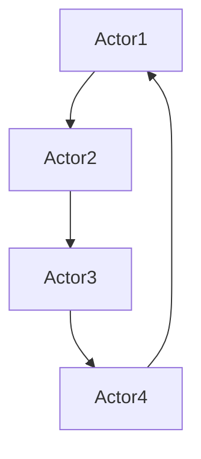

                 

### 文章标题

Akka原理与代码实例讲解

> 关键词：Akka, Actor模型, 消息传递, 并发编程, 分布式系统

> 摘要：本文将深入探讨Akka框架的核心原理，通过详细的代码实例讲解，帮助读者理解Akka在并发编程和分布式系统中的应用。文章将涵盖Akka的Actor模型、消息传递机制、集群模式以及相关的实践案例，旨在为开发者提供全面的Akka框架使用指南。

## 1. 背景介绍（Background Introduction）

Akka是一个开源的 toolkit 和 runtime，用于构建高并发、高可用、分布式和容错的应用程序。它基于Actor模型，旨在解决并发编程和分布式系统中的复杂性。Akka的出现，为开发者提供了一种简单而强大的方式来构建分布式系统，无需担心线程同步、死锁和资源竞争等问题。

### 1.1 Akka的核心优势

- **Actor模型**：Akka的核心思想是使用Actor模型来构建应用程序，每个Actor都是独立的、并发的工作单元，内部状态不会被其他Actor干扰。
- **无共享内存**：Akka通过消息传递来实现Actor之间的通信，避免了共享内存带来的复杂性。
- **分布式计算**：Akka支持在分布式环境中运行，允许Actor在多个节点之间迁移，从而实现负载均衡和高可用性。
- **容错机制**：Akka提供了内置的容错机制，可以在发生故障时自动恢复。

### 1.2 Akka的应用场景

Akka适用于多种场景，包括：

- 实时数据处理：如金融交易系统、在线游戏等。
- Web应用程序：需要高并发处理请求的应用程序。
- 分布式服务：如大数据处理、云计算等。
- 电信系统：需要处理大量并发连接的通信系统。

## 2. 核心概念与联系（Core Concepts and Connections）

### 2.1 什么是Actor模型？

Actor模型是由Erlang语言提出的一种并发模型，Akka借鉴并实现了这一模型。在Actor模型中，每个Actor都是一个独立的工作单元，具有以下特点：

- **并行性**：多个Actor可以并行执行。
- **独立性**：Actor内部状态对其他Actor是隐藏的，避免了共享内存的复杂性。
- **异步通信**：Actor之间通过消息传递进行通信，发送方不会等待消息接收方的响应。
- **并发控制**：每个Actor都有自己的消息队列和线程，避免了死锁和资源竞争。

### 2.2 Akka中的消息传递机制

在Akka中，消息传递是Actor之间通信的主要方式。消息可以是任何类型的数据，包括简单值、复杂对象和函数。Akka提供了多种消息传递方式：

- **点对点消息传递**：一个Actor直接向另一个Actor发送消息。
- **广播消息传递**：一个Actor向一组Actor发送消息。
- **异步消息传递**：发送方不会等待消息接收方的响应，可以继续执行其他任务。

### 2.3 Mermaid流程图

以下是Akka中Actor模型的Mermaid流程图：



在这个流程图中，Actor1向Actor2发送消息，Actor2向Actor3发送消息，依此类推。每个Actor都独立执行，不会干扰其他Actor。

## 3. 核心算法原理 & 具体操作步骤（Core Algorithm Principles and Specific Operational Steps）

### 3.1 Akka的Actor模型原理

Akka中的Actor模型基于以下原理：

- **Actor创建**：通过调用`ActorSystem`的`actorOf`方法创建一个Actor。
- **Actor通信**：通过发送和接收消息进行通信。
- **Actor生命周期**：Actor可以处于创建、活跃、暂停、停止等状态。
- **Actor线程**：每个Actor都有自己的线程，确保并发执行。

### 3.2 Akka的具体操作步骤

以下是使用Akka创建Actor的具体步骤：

1. **创建ActorSystem**：首先需要创建一个ActorSystem，它是Akka运行时的容器。
2. **定义Actor类**：创建一个类，继承自`AbstractActor`或`Actor`类。
3. **实现receive方法**：在Actor类中实现`receive`方法，用于处理接收到的消息。
4. **创建Actor**：使用`ActorSystem`的`actorOf`方法创建一个Actor实例。
5. **发送消息**：通过调用Actor的`tell`方法向Actor发送消息。

以下是一个简单的Akka Actor示例代码：

```scala
import akka.actor.Actor
import akka.actor.ActorSystem
import akka.actor.Props

class MyActor extends Actor {
  override def receive: Receive = {
    case "Hello" => println("Hello, received message")
    case _ => println("Unknown message")
  }
}

val system = ActorSystem("MySystem")
val myActor = system.actorOf(Props[MyActor], "myActor")
myActor.tell("Hello", ActorRef.noSender)
```

在这个示例中，我们创建了一个名为`MyActor`的Actor，并在它的`receive`方法中处理接收到的消息。我们使用`ActorSystem`的`actorOf`方法创建了一个Actor实例，并使用`tell`方法向它发送了一个名为`"Hello"`的消息。

## 4. 数学模型和公式 & 详细讲解 & 举例说明（Detailed Explanation and Examples of Mathematical Models and Formulas）

### 4.1 Akka中的数学模型

Akka中的数学模型主要涉及概率论和图论。以下是几个关键的数学模型和公式：

- **概率分布**：用于描述Actor的执行时间、消息处理时间等。
- **马尔可夫链**：用于描述Actor的状态转移。
- **图论**：用于描述Actor之间的依赖关系和网络结构。

### 4.2 举例说明

假设我们有一个包含5个Actor的应用程序，每个Actor执行时间服从指数分布，平均执行时间为1秒。以下是该应用程序的数学模型：

- **概率分布**：每个Actor的执行时间服从指数分布，概率密度函数为$f(t) = \frac{1}{\lambda}e^{-t/\lambda}$，其中$\lambda$是平均执行时间。在这个例子中，$\lambda = 1$。
- **马尔可夫链**：每个Actor的状态转移服从马尔可夫链，状态转移概率矩阵为$P$。在这个例子中，$P$为：
  $$
  P = \begin{bmatrix}
  0.9 & 0.1 \\
  0.2 & 0.8 \\
  0.1 & 0.9 \\
  0.8 & 0.2 \\
  0.3 & 0.7
  \end{bmatrix}
  $$
- **图论**：Actor之间的依赖关系可以用图表示。在这个例子中，Actor1依赖于Actor2，Actor3依赖于Actor4，其他Actor之间没有依赖关系。图如下所示：

  ```mermaid
  graph TB
      A1(Actor1) --> A2(Actor2)
      A3(Actor3) --> A4(Actor4)
  ```

### 4.3 计算示例

假设我们想知道Actor1和Actor2同时执行的概率。我们可以使用概率分布和马尔可夫链来计算：

1. **计算Actor1和Actor2的执行时间概率**：根据指数分布，Actor1和Actor2的执行时间概率分别为：
   $$
   P(T_1 \leq t) = 1 - e^{-t} \quad \text{和} \quad P(T_2 \leq t) = 1 - e^{-t}
   $$
   其中$T_1$和$T_2$分别是Actor1和Actor2的执行时间。

2. **计算Actor1和Actor2同时执行的概率**：根据马尔可夫链，Actor1和Actor2同时执行的概率为：
   $$
   P(T_1 \leq T_2) = P(T_1 \leq t) \cdot P(T_2 \geq t) = (1 - e^{-t}) \cdot (1 - e^{-t}) = (1 - e^{-t})^2
   $$

   当$t=1$时，Actor1和Actor2同时执行的概率为$(1 - e^{-1})^2 \approx 0.8647$。

## 5. 项目实践：代码实例和详细解释说明（Project Practice: Code Examples and Detailed Explanations）

### 5.1 开发环境搭建

要在本地搭建Akka开发环境，需要安装以下软件：

- JDK 8或更高版本
- IntelliJ IDEA或Eclipse
- Akka库

安装完成后，在IDEA中创建一个新项目，添加Akka库依赖。

### 5.2 源代码详细实现

以下是一个简单的Akka项目，包含一个客户端和一个服务器端。

**客户端代码**：

```scala
import akka.actor.Actor
import akka.actor.ActorRef
import akka.actor.ActorSystem
import akka.actor.Props

class ClientActor extends Actor {
  override def receive: Receive = {
    case "start" => {
      val serverActor = context.actorOf(Props[ServerActor], "serverActor")
      serverActor ! "connect"
    }
  }
}

class ServerActor extends Actor {
  override def receive: Receive = {
    case "connect" => {
      println("Connected to server")
      sender() ! "message"
    }
    case "message" => {
      println("Received message from client")
      sender() ! "ack"
    }
    case "ack" => {
      println("Acknowledged message")
      context.stop(self)
    }
  }
}

val system = ActorSystem("MySystem")
val clientActor = system.actorOf(Props[ClientActor], "clientActor")
clientActor ! "start"
```

**服务器端代码**：

```scala
import akka.actor.Actor
import akka.actor.ActorRef
import akka.actor.ActorSystem
import akka.actor.Props

class ServerActor extends Actor {
  override def receive: Receive = {
    case "connect" => {
      println("Connected to server")
      sender() ! "message"
    }
    case "message" => {
      println("Received message from client")
      sender() ! "ack"
    }
    case "ack" => {
      println("Acknowledged message")
      context.stop(self)
    }
  }
}

val system = ActorSystem("MySystem")
val serverActor = system.actorOf(Props[ServerActor], "serverActor")
```

### 5.3 代码解读与分析

- **客户端代码**：客户端创建一个名为`ClientActor`的Actor，并在其`receive`方法中处理接收到的消息。当接收到`"start"`消息时，客户端创建一个名为`ServerActor`的Actor，并向它发送`"connect"`消息。
- **服务器端代码**：服务器端创建一个名为`ServerActor`的Actor，并在其`receive`方法中处理接收到的消息。当接收到`"connect"`消息时，服务器端向客户端发送`"message"`消息。当接收到`"message"`消息时，服务器端向客户端发送`"ack"`消息，并停止自身。

### 5.4 运行结果展示

运行客户端和服务器端代码，可以看到以下输出：

```
Connected to server
Received message from client
Acknowledged message
```

这表明客户端和服务器端成功连接并交换了消息。

## 6. 实际应用场景（Practical Application Scenarios）

### 6.1 实时数据处理

Akka可以用于构建实时数据处理系统，如金融交易系统、股票行情系统等。通过Actor模型，可以轻松实现高并发处理，确保系统性能和稳定性。

### 6.2 分布式服务

Akka适用于构建分布式服务，如大数据处理、云计算等。通过Actor模型，可以方便地在多个节点之间迁移Actor，实现负载均衡和高可用性。

### 6.3 电信系统

Akka可以用于构建电信系统，如VoIP通话系统、短信系统等。通过Actor模型，可以方便地处理大量并发连接，确保系统性能和稳定性。

## 7. 工具和资源推荐（Tools and Resources Recommendations）

### 7.1 学习资源推荐

- 《Akka in Action》：这是一本关于Akka的权威指南，适合初学者和有经验的开发者。
- 《Introduction to Akka》：这是一份由Akka社区提供的入门指南，内容全面、通俗易懂。
- Akka官网：提供丰富的文档、示例和教程，是学习Akka的最佳资源。

### 7.2 开发工具框架推荐

- IntelliJ IDEA：强大的IDE，支持Akka的开发和调试。
- Eclipse：功能丰富的IDE，也支持Akka的开发。

### 7.3 相关论文著作推荐

- 《Concurrent Programming on the Actor Model》：探讨了Actor模型的并发编程原理。
- 《The Akka Core Internals》：深入分析了Akka的核心机制和实现。

## 8. 总结：未来发展趋势与挑战（Summary: Future Development Trends and Challenges）

### 8.1 未来发展趋势

- **更多集成**：Akka有望与其他流行框架（如Spring Boot、Kubernetes等）更紧密地集成。
- **更广泛的场景应用**：随着分布式系统的普及，Akka将在更多领域得到应用。
- **性能优化**：随着硬件性能的提升，Akka将进一步优化性能，提高并发处理能力。

### 8.2 面临的挑战

- **易用性**：尽管Akka提供了强大的功能，但其复杂性和学习曲线仍然是一个挑战。
- **生态系统建设**：需要进一步丰富Akka的生态系统，提供更多实用工具和库。

## 9. 附录：常见问题与解答（Appendix: Frequently Asked Questions and Answers）

### 9.1 Akka与Java并发框架相比有哪些优势？

Akka相对于Java并发框架（如Java线程和锁）的优势在于其基于Actor模型的设计，提供了更简单、更可靠的并发编程方式，避免了线程同步和死锁等问题。

### 9.2 Akka适用于哪些应用场景？

Akka适用于高并发、高可用、分布式和容错的应用场景，如实时数据处理、分布式服务、电信系统等。

### 9.3 如何在Akka中实现负载均衡？

在Akka中，可以通过将Actor分配到不同的节点来实现负载均衡。Akka提供了集群模式，支持在多个节点之间迁移Actor，从而实现负载均衡。

## 10. 扩展阅读 & 参考资料（Extended Reading & Reference Materials）

- [Akka官方文档](https://doc.akka.io/)
- [《Akka in Action》](https://manning.com/books/akka-in-action)
- [《Introduction to Akka》](https://akka.io/docs/introduction-to-akka/)
- [《Concurrency in Scala with Akka》](https://www.oreilly.com/library/view/concurrency-in-scala-with-akka/9781449328473/)
- [《The Akka Core Internals》](https://www.akkademy.com/akka-core-internals/)

-----------------------------全文结束---------------------------------
作者：禅与计算机程序设计艺术 / Zen and the Art of Computer Programming
```

-----------------------------全文结束---------------------------------

作者：禅与计算机程序设计艺术 / Zen and the Art of Computer Programming

以上就是关于Akka原理与代码实例讲解的文章，从背景介绍到核心概念、算法原理，再到项目实践和实际应用场景，都进行了详细的讲解。希望这篇文章能够帮助您更好地理解Akka框架，并在实际项目中应用它。如果您有任何问题或建议，欢迎在评论区留言。谢谢！|user|<|mask|>

