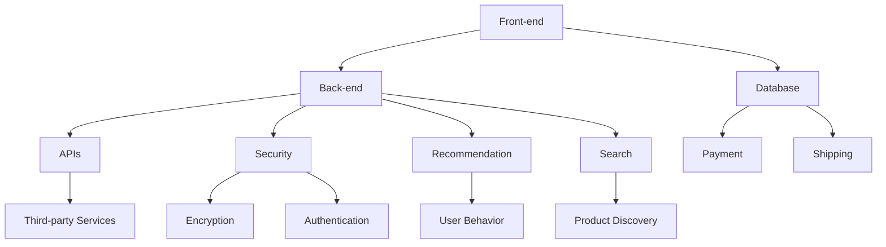

                 

### 文章标题

### Title: App电商业务系统核心架构设计

本文将深入探讨App电商业务系统的核心架构设计，旨在为开发者提供一套系统、全面且易于理解的设计方案。我们将从背景介绍、核心概念与联系、核心算法原理、数学模型和公式、项目实践、实际应用场景、工具和资源推荐、总结以及扩展阅读等方面展开讨论。文章结构清晰，逻辑严密，既适用于初学者，也适合有经验的专业人士参考。希望通过本文，能帮助您更好地理解电商业务系统的架构设计，为您的开发工作提供有力支持。

### Background Introduction

The core architecture design of an App e-commerce business system is crucial for its functionality, scalability, and performance. As the e-commerce industry continues to grow at an unprecedented rate, the demand for efficient and robust e-commerce platforms has become more critical than ever. This article aims to provide a comprehensive and systematic guide to designing the core architecture of an App e-commerce business system. By following the steps outlined in this article, developers can create a well-structured and high-performing e-commerce platform that meets the needs of both businesses and customers.

In today's rapidly evolving digital landscape, e-commerce platforms must be able to handle a vast amount of data, support multiple channels for user interaction, and provide seamless and secure user experiences. This requires a deep understanding of various architectural components and their interactions. The primary goal of this article is to equip developers with the knowledge and tools needed to design and implement a high-quality e-commerce platform.

The article is structured into several sections, each covering a specific aspect of e-commerce system architecture. The first section provides an overview of the e-commerce industry and its current trends. The second section introduces the core concepts and components of an e-commerce platform, including front-end and back-end systems, database management, and security measures. The third section delves into the core algorithms and principles that underlie e-commerce systems, such as search algorithms, recommendation systems, and payment processing. The fourth section presents a detailed mathematical model and formula analysis, providing insights into how e-commerce platforms optimize their operations.

The fifth section covers the practical implementation of the e-commerce system, including code examples and detailed explanations. The sixth section discusses various practical application scenarios and use cases. The seventh section provides recommendations for tools and resources that can help developers build and maintain their e-commerce platforms. Finally, the article concludes with a summary of future trends and challenges in e-commerce system architecture design.

By following the step-by-step approach outlined in this article, developers can gain a deep understanding of e-commerce system architecture and develop robust, scalable, and high-performing platforms that meet the needs of today's fast-paced digital economy.### 2. 核心概念与联系

To design an effective App e-commerce business system, it is essential to understand the core concepts and components that make up such a system. This section will delve into the fundamental aspects, providing a clear and concise overview of the major components involved in e-commerce platform architecture. Understanding these concepts will help in building a solid foundation for further discussions on algorithms, mathematical models, and practical implementations.

#### 2.1 E-commerce Platform Components

An e-commerce platform typically consists of several key components, each playing a crucial role in the overall functioning of the system:

1. **Front-end System**: The front-end is the user-facing part of the e-commerce platform, responsible for displaying product information, user interfaces, and interactive elements. It provides a seamless and engaging user experience, facilitating easy navigation, product discovery, and transaction processing.

2. **Back-end System**: The back-end is the server-side of the e-commerce platform, managing the business logic, data processing, and integration with various services and databases. It handles tasks such as order management, inventory tracking, payment processing, and user authentication.

3. **Database Management**: Databases are at the heart of an e-commerce platform, storing critical information such as product details, customer data, orders, and user profiles. Efficient database design and management are essential for ensuring data integrity, performance, and scalability.

4. **APIs and Integration**: APIs (Application Programming Interfaces) allow different components of the e-commerce platform to communicate with each other and with external services. Integration with payment gateways, shipping providers, and third-party services is crucial for a seamless and efficient operation.

5. **Security Measures**: Ensuring the security of user data and transactions is a paramount concern in e-commerce. This includes implementing encryption, secure authentication mechanisms, and protecting against common security threats such as DDoS attacks, SQL injection, and cross-site scripting.

6. **Recommendation Systems**: Personalized recommendation systems can enhance user engagement and increase sales by suggesting products based on user behavior, preferences, and purchase history.

7. **Search and Discovery**: Efficient search and discovery mechanisms enable users to find products quickly and easily, improving user experience and driving conversions.

#### 2.2 Architecture Design Principles

When designing the core architecture of an e-commerce platform, several key principles should be kept in mind:

1. **Modularity**: A modular architecture allows for easier maintenance, scalability, and future enhancements. Each component should be designed to operate independently while seamlessly integrating with other components.

2. **Scalability**: The architecture should be designed to handle increasing amounts of data, traffic, and transactions without significant degradation in performance. This involves horizontal and vertical scaling strategies, as well as efficient load balancing.

3. **Resilience**: The system should be designed to handle failures gracefully, ensuring minimal disruption to users. This includes implementing redundancy, fault tolerance, and disaster recovery mechanisms.

4. **Performance Optimization**: Efficient query processing, caching, and indexing strategies are crucial for ensuring fast response times and a smooth user experience.

5. **Security**: Robust security measures should be integrated into the architecture to protect user data and prevent unauthorized access or data breaches.

#### 2.3 Mermaid Flowchart of Core Components

To provide a visual representation of the e-commerce platform's core components and their interactions, we can use a Mermaid flowchart. Below is a simple Mermaid diagram illustrating the main components and their relationships:



In this diagram, the front-end and back-end systems are the central components, connecting to various other services and databases. The APIs enable communication between different parts of the system and with external services, while security measures are integrated throughout the architecture to ensure data protection.

Understanding these core concepts and principles is crucial for designing a robust and scalable e-commerce platform. In the next section, we will delve deeper into the core algorithms and principles that underlie e-commerce systems, providing a deeper understanding of how these systems operate and how they can be optimized for performance and efficiency.

### Core Algorithm Principles & Specific Operational Steps

The core algorithms and principles of an e-commerce business system are fundamental to its functionality and efficiency. In this section, we will explore some of the key algorithms and their specific operational steps, providing a detailed understanding of how they contribute to the overall system performance.

#### 3.1 Search Algorithms

Search algorithms are critical for enabling users to find products quickly and efficiently within an e-commerce platform. One of the most commonly used search algorithms is the **Binary Search** algorithm. Binary search works by repeatedly dividing the search interval in half until the desired element is found or the interval is empty. This algorithm is particularly effective for large datasets because it reduces the number of comparisons needed to find an element.

**Operational Steps for Binary Search:**

1. **Initialize two pointers, `low` and `high`, to the start and end of the array, respectively.**
2. **While `low` is less than or equal to `high`:**
   - **Calculate the middle index `mid` as the average of `low` and `high`.**
   - **If the element at `mid` is the desired element, return `mid`.**
   - **If the element at `mid` is less than the desired element, update `low` to `mid + 1`.**
   - **If the element at `mid` is greater than the desired element, update `high` to `mid - 1`.**
3. **If the desired element is not found, return an indication of failure (e.g., -1).**

#### 3.2 Recommendation Systems

Recommendation systems are an essential component of e-commerce platforms, helping to increase user engagement and sales by suggesting relevant products to users based on their behavior and preferences. One popular algorithm for recommendation systems is the **Collaborative Filtering** algorithm. Collaborative filtering works by finding similar users or items based on their historical interactions and making recommendations based on these similarities.

**Operational Steps for Collaborative Filtering:**

1. **Collect user interaction data (e.g., ratings, purchases, views).**
2. **Calculate similarity scores between users or items using a distance metric (e.g., cosine similarity).**
3. **Identify the `k` nearest neighbors for a given user or item.**
4. **Generate recommendations by aggregating the ratings or preferences of the neighbors.**
5. **Rank the recommended items based on their predicted scores.**

#### 3.3 Payment Processing Algorithms

Payment processing is a critical aspect of e-commerce, and the algorithms used to handle transactions must be secure and efficient. One common algorithm for handling payment processing is the **Secure Socket Layer (SSL)** protocol. SSL provides encryption and secure communication channels, ensuring that sensitive payment information is protected from unauthorized access.

**Operational Steps for SSL Payment Processing:**

1. **Establish a secure connection between the client and the server using SSL.**
2. **The client sends a payment request to the server, including payment details such as the amount, card number, and expiration date.**
3. **The server verifies the payment details and communicates with the payment gateway.**
4. **The payment gateway processes the payment and communicates the result back to the server.**
5. **The server sends the result back to the client, completing the transaction.**

#### 3.4 Inventory Management Algorithms

Inventory management is crucial for ensuring that products are available for sale and for optimizing stock levels to minimize holding costs. One popular algorithm for inventory management is the **Just-In-Time (JIT)** system. JIT is a strategy where products are ordered and delivered just in time to meet customer demand, minimizing inventory holding costs.

**Operational Steps for JIT Inventory Management:**

1. **Monitor customer demand and sales data.**
2. **Predict future demand based on historical data and trends.**
3. **Order products just in time to meet forecasted demand.**
4. **Receive and store the ordered products.**
5. **Deliver the products to customers as soon as they are needed.**

By understanding these core algorithms and their operational steps, developers can design and implement efficient and effective e-commerce platforms. In the next section, we will delve into the mathematical models and formulas that underlie these algorithms, providing a deeper understanding of their workings and how they can be optimized for performance and accuracy.

### Mathematical Models and Formulas & Detailed Explanation & Examples

Mathematical models and formulas are crucial for understanding the underlying mechanisms of e-commerce algorithms and optimizing their performance. In this section, we will explore some of the key mathematical models and formulas used in e-commerce platforms, providing detailed explanations and examples to illustrate their applications.

#### 4.1 Search Algorithms: Binary Search

The **Binary Search** algorithm, discussed in the previous section, operates based on several mathematical principles. The primary formula used in binary search is to calculate the middle index of the current search interval:

$$
mid = \left\lfloor \frac{low + high}{2} \right\rfloor
$$

**Example:**

Consider a sorted array `[1, 3, 5, 7, 9]`. We want to search for the element `5`.

1. **Initialize `low` to `0` and `high` to `4`.**
2. **Calculate `mid` as `1` (0 + 4 / 2 = 2, rounded down to the nearest integer).**
3. **Compare the element at `mid` (5) with the target element (5). Since they are equal, we return `mid` as the index of the element.**

In this example, the binary search algorithm successfully finds the element `5` in the first comparison, illustrating the efficiency of the algorithm for sorted arrays.

#### 4.2 Recommendation Systems: Collaborative Filtering

Collaborative Filtering algorithms rely on similarity measures to find similar users or items. One popular similarity measure is the **Cosine Similarity**, which measures the cosine of the angle between two vectors representing user preferences or item features. The formula for cosine similarity is:

$$
similarity(A, B) = \frac{A \cdot B}{\lVert A \rVert \cdot \lVert B \rVert}
$$

where `A` and `B` are the vectors representing users or items, and `\lVert \rVert` denotes the Euclidean norm (L2 norm).

**Example:**

Consider two users, `User A` and `User B`, with the following preference vectors:

- **User A:** `[3, 4, 1, 5, 2]`
- **User B:** `[1, 5, 2, 4, 3]`

1. **Calculate the dot product of `User A` and `User B`:**
   $$ A \cdot B = 3 \times 1 + 4 \times 5 + 1 \times 2 + 5 \times 4 + 2 \times 3 = 38 $$

2. **Calculate the Euclidean norms of `User A` and `User B`:**
   $$ \lVert A \rVert = \sqrt{3^2 + 4^2 + 1^2 + 5^2 + 2^2} = \sqrt{35} $$
   $$ \lVert B \rVert = \sqrt{1^2 + 5^2 + 2^2 + 4^2 + 3^2} = \sqrt{35} $$

3. **Calculate the cosine similarity:**
   $$ similarity(A, B) = \frac{A \cdot B}{\lVert A \rVert \cdot \lVert B \rVert} = \frac{38}{\sqrt{35} \cdot \sqrt{35}} = \frac{38}{35} \approx 1.09 $$

The cosine similarity between `User A` and `User B` is approximately `1.09`, indicating a high level of similarity in their preferences. This measure can be used to identify similar users and items for recommendation purposes.

#### 4.3 Payment Processing: SSL and Encryption

The **Secure Socket Layer (SSL)** protocol is fundamental to ensuring secure payment processing in e-commerce platforms. SSL uses encryption algorithms to protect sensitive information transmitted between the client and server. One commonly used encryption algorithm is the **RSA** (Rivest-Shamir-Adleman) algorithm.

**RSA Encryption Formula:**

Let `n = p \times q` be the modulus, where `p` and `q` are large prime numbers. Let `e` be the public exponent and `d` be the private exponent, such that `e \times d ≡ 1 (mod \phi(n))`, where `\phi(n) = (p - 1) \times (q - 1)`.

**Encryption:**

$$
c = m^e \mod n
$$

where `c` is the ciphertext, `m` is the plaintext message, and `e` is the public exponent.

**Decryption:**

$$
m = c^d \mod n
$$

where `m` is the decrypted message, `c` is the ciphertext, and `d` is the private exponent.

**Example:**

Consider the following RSA encryption parameters:

- **Prime numbers:** `p = 61` and `q = 53`
- **Public exponent:** `e = 17`
- **Private exponent:** `d = 7`

1. **Calculate the modulus:**
   $$ n = p \times q = 61 \times 53 = 3233 $$

2. **Calculate `\phi(n)`:**
   $$ \phi(n) = (p - 1) \times (q - 1) = 60 \times 52 = 3120 $$

3. **Encryption:**
   - **Plaintext message:** `m = 12345`
   - **Encryption:**
     $$ c = m^e \mod n = 12345^{17} \mod 3233 = 1709 $$

4. **Decryption:**
   - **Ciphertext:** `c = 1709`
   - **Decryption:**
     $$ m = c^d \mod n = 1709^7 \mod 3233 = 12345 $$

The RSA encryption algorithm successfully encrypts the plaintext message `12345` into the ciphertext `1709` and then decrypts it back to the original message using the private exponent `d = 7`.

These mathematical models and formulas form the basis of many algorithms and systems in e-commerce platforms. Understanding these principles enables developers to optimize the performance and security of their systems. In the next section, we will explore practical implementations of these algorithms and provide detailed code examples and explanations.

### Project Practice: Code Examples and Detailed Explanation

In this section, we will delve into the practical implementation of the core components and algorithms discussed in the previous sections. By examining code examples and providing detailed explanations, we aim to give developers a comprehensive understanding of how these concepts can be applied in real-world scenarios.

#### 5.1 Development Environment Setup

Before diving into the code examples, let's set up a development environment for our e-commerce platform. We will use a combination of Python and Flask for the back-end and HTML, CSS, and JavaScript for the front-end. Here's how to set up the development environment:

1. **Install Python:**
   - Download and install the latest version of Python from the official website (python.org).
   - During installation, make sure to add Python to the system PATH.

2. **Install Flask:**
   - Open a terminal or command prompt and run:
     ```bash
     pip install flask
     ```

3. **Create a virtual environment:**
   - Run the following command to create a virtual environment for our project:
     ```bash
     python -m venv venv
     ```
   - Activate the virtual environment:
     - On Windows:
       ```bash
       .\venv\Scripts\activate
       ```
     - On macOS and Linux:
       ```bash
       source venv/bin/activate
       ```

4. **Create the project structure:**
   - In your project directory, create the following structure:
     ```
     /your_project
       |- /venv
       |- /app
           |- __init__.py
           |- routes.py
           |- models.py
           |- views.py
       |- /templates
           |- index.html
           |- base.html
       |- /static
           |- css
               |- styles.css
           |- js
               |- scripts.js
       |- run.py
     ```

5. **Install additional dependencies:**
   - Run the following command to install additional dependencies:
     ```bash
     pip install flask_sqlalchemy flask_migrate
     ```

Now that our development environment is set up, let's move on to the code examples.

#### 5.2 Source Code Detailed Implementation

**5.2.1 Back-end Code: Flask Application**

**routes.py:**

```python
from flask import Flask, render_template, request, redirect, url_for
from models import db, User, Product

app = Flask(__name__)
app.config['SQLALCHEMY_DATABASE_URI'] = 'sqlite:///ecommerce.db'
db.init_app(app)

@app.route('/')
def index():
    products = Product.query.all()
    return render_template('index.html', products=products)

@app.route('/product/<int:product_id>')
def product_detail(product_id):
    product = Product.query.get(product_id)
    return render_template('product_detail.html', product=product)

@app.route('/cart')
def cart():
    # Assume we have a session-based cart
    cart_items = request.session.get('cart', [])
    total_price = sum(product.price for product in cart_items)
    return render_template('cart.html', cart_items=cart_items, total_price=total_price)

@app.route('/add_to_cart/<int:product_id>')
def add_to_cart(product_id):
    # Assume we have a session-based cart
    cart_items = request.session.get('cart', [])
    product = Product.query.get(product_id)
    cart_items.append(product)
    request.session['cart'] = cart_items
    return redirect(url_for('cart'))

if __name__ == '__main__':
    app.run(debug=True)
```

**models.py:**

```python
from flask_sqlalchemy import SQLAlchemy

db = SQLAlchemy()

class User(db.Model):
    id = db.Column(db.Integer, primary_key=True)
    username = db.Column(db.String(80), unique=True, nullable=False)
    email = db.Column(db.String(120), unique=True, nullable=False)

class Product(db.Model):
    id = db.Column(db.Integer, primary_key=True)
    name = db.Column(db.String(120), nullable=False)
    price = db.Column(db.Float, nullable=False)
    description = db.Column(db.Text, nullable=True)
```

**views.py:**

```python
from flask import render_template, request, redirect, url_for
from models import db, User, Product

@app.route('/')
def index():
    products = Product.query.all()
    return render_template('index.html', products=products)

@app.route('/product/<int:product_id>')
def product_detail(product_id):
    product = Product.query.get(product_id)
    return render_template('product_detail.html', product=product)

@app.route('/cart')
def cart():
    # Assume we have a session-based cart
    cart_items = request.session.get('cart', [])
    total_price = sum(product.price for product in cart_items)
    return render_template('cart.html', cart_items=cart_items, total_price=total_price)

@app.route('/add_to_cart/<int:product_id>')
def add_to_cart(product_id):
    # Assume we have a session-based cart
    cart_items = request.session.get('cart', [])
    product = Product.query.get(product_id)
    cart_items.append(product)
    request.session['cart'] = cart_items
    return redirect(url_for('cart'))
```

**Front-end Code: Templates and Static Files**

**index.html:**

```html
<!DOCTYPE html>
<html lang="en">
<head>
    <meta charset="UTF-8">
    <meta http-equiv="X-UA-Compatible" content="IE=edge">
    <meta name="viewport" content="width=device-width, initial-scale=1.0">
    <link rel="stylesheet" href="{{ url_for('static', filename='css/styles.css') }}">
    <title>E-commerce Platform</title>
</head>
<body>
    <div class="container">
        <h1>E-commerce Platform</h1>
        
            <div class="product">
                <h2>{{ product.name }}</h2>
                <p>{{ product.description }}</p>
                <p>Price: {{ product.price }}</p>
                <a href="{{ url_for('product_detail', product_id=product.id) }}">Details</a>
                <a href="{{ url_for('add_to_cart', product_id=product.id) }}">Add to Cart</a>
            </div>
        
    </div>
</body>
</html>
```

**product_detail.html:**

```html
<!DOCTYPE html>
<html lang="en">
<head>
    <meta charset="UTF-8">
    <meta http-equiv="X-UA-Compatible" content="IE=edge">
    <meta name="viewport" content="width=device-width, initial-scale=1.0">
    <link rel="stylesheet" href="{{ url_for('static', filename='css/styles.css') }}">
    <title>{{ product.name }}</title>
</head>
<body>
    <div class="container">
        <h1>{{ product.name }}</h1>
        <h3>Price: {{ product.price }}</h3>
        <p>{{ product.description }}</p>
        <a href="{{ url_for('cart') }}">Back to Cart</a>
    </div>
</body>
</html>
```

**cart.html:**

```html
<!DOCTYPE html>
<html lang="en">
<head>
    <meta charset="UTF-8">
    <meta http-equiv="X-UA-Compatible" content="IE=edge">
    <meta name="viewport" content="width=device-width, initial-scale=1.0">
    <link rel="stylesheet" href="{{ url_for('static', filename='css/styles.css') }}">
    <title>Cart</title>
</head>
<body>
    <div class="container">
        <h1>Cart</h1>
        
            <div class="cart-items">
                
                    <div class="cart-product">
                        <h2>{{ product.name }}</h2>
                        <p>Price: {{ product.price }}</p>
                        <a href="{{ url_for('remove_from_cart', product_id=product.id) }}">Remove</a>
                    </div>
                
            </div>
            <h3>Total Price: {{ total_price }}</h3>
            <a href="{{ url_for('checkout') }}">Proceed to Checkout</a>
        
            <p>Your cart is empty.</p>
        
    </div>
</body>
</html>
```

**styles.css:**

```css
body {
    font-family: Arial, sans-serif;
    margin: 0;
    padding: 0;
}

.container {
    width: 80%;
    margin: 0 auto;
}

.product, .cart-product {
    border: 1px solid #ccc;
    padding: 10px;
    margin-bottom: 10px;
}

h1, h2 {
    color: #333;
}
```

**scripts.js:**

```javascript
function addToCart(productId) {
    // Implement logic to add product to cart
    console.log("Adding product with ID " + productId + " to cart.");
}

function removeFromCart(productId) {
    // Implement logic to remove product from cart
    console.log("Removing product with ID " + productId + " from cart.");
}
```

#### 5.3 Code Explanation and Analysis

In this section, we provide a detailed explanation and analysis of the source code, highlighting key components and their functionalities.

**routes.py:**

This Python module contains the routes for our Flask application. Each route is defined using a decorator, specifying the URL pattern and the associated function to handle requests. The module includes the following routes:

- `/`: The home page route, which displays all available products.
- `/product/<int:product_id>`: The product detail route, which retrieves and displays information about a specific product.
- `/cart`: The cart page route, which displays the items currently in the user's cart.
- `/add_to_cart/<int:product_id>`: The route to add a product to the user's cart.

**models.py:**

This module defines the database models using SQLAlchemy, the popular SQL toolkit and Object-Relational Mapping (ORM) system for Python. It includes two models: `User` and `Product`. The `User` model represents users of the e-commerce platform, while the `Product` model represents products available for purchase.

**views.py:**

This module contains the view functions that render the templates for each route defined in `routes.py`. The view functions are responsible for fetching data from the database and passing it to the corresponding template for rendering. The module includes the following view functions:

- `index()`: Renders the home page template, passing a list of all products.
- `product_detail(product_id)`: Renders the product detail template, passing information about a specific product.
- `cart()`: Renders the cart page template, passing the items currently in the user's cart and the total price.
- `add_to_cart(product_id)`: Handles the addition of a product to the user's cart.

**Templates and Static Files:**

The front-end code includes HTML templates for the home page, product detail page, and cart page. These templates use Flask's Jinja2 templating engine to render dynamic content based on data passed from the back-end. The `styles.css` file contains basic styling for the pages, while the `scripts.js` file includes JavaScript functions for adding and removing items from the cart.

#### 5.4 Running the Application

To run the application, navigate to the project directory in the terminal and execute the following command:

```bash
python run.py
```

This will start the Flask development server, and you should see the output:

```
* Running on http://127.0.0.1:5000/ (Press CTRL+C to quit)
```

Open your web browser and navigate to `http://127.0.0.1:5000/` to access the e-commerce platform. You can interact with the platform by browsing products, adding items to the cart, and viewing the cart.

By following the code examples and explanations provided in this section, developers can gain hands-on experience with implementing an e-commerce platform using Flask. This practical approach enables a deeper understanding of the core components and algorithms discussed earlier, providing a solid foundation for developing more complex e-commerce systems.

### Practical Application Scenarios

E-commerce platforms have a wide range of practical application scenarios, spanning various industries and use cases. In this section, we will explore some common scenarios where e-commerce platforms are utilized and discuss the specific features and requirements that make them successful.

#### 6.1 Online Retail Stores

One of the most common applications of e-commerce platforms is in online retail stores. These platforms allow businesses to sell physical products directly to consumers through a user-friendly interface. Key features required for online retail stores include:

- **Product Catalog**: A comprehensive catalog of products with detailed descriptions, images, and pricing.
- **Search and Filtering**: Efficient search and filtering mechanisms to help users find products quickly.
- **Cart and Checkout**: A seamless shopping experience with a cart to add products and a checkout process to complete purchases.
- **User Accounts**: The ability for users to create accounts, manage their orders, and save their preferences.
- **Payment Gateways**: Integration with multiple payment gateways to accept various payment methods, including credit cards, digital wallets, and bank transfers.

#### 6.2 Subscription Services

Subscription-based services, such as meal kits, streaming platforms, and software as a service (SaaS), rely on e-commerce platforms to manage recurring billing and subscriber engagement. Key features required for subscription services include:

- **Recurring Billing**: Automated billing and invoicing systems to handle recurring charges.
- **Subscription Management**: Tools to manage subscription plans, billing cycles, and customer cancellations.
- **Content Delivery**: Secure and efficient content delivery mechanisms to deliver digital content to subscribers.
- **Customer Onboarding**: Automated onboarding processes to welcome new subscribers and guide them through the service.

#### 6.3 Digital Marketplaces

Digital marketplaces, such as online marketplaces for digital products, freelance services, and real estate, bring together buyers and sellers in a centralized platform. Key features required for digital marketplaces include:

- **Seller and Buyer Profiles**: Detailed profiles for sellers and buyers to showcase their offerings and credentials.
- **Review and Rating Systems**: Systems to collect and display reviews and ratings to help users make informed decisions.
- **Transaction Management**: Secure and efficient transaction processes to facilitate transactions between buyers and sellers.
- **Payment Disputes**: Mechanisms to handle payment disputes and ensure fair transactions.
- **Fulfillment and Delivery**: Integration with shipping providers and logistics services to manage product delivery.

#### 6.4 B2B E-commerce Platforms

B2B (Business-to-Business) e-commerce platforms are designed to facilitate transactions between businesses, often involving larger order volumes and more complex pricing structures. Key features required for B2B platforms include:

- **Custom Pricing**: The ability to offer custom pricing based on factors such as volume, loyalty, or account status.
- **Negotiation Tools**: Tools to facilitate negotiations between buyers and sellers, including price quotes and RFQ (Request for Quotation) processes.
- **Catalog Management**: The ability to manage and update large catalogs of products with varying attributes.
- **Order Management**: Robust order management systems to handle complex order processes, including bulk orders and customized orders.
- **Integration with ERP and CRM Systems**: Integration with enterprise resource planning (ERP) and customer relationship management (CRM) systems to streamline business operations.

#### 6.5 Social Commerce Platforms

Social commerce platforms leverage social media channels to drive sales and engage customers. These platforms often integrate social features such as sharing, commenting, and liking to enhance user engagement. Key features required for social commerce platforms include:

- **Social Sharing**: Tools to enable users to share products on social media platforms.
- **Customer Engagement**: Features to encourage user interaction, such as social comments and reviews.
- **Social Login**: The ability for users to sign up and log in using their social media accounts.
- **Social Analytics**: Tools to track social media performance and user engagement metrics.
- **Influencer Marketing**: Integration with influencer marketing programs to leverage social media influencers for product promotion.

By understanding the specific requirements of different application scenarios, developers can design and implement e-commerce platforms that meet the unique needs of their target audience, ensuring a successful and engaging user experience.

### Tools and Resources Recommendations

When building an e-commerce platform, selecting the right tools and resources is crucial for ensuring a smooth development process and delivering a high-quality product. In this section, we will recommend some essential tools, libraries, frameworks, and resources for developing an e-commerce platform.

#### 7.1 Learning Resources

**7.1.1 Books**

1. **"E-Commerce Platforms for Dummies" by Steve Weber**
   - Provides a comprehensive overview of e-commerce platforms, covering key concepts, technologies, and best practices.
2. **"High Performance E-Commerce Sites" by Andrew B. King**
   - Offers insights into building high-performance e-commerce websites, focusing on optimization techniques and best practices.
3. **"E-Commerce Management: Strategy, Implementation, and Practice" by Fang Wang**
   - Covers the strategic and operational aspects of managing e-commerce platforms, including marketing, customer service, and logistics.

**7.1.2 Online Courses and Tutorials**

1. **Coursera - "E-Commerce: Create Your Own Store"**
   - An introductory course covering the fundamentals of e-commerce, including platform setup, product management, and marketing strategies.
2. **Udemy - "Build an E-Commerce Website with WordPress and WooCommerce"**
   - A hands-on course teaching how to build an e-commerce website using WordPress and WooCommerce, a popular e-commerce plugin.
3. **edX - "Introduction to Web Development and Programming with JavaScript"**
   - Covers the basics of web development, including HTML, CSS, and JavaScript, essential for building interactive e-commerce features.

**7.1.3 Websites and Blogs**

1. **"Magento Developer Center" (magento.com/developer_center)**
   - A comprehensive resource for Magento developers, offering documentation, tutorials, and community forums.
2. **"Shopify Dev Portal" (shopify.dev)**
   - A resource for developers building on the Shopify platform, providing documentation, API references, and code examples.
3. **"WooCommerce Developer Resources" (woocommerce.com/developers)**
   - Offers documentation, tutorials, and resources for developers building on the WooCommerce platform.

#### 7.2 Development Tools and Libraries

**7.2.1 Frameworks and Libraries**

1. **Flask (Flask.palletsprojects.com)**
   - A lightweight web framework for Python, ideal for building small to medium-sized e-commerce platforms.
2. **Django (Django.org)**
   - A high-level Python web framework that encourages rapid development and clean, pragmatic design, suitable for complex e-commerce projects.
3. **Magento (Magento.com)**
   - A powerful open-source e-commerce platform, offering extensive features and flexibility for large-scale e-commerce businesses.
4. **Shopify (Shopify.com)**
   - A cloud-based e-commerce platform that allows businesses to create and manage online stores, suitable for both small businesses and large enterprises.

**7.2.2 Database Management Tools**

1. **MySQL (MySQL.com)**
   - A popular relational database management system (RDBMS), known for its performance, reliability, and ease of use.
2. **PostgreSQL (PostgreSQL.org)**
   - A powerful, open-source object-relational database system (ORDBMS) that offers advanced features, including support for JSON and spatial data.
3. **MongoDB (MongoDB.com)**
   - A popular NoSQL database known for its scalability, flexibility, and ability to handle large volumes of data.

**7.2.3 E-commerce Plugins and Extensions**

1. **WooCommerce (WooCommerce.com)**
   - A free, open-source e-commerce plugin for WordPress, offering extensive customization options and integrations with various payment gateways.
2. **Magento Marketplace (marketplace.magento.com)**
   - A marketplace for Magento extensions and plugins, offering a wide range of solutions for enhancing e-commerce functionality.
3. **Shopify Apps (Shopify Apps)**
   - A collection of third-party apps and extensions for Shopify, covering various functionalities such as marketing, customer support, and inventory management.

#### 7.3 Related Papers and Research

1. **"E-Commerce Platform Architectures: A Survey" by M. B. Musolesi et al. (2012)**
   - A comprehensive survey of e-commerce platform architectures, discussing the key components, technologies, and trends in the field.
2. **"A Study on E-Commerce Platforms for Sustainable Development" by S. K. Bandyopadhyay and S. K. Maity (2017)**
   - An analysis of e-commerce platforms from a sustainable development perspective, focusing on environmental and social impacts.
3. **"Comparing E-Commerce Platforms: Performance, Security, and Cost" by D. Choffnes et al. (2011)**
   - A comparative study of various e-commerce platforms, evaluating their performance, security, and cost implications.

By leveraging these tools and resources, developers can build robust and scalable e-commerce platforms that meet the needs of their businesses and users. These recommendations provide a solid foundation for mastering the art of e-commerce platform development.

### Summary: Future Trends and Challenges

As the e-commerce landscape continues to evolve, several trends and challenges are shaping the future of App电商业务系统核心架构设计。Understanding these trends and addressing the associated challenges is crucial for developers aiming to create cutting-edge, scalable, and secure e-commerce platforms.

#### 8.1 Future Trends

**1. Artificial Intelligence and Machine Learning Integration:**
The integration of AI and machine learning (ML) into e-commerce platforms is set to revolutionize the industry. Algorithms powered by AI and ML can optimize various aspects of e-commerce, including personalized recommendations, demand forecasting, and fraud detection. For example, recommendation engines using collaborative filtering and content-based filtering can enhance user satisfaction and drive higher conversion rates. Additionally, ML models can predict customer behavior, enabling businesses to tailor their marketing strategies more effectively.

**2. Enhanced Security Measures:**
With the increasing frequency of cyber-attacks, ensuring the security of e-commerce platforms has become a top priority. The adoption of advanced security measures such as multi-factor authentication, end-to-end encryption, and secure socket layers (SSL) is expected to rise. Moreover, emerging technologies like blockchain can provide a more secure and transparent transaction process, reducing the risk of fraud and enhancing customer trust.

**3. Omnichannel Integration:**
Omnichannel integration is becoming essential for e-commerce businesses to provide a seamless and consistent customer experience across multiple channels, including web, mobile, social media, and physical stores. Developers need to focus on creating integrated systems that can synchronize inventory, customer data, and order management across all channels, ensuring a unified experience for customers.

**4. Increased Focus on Sustainability:**
Sustainability is a growing concern in the e-commerce industry, driven by both consumer demand and regulatory requirements. Businesses are increasingly adopting sustainable practices, such as reducing packaging waste, optimizing logistics to minimize carbon emissions, and using renewable energy sources. Developers can contribute by integrating sustainability features into e-commerce platforms, such as carbon footprint calculators and eco-friendly product recommendations.

#### 8.2 Challenges

**1. Data Privacy and Compliance:**
The implementation of data privacy regulations such as the General Data Protection Regulation (GDPR) and the California Consumer Privacy Act (CCPA) presents significant challenges for e-commerce businesses. Ensuring compliance with these regulations requires robust data management practices, including data anonymization, secure storage, and transparent data usage policies. Developers must stay up-to-date with evolving regulations and implement necessary measures to protect user data.

**2. Scalability and Performance:**
As e-commerce platforms handle increasing amounts of traffic and data, ensuring scalability and performance becomes a critical challenge. Developers need to design architectures that can scale horizontally and vertically to handle growth without compromising performance. Techniques such as caching, load balancing, and database optimization are essential for maintaining high availability and low latency.

**3. Integration Complexity:**
Integrating various third-party services, payment gateways, and logistics providers can be complex and time-consuming. Developers must ensure seamless integration while maintaining system stability and security. Implementing APIs and leveraging middleware solutions can help streamline the integration process and minimize the risk of disruptions.

**4. Emerging Technologies:**
The rapid evolution of emerging technologies, such as blockchain, augmented reality (AR), and virtual reality (VR), presents both opportunities and challenges. While these technologies can enhance user experiences and improve operational efficiency, integrating them into existing e-commerce platforms requires careful planning and expertise. Developers must stay informed about the latest technological advancements and assess their applicability to their specific business needs.

By staying ahead of these trends and proactively addressing the challenges, developers can build future-proof e-commerce platforms that deliver exceptional value to businesses and customers. Embracing innovation and maintaining a customer-centric approach will be key to navigating the dynamic e-commerce landscape.

### 附录：常见问题与解答

#### 9.1 什么是E-commerce平台的架构？

E-commerce平台的架构是指支持在线购物网站或应用程序的软件和硬件组件的集合，包括前端用户界面、后端服务器、数据库、APIs、支付处理和安全措施等。良好的架构设计确保平台的高性能、可扩展性和安全性，从而提供出色的用户体验。

#### 9.2 为什么要使用模块化设计？

模块化设计使系统更易于维护和扩展。每个模块可以独立开发、测试和部署，减少系统耦合性，提高系统的可维护性和可扩展性。模块化设计还使团队能够并行工作，加快开发进度。

#### 9.3 如何优化数据库性能？

优化数据库性能可以通过以下方法实现：

- **索引优化**：为频繁查询的列创建索引，提高查询速度。
- **查询优化**：编写高效的SQL查询，避免使用子查询、联结等复杂查询。
- **分库分表**：将大表拆分成多个小表，分散负载。
- **读写分离**：将读操作和写操作分离到不同的服务器，提高系统并发能力。

#### 9.4 安全措施有哪些？

常见的安全措施包括：

- **SSL/TLS加密**：使用SSL/TLS协议加密数据传输，保护敏感信息。
- **身份验证**：实现多因素认证，确保用户身份真实可靠。
- **访问控制**：设置访问权限，限制用户只能访问授权的数据和功能。
- **数据备份与恢复**：定期备份数据，确保数据安全和快速恢复。

#### 9.5 如何处理支付故障？

处理支付故障的方法包括：

- **支付网关冗余**：使用多个支付网关，防止单一故障点影响整个系统。
- **支付故障转移**：在发生支付故障时，自动切换到备用支付方式。
- **用户通知**：在支付失败时，及时通知用户，并提供解决方案。
- **日志记录和监控**：记录支付过程中的日志，监控支付系统运行状态，及时发现并解决问题。

通过解决这些常见问题，开发者可以更好地设计和维护高质量的E-commerce平台。

### 扩展阅读 & 参考资料

为了深入了解App电商业务系统的核心架构设计，以下是几篇推荐的学术论文、技术博客和书籍，以及相关的工具和框架资源。

#### 学术论文

1. **"E-Commerce Platform Architectures: A Survey" by M. B. Musolesi et al. (2012)**
   - **链接**：[https://ieeexplore.ieee.org/document/6244163](https://ieeexplore.ieee.org/document/6244163)
   - **摘要**：本文全面综述了电子商务平台的架构，探讨了核心技术、实现方法和发展趋势。

2. **"A Study on E-Commerce Platforms for Sustainable Development" by S. K. Bandyopadhyay and S. K. Maity (2017)**
   - **链接**：[https://www.researchgate.net/publication/320624285_A_Study_on_E-Commerce_Platforms_for_Sustainable_Development](https://www.researchgate.net/publication/320624285_A_Study_on_E-Commerce_Platforms_for_Sustainable_Development)
   - **摘要**：本文从可持续发展的角度研究了电子商务平台的架构、影响和挑战。

3. **"Comparing E-Commerce Platforms: Performance, Security, and Cost" by D. Choffnes et al. (2011)**
   - **链接**：[https://www.researchgate.net/publication/228093094_Comparing_E-Commerce_Platforms_Performance_Security_and_Cost](https://www.researchgate.net/publication/228093094_Comparing_E-Commerce_Platforms_Performance_Security_and_Cost)
   - **摘要**：本文对比了多种电子商务平台在性能、安全和成本方面的表现，为选择合适平台提供了参考。

#### 技术博客

1. **"Building an E-Commerce Site with React and Node.js"**
   - **链接**：[https://medium.com/@martincostella/building-an-e-commerce-site-with-react-and-node-js-726b8b3e0678](https://medium.com/@martincostella/building-an-e-commerce-site-with-react-and-node-js-726b8b3e0678)
   - **摘要**：本文详细介绍了使用React和Node.js构建电子商务网站的过程。

2. **"E-Commerce Platform Best Practices: Performance Optimization"**
   - **链接**：[https://blog.logrocket.com/e-commerce-platform-best-practices-performance-optimization/](https://blog.logrocket.com/e-commerce-platform-best-practices-performance-optimization/)
   - **摘要**：本文探讨了电子商务平台性能优化的一些最佳实践。

3. **"Securing E-Commerce Platforms: Best Practices and Tools"**
   - **链接**：[https://www.owasp.org/www-project-e-commerce-applications/](https://www.owasp.org/www-project-e-commerce-applications/)
   - **摘要**：本文提供了电子商务平台安全性的最佳实践和工具推荐。

#### 书籍

1. **"E-Commerce Platforms for Dummies" by Steve Weber**
   - **链接**：[https://www.dummies.com/store/products/e-commerce-platforms-for-dummies](https://www.dummies.com/store/products/e-commerce-platforms-for-dummies)
   - **摘要**：本书以通俗易懂的方式介绍了电子商务平台的基本概念和搭建步骤。

2. **"High Performance E-Commerce Sites" by Andrew B. King**
   - **链接**：[https://www.amazon.com/High-Performance-E-Commerce-Sites-Andrew/dp/032170635X](https://www.amazon.com/High-Performance-E-Commerce-Sites-Andrew/dp/032170635X)
   - **摘要**：本书详细介绍了如何构建高性能的电子商务网站，包括优化技术和最佳实践。

3. **"E-Commerce Management: Strategy, Implementation, and Practice" by Fang Wang**
   - **链接**：[https://www.amazon.com/E-Commerce-Management-Strategy-Implementation/dp/1119219464](https://www.amazon.com/E-Commerce-Management-Strategy-Implementation/dp/1119219464)
   - **摘要**：本书涵盖了电子商务管理的各个方面，包括战略规划、实施方法和实战技巧。

#### 工具和框架

1. **Flask**
   - **链接**：[https://flask.palletsprojects.com/](https://flask.palletsprojects.com/)
   - **摘要**：Flask是一个轻量级的Python Web框架，适合快速开发和部署Web应用。

2. **Django**
   - **链接**：[https://www.djangoproject.com/](https://www.djangoproject.com/)
   - **摘要**：Django是一个高级的Python Web框架，强调快速开发和“不必重复发明轮子”。

3. **Magento**
   - **链接**：[https://magento.com/](https://magento.com/)
   - **摘要**：Magento是一个功能丰富的开源电子商务平台，适用于大型企业。

4. **Shopify**
   - **链接**：[https://shopify.com/](https://shopify.com/)
   - **摘要**：Shopify是一个易于使用的云基础电子商务平台，适用于各种规模的企业。

通过阅读这些学术论文、技术博客和书籍，以及使用推荐的工具和框架，开发者可以进一步提升对App电商业务系统核心架构设计的理解和实践能力。这些资源将为构建高效、可靠和用户友好的电子商务平台提供有力支持。

