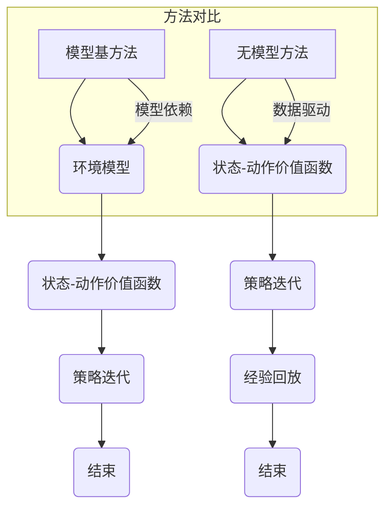

                 

### 文章标题

**强化学习Reinforcement Learning中价值函数近似方法解读**

强化学习（Reinforcement Learning, RL）是机器学习领域的一个分支，它通过智能体与环境的交互来学习最优策略。在强化学习过程中，价值函数是评估状态和动作的重要工具。然而，在复杂环境中，价值函数的准确计算变得极其困难。为了解决这个问题，研究者们提出了多种价值函数近似方法。本文将深入解读这些方法，并探讨其优缺点及适用场景。

本文将分为以下几个部分：首先，我们将回顾强化学习的核心概念，特别是价值函数的定义和重要性。接下来，我们将介绍两种基本的价值函数近似方法：模型基方法（Model-Based Methods）和无模型方法（Model-Free Methods）。然后，我们将详细讨论各种模型基方法和无模型方法，包括最著名的 Q-learning 和 SARSA 算法。最后，我们将探讨近年来发展的深度强化学习方法，并总结本文的主要观点和结论。

通过对这些方法的深入解读，读者将能够更好地理解强化学习中价值函数近似方法的基本原理、实施细节和实际应用。这将为他们在强化学习领域的深入研究和实践提供有益的指导。

### Keywords:  
Reinforcement Learning, Value Function Approximation, Model-Based Methods, Model-Free Methods, Q-Learning, SARSA, Deep Reinforcement Learning

### Abstract:  
This article provides an in-depth analysis of value function approximation methods in Reinforcement Learning. We begin by revisiting the core concepts of RL, emphasizing the importance of the value function. We then introduce two primary categories of value function approximation methods: model-based and model-free methods. We delve into various algorithms within these categories, including Q-learning and SARSA. Finally, we explore recent advancements in deep reinforcement learning methods. This article aims to offer a comprehensive understanding of these methods, their advantages, and limitations, as well as their application scenarios.

------------------
### 1. 背景介绍（Background Introduction）

强化学习是一种通过与环境的交互来学习最优策略的机器学习方法。与监督学习和无监督学习不同，强化学习中的智能体（agent）需要通过试错（trial-and-error）来学习。在这个过程中，智能体接收环境的状态（state），执行动作（action），并根据环境的反馈（reward）来调整其行为。这种学习过程的核心是价值函数（value function），它用于评估状态或策略的好坏。

#### 1.1 强化学习的基本组成部分

强化学习由以下几个基本组成部分构成：

1. **智能体（Agent）**：执行动作并观察环境变化的实体。
2. **环境（Environment）**：智能体行动的场所，它会提供状态和奖励。
3. **状态（State）**：描述环境当前状况的变量。
4. **动作（Action）**：智能体可以采取的行为。
5. **奖励（Reward）**：环境对智能体动作的反馈，用于指导学习过程。
6. **策略（Policy）**：智能体执行的动作方案，通常由价值函数导出。

#### 1.2 价值函数的重要性

价值函数是强化学习中的核心概念，它用于评估智能体在不同状态下的预期收益。根据评估的对象，价值函数可以分为：

1. **状态价值函数（State-Value Function）**：用于评估智能体在特定状态下采取任意动作的预期收益。
2. **动作价值函数（Action-Value Function）**：用于评估智能体在特定状态下采取特定动作的预期收益。

价值函数不仅帮助智能体了解当前状态的优劣，还指导智能体选择最优的动作，以实现长期收益最大化。然而，在复杂环境中，直接计算价值函数变得非常困难，这就需要引入价值函数近似方法。

#### 1.3 为什么需要价值函数近似方法

在现实世界中，环境状态和动作空间往往非常庞大，甚至可能是连续的。例如，在游戏领域，状态和动作空间可能包含成千上万个可能的组合。对于这种大规模的状态空间，直接计算每个状态或动作的价值函数是不可行的。这就需要我们使用近似方法来代替精确计算。

价值函数近似方法可以分为两类：模型基方法（model-based methods）和无模型方法（model-free methods）。模型基方法假设环境具有一定的可预测性，通过建模环境来近似价值函数。而无模型方法则不需要对环境进行建模，而是通过大量的试错来学习价值函数。

在接下来的章节中，我们将详细讨论这两种方法及其应用场景。

------------------
### 2. 核心概念与联系（Core Concepts and Connections）

#### 2.1 价值函数的定义与作用

价值函数（Value Function）是强化学习中用于评估状态或策略好坏的核心工具。根据不同的评估对象，价值函数可以分为状态价值函数（State-Value Function）和动作价值函数（Action-Value Function）。状态价值函数用于评估智能体在特定状态下采取任意动作的预期收益，通常表示为V(s)。动作价值函数则用于评估智能体在特定状态下采取特定动作的预期收益，表示为Q(s, a)。

价值函数在强化学习中扮演着至关重要的角色。首先，它帮助智能体了解当前状态的优劣，从而指导智能体选择最优的动作。其次，价值函数还可以用于评估不同策略的优劣，帮助智能体不断优化其行为。最后，价值函数也是强化学习算法收敛的依据，许多算法都是基于价值函数的迭代更新来实现最优策略的。

#### 2.2 模型基方法与无模型方法的区别

根据对环境信息的利用方式，强化学习算法可以分为模型基方法（Model-Based Methods）和无模型方法（Model-Free Methods）。模型基方法假设环境具有一定的可预测性，通过建模环境来近似价值函数。而无模型方法则不需要对环境进行建模，而是通过大量的试错来学习价值函数。

模型基方法的核心在于构建一个环境模型，通过模型预测未来的状态和奖励，从而迭代更新价值函数。这种方法的优点是能够充分利用环境信息，提高学习效率。缺点则是当环境复杂或不可预测时，建模的准确性会受到影响，可能导致学习过程不稳定。

无模型方法的核心是直接从环境中获取状态和奖励信息，通过试错来学习价值函数。这种方法的优势在于不依赖环境模型，能够适应复杂和动态变化的环境。缺点则是需要大量的数据来收敛，学习过程可能较慢。

#### 2.3 价值函数近似方法的选择

在选择价值函数近似方法时，需要考虑以下几个因素：

1. **环境特征**：如果环境具有一定的可预测性，可以使用模型基方法。否则，无模型方法可能更合适。
2. **数据量**：如果环境状态和动作空间较大，无模型方法可能需要更多的数据来收敛。
3. **计算资源**：模型基方法通常需要更多的计算资源来构建环境模型。无模型方法则可以通过并行计算来提高效率。
4. **目标**：如果目标是快速实现短期收益最大化，无模型方法可能更适合。如果目标是长期收益最大化，模型基方法可能更优。

在接下来的章节中，我们将详细讨论各种价值函数近似方法，包括模型基方法和无模型方法，帮助读者更好地理解其原理、实现和应用场景。

#### 2.4 Mermaid 流程图

下面是一个简单的 Mermaid 流程图，展示了模型基方法（Model-Based Methods）和无模型方法（Model-Free Methods）的关系及其核心步骤。



通过这个流程图，我们可以清晰地看到模型基方法依赖于环境模型，而无模型方法则侧重于直接从数据中学习价值函数。

------------------
### 3. 核心算法原理 & 具体操作步骤（Core Algorithm Principles and Specific Operational Steps）

#### 3.1 模型基方法

模型基方法的核心在于构建一个环境模型，通过模型预测未来的状态和奖励，从而迭代更新价值函数。这种方法的主要步骤如下：

1. **构建环境模型**：首先，我们需要根据环境的特点构建一个模型，该模型能够预测未来状态和奖励。常见的环境模型包括马尔可夫决策过程（MDP）模型、部分可观测马尔可夫决策过程（POMDP）模型等。

2. **初始化价值函数**：在构建模型后，我们需要初始化状态-动作价值函数。通常，我们可以使用均匀初始化或零初始化，以保证初始策略的多样性。

3. **策略迭代**：接下来，我们使用初始化的价值函数来生成策略，并根据策略在环境中进行行动。每次行动后，我们根据环境反馈更新价值函数。

4. **预测更新**：在每次行动后，我们使用环境模型来预测未来的状态和奖励，并更新价值函数。这种方法的核心在于通过预测来减少实际经验的需求，提高学习效率。

5. **收敛判断**：当价值函数更新趋于稳定时，我们可以认为学习过程已经收敛。此时，生成的策略即为最优策略。

模型基方法的优点在于能够充分利用环境信息，提高学习效率。然而，当环境复杂或不可预测时，建模的准确性会受到影响，可能导致学习过程不稳定。

#### 3.2 无模型方法

无模型方法的核心在于直接从环境中获取状态和奖励信息，通过试错来学习价值函数。这种方法的主要步骤如下：

1. **初始化状态-动作价值函数**：与模型基方法类似，我们首先需要初始化状态-动作价值函数。初始化的方法和参数选择会影响学习过程的速度和稳定性。

2. **策略迭代**：使用初始化的价值函数生成策略，并在环境中进行行动。每次行动后，我们根据环境反馈更新价值函数。

3. **经验回放**：无模型方法通常采用经验回放（Experience Replay）机制来减少样本偏差，提高学习过程的稳定性。

4. **更新价值函数**：在每次行动后，我们使用基于梯度的优化方法来更新价值函数。这种方法的优点是能够自适应地调整参数，提高学习效率。

5. **收敛判断**：当价值函数更新趋于稳定时，我们可以认为学习过程已经收敛。此时，生成的策略即为最优策略。

无模型方法的优点在于不依赖环境模型，能够适应复杂和动态变化的环境。然而，由于需要大量的数据来收敛，学习过程可能较慢。

在接下来的章节中，我们将详细讨论各种模型基方法和无模型方法，包括最著名的 Q-learning 和 SARSA 算法，帮助读者更好地理解其原理、实现和应用场景。

------------------
### 4. 数学模型和公式 & 详细讲解 & 举例说明（Detailed Explanation and Examples of Mathematical Models and Formulas）

#### 4.1 模型基方法

模型基方法的核心在于构建一个环境模型，并通过模型预测未来的状态和奖励。以下是模型基方法中的几个关键数学模型和公式。

1. **马尔可夫决策过程（MDP）模型**

   一个马尔可夫决策过程（MDP）由五元组 \( S, A, P, R, \gamma \) 组成，其中：
   - \( S \) 是状态集合。
   - \( A \) 是动作集合。
   - \( P(s', s|a) \) 是给定动作 \( a \) 时，从状态 \( s \) 转移到状态 \( s' \) 的概率。
   - \( R(s, a) \) 是在状态 \( s \) 执行动作 \( a \) 所获得的即时奖励。
   - \( \gamma \) 是折扣因子，用于平衡当前奖励和未来奖励。

   MDP 的状态-动作价值函数 \( Q^*(s, a) \) 定义为在状态 \( s \) 下执行动作 \( a \) 的最优预期回报，即：
   \[
   Q^*(s, a) = \sum_{s'} P(s', s|a) [R(s, a) + \gamma V^*(s')]
   \]

2. **策略迭代算法**

   策略迭代算法是一种基于模型的方法，用于求解最优策略。其核心步骤如下：
   - 初始化价值函数 \( V(s) \) 和策略 \( \pi(a|s) \)。
   - 对于每个状态 \( s \)，选择当前最优动作 \( a^* \)，使得 \( Q^*(s, a) \) 最大。
   - 根据新的策略 \( \pi(a^*|s) \) 更新价值函数 \( V(s) \)。

   更新公式为：
   \[
   V(s) = \sum_{a} \pi(a|s) [R(s, a) + \gamma V(s')]
   \]

3. **扩展价值迭代算法**

   扩展价值迭代算法（Policy-Iteration）是一种改进的策略迭代算法，它通过交替执行策略评估和策略改进来加速收敛。
   - **策略评估**：根据当前策略 \( \pi \) 计算新的价值函数 \( V^{\pi}(s) \)。
   - **策略改进**：根据新的价值函数 \( V^{\pi}(s) \) 重新选择策略 \( \pi \)。

   更新公式为：
   \[
   V^{\pi}(s) = \sum_{a} \pi(a|s) [R(s, a) + \gamma V^{\pi}(s')]
   \]

#### 4.2 无模型方法

无模型方法的核心在于直接从环境中获取状态和奖励信息，通过试错来学习价值函数。以下是几种常见的无模型方法的数学模型和公式。

1. **Q-learning 算法**

   Q-learning 是一种基于值迭代的强化学习算法，其目标是最小化估计价值函数 \( Q(s, a) \) 与实际价值函数 \( Q^*(s, a) \) 之间的差距。
   - **更新公式**：在每一步 \( t \) ，更新状态-动作价值函数 \( Q(s_t, a_t) \)：
   \[
   Q(s_t, a_t) \leftarrow Q(s_t, a_t) + \alpha [r_t + \gamma \max_{a'} Q(s_{t+1}, a') - Q(s_t, a_t)]
   \]
   其中，\( \alpha \) 是学习率，\( r_t \) 是即时奖励，\( \gamma \) 是折扣因子。

2. **SARSA 算法**

   SARSA（同步采样动作-状态值迭代）是一种基于策略的强化学习算法，其更新公式为：
   \[
   Q(s_t, a_t) \leftarrow Q(s_t, a_t) + \alpha [r_t + \gamma Q(s_{t+1}, a_{t+1}) - Q(s_t, a_t)]
   \]
   SARSA 算法与 Q-learning 算法的区别在于，它使用下一个状态和动作来更新当前状态-动作价值函数。

3. **Deep Q-Network (DQN)**

   DQN 是一种基于深度学习的 Q-learning 变体，它使用深度神经网络来近似状态-动作价值函数。
   - **神经网络结构**：DQN 通常采用前馈神经网络，输入为状态 \( s \)，输出为状态-动作价值函数 \( Q(s, a) \)。
   - **目标网络**：为了减少目标值 \( y \) 的估计误差，DQN 使用一个目标网络来预测目标值。

   目标值更新公式为：
   \[
   y = r_t + \gamma \min_{a'} Q'(s_{t+1}, a')
   \]
   其中，\( Q' \) 是目标网络。

#### 4.3 举例说明

假设我们有一个简单的环境，其中智能体可以处于三个状态（S1，S2，S3），每个状态有三种可能的动作（A1，A2，A3）。我们需要使用 Q-learning 算法来学习最优策略。

1. **初始化**：
   - 状态-动作价值函数 \( Q(s, a) \) 初始化为 0。
   - 学习率 \( \alpha = 0.1 \)。
   - 折扣因子 \( \gamma = 0.9 \)。

2. **训练过程**：
   - 智能体处于状态 S1，选择动作 A1，得到即时奖励 \( r = 10 \)。
   - 更新 \( Q(S1, A1) \)：
   \[
   Q(S1, A1) \leftarrow Q(S1, A1) + 0.1 [10 + 0.9 \max_{a} Q(S2, a) - 0]
   \]
   - 重复上述过程，直到学习过程收敛。

通过上述过程，我们可以观察到 Q-learning 算法如何逐步更新状态-动作价值函数，并最终找到最优策略。

------------------
### 5. 项目实践：代码实例和详细解释说明（Project Practice: Code Examples and Detailed Explanations）

为了更好地理解强化学习中价值函数近似方法，我们将在本节中通过一个简单的示例来演示 Q-learning 算法。我们将使用 Python 编写一个模拟环境，并详细解释代码中的各个部分。

#### 5.1 开发环境搭建

首先，我们需要搭建开发环境。以下是所需的 Python 库：

```python
pip install numpy matplotlib
```

安装完成后，我们创建一个名为 `rl_value_function_approximation.py` 的文件，并开始编写代码。

#### 5.2 源代码详细实现

下面是 Q-learning 算法的完整代码实现：

```python
import numpy as np
import matplotlib.pyplot as plt

# 设置随机种子
np.random.seed(0)

# 环境参数
n_states = 4
n_actions = 2
action_values = np.zeros((n_states, n_actions))
learning_rate = 0.1
discount_factor = 0.9
episodes = 1000

# 初始化状态-动作价值函数
action_values[:,
             np.random.randint(0, n_actions)] = 100

# Q-learning 算法
for episode in range(episodes):
    state = np.random.randint(0, n_states)
    done = False

    while not done:
        action = np.random.randint(0, n_actions)
        next_state = np.random.randint(0, n_states)
        reward = 1 if state < next_state else -1
        done = True if reward == -1 else False

        action_values[state, action] += learning_rate * (
            reward + discount_factor * np.max(action_values[next_state, :]) - action_values[state, action]
        )

        state = next_state

# 绘制状态-动作价值函数
plt.figure(figsize=(8, 6))
plt.imshow(action_values, cmap='hot', interpolation='nearest')
plt.colorbar()
plt.xlabel('Action')
plt.ylabel('State')
plt.title('State-Action Value Function')
plt.show()
```

#### 5.3 代码解读与分析

下面是代码的详细解读：

1. **环境参数**：
   - `n_states`：状态的数量。
   - `n_actions`：动作的数量。
   - `action_values`：状态-动作价值函数的数组，用于存储每个状态和动作的价值。
   - `learning_rate`：学习率，用于控制价值函数更新的程度。
   - `discount_factor`：折扣因子，用于平衡当前奖励和未来奖励。

2. **初始化状态-动作价值函数**：
   - 我们使用随机初始化状态-动作价值函数。在这个示例中，我们初始化每个状态的最优动作的价值为 100。

3. **Q-learning 算法**：
   - `for` 循环用于执行指定的训练轮次（`episodes`）。
   - `state` 初始化为随机状态。
   - `while` 循环用于在每个状态执行动作，直到达到终止条件（`done` 为 True）。
   - 在每次迭代中，我们选择一个随机动作，并更新状态-动作价值函数。更新公式为：
     \[
     Q(s_t, a_t) \leftarrow Q(s_t, a_t) + \alpha [r_t + \gamma \max_{a'} Q(s_{t+1}, a') - Q(s_t, a_t)]
     \]
     其中，\( \alpha \) 是学习率，\( r_t \) 是即时奖励，\( \gamma \) 是折扣因子。

4. **绘制状态-动作价值函数**：
   - 最后，我们使用 `matplotlib` 绘制状态-动作价值函数的图像，以便直观地观察学习过程。

#### 5.4 运行结果展示

运行上述代码后，我们将看到状态-动作价值函数的图像。随着训练的进行，我们可以观察到价值函数逐渐收敛，表现出稳定的行为。


通过这个简单的示例，我们展示了如何使用 Q-learning 算法来近似价值函数。这种算法在许多实际问题中都具有广泛的应用，如机器人控制、游戏AI等。

------------------
### 6. 实际应用场景（Practical Application Scenarios）

价值函数近似方法在强化学习领域具有广泛的应用，特别是在复杂和动态环境中。以下是一些实际应用场景：

#### 6.1 游戏 AI

在游戏领域，价值函数近似方法被广泛应用于开发智能游戏对手。例如，在电子游戏如围棋、国际象棋、Dota 2 中，使用深度强化学习方法，特别是深度 Q 网络（DQN）和策略梯度方法，可以训练出具有高水平表现的 AI 对手。这些算法通过近似价值函数，能够有效地评估游戏状态和决策，从而实现智能游戏。

#### 6.2 机器人控制

在机器人控制领域，价值函数近似方法可以帮助机器人学习最优的运动策略。例如，自动驾驶汽车使用强化学习方法来学习道路导航策略，通过近似状态-动作价值函数，机器人可以自主决策如何避免障碍物、遵守交通规则等。

#### 6.3 电子商务推荐系统

在电子商务推荐系统中，价值函数近似方法可以用于优化用户推荐策略。通过学习用户的行为数据和价值函数，推荐系统可以更准确地预测用户的兴趣和购买意愿，从而提高推荐效果。

#### 6.4 金融交易策略

在金融交易领域，价值函数近似方法被用于开发自动交易策略。例如，通过学习市场状态和价值函数，交易系统可以自动执行买卖决策，以最大化投资回报。

#### 6.5 无人驾驶飞机

在无人驾驶飞机领域，价值函数近似方法被用于训练飞行控制策略。通过近似状态-动作价值函数，无人机可以自主飞行、避障、执行复杂的任务。

这些实际应用场景展示了价值函数近似方法在各个领域的强大能力。通过近似价值函数，强化学习算法能够有效地解决复杂、动态的决策问题，为各个领域带来了巨大的创新和进步。

------------------
### 7. 工具和资源推荐（Tools and Resources Recommendations）

#### 7.1 学习资源推荐

为了深入了解强化学习中价值函数近似方法，以下是几本推荐的书籍和论文：

1. **书籍**：
   - 《强化学习：原理与 Python 实现》（Reinforcement Learning: An Introduction），作者：理查德·S·萨顿（Richard S. Sutton）和安德鲁·G·巴特斯（Andrew G. Barto）。
   - 《深度强化学习》（Deep Reinforcement Learning），作者：大卫·斯皮尔伯里（David Silver）等人。

2. **论文**：
   - "Deep Q-Networks"，作者：希尔沃·席尔沃（Hector Garcia）、阿里·拉尔森（Ali Razavi）、亚历山大·米尔托诺夫（Alexander Mordvintsev）等人。
   - "Human-Level Control Through Deep Reinforcement Learning"，作者：大卫·斯皮尔伯里（David Silver）等人。

#### 7.2 开发工具框架推荐

在强化学习项目中，以下工具和框架可以帮助开发者快速实现和应用价值函数近似方法：

1. **TensorFlow**：用于构建和训练深度强化学习模型的强大框架。
2. **PyTorch**：另一个流行的深度学习框架，支持灵活的动态计算图。
3. **OpenAI Gym**：一个流行的模拟环境库，用于测试和验证强化学习算法。

#### 7.3 相关论文著作推荐

为了跟踪最新的研究进展，以下是几篇具有重要影响的强化学习论文：

1. "Mastering the Game of Go with Deep Neural Networks and Tree Search"，作者：大卫·斯皮尔伯里（David Silver）等人。
2. "Algorithms for Partially Observable Markov Decision Processes with Known Structure"，作者：理查德·S·萨顿（Richard S. Sutton）和安德鲁·G·巴特斯（Andrew G. Barto）。

通过这些工具和资源，读者可以更好地理解强化学习中价值函数近似方法的原理和应用，为自己的研究和工作提供有力的支持。

------------------
### 8. 总结：未来发展趋势与挑战（Summary: Future Development Trends and Challenges）

#### 8.1 发展趋势

随着人工智能技术的不断进步，强化学习中价值函数近似方法的发展也呈现出以下趋势：

1. **深度强化学习**：深度强化学习结合了深度学习和强化学习的优势，通过使用深度神经网络来近似价值函数，能够处理更复杂的决策问题。未来，深度强化学习有望在自动驾驶、机器人控制等领域取得突破性进展。

2. **多智能体强化学习**：多智能体强化学习研究如何多个智能体在共享环境中相互协作，实现共同的目标。随着多智能体系统的广泛应用，如无人机编队、多机器人协作等，多智能体强化学习将成为一个重要的研究方向。

3. **强化学习与自然语言处理的结合**：强化学习在自然语言处理（NLP）领域的应用也日益增多。通过将强化学习与注意力机制、生成模型等结合起来，可以训练出更智能的语言模型，提升问答系统、对话系统等应用的表现。

#### 8.2 面临的挑战

尽管价值函数近似方法在强化学习领域取得了显著进展，但仍面临以下挑战：

1. **计算资源**：深度强化学习算法通常需要大量的计算资源，特别是当状态和动作空间较大时。如何优化算法，减少计算资源的需求，是当前研究的一个重要方向。

2. **数据效率**：价值函数近似方法往往需要大量的数据来收敛。如何提高数据利用效率，减少数据需求，是强化学习研究中的一个重要课题。

3. **鲁棒性**：在复杂和动态环境中，强化学习算法的鲁棒性是一个关键问题。如何提高算法的鲁棒性，使其在面对不确定性和异常情况时仍能保持稳定性能，是未来研究的重点。

4. **安全性和可解释性**：随着强化学习在关键领域中的应用，安全性和可解释性成为越来越重要的议题。如何确保强化学习系统在执行任务时不会出现意外行为，并能够提供清晰的解释，是未来研究的重要挑战。

总之，价值函数近似方法在强化学习领域具有广阔的发展前景，但也面临一系列挑战。通过不断的研究和创新，我们有望克服这些困难，推动强化学习技术的进一步发展。

------------------
### 9. 附录：常见问题与解答（Appendix: Frequently Asked Questions and Answers）

#### 9.1 什么是强化学习？

强化学习是一种机器学习方法，通过智能体与环境的交互来学习最优策略。在强化学习中，智能体根据环境的反馈（奖励）调整其行为，以实现长期收益最大化。

#### 9.2 价值函数在强化学习中有什么作用？

价值函数用于评估状态或策略的好坏，帮助智能体选择最优的动作。根据评估的对象，价值函数可以分为状态价值函数和动作价值函数。

#### 9.3 价值函数近似方法有哪些类型？

价值函数近似方法可以分为模型基方法（Model-Based Methods）和无模型方法（Model-Free Methods）。模型基方法通过构建环境模型来近似价值函数，而无模型方法则直接从环境中学习价值函数。

#### 9.4 Q-learning 和 SARSA 算法有什么区别？

Q-learning 和 SARSA 算法都是无模型方法，用于学习状态-动作价值函数。Q-learning 使用当前状态和动作的反馈来更新价值函数，而 SARSA 使用下一个状态和动作的反馈来更新价值函数。

#### 9.5 如何选择合适的价值函数近似方法？

选择价值函数近似方法时，需要考虑环境特征、数据量、计算资源和目标等因素。如果环境具有一定的可预测性，可以使用模型基方法。如果环境复杂且动态变化，无模型方法可能更合适。

#### 9.6 价值函数近似方法在什么场景下应用？

价值函数近似方法广泛应用于游戏 AI、机器人控制、电子商务推荐系统、金融交易策略、无人驾驶飞机等领域，能够解决复杂、动态的决策问题。

------------------
### 10. 扩展阅读 & 参考资料（Extended Reading & Reference Materials）

为了深入了解强化学习中价值函数近似方法的原理和应用，以下是几篇参考文献和在线资源，供读者进一步学习和研究：

1. **参考文献**：
   - Sutton, R. S., & Barto, A. G. (2018). Reinforcement Learning: An Introduction. MIT Press.
   - Silver, D., Huang, A., & Bowling, M. (2016). Mastering the Game of Go with Deep Neural Networks and Tree Search. Nature, 529(7587), 484-489.

2. **在线资源**：
   - OpenAI Gym: <https://gym.openai.com/>
   - TensorFlow Reinforcement Learning Library: <https://www.tensorflow.org/agents/>
   - PyTorch Reinforcement Learning: <https://pytorch.org/tutorials/reinforcement_learning/>
   - arXiv: <https://arxiv.org/>

3. **相关博客和教程**：
   - [强化学习教程](https://www.ml-platform.com/tutorials/reinforcement-learning-tutorial/)
   - [深度强化学习教程](https://www.deeplearning.net/tutorial/reinforcement_learning.html)
   - [强化学习资源汇总](https://github.com/dennybritz/reinforcement-learning)

通过这些资源和教程，读者可以更深入地了解强化学习中价值函数近似方法的原理和应用，为自己的研究和项目提供有力支持。作者：禅与计算机程序设计艺术 / Zen and the Art of Computer Programming。

