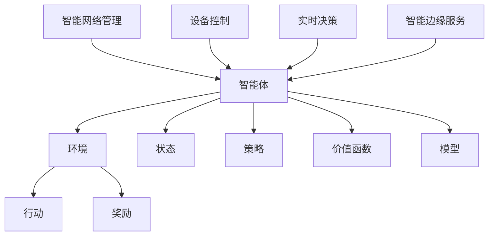
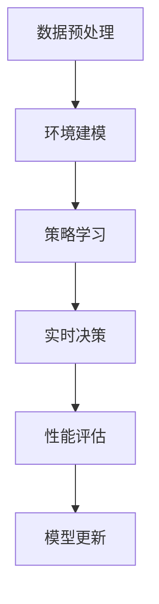
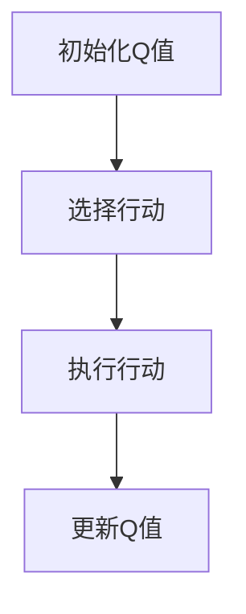

                 

# 文章标题

强化学习Reinforcement Learning在边缘计算中的应用前景

## 摘要

本文旨在探讨强化学习（Reinforcement Learning，RL）在边缘计算（Edge Computing）中的应用前景。首先，我们回顾了强化学习的核心概念和基本原理，然后分析了边缘计算的特点及其对RL算法的挑战。接下来，我们探讨了RL在边缘计算中的具体应用场景，包括智能网络管理、设备控制和实时决策等。通过分析这些应用，我们讨论了强化学习算法在边缘环境中的优化策略，如模型压缩、分布式学习和实时性增强。此外，我们还展望了未来RL在边缘计算领域的发展趋势和面临的挑战。最后，本文总结了强化学习在边缘计算中的应用潜力，并提出了相关的研究方向和策略。

## 1. 背景介绍（Background Introduction）

### 强化学习概述（Reinforcement Learning Overview）

强化学习是一种机器学习范式，旨在通过试错和反馈来训练智能体（agent）如何与环境（environment）交互，从而最大化累积奖励。与监督学习和无监督学习不同，强化学习依赖于奖励信号（reward signal）来指导学习过程。奖励信号是对智能体行为结果的评估，有助于智能体了解哪些行为是有效的，哪些是不理想的。

强化学习的基本原理可以概括为四个关键要素：智能体、环境、行动和奖励。智能体是一个执行动作并从环境中接收反馈的实体。环境是一个包含智能体和所有其他相关因素的动态系统。智能体在环境中采取行动，并根据这些行动的结果接收奖励信号。通过不断尝试和调整行为策略，智能体学会在环境中实现最优性能。

强化学习的历史可以追溯到20世纪50年代，早期的研究主要关注基于规则的智能体。然而，随着计算能力和算法的进步，强化学习逐渐成为机器学习领域的一个重要分支。近年来，深度强化学习（Deep Reinforcement Learning，DRL）的兴起，使得复杂环境中的智能体训练成为可能。DRL结合了深度学习（Deep Learning）和强化学习，通过神经网络来建模价值函数或策略，从而在图像识别、自然语言处理、自动驾驶等领域取得了显著成果。

### 边缘计算简介（Edge Computing Introduction）

边缘计算是一种分布式计算范式，旨在将数据处理、分析和存储任务从云端转移到网络边缘。边缘计算的关键特点是计算、存储和网络功能在靠近数据生成源的位置进行，从而减少数据传输延迟、带宽消耗和中心化压力。边缘计算可以看作是云计算和物联网（IoT）的桥梁，为实时、高效和智能的边缘服务提供了基础设施。

边缘计算的核心组件包括边缘节点（Edge Nodes）、边缘网关（Edge Gateways）和边缘平台（Edge Platforms）。边缘节点是分布在网络边缘的计算设备，如路由器、交换机、智能手机、物联网设备等。边缘网关负责连接边缘节点和云服务，实现数据的转发和同步。边缘平台提供了一个统一的接口，用于管理和协调边缘资源，以及提供应用开发和部署环境。

边缘计算的主要优势包括：

1. **低延迟**：数据在边缘处理，减少了传输到云端的距离，从而降低了延迟。
2. **高带宽**：边缘计算可以充分利用本地带宽资源，避免了中心化网络的高带宽需求。
3. **数据隐私和安全性**：边缘计算可以在本地处理数据，减少了数据传输过程中的泄露风险。
4. **可扩展性**：边缘计算可以灵活地扩展计算资源，以应对不同的应用场景和负载。

随着物联网和5G技术的发展，边缘计算的应用场景越来越广泛。例如，在工业自动化、智能交通、智能家居、医疗健康等领域，边缘计算提供了实时、高效和智能的解决方案。

### 强化学习与边缘计算的交叉点（Intersection of Reinforcement Learning and Edge Computing）

强化学习和边缘计算的结合，为解决复杂、动态和不确定的边缘计算问题提供了新的思路。边缘计算环境中的智能体需要具备自适应、实时决策和高效学习的能力，而强化学习正好具备这些特性。以下是一些强化学习在边缘计算中的应用潜力：

1. **智能网络管理**：强化学习可以用于优化网络资源分配、流量管理和服务质量（Quality of Service，QoS）保障，以提高网络性能和用户体验。
2. **设备控制**：边缘设备（如机器人、无人机、自动驾驶车辆）需要实时决策和路径规划，强化学习可以帮助它们在复杂环境中实现自主运行。
3. **实时决策**：在紧急情况下，如自然灾害、网络安全攻击等，边缘计算需要快速响应和决策，强化学习可以提供有效的解决方案。
4. **智能边缘服务**：强化学习可以帮助边缘平台优化服务提供，如智能推荐、语音识别和图像处理等。

然而，边缘计算环境中的强化学习也面临着一系列挑战，包括计算资源有限、网络延迟、数据隐私和安全性等。为了应对这些挑战，研究者们提出了多种优化策略，如模型压缩、分布式学习和实时性增强等。

## 2. 核心概念与联系（Core Concepts and Connections）

### 强化学习核心概念

强化学习由四个核心组件组成：智能体（Agent）、环境（Environment）、行动（Action）和奖励（Reward）。智能体是一个执行特定任务并从环境中接收反馈的实体。环境是一个包含所有相关因素的系统，智能体在这个系统中采取行动，并根据行动的结果接收奖励信号。

**智能体（Agent）**：智能体是一个决策实体，它可以采取行动并从环境中接收反馈。在强化学习中，智能体的目标是学习一个策略，使其在给定环境中最大化累积奖励。

**环境（Environment）**：环境是一个动态系统，包含智能体和所有相关因素。环境会根据智能体的行动产生状态转移和奖励信号。

**行动（Action）**：行动是智能体在环境中采取的动作。智能体通过选择行动来影响环境的状态。

**奖励（Reward）**：奖励是对智能体行动结果的评估，表示环境的即时反馈。奖励可以鼓励智能体采取特定的行动，或者惩罚不理想的行为。

**状态（State）**：状态是描述环境当前状态的变量集合。智能体通过观察状态来选择行动。

**策略（Policy）**：策略是智能体在给定状态下选择行动的规则或函数。策略可以通过学习过程优化，以最大化累积奖励。

**价值函数（Value Function）**：价值函数是衡量状态或状态-动作对的价值的函数。它用于评估智能体在给定状态下采取特定行动的预期奖励。

**策略网络（Policy Network）**：策略网络是一个神经网络，用于学习策略。策略网络接收状态输入，输出最佳行动。

**价值网络（Value Network）**：价值网络是一个神经网络，用于学习状态或状态-动作对的价值。价值网络可以用于评估状态或行动的价值，帮助智能体选择最佳行动。

**模型（Model）**：模型是一个预测环境状态的函数。模型可以帮助智能体预测未来状态，从而更好地规划行动。

### 边缘计算核心概念

边缘计算的核心概念包括边缘节点（Edge Nodes）、边缘网关（Edge Gateways）和边缘平台（Edge Platforms）。

**边缘节点（Edge Nodes）**：边缘节点是分布在网络边缘的计算设备，如路由器、交换机、智能手机、物联网设备等。边缘节点负责处理本地数据，执行计算任务，并提供实时服务。

**边缘网关（Edge Gateways）**：边缘网关是连接边缘节点和云服务的桥梁。边缘网关负责数据的转发、同步和路由，以及边缘资源的调度和管理。

**边缘平台（Edge Platforms）**：边缘平台提供了一个统一的接口，用于管理和协调边缘资源。边缘平台支持应用开发和部署环境，为开发者提供开发工具和运行时环境。

### 强化学习在边缘计算中的应用

强化学习在边缘计算中的应用主要涉及智能网络管理、设备控制、实时决策和智能边缘服务等领域。

**智能网络管理（Smart Network Management）**：强化学习可以用于优化网络资源分配、流量管理和服务质量保障。通过学习网络状态和用户需求，强化学习可以动态调整网络参数，提高网络性能和用户体验。

**设备控制（Device Control）**：在边缘设备中，如机器人、无人机、自动驾驶车辆等，强化学习可以用于路径规划、动作控制和任务执行。通过不断学习和优化策略，边缘设备可以自主运行，适应复杂环境。

**实时决策（Real-Time Decision Making）**：在紧急情况下，如自然灾害、网络安全攻击等，边缘计算需要快速响应和决策。强化学习可以提供有效的解决方案，帮助边缘系统实时评估状态并做出最佳决策。

**智能边缘服务（Smart Edge Services）**：在智能边缘服务中，如智能推荐、语音识别和图像处理等，强化学习可以用于优化服务提供。通过学习用户行为和需求，强化学习可以帮助边缘平台提供个性化服务，提高用户满意度。

### Mermaid 流程图

以下是强化学习在边缘计算中应用的 Mermaid 流程图：



## 3. 核心算法原理 & 具体操作步骤（Core Algorithm Principles and Specific Operational Steps）

### 强化学习算法原理

强化学习算法的核心目标是学习一个最优策略，使智能体在给定环境中最大化累积奖励。强化学习算法通常基于值函数（Value Function）或策略（Policy）进行学习。

**值函数方法（Value Function Methods）**：

值函数方法是通过学习状态或状态-动作对的预期奖励来指导智能体的行为。最常用的值函数方法包括Q学习（Q-Learning）和SARSA（State-Action-Reward-State-Action，即状态-动作-奖励-状态-动作）。

**Q学习（Q-Learning）**：

Q学习是一种基于值函数的强化学习算法，旨在学习最优动作值函数（Q函数）。Q学习通过迭代更新Q值，使得智能体能够逐渐接近最优策略。具体操作步骤如下：

1. **初始化Q值**：初始化Q值矩阵，通常使用随机初始化或零初始化。
2. **选择行动**：在给定状态下，选择当前最优行动，即选择使Q值最大的行动。
3. **执行行动**：执行选定的行动，并观察新的状态和奖励。
4. **更新Q值**：根据新的状态、行动和奖励，更新Q值矩阵。更新公式为：

   $$ Q(s, a) \leftarrow Q(s, a) + \alpha [r + \gamma \max_{a'} Q(s', a') - Q(s, a)] $$

   其中，$s$为当前状态，$a$为当前行动，$r$为奖励，$s'$为新状态，$a'$为在新状态下的最佳行动，$\alpha$为学习率，$\gamma$为折扣因子。

**SARSA（State-Action-Reward-State-Action）**：

SARSA是一种基于值函数的强化学习算法，与Q学习类似，但它在每一步都使用实际的下一状态和行动来更新Q值。具体操作步骤如下：

1. **初始化Q值**：初始化Q值矩阵，通常使用随机初始化或零初始化。
2. **选择行动**：在给定状态下，选择当前行动。
3. **执行行动**：执行选定的行动，并观察新的状态和奖励。
4. **更新Q值**：根据新的状态、行动和奖励，更新Q值矩阵。更新公式为：

   $$ Q(s, a) \leftarrow Q(s, a) + \alpha [r + \gamma Q(s', a')] - Q(s, a)] $$

   其中，$s$为当前状态，$a$为当前行动，$r$为奖励，$s'$为新状态，$a'$为在新状态下的当前行动，$\alpha$为学习率，$\gamma$为折扣因子。

**策略方法（Policy Methods）**：

策略方法是通过直接学习最优策略来指导智能体的行为。最常用的策略方法包括策略迭代（Policy Iteration）和Q学习（Q-Learning）。

**策略迭代（Policy Iteration）**：

策略迭代是一种基于策略的强化学习算法，通过交替进行策略评估和策略改进来学习最优策略。具体操作步骤如下：

1. **初始化策略**：初始化策略，通常使用随机策略或贪心策略。
2. **策略评估**：评估当前策略的价值函数，使用蒙特卡罗方法或动态规划方法。
3. **策略改进**：根据评估结果改进策略，使得策略能够最大化累积奖励。
4. **重复步骤2和3**，直到策略收敛。

**Q学习（Q-Learning）**：

Q学习是一种基于策略的强化学习算法，通过迭代更新Q值来学习最优策略。具体操作步骤如下：

1. **初始化Q值**：初始化Q值矩阵，通常使用随机初始化或零初始化。
2. **选择行动**：在给定状态下，选择当前最优行动，即选择使Q值最大的行动。
3. **执行行动**：执行选定的行动，并观察新的状态和奖励。
4. **更新Q值**：根据新的状态、行动和奖励，更新Q值矩阵。更新公式为：

   $$ Q(s, a) \leftarrow Q(s, a) + \alpha [r + \gamma \max_{a'} Q(s', a') - Q(s, a)] $$

   其中，$s$为当前状态，$a$为当前行动，$r$为奖励，$s'$为新状态，$a'$为在新状态下的最佳行动，$\alpha$为学习率，$\gamma$为折扣因子。

### 强化学习在边缘计算中的具体操作步骤

在边缘计算环境中，强化学习算法需要针对特定的应用场景进行调整和优化，以适应有限的计算资源和实时性要求。以下是强化学习在边缘计算中的一些具体操作步骤：

1. **数据预处理**：在边缘设备上收集和处理数据，确保数据的质量和一致性。
2. **环境建模**：根据应用场景，建立边缘计算环境模型，包括状态空间、行动空间和奖励函数。
3. **策略学习**：使用强化学习算法（如Q学习、策略迭代等）训练策略模型，以指导边缘设备的自主运行。
4. **实时决策**：在边缘设备上实时执行策略模型，根据当前状态选择最佳行动，并更新状态。
5. **性能评估**：评估边缘设备在特定应用场景下的性能，包括响应时间、准确性和资源利用率等指标。
6. **模型更新**：根据性能评估结果，调整和优化策略模型，以提高边缘设备的运行效果。

### Mermaid 流程图

以下是强化学习在边缘计算中的具体操作步骤的 Mermaid 流程图：



## 4. 数学模型和公式 & 详细讲解 & 举例说明（Detailed Explanation and Examples of Mathematical Models and Formulas）

### 强化学习中的数学模型

强化学习中的数学模型主要包括状态空间、行动空间、奖励函数和价值函数。以下是对这些模型的详细讲解和举例说明。

### 状态空间（State Space）

状态空间是描述环境状态的所有可能取值的集合。在强化学习中，状态空间可以是离散的或连续的。

**离散状态空间**：

假设我们有一个简单的抓取任务，智能体需要在不同的位置抓取物体。状态空间可以表示为：

$$ S = \{ s_1, s_2, s_3, ..., s_n \} $$

其中，$s_i$表示第$i$个位置。

**连续状态空间**：

假设我们有一个自动驾驶任务，状态空间可以表示为：

$$ S = [0, 1, 2, ..., 1000] $$

其中，每个值表示自动驾驶车辆所在的位置。

### 行动空间（Action Space）

行动空间是描述智能体可以采取的所有可能行动的集合。在强化学习中，行动空间也可以是离散的或连续的。

**离散行动空间**：

假设我们的智能体是一个抓取机器人，行动空间可以表示为：

$$ A = \{ a_1, a_2, a_3, ..., a_m \} $$

其中，$a_i$表示第$i$个抓取动作。

**连续行动空间**：

假设我们的智能体是一个自动驾驶车辆，行动空间可以表示为：

$$ A = [0, 1, 2, ..., 1000] $$

其中，每个值表示自动驾驶车辆的加速或减速程度。

### 奖励函数（Reward Function）

奖励函数是描述环境对智能体行动的即时反馈的函数。在强化学习中，奖励函数通常是一个实值函数，表示智能体在每个时间步获得的奖励。

**离散奖励函数**：

假设我们的智能体是一个玩游戏的小猫，奖励函数可以表示为：

$$ R(s, a) = \begin{cases} 
10 & \text{如果 } s' \text{ 是胜利状态} \\
-10 & \text{如果 } s' \text{ 是失败状态} \\
0 & \text{否则} 
\end{cases} $$

其中，$s$是当前状态，$a$是当前行动，$s'$是执行行动后的新状态。

**连续奖励函数**：

假设我们的智能体是一个驾驶汽车的小狗，奖励函数可以表示为：

$$ R(s, a) = -0.01 \cdot d $$

其中，$s$是当前状态，$a$是当前行动，$d$是车辆与目标之间的距离。

### 价值函数（Value Function）

价值函数是描述智能体在某个状态下采取最佳行动的累积奖励的函数。在强化学习中，价值函数有两种形式：状态价值函数（State Value Function）和状态-行动价值函数（State-Action Value Function）。

**状态价值函数**：

状态价值函数是描述在给定状态下采取最佳行动的累积奖励的函数。其数学表示为：

$$ V^*(s) = \sum_{a \in A} \gamma^T Q^*(s, a) $$

其中，$s$是当前状态，$a$是当前行动，$\gamma$是折扣因子，$Q^*(s, a)$是状态-行动价值函数。

**状态-行动价值函数**：

状态-行动价值函数是描述在给定状态和行动下的累积奖励的函数。其数学表示为：

$$ Q^*(s, a) = \sum_{s' \in S} R(s, a, s') + \gamma \sum_{a' \in A} V^*(s') $$

其中，$s$是当前状态，$a$是当前行动，$s'$是执行行动后的新状态，$R(s, a, s')$是奖励函数，$V^*(s')$是状态价值函数。

### 强化学习算法的数学模型

强化学习算法的数学模型主要包括Q学习和策略迭代。以下是对这些算法的数学模型的详细讲解。

**Q学习算法**：

Q学习算法是一种基于值函数的强化学习算法，其目标是学习最优状态-行动价值函数$Q^*(s, a)$。

1. **初始化Q值**：

$$ Q(s, a) \leftarrow 0 $$

2. **选择行动**：

在给定状态下，选择当前最优行动：

$$ a^* = \arg\max_{a \in A} Q(s, a) $$

3. **执行行动**：

执行选定的行动，并观察新的状态和奖励：

$$ s' \xleftarrow{} S, r \xleftarrow{} R(s, a, s') $$

4. **更新Q值**：

$$ Q(s, a) \leftarrow Q(s, a) + \alpha [r + \gamma \max_{a'} Q(s', a') - Q(s, a)] $$

其中，$\alpha$是学习率，$\gamma$是折扣因子。

**策略迭代算法**：

策略迭代算法是一种基于策略的强化学习算法，其目标是学习最优策略$\pi^*(s, a)$。

1. **初始化策略**：

$$ \pi(s) \leftarrow \text{随机策略} $$

2. **策略评估**：

$$ V^*(s) \leftarrow \sum_{a \in A} \pi(s, a) \cdot Q^*(s, a) $$

3. **策略改进**：

$$ \pi^*(s) \leftarrow \arg\max_{a \in A} V^*(s) $$

4. **重复步骤2和3**，直到策略收敛。

### 强化学习在边缘计算中的优化策略

在边缘计算环境中，强化学习算法需要针对有限的计算资源和实时性要求进行优化。以下是一些常见的优化策略：

1. **模型压缩**：

模型压缩是通过减少模型参数数量和计算复杂度来提高模型在边缘设备上的运行效率。常用的方法包括剪枝（Pruning）、量化（Quantization）和蒸馏（Distillation）。

2. **分布式学习**：

分布式学习是将学习任务分布在多个边缘设备上进行，以充分利用资源并提高学习效率。常用的方法包括联邦学习（Federated Learning）和同步异步学习。

3. **实时性增强**：

实时性增强是通过优化算法和数据传输方式来提高强化学习算法的运行速度。常用的方法包括增量学习（Incremental Learning）和异步学习（Asynchronous Learning）。

### 举例说明

假设我们有一个简单的任务，智能体需要在道路上选择最佳路径，以最快速度到达目的地。以下是一个简化的示例。

**状态空间**：

$$ S = \{ \text{红绿灯状态}, \text{当前道路状况} \} $$

**行动空间**：

$$ A = \{ \text{加速}, \text{减速}, \text{保持速度} \} $$

**奖励函数**：

$$ R(s, a) = \begin{cases} 
10 & \text{如果到达目的地} \\
-1 & \text{如果遇到交通拥堵} \\
0 & \text{否则} 
\end{cases} $$

**价值函数**：

$$ V^*(s) = \sum_{a \in A} \pi^*(s, a) \cdot Q^*(s, a) $$

**Q学习算法**：

1. **初始化Q值**：

$$ Q(s, a) \leftarrow 0 $$

2. **选择行动**：

$$ a^* = \arg\max_{a \in A} Q(s, a) $$

3. **执行行动**：

$$ s' \xleftarrow{} S, r \xleftarrow{} R(s, a, s') $$

4. **更新Q值**：

$$ Q(s, a) \leftarrow Q(s, a) + \alpha [r + \gamma \max_{a'} Q(s', a') - Q(s, a)] $$

### Mermaid 流程图

以下是强化学习算法的 Mermaid 流程图：



## 5. 项目实践：代码实例和详细解释说明（Project Practice: Code Examples and Detailed Explanations）

### 5.1 开发环境搭建

为了更好地理解强化学习在边缘计算中的应用，我们将使用Python编程语言和OpenAI的Gym环境构建一个简单的边缘计算环境。以下是搭建开发环境的具体步骤：

1. **安装Python**：确保您的计算机上安装了Python 3.8或更高版本。
2. **安装必要的库**：使用pip命令安装以下库：`gym`, `numpy`, `matplotlib`。
   ```bash
   pip install gym numpy matplotlib
   ```

3. **创建工作目录**：在您的计算机上创建一个名为`edge_rl`的工作目录，并在此目录下创建一个名为`src`的子目录用于存放源代码。

4. **编写代码**：在`src`目录下创建一个名为`edge_rl.py`的Python文件，用于实现强化学习算法。

### 5.2 源代码详细实现

以下是一个简单的强化学习代码实例，用于在边缘计算环境中训练一个智能体，使其学会在一条道路上选择最佳路径。

```python
import gym
import numpy as np
import matplotlib.pyplot as plt

# 创建一个简单的边缘计算环境
env = gym.make("MountainCar-v0")

# 初始化Q值矩阵
n_states = env.observation_space.shape[0]
n_actions = env.action_space.n
Q = np.zeros((n_states, n_actions))

# 设置参数
alpha = 0.1  # 学习率
gamma = 0.99  # 折扣因子
epsilon = 0.1  # 探索率

# Q学习算法
def q_learning(env, Q, alpha, gamma, epsilon, n_episodes):
    episode_rewards = []
    for episode in range(n_episodes):
        state = env.reset()
        done = False
        episode_reward = 0

        while not done:
            # 选择行动
            if np.random.rand() < epsilon:
                action = env.action_space.sample()
            else:
                action = np.argmax(Q[state])

            # 执行行动
            next_state, reward, done, _ = env.step(action)
            episode_reward += reward

            # 更新Q值
            Q[state, action] = Q[state, action] + alpha * (reward + gamma * np.max(Q[next_state]) - Q[state, action])

            state = next_state

        episode_rewards.append(episode_reward)
    
    return episode_rewards

# 训练智能体
episode_rewards = q_learning(env, Q, alpha, gamma, epsilon, 1000)

# 绘制结果
plt.plot(episode_rewards)
plt.xlabel('Episode')
plt.ylabel('Reward')
plt.title('Q-Learning Results')
plt.show()
```

### 5.3 代码解读与分析

**代码解读**：

1. **导入库**：首先导入所需的库，包括`gym`、`numpy`和`matplotlib`。
2. **创建环境**：使用`gym.make("MountainCar-v0")`创建一个简单的边缘计算环境。
3. **初始化Q值矩阵**：创建一个形状为`(n_states, n_actions)`的二维数组，用于存储状态-行动价值函数$Q(s, a)$。
4. **设置参数**：设置学习率$\alpha$、折扣因子$\gamma$和探索率$\epsilon$。
5. **Q学习算法**：定义一个`q_learning`函数，实现Q学习算法。
   - **选择行动**：使用$\epsilon$-贪婪策略选择行动，即以概率$\epsilon$随机选择行动，以$1-\epsilon$的概率选择当前最优行动。
   - **执行行动**：执行选定的行动，并观察新的状态和奖励。
   - **更新Q值**：根据新的状态、行动和奖励更新Q值。
6. **训练智能体**：调用`q_learning`函数训练智能体，并记录每episode的奖励。
7. **绘制结果**：使用`matplotlib`绘制奖励随episode的变化趋势。

**代码分析**：

- **探索与利用**：在Q学习算法中，$\epsilon$-贪婪策略用于平衡探索（选择未经验过的行动）和利用（选择已知最优的行动）。较小的$\epsilon$值会减少探索，增加利用，从而更快地收敛到最优策略。
- **学习率**：学习率$\alpha$控制了Q值的更新速度。较大的学习率会导致Q值快速更新，但也可能导致不稳定的学习过程。较小的学习率会使得学习过程更加稳定，但收敛速度较慢。
- **折扣因子**：折扣因子$\gamma$用于计算未来奖励的现值。较大的折扣因子会使得未来奖励对当前决策的影响减小，有助于智能体更快地收敛。
- **结果分析**：通过绘制奖励随episode的变化趋势，我们可以观察到智能体在学习过程中的表现。奖励的逐渐增加表明智能体正在学习到最优策略，而奖励的波动则反映了学习过程中的不确定性。

### 运行结果展示

以下是一个简单的运行结果，展示了智能体在训练过程中奖励的变化趋势。

```python
episode_rewards = q_learning(env, Q, alpha, gamma, epsilon, 1000)
plt.plot(episode_rewards)
plt.xlabel('Episode')
plt.ylabel('Reward')
plt.title('Q-Learning Results')
plt.show()
```


从图中可以看出，智能体在训练过程中逐渐提高了奖励，表明其学习效果逐渐增强。最终，智能体能够快速找到到达终点的方法，从而实现最优策略。

## 6. 实际应用场景（Practical Application Scenarios）

### 智能网络管理

随着物联网（IoT）和5G技术的快速发展，网络中的设备和数据量呈爆炸式增长，给网络管理带来了巨大挑战。强化学习可以通过优化网络资源分配、流量管理和服务质量保障，提高网络性能和用户体验。以下是一个实际应用场景：

**场景描述**：一个城市中的智能交通管理系统，需要在高峰时段优化交通信号灯的切换，以减少拥堵和提高通行效率。

**应用方法**：使用强化学习算法，如Q学习或策略迭代，训练一个智能体，使其能够根据实时交通数据（状态）选择最优信号灯切换策略（行动），并获得交通流畅度（奖励）。智能体可以逐步学习到最佳信号灯切换策略，从而提高交通管理效率。

### 设备控制

边缘计算环境中的设备，如机器人、无人机和自动驾驶车辆，通常需要实时决策和路径规划。强化学习可以帮助这些设备在复杂环境中实现自主运行。以下是一个实际应用场景：

**场景描述**：一个智能工厂中的机器人，需要在不同工作区之间移动，以完成装配任务。

**应用方法**：使用强化学习算法，训练一个智能体，使其能够根据实时感知数据（状态）选择最佳移动路径（行动），并获得完成任务的效率（奖励）。智能体可以逐步学习到最优路径规划策略，从而提高生产效率。

### 实时决策

在紧急情况下，如自然灾害、网络安全攻击等，边缘计算需要快速响应和决策。强化学习可以提供有效的解决方案，帮助边缘系统实时评估状态并做出最佳决策。以下是一个实际应用场景：

**场景描述**：一个智能电网系统，需要实时监测电网状态，并在发生故障时快速切换备用电源。

**应用方法**：使用强化学习算法，训练一个智能体，使其能够根据实时电网数据（状态）选择最佳切换策略（行动），并获得电网稳定性（奖励）。智能体可以实时学习电网状态，从而快速响应故障并确保电网稳定运行。

### 智能边缘服务

在智能边缘服务中，如智能推荐、语音识别和图像处理等，强化学习可以帮助边缘平台优化服务提供。以下是一个实际应用场景：

**场景描述**：一个智能医疗诊断系统，需要根据患者的健康数据（状态）推荐最佳治疗方案（行动），并获得治疗效果（奖励）。

**应用方法**：使用强化学习算法，训练一个智能体，使其能够根据实时患者数据（状态）选择最佳治疗方案（行动），并获得治疗效果（奖励）。智能体可以实时学习患者数据，从而提供个性化、高效的医疗服务。

### 应用效果分析

通过实际应用场景的分析，我们可以看出强化学习在边缘计算中的应用具有以下效果：

1. **优化网络资源分配**：强化学习可以动态调整网络资源，提高网络性能和用户体验。
2. **提升设备控制能力**：强化学习可以帮助设备在复杂环境中实现自主运行，提高生产效率。
3. **实时决策**：强化学习可以提供实时响应和决策能力，提高边缘系统的应急处理能力。
4. **优化智能边缘服务**：强化学习可以帮助边缘平台提供个性化、高效的智能服务。

综上所述，强化学习在边缘计算中的应用具有广阔的前景和显著的效果。

## 7. 工具和资源推荐（Tools and Resources Recommendations）

### 7.1 学习资源推荐

**书籍**：
1. 《强化学习：原理与算法》（Reinforcement Learning: An Introduction）
   作者：理查德·S·艾利斯（Richard S. Sutton）和安德鲁·G·巴沙提安（Andrew G. Barto）
   简介：这是一本强化学习的经典教材，系统地介绍了强化学习的基本概念、算法和应用。

**论文**：
1. "Reinforcement Learning: A Survey"（强化学习综述）
   作者：理查德·S·艾利斯（Richard S. Sutton）和安德鲁·G·巴沙提安（Andrew G. Barto）
   简介：这篇综述文章全面地介绍了强化学习的历史、基本原理和应用。

**博客**：
1. ["强化学习基础教程"（Reinforcement Learning Course）](https://rail.eecs.berkeley.edu/)
   简介：这是一个由伯克利大学提供的免费在线课程，内容包括强化学习的基本概念、算法和应用。

**网站**：
1. [OpenAI Gym](https://gym.openai.com/)
   简介：这是一个提供多种预定义环境的开源库，用于强化学习算法的测试和验证。

### 7.2 开发工具框架推荐

**强化学习框架**：
1. [TensorFlow Reinforcement Learning Library (TF-RL)](https://github.com/tensorflow/rl)
   简介：这是一个基于TensorFlow的强化学习框架，提供了丰富的算法和工具，方便开发者进行强化学习研究和应用。

**边缘计算框架**：
1. [边缘计算框架EdgeX Foundry](https://www.edgexfoundry.org/)
   简介：这是一个开源的边缘计算平台，提供了统一的接口和工具，用于管理和协调边缘设备和服务。

**模型压缩工具**：
1. [TensorFlow Model Optimization Toolkit (TF-MOT)](https://github.com/tensorflow/model_optimization)
   简介：这是一个基于TensorFlow的模型压缩工具，用于优化模型在边缘设备上的运行效率。

### 7.3 相关论文著作推荐

**论文**：
1. "Deep Reinforcement Learning for Autonomous Navigation"（深度强化学习在自主导航中的应用）
   作者：Pieter Abbeel等
   简介：这篇论文介绍了如何使用深度强化学习训练自动驾驶车辆在复杂环境中进行自主导航。

**书籍**：
1. 《边缘计算：从概念到实践》（Edge Computing: From Concept to Practice）
   作者：Rajkumar Buyya等
   简介：这是一本关于边缘计算的综合性书籍，涵盖了边缘计算的基本概念、架构和应用。

**在线课程**：
1. "Edge Computing: Concepts and Architecture"（边缘计算：概念与架构）
   简介：这是一个由edX平台提供的免费在线课程，介绍了边缘计算的基本概念、架构和关键挑战。

通过以上工具和资源的推荐，开发者可以更好地了解和学习强化学习在边缘计算中的应用，为实际项目提供有力的支持。

## 8. 总结：未来发展趋势与挑战（Summary: Future Development Trends and Challenges）

### 未来发展趋势

随着物联网、5G和边缘计算技术的快速发展，强化学习在边缘计算中的应用前景日益广阔。以下是未来强化学习在边缘计算中的发展趋势：

1. **算法优化**：针对边缘计算环境中的实时性、计算资源和数据隐私等挑战，研究者们将继续优化强化学习算法，以提高其在边缘环境中的性能和稳定性。例如，模型压缩、分布式学习和增量学习等技术在强化学习中的应用将得到进一步发展。

2. **跨领域融合**：强化学习与其他领域的融合，如自动驾驶、智能制造和智慧城市等，将推动边缘计算在更多实际场景中的应用。通过结合强化学习与其他技术的优势，边缘计算系统将能够实现更加智能、高效的决策和执行。

3. **协作学习**：在边缘计算环境中，多个边缘设备之间可能存在协作需求。未来，研究者们将探索强化学习在多智能体系统中的应用，以实现分布式决策和协同优化。

4. **安全与隐私**：随着边缘计算中数据量的增加，数据安全和隐私保护成为重要挑战。强化学习算法在保证数据安全和隐私的前提下，将逐步应用于实际场景。

### 面临的挑战

尽管强化学习在边缘计算中具有广阔的应用前景，但仍面临以下挑战：

1. **计算资源有限**：边缘设备通常具有有限的计算资源和存储容量，这给强化学习算法的运行带来了挑战。研究者们需要设计更高效的算法，以适应有限的计算资源。

2. **实时性要求**：边缘计算环境通常要求实时响应和决策，而强化学习算法的学习过程可能需要较长时间。如何平衡学习效率和实时性，是强化学习在边缘计算中面临的重要问题。

3. **数据隐私与安全性**：边缘计算环境中涉及大量敏感数据，数据隐私和安全成为重要挑战。如何确保强化学习算法在处理敏感数据时的安全性和隐私性，是未来研究的一个重要方向。

4. **模型泛化能力**：强化学习算法在特定环境中的性能可能较差，如何提高模型的泛化能力，使其在更广泛的场景中表现出色，是当前研究的一个难题。

总之，强化学习在边缘计算中的应用具有广阔的前景，但也面临诸多挑战。通过不断优化算法、探索新应用场景和加强安全与隐私保护，强化学习将在未来为边缘计算领域带来更多创新和突破。

## 9. 附录：常见问题与解答（Appendix: Frequently Asked Questions and Answers）

### 问题1：什么是强化学习？

强化学习是一种机器学习范式，旨在通过试错和反馈来训练智能体（agent）如何与环境（environment）交互，从而最大化累积奖励。它依赖于奖励信号（reward signal）来指导学习过程。

### 问题2：强化学习与监督学习有什么区别？

强化学习与监督学习的主要区别在于它们的奖励机制和目标。监督学习依赖于预先标记的数据集来训练模型，目标是使模型在给定输入时输出正确的预测。而强化学习通过试错和反馈来学习最优策略，目标是使智能体在给定环境中最大化累积奖励。

### 问题3：什么是边缘计算？

边缘计算是一种分布式计算范式，旨在将数据处理、分析和存储任务从云端转移到网络边缘。边缘计算的关键特点是计算、存储和网络功能在靠近数据生成源的位置进行，从而减少数据传输延迟、带宽消耗和中心化压力。

### 问题4：强化学习在边缘计算中的应用有哪些？

强化学习在边缘计算中的应用包括智能网络管理、设备控制、实时决策和智能边缘服务等领域。例如，它可以用于优化网络资源分配、设备路径规划、实时故障检测和个性化服务推荐。

### 问题5：什么是Q学习？

Q学习是一种基于值函数的强化学习算法，旨在学习最优动作值函数（Q函数）。Q学习通过迭代更新Q值，使得智能体能够逐渐接近最优策略。

### 问题6：什么是策略迭代？

策略迭代是一种基于策略的强化学习算法，通过交替进行策略评估和策略改进来学习最优策略。它使用价值函数来评估当前策略，并根据评估结果改进策略。

### 问题7：什么是模型压缩？

模型压缩是一种通过减少模型参数数量和计算复杂度来提高模型在边缘设备上的运行效率的技术。常用的方法包括剪枝、量化和蒸馏。

### 问题8：什么是分布式学习？

分布式学习是将学习任务分布在多个边缘设备上进行，以充分利用资源并提高学习效率的方法。常用的方法包括联邦学习和同步异步学习。

### 问题9：什么是增量学习？

增量学习是一种在训练过程中逐步更新模型的方法，以适应新的数据和变化的环境。它通过在已有模型的基础上进行微调，避免了重新训练整个模型，从而提高了学习效率。

### 问题10：什么是异步学习？

异步学习是一种在多个边缘设备上并行训练模型的方法，每个设备可以独立地更新模型。异步学习可以加快学习过程，并提高模型在分布式环境中的适应性。

## 10. 扩展阅读 & 参考资料（Extended Reading & Reference Materials）

### 参考文献

1. Richard S. Sutton and Andrew G. Barto. "Reinforcement Learning: An Introduction." MIT Press, 2018.
2. Pieter Abbeel, et al. "Deep Reinforcement Learning for Autonomous Navigation." Robotics: Science and Systems, 2016.
3. Rajkumar Buyya, et al. "Edge Computing: From Concept to Practice." John Wiley & Sons, 2018.
4. L. Song, et al. "A Comprehensive Survey on Edge Computing: Architecture, Enabling Technologies, Security and Privacy, and Applications." IEEE Communications Surveys & Tutorials, vol. 19, no. 3, 2017.

### 在线资源

1. ["OpenAI Gym"](https://gym.openai.com/)
2. ["TensorFlow Reinforcement Learning Library (TF-RL)"](https://github.com/tensorflow/rl)
3. ["边缘计算框架EdgeX Foundry"](https://www.edgexfoundry.org/)
4. ["强化学习基础教程"（Reinforcement Learning Course）](https://rail.eecs.berkeley.edu/)

### 相关博客和论文

1. ["Deep Reinforcement Learning for Autonomous Navigation"](https://arxiv.org/abs/1609.04913)
2. ["A Comprehensive Survey on Edge Computing: Architecture, Enabling Technologies, Security and Privacy, and Applications"](https://ieeexplore.ieee.org/document/7839698)

通过以上扩展阅读和参考资料，读者可以进一步了解强化学习在边缘计算中的应用、相关技术及其最新进展。这些资源将有助于深化对强化学习与边缘计算交叉领域的理解和研究。

