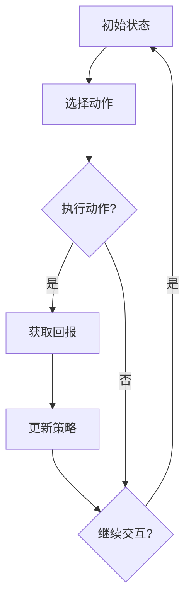
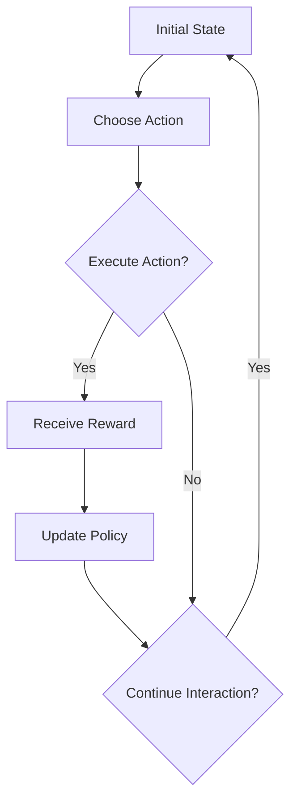
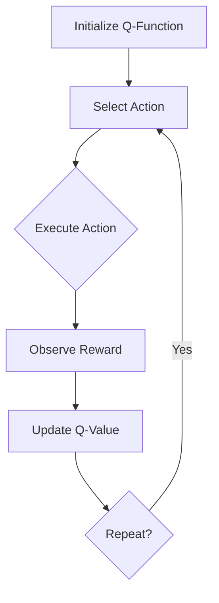
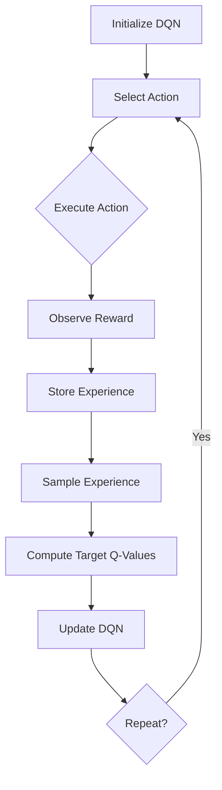

                 

### 文章标题

《强化学习Reinforcement Learning的模型无关学习算法分析》

Keywords: Reinforcement Learning, Model-Free Learning Algorithms, Q-Learning, SARSA, Deep Q-Networks, Exploration vs Exploitation

Abstract: 
本文深入探讨了强化学习（Reinforcement Learning, RL）中的模型无关学习算法，包括Q-Learning、SARSA和Deep Q-Networks。通过逐步分析其原理和操作步骤，本文旨在为读者提供一个全面的理解，并探讨其在实际应用中的挑战和未来发展趋势。

<|user|>### 1. 背景介绍（Background Introduction）

强化学习（Reinforcement Learning, RL）是机器学习的一个重要分支，旨在通过交互学习来最大化长期回报。与传统机器学习方法不同，强化学习通过智能体（Agent）与环境的不断交互，不断调整其行为策略，以实现最优化的目标。

强化学习的基本概念包括：

- **智能体（Agent）**：执行动作并接收环境反馈的实体。
- **环境（Environment）**：智能体所处的环境，能够根据智能体的动作产生状态转移和回报。
- **状态（State）**：描述智能体和环境当前状态的集合。
- **动作（Action）**：智能体可以采取的动作集合。
- **回报（Reward）**：描述智能体在环境中采取动作后获得的即时反馈。
- **策略（Policy）**：智能体在给定状态下采取的动作选择规则。

强化学习分为两大类：模型相关（Model-Based）和模型无关（Model-Free）。模型相关方法依赖于对环境的内部模型进行学习，而模型无关方法则不依赖于这种模型，直接从实际经验中学习。

本文主要关注模型无关强化学习算法，其中最具代表性的算法包括Q-Learning、SARSA和Deep Q-Networks。这些算法通过迭代更新策略，以最大化长期回报，具有广泛的应用前景。

#### 1.1 强化学习的发展历程

强化学习最早可以追溯到1950年代，当时由Richard Sutton和Andrew Barto提出了马尔可夫决策过程（MDP）的理论框架。这一理论奠定了强化学习的基础，使得强化学习成为机器学习领域中一个独立的研究方向。

1980年代，Q-Learning算法被提出，这是一种基于值函数的强化学习算法，通过迭代更新状态-动作值函数（Q-Function）来实现最优策略。随后，SARSA算法被提出，作为一种更具灵活性的Q-Learning变体，允许在更新Q值时同时考虑当前状态和动作。

进入21世纪，随着深度学习的发展，Deep Q-Networks（DQN）算法被提出，利用深度神经网络来近似Q函数，使得强化学习在复杂环境中的表现得到了显著提升。

#### 1.2 强化学习的应用领域

强化学习在许多实际应用领域中取得了显著成果，包括：

- **游戏**：例如Atari游戏、围棋、国际象棋等。
- **自动驾驶**：智能体通过学习来优化驾驶策略，提高安全性和效率。
- **推荐系统**：通过学习用户的互动行为，为用户提供个性化的推荐。
- **机器人控制**：智能体在现实世界中通过强化学习来控制机器人的动作。
- **金融交易**：利用强化学习来制定交易策略，优化投资组合。

#### 1.3 本文结构

本文将按照以下结构进行讨论：

- **第2章**：核心概念与联系，介绍强化学习的基本概念和主要算法。
- **第3章**：核心算法原理 & 具体操作步骤，详细解释Q-Learning、SARSA和DQN算法的原理和操作步骤。
- **第4章**：数学模型和公式 & 详细讲解 & 举例说明，探讨这些算法背后的数学模型和公式，并通过实例进行说明。
- **第5章**：项目实践：代码实例和详细解释说明，提供实际代码实现和详细解释。
- **第6章**：实际应用场景，讨论强化学习在实际应用中的案例和挑战。
- **第7章**：工具和资源推荐，介绍相关的学习资源和开发工具。
- **第8章**：总结：未来发展趋势与挑战，总结本文的内容，并展望未来强化学习的发展趋势和挑战。
- **第9章**：附录：常见问题与解答，回答读者可能遇到的问题。
- **第10章**：扩展阅读 & 参考资料，提供进一步的阅读材料和参考文献。

通过本文的讨论，我们希望读者能够全面了解强化学习模型无关算法的基本原理、操作步骤和应用场景，为今后的研究和实践提供指导。

#### 1.4 强化学习的挑战

尽管强化学习在许多领域取得了显著成果，但它仍然面临着一些挑战：

- **探索与利用的平衡**：智能体需要在探索新的状态和利用已有知识之间取得平衡，这是强化学习的核心难题之一。
- **样本效率**：强化学习需要大量的样本来训练模型，这可能导致训练时间过长。
- **不稳定性和过拟合**：由于强化学习的迭代过程，模型容易发生过拟合，导致在不同环境下表现不稳定。
- **现实世界应用**：将强化学习应用于现实世界场景时，需要处理复杂的环境动态和非确定性因素。

解决这些挑战需要进一步的研究和技术创新，这也是本文探讨的重点。

### 2. 核心概念与联系（Core Concepts and Connections）

在深入探讨强化学习的模型无关学习算法之前，首先需要理解强化学习的基本概念和主要算法。强化学习是一种通过试错（trial-and-error）和反馈（feedback）来学习最佳行为策略的机器学习方法。与监督学习和无监督学习不同，强化学习中的学习过程是一个交互式的过程，智能体通过与环境的不断交互来学习。

#### 2.1 强化学习的基本概念

强化学习的基本概念包括：

- **状态（State）**：描述智能体和环境当前的状态。
- **动作（Action）**：智能体可以采取的动作集合。
- **回报（Reward）**：描述智能体在环境中采取动作后获得的即时反馈。
- **策略（Policy）**：智能体在给定状态下采取的动作选择规则。
- **值函数（Value Function）**：描述智能体在某个状态下采取特定动作的长期回报。
- **策略迭代（Policy Iteration）**：通过更新策略来优化行为过程。

强化学习的过程可以概括为以下几个步骤：

1. **初始状态**：智能体随机选择一个状态开始。
2. **选择动作**：根据当前状态和策略选择一个动作。
3. **执行动作**：智能体执行所选动作，并观察环境反馈。
4. **获取回报**：环境根据智能体的动作给出即时回报。
5. **更新策略**：基于获得的回报和新的经验，智能体更新其策略。
6. **重复步骤**：智能体继续在环境中进行交互，不断迭代更新策略。

#### 2.2 模型相关（Model-Based）和模型无关（Model-Free）强化学习

强化学习分为模型相关（Model-Based）和模型无关（Model-Free）两大类。模型相关方法依赖于对环境的内部模型进行学习，而模型无关方法则不依赖于这种模型，直接从实际经验中学习。

- **模型相关（Model-Based）强化学习**：
  - **优势**：能够预测未来状态和回报，降低探索成本。
  - **劣势**：需要建立精确的动态模型，对环境变化的适应性较差。
  - **典型算法**：蒙特卡洛方法、规划算法、部分可观测马尔可夫决策过程（POMDP）。

- **模型无关（Model-Free）强化学习**：
  - **优势**：无需建立环境模型，能够直接从实际交互中学习。
  - **劣势**：样本效率较低，需要大量样本进行训练。
  - **典型算法**：Q-Learning、SARSA、Deep Q-Networks。

#### 2.3 模型无关强化学习算法

模型无关强化学习算法通过直接从交互中学习状态-动作值函数（Q-Function），从而优化智能体的策略。以下是几种常见的模型无关强化学习算法：

- **Q-Learning**：
  - **原理**：通过迭代更新状态-动作值函数，以最大化长期回报。
  - **操作步骤**：
    1. 初始化Q值函数。
    2. 在环境中进行交互，收集状态-动作对和回报。
    3. 更新Q值：$$Q(s, a) \leftarrow Q(s, a) + \alpha [r + \gamma \max_{a'} Q(s', a') - Q(s, a)]$$
    4. 重复步骤2和3，直到达到停止条件。

- **SARSA（同步优势学习算法）**：
  - **原理**：在更新Q值时同时考虑当前状态和动作，提高算法的灵活性。
  - **操作步骤**：
    1. 初始化Q值函数。
    2. 在环境中进行交互，收集状态-动作对和回报。
    3. 更新Q值：$$Q(s, a) \leftarrow Q(s, a) + \alpha [r + \gamma Q(s', a')] - Q(s, a)]$$
    4. 重复步骤2和3，直到达到停止条件。

- **Deep Q-Networks（DQN）**：
  - **原理**：利用深度神经网络来近似Q函数，处理复杂的状态空间。
  - **操作步骤**：
    1. 初始化深度神经网络和经验回放记忆。
    2. 在环境中进行交互，收集状态-动作对和回报。
    3. 存储交互经验到经验回放记忆。
    4. 从经验回放记忆中随机采样一批经验。
    5. 计算目标Q值：$$y = r + \gamma \max_{a'} \hat{Q}(s', a')$$
    6. 更新深度神经网络：$$\hat{Q}(s, a) \leftarrow \hat{Q}(s, a) + \alpha [y - \hat{Q}(s, a)]$$
    7. 重复步骤2至6，直到达到停止条件。

#### 2.4 强化学习中的探索与利用

在强化学习中，智能体需要平衡探索（Exploration）和利用（Exploitation）。探索是指尝试新的动作以获取更多信息，而利用是指基于当前信息选择最优动作。

- **ε-贪心策略（ε-Greedy Policy）**：
  - **原理**：以概率ε进行探索，以1-ε进行利用。
  - **操作步骤**：
    1. 从ε-贪心策略中选择动作：$$a \sim \epsilon-greedy(Q(s, \cdot))$$
    2. 执行动作，获取回报。
    3. 更新Q值。
    4. 重复步骤1至3，直到达到停止条件。

- **UCB算法（Upper Confidence Bound）**：
  - **原理**：基于置信区间选择动作，优先选择未探索过或回报较高的动作。
  - **操作步骤**：
    1. 计算每个动作的UCB值：$$UCB(s, a) = Q(s, a) + \sqrt{\frac{2\ln t(s, a)}{n(s, a)}}$$
    2. 从UCB值最高的动作中选择动作。
    3. 执行动作，获取回报。
    4. 更新Q值。
    5. 重复步骤1至4，直到达到停止条件。

通过平衡探索和利用，智能体能够在复杂环境中逐步优化其策略，实现长期回报最大化。

#### 2.5 Mermaid流程图

以下是一个简化的强化学习流程图，展示了智能体与环境之间的交互过程：



通过上述讨论，我们对强化学习的基本概念和模型无关算法有了初步了解。在接下来的章节中，我们将进一步详细探讨这些算法的原理和操作步骤，并通过实例说明其应用。

---

## 2. Core Concepts and Connections

Before diving into the model-free reinforcement learning algorithms, it's essential to understand the fundamental concepts and main algorithms in reinforcement learning. Reinforcement learning is a branch of machine learning that focuses on learning optimal behaviors through interaction and feedback. Unlike supervised and unsupervised learning, reinforcement learning involves an interactive process where an agent learns from the environment through trial and error.

### 2.1 Basic Concepts of Reinforcement Learning

The basic concepts of reinforcement learning include:

- **State**: A collection of variables that describe the current state of the agent and the environment.
- **Action**: A set of possible actions that the agent can take.
- **Reward**: An instantaneous feedback provided by the environment after the agent takes an action.
- **Policy**: The rule that dictates the action the agent should take in a given state.
- **Value Function**: A function that describes the long-term reward the agent can expect from a state or state-action pair.
- **Policy Iteration**: An iterative process for optimizing the behavior policy.

The process of reinforcement learning can be summarized as follows:

1. **Initial State**: The agent randomly selects a state to start.
2. **Choose Action**: Based on the current state and policy, the agent selects an action.
3. **Execute Action**: The agent executes the chosen action and observes the feedback from the environment.
4. **Receive Reward**: The environment provides an immediate reward based on the agent's action.
5. **Update Policy**: Based on the received reward and new experiences, the agent updates its policy.
6. **Repeat**: The agent continues interacting with the environment and iteratively updates its policy.

### 2.2 Model-Based and Model-Free Reinforcement Learning

Reinforcement learning can be divided into two main categories: model-based (Model-Based) and model-free (Model-Free). Model-based methods depend on learning an internal model of the environment, while model-free methods do not rely on this model and learn directly from actual experiences.

- **Model-Based Reinforcement Learning**:
  - **Advantages**: Can predict future states and rewards, reducing the cost of exploration.
  - **Disadvantages**: Requires building an accurate dynamic model, which is less adaptable to changes in the environment.
  - **Typical Algorithms**: Monte Carlo methods, planning algorithms, partially observable Markov decision processes (POMDP).

- **Model-Free Reinforcement Learning**:
  - **Advantages**: No need to build an environment model; learns directly from actual interactions.
  - **Disadvantages**: Low sample efficiency; requires a large number of samples for training.
  - **Typical Algorithms**: Q-Learning, SARSA, Deep Q-Networks (DQN).

### 2.3 Model-Free Reinforcement Learning Algorithms

Model-free reinforcement learning algorithms learn the state-action value function (Q-Function) directly from interactions to optimize the agent's policy. The following are several common model-free reinforcement learning algorithms:

- **Q-Learning**:
  - **Principle**: Iteratively updates the state-action value function to maximize the long-term reward.
  - **Operational Steps**:
    1. Initialize the Q-value function.
    2. Interact with the environment and collect state-action pairs and rewards.
    3. Update Q-values: $$Q(s, a) \leftarrow Q(s, a) + \alpha [r + \gamma \max_{a'} Q(s', a') - Q(s, a)]$$
    4. Repeat steps 2 and 3 until a stopping condition is met.

- **SARSA (同步优势学习算法)**:
  - **Principle**: Updates the Q-value considering both the current state and action, increasing the flexibility of the algorithm.
  - **Operational Steps**:
    1. Initialize the Q-value function.
    2. Interact with the environment and collect state-action pairs and rewards.
    3. Update Q-values: $$Q(s, a) \leftarrow Q(s, a) + \alpha [r + \gamma Q(s', a')] - Q(s, a)]$$
    4. Repeat steps 2 and 3 until a stopping condition is met.

- **Deep Q-Networks (DQN)**:
  - **Principle**: Uses a deep neural network to approximate the Q-function, enabling the algorithm to handle complex state spaces.
  - **Operational Steps**:
    1. Initialize the deep neural network and experience replay memory.
    2. Interact with the environment and collect state-action pairs and rewards.
    3. Store interaction experiences in the experience replay memory.
    4. Sample a batch of experiences from the experience replay memory randomly.
    5. Compute the target Q-values: $$y = r + \gamma \max_{a'} \hat{Q}(s', a')$$
    6. Update the deep neural network: $$\hat{Q}(s, a) \leftarrow \hat{Q}(s, a) + \alpha [y - \hat{Q}(s, a)]$$
    7. Repeat steps 2 to 6 until a stopping condition is met.

### 2.4 Exploration vs Exploitation in Reinforcement Learning

In reinforcement learning, the agent needs to balance exploration and exploitation. Exploration refers to trying out new actions to gather more information, while exploitation refers to using the current information to select the best action.

- **ε-Greedy Policy**:
  - **Principle**: Explores with probability ε and exploits with probability 1-ε.
  - **Operational Steps**:
    1. Choose an action using the ε-greedy policy: $$a \sim \epsilon-greedy(Q(s, \cdot))$$
    2. Execute the action and receive the reward.
    3. Update the Q-value.
    4. Repeat steps 1 to 3 until a stopping condition is met.

- **UCB Algorithm (Upper Confidence Bound)**:
  - **Principle**: Selects actions based on their upper confidence bounds, prioritizing unexplored or high-reward actions.
  - **Operational Steps**:
    1. Calculate the UCB values for each action: $$UCB(s, a) = Q(s, a) + \sqrt{\frac{2\ln t(s, a)}{n(s, a)}}$$
    2. Choose the action with the highest UCB value.
    3. Execute the action and receive the reward.
    4. Update the Q-value.
    5. Repeat steps 1 to 4 until a stopping condition is met.

By balancing exploration and exploitation, the agent can gradually optimize its policy in complex environments and maximize long-term rewards.

### 2.5 Mermaid Flowchart

Here is a simplified flowchart illustrating the interaction process between the agent and the environment in reinforcement learning:



Through these discussions, we have gained a preliminary understanding of the basic concepts and model-free reinforcement learning algorithms. In the following chapters, we will further explore the principles and operational steps of these algorithms and demonstrate their applications through examples.

---

### 3. 核心算法原理 & 具体操作步骤（Core Algorithm Principles and Specific Operational Steps）

在上一章节中，我们介绍了强化学习的基本概念和模型无关算法。在本章中，我们将深入探讨三种模型无关强化学习算法：Q-Learning、SARSA和Deep Q-Networks（DQN）。我们将详细讲解这些算法的原理和具体操作步骤，并通过实例来说明它们如何在实际应用中发挥作用。

#### 3.1 Q-Learning算法原理

Q-Learning算法是一种基于值函数的强化学习算法，旨在通过迭代更新状态-动作值函数（Q-Function）来找到最优策略。Q-Learning算法的核心思想是通过观察当前状态和动作，更新Q值以最大化长期回报。

- **Q-Learning算法原理**：

  Q-Learning算法通过以下公式更新Q值：
  $$Q(s, a) \leftarrow Q(s, a) + \alpha [r + \gamma \max_{a'} Q(s', a') - Q(s, a)]$$

  其中，\( s \) 和 \( a \) 分别代表当前状态和动作，\( r \) 为立即回报，\( \gamma \) 是折扣因子，用于平衡短期回报和长期回报，\( \alpha \) 是学习率，用于调整更新Q值的幅度。

- **具体操作步骤**：

  1. **初始化**：初始化Q值函数和智能体的初始状态。
  2. **选择动作**：根据当前状态和策略选择一个动作。
  3. **执行动作**：智能体执行所选动作，并观察环境反馈。
  4. **更新Q值**：根据观察到的回报和新的状态，使用上述公式更新Q值。
  5. **重复步骤2至4**：智能体继续在环境中进行交互，不断更新Q值。
  6. **策略优化**：根据Q值函数选择最优动作，优化智能体的策略。

  以下是一个简化的Q-Learning算法流程图：

  ```mermaid
  graph TD
  A[Initialize Q-Function] --> B[Select Action]
  B --> C{Execute Action}
  C --> D[Observe Reward]
  D --> E[Update Q-Value]
  E --> F{Repeat?}
  F -->|Yes| B
  ```

#### 3.2 SARSA算法原理

SARSA（同步优势学习算法）是Q-Learning的一个变体，它同样通过迭代更新状态-动作值函数，但与Q-Learning不同的是，SARSA在更新Q值时同时考虑当前状态和动作。

- **SARSA算法原理**：

  SARSA算法通过以下公式更新Q值：
  $$Q(s, a) \leftarrow Q(s, a) + \alpha [r + \gamma Q(s', a')] - Q(s, a)]$$

  其中，\( s \) 和 \( a \) 分别代表当前状态和动作，\( r \) 为立即回报，\( \gamma \) 是折扣因子，\( \alpha \) 是学习率。

- **具体操作步骤**：

  1. **初始化**：初始化Q值函数和智能体的初始状态。
  2. **选择动作**：根据当前状态和策略选择一个动作。
  3. **执行动作**：智能体执行所选动作，并观察环境反馈。
  4. **更新Q值**：根据观察到的回报和新的状态，使用上述公式更新Q值。
  5. **重复步骤2至4**：智能体继续在环境中进行交互，不断更新Q值。
  6. **策略优化**：根据Q值函数选择最优动作，优化智能体的策略。

  以下是一个简化的SARSA算法流程图：

  ```mermaid
  graph TD
  A[Initialize Q-Function] --> B[Select Action]
  B --> C{Execute Action}
  C --> D[Observe Reward]
  D --> E[Update Q-Value]
  E --> F{Repeat?}
  F -->|Yes| B
  ```

#### 3.3 Deep Q-Networks（DQN）算法原理

Deep Q-Networks（DQN）算法是Q-Learning和SARSA算法的扩展，它通过深度神经网络来近似状态-动作值函数，从而处理复杂的状态空间。DQN算法的核心思想是使用经验回放（Experience Replay）来减少样本的相关性，提高算法的稳定性。

- **DQN算法原理**：

  DQN算法通过以下公式更新Q值：
  $$\hat{Q}(s, a) \leftarrow \hat{Q}(s, a) + \alpha [r + \gamma \max_{a'} \hat{Q}(s', a') - \hat{Q}(s, a)]$$

  其中，\( s \) 和 \( a \) 分别代表当前状态和动作，\( r \) 为立即回报，\( \gamma \) 是折扣因子，\( \alpha \) 是学习率，\( \hat{Q} \) 是深度神经网络输出的Q值。

- **具体操作步骤**：

  1. **初始化**：初始化深度神经网络、经验回放记忆和智能体的初始状态。
  2. **选择动作**：根据当前状态和策略选择一个动作。
  3. **执行动作**：智能体执行所选动作，并观察环境反馈。
  4. **存储经验**：将当前状态、动作、立即回报和新状态存储到经验回放记忆中。
  5. **采样经验**：从经验回放记忆中随机采样一批经验。
  6. **计算目标Q值**：使用采样到的经验计算目标Q值。
  7. **更新深度神经网络**：使用目标Q值和当前Q值更新深度神经网络。
  8. **重复步骤2至7**：智能体继续在环境中进行交互，不断更新深度神经网络。
  9. **策略优化**：根据深度神经网络输出的Q值选择最优动作，优化智能体的策略。

  以下是一个简化的DQN算法流程图：

  ```mermaid
  graph TD
  A[Initialize DQN] --> B[Select Action]
  B --> C{Execute Action}
  C --> D[Observe Reward]
  D --> E[Store Experience]
  E --> F[Sample Experience]
  F --> G[Compute Target Q-Values]
  G --> H[Update DQN]
  H --> I{Repeat?}
  I -->|Yes| B
  ```

#### 3.4 实例说明

为了更好地理解上述算法，我们可以通过一个简单的例子来说明它们的操作步骤。

假设我们有一个智能体在一个简单的环境（例如，一个网格世界）中移动，目标是到达目标位置并获得最大回报。

1. **初始化**：初始化Q值函数、SARSA算法和DQN算法。
2. **选择动作**：根据当前状态和策略选择一个动作（例如，向上、向下、向左或向右）。
3. **执行动作**：智能体执行所选动作，并观察环境反馈。
4. **更新Q值**：根据观察到的回报和新的状态更新Q值。
5. **策略优化**：根据Q值函数选择最优动作，优化智能体的策略。

以下是一个简化的实例流程：

- **Q-Learning算法**：

  ```mermaid
  graph TD
  A[Initialize Q-Values] --> B[State: 1,2]
  B --> C{Action: Up}
  C --> D[State: 0,2]
  D --> E[Reward: 1]
  E --> F[Update Q-Value]
  F --> G[State: 0,1]
  G --> H{Action: Right}
  H --> I[State: 0,0]
  I --> J[Reward: 10]
  J --> K[Update Q-Value]
  K --> L[Stop?]
  L -->|Yes| M[Best Action: Right]
  ```

- **SARSA算法**：

  ```mermaid
  graph TD
  A[Initialize Q-Values] --> B[State: 1,2]
  B --> C{Action: Up}
  C --> D[State: 0,2]
  D --> E[Reward: 1]
  E --> F[Update Q-Value]
  F --> G[State: 0,1]
  G --> H{Action: Right}
  H --> I[State: 0,0]
  I --> J[Reward: 10]
  J --> K[Update Q-Value]
  K --> L[Stop?]
  L -->|Yes| M[Best Action: Right]
  ```

- **DQN算法**：

  ```mermaid
  graph TD
  A[Initialize DQN] --> B[State: 1,2]
  B --> C{Action: Up}
  C --> D[State: 0,2]
  D --> E[Reward: 1]
  E --> F[Store Experience]
  F --> G[Sample Experience]
  G --> H[Compute Target Q-Values]
  H --> I[Update DQN]
  I --> J[State: 0,1]
  J --> K{Action: Right}
  K --> L[State: 0,0]
  L --> M[Reward: 10]
  M --> N[Update DQN]
  N --> O[Stop?]
  O -->|Yes| P[Best Action: Right]
  ```

通过这个简单的实例，我们可以看到Q-Learning、SARSA和DQN算法如何在迭代过程中不断优化智能体的策略，使其在复杂环境中达到最优表现。

---

## 3. Core Algorithm Principles and Specific Operational Steps

In the previous chapter, we introduced the basic concepts and model-free reinforcement learning algorithms. In this chapter, we will delve into three model-free reinforcement learning algorithms: Q-Learning, SARSA, and Deep Q-Networks (DQN). We will discuss the principles and specific operational steps of these algorithms, demonstrating their practical application through examples.

### 3.1 Q-Learning Algorithm Principles

Q-Learning is a value-based reinforcement learning algorithm that aims to find the optimal policy by iteratively updating the state-action value function (Q-Function). The core idea of Q-Learning is to observe the current state and action, and update the Q-value to maximize the long-term reward.

**Q-Learning Algorithm Principles:**

Q-Learning updates the Q-value using the following formula:
$$Q(s, a) \leftarrow Q(s, a) + \alpha [r + \gamma \max_{a'} Q(s', a') - Q(s, a)]$$

Where \( s \) and \( a \) represent the current state and action, \( r \) is the immediate reward, \( \gamma \) is the discount factor that balances short-term and long-term rewards, and \( \alpha \) is the learning rate that adjusts the magnitude of the Q-value update.

**Specific Operational Steps:**

1. **Initialization**: Initialize the Q-value function and the agent's initial state.
2. **Select Action**: Based on the current state and policy, select an action.
3. **Execute Action**: The agent executes the chosen action and observes the environment's feedback.
4. **Update Q-Value**: Based on the observed reward and new state, update the Q-value using the formula above.
5. **Repeat Steps 2-4**: The agent continues interacting with the environment and updates the Q-value iteratively.
6. **Policy Optimization**: Based on the Q-value function, select the optimal action to optimize the agent's policy.

Here is a simplified flowchart of the Q-Learning algorithm:



### 3.2 SARSA Algorithm Principles

SARSA (同步优势学习算法) is a variant of Q-Learning that iteratively updates the state-action value function but considers both the current state and action when updating Q-values, increasing the flexibility of the algorithm.

**SARSA Algorithm Principles:**

SARSA updates the Q-value using the following formula:
$$Q(s, a) \leftarrow Q(s, a) + \alpha [r + \gamma Q(s', a')] - Q(s, a)]$$

Where \( s \) and \( a \) represent the current state and action, \( r \) is the immediate reward, \( \gamma \) is the discount factor, and \( \alpha \) is the learning rate.

**Specific Operational Steps:**

1. **Initialization**: Initialize the Q-value function and the agent's initial state.
2. **Select Action**: Based on the current state and policy, select an action.
3. **Execute Action**: The agent executes the chosen action and observes the environment's feedback.
4. **Update Q-Value**: Based on the observed reward and new state, update the Q-value using the formula above.
5. **Repeat Steps 2-4**: The agent continues interacting with the environment and updates the Q-value iteratively.
6. **Policy Optimization**: Based on the Q-value function, select the optimal action to optimize the agent's policy.

Here is a simplified flowchart of the SARSA algorithm:


### 3.3 Deep Q-Networks (DQN) Algorithm Principles

Deep Q-Networks (DQN) is an extension of Q-Learning and SARSA that uses a deep neural network to approximate the state-action value function, enabling the algorithm to handle complex state spaces. The core idea of DQN is to use experience replay to reduce the correlation of samples and improve the stability of the algorithm.

**DQN Algorithm Principles:**

DQN updates the Q-value using the following formula:
$$\hat{Q}(s, a) \leftarrow \hat{Q}(s, a) + \alpha [r + \gamma \max_{a'} \hat{Q}(s', a') - \hat{Q}(s, a)]$$

Where \( s \) and \( a \) represent the current state and action, \( r \) is the immediate reward, \( \gamma \) is the discount factor, \( \alpha \) is the learning rate, and \( \hat{Q} \) is the Q-value output by the deep neural network.

**Specific Operational Steps:**

1. **Initialization**: Initialize the deep neural network, experience replay memory, and the agent's initial state.
2. **Select Action**: Based on the current state and policy, select an action.
3. **Execute Action**: The agent executes the chosen action and observes the environment's feedback.
4. **Store Experience**: Store the current state, action, immediate reward, and new state in the experience replay memory.
5. **Sample Experience**: Randomly sample a batch of experiences from the experience replay memory.
6. **Compute Target Q-Values**: Use the sampled experiences to compute the target Q-values.
7. **Update Deep Neural Network**: Use the target Q-values and current Q-values to update the deep neural network.
8. **Repeat Steps 2-7**: The agent continues interacting with the environment and updates the deep neural network iteratively.
9. **Policy Optimization**: Based on the Q-values output by the deep neural network, select the optimal action to optimize the agent's policy.

Here is a simplified flowchart of the DQN algorithm:



### 3.4 Example Illustration

To better understand these algorithms, we can illustrate their operational steps through a simple example.

Imagine we have an agent moving in a simple environment (such as a grid world) with the goal of reaching a target position and receiving the maximum reward.

**Initialization**: Initialize Q-value functions, SARSA algorithm, and DQN algorithm.

**Select Action**: Based on the current state and policy, select an action (e.g., up, down, left, or right).

**Execute Action**: The agent executes the chosen action and observes the environment's feedback.

**Update Q-Value**: Based on the observed reward and new state, update the Q-value.

**Policy Optimization**: Based on the Q-value function, select the optimal action to optimize the agent's policy.

**Example Flow:**

- **Q-Learning Algorithm**:

  ```mermaid
  graph TD
  A[Initialize Q-Values] --> B[State: 1,2]
  B --> C{Action: Up}
  C --> D[State: 0,2]
  D --> E[Reward: 1]
  E --> F[Update Q-Value]
  F --> G[State: 0,1]
  G --> H{Action: Right}
  H --> I[State: 0,0]
  I --> J[Reward: 10]
  J --> K[Update Q-Value]
  K --> L[Stop?]
  L -->|Yes| M[Best Action: Right]
  ```

- **SARSA Algorithm**:

  ```mermaid
  graph TD
  A[Initialize Q-Values] --> B[State: 1,2]
  B --> C{Action: Up}
  C --> D[State: 0,2]
  D --> E[Reward: 1]
  E --> F[Update Q-Value]
  F --> G[State: 0,1]
  G --> H{Action: Right}
  H --> I[State: 0,0]
  I --> J[Reward: 10]
  J --> K[Update Q-Value]
  K --> L[Stop?]
  L -->|Yes| M[Best Action: Right]
  ```

- **DQN Algorithm**:

  ```mermaid
  graph TD
  A[Initialize DQN] --> B[State: 1,2]
  B --> C{Action: Up}
  C --> D[State: 0,2]
  D --> E[Reward: 1]
  E --> F[Store Experience]
  F --> G[Sample Experience]
  G --> H[Compute Target Q-Values]
  H --> I[Update DQN]
  I --> J[State: 0,1]
  J --> K{Action: Right}
  K --> L[State: 0,0]
  L --> M[Reward: 10]
  M --> N[Update DQN]
  N --> O[Stop?]
  O -->|Yes| P[Best Action: Right]
  ```

Through this simple example, we can see how Q-Learning, SARSA, and DQN algorithms iteratively optimize the agent's policy to achieve optimal performance in complex environments.

