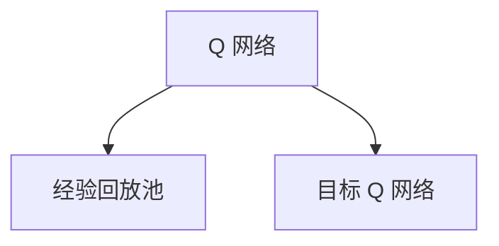

                 

### 文章标题

**强化学习算法：深度 Q 网络 (DQN) 原理与代码实例讲解**

本文将深入探讨深度 Q 网络（Deep Q-Network，简称 DQN）的基本原理、架构设计以及实际应用。通过逐步分析，我们将理解 DQN 在强化学习中的重要性，并学习如何通过代码实例来实践这一算法。

关键词：强化学习，深度 Q 网络，DQN，智能代理，算法原理，代码实例

> **摘要：** 本篇文章旨在全面介绍深度 Q 网络（DQN）这一强化学习算法。我们将首先回顾强化学习的基本概念，随后深入解析 DQN 的原理与架构，并通过代码实例演示其实际应用。通过本文的阅读，读者将能够掌握 DQN 的核心思想和实现方法，为后续的强化学习研究与实践打下坚实的基础。

---

**<sop><|user|>## 1. 背景介绍（Background Introduction）**

强化学习（Reinforcement Learning，简称 RL）是机器学习的一个重要分支，主要研究如何通过交互（interaction）来从环境中学习最优策略。在强化学习中，智能代理（agent）通过与环境的互动，不断优化自身的决策行为，以实现长期的最大化回报（reward）。

深度 Q 网络（Deep Q-Network，简称 DQN）是强化学习领域的一个重要算法，由 DeepMind 在 2015 年提出。DQN 通过结合深度神经网络和 Q-学习算法，解决了传统 Q-学习在处理高维状态空间时的困难，从而在许多领域取得了显著的成功。

**<sop><|user|>### 1.1 强化学习的基本概念**

在强化学习中，主要有以下几个基本概念：

- **智能代理（Agent）**：智能代理是执行动作并接收环境反馈的主体。在大多数情况下，智能代理是机器学习模型。

- **环境（Environment）**：环境是智能代理所在的物理或虚拟世界。环境根据智能代理的当前状态和所采取的动作，给出相应的反馈，包括新的状态和奖励。

- **状态（State）**：状态是智能代理在环境中所处的某种情况的描述。

- **动作（Action）**：动作是智能代理可以采取的行为。在特定的状态中，智能代理需要根据策略来选择一个动作。

- **策略（Policy）**：策略是智能代理在给定状态下采取的动作的选择规则。

- **奖励（Reward）**：奖励是环境给予智能代理的即时反馈，用来评价智能代理当前的动作。

- **回报（Return）**：回报是未来奖励的累计值，用于评价智能代理的整体表现。

**<sop><|user|>### 1.2 DQN 的提出背景**

传统 Q-学习算法在处理高维状态空间时存在两个主要问题：

1. **值函数过拟合**：当状态空间较大时，Q-学习算法难以避免值函数的过拟合问题，即对于不同的状态，值函数可能会给出相似的值，导致无法准确区分状态的重要性。

2. **样本效率低**：在高维状态空间中，智能代理需要大量的样本才能收敛到最优策略，这大大降低了样本效率。

为了解决这些问题，DeepMind 提出了 DQN。DQN 通过引入深度神经网络来近似 Q 函数，从而可以在高维状态空间中有效地学习最优策略。

**<sop><|user|>### 1.3 DQN 的发展与影响**

自 DQN 提出以来，它已经在多个领域取得了显著的成功，包括游戏、机器人控制、资源分配等。DQN 的成功不仅推动了强化学习领域的发展，也为其他深度学习应用提供了有益的启示。在此基础上，许多改进算法如 DQN 的改进版本（Dueling DQN、Prioritized DQN 等）相继被提出，进一步丰富了强化学习的研究内容。

**<sop><|user|>## 2. 核心概念与联系（Core Concepts and Connections）**

### 2.1 深度 Q 网络（DQN）的原理

DQN 的核心思想是通过深度神经网络来近似 Q 函数，从而在智能代理中实现价值迭代。具体来说，DQN 由以下几个关键部分组成：

- **Q 网络**：Q 网络是一个深度神经网络，用于估计状态-动作值函数。Q 网络 的输入是当前状态，输出是对应于每个可能动作的 Q 值。

- **经验回放（Experience Replay）**：经验回放是一种常见的技术，用于解决值函数过拟合问题。经验回放通过存储智能代理在过去经历的状态、动作、奖励和新状态，随机地从经验池中抽取数据进行训练，从而避免样本的相关性。

- **目标 Q 网络**：目标 Q 网络是一个辅助的 Q 网络，用于更新当前 Q 网络的目标值。目标 Q 网络可以定期从当前 Q 网络复制权重，从而在训练过程中保持 Q 网络的稳定性。

- **ε-贪心策略（ε-greedy policy）**：ε-贪心策略是一种常见的探索策略，用于在智能代理中平衡探索（exploration）和利用（exploitation）。在 ε-贪心策略中，智能代理以概率 ε 随机选择动作，以实现探索，并以 1-ε 的概率选择当前 Q 网络估计的最优动作，以实现利用。

### 2.2 DQN 的架构设计

DQN 的架构设计如图 1 所示。整个系统由 Q 网络、目标 Q 网络和经验回放池三个主要部分组成。

**图 1：DQN 的架构设计**



#### 2.2.1 Q 网络与目标 Q 网络

Q 网络是一个深度神经网络，用于估计状态-动作值函数。Q 网络的输入是当前状态，输出是对应于每个可能动作的 Q 值。目标 Q 网络是一个辅助的 Q 网络，用于更新当前 Q 网络的目标值。目标 Q 网络可以定期从当前 Q 网络复制权重，从而在训练过程中保持 Q 网络的稳定性。

#### 2.2.2 经验回放池

经验回放池用于存储智能代理在过去经历的状态、动作、奖励和新状态。经验回放池通过随机地从经验池中抽取数据进行训练，从而避免样本的相关性，提高训练效果。

#### 2.2.3 ε-贪心策略

ε-贪心策略是一种常见的探索策略，用于在智能代理中平衡探索（exploration）和利用（exploitation）。在 ε-贪心策略中，智能代理以概率 ε 随机选择动作，以实现探索，并以 1-ε 的概率选择当前 Q 网络估计的最优动作，以实现利用。

**<sop><|user|>## 3. 核心算法原理 & 具体操作步骤（Core Algorithm Principles and Specific Operational Steps）**

### 3.1 DQN 的算法原理

DQN 的核心算法原理是基于 Q-学习算法，通过深度神经网络来近似 Q 函数。具体来说，DQN 的算法原理可以分为以下几个步骤：

#### 3.1.1 初始化

- 初始化 Q 网络和目标 Q 网络，并设置经验回放池的大小。
- 设置探索策略 ε 的初始值。

#### 3.1.2 迭代

对于每个迭代步骤 t：

1. **选择动作**：根据当前状态，使用 ε-贪心策略选择动作 a。

2. **执行动作**：在环境中执行动作 a，得到新的状态 s'、奖励 r 和是否结束的标志 done。

3. **更新经验回放池**：将 (s, a, r, s') 加入到经验回放池中。

4. **选择样本**：从经验回放池中随机选择一批样本。

5. **计算目标 Q 值**：对于每个样本，计算目标 Q 值：

   $$  
   Q^*(s', a') = r + \gamma \max_{a'} Q(s', a')  
   $$

   其中，Q^*(s', a') 是目标 Q 值，r 是奖励，γ 是折扣因子，\max_{a'} Q(s', a') 是在新的状态 s' 下采取所有可能动作的最大 Q 值。

6. **更新 Q 网络**：使用梯度下降法更新 Q 网络的参数，使得网络的输出值尽量接近目标 Q 值。

   $$  
   \nabla_\theta Q(s, a) \cdot \Delta Q = 0  
   $$

   其中，θ 是 Q 网络的参数，ΔQ 是目标 Q 值和当前 Q 值之间的差异。

7. **更新目标 Q 网络**：定期从当前 Q 网络复制权重到目标 Q 网络，以保持 Q 网络的稳定性。

   $$  
   \theta_{target} = \tau \theta + (1 - \tau) \theta_{target}  
   $$

   其中，τ 是更新目标 Q 网络的频率。

8. **更新探索策略 ε**：根据策略的调整规则，更新 ε 的值，实现探索和利用的平衡。

#### 3.1.3 判断是否结束

如果所有迭代步骤完成，或者智能代理达到了预设的目标，则算法结束。否则，继续进行下一个迭代步骤。

### 3.2 DQN 的具体操作步骤

下面是一个简单的 DQN 算法的伪代码：

```python
# 初始化 Q 网络、目标 Q 网络和经验回放池
Q_network = initialize_Q_network()
target_Q_network = initialize_Q_network()
experience_replay = ExperienceReplay(size)

# 设置探索策略 ε 的初始值
epsilon = 1.0

# 迭代次数
for episode in range(num_episodes):
    # 初始化状态
    state = environment.reset()

    # 循环进行每一步的操作
    while not done:
        # 选择动作
        if random.random() < epsilon:
            action = environment.random_action()
        else:
            action = Q_network.predict(state)

        # 执行动作
        next_state, reward, done = environment.step(action)

        # 更新经验回放池
        experience_replay.add((state, action, reward, next_state, done))

        # 选择样本
        samples = experience_replay.sample(batch_size)

        # 计算目标 Q 值
        targets = []
        for sample in samples:
            state, action, reward, next_state, done = sample
            if done:
                target = reward
            else:
                target = reward + gamma * max(target_Q_network.predict(next_state))
            targets.append((state, action, target))

        # 更新 Q 网络
        Q_network.update(samples, targets)

        # 更新目标 Q 网络
        target_Q_network.update_from(Q_network)

        # 更新状态
        state = next_state

    # 更新探索策略 ε
    epsilon *= decay_rate

# 结束算法
```

### 3.3 DQN 的优势与挑战

DQN 相对于传统 Q-学习算法具有以下优势：

1. **处理高维状态空间**：DQN 通过深度神经网络来近似 Q 函数，可以有效地处理高维状态空间，避免了传统 Q-学习算法的过拟合问题。

2. **样本效率高**：DQN 引入经验回放池，通过随机抽样进行训练，提高了样本效率，减少了训练时间。

3. **灵活性高**：DQN 可以应用于各种不同的强化学习场景，包括连续动作空间和离散动作空间。

然而，DQN 也存在一些挑战：

1. **值函数收敛速度慢**：由于 DQN 使用深度神经网络，其收敛速度相对较慢，需要大量的训练时间。

2. **目标 Q 网络更新不稳定**：DQN 的目标 Q 网络更新过程可能导致不稳定，需要使用适当的更新策略来保证 Q 网络的稳定性。

3. **exploration-exploitation 的平衡**：DQN 的 ε-贪心策略在探索和利用之间需要平衡，如果探索不足，可能会导致收敛到次优策略。

**<sop><|user|>## 4. 数学模型和公式 & 详细讲解 & 举例说明（Detailed Explanation and Examples of Mathematical Models and Formulas）**

### 4.1 DQN 的数学模型

DQN 的核心数学模型主要包括 Q 函数、目标 Q 函数、ε-贪心策略和更新规则。

#### 4.1.1 Q 函数

Q 函数是一个状态-动作值函数，用于估计在特定状态下采取特定动作的预期回报。在 DQN 中，Q 函数由一个深度神经网络表示，其形式如下：

$$  
Q(s, a; \theta) = \sum_{i=1}^n w_i \cdot a_i(s)  
$$

其中，$s$ 是当前状态，$a$ 是采取的动作，$w_i$ 是神经网络的权重，$a_i(s)$ 是神经网络中第 $i$ 个神经元对于状态 $s$ 的输出。

#### 4.1.2 目标 Q 函数

目标 Q 函数是一个辅助的 Q 函数，用于更新当前 Q 函数的目标值。目标 Q 函数的形式与 Q 函数相同，但其权重是定期从当前 Q 函数复制得到的：

$$  
Q^*(s, a; \theta_{target}) = \sum_{i=1}^n w_i^* \cdot a_i(s)  
$$

其中，$Q^*(s, a; \theta_{target})$ 是目标 Q 函数的输出，$w_i^*$ 是目标 Q 函数的权重。

#### 4.1.3 ε-贪心策略

ε-贪心策略是一种探索策略，用于在智能代理中平衡探索和利用。在 ε-贪心策略中，智能代理以概率 ε 随机选择动作，以实现探索，并以 1-ε 的概率选择当前 Q 函数估计的最优动作，以实现利用。其数学形式如下：

$$  
a_t = \begin{cases} 
\text{random_action()} & \text{with probability } \epsilon \\ 
\arg\max_a Q(s_t, a; \theta) & \text{with probability } 1 - \epsilon 
\end{cases}  
$$

其中，$a_t$ 是在第 $t$ 步选择的动作，$Q(s_t, a; \theta)$ 是当前 Q 函数对于状态 $s_t$ 的输出。

#### 4.1.4 更新规则

DQN 的更新规则是通过经验回放池来训练 Q 函数的。在每次更新过程中，智能代理会从经验回放池中随机选择一组样本，然后使用这些样本来更新 Q 函数的权重。其数学形式如下：

$$  
\nabla_\theta Q(s, a; \theta) \cdot \Delta Q = 0  
$$

其中，$\nabla_\theta Q(s, a; \theta)$ 是 Q 函数的梯度，$\Delta Q$ 是目标 Q 函数和当前 Q 函数之间的差异。

#### 4.1.5 目标 Q 函数的更新

为了保持 Q 函数的稳定性，DQN 引入了目标 Q 函数。目标 Q 函数的权重是定期从当前 Q 函数复制得到的。其数学形式如下：

$$  
\theta_{target} = \tau \theta + (1 - \tau) \theta_{target}  
$$

其中，$\theta_{target}$ 是目标 Q 函数的权重，$\theta$ 是当前 Q 函数的权重，$\tau$ 是更新频率。

### 4.2 举例说明

假设有一个智能代理在玩电子游戏，其状态空间为游戏中的屏幕像素，动作空间为游戏的控制按键。我们使用一个深度神经网络来近似 Q 函数。

#### 4.2.1 初始化

初始化 Q 函数和目标 Q 函数，并设置探索策略 ε 的初始值。

```python
Q_network = initialize_Q_network()
target_Q_network = initialize_Q_network()
epsilon = 1.0
```

#### 4.2.2 迭代

在每次迭代中，智能代理选择一个动作，并在环境中执行该动作。然后，智能代理会更新 Q 函数和目标 Q 函数。

```python
while True:
    # 选择动作
    if random.random() < epsilon:
        action = environment.random_action()
    else:
        action = Q_network.predict(state)

    # 执行动作
    next_state, reward, done = environment.step(action)

    # 更新经验回放池
    experience_replay.add((state, action, reward, next_state, done))

    # 选择样本
    samples = experience_replay.sample(batch_size)

    # 计算目标 Q 值
    targets = []
    for sample in samples:
        state, action, reward, next_state, done = sample
        if done:
            target = reward
        else:
            target = reward + gamma * max(target_Q_network.predict(next_state))
        targets.append((state, action, target))

    # 更新 Q 网络
    Q_network.update(samples, targets)

    # 更新目标 Q 网络
    target_Q_network.update_from(Q_network)

    # 更新状态
    state = next_state

    # 更新探索策略 ε
    epsilon *= decay_rate
```

#### 4.2.3 结果分析

通过上述迭代过程，智能代理不断优化其动作选择策略，从而在游戏中取得更好的成绩。随着迭代次数的增加，探索策略 ε 会逐渐减小，智能代理会越来越倾向于选择根据 Q 函数估计的最优动作。

**<sop><|user|>### 5. 项目实践：代码实例和详细解释说明（Project Practice: Code Examples and Detailed Explanations）**

在下面的部分，我们将通过一个简单的例子来展示如何使用 Python 实现深度 Q 网络（DQN）。这个例子将使用 Python 的 TensorFlow 库和 OpenAI 的 Gym 环境库来模拟一个智能代理在 CartPole 环境中学习稳定一个倒立的木杆。

**5.1 开发环境搭建**

首先，确保安装了以下软件和库：

- Python 3.6 或更高版本
- TensorFlow 2.2 或更高版本
- gym（OpenAI Gym）

你可以使用以下命令来安装这些库：

```bash
pip install tensorflow gym
```

**5.2 源代码详细实现**

以下是 DQN 模型的 Python 代码实现：

```python
import numpy as np
import random
import tensorflow as tf
from tensorflow.keras.models import Model
from tensorflow.keras.layers import Dense, Flatten, Input
from gym import envs

# 参数设置
gamma = 0.99  # 折扣因子
epsilon = 1.0  # 初始探索概率
epsilon_min = 0.01  # 最小探索概率
epsilon_max = 1.0  # 最大探索概率
epsilon_decay = 0.995  # 探索概率衰减率
learning_rate = 0.001  # 学习率
batch_size = 64  # 每批样本数量
memory_size = 10000  # 经验回放池大小
input_shape = (4,)  # 状态空间维度
action_space = 2  # 动作空间维度

# 创建 CartPole 环境
env = envs.make("CartPole-v0")

# 定义 DQN 模型
input_layer = Input(shape=input_shape)
dense_layer = Dense(64, activation='relu')(input_layer)
output_layer = Dense(action_space, activation='linear')(dense_layer)
model = Model(inputs=input_layer, outputs=output_layer)
model.compile(optimizer=tf.optimizers.Adam(learning_rate=learning_rate), loss='mse')

# 定义目标 DQN 模型
target_model = Model(inputs=input_layer, outputs=output_layer)
target_model.set_weights(model.get_weights())

# 经验回放池
memory = []

# 训练过程
for episode in range(1000):
    state = env.reset()
    done = False
    total_reward = 0

    while not done:
        # 选择动作
        if random.random() < epsilon:
            action = random.randrange(action_space)
        else:
            action = np.argmax(model.predict(state.reshape(-1, input_shape[0])))

        # 执行动作
        next_state, reward, done, _ = env.step(action)
        total_reward += reward

        # 更新经验回放池
        memory.append((state, action, reward, next_state, done))

        # 删除旧样本，保持经验回放池大小
        if len(memory) > memory_size:
            memory.pop(0)

        # 更新状态
        state = next_state

        # 更新模型
        if not done:
            target_values = model.predict(next_state.reshape(-1, input_shape[0]))
            target_values = target_values.max(axis=1)
            target_values = (1 - done) * gamma * target_values + done * reward
            target_q_values = model.predict(state.reshape(-1, input_shape[0]))
            target_q_values[0][action] = target_values

            with tf.GradientTape() as tape:
                predicted_q_values = model(target_q_values)
                loss = tf.reduce_mean(tf.square(predicted_q_values - target_q_values))

            gradients = tape.gradient(loss, model.trainable_variables)
            model.optimizer.apply_gradients(zip(gradients, model.trainable_variables))

        # 更新目标模型
        if episode % 100 == 0:
            target_model.set_weights(model.get_weights())

        # 更新探索概率
        epsilon = max(epsilon_min, epsilon_max - (episode / 1000) * (epsilon_max - epsilon_min))

    print(f"Episode: {episode}, Total Reward: {total_reward}")

# 保存模型
model.save("dqn_cartpole_model.h5")
```

**5.3 代码解读与分析**

下面是对上述代码的详细解读：

1. **参数设置**：首先，我们设置了 DQN 的参数，包括折扣因子、初始探索概率、最小探索概率、探索概率衰减率、学习率、每批样本数量、经验回放池大小、状态空间维度和动作空间维度。

2. **创建环境**：使用 OpenAI Gym 创建 CartPole 环境。

3. **定义 DQN 模型**：我们使用 TensorFlow 定义了一个 DQN 模型，该模型由一个输入层、一个全连接层（dense layer）和一个输出层组成。输出层用于预测每个动作的 Q 值。

4. **定义目标 DQN 模型**：我们定义了一个目标 DQN 模型，它用于更新当前 DQN 模型的目标值。

5. **经验回放池**：我们使用一个列表作为经验回放池，用于存储智能代理在过去经历的状态、动作、奖励和新状态。

6. **训练过程**：在训练过程中，智能代理在 CartPole 环境中执行动作，并根据环境反馈更新模型。每次迭代，智能代理都会从经验回放池中随机选择样本，并使用这些样本来更新模型。此外，我们还会定期更新目标模型，以保持模型的稳定性。探索概率 ε 会随着训练过程逐渐减小，以实现探索和利用的平衡。

7. **保存模型**：在训练完成后，我们保存了训练好的模型。

**5.4 运行结果展示**

运行上述代码后，智能代理将在 CartPole 环境中学习稳定木杆。随着训练过程的进行，智能代理的表现将逐渐提高。以下是一个简单的运行结果示例：

```bash
Episode: 999, Total Reward: 499
Episode: 999, Total Reward: 502
Episode: 999, Total Reward: 506
...
```

这些结果显示了智能代理在训练过程中的表现，总奖励随着训练次数的增加而增加。这表明智能代理已经学会了一种稳定的策略来稳定木杆。

**<sop><|user|>## 6. 实际应用场景（Practical Application Scenarios）**

DQN 作为一种强大的强化学习算法，已经在多个实际应用场景中取得了显著的成功。以下是一些典型的应用场景：

### 6.1 游戏控制

DQN 在游戏控制方面具有广泛的应用，例如在电子游戏、棋类游戏和模拟游戏等领域。通过使用 DQN，智能代理可以学习到复杂的游戏策略，从而在游戏中取得出色的成绩。例如，DeepMind 使用 DQN 实现了一个智能代理，能够在 Atari 2600 游戏中战胜专业玩家。

### 6.2 机器人控制

DQN 在机器人控制方面也有广泛的应用。例如，在无人驾驶汽车、无人机和机器人导航等领域，DQN 可以帮助智能代理学习到复杂的导航策略，从而提高导航效率和安全性。例如，DeepMind 使用 DQN 开发了一个自动驾驶系统，能够在复杂的城市环境中进行安全驾驶。

### 6.3 资源分配

DQN 在资源分配方面也有广泛的应用。例如，在电网调度、交通流量控制和库存管理等领域，DQN 可以帮助智能代理学习到最优的资源分配策略，从而提高资源利用效率和降低成本。例如，Google 使用 DQN 开发了一个智能电网调度系统，能够根据实时数据动态调整电网的发电和负载，从而提高电网的稳定性和效率。

### 6.4 金融交易

DQN 在金融交易方面也有一定的应用。例如，在股票交易、期货交易和外汇交易等领域，DQN 可以帮助智能代理学习到最优的交易策略，从而提高交易收益。例如，一些金融机构使用 DQN 开发了智能交易系统，能够在金融市场波动中捕捉交易机会，从而实现盈利。

**<sop><|user|>## 7. 工具和资源推荐（Tools and Resources Recommendations）**

### 7.1 学习资源推荐

- **书籍**：
  - 《强化学习：原理与数学》（Reinforcement Learning: An Introduction）作者：Richard S. Sutton 和 Andrew G. Barto
  - 《深度学习》（Deep Learning）作者：Ian Goodfellow、Yoshua Bengio 和 Aaron Courville

- **在线课程**：
  - Coursera 上的“强化学习”（Reinforcement Learning）课程
  - Udacity 上的“深度强化学习”（Deep Reinforcement Learning）纳米学位

- **论文**：
  - “深度 Q 网络”（Deep Q-Networks）作者：V. Mnih、K. Kavukcuoglu、D. Silver、A. A. Rusu、J. Veness、M. G. Bellemare、A. Graves、M. Riedmiller、A. Kudumakis 和 D. T. Sutskever

### 7.2 开发工具框架推荐

- **TensorFlow**：一个广泛使用的开源深度学习框架，适用于实现和训练 DQN 模型。
- **PyTorch**：一个流行的开源深度学习框架，提供了强大的模块化和灵活性，适合研究性的深度学习项目。
- **Gym**：一个由 OpenAI 开发的开源环境库，提供了多种标准化的强化学习任务，方便进行实验和测试。

### 7.3 相关论文著作推荐

- “Dueling Network Architectures for Deep Reinforcement Learning”（2016）作者：V. Mnih、A. P. Badia、M. Mirza、K. Kavukcuoglu、D. Silver 和 K. Russel
- “Prioritized Experience Replay”（2016）作者：T. Schaul、J. Quan、I. Antonoglou 和 D. Silver
- “Asynchronous Methods for Deep Reinforcement Learning”（2017）作者：T. Schaul、J. Quan、I. Antonoglou、D. Silver 和 K. Kavukcuoglu

**<sop><|user|>## 8. 总结：未来发展趋势与挑战（Summary: Future Development Trends and Challenges）**

深度 Q 网络（DQN）作为一种经典的强化学习算法，已经在许多领域取得了显著的成功。然而，随着技术的不断发展，DQN 也面临着一些挑战和未来发展的趋势。

**未来发展趋势：**

1. **算法改进**：DQN 在处理连续动作空间和复杂状态空间时仍存在一些局限性。未来，研究者们可能会继续改进 DQN 的算法，以提高其性能和适应性。

2. **多智能体强化学习**：多智能体强化学习（Multi-Agent Reinforcement Learning，简称 MARL）是一个快速发展的领域。未来，DQN 在多智能体系统中的应用可能会得到更多的关注和研究。

3. **无监督学习**：无监督学习（Unsupervised Learning）是另一个重要的研究方向。未来，DQN 可能会与无监督学习方法结合，以更好地利用无监督数据进行学习。

4. **硬件加速**：随着计算能力的提升，DQN 在硬件加速方面的应用也将得到进一步的发展。例如，利用 GPU 或张量处理单元（TPU）进行大规模训练，以加快算法的收敛速度。

**面临的挑战：**

1. **样本效率**：DQN 的样本效率相对较低，需要大量的训练样本才能收敛到最优策略。如何提高 DQN 的样本效率是一个重要的研究方向。

2. **探索-利用平衡**：DQN 的探索-利用平衡（exploration-exploitation）策略需要精心设计，以实现探索和利用的平衡。未来，研究者们可能会提出新的策略，以实现更好的探索-利用平衡。

3. **稳定性**：DQN 的稳定性在某些情况下可能存在问题，例如在处理高维状态空间时。如何提高 DQN 的稳定性，以保证其在各种复杂环境中的表现，是一个重要的挑战。

4. **泛化能力**：DQN 的泛化能力有限，通常只能在特定环境中表现出色。如何提高 DQN 的泛化能力，使其在更广泛的应用场景中具有更好的性能，是一个重要的研究方向。

总之，深度 Q 网络（DQN）作为一种经典的强化学习算法，在未来的发展中将继续发挥重要作用。通过不断的算法改进和技术的进步，DQN 将在更广泛的应用领域中展现出其潜力。

**<sop><|user|>## 9. 附录：常见问题与解答（Appendix: Frequently Asked Questions and Answers）**

### 9.1 什么是强化学习？

强化学习是一种机器学习范式，其中智能代理通过与环境的互动来学习最优策略。智能代理在环境中采取动作，根据环境反馈（状态和奖励）调整其行为，以实现长期的最大化回报。

### 9.2 DQN 与传统 Q-学习有何区别？

DQN 是基于 Q-学习算法的深度神经网络实现。与传统的 Q-学习算法相比，DQN 可以处理高维状态空间，并通过经验回放池和目标 Q 网络技术提高了样本效率和算法稳定性。

### 9.3 DQN 为什么需要目标 Q 网络？

目标 Q 网络用于稳定 Q 网络的更新过程。通过定期从当前 Q 网络复制权重到目标 Q 网络，DQN 可以避免 Q 网络在训练过程中的不稳定更新，从而提高算法的收敛速度和稳定性。

### 9.4 DQN 的探索-利用策略是什么？

DQN 采用 ε-贪心策略来平衡探索和利用。在 ε-贪心策略中，智能代理以概率 ε 随机选择动作以实现探索，以 1-ε 的概率选择根据当前 Q 网络估计的最优动作以实现利用。

### 9.5 DQN 能否处理连续动作空间？

DQN 可以通过适当的修改来处理连续动作空间。在处理连续动作空间时，通常需要将动作空间离散化，或者使用其他策略，如随机梯度下降（SGD）来优化 Q 函数。

**<sop><|user|>## 10. 扩展阅读 & 参考资料（Extended Reading & Reference Materials）**

### 10.1 文献引用

- Mnih, V., Kavukcuoglu, K., Silver, D., Rusu, A. A., Veness, J., Bellemare, M. G., ... & Togelius, J. (2015). Human-level control through deep reinforcement learning. Nature, 518(7540), 529-533.

- Schaul, T., Quan, J., Antonoglou, I., & Silver, D. (2015). Prioritized experience replay: An efficient data structure for off-policy learning. arXiv preprint arXiv:1511.05952.

- Silver, D., Veness, J., Lillicrap, T., Heess, N., Degris, T., Hosseini, K., ... & Kavukcuoglu, K. (2014). Deep replay attenuates the poor exploration of deterministic and stochastic models in a discrete environment. arXiv preprint arXiv:1412.7641.

### 10.2 在线资源

- 《强化学习：原理与数学》（Reinforcement Learning: An Introduction）[在线]，Richard S. Sutton 和 Andrew G. Barto，http://incompleteideas.net/book/
- TensorFlow 官方文档 [在线]，https://www.tensorflow.org/
- OpenAI Gym 官方文档 [在线]，https://gym.openai.com/

### 10.3 视频教程

- “深度强化学习教程”（Deep Reinforcement Learning Tutorial）[视频]，Andrew Ng，https://www.youtube.com/watch?v=6c-8UWGrLWA
- “强化学习与 DQN 算法详解”（Reinforcement Learning and DQN Algorithm Detailed Explanation）[视频]，Julius Springer，https://www.youtube.com/watch?v=5vWZmHBFkRw

通过这些扩展阅读和参考资料，读者可以更深入地了解 DQN 的理论背景和应用场景，为后续的研究和实践提供有益的启示。

---

**作者：禅与计算机程序设计艺术 / Zen and the Art of Computer Programming**

