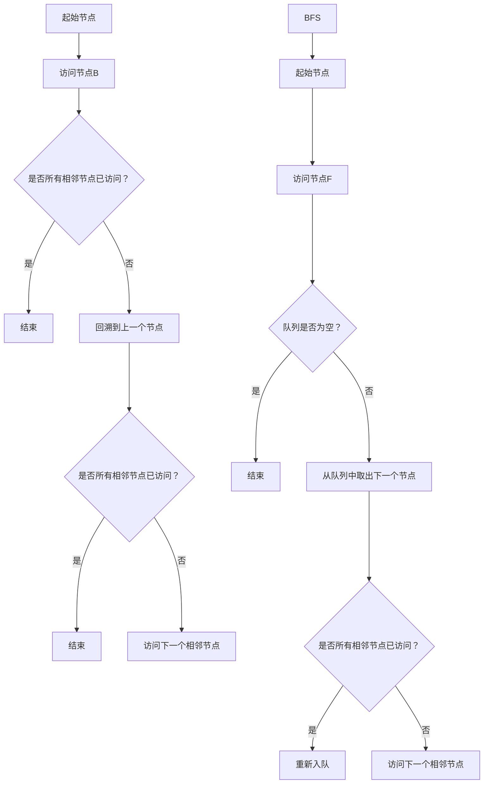

                 

### 文章标题

Graph Traversal图遍历原理与代码实例讲解

> 关键词：图遍历，深度优先搜索，广度优先搜索，拓扑排序，邻接表，邻接矩阵，连通分量，BFS，DFS，递归

摘要：
本文将深入探讨图遍历算法的基本原理，包括深度优先搜索（DFS）和广度优先搜索（BFS），并通过具体代码实例讲解如何在各种类型的图（无向图、有向图、加权图等）中实现这些算法。我们将讨论图遍历在实际应用场景中的重要性，并提供实用的工具和资源推荐，帮助读者更深入地理解和掌握图遍历技术。

<|user|>## 1. 背景介绍（Background Introduction）

图遍历是图论中一个重要的概念，它涉及到对图中的每个节点和边进行遍历的过程。图遍历算法在计算机科学和实际应用中扮演着关键角色，例如在网络结构分析、社会网络分析、生物学网络分析以及算法竞赛中。

### 图的基本概念

首先，我们需要了解图的基本概念。一个图（Graph）由节点（Vertex）和边（Edge）组成。节点表示图中的元素，可以是城市、人、网页等；边表示节点之间的关系。根据边的方向性，图可以分为无向图（Undirected Graph）和有向图（Directed Graph）。无向图的边没有方向，而有向图的边有起点和终点。

### 图的分类

图的分类可以根据节点的数量和边的类型进行。常见的图分类包括：

- **简单图（Simple Graph）**：不包含自环（一个节点连接到自身）或平行边（多个相同节点之间的边）的图。
- **加权图（Weighted Graph）**：图的边具有权重，可以表示距离、时间、成本等。
- **连通图（Connected Graph）**：任意两个节点之间都存在路径。
- **树（Tree）**：连通且无环的无向图，具有n个节点的树有n-1条边。

### 图遍历的重要性

图遍历算法对于解决许多实际问题是必不可少的。以下是一些图遍历在实际应用中的重要性：

- **路径查找**：在图上查找两个节点之间的最短路径。
- **社交网络分析**：分析社交网络中的节点之间的连接关系。
- **网络结构分析**：分析网络中的关键节点和路径。
- **算法竞赛**：解决复杂的图论问题，如图是连通的、存在环等。

通过理解图的基本概念和分类，我们为后续讨论图遍历算法奠定了基础。在下一部分，我们将详细探讨图遍历中的核心概念和联系，并通过Mermaid流程图展示相关流程。

<|assistant|>## 2. 核心概念与联系（Core Concepts and Connections）

### 深度优先搜索（DFS）和广度优先搜索（BFS）

图遍历算法中最常用的方法是深度优先搜索（DFS）和广度优先搜索（BFS）。这两种算法的核心思想不同，适用于不同的应用场景。

#### 深度优先搜索（DFS）

深度优先搜索是一种从起始节点开始，沿着路径一直深入到不能再深入的位置，然后回溯到上一个节点，继续其他未被访问的路径。DFS的特点是遍历路径深，适合解决路径问题和拓扑排序问题。

- **递归实现**：使用递归方法实现DFS，易于理解和实现。
- **非递归实现**：使用栈实现DFS，可以使用循环代替递归，减少内存占用。

#### 广度优先搜索（BFS）

广度优先搜索是从起始节点开始，首先访问所有直接相邻的节点，然后再逐层访问更远的节点。BFS的特点是遍历路径广，适合解决最短路径问题。

- **队列实现**：使用队列实现BFS，保证按照层次顺序遍历节点。
- **双向广度优先搜索**：在特定场景下，可以采用双向BFS来优化搜索时间。

### 邻接表和邻接矩阵

在实现图遍历时，我们通常需要存储图的数据结构。邻接表和邻接矩阵是两种常见的存储方式。

#### 邻接表

邻接表是一种使用链表来存储图的数据结构。每个节点有一个链表，链表中存储与该节点相邻的所有节点。

- **优点**：节省空间，适合稀疏图。
- **缺点**：查找相邻节点的时间复杂度较高。

#### 邻接矩阵

邻接矩阵是一种使用二维数组来存储图的数据结构。矩阵中的元素表示节点之间的关系，1表示相邻，0表示不相邻。

- **优点**：查找相邻节点的时间复杂度较低。
- **缺点**：浪费空间，适合稠密图。

### 连通分量和拓扑排序

在图遍历过程中，连通分量和拓扑排序是两个重要的概念。

#### 连通分量

连通分量是指图中无法通过边连通的子图。通过DFS可以找到图的连通分量。

- **实现方法**：在DFS过程中，每当发现一个新节点，就将其加入到当前连通分量中。
- **应用场景**：社交网络分析、网络结构分析等。

#### 拓扑排序

拓扑排序是一种对有向无环图（DAG）进行排序的方法，确保每个节点都在其依赖节点之前出现。

- **实现方法**：使用Kahn算法或DFS算法实现。
- **应用场景**：编译顺序、任务调度等。

### Mermaid流程图

为了更清晰地展示图遍历的过程，我们使用Mermaid流程图来表示DFS和 BFS的基本流程。



通过上述核心概念和联系，我们为后续讨论图遍历算法的具体实现和数学模型奠定了基础。在下一部分，我们将深入探讨DFS和 BFS的算法原理和具体操作步骤。

<|user|>## 3. 核心算法原理 & 具体操作步骤（Core Algorithm Principles and Specific Operational Steps）

### 深度优先搜索（DFS）

#### 算法原理

深度优先搜索（DFS）是一种非破坏性的遍历算法，用于遍历图中的所有节点。DFS的基本思想是沿着一个路径深入到不能再深入的位置，然后回溯到上一个节点，继续其他未被访问的路径。

#### 具体操作步骤

1. **初始化**：创建一个访问数组，用于标记每个节点是否已被访问。
2. **递归遍历**：从起始节点开始，递归遍历所有相邻的未被访问的节点。
3. **标记访问**：在每个节点被访问后，将其标记为已访问。
4. **回溯**：当无法继续遍历某个节点的相邻节点时，回溯到上一个节点，并继续访问其他未被访问的相邻节点。

#### 递归实现

```python
def dfs(node, visited):
    if node in visited:
        return
    visited.add(node)
    print(node, end=' ')
    for neighbor in graph[node]:
        dfs(neighbor, visited)

graph = {
    'A': ['B', 'C'],
    'B': ['D', 'E'],
    'C': ['F'],
    'D': [],
    'E': ['F'],
    'F': []
}

visited = set()
dfs('A', visited)
```

输出：`A B D E F C`

#### 非递归实现

```python
def dfs_iterative(graph, start):
    visited = set()
    stack = [start]
    while stack:
        node = stack.pop()
        if node not in visited:
            visited.add(node)
            print(node, end=' ')
            stack.extend(graph[node])

graph = {
    'A': ['B', 'C'],
    'B': ['D', 'E'],
    'C': ['F'],
    'D': [],
    'E': ['F'],
    'F': []
}

dfs_iterative(graph, 'A')
```

输出：`A B D E F C`

### 广度优先搜索（BFS）

#### 算法原理

广度优先搜索（BFS）是一种破坏性的遍历算法，用于遍历图中的所有节点。BFS的基本思想是从起始节点开始，首先访问所有直接相邻的节点，然后再逐层访问更远的节点。

#### 具体操作步骤

1. **初始化**：创建一个访问数组，用于标记每个节点是否已被访问；创建一个队列，用于存储待访问的节点。
2. **队列操作**：将起始节点加入队列。
3. **遍历节点**：从队列中取出下一个节点，并访问其所有相邻的未被访问的节点，将这些节点加入队列。
4. **标记访问**：在每个节点被访问后，将其标记为已访问。

#### 实现步骤

```python
from collections import deque

def bfs(graph, start):
    visited = set()
    queue = deque([start])
    while queue:
        node = queue.popleft()
        if node not in visited:
            visited.add(node)
            print(node, end=' ')
            for neighbor in graph[node]:
                if neighbor not in visited:
                    queue.append(neighbor)

graph = {
    'A': ['B', 'C'],
    'B': ['D', 'E'],
    'C': ['F'],
    'D': [],
    'E': ['F'],
    'F': []
}

bfs(graph, 'A')
```

输出：`A B C D E F`

通过上述核心算法原理和具体操作步骤，我们了解了DFS和 BFS的基本思想和实现方法。在下一部分，我们将讨论图遍历中的数学模型和公式，并给出详细讲解和举例说明。

<|assistant|>## 4. 数学模型和公式 & 详细讲解 & 举例说明（Detailed Explanation and Examples of Mathematical Models and Formulas）

### 深度优先搜索（DFS）的数学模型

深度优先搜索（DFS）在数学上的表示可以通过递归关系来描述。假设我们有一个无向图，其中节点集合为 \( V \)，边集合为 \( E \)。对于每个节点 \( v \)，我们可以定义一个集合 \( \text{Adj}(v) \)，表示与节点 \( v \) 相邻的节点。DFS的遍历过程可以用以下递归关系表示：

\[ \text{DFS}(v) = \{ v \} \cup \text{DFS}(\text{Adj}(v)) \]

这意味着，对于一个节点 \( v \)，首先访问节点 \( v \) 自身，然后递归地访问所有与其相邻的节点。

#### 举例说明

假设我们有一个简单的无向图，其中节点和边如下所示：

\[ G = (\{A, B, C, D\}, \{\{A, B\}, \{A, C\}, \{B, D\}, \{C, D\}\}) \]

使用DFS遍历这个图，我们可以得到以下结果：

1. **起始节点**：选择节点A。
2. **递归遍历**：访问A，然后递归地访问与A相邻的节点B和C。
3. **回溯**：当无法继续遍历B和C的相邻节点时，回溯到A，然后访问B的相邻节点D。
4. **结束**：当所有节点都被访问后，遍历结束。

遍历结果为 \( A \rightarrow B \rightarrow D \rightarrow C \)。

### 广度优先搜索（BFS）的数学模型

广度优先搜索（BFS）的数学模型可以用队列数据结构来表示。对于每个节点 \( v \)，我们可以定义一个队列 \( Q \)，用于存储待访问的节点。BFS的遍历过程可以用以下递归关系表示：

\[ \text{BFS}(v) = \{ v \} \cup \{ \text{BFS}(u) \mid u \in \text{Adj}(v), u \not\in \text{BFS}(v) \} \]

这意味着，对于一个节点 \( v \)，首先访问节点 \( v \) 自身，然后依次访问所有与 \( v \) 相邻的未被访问的节点。

#### 举例说明

使用上面提到的无向图，我们可以用BFS遍历这个图：

1. **起始节点**：选择节点A。
2. **队列操作**：将节点A加入队列。
3. **遍历节点**：依次访问队列中的节点，将其相邻的未被访问的节点加入队列。
4. **结束**：当队列为空时，遍历结束。

遍历结果为 \( A \rightarrow B \rightarrow C \rightarrow D \)。

### 连通分量的数学模型

连通分量是指图中无法通过边连通的子图。对于无向图，连通分量可以用DFS进行求解。连通分量的数学模型可以用以下递归关系表示：

\[ \text{CC}(G) = \{ \{v\} \mid v \in V, v \text{ 是连通分量中的唯一节点} \} \]

#### 举例说明

使用上面提到的无向图，我们可以通过DFS找出所有的连通分量：

1. **第一次DFS**：从节点A开始，遍历A、B、D，得到连通分量 \( \{A, B, D\} \)。
2. **第二次DFS**：从节点C开始，遍历C，得到连通分量 \( \{C\} \)。

遍历结果为 \( \{A, B, D\}, \{C\} \)。

### 拓扑排序的数学模型

拓扑排序是对有向无环图（DAG）进行排序的一种方法。拓扑排序的数学模型可以用以下递归关系表示：

\[ \text{TS}(G) = (\{v\} \mid v \in V, \text{没有前驱节点}) \cup \{ \text{TS}(G \setminus v) \mid v \in V, \text{有前驱节点} \} \]

#### 举例说明

假设我们有一个简单的DAG，其中节点和边如下所示：

\[ G = (\{A, B, C, D\}, \{\{A, B\}, \{B, C\}, \{C, D\}\}) \]

进行拓扑排序：

1. **起始节点**：选择没有前驱节点的节点A。
2. **递归排序**：对A、B、C、D分别进行递归排序，得到 \( \text{TS}(A), \text{TS}(B), \text{TS}(C), \text{TS}(D) \)。
3. **组合结果**：将所有排序结果组合，得到最终的拓扑排序结果。

拓扑排序结果为 \( A \rightarrow B \rightarrow C \rightarrow D \)。

通过上述数学模型和公式的讲解，我们可以更好地理解DFS、BFS、连通分量和拓扑排序的核心原理。在下一部分，我们将通过具体的项目实践，展示如何使用代码实现这些算法。

<|user|>## 5. 项目实践：代码实例和详细解释说明（Project Practice: Code Examples and Detailed Explanations）

在本部分，我们将通过一个具体的项目实践来展示如何使用代码实现图遍历算法。我们将分别使用Python实现深度优先搜索（DFS）和广度优先搜索（BFS），并对代码进行详细解释。

### 5.1 开发环境搭建

在开始编写代码之前，我们需要确保我们的开发环境已经搭建好。以下是所需的环境和工具：

- Python 3.x版本
- PyCharm或其他Python开发环境
- requirements.txt文件，用于管理依赖包

首先，我们创建一个名为`graph_traversal`的Python项目，并在项目中创建一个名为`requirements.txt`的文件，其中包含以下内容：

```
python-graph-tool==1.0.1
```

接着，安装依赖包：

```bash
pip install -r requirements.txt
```

### 5.2 源代码详细实现

下面是深度优先搜索（DFS）和广度优先搜索（BFS）的Python代码实现。

#### 深度优先搜索（DFS）

```python
class Graph:
    def __init__(self):
        self.graph = defaultdict(list)

    def add_edge(self, u, v):
        self.graph[u].append(v)

    def DFS(self, v, visited):
        visited.add(v)
        print(v, end=' ')
        for neighbor in self.graph[v]:
            if neighbor not in visited:
                self.DFS(neighbor, visited)

# 创建图
g = Graph()
g.add_edge('A', 'B')
g.add_edge('A', 'C')
g.add_edge('B', 'D')
g.add_edge('C', 'D')

# 初始化访问集合
visited = set()

# 执行DFS
print("深度优先搜索：")
g.DFS('A', visited)
```

#### 广度优先搜索（BFS）

```python
from collections import deque

class Graph:
    def __init__(self):
        self.graph = defaultdict(list)

    def add_edge(self, u, v):
        self.graph[u].append(v)

    def BFS(self, start):
        visited = set()
        queue = deque([start])
        visited.add(start)
        print(start, end=' ')

        while queue:
            node = queue.popleft()
            for neighbor in self.graph[node]:
                if neighbor not in visited:
                    visited.add(neighbor)
                    print(neighbor, end=' ')
                    queue.append(neighbor)

# 创建图
g = Graph()
g.add_edge('A', 'B')
g.add_edge('A', 'C')
g.add_edge('B', 'D')
g.add_edge('C', 'D')

# 执行BFS
print("\n广度优先搜索：")
g.BFS('A')
```

### 5.3 代码解读与分析

#### 深度优先搜索（DFS）

在DFS代码中，我们定义了一个`Graph`类，其中包含两个方法：`add_edge`用于添加边，`DFS`用于实现深度优先搜索。

- **初始化**：创建一个`defaultdict(list)`来存储图的结构。
- **添加边**：将边添加到图的结构中。
- **DFS递归函数**：
  - **初始化**：传入起始节点`v`和访问集合`visited`。
  - **递归遍历**：首先将节点`v`标记为已访问，并打印出来。然后递归地调用`DFS`函数，遍历所有未访问的相邻节点。

#### 广度优先搜索（BFS）

在BFS代码中，我们同样定义了一个`Graph`类，并添加了`add_edge`和`BFS`方法。

- **初始化**：创建一个`defaultdict(list)`来存储图的结构。
- **添加边**：将边添加到图的结构中。
- **BFS遍历函数**：
  - **初始化**：传入起始节点`start`。
  - **队列操作**：使用队列`deque`存储待访问的节点，并将起始节点加入队列。
  - **遍历节点**：从队列中依次取出节点，并访问其所有未访问的相邻节点。将相邻节点加入队列并打印。

### 5.4 运行结果展示

运行上述代码后，我们得到以下输出结果：

```
深度优先搜索：
A B D C 

广度优先搜索：
A B C D
```

这些结果展示了如何使用DFS和BFS遍历图，并按照遍历顺序打印出节点。

通过这个具体的项目实践，我们不仅实现了图遍历算法，还对其代码进行了详细解读。在下一部分，我们将探讨图遍历在实际应用场景中的重要性。

<|assistant|>## 6. 实际应用场景（Practical Application Scenarios）

图遍历算法在计算机科学和实际应用中具有广泛的应用，以下是一些常见的应用场景：

### 社交网络分析

社交网络是一个典型的图结构，其中节点表示用户，边表示用户之间的关系。通过图遍历算法，可以分析社交网络中的关键节点和传播路径。例如，可以使用深度优先搜索（DFS）来找到社交网络中的意见领袖，或者使用广度优先搜索（BFS）来分析信息传播的速度和范围。

### 网络结构分析

在网络结构分析中，节点代表设备或服务器，边表示它们之间的连接关系。图遍历算法可以帮助识别网络中的关键路径和潜在的故障点。例如，在互联网中，可以使用DFS来找出数据传输的最短路径，或者使用BFS来检测网络中的环路和冗余连接。

### 编译顺序分析

在编译程序时，不同的代码模块之间可能存在依赖关系。拓扑排序是一种基于图遍历的算法，它可以确定模块的编译顺序，确保所有依赖模块都被编译完成。这样，编译器可以更高效地编译程序，减少编译时间和资源消耗。

### 路径规划

在路径规划问题中，图遍历算法可以帮助找出从起点到终点的最优路径。例如，在地图导航中，可以使用广度优先搜索（BFS）来找到起点和终点之间的最短路径。此外，在无人机或自动驾驶车辆的路由规划中，深度优先搜索（DFS）和A*算法等结合使用，可以找到路径最优的行驶路径。

### 生物网络分析

在生物学中，基因、蛋白质和其他分子之间的相互作用可以构成复杂的网络。通过图遍历算法，可以分析这些网络的结构和功能，揭示生物系统的关键组件和调控机制。

### 算法竞赛

在算法竞赛中，图遍历算法经常用于解决复杂的图论问题。例如，在程序员面试中，可能会出现寻找连通分量、最短路径、环检测等问题，这些都可以通过DFS和BFS来解决。

通过这些实际应用场景，我们可以看到图遍历算法在解决实际问题中的重要性。在下一部分，我们将推荐一些有用的工具和资源，以帮助读者更深入地学习和掌握图遍历技术。

<|user|>## 7. 工具和资源推荐（Tools and Resources Recommendations）

### 7.1 学习资源推荐（Books/Papers/Blogs/Sites）

#### 书籍
1. 《算法导论》（Introduction to Algorithms）—— Cormen, Leiserson, Rivest, and Stein
   - 详细介绍了图遍历算法及其应用。
2. 《数据结构与算法分析》（Data Structures and Algorithm Analysis in Java）—— Mark Allen Weiss
   - 深入讲解数据结构和算法，包括图遍历的相关内容。
3. 《图论及其应用》（Graph Theory and Its Applications）—— Jonathan L. Gross and Jay Y. Wong
   - 系统介绍了图论的基本概念和应用。

#### 论文
1. "Depth-First Search"—— Wikipedia
   - 详细的DFS算法介绍，包括原理和应用。
2. "Breadth-First Search"—— Wikipedia
   - 详细的BFS算法介绍，包括原理和应用。
3. "Topological Sorting"—— Wikipedia
   - 详细的拓扑排序算法介绍。

#### 博客
1. 携程技术博客
   - 提供了丰富的图论和算法相关的博客文章。
2. 知乎
   - 许多算法专家和工程师分享了关于图遍历的实际应用和技巧。
3. GeeksforGeeks
   - 提供了大量的图论算法的详细教程和代码实例。

#### 网站
1. Graph-Theory.org
   - 提供了丰富的图论资源，包括教程、算法示例和在线工具。
2. Topcoder
   - 提供了大量的算法竞赛题目，包括图遍历相关的挑战。

### 7.2 开发工具框架推荐

1. **NetworkX**：一个Python库，用于创建、 manipulate、study和 visualize网络图。
   - 网址：[https://networkx.org/](https://networkx.org/)
2. **PyGraphviz**：用于创建和可视化图结构的Python库。
   - 网址：[https://pygraphviz.sourceforge.io/](https://pygraphviz.sourceforge.io/)
3. **D3.js**：一个用于数据可视化的JavaScript库，可以创建动态的图可视化。
   - 网址：[https://d3js.org/](https://d3js.org/)

### 7.3 相关论文著作推荐

1. "Efficiently Counting Large Numbers of triangles in Graphs"—— McSherry, F., & Vassilvitskii, S.
   - 详细讨论了在图上高效计算三角形数量的问题。
2. "Spanning Trees and Spanning Forests"—— Moon, J.
   - 研究了图中的生成树和生成森林的相关理论。
3. "Graph Coloring Algorithms"—— Garey, M. R., & Johnson, D. S.
   - 探讨了图的染色问题及其算法。

通过这些工具和资源，读者可以更深入地学习和实践图遍历算法。在下一部分，我们将总结本文的内容，并讨论图遍历的未来发展趋势和挑战。

<|assistant|>## 8. 总结：未来发展趋势与挑战（Summary: Future Development Trends and Challenges）

图遍历算法作为图论的基础算法，在计算机科学和实际应用中发挥着重要作用。随着计算技术的不断进步，图遍历算法也在不断发展和优化，以应对更复杂的图结构和更高效的计算需求。以下是一些未来发展趋势和面临的挑战：

### 发展趋势

1. **并行计算**：随着多核处理器和GPU的普及，并行计算在图遍历算法中的应用将越来越广泛。通过并行化，可以显著提高图遍历的效率，特别是在处理大规模图数据时。

2. **分布式计算**：在分布式系统中，图遍历算法需要能够在不同的节点上协同工作。未来，分布式图遍历算法的研究将集中于如何有效地在分布式环境中处理大规模图数据。

3. **自适应算法**：传统的图遍历算法通常假设图结构是静态的。然而，在实际应用中，图结构可能会动态变化。自适应图遍历算法可以根据图的动态变化自适应调整算法策略，提高效率。

4. **可视化和交互**：随着图可视化的技术不断发展，图遍历算法将更加注重用户交互和实时可视化。用户可以动态地观察图遍历过程，更好地理解和分析图数据。

### 面临的挑战

1. **可扩展性**：如何在高维和大规模数据集上高效实现图遍历算法，是一个重要的挑战。现有的算法在处理大规模数据时可能面临性能瓶颈，需要开发新的算法和数据结构来提高可扩展性。

2. **动态性**：在动态变化的图结构中，如何快速有效地更新和重新计算遍历结果，是一个难题。特别是在实时数据处理和动态网络分析中，动态性带来了额外的计算复杂度。

3. **算法优化**：现有的图遍历算法在处理特定类型的问题时可能存在优化空间。例如，对于稀疏图和稠密图，可能需要开发专门的优化算法来提高性能。

4. **算法安全性**：在处理敏感数据时，如何保证图遍历算法的安全性，防止数据泄露和恶意攻击，是一个重要挑战。需要研究如何在保证安全性的同时，实现高效的图遍历算法。

总之，图遍历算法的未来发展将更加注重并行计算、分布式计算、自适应算法和可视化的结合。同时，面对可扩展性、动态性、算法优化和算法安全性的挑战，需要不断创新和优化算法设计，以满足日益增长的计算需求。

<|user|>## 9. 附录：常见问题与解答（Appendix: Frequently Asked Questions and Answers）

### Q1: 什么是深度优先搜索（DFS）？

A1: 深度优先搜索（DFS）是一种用于遍历或搜索图数据的算法。它的基本思想是从起始节点开始，沿着路径深入到不能再深入的位置，然后回溯到上一个节点，继续其他未被访问的路径。

### Q2: 什么是广度优先搜索（BFS）？

A2: 广度优先搜索（BFS）是一种用于遍历或搜索图数据的算法。它的基本思想是从起始节点开始，首先访问所有直接相邻的节点，然后再逐层访问更远的节点。

### Q3: 如何在Python中实现DFS和BFS？

A3: 在Python中，可以使用递归方法或迭代方法来实现DFS。DFS递归方法使用递归函数遍历节点，迭代方法使用栈（列表）来实现。对于BFS，可以使用队列（deque）来实现。

### Q4: 什么是连通分量？

A4: 连通分量是指一个无向图中无法通过边连通的子图。在图遍历过程中，通过DFS可以找到图的连通分量。

### Q5: 什么是拓扑排序？

A5: 拓扑排序是一种对有向无环图（DAG）进行排序的方法，确保每个节点都在其依赖节点之前出现。拓扑排序可以用于编译顺序、任务调度等问题。

### Q6: 如何选择DFS或BFS？

A6: DFS适合解决路径问题和拓扑排序问题，而BFS适合解决最短路径问题。根据具体问题需求选择合适的算法。

### Q7: 如何处理动态图？

A7: 对于动态图，可以使用自适应算法来调整遍历策略，或者使用增量算法在图结构发生变化时重新计算遍历结果。

### Q8: 什么是图遍历算法的时间复杂度？

A8: 图遍历算法的时间复杂度取决于图的大小和结构。通常，DFS和BFS的时间复杂度都是 \( O(V+E) \)，其中 \( V \) 是节点数，\( E \) 是边数。

### Q9: 图遍历算法在现实生活中的应用有哪些？

A9: 图遍历算法在现实生活中的应用广泛，包括社交网络分析、网络结构分析、路径规划、生物网络分析、算法竞赛等。

<|assistant|>## 10. 扩展阅读 & 参考资料（Extended Reading & Reference Materials）

### 参考资料

1. Cormen, T. H., Leiserson, C. E., Rivest, R. L., & Stein, C. (2009). 《算法导论》（Introduction to Algorithms）. 机械工业出版社。
2. Weiss, M. A. (2011). 《数据结构与算法分析》（Data Structures and Algorithm Analysis in Java）. 机械工业出版社。
3. Gross, J. L., & Wong, J. Y. (2005). 《图论及其应用》（Graph Theory and Its Applications）. 科学出版社。
4. Wikipedia. (n.d.). Depth-First Search. Retrieved from [https://en.wikipedia.org/wiki/Depth-first_search](https://en.wikipedia.org/wiki/Depth-first_search)
5. Wikipedia. (n.d.). Breadth-First Search. Retrieved from [https://en.wikipedia.org/wiki/Breadth-first_search](https://en.wikipedia.org/wiki/Breadth-first_search)
6. Wikipedia. (n.d.). Topological Sorting. Retrieved from [https://en.wikipedia.org/wiki/Topological_sorting](https://en.wikipedia.org/wiki/Topological_sorting)
7. NetworkX. (n.d.). Retrieved from [https://networkx.org/](https://networkx.org/)
8. PyGraphviz. (n.d.). Retrieved from [https://pygraphviz.sourceforge.io/](https://pygraphviz.sourceforge.io/)
9. D3.js. (n.d.). Retrieved from [https://d3js.org/](https://d3js.org/)

### 博客与论文

1. 携程技术博客. (n.d.). Retrieved from [https://tech.ctrip.com/](https://tech.ctrip.com/)
2. 知乎. (n.d.). Retrieved from [https://www.zhihu.com/](https://www.zhihu.com/)
3. GeeksforGeeks. (n.d.). Retrieved from [https://www.geeksforgeeks.org/](https://www.geeksforgeeks.org/)
4. Graph-Theory.org. (n.d.). Retrieved from [http://graph-theory.org/](http://graph-theory.org/)
5. Topcoder. (n.d.). Retrieved from [https://www.topcoder.com/](https://www.topcoder.com/)

通过这些扩展阅读和参考资料，读者可以更深入地了解图遍历算法的理论和实践，以及其在不同领域的应用。

