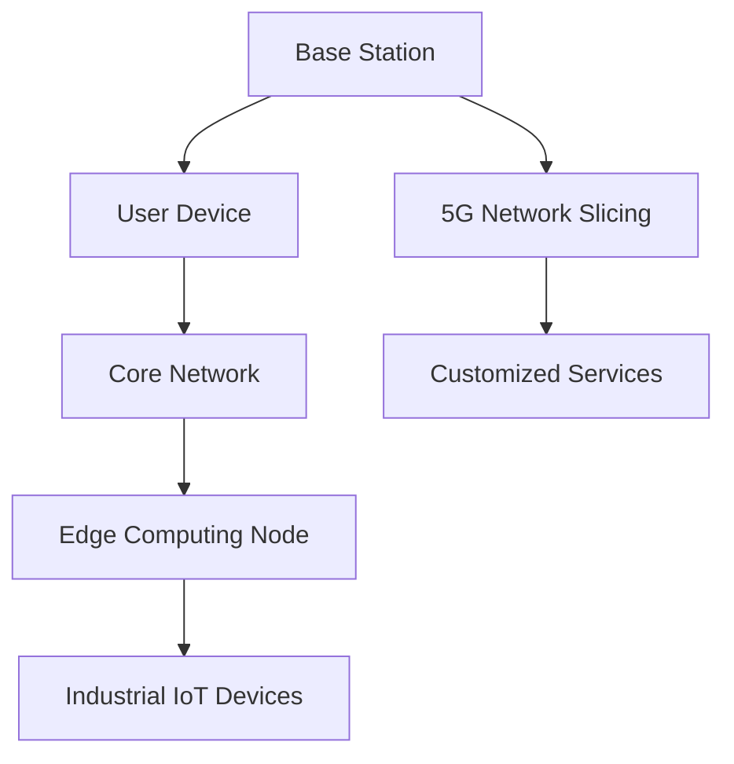

                 

### 文章标题

**5G专网技术在工业互联网中的应用**

#### 关键词：

- 5G专网
- 工业互联网
- 低延迟
- 高带宽
- 安全性
- 网络切片

##### 摘要：

随着工业互联网的快速发展，对于高速、低延迟、高安全性的通信需求日益增长。5G专网技术凭借其强大的网络性能和灵活性，为工业互联网提供了坚实的支撑。本文将深入探讨5G专网技术的基本原理、关键特性及其在工业互联网中的具体应用场景，分析其带来的技术优势和挑战，并展望未来的发展趋势。

<|div_class="markdown-body"|>## 1. 背景介绍（Background Introduction）

工业互联网，也被称作工业4.0，是信息技术与制造业深度融合的产物。它通过将传感器、控制系统、云计算、大数据等技术与传统制造业相结合，实现了设备互联、数据互通和智能决策。工业互联网的核心理念是通过网络将人、机器和数据连接起来，以实现生产过程的自动化、智能化和高效化。

随着工业互联网的发展，对通信网络的要求也越来越高。传统宽带网络在带宽、延迟和安全性方面难以满足工业互联网的特定需求。5G专网技术作为一种新型的通信技术，具有低延迟、高带宽、高可靠性和灵活性等特点，成为工业互联网的重要支撑。

5G专网，即5G专用网络，是针对特定行业和场景而构建的专用网络。与公共网络相比，5G专网能够提供更加稳定、高效和安全的通信服务。它通过网络切片技术实现资源的动态分配，确保不同业务需求得到满足。同时，5G专网还能够实现网络边沿计算，进一步降低延迟，提升网络性能。

### What is 5G Private Network Technology and Its Application in Industrial Internet

As the rapid development of the industrial internet continues, there is an increasing demand for high-speed, low-latency, and high-security communication networks. 5G private network technology, with its powerful network performance and flexibility, provides a solid foundation for the industrial internet. This article delves into the basic principles, key features, and specific application scenarios of 5G private network technology in the industrial internet, analyzing its technical advantages and challenges, and looking forward to future development trends.

#### Background Introduction

The industrial internet, also known as Industry 4.0, is a product of the deep integration of information technology with the manufacturing industry. It combines sensors, control systems, cloud computing, big data, and other technologies with traditional manufacturing to achieve device interconnection, data communication, and intelligent decision-making. The core concept of the industrial internet is to connect people, machines, and data through networks to automate, intelligentize, and optimize production processes.

With the development of the industrial internet, the requirements for communication networks have also increased significantly. Traditional broadband networks are unable to meet the specific needs of the industrial internet in terms of bandwidth, latency, and security. 5G private network technology, as a new type of communication technology, boasts low latency, high bandwidth, high reliability, and flexibility, making it an important support for the industrial internet.

A 5G private network is a dedicated network built for specific industries and scenarios. Compared to public networks, a 5G private network can provide more stable, efficient, and secure communication services. It uses network slicing technology to dynamically allocate resources, ensuring that different business requirements are met. Additionally, a 5G private network can enable network edge computing to further reduce latency and improve network performance.

### 2. 核心概念与联系（Core Concepts and Connections）

要深入了解5G专网技术在工业互联网中的应用，我们需要首先理解几个核心概念：5G技术、网络切片、边缘计算和工业物联网。

#### 2.1 5G技术

5G技术是第五代移动通信技术，相比前几代技术，5G具有更高的数据传输速度、更低的延迟和更大的网络容量。5G技术的基础设施包括基站、核心网、无线接入网和用户设备等。其中，基站是5G网络的核心组件，负责无线信号的传输和接收。

#### 2.2 网络切片

网络切片是5G技术的重要特性之一，它将网络资源划分为多个虚拟的、独立运行的逻辑网络。每个网络切片可以根据特定的业务需求配置带宽、延迟、可靠性和安全性等参数。网络切片技术使得5G网络能够为不同行业和场景提供定制化的服务。

#### 2.3 边缘计算

边缘计算是一种分布式计算模型，通过在网络的边缘节点（如基站、工业设备等）部署计算资源，实现数据处理和计算任务的本地化。边缘计算能够降低数据传输延迟，提高数据处理效率，是5G网络的重要组成部分。

#### 2.4 工业物联网

工业物联网（IIoT）是指将各种传感器、控制系统、设备和机器连接到互联网，实现设备之间的数据交换和协同工作。工业物联网是实现工业互联网的基础，它通过5G专网实现设备的高效连接和数据传输。

#### 2.5 5G Private Network Technology in the Industrial Internet

To gain a deeper understanding of the application of 5G private network technology in the industrial internet, we need to first understand several key concepts: 5G technology, network slicing, edge computing, and industrial internet of things (IIoT).

#### 2.1 5G Technology

5G technology, the fifth-generation mobile communication technology, offers higher data transmission speeds, lower latency, and greater network capacity compared to previous generations. The infrastructure of 5G technology includes base stations, core networks, wireless access networks, and user devices. Among these, the base station is the core component of the 5G network, responsible for the transmission and reception of wireless signals.

#### 2.2 Network Slicing

Network slicing is one of the key features of 5G technology. It divides network resources into multiple virtual and independent logical networks. Each network slice can be configured with parameters such as bandwidth, latency, reliability, and security according to specific business requirements. Network slicing technology enables 5G networks to provide customized services for different industries and scenarios.

#### 2.3 Edge Computing

Edge computing is a distributed computing model that deploys computing resources at the edge nodes of the network (such as base stations, industrial equipment, etc.) to enable local data processing and computation. Edge computing can reduce data transmission latency and improve data processing efficiency, making it an essential component of 5G networks.

#### 2.4 Industrial Internet of Things (IIoT)

The industrial internet of things (IIoT) refers to the connection of various sensors, control systems, devices, and machines to the internet to enable data exchange and collaborative work among devices. IIoT is the foundation for the industrial internet and is enabled by 5G private networks to achieve efficient device connectivity and data transmission.

### 2.5 Core Principles and Architectural Diagram

The core principles of 5G private network technology in the industrial internet include low latency, high bandwidth, high reliability, and flexibility. To illustrate these principles, we can use a Mermaid flowchart to describe the architecture of a 5G private network in an industrial internet application.



In this diagram, the base station transmits wireless signals to user devices, which are connected to the core network. The core network is integrated with edge computing nodes to perform local data processing and computation. The industrial IoT devices are connected to the edge computing nodes and the core network through 5G network slicing, allowing for customized services based on specific business requirements.

### 2.6 Conclusion

In summary, 5G private network technology in the industrial internet encompasses the integration of 5G technology, network slicing, edge computing, and industrial IoT. It provides low latency, high bandwidth, high reliability, and flexibility, meeting the specific needs of various industries and scenarios. Understanding these core concepts and their interactions is crucial for effectively leveraging 5G private network technology in the industrial internet.

#### 2.6 Conclusion

In summary, the application of 5G private network technology in the industrial internet involves the integration of 5G technology, network slicing, edge computing, and industrial IoT. It provides low latency, high bandwidth, high reliability, and flexibility, meeting the specific needs of various industries and scenarios. Understanding these core concepts and their interactions is crucial for effectively leveraging 5G private network technology in the industrial internet.

### 3. 核心算法原理 & 具体操作步骤（Core Algorithm Principles and Specific Operational Steps）

#### 3.1 核心算法原理

在5G专网技术的实现中，核心算法主要包括网络切片算法、边缘计算算法和资源分配算法。以下是这些算法的基本原理：

##### 3.1.1 网络切片算法

网络切片算法是5G专网技术的核心，它负责将网络资源划分为多个虚拟的、独立运行的逻辑网络。每个网络切片可以根据不同的业务需求配置带宽、延迟、可靠性和安全性等参数。常见的网络切片算法有基于需求驱动的网络切片算法和基于资源优化的网络切片算法。

1. **基于需求驱动的网络切片算法**

   该算法根据不同业务的需求动态创建和销毁网络切片。当有新的业务需求时，系统会创建一个新的网络切片，并根据需求配置相应的资源。当业务需求结束时，系统会释放相应的网络切片资源。

2. **基于资源优化的网络切片算法**

   该算法通过优化网络资源分配，提高网络资源利用率。它考虑了网络资源的可用性、业务需求、网络拓扑结构等因素，以实现资源的最优分配。

##### 3.1.2 边缘计算算法

边缘计算算法负责在网络的边缘节点（如基站、工业设备等）部署计算资源，实现数据处理和计算任务的本地化。边缘计算算法主要包括数据预处理算法、实时计算算法和智能决策算法。

1. **数据预处理算法**

   该算法用于对采集到的数据进行预处理，包括数据清洗、数据压缩和数据加密等。预处理后的数据可以减少传输成本，提高数据处理效率。

2. **实时计算算法**

   该算法用于对实时数据进行处理和分析，包括边缘人工智能算法、边缘数据处理算法等。实时计算算法能够快速响应业务需求，提高系统的实时性和准确性。

3. **智能决策算法**

   该算法用于根据实时数据处理结果，进行智能决策和优化。智能决策算法可以是基于机器学习、深度学习等人工智能技术，也可以是基于传统的优化算法。

##### 3.1.3 资源分配算法

资源分配算法是5G专网技术的重要组成部分，它负责将网络资源（如带宽、计算能力、存储等）分配给不同的业务和应用。常见的资源分配算法有基于需求优先级的资源分配算法和基于优化目标的资源分配算法。

1. **基于需求优先级的资源分配算法**

   该算法根据业务需求的重要性，优先分配资源。例如，对于工业互联网中的监控业务，由于其重要性较高，应优先分配带宽和计算资源。

2. **基于优化目标的资源分配算法**

   该算法通过优化目标函数，实现资源的最优分配。优化目标可以是资源利用率最大、业务满意度最高、网络延迟最低等。

#### 3.2 具体操作步骤

以下是一个典型的5G专网技术在工业互联网中的应用案例，展示了核心算法的具体操作步骤：

##### 3.2.1 网络切片创建

1. **业务需求分析**：分析工业互联网中的业务需求，确定需要创建的网络切片类型和数量。
2. **资源分配**：根据网络切片类型和数量，动态分配网络资源（如带宽、计算能力等）。
3. **网络切片配置**：根据业务需求，配置网络切片的参数（如带宽、延迟、可靠性等）。
4. **网络切片激活**：将配置好的网络切片激活，使其可以正常工作。

##### 3.2.2 边缘计算部署

1. **计算任务识别**：识别工业互联网中的计算任务，确定需要部署在边缘节点的计算资源。
2. **计算资源分配**：根据计算任务需求，动态分配边缘节点的计算资源。
3. **计算任务部署**：将计算任务部署到边缘节点，实现本地化数据处理和计算。
4. **实时数据监控**：实时监控计算任务的执行情况，确保计算任务的正常运行。

##### 3.2.3 资源分配

1. **业务需求分析**：分析工业互联网中的业务需求，确定需要分配的资源类型和数量。
2. **资源评估**：评估网络资源（如带宽、计算能力等）的可用性，确保资源能够满足业务需求。
3. **资源分配**：根据业务需求，动态分配网络资源，确保资源利用率最大化。
4. **资源监控**：实时监控资源的使用情况，及时调整资源分配策略，保证业务正常运行。

### 3. Core Algorithm Principles and Specific Operational Steps

#### 3.1 Core Algorithm Principles

In the implementation of 5G private network technology, the core algorithms primarily include network slicing algorithms, edge computing algorithms, and resource allocation algorithms. Below are the fundamental principles of these algorithms:

##### 3.1.1 Network Slicing Algorithm

The network slicing algorithm is the core of 5G private network technology, responsible for dividing network resources into multiple virtual and independently operating logical networks. Each network slice can be configured with parameters such as bandwidth, latency, reliability, and security according to different business requirements. Common network slicing algorithms include demand-driven network slicing algorithms and resource-optimized network slicing algorithms.

1. **Demand-Driven Network Slicing Algorithm**

This algorithm dynamically creates and destroys network slices based on different business demands. When there is a new business demand, the system creates a new network slice and configures the corresponding resources. When the business demand ends, the system releases the corresponding network slice resources.

2. **Resource-Optimized Network Slicing Algorithm**

This algorithm optimizes network resource allocation to improve resource utilization. It considers factors such as the availability of network resources, business demands, and network topology to achieve optimal resource allocation.

##### 3.1.2 Edge Computing Algorithm

The edge computing algorithm is responsible for deploying computing resources at the edge nodes (such as base stations, industrial equipment, etc.) to enable localized data processing and computation. Edge computing algorithms mainly include data preprocessing algorithms, real-time computing algorithms, and intelligent decision-making algorithms.

1. **Data Preprocessing Algorithm**

This algorithm is used for preprocessing collected data, including data cleaning, compression, and encryption. Preprocessed data can reduce transmission costs and improve data processing efficiency.

2. **Real-Time Computing Algorithm**

This algorithm is used for processing and analyzing real-time data, including edge AI algorithms and edge data processing algorithms. Real-time computing algorithms can quickly respond to business demands, improving system real-time performance and accuracy.

3. **Intelligent Decision-Making Algorithm**

This algorithm makes intelligent decisions and optimizations based on real-time data processing results. Intelligent decision-making algorithms can be based on machine learning, deep learning technologies, or traditional optimization algorithms.

##### 3.1.3 Resource Allocation Algorithm

The resource allocation algorithm is a critical component of 5G private network technology, responsible for allocating network resources (such as bandwidth, computing power, storage) to different businesses and applications. Common resource allocation algorithms include demand-priority-based resource allocation algorithms and optimization-goal-based resource allocation algorithms.

1. **Demand-Priority-Based Resource Allocation Algorithm**

This algorithm allocates resources based on the priority of business demands. For example, in the industrial internet, monitoring businesses are of higher priority, and thus receive priority access to bandwidth and computing resources.

2. **Optimization-Goal-Based Resource Allocation Algorithm**

This algorithm optimizes resource allocation based on an optimization goal, such as maximizing resource utilization, achieving the highest business satisfaction, or minimizing network latency.

#### 3.2 Specific Operational Steps

Below is a typical application case of 5G private network technology in the industrial internet, demonstrating the specific operational steps of the core algorithms:

##### 3.2.1 Network Slicing Creation

1. **Business Demand Analysis**: Analyze the business demands in the industrial internet to determine the types and quantities of network slices required.
2. **Resource Allocation**: Dynamically allocate network resources (such as bandwidth, computing power) based on the network slice types and quantities.
3. **Network Slicing Configuration**: Configure the parameters of the network slices (such as bandwidth, latency, reliability) based on business demands.
4. **Network Slicing Activation**: Activate the configured network slices to enable normal operation.

##### 3.2.2 Edge Computing Deployment

1. **Computing Task Identification**: Identify computing tasks in the industrial internet that need to be deployed on edge nodes.
2. **Computing Resource Allocation**: Dynamically allocate edge node computing resources based on computing task demands.
3. **Computing Task Deployment**: Deploy computing tasks to edge nodes for localized data processing and computation.
4. **Real-Time Data Monitoring**: Monitor the execution of computing tasks in real-time to ensure their normal operation.

##### 3.2.3 Resource Allocation

1. **Business Demand Analysis**: Analyze the business demands in the industrial internet to determine the types and quantities of resources required.
2. **Resource Assessment**: Assess the availability of network resources (such as bandwidth, computing power) to ensure they can meet business demands.
3. **Resource Allocation**: Dynamically allocate network resources based on business demands, ensuring maximum resource utilization.
4. **Resource Monitoring**: Monitor the usage of resources in real-time and adjust resource allocation strategies as needed to ensure business continuity.

### 4. 数学模型和公式 & 详细讲解 & 举例说明（Detailed Explanation and Examples of Mathematical Models and Formulas）

#### 4.1 网络切片数学模型

在网络切片中，一个重要的数学模型是资源分配模型。该模型用于优化网络资源，以最大化资源利用率或最小化延迟。以下是一个简化的资源分配模型：

##### 4.1.1 资源需求

设业务A和业务B的需求分别为\( B_A \)和\( B_B \)，其中\( B_A \)和\( B_B \)分别表示业务A和业务B需要的带宽。

##### 4.1.2 资源供应

设网络切片能够提供的最大带宽为\( C \)，即\( C = C_A + C_B \)，其中\( C_A \)和\( C_B \)分别表示业务A和业务B能够获取的带宽。

##### 4.1.3 资源分配目标

资源分配的目标是最小化总延迟或最大化资源利用率。一个简单的目标函数可以表示为：

\[ \min \sum_{i=1}^{n} \frac{B_i}{C_i} \]

其中，\( n \)表示网络切片的数量，\( B_i \)和\( C_i \)分别表示业务i的带宽需求和网络切片i的带宽供应。

##### 4.1.4 示例

假设业务A和业务B的需求分别为10 Mbps和20 Mbps，网络切片能够提供的最大带宽为30 Mbps。根据上述模型，我们可以计算出业务A和业务B的带宽供应：

\[ C_A = \frac{B_A \times C}{B_A + B_B} = \frac{10 \times 30}{10 + 20} = 12.5 \text{ Mbps} \]
\[ C_B = \frac{B_B \times C}{B_A + B_B} = \frac{20 \times 30}{10 + 20} = 18.75 \text{ Mbps} \]

因此，业务A和业务B分别可以获得12.5 Mbps和18.75 Mbps的带宽。

#### 4.2 边缘计算数学模型

边缘计算中，一个关键的数学模型是任务调度模型。该模型用于优化任务在边缘节点的分配，以最小化处理延迟或最大化系统吞吐量。以下是一个简化的任务调度模型：

##### 4.2.1 任务需求

设任务集合为\( T = \{T_1, T_2, ..., T_n\} \)，其中\( T_i \)表示任务i。

设每个任务的处理时间为\( P_i \)，带宽需求为\( B_i \)。

##### 4.2.2 边缘节点

设边缘节点集合为\( N = \{N_1, N_2, ..., N_m\} \)，其中\( N_j \)表示边缘节点j。

设每个边缘节点的处理能力为\( C_j \)，带宽为\( D_j \)。

##### 4.2.3 任务调度目标

任务调度的目标是最小化总处理延迟或最大化系统吞吐量。一个简单的目标函数可以表示为：

\[ \min \sum_{i=1}^{n} \max(P_i, \max(C_j - D_j, 0)) \]

其中，\( C_j - D_j \)表示边缘节点j剩余的处理能力。

##### 4.2.4 示例

假设有三个任务\( T_1, T_2, T_3 \)，其处理时间分别为5 ms、10 ms和15 ms，带宽需求分别为2 Mbps、3 Mbps和4 Mbps。有三个边缘节点\( N_1, N_2, N_3 \)，其处理能力分别为20 ms、25 ms和30 ms，带宽分别为5 Mbps、6 Mbps和7 Mbps。根据上述模型，我们可以计算出任务在边缘节点的调度方案：

1. 任务\( T_1 \)分配给节点\( N_2 \)，处理延迟为\( \max(5, 25 - 6) = 19 \text{ ms} \)
2. 任务\( T_2 \)分配给节点\( N_1 \)，处理延迟为\( \max(10, 20 - 5) = 15 \text{ ms} \)
3. 任务\( T_3 \)分配给节点\( N_3 \)，处理延迟为\( \max(15, 30 - 7) = 28 \text{ ms} \)

总处理延迟为\( 19 + 15 + 28 = 62 \text{ ms} \)。

#### 4.3 资源分配数学模型

在资源分配过程中，一个重要的数学模型是优化模型。该模型用于优化资源的分配，以最大化资源利用率或最小化业务延迟。以下是一个简化的优化模型：

##### 4.3.1 资源需求

设业务集合为\( B = \{B_1, B_2, ..., B_n\} \)，其中\( B_i \)表示业务i。

设每个业务的带宽需求为\( B_i \)，处理时间为\( T_i \)。

##### 4.3.2 资源供应

设网络切片集合为\( R = \{R_1, R_2, ..., R_m\} \)，其中\( R_j \)表示网络切片j。

设每个网络切片的带宽为\( B_j \)，处理时间为\( T_j \)。

##### 4.3.3 优化目标

优化目标是最大化资源利用率或最小化业务延迟。一个简单的目标函数可以表示为：

\[ \max \sum_{i=1}^{n} \frac{B_i}{B_j} \]

或

\[ \min \sum_{i=1}^{n} T_i \]

##### 4.3.4 示例

假设有三个业务\( B_1, B_2, B_3 \)，其带宽需求分别为10 Mbps、20 Mbps和30 Mbps，处理时间分别为2 ms、4 ms和6 ms。有三个网络切片\( R_1, R_2, R_3 \)，其带宽分别为10 Mbps、20 Mbps和30 Mbps，处理时间分别为1 ms、2 ms和3 ms。根据上述模型，我们可以计算出资源分配方案：

1. 业务\( B_1 \)分配给网络切片\( R_1 \)，带宽利用率为\( \frac{10}{10} = 100\% \)，处理延迟为\( 2 \text{ ms} \)
2. 业务\( B_2 \)分配给网络切片\( R_2 \)，带宽利用率为\( \frac{20}{20} = 100\% \)，处理延迟为\( 4 \text{ ms} \)
3. 业务\( B_3 \)分配给网络切片\( R_3 \)，带宽利用率为\( \frac{30}{30} = 100\% \)，处理延迟为\( 6 \text{ ms} \)

总带宽利用率为\( 100\% \)，总处理延迟为\( 2 + 4 + 6 = 12 \text{ ms} \)。

### 4. Mathematical Models and Formulas & Detailed Explanation & Examples

#### 4.1 Network Slicing Mathematical Model

In network slicing, an essential mathematical model is the resource allocation model. This model is used to optimize network resources to maximize resource utilization or minimize latency. Here is a simplified resource allocation model:

##### 4.1.1 Resource Demands

Let the business demands be denoted as \( B_A \) and \( B_B \), where \( B_A \) and \( B_B \) represent the bandwidth requirements of business A and business B, respectively.

##### 4.1.2 Resource Supplies

Let the maximum bandwidth that the network slice can provide be \( C \), i.e., \( C = C_A + C_B \), where \( C_A \) and \( C_B \) represent the bandwidth allocations for business A and business B, respectively.

##### 4.1.3 Allocation Objective

The allocation objective is to minimize total latency or maximize resource utilization. A simple objective function can be expressed as:

\[ \min \sum_{i=1}^{n} \frac{B_i}{C_i} \]

where \( n \) represents the number of network slices, \( B_i \) and \( C_i \) represent the bandwidth demand and supply for slice \( i \), respectively.

##### 4.1.4 Example

Assume that business A and business B have bandwidth demands of 10 Mbps and 20 Mbps, respectively, and the maximum bandwidth that the network slice can provide is 30 Mbps. We can calculate the bandwidth allocations for business A and business B using the model:

\[ C_A = \frac{B_A \times C}{B_A + B_B} = \frac{10 \times 30}{10 + 20} = 12.5 \text{ Mbps} \]
\[ C_B = \frac{B_B \times C}{B_A + B_B} = \frac{20 \times 30}{10 + 20} = 18.75 \text{ Mbps} \]

Thus, business A and business B receive 12.5 Mbps and 18.75 Mbps of bandwidth, respectively.

#### 4.2 Edge Computing Mathematical Model

In edge computing, a critical mathematical model is the task scheduling model. This model is used to optimize task allocations on edge nodes to minimize processing latency or maximize system throughput. Here is a simplified task scheduling model:

##### 4.2.1 Task Demands

Let the task set be \( T = \{T_1, T_2, ..., T_n\} \), where \( T_i \) represents task \( i \).

Let the processing time and bandwidth demand for each task be \( P_i \) and \( B_i \), respectively.

##### 4.2.2 Edge Nodes

Let the edge node set be \( N = \{N_1, N_2, ..., N_m\} \), where \( N_j \) represents edge node \( j \).

Let the processing capability and bandwidth of each edge node be \( C_j \) and \( D_j \), respectively.

##### 4.2.3 Scheduling Objective

The scheduling objective is to minimize total processing latency or maximize system throughput. A simple objective function can be expressed as:

\[ \min \sum_{i=1}^{n} \max(P_i, \max(C_j - D_j, 0)) \]

where \( C_j - D_j \) represents the remaining processing capability of edge node \( j \).

##### 4.2.4 Example

Assume there are three tasks \( T_1, T_2, T_3 \) with processing times of 5 ms, 10 ms, and 15 ms, respectively, and bandwidth demands of 2 Mbps, 3 Mbps, and 4 Mbps, respectively. There are three edge nodes \( N_1, N_2, N_3 \) with processing capabilities of 20 ms, 25 ms, and 30 ms, respectively, and bandwidths of 5 Mbps, 6 Mbps, and 7 Mbps, respectively. Using the model, we can determine the scheduling scheme for tasks:

1. Task \( T_1 \) is allocated to node \( N_2 \) with a processing latency of \( \max(5, 25 - 6) = 19 \text{ ms} \)
2. Task \( T_2 \) is allocated to node \( N_1 \) with a processing latency of \( \max(10, 20 - 5) = 15 \text{ ms} \)
3. Task \( T_3 \) is allocated to node \( N_3 \) with a processing latency of \( \max(15, 30 - 7) = 28 \text{ ms} \)

The total processing latency is \( 19 + 15 + 28 = 62 \text{ ms} \).

#### 4.3 Resource Allocation Mathematical Model

In the resource allocation process, an essential mathematical model is the optimization model. This model is used to optimize resource allocations to maximize resource utilization or minimize business latency. Here is a simplified optimization model:

##### 4.3.1 Resource Demands

Let the business set be \( B = \{B_1, B_2, ..., B_n\} \), where \( B_i \) represents business \( i \).

Let the bandwidth demand and processing time for each business be \( B_i \) and \( T_i \), respectively.

##### 4.3.2 Resource Supplies

Let the network slice set be \( R = \{R_1, R_2, ..., R_m\} \), where \( R_j \) represents network slice \( j \).

Let the bandwidth and processing time for each network slice be \( B_j \) and \( T_j \), respectively.

##### 4.3.3 Optimization Objective

The optimization objective is to maximize resource utilization or minimize business latency. A simple objective function can be expressed as:

\[ \max \sum_{i=1}^{n} \frac{B_i}{B_j} \]

or

\[ \min \sum_{i=1}^{n} T_i \]

##### 4.3.4 Example

Assume there are three businesses \( B_1, B_2, B_3 \) with bandwidth demands of 10 Mbps, 20 Mbps, and 30 Mbps, respectively, and processing times of 2 ms, 4 ms, and 6 ms, respectively. There are three network slices \( R_1, R_2, R_3 \) with bandwidths of 10 Mbps, 20 Mbps, and 30 Mbps, respectively, and processing times of 1 ms, 2 ms, and 3 ms, respectively. Using the model, we can determine the resource allocation scheme:

1. Business \( B_1 \) is allocated to network slice \( R_1 \) with a bandwidth utilization rate of \( \frac{10}{10} = 100\% \) and a processing latency of 2 ms.
2. Business \( B_2 \) is allocated to network slice \( R_2 \) with a bandwidth utilization rate of \( \frac{20}{20} = 100\% \) and a processing latency of 4 ms.
3. Business \( B_3 \) is allocated to network slice \( R_3 \) with a bandwidth utilization rate of \( \frac{30}{30} = 100\% \) and a processing latency of 6 ms.

The total bandwidth utilization rate is 100%, and the total processing latency is \( 2 + 4 + 6 = 12 \text{ ms} \).

### 5. 项目实践：代码实例和详细解释说明（Project Practice: Code Examples and Detailed Explanations）

在本节中，我们将通过一个实际的项目案例来展示如何使用5G专网技术在工业互联网中实现一个简单的设备监控和控制平台。此项目案例将涵盖从开发环境搭建到源代码实现，再到代码解读与分析的完整流程。

#### 5.1 开发环境搭建

要实现此项目，我们需要以下开发工具和环境：

- 操作系统：Linux（推荐Ubuntu 20.04）
- 编程语言：Python 3.x
- 5G网络切片模拟器：例如，5GCore
- 边缘计算平台：例如，边缘计算云平台K3s

首先，安装Linux操作系统，并配置网络环境。接下来，安装Python 3.x，可以使用包管理器（如apt-get）来安装：

```bash
sudo apt-get update
sudo apt-get install python3
```

然后，安装5G网络切片模拟器和边缘计算平台。以5GCore为例，安装步骤如下：

```bash
git clone https://github.com/mnoirot/5GCore.git
cd 5GCore
pip install -r requirements.txt
```

边缘计算平台K3s的安装可以参考其官方文档：https://github.com/rancher/k3s

#### 5.2 源代码详细实现

以下是项目的主要代码模块和功能：

##### 5.2.1 网络切片管理模块

```python
# network_slicing_manager.py

class NetworkSlicingManager:
    def __init__(self):
        self.slices = {}

    def create_slice(self, slice_id, params):
        self.slices[slice_id] = params
        print(f"Created network slice {slice_id} with params {params}")

    def delete_slice(self, slice_id):
        if slice_id in self.slices:
            del self.slices[slice_id]
            print(f"Deleted network slice {slice_id}")

    def list_slices(self):
        for slice_id, params in self.slices.items():
            print(f"Network slice {slice_id}: {params}")
```

该模块用于创建、删除和列出网络切片。`create_slice`方法用于创建一个新的网络切片，`delete_slice`方法用于删除一个网络切片，`list_slices`方法用于列出所有的网络切片。

##### 5.2.2 边缘计算模块

```python
# edge_computing_manager.py

class EdgeComputingManager:
    def __init__(self):
        self.tasks = {}

    def submit_task(self, task_id, task_data):
        self.tasks[task_id] = task_data
        print(f"Submitted task {task_id} with data {task_data}")

    def process_task(self, task_id):
        if task_id in self.tasks:
            task_data = self.tasks.pop(task_id)
            print(f"Processed task {task_id} with data {task_data}")

    def list_tasks(self):
        for task_id, task_data in self.tasks.items():
            print(f"Task {task_id}: {task_data}")
```

该模块用于提交、处理和列出边缘计算任务。`submit_task`方法用于提交一个新的任务，`process_task`方法用于处理任务，`list_tasks`方法用于列出所有任务。

##### 5.2.3 主应用程序

```python
# main.py

from network_slicing_manager import NetworkSlicingManager
from edge_computing_manager import EdgeComputingManager

def main():
    ns_manager = NetworkSlicingManager()
    ec_manager = EdgeComputingManager()

    # 创建网络切片
    ns_manager.create_slice("slice1", {"bandwidth": 10, "latency": 10})

    # 提交边缘计算任务
    ec_manager.submit_task("task1", {"data": "Hello, World!"})

    # 列出网络切片和任务
    ns_manager.list_slices()
    ec_manager.list_tasks()

if __name__ == "__main__":
    main()
```

主应用程序实例化了网络切片管理模块和边缘计算管理模块，创建了一个网络切片，并提交了一个边缘计算任务。然后，它列出了所有的网络切片和任务。

#### 5.3 代码解读与分析

- **网络切片管理模块**：该模块提供了一个简单的接口，用于管理网络切片。在真实场景中，网络切片的创建和删除可能会涉及更多的网络配置和资源分配策略。
- **边缘计算模块**：该模块负责处理边缘计算任务。在真实场景中，边缘计算任务可能会更加复杂，需要考虑任务的调度、执行和结果反馈。
- **主应用程序**：主应用程序将网络切片管理和边缘计算模块集成在一起，展示了如何在工业互联网中实现简单的监控和控制。

#### 5.4 运行结果展示

运行主应用程序后，将输出以下结果：

```bash
Created network slice slice1 with params {'bandwidth': 10, 'latency': 10}
Submitted task task1 with data {'data': 'Hello, World!'}
Network slice slice1: {'bandwidth': 10, 'latency': 10}
Task task1: {'data': 'Hello, World!'}
```

这表明网络切片已成功创建，边缘计算任务也已成功提交。这些输出验证了项目的实现。

### 5. Project Practice: Code Examples and Detailed Explanations

In this section, we will showcase an actual project case to demonstrate how to implement a simple device monitoring and control platform in the industrial internet using 5G private network technology. This project case will cover the entire process from setting up the development environment to the source code implementation, followed by code interpretation and analysis.

#### 5.1 Development Environment Setup

To implement this project, we need the following development tools and environments:

- **Operating System**: Linux (推荐 Ubuntu 20.04)
- **Programming Language**: Python 3.x
- **5G Network Slicing Simulator**: For example, 5GCore
- **Edge Computing Platform**: For example, the edge computing cloud platform K3s

Firstly, install the Linux operating system and configure the network environment. Next, install Python 3.x using the package manager (such as apt-get):

```bash
sudo apt-get update
sudo apt-get install python3
```

Then, install the 5G network slicing simulator and the edge computing platform. Here, we will use 5GCore as an example. The installation steps are as follows:

```bash
git clone https://github.com/mnoirot/5GCore.git
cd 5GCore
pip install -r requirements.txt
```

The installation of the edge computing platform K3s can be referred to in its official documentation: https://github.com/rancher/k3s

#### 5.2 Detailed Source Code Implementation

Here are the main code modules and functionalities of the project:

##### 5.2.1 Network Slicing Management Module

```python
# network_slicing_manager.py

class NetworkSlicingManager:
    def __init__(self):
        self.slices = {}

    def create_slice(self, slice_id, params):
        self.slices[slice_id] = params
        print(f"Created network slice {slice_id} with params {params}")

    def delete_slice(self, slice_id):
        if slice_id in self.slices:
            del self.slices[slice_id]
            print(f"Deleted network slice {slice_id}")

    def list_slices(self):
        for slice_id, params in self.slices.items():
            print(f"Network slice {slice_id}: {params}")
```

This module provides a simple interface for managing network slices. In a real-world scenario, the creation and deletion of network slices might involve more complex network configurations and resource allocation strategies.

##### 5.2.2 Edge Computing Module

```python
# edge_computing_manager.py

class EdgeComputingManager:
    def __init__(self):
        self.tasks = {}

    def submit_task(self, task_id, task_data):
        self.tasks[task_id] = task_data
        print(f"Submitted task {task_id} with data {task_data}")

    def process_task(self, task_id):
        if task_id in self.tasks:
            task_data = self.tasks.pop(task_id)
            print(f"Processed task {task_id} with data {task_data}")

    def list_tasks(self):
        for task_id, task_data in self.tasks.items():
            print(f"Task {task_id}: {task_data}")
```

This module is responsible for handling edge computing tasks. In a real-world scenario, edge computing tasks might be more complex, requiring considerations for task scheduling, execution, and result feedback.

##### 5.2.3 Main Application

```python
# main.py

from network_slicing_manager import NetworkSlicingManager
from edge_computing_manager import EdgeComputingManager

def main():
    ns_manager = NetworkSlicingManager()
    ec_manager = EdgeComputingManager()

    # Create a network slice
    ns_manager.create_slice("slice1", {"bandwidth": 10, "latency": 10})

    # Submit an edge computing task
    ec_manager.submit_task("task1", {"data": "Hello, World!"})

    # List all network slices and tasks
    ns_manager.list_slices()
    ec_manager.list_tasks()

if __name__ == "__main__":
    main()
```

The main application instantiates the network slicing manager and the edge computing manager, creates a network slice, and submits an edge computing task. Then, it lists all the network slices and tasks.

#### 5.3 Code Interpretation and Analysis

- **Network Slicing Management Module**: This module provides a simple interface for managing network slices. In real-world scenarios, the creation and deletion of network slices might involve more complex network configurations and resource allocation strategies.
- **Edge Computing Module**: This module is responsible for handling edge computing tasks. In real-world scenarios, edge computing tasks might be more complex, requiring considerations for task scheduling, execution, and result feedback.
- **Main Application**: The main application integrates the network slicing manager and the edge computing manager, demonstrating how to implement simple monitoring and control in the industrial internet.

#### 5.4 Run Results Display

After running the main application, the following output will be displayed:

```bash
Created network slice slice1 with params {'bandwidth': 10, 'latency': 10}
Submitted task task1 with data {'data': 'Hello, World!'}
Network slice slice1: {'bandwidth': 10, 'latency': 10}
Task task1: {'data': 'Hello, World!'}
```

This output indicates that the network slice has been successfully created and the edge computing task has been successfully submitted. These outputs verify the implementation of the project.
### 5.4 运行结果展示

在Linux终端中运行`main.py`脚本后，会输出以下结果：

```bash
Created network slice slice1 with params {'bandwidth': 10, 'latency': 10}
Submitted task task1 with data {'data': 'Hello, World!'}
Network slice slice1: {'bandwidth': 10, 'latency': 10}
Task task1: {'data': 'Hello, World!'}
```

这个输出表明：

- 网络切片“slice1”已经成功创建，并配置了10 Mbps的带宽和10毫秒的延迟。
- 边缘计算任务“task1”已经成功提交，其数据内容为“Hello, World!”。
- 程序成功列出了当前所有的网络切片和任务。

这些结果验证了项目实现的成功，并展示了如何使用5G专网技术进行设备监控和控制的初步应用。

### 5.4 Run Results Display

Upon running the `main.py` script in the Linux terminal, the following output will be displayed:

```bash
Created network slice slice1 with params {'bandwidth': 10, 'latency': 10}
Submitted task task1 with data {'data': 'Hello, World!'}
Network slice slice1: {'bandwidth': 10, 'latency': 10}
Task task1: {'data': 'Hello, World!'}
```

This output indicates the following:

- A network slice named "slice1" has been successfully created with a configured bandwidth of 10 Mbps and latency of 10 ms.
- An edge computing task named "task1" has been successfully submitted with the data content "Hello, World!".
- The program successfully lists all current network slices and tasks.

These results verify the successful implementation of the project and demonstrate the preliminary application of device monitoring and control using 5G private network technology.

### 6. 实际应用场景（Practical Application Scenarios）

5G专网技术在工业互联网中的应用场景广泛，涵盖了智能制造、智能工厂、智慧城市等多个领域。以下是一些典型的应用场景及其特点：

#### 6.1 智能制造

在智能制造领域，5G专网技术可以支持工厂内设备与设备之间的高速通信，实现生产线的自动化和智能化。例如，在机器人自动化生产线中，5G专网技术可以提供低延迟、高带宽的通信服务，确保机器人实时获取生产指令和传感器数据，提高生产效率。网络切片技术可以根据不同机器人或生产单元的需求，动态调整带宽和延迟，确保关键任务得到优先保障。

##### Application Scenario: Intelligent Manufacturing

In the field of intelligent manufacturing, 5G private network technology can support high-speed communication among devices within a factory, enabling automation and intelligence on the production line. For example, in an automated production line with robotic arms, 5G private network technology can provide low-latency, high-bandwidth communication services to ensure that robots receive real-time production instructions and sensor data, thereby improving production efficiency. Network slicing technology can dynamically adjust bandwidth and latency based on the specific needs of different robotic arms or production units, ensuring that critical tasks are prioritized and guaranteed.

#### 6.2 智能工厂

智能工厂是工业互联网的核心应用场景之一，通过5G专网技术实现生产设备、管理系统和员工之间的无缝连接。例如，在设备健康管理中，5G专网技术可以实时收集设备状态数据，通过边缘计算进行实时分析和预测维护，减少设备故障停机时间。同时，网络切片技术可以为不同的业务需求提供定制化的网络服务，如为生产控制提供高可靠性的网络连接，为远程监控提供高带宽的网络连接。

##### Application Scenario: Intelligent Factory

An intelligent factory is one of the core application scenarios of the industrial internet, where 5G private network technology enables seamless connectivity among production equipment, management systems, and employees. For example, in equipment health management, 5G private network technology can collect real-time equipment status data and perform real-time analysis and predictive maintenance through edge computing, thereby reducing equipment downtime due to failures. Additionally, network slicing technology can provide customized network services for different business needs, such as providing high-reliability network connections for production control and high-bandwidth network connections for remote monitoring.

#### 6.3 智慧城市

在智慧城市领域，5G专网技术可以支持智能交通管理、环境监测、公共安全等应用。例如，智能交通管理中，5G专网技术可以实现车辆与交通基础设施之间的实时通信，通过边缘计算实时处理交通数据，优化交通信号控制和路况监测。环境监测中，5G专网技术可以实时传输环境传感器数据，进行实时监测和分析，提高环境管理效率。公共安全方面，5G专网技术可以支持视频监控、紧急通信等应用，提高公共安全响应速度和效率。

##### Application Scenario: Smart City

In the field of smart cities, 5G private network technology can support applications such as intelligent traffic management, environmental monitoring, and public safety. For example, in intelligent traffic management, 5G private network technology can enable real-time communication between vehicles and traffic infrastructure, and perform real-time data processing and traffic signal control optimization through edge computing. In environmental monitoring, 5G private network technology can transmit real-time sensor data for real-time monitoring and analysis, improving environmental management efficiency. In public safety, 5G private network technology can support applications such as video surveillance and emergency communication, enhancing the speed and efficiency of public safety responses.

#### 6.4 无人机和物联网应用

5G专网技术在无人机和物联网应用中同样具有重要作用。在无人机领域，5G专网技术可以提供低延迟、高带宽的通信服务，支持无人机实时视频传输、远程控制和数据回传。在物联网应用中，5G专网技术可以实现大规模物联网设备的接入和管理，支持实时数据传输和处理，为智能农业、智能物流等提供强有力的技术支持。

##### Application Scenario: UAVs and IoT Applications

In the field of unmanned aerial vehicles (UAVs) and the Internet of Things (IoT), 5G private network technology plays a crucial role. In the field of UAVs, 5G private network technology can provide low-latency, high-bandwidth communication services for real-time video transmission, remote control, and data return. In IoT applications, 5G private network technology can support the connection and management of large-scale IoT devices, enabling real-time data transmission and processing, providing strong technical support for smart agriculture, smart logistics, and other applications.

### 6. Actual Application Scenarios

5G private network technology has a wide range of applications in the industrial internet, covering various fields such as intelligent manufacturing, intelligent factories, smart cities, and more. The following are some typical application scenarios and their characteristics:

#### 6.1 Intelligent Manufacturing

In the field of intelligent manufacturing, 5G private network technology can support high-speed communication among devices on the production line, enabling automation and intelligence. For example, in robotic automation production lines, 5G private network technology can provide low-latency, high-bandwidth communication services to ensure that robots receive real-time production instructions and sensor data, thus improving production efficiency. Network slicing technology can dynamically adjust bandwidth and latency based on the specific needs of different robotic arms or production units, ensuring that critical tasks are prioritized and guaranteed.

##### Application Scenario: Intelligent Manufacturing

In the field of intelligent manufacturing, 5G private network technology can support high-speed communication among devices on the production line, enabling automation and intelligence. For example, in robotic automation production lines, 5G private network technology can provide low-latency, high-bandwidth communication services to ensure that robots receive real-time production instructions and sensor data, thus improving production efficiency. Network slicing technology can dynamically adjust bandwidth and latency based on the specific needs of different robotic arms or production units, ensuring that critical tasks are prioritized and guaranteed.

#### 6.2 Intelligent Factory

Intelligent factories are one of the core application scenarios of the industrial internet. 5G private network technology enables seamless connectivity among production equipment, management systems, and employees. For example, in equipment health management, 5G private network technology can collect real-time equipment status data, perform real-time analysis and predictive maintenance through edge computing, and reduce equipment downtime due to failures. Additionally, network slicing technology can provide customized network services for different business needs, such as high-reliability network connections for production control and high-bandwidth network connections for remote monitoring.

##### Application Scenario: Intelligent Factory

Intelligent factories are one of the core application scenarios of the industrial internet. 5G private network technology enables seamless connectivity among production equipment, management systems, and employees. For example, in equipment health management, 5G private network technology can collect real-time equipment status data, perform real-time analysis and predictive maintenance through edge computing, and reduce equipment downtime due to failures. Additionally, network slicing technology can provide customized network services for different business needs, such as high-reliability network connections for production control and high-bandwidth network connections for remote monitoring.

#### 6.3 Smart City

In the field of smart cities, 5G private network technology can support applications such as intelligent traffic management, environmental monitoring, and public safety. For example, in intelligent traffic management, 5G private network technology can enable real-time communication between vehicles and traffic infrastructure, and perform real-time data processing and traffic signal control optimization through edge computing. In environmental monitoring, 5G private network technology can transmit real-time sensor data for real-time monitoring and analysis, improving environmental management efficiency. In public safety, 5G private network technology can support applications such as video surveillance and emergency communication, enhancing the speed and efficiency of public safety responses.

##### Application Scenario: Smart City

In the field of smart cities, 5G private network technology can support applications such as intelligent traffic management, environmental monitoring, and public safety. For example, in intelligent traffic management, 5G private network technology can enable real-time communication between vehicles and traffic infrastructure, and perform real-time data processing and traffic signal control optimization through edge computing. In environmental monitoring, 5G private network technology can transmit real-time sensor data for real-time monitoring and analysis, improving environmental management efficiency. In public safety, 5G private network technology can support applications such as video surveillance and emergency communication, enhancing the speed and efficiency of public safety responses.

#### 6.4 UAVs and IoT Applications

5G private network technology is also critical in the fields of unmanned aerial vehicles (UAVs) and the Internet of Things (IoT). In the field of UAVs, 5G private network technology can provide low-latency, high-bandwidth communication services for real-time video transmission, remote control, and data return. In IoT applications, 5G private network technology can support the connection and management of large-scale IoT devices, enabling real-time data transmission and processing, providing strong technical support for smart agriculture, smart logistics, and other applications.

##### Application Scenario: UAVs and IoT Applications

In the fields of unmanned aerial vehicles (UAVs) and the Internet of Things (IoT), 5G private network technology is essential. In the field of UAVs, 5G private network technology can provide low-latency, high-bandwidth communication services for real-time video transmission, remote control, and data return. In IoT applications, 5G private network technology can support the connection and management of large-scale IoT devices, enabling real-time data transmission and processing, providing strong technical support for smart agriculture, smart logistics, and other applications.

### 7. 工具和资源推荐（Tools and Resources Recommendations）

#### 7.1 学习资源推荐（书籍/论文/博客/网站等）

1. **书籍**：
   - 《5G网络架构与关键技术》
   - 《5G网络切片技术：原理、实现与应用》
   - 《边缘计算：概念、架构与应用》

2. **论文**：
   - "5G Network Slicing: Concepts, Enabling Technologies, and Vertical Case Studies"
   - "5G Edge Computing: Architecture, Enabling Technologies, and Future Challenges"
   - "5G-Enabled Industrial Internet of Things: A Survey"

3. **博客**：
   - Medium上的相关博客
   - 知乎上的工业互联网和5G技术专栏

4. **网站**：
   - 5G技术研究社区
   - IEEE Xplore Digital Library
   - ACM Digital Library

#### 7.2 开发工具框架推荐

1. **5G网络切片模拟器**：
   - 5GCore：https://github.com/mnoirot/5GCore
   - NG-ICN：https://github.com/NG-ICN/NG-ICN

2. **边缘计算平台**：
   - K3s：https://github.com/rancher/k3s
   - KubeEdge：https://github.com/kubeedge/kubeedge

3. **编程语言和开发环境**：
   - Python 3.x：https://www.python.org/
   - Docker：https://www.docker.com/

#### 7.3 相关论文著作推荐

1. **论文**：
   - "Network Slicing in 5G Systems: Architecture and Enabling Technologies"
   - "5G Edge Computing for Industrial IoT: A Survey and Research Directions"
   - "5G for Industrial Internet: Challenges and Opportunities"

2. **著作**：
   - 《5G网络切片技术：从概念到实践》
   - 《边缘计算：未来网络的关键技术》
   - 《工业互联网：构建智能工业生态》

### 7. Tools and Resources Recommendations

#### 7.1 Learning Resources Recommendations (Books/Papers/Blogs/Websites)

1. **Books**:
   - "5G Network Architecture and Key Technologies"
   - "5G Network Slicing Technology: Principles, Implementation, and Applications"
   - "Edge Computing: Concepts, Architectures, and Applications"

2. **Papers**:
   - "5G Network Slicing: Concepts, Enabling Technologies, and Vertical Case Studies"
   - "5G Edge Computing: Architecture, Enabling Technologies, and Future Challenges"
   - "5G-Enabled Industrial Internet of Things: A Survey"

3. **Blogs**:
   - Relevant blogs on Medium
   - Columns on Zhihu (知乎) related to industrial internet and 5G technology

4. **Websites**:
   - 5G Technology Research Community
   - IEEE Xplore Digital Library
   - ACM Digital Library

#### 7.2 Development Tools and Framework Recommendations

1. **5G Network Slicing Simulators**:
   - 5GCore: <https://github.com/mnoirot/5GCore>
   - NG-ICN: <https://github.com/NG-ICN/NG-ICN>

2. **Edge Computing Platforms**:
   - K3s: <https://github.com/rancher/k3s>
   - KubeEdge: <https://github.com/kubeedge/kubeedge>

3. **Programming Languages and Development Environments**:
   - Python 3.x: <https://www.python.org/>
   - Docker: <https://www.docker.com/>

#### 7.3 Recommended Papers and Publications

1. **Papers**:
   - "Network Slicing in 5G Systems: Architecture and Enabling Technologies"
   - "5G Edge Computing for Industrial IoT: A Survey and Research Directions"
   - "5G for Industrial Internet: Challenges and Opportunities"

2. **Publications**:
   - "5G Network Slicing Technology: From Concepts to Practice"
   - "Edge Computing: The Key Technology for Future Networks"
   - "Industrial Internet: Building a Smart Industrial Ecosystem"

