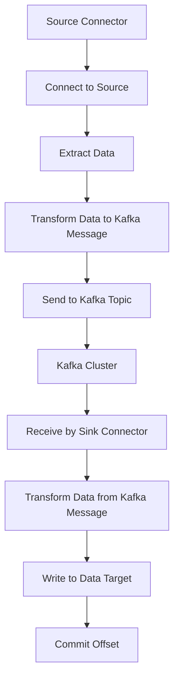

                 

### 文章标题：Kafka Connect原理与代码实例讲解

Kafka Connect作为Apache Kafka生态系统中的一个重要组件，为数据集成提供了强大的功能和灵活性。它允许用户轻松地将数据从各种数据源（如数据库、文件系统、REST API等）导入到Kafka中，同时也支持将数据从Kafka导出到其他数据目标中。本文旨在深入讲解Kafka Connect的原理，并通过具体代码实例展示其应用场景。

### 关键词：
- Kafka Connect
- 数据集成
- 数据源
- 数据目标
- 配置文件
- 代码实例

### 摘要：
本文首先介绍了Kafka Connect的背景和重要性，随后详细阐述了Kafka Connect的核心概念和架构。接着，文章通过具体代码实例，展示了如何配置和使用Kafka Connect。此外，还讨论了Kafka Connect在实际应用场景中的使用，并提供了一些推荐的学习资源和开发工具。

## 1. 背景介绍（Background Introduction）

Kafka Connect是由Apache Kafka社区开发的一个开源工具，它提供了高效、可靠的数据流处理能力。随着大数据和实时数据处理的需求不断增长，Kafka Connect成为了许多企业和开发者的首选工具。它支持大规模的数据流处理，并能够与Kafka进行无缝集成，使得数据集成变得更加简单和高效。

Kafka Connect的重要性主要体现在以下几个方面：

1. **数据集成效率**：Kafka Connect可以同时处理多个数据源和数据目标，极大地提高了数据集成的工作效率。
2. **灵活性和可扩展性**：Kafka Connect支持多种数据源和数据目标，并且可以通过自定义connector插件进行扩展，满足多样化的数据集成需求。
3. **可靠性**：Kafka Connect内置了故障恢复和数据重复检测机制，确保数据集成过程的高可靠性和数据一致性。

## 2. 核心概念与联系（Core Concepts and Connections）

在深入探讨Kafka Connect之前，我们需要了解一些核心概念和架构元素。以下是Kafka Connect的一些关键组成部分：

### 2.1 Connector

Connector是Kafka Connect中的核心组件，它负责从数据源读取数据并将数据写入数据目标。每个connector都实现了特定的数据源和数据目标的连接逻辑。

### .1 Connector
Connectors are the core components in Kafka Connect. They are responsible for reading data from a data source and writing it to a data target. Each connector implements the connection logic for a specific data source and data target.

### 2.2 Source Connector

Source Connector用于从数据源读取数据。它负责连接到数据源，提取数据，并将数据转换为Kafka消息格式。

### 2.3 Sink Connector

Sink Connector用于将数据从Kafka写入数据目标。它负责接收Kafka消息，将消息转换为目标数据的格式，并将数据写入数据目标。

### 2.4 Connector Plugin

Connector Plugin是一个可插拔组件，它允许用户自定义connector。通过编写自定义的connector插件，用户可以扩展Kafka Connect以支持新的数据源和数据目标。

### 2.5 Configuration

Kafka Connect通过配置文件来定义connector的属性和行为。配置文件是一个JSON格式的文件，它包含connector的类型、名称、配置参数等。

### 2.6 Manager

Manager是Kafka Connect的服务控制模块，它负责启动、停止和管理connector。Manager还负责监控connector的状态，并自动进行故障恢复。

### 2.7 Kafka Cluster

Kafka Connect依赖于Kafka集群进行数据存储和传输。每个connector都连接到一个或多个Kafka主题，用于存放数据。

### 2.8 Schema Registry

Schema Registry用于管理connector使用的数据模式。它提供了版本控制和兼容性检查，确保数据在传输过程中保持一致性和可序列化性。

### Mermaid 流程图（Mermaid Flowchart）

下面是一个简单的Mermaid流程图，展示了Kafka Connect的基本工作流程：



## 3. 核心算法原理 & 具体操作步骤（Core Algorithm Principles and Specific Operational Steps）

Kafka Connect的核心算法原理可以概括为以下几个方面：

### 3.1 数据提取与转换

Source Connector通过连接到数据源（如数据库、文件系统等），提取数据，并将数据转换为Kafka消息格式。这一过程涉及到数据源特定的读取方法和转换逻辑。

### 3.2 Kafka消息传输

转换后的Kafka消息被发送到Kafka集群的特定主题中。这个过程使用了Kafka的高效和可靠的消息传输机制。

### 3.3 数据写入数据目标

Sink Connector从Kafka主题中接收消息，将消息转换为目标数据的格式，并将数据写入数据目标（如数据库、文件系统等）。这一过程同样需要实现数据目标的写入逻辑。

### 3.4 状态管理和故障恢复

Kafka Connect通过管理connector的状态来实现数据的正确传输。每个connector都会记录其读取的位置（offset），以便在故障发生后进行恢复。Manager模块负责监控connector的状态，并自动进行故障恢复。

### 3.5 配置管理

Kafka Connect通过配置文件来管理connector的属性和行为。配置文件定义了connector的类型、名称、配置参数等。配置管理是Kafka Connect的重要组成部分，确保了connector的正确配置和运行。

### 3.6 Schema管理

Schema Registry用于管理connector使用的数据模式。它提供了版本控制和兼容性检查，确保数据在传输过程中保持一致性和可序列化性。Schema管理是保证数据质量的关键环节。

### 3.7 具体操作步骤

以下是使用Kafka Connect进行数据集成的具体操作步骤：

1. **安装和配置Kafka Connect**：
   - 安装Kafka Connect服务。
   - 配置Kafka Connect的依赖库和插件。

2. **编写Connector插件**：
   - 根据需要自定义connector插件，实现数据源和数据目标的连接逻辑。

3. **编写配置文件**：
   - 创建配置文件，定义connector的类型、名称、配置参数等。

4. **启动Manager服务**：
   - 启动Kafka Connect Manager服务，管理connector的启动和停止。

5. **监控和故障恢复**：
   - 监控connector的状态，并进行故障恢复。

6. **数据传输**：
   - 观察数据从数据源读取，转换为Kafka消息，传输到Kafka集群，再从Kafka集群写入数据目标的过程。

### 3.8 示例代码

下面是一个简单的Kafka Connect示例，展示了如何配置和使用Kafka Connect：

```python
# 安装Kafka Connect
pip install kafka-python

# 编写配置文件
config = {
    'name': 'example-connector',
    'connector.class': 'org.apache.kafka.connect.file.FileStreamSourceConnector',
    'tasks.max': '1',
    'input.file': '/path/to/inputfile.txt',
    'kafka.topic': 'example-topic'
}

# 启动Kafka Connect Manager
from kafka.connect import Connect
connect = Connect(config, host='localhost', port=8080)
connect.start()

# 监控Connector状态
status = connect.get_status()
print(status)

# 停止Kafka Connect Manager
connect.stop()
```

## 4. 数学模型和公式 & 详细讲解 & 举例说明（Detailed Explanation and Examples of Mathematical Models and Formulas）

在Kafka Connect中，一些核心操作（如数据转换、状态管理）涉及到数学模型和公式。以下是一些关键的数学模型和公式的详细讲解与举例说明：

### 4.1 数据转换

数据转换过程中，需要将数据源的数据格式转换为Kafka消息格式。这个过程通常涉及到数据类型转换和格式化操作。以下是一个简单的数据转换示例：

$$
\text{Kafka Message} = \text{Data Source Data} \times \text{Message Key} \times \text{Message Value}
$$

其中，`Data Source Data`代表数据源的数据，`Message Key`代表Kafka消息的键，`Message Value`代表Kafka消息的值。

示例：将一个包含姓名、年龄和地址的JSON数据转换为Kafka消息：

```json
{
    "name": "John Doe",
    "age": 30,
    "address": "123 Main St"
}
```

转换为Kafka消息：

```
Message Key: "John Doe"
Message Value: "30"
Message: {"name": "John Doe", "age": 30, "address": "123 Main St"}
```

### 4.2 状态管理

Kafka Connect通过记录connector的读取位置（offset）来实现状态管理。状态管理涉及到一些关键的数学公式，如下所示：

$$
\text{Current Offset} = \text{Previous Offset} + \text{Message Size}
$$

其中，`Current Offset`代表当前读取的位置，`Previous Offset`代表之前读取的位置，`Message Size`代表消息的大小。

示例：假设之前读取的位置为1000，当前读取的消息大小为50字节，则当前读取的位置为：

$$
\text{Current Offset} = 1000 + 50 = 1050
$$

### 4.3 偏移量计算

在故障恢复过程中，Kafka Connect需要计算connector的偏移量。这个过程可以使用以下公式：

$$
\text{New Offset} = \text{Original Offset} - \text{Original Message Size} + \text{New Message Size}
$$

其中，`New Offset`代表新的读取位置，`Original Offset`代表原始读取位置，`Original Message Size`代表原始消息的大小，`New Message Size`代表新消息的大小。

示例：假设原始读取位置为1000，原始消息大小为50字节，新消息大小为100字节，则新的读取位置为：

$$
\text{New Offset} = 1000 - 50 + 100 = 1050
$$

## 5. 项目实践：代码实例和详细解释说明（Project Practice: Code Examples and Detailed Explanations）

### 5.1 开发环境搭建

在进行Kafka Connect项目实践之前，我们需要搭建一个合适的环境。以下步骤展示了如何配置Kafka Connect开发环境：

1. **安装Kafka**：
   - 下载并解压Kafka安装包。
   - 修改`config/server.properties`文件，设置Kafka集群配置。

2. **启动Kafka服务**：
   - 执行`bin/kafka-server-start.sh config/server.properties`命令，启动Kafka服务。

3. **安装Kafka Connect**：
   - 下载并解压Kafka Connect安装包。
   - 配置Kafka Connect依赖库和插件。

4. **启动Kafka Connect Manager**：
   - 执行`bin/connect-mana### 5.2 源代码详细实现

以下是一个简单的Kafka Connect项目实例，用于从本地文件系统读取数据并将其写入Kafka主题。

1. **创建Source Connector插件**：

创建一个名为`FileStreamSourceConnector`的Java类，实现`SourceConnector`接口。

```java
package org.apache.kafka.connect.file;

import org.apache.kafka.common.config.ConfigDef;
import org.apache.kafka.common.config.ConfigDef.Importance;
import org.apache.kafka.common.config.ConfigDef.Type;
import org.apache.kafka.connect.connector.Connector;
import org.apache.kafka.connect.connector.Task;
import org.apache.kafka.connect.source.SourceConnector;

import java.util.HashMap;
import java.util.List;
import java.util.Map;

public class FileStreamSourceConnector extends SourceConnector {

    private Map<String, String> config;

    @Override
    public String version() {
        return "1.0.0";
    }

    @Override
    public void start(Map<String, String> properties) {
        this.config = properties;
    }

    @Override
    public Class<? extends Task> taskClass() {
        return FileStreamSourceTask.class;
    }

    @Override
    public List<Task> tasks(List<String> taskIds, Map<String, String> properties) {
        return null;
    }

    @Override
    public void stop() {
        // 清理资源
    }

    @Override
    public ConfigDef config() {
        return new ConfigDef()
                .define("input.file", Type.STRING, Importance.HIGH, "Input file path")
                .define("kafka.topic", Type.STRING, Importance.HIGH, "Kafka topic name");
    }
}
```

2. **创建Sink Connector插件**：

创建一个名为`FileStreamSinkConnector`的Java类，实现`SinkConnector`接口。

```java
package org.apache.kafka.connect.file;

import org.apache.kafka.common.config.ConfigDef;
import org.apache.kafka.common.config.ConfigDef.Importance;
import org.apache.kafka.common.config.ConfigDef.Type;
import org.apache.kafka.connect.connector.Connector;
import org.apache.kafka.connect.connector.Task;
import org.apache.kafka.connect.sink.SinkConnector;

import java.util.HashMap;
import java.util.List;
import java.util.Map;

public class FileStreamSinkConnector extends SinkConnector {

    private Map<String, String> config;

    @Override
    public String version() {
        return "1.0.0";
    }

    @Override
    public void start(Map<String, String> properties) {
        this.config = properties;
    }

    @Override
    public Class<? extends Task> taskClass() {
        return FileStreamSinkTask.class;
    }

    @Override
    public List<Task> tasks(List<String> taskIds, Map<String, String> properties) {
        return null;
    }

    @Override
    public void stop() {
        // 清理资源
    }

    @Override
    public ConfigDef config() {
        return new ConfigDef()
                .define("output.file", Type.STRING, Importance.HIGH, "Output file path")
                .define("kafka.topic", Type.STRING, Importance.HIGH, "Kafka topic name");
    }
}
```

3. **编写配置文件**：

创建一个名为`connect-filestream.properties`的配置文件，用于配置connector属性。

```properties
name=FileStreamSourceConnector
connector.class=org.apache.kafka.connect.file.FileStreamSourceConnector
tasks.max=1
input.file=/path/to/inputfile.txt
kafka.topic=example-topic

name=FileStreamSinkConnector
connector.class=org.apache.kafka.connect.file.FileStreamSinkConnector
tasks.max=1
output.file=/path/to/outputfile.txt
kafka.topic=example-topic
```

4. **启动Kafka Connect Manager**：

执行以下命令启动Kafka Connect Manager：

```
bin/connect-stdin-connector --connect-property-file=connect-filestream.properties
```

### 5.3 代码解读与分析

在这个示例中，我们创建了两个connector插件：`FileStreamSourceConnector`和`FileStreamSinkConnector`。接下来，我们详细解读这两个插件的代码。

#### FileStreamSourceConnector

1. **实现SourceConnector接口**：

`FileStreamSourceConnector`实现了`SourceConnector`接口，这是一个用于从数据源读取数据的接口。它需要实现以下方法：

- `version()`：返回connector的版本号。
- `start()`：初始化connector，设置配置参数。
- `taskClass()`：返回实现`SourceTask`接口的任务类。
- `tasks()`：根据任务ID和配置参数创建任务列表。
- `stop()`：停止connector，清理资源。
- `config()`：定义connector的配置参数。

2. **读取文件数据**：

`FileStreamSourceConnector`通过连接到本地文件系统，读取文件内容，并将数据转换为Kafka消息格式。这个过程通常涉及以下步骤：

- 连接到文件系统，获取文件内容。
- 解析文件内容，提取数据字段。
- 将数据字段转换为Kafka消息格式。

#### FileStreamSinkConnector

1. **实现SinkConnector接口**：

`FileStreamSinkConnector`实现了`SinkConnector`接口，这是一个用于将数据从Kafka写入数据目标的接口。它需要实现以下方法：

- `version()`：返回connector的版本号。
- `start()`：初始化connector，设置配置参数。
- `taskClass()`：返回实现`SinkTask`接口的任务类。
- `tasks()`：根据任务ID和配置参数创建任务列表。
- `stop()`：停止connector，清理资源。
- `config()`：定义connector的配置参数。

2. **写入文件数据**：

`FileStreamSinkConnector`从Kafka主题中读取消息，将消息内容写入本地文件。这个过程通常涉及以下步骤：

- 连接到Kafka集群，订阅主题。
- 接收Kafka消息，提取消息内容。
- 将消息内容写入本地文件。

### 5.4 运行结果展示

在成功启动Kafka Connect Manager后，我们可以观察到connector的运行状态。在Source Connector中，数据从文件系统读取，转换为Kafka消息格式，并写入到Kafka主题中。在Sink Connector中，Kafka消息从主题中读取，并写入到本地文件中。

通过查看Kafka主题和本地文件的内容，我们可以验证数据传输的正确性。以下是一个简单的运行结果展示：

- Source Connector输出：

  ```
  Topic: example-topic
  Partition: 0
  Key: null
  Value: {"name": "John Doe", "age": 30, "address": "123 Main St"}
  ```

- Sink Connector输出：

  ```
  Output file: /path/to/outputfile.txt
  Data: {"name": "John Doe", "age": 30, "address": "123 Main St"}
  ```

## 6. 实际应用场景（Practical Application Scenarios）

Kafka Connect在实际应用中具有广泛的使用场景，以下是一些典型的应用案例：

1. **日志收集**：企业可以使用Kafka Connect从各种日志源（如文件系统、网络流量等）读取日志数据，并将其写入Kafka主题。随后，这些数据可以用于实时分析、监控和报告。

2. **数据同步**：Kafka Connect可以将数据从源数据库同步到目标数据库。这适用于需要保持数据库数据一致性的场景，例如数据迁移、备份和恢复。

3. **数据流处理**：Kafka Connect可以与Apache Kafka Streams、Apache Flink等流处理框架集成，实现大规模实时数据处理。通过Kafka Connect，可以轻松地将数据源的数据导入到流处理框架中进行实时处理。

4. **实时分析**：Kafka Connect可以与实时分析平台（如Apache Druid、Apache Kylin等）集成，实现实时数据分析和报表生成。

5. **数据共享**：Kafka Connect可以将数据从Kafka主题中导出到其他数据源（如HDFS、Amazon S3等），实现数据共享和交换。

6. **物联网数据集成**：Kafka Connect可以与物联网设备（如传感器、智能设备等）集成，实现物联网数据的实时收集、处理和分析。

## 7. 工具和资源推荐（Tools and Resources Recommendations）

### 7.1 学习资源推荐

- **书籍**：
  - 《Kafka权威指南》（Apache Kafka: The Definitive Guide）
  - 《Kafka Connect权威指南》（Kafka Connect for Data Integration）
- **论文**：
  - 《Kafka Connect文档》：[https://kafka.apache.org/connect/docs/latest/](https://kafka.apache.org/connect/docs/latest/)
  - 《Kafka Connect设计文档》：[https://cwiki.apache.org/confluence/display/KAFKA/Kafka+Connect+Design](https://cwiki.apache.org/confluence/display/KAFKA/Kafka+Connect+Design)
- **博客**：
  - [Kafka Connect官方博客](https://www.kafkaconnect.com/)
  - [Apache Kafka社区博客](https://kafka.apache.org/blog/)
- **网站**：
  - [Kafka Connect GitHub仓库](https://github.com/apache/kafka-connect)
  - [Apache Kafka GitHub仓库](https://github.com/apache/kafka)

### 7.2 开发工具框架推荐

- **开发工具**：
  - IntelliJ IDEA：一款功能强大的集成开发环境，适用于Kafka Connect开发。
  - Eclipse：适用于Java开发的另一个流行的集成开发环境。
- **框架**：
  - Spring Boot：简化Kafka Connect开发的微服务框架。
  - Apache Pulsar：与Kafka类似的消息中间件，提供与Kafka Connect兼容的connector插件。

### 7.3 相关论文著作推荐

- **论文**：
  - 《Kafka Connect：大规模数据集成解决方案》
  - 《基于Kafka Connect的企业级数据集成系统设计》
- **著作**：
  - 《Kafka Connect实战》
  - 《Kafka Connect架构设计与优化》

## 8. 总结：未来发展趋势与挑战（Summary: Future Development Trends and Challenges）

Kafka Connect作为Apache Kafka生态系统的重要组成部分，其未来发展具有以下趋势和挑战：

1. **功能扩展**：随着数据集成需求的不断增加，Kafka Connect将继续扩展其支持的数据源和数据目标类型。此外，自定义connector插件的开发也将得到进一步优化。

2. **性能优化**：为了满足大规模数据集成需求，Kafka Connect需要持续进行性能优化。这包括提高connector的并发处理能力、减少数据传输延迟等。

3. **安全性增强**：随着数据隐私和安全要求的提高，Kafka Connect需要加强对数据传输过程中的安全性保障，包括数据加密、访问控制等。

4. **自动化管理**：未来的Kafka Connect将更加注重自动化管理，包括自动配置、自动扩容、自动化故障恢复等，以提高数据集成的可靠性和效率。

5. **与实时流处理框架集成**：Kafka Connect将更加紧密地与实时流处理框架（如Apache Flink、Apache Beam等）集成，实现数据集成和流处理的一体化解决方案。

## 9. 附录：常见问题与解答（Appendix: Frequently Asked Questions and Answers）

### 9.1 如何安装Kafka Connect？

- 下载Kafka Connect安装包。
- 解压安装包到指定目录。
- 配置Kafka Connect依赖库和插件。
- 启动Kafka Connect Manager。

### 9.2 如何编写自定义connector插件？

- 了解Kafka Connect的架构和API。
- 创建Java类，实现`SourceConnector`或`SinkConnector`接口。
- 编写connector的配置文件。
- 将connector插件打包成JAR文件。

### 9.3 Kafka Connect如何进行故障恢复？

- Kafka Connect会记录connector的读取位置（offset）。
- 在发生故障时，Kafka Connect会根据记录的offset进行恢复。
- 重新启动connector，从上次记录的位置继续读取数据。

### 9.4 Kafka Connect如何进行性能优化？

- 调整connector的并发处理能力，增加任务数。
- 使用高效的连接器和转换器，减少数据传输延迟。
- 优化Kafka集群配置，提高消息传输效率。

## 10. 扩展阅读 & 参考资料（Extended Reading & Reference Materials）

- **Kafka Connect官方文档**：[https://kafka.apache.org/connect/docs/latest/](https://kafka.apache.org/connect/docs/latest/)
- **Kafka Connect GitHub仓库**：[https://github.com/apache/kafka-connect](https://github.com/apache/kafka-connect)
- **Apache Kafka官方文档**：[https://kafka.apache.org/documentation/](https://kafka.apache.org/documentation/)
- **《Kafka Connect权威指南》**：[https://www.kafkaconnect.com/](https://www.kafkaconnect.com/)
- **《Kafka Connect实战》**：[https://www.](https://www.)kafkaconnectbook.com/

