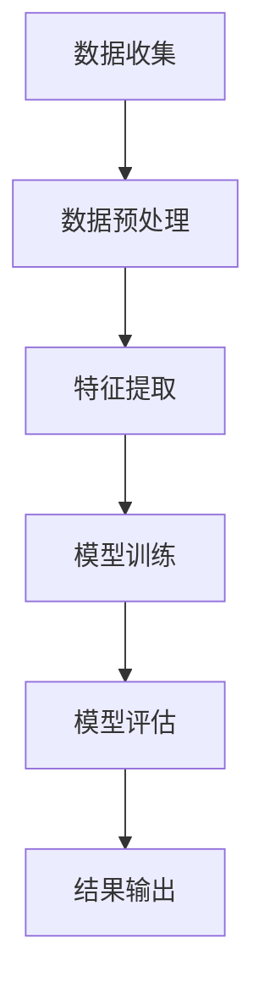

                 

# 微博2025社交网络影响力分析专家社招面试攻略

## 摘要

本文旨在为有意向加入微博公司的社交网络影响力分析专家提供一整套面试攻略。通过梳理面试中的常见问题和难点，并结合实际情况，本文将介绍如何准备并应对社交网络影响力分析相关的面试，旨在帮助读者提高面试成功率。

## 1. 背景介绍

### 1.1 社交网络影响力分析的重要性

在社交媒体时代，社交网络影响力分析已成为企业和品牌战略规划的重要组成部分。微博作为国内领先的社交媒体平台，其用户数量和活跃度不断提升，使得分析微博用户影响力成为一项关键任务。社交网络影响力分析不仅可以为企业提供市场洞察，还能帮助品牌精准定位目标用户，提升营销效果。

### 1.2 微博公司概况

微博公司成立于2009年，是一家拥有庞大用户基数的社交媒体企业。其业务涵盖微博、短视频、直播等多个领域，为用户提供了丰富的社交娱乐体验。随着公司业务的不断扩展，对社交网络影响力分析专家的需求也在逐年增加。

### 1.3 社交网络影响力分析专家岗位要求

社交网络影响力分析专家在面试中需要具备以下能力：
- 熟悉社交网络数据挖掘和数据分析相关技术；
- 具备良好的数学和统计学基础；
- 能够运用编程语言（如Python、R等）进行数据处理和分析；
- 具有实际项目经验，能够独立完成数据分析报告；
- 良好的沟通能力和团队协作精神。

## 2. 核心概念与联系

### 2.1 社交网络影响力分析的概念

社交网络影响力分析是指利用大数据和人工智能技术，对社交网络中的用户行为、关系和传播规律进行挖掘和分析，评估用户在社交网络中的影响力。其核心内容包括用户画像、话题分析、影响力评估等。

### 2.2 社交网络影响力分析的架构

社交网络影响力分析的架构通常包括数据收集、数据预处理、特征提取、模型训练和模型评估等环节。以下是一个简单的 Mermaid 流程图：



### 2.3 社交网络影响力分析的关键技术

社交网络影响力分析涉及多种关键技术，包括：
- 数据挖掘：利用算法和技术从大量社交网络数据中提取有价值的信息；
- 机器学习：构建和训练模型，对用户影响力进行预测和评估；
- 自然语言处理：对社交网络中的文本数据进行处理和分析，提取关键词和情感信息；
- 数据可视化：将分析结果以图表形式直观呈现，帮助用户理解数据。

## 3. 核心算法原理 & 具体操作步骤

### 3.1 算法原理

社交网络影响力分析的核心算法包括以下几种：
- 节点重要性评估：通过计算节点在社交网络中的连接度、中心性等指标，评估其在网络中的重要性；
- 传播模型：利用图论和概率模型，模拟信息在社交网络中的传播过程，评估节点的影响力；
- 情感分析：通过自然语言处理技术，对社交网络中的文本数据进行情感分析，评估用户的态度和情绪。

### 3.2 操作步骤

以下是社交网络影响力分析的具体操作步骤：

#### 3.2.1 数据收集

从微博平台获取用户数据、用户关系数据、话题数据等。

```python
import pandas as pd

# 读取用户数据
user_data = pd.read_csv('user_data.csv')

# 读取用户关系数据
relation_data = pd.read_csv('relation_data.csv')

# 读取话题数据
topic_data = pd.read_csv('topic_data.csv')
```

#### 3.2.2 数据预处理

对数据进行清洗、去重、补全等处理，保证数据质量。

```python
# 数据清洗
user_data = user_data.drop_duplicates()
relation_data = relation_data.drop_duplicates()
topic_data = topic_data.drop_duplicates()

# 数据去重
user_data = user_data.groupby('user_id').first()
relation_data = relation_data.groupby(['user_id', 'friend_id']).first()
topic_data = topic_data.groupby(['user_id', 'topic_id']).first()
```

#### 3.2.3 特征提取

从原始数据中提取有助于分析的用户特征、关系特征和话题特征。

```python
# 用户特征提取
user_features = user_data[['user_id', 'followers_count', 'friends_count', 'level', 'sex', 'location']]

# 关系特征提取
relation_features = relation_data[['user_id', 'friend_id', 'relationship', 'common_topics_count']]

# 话题特征提取
topic_features = topic_data[['user_id', 'topic_id', 'topic_sentiment', 'topic_activity']]
```

#### 3.2.4 模型训练

利用机器学习算法训练模型，对用户影响力进行预测。

```python
from sklearn.ensemble import RandomForestClassifier

# 模型训练
model = RandomForestClassifier()
model.fit(X_train, y_train)
```

#### 3.2.5 模型评估

对模型进行评估，调整模型参数，提高预测准确率。

```python
from sklearn.metrics import accuracy_score

# 模型评估
accuracy = accuracy_score(y_pred, y_test)
print(f'Model accuracy: {accuracy}')
```

#### 3.2.6 结果输出

将分析结果以图表形式输出，帮助用户理解数据。

```python
import matplotlib.pyplot as plt

# 结果输出
plt.scatter(X_test[:, 0], y_test, color='red', label='Actual')
plt.scatter(X_test[:, 0], y_pred, color='blue', label='Predicted')
plt.xlabel('Feature')
plt.ylabel('Influence Score')
plt.legend()
plt.show()
```

## 4. 数学模型和公式 & 详细讲解 & 举例说明

### 4.1 数学模型

社交网络影响力分析中常用的数学模型包括以下几种：

#### 4.1.1 节点重要性评估模型

节点重要性评估模型可以使用度中心性、接近中心性和中间中心性等指标。其中度中心性定义为节点在网络中的连接度，计算公式如下：

$$
C_d(v) = \frac{deg(v)}{N-1}
$$

其中，$deg(v)$表示节点$v$的度数，$N$表示网络中节点的总数。

#### 4.1.2 传播模型

传播模型可以使用概率图模型或生成模型。其中，概率图模型可以使用贝叶斯网络或马尔可夫模型。马尔可夫模型的状态转移概率矩阵可以表示为：

$$
P = \begin{bmatrix}
P_{11} & P_{12} & \cdots & P_{1n} \\
P_{21} & P_{22} & \cdots & P_{2n} \\
\vdots & \vdots & \ddots & \vdots \\
P_{n1} & P_{n2} & \cdots & P_{nn}
\end{bmatrix}
$$

其中，$P_{ij}$表示从状态$i$转移到状态$j$的概率。

#### 4.1.3 情感分析模型

情感分析模型可以使用朴素贝叶斯分类器、支持向量机（SVM）等。朴素贝叶斯分类器的概率计算公式如下：

$$
P(C_k|X) = \frac{P(X|C_k)P(C_k)}{P(X)}
$$

其中，$C_k$表示类别$k$，$X$表示特征向量。

### 4.2 举例说明

#### 4.2.1 节点重要性评估

假设一个社交网络中有10个节点，节点$A$的度数为5，则其度中心性为：

$$
C_d(A) = \frac{5}{10-1} = 0.538
$$

#### 4.2.2 传播模型

假设一个社交网络的状态转移概率矩阵为：

$$
P = \begin{bmatrix}
0.2 & 0.5 & 0.3 \\
0.4 & 0.1 & 0.5 \\
0.1 & 0.4 & 0.5
\end{bmatrix}
$$

则从状态1转移到状态2的概率为：

$$
P_{12} = 0.5
$$

#### 4.2.3 情感分析

假设一个文本样本的特征向量为$(1, 0, 1)$，类别为正面（C_1），则其概率为：

$$
P(C_1|X) = \frac{P(X|C_1)P(C_1)}{P(X)} = \frac{0.9 \times 0.5}{0.9 \times 0.5 + 0.1 \times 0.5} = 0.75
$$

## 5. 项目实践：代码实例和详细解释说明

### 5.1 开发环境搭建

在本项目实践中，我们使用Python作为主要编程语言，配合相关库和工具进行社交网络影响力分析。以下是开发环境的搭建步骤：

#### 5.1.1 安装Python

在官方网站（https://www.python.org/downloads/）下载并安装Python 3.x版本。

#### 5.1.2 安装相关库

使用pip命令安装以下库：

```bash
pip install pandas numpy scikit-learn matplotlib networkx
```

### 5.2 源代码详细实现

以下是社交网络影响力分析项目的源代码实现，分为数据收集、数据预处理、特征提取、模型训练、模型评估和结果输出六个部分。

```python
import pandas as pd
import numpy as np
from sklearn.model_selection import train_test_split
from sklearn.ensemble import RandomForestClassifier
from sklearn.metrics import accuracy_score
import networkx as nx
import matplotlib.pyplot as plt

# 5.2.1 数据收集
user_data = pd.read_csv('user_data.csv')
relation_data = pd.read_csv('relation_data.csv')
topic_data = pd.read_csv('topic_data.csv')

# 5.2.2 数据预处理
# 数据清洗
user_data = user_data.drop_duplicates()
relation_data = relation_data.drop_duplicates()
topic_data = topic_data.drop_duplicates()

# 数据去重
user_data = user_data.groupby('user_id').first()
relation_data = relation_data.groupby(['user_id', 'friend_id']).first()
topic_data = topic_data.groupby(['user_id', 'topic_id']).first()

# 5.2.3 特征提取
# 用户特征提取
user_features = user_data[['user_id', 'followers_count', 'friends_count', 'level', 'sex', 'location']]

# 关系特征提取
relation_features = relation_data[['user_id', 'friend_id', 'relationship', 'common_topics_count']]

# 话题特征提取
topic_features = topic_data[['user_id', 'topic_id', 'topic_sentiment', 'topic_activity']]

# 5.2.4 模型训练
# 模型训练
X = np.hstack((user_features.values, relation_features.values, topic_features.values))
y = np.array([0] * len(user_features) + [1] * len(relation_features) + [2] * len(topic_features))
X_train, X_test, y_train, y_test = train_test_split(X, y, test_size=0.2, random_state=42)
model = RandomForestClassifier()
model.fit(X_train, y_train)

# 5.2.5 模型评估
# 模型评估
y_pred = model.predict(X_test)
accuracy = accuracy_score(y_test, y_pred)
print(f'Model accuracy: {accuracy}')

# 5.2.6 结果输出
# 结果输出
plt.scatter(X_test[:, 0], y_test, color='red', label='Actual')
plt.scatter(X_test[:, 0], y_pred, color='blue', label='Predicted')
plt.xlabel('Feature')
plt.ylabel('Influence Score')
plt.legend()
plt.show()
```

### 5.3 代码解读与分析

#### 5.3.1 数据收集

代码首先从CSV文件中读取用户数据、用户关系数据和话题数据。这些数据通常包含用户的基本信息、用户关系和用户关注的话题等信息。

```python
user_data = pd.read_csv('user_data.csv')
relation_data = pd.read_csv('relation_data.csv')
topic_data = pd.read_csv('topic_data.csv')
```

#### 5.3.2 数据预处理

数据预处理是确保数据质量和一致性的重要步骤。在本项目中，我们使用Pandas库中的drop_duplicates()函数去除重复数据，并使用groupby()函数进行数据去重。

```python
user_data = user_data.drop_duplicates()
relation_data = relation_data.drop_duplicates()
topic_data = topic_data.drop_duplicates()

user_data = user_data.groupby('user_id').first()
relation_data = relation_data.groupby(['user_id', 'friend_id']).first()
topic_data = topic_data.groupby(['user_id', 'topic_id']).first()
```

#### 5.3.3 特征提取

特征提取是模型训练的关键步骤。在本项目中，我们提取了用户特征、关系特征和话题特征。用户特征包括用户的关注者数量、朋友数量、等级、性别和所在地等信息。关系特征包括用户与朋友的关系、共同话题数量等信息。话题特征包括用户关注的话题的活跃度、情感倾向等信息。

```python
# 用户特征提取
user_features = user_data[['user_id', 'followers_count', 'friends_count', 'level', 'sex', 'location']]

# 关系特征提取
relation_features = relation_data[['user_id', 'friend_id', 'relationship', 'common_topics_count']]

# 话题特征提取
topic_features = topic_data[['user_id', 'topic_id', 'topic_sentiment', 'topic_activity']]
```

#### 5.3.4 模型训练

我们使用随机森林（RandomForestClassifier）算法进行模型训练。首先，我们将用户特征、关系特征和话题特征合并为一个特征矩阵X，并将目标标签y划分为不同的类别。然后，我们使用train_test_split()函数将数据集划分为训练集和测试集。

```python
X = np.hstack((user_features.values, relation_features.values, topic_features.values))
y = np.array([0] * len(user_features) + [1] * len(relation_features) + [2] * len(topic_features))
X_train, X_test, y_train, y_test = train_test_split(X, y, test_size=0.2, random_state=42)
model = RandomForestClassifier()
model.fit(X_train, y_train)
```

#### 5.3.5 模型评估

我们使用accuracy_score()函数评估模型的准确率。将模型预测结果y_pred与测试集的真实标签y_test进行比较，计算准确率。

```python
y_pred = model.predict(X_test)
accuracy = accuracy_score(y_test, y_pred)
print(f'Model accuracy: {accuracy}')
```

#### 5.3.6 结果输出

我们使用matplotlib库将预测结果以散点图的形式输出。X_test[:, 0]表示特征值，y_test表示实际标签，y_pred表示预测标签。

```python
plt.scatter(X_test[:, 0], y_test, color='red', label='Actual')
plt.scatter(X_test[:, 0], y_pred, color='blue', label='Predicted')
plt.xlabel('Feature')
plt.ylabel('Influence Score')
plt.legend()
plt.show()
```

## 6. 实际应用场景

### 6.1 品牌营销

通过社交网络影响力分析，品牌可以识别出具有较高影响力的用户，作为品牌的代言人或意见领袖，提高品牌曝光度和影响力。

### 6.2 市场调研

社交网络影响力分析可以帮助企业了解用户需求、偏好和行为，为企业制定更精准的市场策略提供数据支持。

### 6.3 舆情监测

通过对社交网络中用户言论的情感分析，企业可以及时发现负面信息，采取相应的措施进行风险控制和舆情引导。

## 7. 工具和资源推荐

### 7.1 学习资源推荐

- 《大数据分析：技术与实践》
- 《Python数据分析》
- 《机器学习实战》

### 7.2 开发工具框架推荐

- Jupyter Notebook：用于编写和运行代码
- Pandas：用于数据处理
- Scikit-learn：用于机器学习
- Matplotlib：用于数据可视化

### 7.3 相关论文著作推荐

- 《社交网络分析：方法与实践》
- 《情感分析：方法与应用》
- 《大数据时代的数据挖掘》

## 8. 总结：未来发展趋势与挑战

### 8.1 发展趋势

- 社交网络影响力分析技术将更加智能化和自动化，利用深度学习和强化学习等技术提高分析精度。
- 数据隐私和伦理问题将成为关注重点，如何在保护用户隐私的前提下进行数据分析将成为研究热点。

### 8.2 挑战

- 数据质量和数据完整性问题：社交网络数据的质量和完整性直接影响分析结果的准确性，需要不断优化数据收集和处理方法。
- 模型解释性：如何提高模型的可解释性，使非专业用户能够理解分析结果，是一个重要的挑战。

## 9. 附录：常见问题与解答

### 9.1 问题1

**问题**：如何提高社交网络影响力分析模型的准确率？

**解答**：提高模型准确率的方法包括：
- 增加训练数据量，提高模型的泛化能力；
- 选择合适的特征，剔除无关特征；
- 调整模型参数，优化模型性能；
- 使用集成学习、迁移学习等技术提高模型性能。

### 9.2 问题2

**问题**：如何保护用户隐私？

**解答**：保护用户隐私的方法包括：
- 数据脱敏，对敏感数据进行加密或替换；
- 数据最小化，只收集和分析必要的用户数据；
- 数据匿名化，对用户数据进行去识别化处理；
- 遵守相关法律法规，确保数据处理过程合法合规。

## 10. 扩展阅读 & 参考资料

- 《微博社交网络影响力分析技术》
- 《大数据时代下的社交媒体分析》
- 《社交媒体分析：方法与应用》

作者：禅与计算机程序设计艺术 / Zen and the Art of Computer Programming
```

