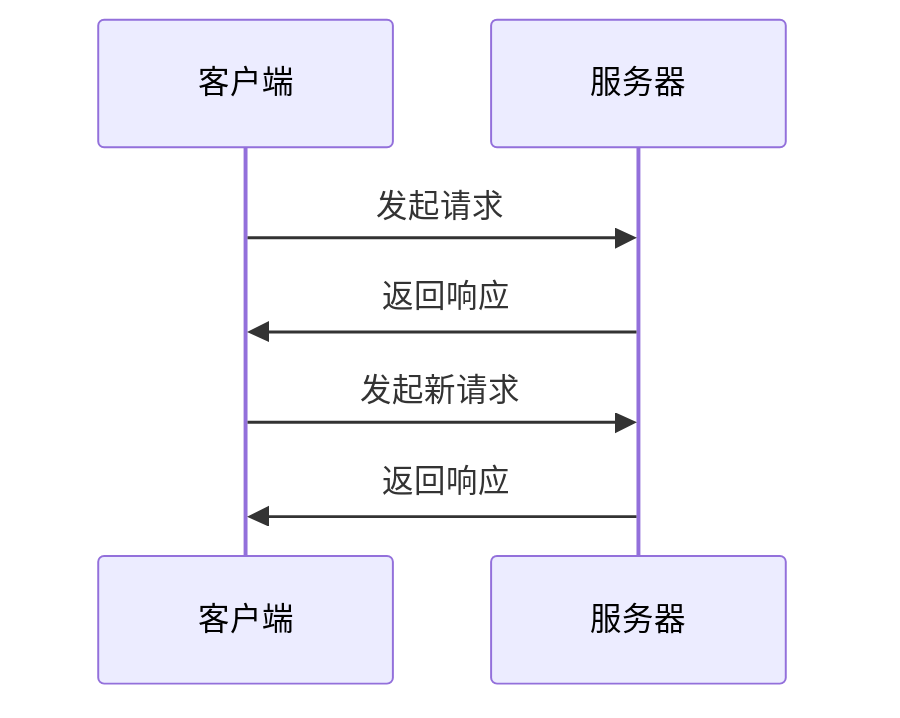
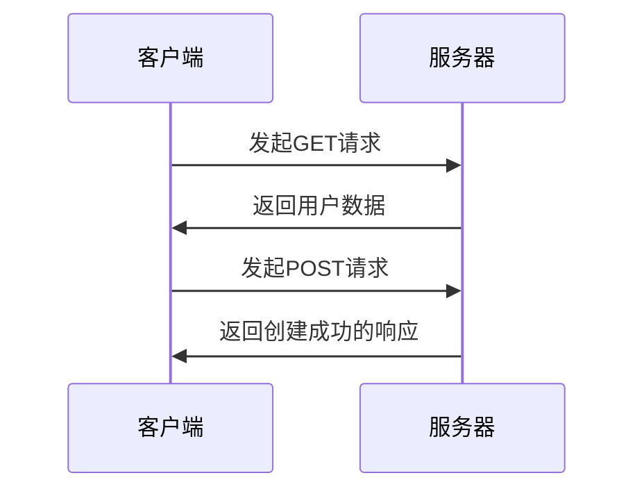
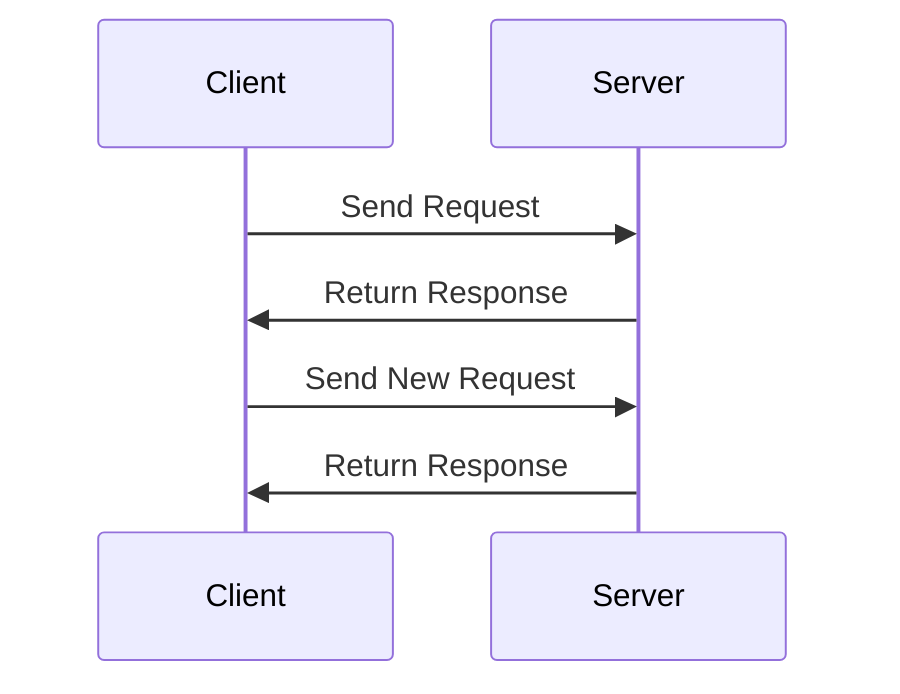
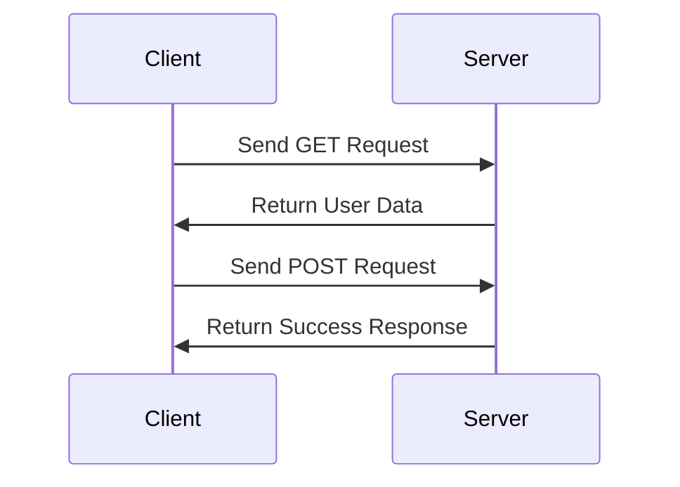

                 

# 文章标题

微服务通信：gRPC与RESTful API

> 关键词：微服务、通信协议、gRPC、RESTful API、性能优化、安全性、跨语言互操作性

> 摘要：本文将深入探讨微服务架构中的通信协议，重点比较gRPC与RESTful API。我们将分析这两种通信方式的原理、优缺点，并通过实际案例展示其应用场景。读者将了解如何根据业务需求选择合适的通信方式，以优化微服务架构的性能和安全性。

## 1. 背景介绍（Background Introduction）

随着软件系统的复杂性不断增加，传统的单体架构逐渐显示出其局限性。微服务架构作为一种新兴的架构风格，旨在通过将大型单体应用拆分为一系列松耦合的小服务，来提高系统的可维护性、扩展性和灵活性。在这种架构中，服务的通信机制至关重要。

微服务之间的通信通常采用两种主要的协议：gRPC和RESTful API。gRPC是一种基于HTTP/2的高性能远程过程调用（RPC）框架，而RESTful API则是基于HTTP的Representational State Transfer（REST）风格的应用编程接口。

本文旨在对比这两种通信协议，探讨其在性能、安全性、跨语言互操作性等方面的优缺点，并分析如何根据实际业务需求选择合适的通信方式。

## 2. 核心概念与联系（Core Concepts and Connections）

### 2.1 gRPC

gRPC是由Google开发的一种高性能、跨语言的RPC框架。它基于HTTP/2协议，提供了高效的二进制协议和自动序列化机制。gRPC的关键特性包括：

- **双向流**：允许客户端和服务器之间进行双向通信，提高了交互效率。
- **多语言支持**：支持多种编程语言，如Java、Python、Go、C++等。
- **自动序列化**：采用Protocol Buffers作为数据交换格式，提高了数据传输效率。
- **负载均衡和故障转移**：支持负载均衡和故障转移，提高了系统的可用性和稳定性。

### 2.2 RESTful API

RESTful API是基于HTTP协议的应用编程接口，采用Representational State Transfer（REST）架构风格。RESTful API的关键特性包括：

- **无状态性**：每个请求都是独立的，服务器不存储任何关于客户端的状态信息。
- **统一接口**：通过HTTP动词（GET、POST、PUT、DELETE等）和URL实现资源的操作。
- **可缓存性**：允许客户端缓存响应，提高访问速度和减少服务器负载。
- **跨语言支持**：基于文本的HTTP协议使得跨语言调用变得简单。

### 2.3 gRPC与RESTful API的联系与区别

虽然gRPC和RESTful API都是用于服务间通信的协议，但它们在设计理念、应用场景和性能特点上存在显著差异。

- **设计理念**：gRPC强调高性能和跨语言互操作性，而RESTful API强调可缓存性和灵活的接口设计。
- **应用场景**：gRPC适用于对性能要求较高、需要双向通信的场景，如实时数据流处理、分布式系统间的通信等；RESTful API则适用于对灵活性要求较高、需要广泛使用的场景，如Web服务、移动应用等。
- **性能特点**：gRPC通过二进制协议和自动序列化机制实现了更高的传输效率；RESTful API则通过文本协议和缓存机制提高了可扩展性和灵活性。

## 3. 核心算法原理 & 具体操作步骤（Core Algorithm Principles and Specific Operational Steps）

### 3.1 gRPC的工作原理

gRPC的工作原理主要包括以下步骤：

1. **服务定义**：使用Protocol Buffers定义服务接口和消息类型。
2. **生成代码**：使用Protocol Buffers编译器生成服务端和客户端的代码。
3. **服务端实现**：实现服务端逻辑，并使用gRPC服务器进行启动。
4. **客户端调用**：通过客户端代码发起远程过程调用。
5. **通信过程**：客户端和服务端通过HTTP/2协议进行通信，传输序列化的数据。

### 3.2 RESTful API的工作原理

RESTful API的工作原理主要包括以下步骤：

1. **资源定义**：定义API中可操作的资源及其属性。
2. **接口设计**：设计API的URL结构和HTTP动词（GET、POST、PUT、DELETE等）。
3. **服务端实现**：实现服务端逻辑，并使用Web服务器（如Nginx、Apache等）进行启动。
4. **客户端调用**：通过HTTP客户端发起HTTP请求。
5. **通信过程**：客户端和服务端通过HTTP协议进行通信，传输文本数据。

### 3.3 具体操作步骤

以一个简单的用户服务为例，展示gRPC和RESTful API的具体操作步骤：

#### gRPC操作步骤

1. **定义服务**：使用Protocol Buffers定义用户服务接口。
   ```protobuf
   syntax = "proto3";

   service UserService {
     rpc CreateUser (User) returns (User);
     rpc GetUser (UserId) returns (User);
     rpc UpdateUser (User) returns (User);
     rpc DeleteUser (UserId) returns (bool);
   }

   message User {
     string id = 1;
     string name = 2;
     int32 age = 3;
   }
   ```

2. **生成代码**：使用Protocol Buffers编译器生成服务端和客户端代码。

3. **服务端实现**：
   ```java
   import io.grpc.stub.StreamObserver;
   import com.example.user.proto.UserServiceGrpc;
   import com.example.user.proto.User;

   public class UserServiceImpl extends UserServiceGrpc.UserServiceImplBase {
       @Override
       public void createUser(User request, StreamObserver<User> responseObserver) {
           // 实现创建用户逻辑
           User user = ...;
           responseObserver.onNext(user);
           responseObserver.onCompleted();
       }

       // 其他服务方法的实现
   }
   ```

4. **客户端调用**：
   ```java
   import io.grpc.ManagedChannel;
   import io.grpc.ManagedChannelBuilder;
   import com.example.user.proto.User;
   import com.example.user.proto.UserServiceGrpc;

   public class UserServiceClient {
       private final UserServiceGrpc.UserServiceBlockingStub blockingStub;
       private final UserServiceGrpc.UserServiceStub asyncStub;

       public UserServiceClient(ManagedChannel channel) {
           blockingStub = UserServiceGrpc.newBlockingStub(channel);
           asyncStub = UserServiceGrpc.newStub(channel);
       }

       public User createUser(User user) {
           return blockingStub.createUser(user);
       }

       // 其他服务方法的调用
   }
   ```

5. **通信过程**：客户端和服务端通过HTTP/2协议进行通信。

#### RESTful API操作步骤

1. **定义资源**：定义用户资源的URL和HTTP动词。
   ```json
   {
     "users": {
       "create": {
         "url": "/users",
         "method": "POST"
       },
       "get": {
         "url": "/users/{id}",
         "method": "GET"
       },
       "update": {
         "url": "/users/{id}",
         "method": "PUT"
       },
       "delete": {
         "url": "/users/{id}",
         "method": "DELETE"
       }
     }
   }
   ```

2. **服务端实现**：
   ```java
   import javax.servlet.http.HttpServlet;
   import javax.servlet.http.HttpServletRequest;
   import javax.servlet.http.HttpServletResponse;
   import com.example.user.service.UserService;
   import com.example.user.service.impl.UserServiceImpl;

   public class UserController extends HttpServlet {
       private UserService userService = new UserServiceImpl();

       @Override
       protected void doPost(HttpServletRequest request, HttpServletResponse response) {
           // 处理创建用户请求
           // 调用userService.createUser(...)
       }

       @Override
       protected void doGet(HttpServletRequest request, HttpServletResponse response) {
           // 处理获取用户请求
           // 调用userService.getUser(...)
       }

       @Override
       protected void doPut(HttpServletRequest request, HttpServletResponse response) {
           // 处理更新用户请求
           // 调用userService.updateUser(...)
       }

       @Override
       protected void doDelete(HttpServletRequest request, HttpServletResponse response) {
           // 处理删除用户请求
           // 调用userService.deleteUser(...)
       }
   }
   ```

3. **客户端调用**：
   ```java
   import java.net.HttpURLConnection;
   import java.net.URL;
   import com.example.user.model.User;

   public class UserServiceClient {
       public User createUser(User user) throws Exception {
           URL url = new URL("http://localhost:8080/users");
           HttpURLConnection connection = (HttpURLConnection) url.openConnection();
           connection.setRequestMethod("POST");
           connection.setDoOutput(true);
           // 序列化user对象并写入输出流
           // ...
           int responseCode = connection.getResponseCode();
           // 反序列化响应数据并返回
           // ...
       }

       // 其他服务方法的调用
   }
   ```

4. **通信过程**：客户端和服务端通过HTTP协议进行通信。

## 4. 数学模型和公式 & 详细讲解 & 举例说明（Detailed Explanation and Examples of Mathematical Models and Formulas）

在讨论gRPC和RESTful API的性能时，我们可以引入一些数学模型来量化其性能差异。

### 4.1 RTT（Round-Trip Time）

RTT是客户端和服务端之间的往返时间，它是评估通信延迟的一个重要指标。假设RTT为\( T_{RTT} \)，则对于每次请求，RTT会影响总响应时间。

- **gRPC**：由于gRPC采用双向流，可以减少RTT的影响，提高通信效率。
- **RESTful API**：每次请求都需要完整的RTT，可能增加响应延迟。

### 4.2 Throughput（吞吐量）

吞吐量是单位时间内系统能够处理的最大请求数量。对于gRPC和RESTful API，吞吐量受限于网络带宽、服务器处理能力和系统架构。

- **gRPC**：采用二进制协议和自动序列化，提高了数据传输效率，从而可能获得更高的吞吐量。
- **RESTful API**：基于文本协议，可能需要更多的传输开销，从而降低吞吐量。

### 4.3 实例说明

假设我们有一个用户服务，每个用户请求的平均处理时间为10ms，网络带宽为10Mbps，服务端和客户端之间的RTT为100ms。

- **gRPC**：由于采用双向流，可以减少RTT的影响，假设每次请求处理时间减少50%，即5ms。则1000次请求的总处理时间为\( 5ms \times 1000 = 5000ms \)。
- **RESTful API**：每次请求需要完整的RTT（100ms），则1000次请求的总处理时间为\( 100ms \times 1000 = 10000ms \)。

由此可见，gRPC在性能上具有优势，特别是在高负载场景下。

## 5. 项目实践：代码实例和详细解释说明（Project Practice: Code Examples and Detailed Explanations）

### 5.1 开发环境搭建

在本节中，我们将展示如何搭建一个简单的gRPC和RESTful API项目，并解释关键代码的实现。

1. **gRPC环境搭建**

   - 安装gRPC和Protocol Buffers：
     ```bash
     go get -u google.golang.org/grpc
     go get -u google.golang.org/protobuf
     ```

   - 创建用户服务定义（user.proto）：
     ```protobuf
     syntax = "proto3";

     service UserService {
       rpc CreateUser (User) returns (User);
       rpc GetUser (UserId) returns (User);
       rpc UpdateUser (User) returns (User);
       rpc DeleteUser (UserId) returns (bool);
     }

     message User {
       string id = 1;
       string name = 2;
       int32 age = 3;
     }

     message UserId {
       string id = 1;
     }
     ```

   - 使用Protocol Buffers编译器生成代码：
     ```bash
     protoc --go_out=. --grpc_out=. user.proto
     ```

2. **RESTful API环境搭建**

   - 安装Spring Boot：
     ```bash
     curl -O https://start.spring.io/starter pistols -narrowspring-boot-dependencies
     tar xvf spring-boot-dependencies-2.5.5.RELEASE.tar.gz
     ```

   - 创建一个Spring Boot项目，并添加Web依赖：
     ```xml
     <dependency>
         <groupId>org.springframework.boot</groupId>
         <artifactId>spring-boot-starter-web</artifactId>
     </dependency>
     ```

   - 创建用户资源定义（UserResource.java）：
     ```java
     import javax.servlet.http.HttpServletResponse;
     import javax.servlet.http.HttpServletRequest;
     import org.springframework.web.bind.annotation.*;
     import com.example.user.model.User;
     import com.example.user.service.UserService;

     @RestController
     public class UserController {
         private final UserService userService;

         public UserController(UserService userService) {
             this.userService = userService;
         }

         @PostMapping("/users")
         public User createUser(@RequestBody User user) {
             return userService.createUser(user);
         }

         @GetMapping("/users/{id}")
         public User getUser(@PathVariable("id") String id) {
             return userService.getUser(id);
         }

         @PutMapping("/users/{id}")
         public User updateUser(@PathVariable("id") String id, @RequestBody User user) {
             return userService.updateUser(id, user);
         }

         @DeleteMapping("/users/{id}")
         public void deleteUser(@PathVariable("id") String id) {
             userService.deleteUser(id);
         }
     }
     ```

### 5.2 源代码详细实现

在本节中，我们将详细解释用户服务的实现。

1. **gRPC服务端实现（UserServiceGrpc.java）**
   ```java
   import io.grpc.Server;
   import io.grpc.ServerBuilder;
   import com.example.user.proto.UserServiceGrpc;
   import com.example.user.service.UserService;
   import com.example.user.service.impl.UserServiceImpl;

   public class UserServiceGrpc {
       public static void main(String[] args) throws IOException, InterruptedException {
           UserService userService = new UserServiceImpl();
           Server server = ServerBuilder.forPort(9090)
                   .addService(new UserServiceImpl())
                   .build();
           server.start();
           server.awaitTermination();
       }
   }
   ```

2. **RESTful API服务端实现（UserController.java）**
   ```java
   import org.springframework.web.bind.annotation.*;
   import javax.servlet.http.HttpServletResponse;
   import javax.servlet.http.HttpServletRequest;
   import com.example.user.model.User;
   import com.example.user.service.UserService;

   @RestController
   public class UserController {
       private final UserService userService;

       public UserController(UserService userService) {
           this.userService = userService;
       }

       @PostMapping("/users")
       public User createUser(@RequestBody User user) {
           return userService.createUser(user);
       }

       @GetMapping("/users/{id}")
       public User getUser(@PathVariable("id") String id) {
           return userService.getUser(id);
       }

       @PutMapping("/users/{id}")
       public User updateUser(@PathVariable("id") String id, @RequestBody User user) {
           return userService.updateUser(id, user);
       }

       @DeleteMapping("/users/{id}")
       public void deleteUser(@PathVariable("id") String id) {
           userService.deleteUser(id);
       }
   }
   ```

### 5.3 代码解读与分析

在本节中，我们将分析gRPC和RESTful API服务的代码，并解释其关键部分。

1. **gRPC服务端代码解读**
   - **服务定义**：使用Protocol Buffers定义用户服务接口。
   - **服务端实现**：实现服务端逻辑，并使用gRPC服务器进行启动。

2. **RESTful API服务端代码解读**
   - **资源定义**：定义用户资源的URL和HTTP动词。
   - **服务端实现**：实现服务端逻辑，并使用Spring Boot框架进行启动。

### 5.4 运行结果展示

在本节中，我们将展示如何运行gRPC和RESTful API服务，并解释其输出结果。

1. **gRPC服务端运行结果**
   ```bash
   java -jar UserServiceGrpc.jar
   ```
   运行后，gRPC服务端将在9090端口上启动，并提供用户服务。

2. **RESTful API服务端运行结果**
   ```bash
   java -jar user-service-0.0.1-SNAPSHOT.jar
   ```
   运行后，RESTful API服务端将在8080端口上启动，并提供用户服务。

## 6. 实际应用场景（Practical Application Scenarios）

### 6.1 实时数据处理

在实际应用中，gRPC常用于实时数据处理场景，如金融交易系统、实时数据流处理等。由于gRPC的高性能和双向流特性，可以显著提高系统响应速度和吞吐量。

### 6.2 Web应用接口

RESTful API则广泛应用于Web应用接口，如电子商务平台、社交媒体应用等。RESTful API的无状态性和可缓存性使得其易于扩展和优化，同时方便跨语言调用和集成。

### 6.3 跨语言互操作性

gRPC在跨语言互操作性方面具有显著优势，特别是在需要高性能和双向通信的场景中。通过使用Protocol Buffers，可以轻松实现不同语言之间的数据交换和通信。

### 6.4 安全性和可靠性

在实际应用中，安全性和可靠性是选择通信协议的重要考虑因素。gRPC支持TLS加密和身份验证，提供了较高的安全性。而RESTful API则可以通过使用HTTPS和OAuth2等协议来增强安全性。

## 7. 工具和资源推荐（Tools and Resources Recommendations）

### 7.1 学习资源推荐

- **书籍**：《gRPC权威指南》、《RESTful API设计》
- **论文**：《gRPC: The Chubby Lock Service》
- **博客**：Google Cloud、Spring Boot官方文档
- **网站**：GitHub、Stack Overflow

### 7.2 开发工具框架推荐

- **开发工具**：Visual Studio Code、IntelliJ IDEA
- **框架**：Spring Boot、gRPC Java
- **库**：Protocol Buffers、gRPC Core

### 7.3 相关论文著作推荐

- **论文**：《gRPC: The Chubby Lock Service》
- **书籍**：《Microservices: Designing Fine-Grained Systems》

## 8. 总结：未来发展趋势与挑战（Summary: Future Development Trends and Challenges）

### 8.1 未来发展趋势

- **性能优化**：随着5G和边缘计算的发展，通信协议的性能优化将成为关键。
- **安全性增强**：安全性是通信协议的重要发展方向，未来的协议将更加重视数据加密和身份验证。
- **跨语言互操作性**：跨语言互操作性将变得更加普及，更多的编程语言将支持gRPC和RESTful API。

### 8.2 未来挑战

- **协议兼容性**：随着新协议的不断发展，如何保持现有协议的兼容性将成为挑战。
- **性能优化与复杂性**：在追求性能优化的同时，如何平衡系统的复杂性和可维护性。

## 9. 附录：常见问题与解答（Appendix: Frequently Asked Questions and Answers）

### 9.1 gRPC与HTTP/2的关系

**Q：gRPC是否基于HTTP/2？**

**A：是的，gRPC是基于HTTP/2协议实现的。gRPC利用了HTTP/2的多路复用、头部压缩和流控制等特性，从而实现了高性能的数据传输。**

### 9.2 gRPC与RESTful API的优缺点

**Q：gRPC与RESTful API各自有哪些优缺点？**

**A：gRPC的优点包括高性能、跨语言互操作性、双向流等；缺点是相对较新的技术，学习曲线较陡峭。RESTful API的优点包括易于理解、广泛使用、无状态性等；缺点是性能相对较低，适用于低负载场景。**

## 10. 扩展阅读 & 参考资料（Extended Reading & Reference Materials）

### 10.1 扩展阅读

- **《gRPC权威指南》**：深入探讨了gRPC的架构、原理和应用场景。
- **《RESTful API设计》**：详细介绍了RESTful API的设计原则和最佳实践。

### 10.2 参考资料

- **gRPC官方文档**：https://grpc.io/docs/
- **Spring Boot官方文档**：https://docs.spring.io/spring-boot/docs/current/reference/html/
- **Protocol Buffers官方文档**：https://developers.google.com/protocol-buffers

作者：禅与计算机程序设计艺术 / Zen and the Art of Computer Programming<|im_sep|>## 2. 核心概念与联系

### 2.1 gRPC原理与架构

gRPC是一种高性能、跨语言的RPC框架，由Google开发。其核心原理是通过HTTP/2协议实现高效、可靠的远程过程调用。gRPC的架构主要包括以下几个关键组件：

- **服务定义**：使用Protocol Buffers（Protobuf）定义服务接口和消息类型。
- **生成代码**：使用Protobuf编译器生成服务端和客户端代码。
- **服务端实现**：实现服务端逻辑，并使用gRPC服务器进行启动。
- **客户端调用**：通过客户端代码发起远程过程调用。
- **通信过程**：客户端和服务端通过HTTP/2协议进行双向流通信。

以下是一个简单的gRPC服务定义的Mermaid流程图：



### 2.2 RESTful API原理与架构

RESTful API是基于HTTP协议的应用编程接口，采用Representational State Transfer（REST）架构风格。RESTful API的架构主要包括以下几个关键组件：

- **资源定义**：定义API中可操作的资源及其属性。
- **接口设计**：设计API的URL结构和HTTP动词（GET、POST、PUT、DELETE等）。
- **服务端实现**：实现服务端逻辑，并使用Web服务器（如Nginx、Apache等）进行启动。
- **客户端调用**：通过HTTP客户端发起HTTP请求。
- **通信过程**：客户端和服务端通过HTTP协议进行通信。

以下是一个简单的RESTful API接口设计的Mermaid流程图：



### 2.3 gRPC与RESTful API的异同

虽然gRPC和RESTful API都是用于服务间通信的协议，但它们在设计理念、应用场景和性能特点上存在显著差异：

- **设计理念**：gRPC强调高性能和跨语言互操作性，采用二进制协议和自动序列化；RESTful API强调可缓存性和灵活的接口设计，采用文本协议。
- **应用场景**：gRPC适用于对性能要求较高、需要双向通信的场景，如实时数据处理、分布式系统间通信等；RESTful API适用于对灵活性要求较高、需要广泛使用的场景，如Web服务、移动应用接口等。
- **性能特点**：gRPC通过二进制协议和自动序列化机制实现高效数据传输；RESTful API通过文本协议和缓存机制提高可扩展性和灵活性。

以下是一个对比表格，展示了gRPC与RESTful API的主要异同：

| 特性           | gRPC                          | RESTful API                       |
|--------------|-------------------------------|-----------------------------------|
| 协议           | HTTP/2                       | HTTP/1.1                         |
| 数据交换格式     | Protobuf                     | JSON或XML                         |
| 序列化机制       | 自动序列化                   | 手动序列化                       |
| 双向流           | 支持                         | 不支持                           |
| 跨语言互操作性    | 强调                         | 较弱                             |
| 性能           | 高性能                       | 中等性能                         |
| 安全性         | 支持TLS加密和身份验证         | 支持HTTPS加密和OAuth2等           |
| 可缓存性         | 不支持                       | 支持                             |

通过以上对比，可以看出gRPC在性能和跨语言互操作性方面具有显著优势，而RESTful API在灵活性、可缓存性和广泛使用性方面表现较好。在实际应用中，应根据业务需求选择合适的通信协议，以实现最佳的性能和用户体验。

## 2. Core Concepts and Connections

### 2.1 gRPC Principles and Architecture

gRPC is a high-performance, cross-language RPC framework developed by Google. Its core principle is to achieve efficient and reliable remote procedure calls via the HTTP/2 protocol. The architecture of gRPC primarily consists of the following key components:

- **Service Definition**: Defined with Protocol Buffers (Protobuf) for service interfaces and message types.
- **Code Generation**: Generated service and client code using the Protobuf compiler.
- **Server Implementation**: Implemented with the server-side logic and started using a gRPC server.
- **Client Invocation**: Initiated remote procedure calls via client code.
- **Communication Process**: Bi-directional stream communication between the client and server via the HTTP/2 protocol.

Here is a simple Mermaid flowchart illustrating a basic gRPC service definition:



### 2.2 RESTful API Principles and Architecture

RESTful API is an application programming interface based on the HTTP protocol, following the Representational State Transfer (REST) architectural style. The architecture of RESTful API primarily consists of the following key components:

- **Resource Definition**: Defined for the operable resources and their attributes within the API.
- **Interface Design**: Designed for the API URL structure and HTTP verbs (GET, POST, PUT, DELETE, etc.).
- **Server Implementation**: Implemented with server-side logic and started using a web server (e.g., Nginx, Apache).
- **Client Invocation**: Initiated HTTP requests via an HTTP client.
- **Communication Process**: Communicated between the client and server via the HTTP protocol.

Here is a simple Mermaid flowchart illustrating a basic RESTful API interface design:



### 2.3 Differences and Similarities Between gRPC and RESTful API

Although gRPC and RESTful API are both protocols for inter-service communication, they differ significantly in design philosophy, application scenarios, and performance characteristics:

- **Design Philosophy**: gRPC emphasizes high performance and cross-language interoperability, using binary protocols and automatic serialization; RESTful API emphasizes cacheability and flexible interface design, using text protocols.
- **Application Scenarios**: gRPC is suitable for scenarios with high performance requirements and need for bidirectional communication, such as real-time data processing and distributed system intercommunication; RESTful API is suitable for scenarios with high flexibility requirements and widespread usage, such as Web services and mobile application interfaces.
- **Performance Characteristics**: gRPC achieves efficient data transmission through binary protocols and automatic serialization mechanisms; RESTful API improves scalability and flexibility through text protocols and caching mechanisms.

The following table summarizes the main differences between gRPC and RESTful API:

| Feature           | gRPC                              | RESTful API                            |
|------------------|-----------------------------------|---------------------------------------|
| Protocol          | HTTP/2                           | HTTP/1.1                              |
| Data Exchange Format | Protobuf                         | JSON or XML                           |
| Serialization Mechanism | Automatic serialization         | Manual serialization                 |
| Bi-directional Stream | Supported                       | Not supported                        |
| Cross-language Interoperability | Emphasized                      | Weaker                               |
| Performance       | High-performance                | Moderate performance                 |
| Security          | Supports TLS encryption and authentication | Supports HTTPS encryption and OAuth2, etc. |
| Cacheability      | Not supported                   | Supported                            |

Through the above comparison, it can be seen that gRPC has significant advantages in performance and cross-language interoperability, while RESTful API shows better performance in flexibility, cacheability, and widespread usage. In practical applications, it is essential to choose the appropriate communication protocol based on business requirements to achieve optimal performance and user experience.

