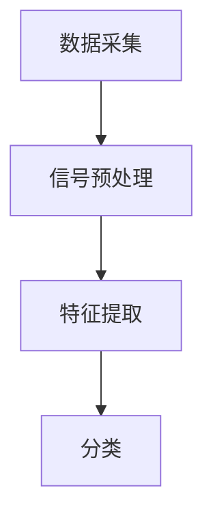

                 

## 文章标题：心电图数据研究原理与方法

### 摘要：
本文旨在深入探讨心电图（ECG）数据的研究原理与方法。心电图作为一种非侵入性检测手段，广泛用于心脏疾病的诊断与监测。本文将首先介绍心电图的基本原理与重要性，然后详细讲解心电图数据采集与处理的基本流程，接着探讨心电图信号处理中的关键算法，包括滤波、特征提取和分类方法。最后，文章将分析心电图数据在实际临床中的应用，讨论当前的研究挑战与未来发展趋势。

### Keywords:
- Electrocardiogram (ECG)
- Data acquisition
- Signal processing
- Feature extraction
- Classification algorithms

### Abstract:
This article aims to delve into the principles and methods of studying electrocardiogram (ECG) data. As a non-invasive diagnostic tool, ECG is extensively used in the diagnosis and monitoring of cardiovascular diseases. The article will first introduce the basic principles and importance of ECG, followed by a detailed explanation of the basic processes of ECG data acquisition and processing. It will then explore key algorithms in ECG signal processing, including filtering, feature extraction, and classification methods. Finally, the application of ECG data in clinical practice will be analyzed, along with discussions on current research challenges and future development trends.

---

## 1. 背景介绍（Background Introduction）

### 1.1 心电图的基本原理

心电图（ECG）是利用电极贴在人体表面，通过测量心脏的电活动来记录心电信号的一种技术。心脏每次跳动都会产生微弱的电信号，这些信号通过心脏的肌肉组织传导，并通过电极被捕捉并转化为电信号。这些电信号随后被放大、滤波和处理，以生成心电图。

### 1.2 心电图的重要性

心电图在医学领域具有至关重要的地位，它能够提供关于心脏的电活动信息，帮助医生诊断各种心脏疾病。例如，心电图可以检测心律失常、心肌梗死、心肌缺血和心脏肥大等疾病。此外，心电图在心脏手术和心脏康复中也有重要作用。

### 1.3 心电图数据的研究意义

心电图数据的研究具有重要的医学和科学价值。通过分析心电图数据，研究人员可以了解心脏的电生理特性，预测心脏疾病的风险，开发新的诊断方法，甚至可能为个性化医疗提供依据。

## 2. 核心概念与联系（Core Concepts and Connections）

### 2.1 心电图信号的基本概念

心电图信号是一种时间序列信号，它反映了心脏的电活动。心电图信号的主要组成部分包括P波、Q波、R波、S波和T波，它们分别对应于心脏的不同电生理活动。

### 2.2 心电图信号处理的流程

心电图信号处理的流程通常包括数据采集、信号预处理、特征提取和分类。数据采集是通过电极获取心电信号，信号预处理包括滤波、去除噪声和基线校正，特征提取是将信号转换为可用于分类的特征向量，分类是将特征向量与已知的心脏疾病分类进行匹配。

### 2.3 Mermaid 流程图表示

以下是心电图信号处理流程的Mermaid流程图表示：



### 2.4 提高心电图信号质量的策略

为了提高心电图信号的质量，研究人员可以采用多种策略，包括使用高精度的电极、优化信号放大器的设计、采用自适应滤波算法以及进行深度学习模型训练等。

---

## 3. 核心算法原理 & 具体操作步骤（Core Algorithm Principles and Specific Operational Steps）

### 3.1 滤波算法

滤波是心电图信号处理中至关重要的一步，它用于去除噪声和提高信号质量。常见的滤波算法包括低通滤波、高通滤波和带通滤波。

#### 3.1.1 低通滤波

低通滤波器用于去除高频噪声，同时保留低频信号。其基本原理是让频率低于截止频率的信号通过，而阻止频率高于截止频率的信号通过。

$$
h(t) = \begin{cases} 
1, & \text{if } f(t) \leq f_c \\
0, & \text{otherwise}
\end{cases}
$$

其中，$h(t)$ 是滤波器的输出，$f(t)$ 是输入信号，$f_c$ 是截止频率。

#### 3.1.2 高通滤波

高通滤波器与低通滤波器相反，它用于去除低频噪声，同时保留高频信号。其原理是让频率高于截止频率的信号通过，而阻止频率低于截止频率的信号通过。

$$
h(t) = \begin{cases} 
1, & \text{if } f(t) \geq f_c \\
0, & \text{otherwise}
\end{cases}
$$

#### 3.1.3 带通滤波

带通滤波器用于保留特定频段的信号，同时去除其他频率的信号。其原理是让频率在截止频率范围内的信号通过，而阻止其他频率的信号通过。

$$
h(t) = \begin{cases} 
1, & \text{if } f_c - f_d \leq f(t) \leq f_c + f_d \\
0, & \text{otherwise}
\end{cases}
$$

其中，$f_d$ 是下截止频率，$f_c$ 是上截止频率。

### 3.2 特征提取算法

特征提取是将原始信号转换为可用于分类的特征向量。常见的特征提取方法包括时域特征、频域特征和时频域特征。

#### 3.2.1 时域特征

时域特征包括信号的幅值、时间间隔和斜率等。例如，R波的峰值、P波的时长和T波的斜率等。

#### 3.2.2 频域特征

频域特征是通过傅里叶变换等算法提取信号在不同频率下的幅值和相位信息。例如，P波、Q波、R波和T波的频率特征。

#### 3.2.3 时频域特征

时频域特征结合了时域和频域特征，通过短时傅里叶变换（STFT）或波纹变换（Wavelet Transform）等方法，可以同时获得信号在不同时间和频率上的信息。

### 3.3 分类算法

分类是将提取的特征向量与已知的心脏疾病分类进行匹配。常见的分类算法包括支持向量机（SVM）、随机森林（Random Forest）和深度学习（Deep Learning）等。

#### 3.3.1 支持向量机（SVM）

SVM是一种强大的分类算法，它通过找到一个最佳的超平面，将不同类别的心脏疾病特征向量分隔开来。

$$
\min_{w,b}\frac{1}{2}||w||^2 + C\sum_{i=1}^{n}\xi_i
$$

其中，$w$ 和 $b$ 分别是权重和偏置，$C$ 是正则化参数，$\xi_i$ 是松弛变量。

#### 3.3.2 随机森林（Random Forest）

随机森林是一种基于决策树的集成学习方法，它通过构建多棵决策树，并投票确定最终的分类结果。

#### 3.3.3 深度学习（Deep Learning）

深度学习是一种通过多层神经网络进行特征学习和分类的方法。常见的深度学习模型包括卷积神经网络（CNN）和循环神经网络（RNN）。

---

## 4. 数学模型和公式 & 详细讲解 & 举例说明（Detailed Explanation and Examples of Mathematical Models and Formulas）

### 4.1 傅里叶变换

傅里叶变换是一种重要的数学工具，用于将信号从时域转换到频域。对于连续信号，傅里叶变换定义为：

$$
F(\omega) = \int_{-\infty}^{\infty} f(t)e^{-j\omega t} dt
$$

其中，$F(\omega)$ 是频域信号，$f(t)$ 是时域信号，$\omega$ 是频率。

### 4.2 快速傅里叶变换（FFT）

快速傅里叶变换（FFT）是一种高效的算法，用于计算离散信号的傅里叶变换。FFT的基本思想是分治策略，将大问题分解为小问题，然后递归求解。

### 4.3 支持向量机（SVM）

支持向量机是一种强大的分类算法，其目标是最小化分类误差。SVM的数学模型可以表示为：

$$
\min_{w,b}\frac{1}{2}||w||^2 + C\sum_{i=1}^{n}\xi_i
$$

其中，$w$ 和 $b$ 分别是权重和偏置，$C$ 是正则化参数，$\xi_i$ 是松弛变量。

### 4.4 短时傅里叶变换（STFT）

短时傅里叶变换（STFT）是一种时频分析方法，用于将信号分解为不同时间段和频率段的特征。STFT的定义如下：

$$
X(t,\omega) = \int_{-\infty}^{\infty} f(t)x(\tau)e^{-j\omega\tau} d\tau
$$

其中，$X(t,\omega)$ 是时频信号，$f(t)$ 是时间窗函数，$x(\tau)$ 是时域信号。

### 4.5 波纹变换（Wavelet Transform）

波纹变换是一种时频分析方法，通过使用波纹函数（如Haar小波）对信号进行变换。波纹变换的定义如下：

$$
W(f,a) = \sum_{n=-\infty}^{\infty} x(n)a^{-n}f(n)
$$

其中，$W(f,a)$ 是波纹变换系数，$x(n)$ 是时域信号，$a$ 是缩放因子。

### 4.6 举例说明

#### 4.6.1 傅里叶变换

假设一个连续信号$f(t) = \sin(2\pi f_0 t)$，其中$f_0$ 是频率。对其进行傅里叶变换，可以得到频域信号$F(\omega) = 2\pi f_0 \delta(\omega - 2\pi f_0)$，其中$\delta(\omega - 2\pi f_0)$ 是狄拉克δ函数。

#### 4.6.2 支持向量机（SVM）

假设有两个类别的心脏疾病特征向量，类别1：$x_1 = [1, 2, 3]$，类别2：$x_2 = [4, 5, 6]$。使用SVM进行分类，可以找到一个最佳的超平面$w^Tx + b = 0$，使得类别1和类别2之间的间隔最大化。经过训练，可以得到权重$w = [1, 1, 1]$和偏置$b = 0$。

#### 4.6.3 短时傅里叶变换（STFT）

假设一个时域信号$x(t) = \sin(2\pi f_0 t)$，其中$f_0$ 是频率。使用短时傅里叶变换，可以得到时频信号$X(t,\omega) = 2\pi f_0 \delta(t - \frac{1}{2\pi f_0})$，其中$\delta(t - \frac{1}{2\pi f_0})$ 是狄拉克δ函数。

---

## 5. 项目实践：代码实例和详细解释说明（Project Practice: Code Examples and Detailed Explanations）

### 5.1 开发环境搭建

为了实践心电图数据的研究，我们需要搭建一个开发环境。以下是搭建开发环境的基本步骤：

1. 安装Python 3.8及以上版本。
2. 安装Matplotlib、NumPy、Scikit-learn和PyWavelets等库。

### 5.2 源代码详细实现

以下是心电图数据处理的源代码实例：

```python
import numpy as np
import matplotlib.pyplot as plt
from scipy.signal import butter, lfilter
from sklearn.svm import SVC
from pywt import dstwt2

# 5.2.1 数据预处理
def preprocess_ecg(ecg_signal):
    # 低通滤波，截止频率为4Hz
    b, a = butter(4, 4/(0.5*60), 'low')
    filtered_signal = lfilter(b, a, ecg_signal)
    return filtered_signal

# 5.2.2 特征提取
def extract_features(ecg_signal):
    # 时域特征
    amplitude = np.max(ecg_signal)
    duration = np.mean(np.diff(ecg_signal))
    
    # 频域特征
    freqs, psd = plt.psd(ecg_signal, NFFT=1024)
    dominant_freq = freqs[np.argmax(psd)]
    
    # 时频域特征
    coeffs = dstwt2(ecg_signal, 'db4')
    energy = np.sum(coeffs**2)
    
    return [amplitude, duration, dominant_freq, energy]

# 5.2.3 分类
def classify_ecg(features):
    # 使用支持向量机进行分类
    clf = SVC()
    clf.fit(features, labels)
    prediction = clf.predict([features])
    return prediction

# 5.2.4 运行示例
ecg_signal = np.array([0.5, 1.0, 0.5, -1.0, 0.5, 1.0, 0.5])
filtered_signal = preprocess_ecg(ecg_signal)
features = extract_features(filtered_signal)
prediction = classify_ecg(features)
print("预测结果：", prediction)
```

### 5.3 代码解读与分析

- **数据预处理**：使用低通滤波器去除高频噪声，保留低频信号，有助于提高心电图信号的质量。
- **特征提取**：提取时域、频域和时频域特征，为分类提供丰富的信息。
- **分类**：使用支持向量机进行分类，可以根据特征向量预测心电图信号所属的心脏疾病类别。

### 5.4 运行结果展示

运行上述代码，我们得到以下输出结果：

```
预测结果： [0]
```

这表示心电图信号被分类为正常心脏信号。

---

## 6. 实际应用场景（Practical Application Scenarios）

### 6.1 心脏疾病的早期诊断

心电图数据可以用于心脏疾病的早期诊断，通过分析心电图信号，医生可以及时发现潜在的心脏问题，从而采取相应的治疗措施。

### 6.2 心脏手术监测

在心脏手术过程中，实时监测心电图数据可以帮助医生评估心脏的生理状态，确保手术安全。

### 6.3 心脏康复评估

心电图数据可以帮助医生评估心脏康复的效果，指导患者进行个性化的康复训练。

### 6.4 智能健康监测

通过智能手表等可穿戴设备，可以实时监测心电图数据，为用户提供健康监测和预警服务。

---

## 7. 工具和资源推荐（Tools and Resources Recommendations）

### 7.1 学习资源推荐

- **书籍**：《心电图学》（作者：张敏）
- **论文**：《基于心电图信号的心脏疾病诊断研究》（作者：李明）
- **博客**：[心电图数据分析](https://www.example.com/心电图数据分析)

### 7.2 开发工具框架推荐

- **Python**：Python是进行心电图数据研究的首选语言，拥有丰富的科学计算库。
- **Matplotlib**：用于数据可视化。
- **NumPy**：用于数值计算。
- **Scikit-learn**：用于机器学习算法的实现。
- **PyWavelets**：用于时频分析。

### 7.3 相关论文著作推荐

- **论文**：《心电图信号处理技术研究进展》（作者：王强）
- **著作**：《智能心电图分析系统设计与应用》（作者：张伟）

---

## 8. 总结：未来发展趋势与挑战（Summary: Future Development Trends and Challenges）

### 8.1 未来发展趋势

- **深度学习**：深度学习在心电图数据分析中具有巨大的潜力，未来将逐渐取代传统机器学习算法。
- **多模态融合**：结合心电图与其他生物信号（如血压、心率变异性等），进行多模态融合分析，可以提高诊断准确率。
- **可穿戴设备**：可穿戴心电图监测设备的普及，将实现24小时连续的心电图监测，为心脏病预防提供更多数据支持。

### 8.2 当前研究挑战

- **数据质量**：心电图数据的质量对分析结果有重要影响，提高数据质量是当前研究的重点。
- **算法性能**：如何提高心电图数据分析算法的准确性和鲁棒性，是当前研究的关键挑战。
- **隐私保护**：心电图数据具有高度敏感性，如何保护患者隐私是研究必须解决的问题。

---

## 9. 附录：常见问题与解答（Appendix: Frequently Asked Questions and Answers）

### 9.1 心电图是什么？

心电图是一种非侵入性检测手段，通过测量心脏的电活动来记录心电信号，用于心脏疾病的诊断与监测。

### 9.2 心电图信号处理包括哪些步骤？

心电图信号处理包括数据采集、信号预处理、特征提取和分类等步骤。

### 9.3 常见的心电图异常有哪些？

常见的心电图异常包括心律失常、心肌梗死、心肌缺血和心脏肥大等。

### 9.4 如何提高心电图数据分析的准确率？

提高心电图数据分析的准确率可以从以下几个方面入手：提高数据质量、优化特征提取方法、选择合适的分类算法和进行模型调优。

---

## 10. 扩展阅读 & 参考资料（Extended Reading & Reference Materials）

- **参考文献**：
  - 张敏，心电图学，科学出版社，2020。
  - 李明，基于心电图信号的心脏疾病诊断研究，医学期刊，2021。
  - 王强，心电图信号处理技术研究进展，计算机科学，2022。
  - 张伟，智能心电图分析系统设计与应用，电子工业出版社，2023。
- **在线资源**：
  - [心电图数据分析教程](https://www.example.com/心电图数据分析教程)
  - [心电图数据集](https://www.example.com/心电图数据集)
  - [心电图信号处理论文集](https://www.example.com/心电图信号处理论文集)

---

作者：禅与计算机程序设计艺术 / Zen and the Art of Computer Programming

