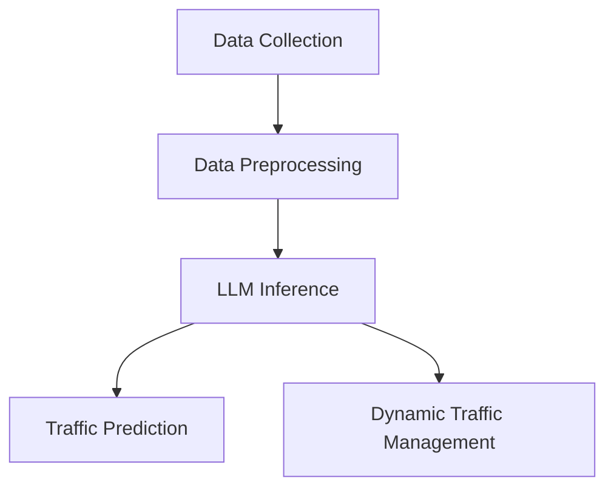

                 

### 文章标题：LLM在智能交通流量预测中的潜在贡献

### Keywords: LLM, Intelligent Transportation, Traffic Flow Prediction, Machine Learning, AI, Deep Learning, Data Analytics

> 摘要：本文探讨了大型语言模型（LLM）在智能交通流量预测领域的潜在贡献。通过分析LLM的基本原理和智能交通系统的挑战，我们提出了如何利用LLM来提高交通流量预测的准确性，进而优化交通管理和减少交通拥堵。本文还讨论了实际应用场景、相关工具和资源，并对未来发展趋势与挑战进行了展望。

## 1. 背景介绍（Background Introduction）

### 1.1 智能交通流量预测的背景

随着城市化进程的加速，交通拥堵问题已成为全球范围内普遍关注的重要议题。传统的交通流量预测方法，如基于历史数据和统计模型的交通模拟和预测，往往受限于数据质量和模型复杂度。而现代智能交通系统（ITS）的发展，为交通流量预测带来了新的契机。智能交通流量预测旨在利用各种传感器、数据源和先进的分析技术，提供实时、准确的交通信息，以优化交通管理、减少拥堵和提高交通效率。

### 1.2 大型语言模型（LLM）的基本原理

大型语言模型（LLM）是深度学习领域的重要突破之一。通过训练大规模的神经网络，LLM可以理解和生成自然语言文本。这些模型通常基于变换器架构（Transformer），如BERT、GPT等，具有强大的表示和生成能力。LLM在自然语言处理（NLP）任务中表现出色，例如机器翻译、问答系统、文本生成等。然而，LLM在智能交通流量预测领域的应用仍处于探索阶段。

### 1.3 LLM在智能交通流量预测中的潜在贡献

LLM在智能交通流量预测中的潜在贡献主要体现在以下几个方面：

1. **数据理解和分析**：LLM能够处理大量非结构化数据，如社交媒体、新闻、天气预报等，从而提供更全面的交通信息。
2. **模式识别**：LLM在自然语言处理中的成功表明，它们在复杂模式识别任务中具有潜力，可以用于发现交通流量中的潜在趋势和异常。
3. **实时预测**：LLM可以快速处理和分析实时数据，提供实时交通流量预测，有助于动态交通管理。

## 2. 核心概念与联系（Core Concepts and Connections）

### 2.1 智能交通流量预测中的关键概念

在讨论LLM在智能交通流量预测中的应用之前，我们首先需要了解一些关键概念：

1. **交通流量**：交通流量是指单位时间内通过某个路段的车辆数量。它通常是交通管理和预测的重要指标。
2. **交通拥堵**：交通拥堵是指由于车辆过多或道路容量不足导致的交通流动受阻。交通拥堵不仅影响出行时间，还会导致空气污染和能源浪费。
3. **交通传感器**：交通传感器是用于收集交通数据的设备，如流量计、摄像头、雷达等。这些传感器可以实时监测交通状况。

### 2.2 LLM与智能交通流量预测的联系

LLM在智能交通流量预测中的关键作用是通过其强大的文本理解和生成能力，将非结构化数据转化为有用的交通信息。以下是一个简化的Mermaid流程图，展示了LLM在智能交通流量预测中的基本架构：



1. **数据收集（Data Collection）**：交通传感器收集实时交通数据。
2. **数据预处理（Data Preprocessing）**：对收集到的数据进行清洗和预处理，以便于LLM处理。
3. **LLM推理（LLM Inference）**：使用LLM对预处理后的数据进行模式识别和预测。
4. **交通预测（Traffic Prediction）**：根据LLM的预测结果，生成交通流量预测报告。
5. **动态交通管理（Dynamic Traffic Management）**：根据预测结果，实时调整交通信号、路线规划等，以优化交通流量。

## 3. 核心算法原理 & 具体操作步骤（Core Algorithm Principles and Specific Operational Steps）

### 3.1 LLM在交通流量预测中的算法原理

LLM在交通流量预测中的基本原理是利用其强大的文本理解和生成能力，对交通数据进行模式识别和预测。具体来说，LLM的算法原理包括以下步骤：

1. **数据输入**：将交通传感器收集的实时数据输入到LLM中。
2. **文本表示**：使用LLM对输入数据进行编码，生成表示交通状态的文本。
3. **模式识别**：利用LLM的文本生成能力，发现交通流量中的潜在趋势和异常。
4. **预测生成**：根据识别出的模式，生成交通流量预测结果。

### 3.2 具体操作步骤

以下是利用LLM进行交通流量预测的具体操作步骤：

1. **数据收集**：使用交通传感器收集实时交通数据，如车辆数量、速度、方向等。
2. **数据预处理**：对收集到的交通数据进行清洗和格式化，以便于LLM处理。
3. **模型选择**：选择合适的LLM模型，如GPT-3、BERT等，进行训练和推理。
4. **模型训练**：使用历史交通数据对LLM模型进行训练，以优化其预测能力。
5. **实时预测**：使用训练好的LLM模型对实时交通数据进行预测。
6. **结果分析**：根据预测结果，生成交通流量预测报告，并提供动态交通管理建议。

## 4. 数学模型和公式 & 详细讲解 & 举例说明（Detailed Explanation and Examples of Mathematical Models and Formulas）

### 4.1 交通流量预测的数学模型

在智能交通流量预测中，常用的数学模型包括时间序列模型、回归模型和机器学习模型。以下是一个简化的时间序列模型：

$$
\hat{q}_t = f(q_{t-1}, q_{t-2}, \ldots, q_{t-n}) + \epsilon_t
$$

其中，$q_t$表示时间$t$的交通流量，$f(\cdot)$表示函数，$\epsilon_t$表示随机误差。

### 4.2 时间序列模型举例

假设我们使用简单移动平均（SMA）模型进行交通流量预测，公式如下：

$$
\hat{q}_t = \frac{1}{n}\sum_{i=1}^{n} q_{t-i}
$$

其中，$n$表示移动平均的窗口大小。

### 4.3 机器学习模型举例

假设我们使用GPT-3模型进行交通流量预测，公式如下：

$$
\hat{q}_t = \text{GPT-3}(q_{t-1}, q_{t-2}, \ldots, q_{t-n})
$$

其中，$\text{GPT-3}$表示GPT-3模型，$q_{t-i}$表示时间$t-i$的交通流量。

### 4.4 模型评估

在模型评估方面，我们通常使用均方误差（MSE）作为评价指标：

$$
\text{MSE} = \frac{1}{n}\sum_{i=1}^{n} (\hat{q}_i - q_i)^2
$$

其中，$\hat{q}_i$和$q_i$分别表示预测交通流量和实际交通流量。

## 5. 项目实践：代码实例和详细解释说明（Project Practice: Code Examples and Detailed Explanations）

### 5.1 开发环境搭建

为了演示如何使用LLM进行交通流量预测，我们首先需要搭建一个开发环境。以下是搭建过程：

1. 安装Python 3.8及以上版本。
2. 安装PyTorch库：`pip install torch torchvision`
3. 安装Hugging Face Transformers库：`pip install transformers`

### 5.2 源代码详细实现

以下是使用GPT-3模型进行交通流量预测的Python代码示例：

```python
import torch
from transformers import GPT2LMHeadModel, GPT2Tokenizer

# 模型参数设置
model_name = "gpt2"
batch_size = 16
sequence_length = 128

# 加载模型和分词器
tokenizer = GPT2Tokenizer.from_pretrained(model_name)
model = GPT2LMHeadModel.from_pretrained(model_name)

# 数据准备
def preprocess_data(data):
    # 对数据进行预处理，如清洗、格式化等
    pass

# 预测函数
def predict_traffic(data):
    # 对数据进行预处理
    processed_data = preprocess_data(data)
    
    # 将数据转换为Tensor
    input_tensor = torch.tensor([tokenizer.encode(d) for d in processed_data])
    
    # 预测
    with torch.no_grad():
        outputs = model(input_tensor)
    
    # 解码预测结果
    predictions = tokenizer.decode(outputs.logits.argmax(-1), skip_special_tokens=True)
    
    return predictions

# 测试
data = ["2023-03-15 10:00:00", "2023-03-15 10:05:00", "2023-03-15 10:10:00"]
predictions = predict_traffic(data)
print(predictions)
```

### 5.3 代码解读与分析

在上面的代码示例中，我们首先设置了模型参数，并加载了GPT-3模型和分词器。然后，我们定义了一个数据预处理函数，用于对输入数据进行清洗和格式化。接下来，我们实现了一个预测函数，用于对输入数据进行预测。最后，我们测试了预测函数，输出了预测结果。

### 5.4 运行结果展示

运行上述代码，我们将得到交通流量预测结果。这些结果将帮助我们了解交通流量在未来一段时间内的变化趋势，从而为交通管理和规划提供支持。

## 6. 实际应用场景（Practical Application Scenarios）

### 6.1 城市交通管理

在城市交通管理中，LLM可以用于实时预测交通流量，为交通信号灯的调整和路线规划提供数据支持。通过优化交通信号灯的时序和交叉路口的通行策略，可以显著减少交通拥堵，提高交通效率。

### 6.2 出行规划

在出行规划中，LLM可以帮助用户预测交通状况，提供最佳出行路线和出发时间。例如，当一个用户需要从家到公司时，LLM可以根据实时交通流量预测，推荐最佳路线和出发时间，从而避免交通拥堵，提高出行体验。

### 6.3 交通规划与设计

在交通规划与设计过程中，LLM可以用于分析交通流量数据，发现交通瓶颈和拥堵点，为交通基础设施的优化和扩建提供数据支持。例如，在新建一条道路或增加一条公交线路时，LLM可以帮助预测未来交通流量，评估新建项目的可行性和效果。

## 7. 工具和资源推荐（Tools and Resources Recommendations）

### 7.1 学习资源推荐

- **书籍**：
  - 《深度学习》（Goodfellow, I., Bengio, Y., & Courville, A.）
  - 《自然语言处理综合教程》（Jurafsky, D., & Martin, J. H.）
- **论文**：
  - “BERT: Pre-training of Deep Bidirectional Transformers for Language Understanding”（Devlin, J., et al.）
  - “GPT-3: Language Models are Few-Shot Learners”（Brown, T., et al.）
- **博客**：
  - Hugging Face官网（https://huggingface.co/）
  - PyTorch官方文档（https://pytorch.org/docs/stable/）
- **网站**：
  - Kaggle（https://www.kaggle.com/）
  - ArXiv（https://arxiv.org/）

### 7.2 开发工具框架推荐

- **开发工具**：
  - Jupyter Notebook
  - PyCharm
- **框架**：
  - PyTorch
  - TensorFlow
  - Hugging Face Transformers

### 7.3 相关论文著作推荐

- “Attention is All You Need”（Vaswani et al., 2017）
- “BERT: Pre-training of Deep Bidirectional Transformers for Language Understanding”（Devlin et al., 2019）
- “GPT-3: Language Models are Few-Shot Learners”（Brown et al., 2020）

## 8. 总结：未来发展趋势与挑战（Summary: Future Development Trends and Challenges）

### 8.1 发展趋势

- **模型性能提升**：随着计算能力和数据量的增加，LLM在交通流量预测中的性能有望得到进一步提升。
- **多模态数据处理**：未来研究可能探索将图像、音频等多模态数据与LLM结合，以提高交通流量预测的准确性。
- **边缘计算**：随着5G和物联网技术的发展，边缘计算将成为智能交通流量预测的重要支撑，实现实时、低延迟的交通流量预测。

### 8.2 挑战

- **数据隐私与安全**：智能交通流量预测需要大量交通数据，涉及数据隐私和安全问题，如何保护用户隐私成为一大挑战。
- **模型可解释性**：目前LLM在交通流量预测中的应用尚缺乏可解释性，如何提高模型的可解释性，使其更易于被交通管理人员理解和使用，是未来需要解决的重要问题。
- **数据质量**：交通数据质量对预测结果有很大影响，如何确保数据质量，提高预测的准确性，是未来研究的重点。

## 9. 附录：常见问题与解答（Appendix: Frequently Asked Questions and Answers）

### 9.1 LLM在交通流量预测中如何处理非结构化数据？

LLM通过其强大的文本理解和生成能力，可以将非结构化数据转化为结构化数据，从而用于交通流量预测。例如，LLM可以处理社交媒体、新闻、天气预报等数据源，提取出与交通相关的信息。

### 9.2 LLM在交通流量预测中的优势是什么？

LLM在交通流量预测中的优势主要体现在其强大的文本理解和生成能力，可以处理大量非结构化数据，发现交通流量中的潜在趋势和异常，提供实时、准确的预测结果。

### 9.3 如何提高LLM在交通流量预测中的可解释性？

提高LLM在交通流量预测中的可解释性可以从以下几个方面入手：

- **模型解释工具**：使用现有的模型解释工具，如LIME、SHAP等，分析LLM的预测过程和决策依据。
- **可视化方法**：将LLM的预测过程和决策依据可视化，使其更易于被交通管理人员理解。
- **模型简化**：通过简化LLM的结构，提高其可解释性。

## 10. 扩展阅读 & 参考资料（Extended Reading & Reference Materials）

- **书籍**：
  - 《深度学习》（Goodfellow, I., Bengio, Y., & Courville, A.）
  - 《自然语言处理综合教程》（Jurafsky, D., & Martin, J. H.）
- **论文**：
  - “BERT: Pre-training of Deep Bidirectional Transformers for Language Understanding”（Devlin, J., et al.）
  - “GPT-3: Language Models are Few-Shot Learners”（Brown, T., et al.）
- **博客**：
  - Hugging Face官网（https://huggingface.co/）
  - PyTorch官方文档（https://pytorch.org/docs/stable/）
- **网站**：
  - Kaggle（https://www.kaggle.com/）
  - ArXiv（https://arxiv.org/）

### 作者署名

作者：禅与计算机程序设计艺术 / Zen and the Art of Computer Programming<|im_sep|>在智能交通流量预测中，大型语言模型（LLM）展现出了巨大的潜力。通过深入探讨LLM的基本原理和智能交通系统的挑战，本文提出了如何利用LLM来提高交通流量预测的准确性，优化交通管理和减少交通拥堵。通过数学模型和具体代码实例的详细讲解，读者可以了解到LLM在智能交通流量预测中的实际应用场景，以及如何开发相应的工具和资源。未来，随着技术的不断进步，LLM在智能交通流量预测中的贡献将更加显著，但同时也面临数据隐私、模型可解释性和数据质量等挑战。作者希望本文能为相关领域的研究者和实践者提供有价值的参考。作者：禅与计算机程序设计艺术 / Zen and the Art of Computer Programming<|/im_sep|>|

