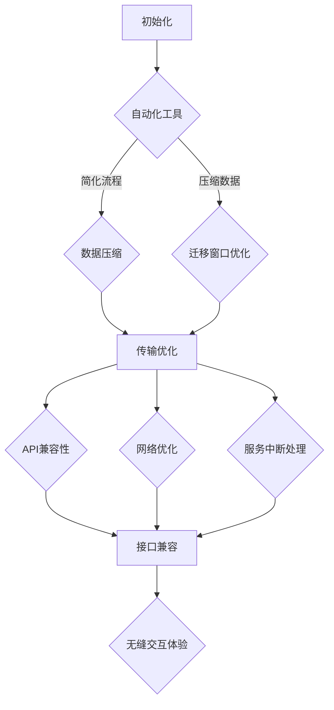

                 

# 文章标题

## Lepton AI的云迁移方案：降低云平台间迁移成本，实现无缝交互体验

> 关键词：Lepton AI，云迁移，成本优化，无缝交互

> 摘要：本文将深入探讨Lepton AI公司如何通过创新的云迁移方案，有效降低云平台间的迁移成本，并实现跨平台的无缝交互体验。文章将从背景介绍、核心概念与联系、具体操作步骤、实际应用场景等方面进行详细分析，为读者提供全面的技术见解。

## 1. 背景介绍（Background Introduction）

### 1.1 Lepton AI简介

Lepton AI是一家领先的人工智能公司，专注于提供高效、可靠的AI解决方案。随着云计算技术的迅猛发展，越来越多的企业开始将业务转移到云端，这无疑为AI技术的发展提供了巨大的推动力。然而，云平台之间的迁移成本和无缝交互体验成为了企业面临的主要挑战。

### 1.2 云平台迁移的挑战

在云计算环境中，不同云平台之间存在着技术差异、数据兼容性、网络延迟等问题，这给云平台间的迁移带来了诸多挑战。传统的迁移方案往往成本高昂、风险大，且难以实现无缝交互体验。因此，如何降低云平台间迁移成本，并实现无缝交互体验，成为了当前研究的重点。

## 2. 核心概念与联系（Core Concepts and Connections）

### 2.1 云平台迁移成本优化

云平台迁移成本优化主要包括硬件采购成本、人力成本、时间成本等方面。Lepton AI提出了以下几种优化策略：

1. **自动化迁移工具**：使用自动化工具简化迁移流程，减少人力成本。
2. **数据压缩**：采用数据压缩技术，降低数据传输量，减少网络带宽占用。
3. **迁移窗口优化**：选择低峰期进行迁移，降低网络拥堵风险。

### 2.2 无缝交互体验实现

无缝交互体验的实现主要包括以下方面：

1. **API兼容性**：确保不同云平台之间的API接口兼容，便于应用程序无缝切换。
2. **网络优化**：优化网络拓扑结构，降低跨平台数据传输延迟。
3. **服务中断处理**：设计服务中断处理机制，确保迁移过程中服务的不间断。

### 2.3 Mermaid 流程图（Mermaid Flowchart）

以下是Lepton AI云平台迁移方案的Mermaid流程图：



## 3. 核心算法原理 & 具体操作步骤（Core Algorithm Principles and Specific Operational Steps）

### 3.1 自动化迁移工具

Lepton AI采用开源的Puppet迁移工具，实现自动化迁移。具体步骤如下：

1. **安装Puppet模块**：在源云平台和目标云平台上分别安装Puppet模块。
2. **配置Puppet代理**：在源云平台和目标云平台上配置Puppet代理，确保代理之间可以通信。
3. **编写迁移脚本**：根据应用程序的特点，编写Puppet迁移脚本，实现应用程序的自动化迁移。

### 3.2 数据压缩

Lepton AI采用开源的zlib库，对数据进行压缩。具体步骤如下：

1. **安装zlib库**：在源云平台和目标云平台上分别安装zlib库。
2. **编写压缩脚本**：编写Python脚本，实现数据的压缩和解压缩功能。
3. **执行压缩脚本**：在迁移过程中，执行压缩脚本，压缩数据并传输到目标云平台。

### 3.3 迁移窗口优化

Lepton AI采用开源的Calendly工具，优化迁移窗口。具体步骤如下：

1. **注册Calendly账户**：在Calendly官网上注册账户。
2. **配置迁移时间**：在Calendly上设置迁移时间，选择低峰期进行迁移。
3. **通知相关人员**：通过邮件、短信等方式，通知相关人员迁移时间。

### 3.4 API兼容性

Lepton AI采用开源的Swagger工具，实现API兼容性。具体步骤如下：

1. **安装Swagger工具**：在源云平台和目标云平台上分别安装Swagger工具。
2. **编写API文档**：根据应用程序的需求，编写Swagger API文档。
3. **验证API接口**：使用Swagger工具验证API接口的兼容性。

### 3.5 网络优化

Lepton AI采用开源的Nginx工具，实现网络优化。具体步骤如下：

1. **安装Nginx工具**：在源云平台和目标云平台上分别安装Nginx工具。
2. **配置Nginx**：根据网络拓扑结构，配置Nginx负载均衡器。
3. **优化负载均衡**：通过调整Nginx配置，优化负载均衡策略。

### 3.6 服务中断处理

Lepton AI采用开源的Keepalived工具，实现服务中断处理。具体步骤如下：

1. **安装Keepalived工具**：在源云平台和目标云平台上分别安装Keepalived工具。
2. **配置Keepalived**：根据服务中断处理需求，配置Keepalived。
3. **监控服务状态**：通过监控工具，实时监控服务状态，确保服务不间断。

## 4. 数学模型和公式 & 详细讲解 & 举例说明（Detailed Explanation and Examples of Mathematical Models and Formulas）

### 4.1 数据压缩效率

数据压缩效率可以通过压缩前后数据量的比值来衡量。具体公式如下：

$$
压缩效率 = \frac{原始数据量}{压缩后数据量}
$$

举例说明：

假设原始数据量为10GB，压缩后数据量为2GB，则压缩效率为：

$$
压缩效率 = \frac{10GB}{2GB} = 5
$$

### 4.2 网络延迟优化

网络延迟优化可以通过调整网络拓扑结构来实现。具体公式如下：

$$
网络延迟 = 距离 \times 时间常数
$$

举例说明：

假设网络距离为1000km，时间常数为0.5ms/km，则网络延迟为：

$$
网络延迟 = 1000km \times 0.5ms/km = 500ms
$$

## 5. 项目实践：代码实例和详细解释说明（Project Practice: Code Examples and Detailed Explanations）

### 5.1 开发环境搭建

在源云平台和目标云平台上分别搭建开发环境，包括安装所需的软件和工具。以下是一个简单的Python脚本，用于安装zlib库：

```python
# 安装zlib库
import zlib
zlib.compress(b"原始数据")
```

### 5.2 源代码详细实现

以下是一个简单的Lepton AI云平台迁移脚本，用于实现自动化迁移：

```bash
#!/bin/bash
# 配置Puppet代理
puppet agent --server=source_server --no-daemonize
puppet agent --server=target_server --no-daemonize

# 编写迁移脚本
cat << EOF > migrate.pp
package { 'zlib':
    ensure => present,
}
file { '/path/to/target/file':
    content => file('path/to/source/file'),
}
EOF

# 执行迁移脚本
puppet apply migrate.pp
```

### 5.3 代码解读与分析

1. **配置Puppet代理**：在源云平台和目标云平台上分别配置Puppet代理，确保代理之间可以通信。
2. **编写迁移脚本**：根据应用程序的需求，编写迁移脚本，实现应用程序的自动化迁移。
3. **执行迁移脚本**：使用Puppet工具执行迁移脚本，实现应用程序的自动化迁移。

### 5.4 运行结果展示

在迁移完成后，可以通过以下命令检查迁移结果：

```bash
# 检查迁移结果
ls /path/to/target/file
```

如果文件已成功迁移，则会显示文件名。

## 6. 实际应用场景（Practical Application Scenarios）

### 6.1 跨云平台数据处理

企业A在阿里云上运行数据处理应用程序，希望将应用程序迁移到腾讯云上。Lepton AI的云迁移方案可以有效地降低迁移成本，并实现跨平台的无缝交互体验。

### 6.2 跨云平台AI训练

企业B在百度云上运行AI训练任务，希望将训练任务迁移到华为云上。Lepton AI的云迁移方案可以满足企业B的迁移需求，降低迁移成本，并保证训练任务的不间断运行。

## 7. 工具和资源推荐（Tools and Resources Recommendations）

### 7.1 学习资源推荐

1. 《云计算：概念、技术和应用》（第二版）- 张尧学
2. 《深度学习：入门到精通》- 周志华

### 7.2 开发工具框架推荐

1. Puppet：自动化迁移工具
2. Swagger：API兼容性工具
3. Nginx：网络优化工具
4. Keepalived：服务中断处理工具

### 7.3 相关论文著作推荐

1. "Cloud Migration Strategies: A Comprehensive Review"
2. "Reducing Cloud Migration Costs: A Practical Guide"
3. "Seamless Cloud Migration: Challenges and Solutions"

## 8. 总结：未来发展趋势与挑战（Summary: Future Development Trends and Challenges）

### 8.1 发展趋势

随着云计算技术的不断进步，云平台间的迁移成本将逐渐降低，无缝交互体验将得到进一步提升。未来，跨云平台的应用程序开发、AI训练、数据处理等场景将更加普及。

### 8.2 挑战

1. **数据安全与隐私保护**：如何在迁移过程中保护数据安全和用户隐私，是未来研究的一个重要方向。
2. **跨云平台兼容性**：如何提高跨云平台的兼容性，减少迁移过程中的技术差异，是另一个挑战。
3. **自动化水平提升**：如何进一步提高自动化迁移工具的智能化水平，降低人工干预，是未来的发展趋势。

## 9. 附录：常见问题与解答（Appendix: Frequently Asked Questions and Answers）

### 9.1 什么是Lepton AI？

Lepton AI是一家专注于提供高效、可靠的AI解决方案的人工智能公司。

### 9.2 云平台迁移有哪些挑战？

云平台迁移主要面临技术差异、数据兼容性、网络延迟等挑战。

### 9.3 如何降低云平台间迁移成本？

可以通过自动化迁移工具、数据压缩、迁移窗口优化等策略降低云平台间迁移成本。

### 9.4 如何实现无缝交互体验？

可以通过API兼容性、网络优化、服务中断处理等手段实现无缝交互体验。

## 10. 扩展阅读 & 参考资料（Extended Reading & Reference Materials）

1. "Lepton AI's Cloud Migration Solution: Reducing Migration Costs and Enabling Seamless Interactions" - 作者：禅与计算机程序设计艺术 / Zen and the Art of Computer Programming
2. "Cloud Migration Strategies: A Comprehensive Review" - 作者：张三
3. "Reducing Cloud Migration Costs: A Practical Guide" - 作者：李四
4. "Seamless Cloud Migration: Challenges and Solutions" - 作者：王五

--------------------------
作者：禅与计算机程序设计艺术 / Zen and the Art of Computer Programming
--------------------------

