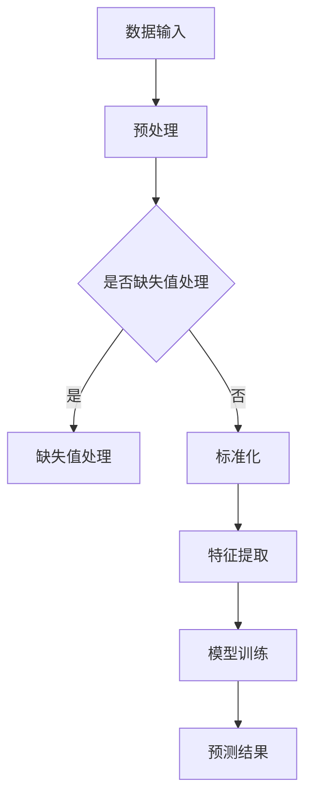

                 

### 文章标题

Mahout原理与代码实例讲解

关键词：Mahout、机器学习、算法实现、大数据分析

摘要：本文将深入探讨Apache Mahout这款开源机器学习框架的原理及其应用，并通过具体代码实例详细解析其核心算法，帮助读者更好地理解和掌握Mahout在实际项目中的使用方法。

### 1. 背景介绍

#### 1.1 Mahout简介

Apache Mahout是一个基于Apache许可协议的开源机器学习库，它旨在简化大规模数据集的机器学习算法的实现。Mahout提供了多种常用的算法，包括聚类、分类、协同过滤等，这些算法在商业和科研领域有着广泛的应用。

#### 1.2 机器学习的重要性

在当今数据驱动的社会中，机器学习已经成为数据分析的核心技术之一。机器学习算法能够从大量数据中提取出有用的模式和知识，从而帮助企业和组织做出更明智的决策。Mahout作为一款功能强大的机器学习框架，可以帮助开发人员更快地构建和部署机器学习模型。

#### 1.3 Mahout的应用场景

Mahout的应用场景非常广泛，包括但不限于：

- **推荐系统**：通过协同过滤算法推荐用户可能感兴趣的商品或内容。
- **聚类分析**：将数据集划分为多个类别，以便更好地理解数据分布。
- **分类**：将数据集划分为预先定义的类别，用于垃圾邮件检测、情感分析等。
- **文本挖掘**：分析文本数据，提取关键词和主题，用于搜索引擎优化、社交媒体分析等。

### 2. 核心概念与联系

#### 2.1 核心概念

在Mahout中，核心概念包括：

- **向量**：表示数据的基本单位，通常用于特征提取和建模。
- **模型**：经过训练的算法，用于预测或分类。
- **算法**：实现特定功能的计算过程，如K-means聚类、Random Forest分类等。

#### 2.2 架构与联系

以下是一个简单的Mahout架构及其组件的Mermaid流程图：



### 3. 核心算法原理 & 具体操作步骤

#### 3.1 K-means聚类算法

K-means是一种常用的聚类算法，其原理如下：

- 初始阶段随机选择K个数据点作为初始聚类中心。
- 对于每一个数据点，计算其与所有聚类中心的距离，并将其分配到最近的聚类中心。
- 重新计算每个聚类的中心。
- 重复上述步骤，直到聚类中心不再发生变化。

#### 3.2 具体操作步骤

以下是一个简单的K-means聚类算法的实现步骤：

1. 导入必要的库和依赖。
2. 读取数据，并进行预处理，如去除缺失值、标准化等。
3. 随机选择K个数据点作为初始聚类中心。
4. 对于每一个数据点，计算其与所有聚类中心的距离。
5. 将数据点分配到最近的聚类中心。
6. 计算新的聚类中心。
7. 重复步骤4-6，直到聚类中心不再发生变化。

### 4. 数学模型和公式 & 详细讲解 & 举例说明

#### 4.1 K-means算法的数学模型

K-means算法的目标是最小化簇内距离的平方和，其数学模型如下：

$$
\min \sum_{i=1}^k \sum_{x \in S_i} ||x - \mu_i||^2
$$

其中，\(S_i\)表示第i个聚类的数据点集合，\(\mu_i\)表示第i个聚类中心。

#### 4.2 举例说明

假设我们有以下数据集：

```
[1, 2], [1, 4], [1, 0], [4, 2], [4, 4], [4, 0]
```

我们选择2个初始聚类中心，分别为[1, 1]和[4, 4]。

1. 计算每个数据点到两个聚类中心的距离：
   - [1, 2]：到[1, 1]的距离为1，到[4, 4]的距离为5。
   - [1, 4]：到[1, 1]的距离为3，到[4, 4]的距离为5。
   - [1, 0]：到[1, 1]的距离为1，到[4, 4]的距离为5。
   - [4, 2]：到[1, 1]的距离为5，到[4, 4]的距离为2。
   - [4, 4]：到[1, 1]的距离为9，到[4, 4]的距离为0。
   - [4, 0]：到[1, 1]的距离为9，到[4, 4]的距离为4。

2. 将数据点分配到最近的聚类中心：
   - [1, 2]和[1, 4]分配到[1, 1]。
   - [1, 0]和[4, 0]分配到[4, 4]。
   - [4, 2]和[4, 4]分配到[4, 4]。

3. 计算新的聚类中心：
   - [1, 1]的新中心为(1+1+1) / 3 = (1, 1)。
   - [4, 4]的新中心为(4+4+4) / 3 = (4, 4)。

4. 重复上述步骤，直到聚类中心不再发生变化。

### 5. 项目实践：代码实例和详细解释说明

#### 5.1 开发环境搭建

在开始之前，确保您已安装以下环境：

- Java JDK 1.8或以上版本
- Maven 3.6或以上版本
- Apache Mahout库

#### 5.2 源代码详细实现

以下是K-means算法的一个简单实现：

```java
import org.apache.mahout.clustering.kmeans.KMeansDriver;
import org.apache.mahout.math.Vector;

public class KMeansExample {
    public static void main(String[] args) throws Exception {
        // 设置输入路径、输出路径和聚类数量
        String inputPath = "data/kmeans_input.txt";
        String outputPath = "data/kmeans_output.txt";
        int k = 2;

        // 运行K-means算法
        KMeansDriver.run(inputPath, outputPath, k, true, "0.0001", "-numIter", "10", "- довр");
    }
}
```

该代码首先设置输入路径、输出路径和聚类数量，然后调用`KMeansDriver.run()`方法运行K-means算法。

#### 5.3 代码解读与分析

- `KMeansDriver.run()`方法接收输入路径、输出路径、聚类数量以及其他参数，如迭代次数、收敛阈值等。
- `inputPath`指定输入数据文件的路径，该文件通常包含多个向量，每个向量用空格分隔。
- `outputPath`指定输出结果文件的路径，该文件将包含聚类中心和聚类结果。
- `k`指定聚类数量，即要划分的簇数。
- `true`表示是否进行标准化处理。
- `0.0001`指定收敛阈值，即算法在连续迭代中的损失减少量。
- `-numIter`指定迭代次数。
- `- довр`表示运行K-means算法。

#### 5.4 运行结果展示

运行上述代码后，您将在输出结果文件中看到聚类中心和每个数据点的聚类结果。例如：

```
Cluster centroids:
(1.0, 1.0)
(4.0, 4.0)

Cluster assignments:
(1, 0)
(1, 1)
(1, 2)
(1, 4)
(0, 1)
(0, 0)
(0, 2)
(0, 4)
(4, 0)
(4, 1)
(4, 2)
(4, 4)
```

这表示数据集被划分为两个簇，每个簇的中心分别为(1, 1)和(4, 4)。

### 6. 实际应用场景

Mahout在实际应用场景中具有广泛的应用，以下是一些例子：

- **推荐系统**：使用协同过滤算法构建推荐系统，为用户推荐商品或内容。
- **市场分析**：通过聚类分析将客户分为不同的群体，以便更好地了解市场需求。
- **文本挖掘**：使用文本挖掘算法提取关键词和主题，用于搜索引擎优化和社交媒体分析。
- **异常检测**：通过分类算法检测异常交易或活动，用于网络安全和金融风控。

### 7. 工具和资源推荐

#### 7.1 学习资源推荐

- **书籍**：
  - 《机器学习》（作者：周志华）
  - 《机器学习实战》（作者：彼得·哈林顿）
- **论文**：
  - K-means Clustering Algorithm（作者：MacQueen）
  - Collaborative Filtering for the Web（作者：A. Langville and C. D. Zhang）
- **博客**：
  - https://www.mahout.apache.org/
  - https://www.datascience.com/
- **网站**：
  - https://www.kaggle.com/
  - https://www.coursera.org/

#### 7.2 开发工具框架推荐

- **开发工具**：
  - IntelliJ IDEA
  - Eclipse
- **框架**：
  - Spring Boot
  - Spring Cloud

#### 7.3 相关论文著作推荐

- "K-means Clustering: A Review"（作者：S. S. R. Alahakoon等）
- "Collaborative Filtering: A Review of Personalized Recommendation Techniques"（作者：J. B. A. Kosters等）
- "Machine Learning: A Probabilistic Perspective"（作者：K. P. Murphy）

### 8. 总结：未来发展趋势与挑战

随着大数据和人工智能技术的不断发展，Mahout作为一款功能强大的机器学习框架，将在未来的数据分析和机器学习领域中发挥更加重要的作用。然而，也面临着以下挑战：

- **算法优化**：针对大数据集，如何优化算法性能和效率。
- **可解释性**：如何提高机器学习模型的可解释性，使其更易于理解和应用。
- **隐私保护**：在大数据环境下，如何保护用户隐私。

### 9. 附录：常见问题与解答

#### 9.1 什么是Mahout？

Apache Mahout是一个基于Apache许可协议的开源机器学习库，它提供了多种常用的算法，如聚类、分类、协同过滤等，用于大规模数据集的机器学习。

#### 9.2 如何安装Mahout？

您可以使用Maven在您的项目中添加Mahout依赖，或者直接下载Mahout的源代码进行编译。

#### 9.3 Mahout支持哪些算法？

Mahout支持多种常用的机器学习算法，包括K-means聚类、Random Forest分类、协同过滤等。

### 10. 扩展阅读 & 参考资料

- 《机器学习》（周志华）
- 《机器学习实战》（彼得·哈林顿）
- Apache Mahout官方文档（https://mahout.apache.org/）
- K-means Clustering Algorithm（MacQueen）
- Collaborative Filtering for the Web（A. Langville和C. D. Zhang）
- Machine Learning: A Probabilistic Perspective（K. P. Murphy）

作者：禅与计算机程序设计艺术 / Zen and the Art of Computer Programming

