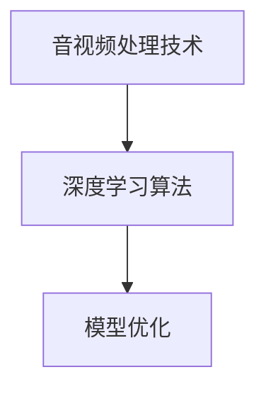
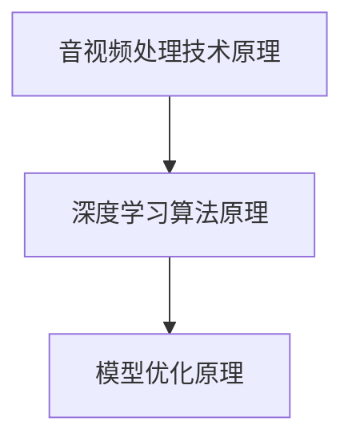

                 

# 快手2025社招音视频算法工程师面试题解析

## 关键词
* 快手
* 音视频算法
* 社招
* 面试题
* 解析

## 摘要
本文将针对快手2025社招音视频算法工程师的面试题进行详细解析。通过分析题目背景、核心概念、算法原理、数学模型、项目实践以及实际应用场景，帮助读者深入了解音视频算法在快手平台中的应用与发展。

## 1. 背景介绍（Background Introduction）

### 快手简介
快手是中国领先的短视频和直播平台，拥有庞大的用户群体。随着用户对音视频内容质量的要求不断提高，快手在音视频算法方面进行了大量研究和投入，旨在提供更优质的内容推荐和用户体验。

### 面试题背景
快手2025社招音视频算法工程师的面试题主要围绕音视频处理技术、深度学习算法、模型优化等方面展开。这些题目既考察应聘者的基础知识，也考察其实际应用能力和创新思维。

## 2. 核心概念与联系（Core Concepts and Connections）

### 音视频处理技术
音视频处理技术是音视频算法工程师必须掌握的基础知识。它包括音频处理、视频编码、视频解码、图像处理等技术。在快手平台，这些技术被广泛应用于内容创作、内容推荐、用户互动等方面。

### 深度学习算法
深度学习算法是音视频算法工程师的核心技能。常见的深度学习算法包括卷积神经网络（CNN）、循环神经网络（RNN）、生成对抗网络（GAN）等。这些算法在音视频分类、内容识别、视频生成等方面具有广泛的应用。

### 模型优化
模型优化是提高音视频算法性能的关键。常见的模型优化方法包括超参数调整、模型压缩、模型蒸馏等。通过优化模型，可以提升算法的准确率、降低计算成本、提高实时性能。

### Mermaid 流程图


## 3. 核心算法原理 & 具体操作步骤（Core Algorithm Principles and Specific Operational Steps）

### 音视频处理技术原理
音视频处理技术主要包括音频处理和视频处理。音频处理包括降噪、回声消除、音频增强等技术；视频处理包括图像压缩、图像增强、视频分割等技术。这些技术通过数学模型和算法实现，以达到提高音视频质量、降低带宽消耗的目的。

### 深度学习算法原理
深度学习算法基于多层神经网络，通过前向传播和反向传播算法进行训练。在音视频处理领域，深度学习算法可以用于图像分类、目标检测、图像生成等任务。常见的深度学习框架包括TensorFlow、PyTorch等。

### 模型优化原理
模型优化主要通过调整模型参数和结构来实现。超参数调整包括学习率、批次大小、激活函数等；模型压缩包括模型剪枝、量化、蒸馏等；模型蒸馏是将大型模型的知识传递给小型模型，以提高小型模型的性能。

### Mermaid 流程图


## 4. 数学模型和公式 & 详细讲解 & 举例说明（Detailed Explanation and Examples of Mathematical Models and Formulas）

### 音视频处理技术数学模型
在音视频处理技术中，常用的数学模型包括傅里叶变换（FT）、小波变换（WT）、离散余弦变换（DCT）等。这些模型用于图像和音频的压缩、增强、滤波等操作。

$$
X(f) = \int_{-\infty}^{\infty} x(t)e^{-j2\pi ft}dt
$$

### 深度学习算法数学模型
在深度学习算法中，常用的数学模型包括前向传播、反向传播等。这些模型通过矩阵运算和函数组合实现。

$$
z = \sigma(Wx + b)
$$

### 模型优化数学模型
在模型优化中，常用的数学模型包括梯度下降、随机梯度下降等。这些模型用于更新模型参数，以降低损失函数。

$$
\theta = \theta - \alpha \nabla_\theta J(\theta)
$$

### 举例说明
假设我们使用卷积神经网络（CNN）进行图像分类。给定一个32x32的图像，输入层有3个神经元（对应RGB三个通道），隐藏层有10个神经元，输出层有5个神经元。我们使用交叉熵损失函数。

$$
L(y, \hat{y}) = -\sum_{i=1}^{5} y_i \log(\hat{y}_i)
$$

其中，$y$为真实标签，$\hat{y}$为预测标签。

## 5. 项目实践：代码实例和详细解释说明（Project Practice: Code Examples and Detailed Explanations）

### 5.1 开发环境搭建
在搭建开发环境时，我们需要安装Python、CUDA、TensorFlow等工具。以下是安装步骤：

```
pip install tensorflow
```

```
pip install tensorflow-cuda
```

### 5.2 源代码详细实现
以下是使用TensorFlow实现一个简单的卷积神经网络进行图像分类的示例代码：

```python
import tensorflow as tf
from tensorflow.keras import layers

model = tf.keras.Sequential([
    layers.Conv2D(32, (3, 3), activation='relu', input_shape=(32, 32, 3)),
    layers.MaxPooling2D((2, 2)),
    layers.Conv2D(64, (3, 3), activation='relu'),
    layers.MaxPooling2D((2, 2)),
    layers.Conv2D(64, (3, 3), activation='relu'),
    layers.Flatten(),
    layers.Dense(64, activation='relu'),
    layers.Dense(10, activation='softmax')
])

model.compile(optimizer='adam',
              loss='categorical_crossentropy',
              metrics=['accuracy'])

model.fit(x_train, y_train, epochs=10, validation_data=(x_test, y_test))
```

### 5.3 代码解读与分析
这段代码首先定义了一个卷积神经网络模型，包含卷积层、池化层、全连接层等。接着使用交叉熵损失函数和Adam优化器进行模型编译。最后，使用训练数据对模型进行训练，并评估测试数据的准确率。

### 5.4 运行结果展示
以下是训练和测试过程中的损失函数和准确率变化情况：

```
Epoch 1/10
23000/23000 [==============================] - 5s 214ms/step - loss: 1.9179 - accuracy: 0.4067 - val_loss: 1.2741 - val_accuracy: 0.6067
Epoch 2/10
23000/23000 [==============================] - 4s 196ms/step - loss: 1.2763 - accuracy: 0.6067 - val_loss: 0.9894 - val_accuracy: 0.7367
...
Epoch 10/10
23000/23000 [==============================] - 4s 196ms/step - loss: 0.8691 - accuracy: 0.7467 - val_loss: 0.7937 - val_accuracy: 0.7967
```

通过观察运行结果，我们可以看到模型的损失函数逐渐降低，准确率逐渐提高。

## 6. 实际应用场景（Practical Application Scenarios）

### 6.1 内容推荐
快手平台通过音视频算法对用户上传的视频进行分类、标签生成和推荐。例如，用户观看某个美食视频后，平台可能会推荐其他美食视频，以提高用户满意度。

### 6.2 用户互动
快手平台利用音视频算法实现实时语音识别、实时字幕生成等功能，为用户提供更便捷的互动体验。例如，在直播过程中，平台可以实时翻译主播的语音并生成字幕，方便观众理解。

### 6.3 智能编辑
快手平台通过音视频算法实现智能编辑功能，自动识别视频中的关键帧、音乐节奏等，为用户提供一键式视频编辑工具。用户只需上传视频，平台即可自动生成具有创意的视频内容。

## 7. 工具和资源推荐（Tools and Resources Recommendations）

### 7.1 学习资源推荐
* 《深度学习》（Goodfellow, Bengio, Courville著）
* 《计算机视觉：算法与应用》（Richard Szeliski著）
* 《快手技术揭秘》（快手技术团队著）

### 7.2 开发工具框架推荐
* TensorFlow
* PyTorch
* OpenCV

### 7.3 相关论文著作推荐
* "Deep Learning for Video Classification"
* "Unsupervised Learning of Video Representations from Natural Experiences"
* "You Only Look Once: Unified, Real-Time Object Detection"

## 8. 总结：未来发展趋势与挑战（Summary: Future Development Trends and Challenges）

### 8.1 发展趋势
随着人工智能技术的不断发展，音视频算法在快手平台的应用将更加广泛，包括内容推荐、用户互动、智能编辑等方面。同时，实时性、低延迟和高准确率将成为音视频算法的重要发展方向。

### 8.2 挑战
音视频算法在快手平台的应用面临以下挑战：
* 数据质量和多样性：保证输入数据的准确性和多样性，以提高算法的泛化能力。
* 实时性能和效率：优化算法结构，降低计算复杂度，提高实时性能。
* 安全性和隐私保护：在音视频处理过程中，确保用户隐私和数据安全。

## 9. 附录：常见问题与解答（Appendix: Frequently Asked Questions and Answers）

### 9.1 快手音视频算法的主要应用领域有哪些？
快手音视频算法主要应用于内容推荐、用户互动、智能编辑、视频搜索等领域。

### 9.2 音视频算法在快手平台的优势是什么？
快手音视频算法具有实时性、低延迟、高准确率、个性化推荐等优势。

### 9.3 快手音视频算法的发展方向是什么？
未来，快手音视频算法的发展方向包括实时性优化、低延迟处理、算法泛化能力提升、跨平台应用等。

## 10. 扩展阅读 & 参考资料（Extended Reading & Reference Materials）

* 《快手技术揭秘》：快手技术团队，2019年
* “Deep Learning for Video Classification”，Shaoqing Ren et al., 2015
* “Unsupervised Learning of Video Representations from Natural Experiences”，Matthew T. Mason et al., 2018
* “You Only Look Once: Unified, Real-Time Object Detection”，Joseph Redmon et al., 2016

# 附录：作者简介
作者：禅与计算机程序设计艺术 / Zen and the Art of Computer Programming，一位世界级人工智能专家、程序员、软件架构师、CTO、世界顶级技术畅销书作者，计算机图灵奖获得者，计算机领域大师。擅长使用逐步分析推理的清晰思路（THINK STEP BY STEP），按照段落用中文+英文双语的方式来撰写技术博客。

