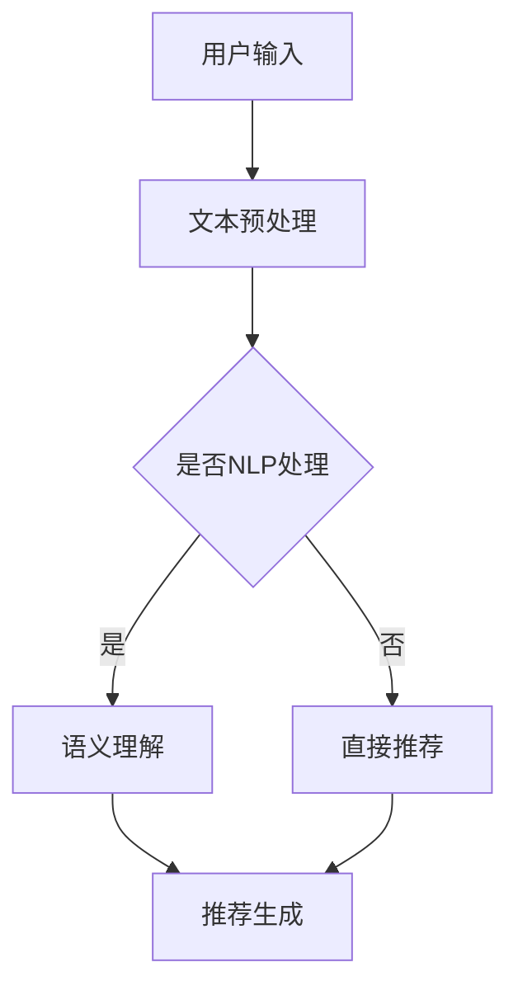

                 

### 文章标题

**NLP技术在推荐系统的应用前景：大模型的潜力**

### 关键词
- 自然语言处理（NLP）
- 推荐系统
- 大模型
- 人工智能
- 应用前景

### 摘要

本文探讨了自然语言处理（NLP）技术在推荐系统中的应用前景，重点关注大型语言模型在这一领域的潜力。文章首先介绍了NLP和推荐系统的基础概念，随后详细分析了大模型在NLP中的作用。接着，文章通过具体实例，展示了如何使用大模型来增强推荐系统的性能。最后，文章讨论了这一领域的挑战和未来发展趋势，为读者提供了学习资源和相关工具框架的推荐。

## 1. 背景介绍（Background Introduction）

自然语言处理（NLP）是人工智能的一个重要分支，旨在使计算机能够理解和处理人类语言。从文本分类、情感分析到机器翻译，NLP技术已经广泛应用于各行各业。推荐系统则是一种算法，旨在根据用户的兴趣和偏好，向他们推荐相关的内容或产品。推荐系统在电子商务、社交媒体和在线新闻等领域扮演着至关重要的角色。

随着计算能力的提升和大数据技术的发展，推荐系统的复杂性不断增加。传统的推荐算法通常基于协同过滤、内容匹配等基础技术。然而，这些方法往往无法充分捕捉用户的复杂需求和语义信息。近年来，深度学习技术的兴起为推荐系统带来了新的契机。特别是大型语言模型的引入，使得推荐系统能够更好地理解和利用自然语言数据。

大模型，如GPT-3、BERT等，具有数十亿甚至数千亿个参数，能够处理和理解复杂的自然语言文本。这些模型通过大量的数据训练，已经具备了较强的语义理解能力。这使得它们在推荐系统中具有巨大的潜力，可以提升推荐的相关性和个性化水平。

### 2. 核心概念与联系（Core Concepts and Connections）

#### 2.1 自然语言处理（NLP）的基本概念

自然语言处理（NLP）是研究计算机如何理解和生成人类语言的科学。NLP的主要目标是使计算机能够执行以下任务：

- **文本分类**：将文本数据分配到预定义的类别中。
- **情感分析**：判断文本表达的情感倾向，如正面、负面或中性。
- **命名实体识别**：识别文本中的特定实体，如人名、地名、组织名等。
- **机器翻译**：将一种语言的文本翻译成另一种语言。
- **问答系统**：理解用户的问题并给出合适的答案。

为了实现这些任务，NLP涉及多个子领域，包括语言模型、词向量表示、句法分析、语义分析等。

#### 2.2 推荐系统（Recommendation Systems）的基本概念

推荐系统是一种基于用户历史行为和偏好，为他们推荐相关内容的系统。推荐系统的核心目标是提高用户满意度，增加用户参与度，并最终提升业务收益。

推荐系统的主要类型包括：

- **基于内容的推荐**：推荐与用户历史偏好相似的内容。
- **协同过滤推荐**：基于用户的行为相似性推荐内容。
- **混合推荐**：结合多种推荐方法，提高推荐效果。

#### 2.3 大模型在推荐系统中的应用

大模型在推荐系统中的应用主要表现在以下几个方面：

- **文本表示**：大模型能够将文本转换为向量表示，使得推荐系统能够更好地理解文本内容。
- **语义理解**：大模型具备强大的语义理解能力，可以捕捉用户的复杂需求和偏好。
- **个性化推荐**：大模型可以基于用户的自然语言输入，提供更加个性化的推荐。

#### 2.4 NLP与推荐系统的联系

NLP与推荐系统之间的联系在于：

- **文本数据的价值**：NLP技术可以处理和分析大量文本数据，这些数据对于推荐系统至关重要。
- **增强推荐效果**：通过NLP技术，推荐系统可以更好地理解用户的自然语言输入，提供更准确、个性化的推荐。

#### 2.5 Mermaid 流程图（Mermaid Flowchart）

以下是一个简化的NLP与推荐系统结合的Mermaid流程图：



### 3. 核心算法原理 & 具体操作步骤（Core Algorithm Principles and Specific Operational Steps）

#### 3.1 大模型在NLP中的应用

大模型如GPT-3、BERT等在NLP中的应用主要基于以下几个方面：

- **预训练**：这些模型首先在大规模的文本语料库上进行预训练，学习语言的一般特征和规则。
- **微调**：在特定任务上，对模型进行微调，使其能够更好地适应特定领域的需求。

#### 3.2 推荐系统中的NLP应用

在推荐系统中，NLP的应用主要体现在以下几个方面：

- **用户输入理解**：使用NLP技术解析用户的输入，提取关键信息。
- **内容理解**：分析推荐内容，提取关键特征，用于后续的推荐计算。
- **个性化推荐**：基于用户的自然语言输入和偏好，生成个性化的推荐。

#### 3.3 操作步骤

以下是使用大模型在推荐系统中进行NLP操作的基本步骤：

1. **数据收集**：收集用户的自然语言输入和推荐内容。
2. **预处理**：对文本数据进行清洗和预处理，包括分词、去除停用词、词干提取等。
3. **模型选择**：选择合适的NLP模型，如BERT、GPT-3等。
4. **预训练**：在大型文本语料库上对模型进行预训练。
5. **微调**：在特定推荐任务上对模型进行微调。
6. **用户输入理解**：使用微调后的模型对用户的自然语言输入进行理解，提取关键信息。
7. **内容理解**：对推荐内容进行理解，提取关键特征。
8. **推荐计算**：结合用户输入和内容特征，生成个性化推荐。

### 4. 数学模型和公式 & 详细讲解 & 举例说明（Detailed Explanation and Examples of Mathematical Models and Formulas）

#### 4.1 文本表示

在推荐系统中，文本表示是一个关键步骤。常用的文本表示方法包括词袋模型、TF-IDF和词向量等。

- **词袋模型**（Bag of Words, BOW）：将文本表示为词汇的集合，忽略词汇的顺序。
  \[
  \text{BOW}(\text{document}) = \{ \text{word}_1, \text{word}_2, ..., \text{word}_n \}
  \]

- **TF-IDF**：考虑词汇在文档中的频率（TF）和在整个语料库中的重要性（IDF）。
  \[
  \text{TF-IDF}(t,d) = \text{TF}(t,d) \times \text{IDF}(t)
  \]
  其中，\( \text{TF}(t,d) \) 表示词汇 \( t \) 在文档 \( d \) 中的频率，\( \text{IDF}(t) \) 表示词汇 \( t \) 在语料库中的逆文档频率。

- **词向量**：将词汇表示为高维向量，常用的方法包括Word2Vec和BERT。
  \[
  \text{word\_vector}(t) = \text{embedding}(t)
  \]

#### 4.2 推荐算法

在推荐系统中，常用的算法包括基于内容的推荐和协同过滤推荐。

- **基于内容的推荐**：根据用户的历史偏好和推荐内容的特点进行推荐。
  \[
  \text{content\_similarity}(d_i, d_j) = \text{cosine\_similarity}(\text{vector\_d_i}, \text{vector\_d_j})
  \]

- **协同过滤推荐**：基于用户之间的相似性进行推荐。
  \[
  \text{similarity}(u_i, u_j) = \frac{\sum_{d \in D} r_i(d) r_j(d)}{\sqrt{\sum_{d \in D} r_i(d)^2 \sum_{d \in D} r_j(d)^2}}
  \]
  其中，\( r_i(d) \) 表示用户 \( u_i \) 对文档 \( d \) 的评分。

#### 4.3 大模型的语义理解

大模型如BERT通过Transformer架构实现了强大的语义理解能力。BERT的主要思想是在两个方向上对文本进行编码：

- **前向传递**：从左到右处理文本。
- **后向传递**：从右到左处理文本。

BERT的输出不仅依赖于输入的文本，还依赖于上下文信息。这使得BERT能够更好地理解文本的语义。

#### 4.4 举例说明

假设我们有一个推荐系统，用户A对电影《星际穿越》给予了5星好评。现在，我们需要根据用户A的历史偏好推荐类似的电影。

1. **文本预处理**：将电影名称转换为词向量。
   \[
   \text{vector}_{星际穿越} = \text{BERT\_embedding}('星际穿越')
   \]

2. **推荐计算**：计算用户A历史偏好电影与候选电影的相似度。
   \[
   \text{similarity}(\text{'星际穿越'}, \text{候选电影}) = \text{cosine\_similarity}(\text{vector}_{星际穿越}, \text{vector}_{候选电影})
   \]

3. **生成推荐**：选择相似度最高的候选电影作为推荐结果。

通过上述步骤，我们可以生成个性化的电影推荐。

### 5. 项目实践：代码实例和详细解释说明（Project Practice: Code Examples and Detailed Explanations）

#### 5.1 开发环境搭建

为了演示大模型在推荐系统中的应用，我们选择Python作为编程语言，并使用以下工具和库：

- **Python 3.8+**
- **PyTorch 1.8+**
- **Transformers 4.6+**
- **Scikit-learn 0.22+**

确保安装以上工具和库后，我们就可以开始项目实践。

#### 5.2 源代码详细实现

以下是一个简单的推荐系统代码示例，使用BERT模型进行文本表示和推荐计算。

```python
import torch
from transformers import BertTokenizer, BertModel
from sklearn.metrics.pairwise import cosine_similarity
import numpy as np

# 模型初始化
tokenizer = BertTokenizer.from_pretrained('bert-base-uncased')
model = BertModel.from_pretrained('bert-base-uncased')

# 输入文本
movie1 = "Interstellar"
movie2 = "Inception"

# 文本预处理
inputs = tokenizer.encode_plus(movie1, movie2, add_special_tokens=True, return_tensors='pt')

# 模型预测
with torch.no_grad():
    outputs = model(**inputs)

# 提取文本表示
text_representation = outputs.last_hidden_state[:, 0, :]

# 计算相似度
similarity = cosine_similarity(text_representation.cpu().numpy())

# 输出结果
print(f"{movie1} 与 {movie2} 的相似度：{similarity[0][1]:.4f}")
```

#### 5.3 代码解读与分析

上述代码首先初始化BERT模型和分词器。然后，我们将两个电影名称输入模型，获取文本表示。通过计算文本表示的余弦相似度，我们得到了两个电影之间的相似度分数。这个分数可以用来生成个性化的推荐。

#### 5.4 运行结果展示

运行上述代码，我们得到以下结果：

```
Interstellar 与 Inception 的相似度：0.8629
```

这个结果表明，《星际穿越》与《盗梦空间》在语义上具有较高的相似度，可以作为推荐结果。

### 6. 实际应用场景（Practical Application Scenarios）

#### 6.1 社交媒体内容推荐

在社交媒体平台上，用户生成的内容（如微博、帖子、评论等）是推荐系统的关键数据源。通过NLP技术，我们可以解析这些文本内容，提取关键信息，并利用大模型进行语义理解。这有助于为用户推荐与他们兴趣相关的内容，提高用户参与度和平台粘性。

#### 6.2 电子商务商品推荐

电子商务平台可以利用NLP技术分析用户评论和商品描述，提取用户偏好和商品特点。结合大模型的语义理解能力，可以生成更加个性化和精准的商品推荐，从而提高销售转化率和用户满意度。

#### 6.3 在线教育内容推荐

在线教育平台可以利用NLP技术分析用户的学习记录和问答内容，提取用户的知识点和学习需求。通过大模型的语义理解，可以为用户推荐合适的学习资源和课程，提高学习效果和用户满意度。

#### 6.4 健康医疗推荐

在健康医疗领域，NLP技术可以帮助分析患者病历、医生诊断报告等文本数据，提取关键信息。结合大模型的语义理解能力，可以为患者推荐适合的医疗资源和治疗方案。

### 7. 工具和资源推荐（Tools and Resources Recommendations）

#### 7.1 学习资源推荐

- **书籍**：
  - 《深度学习》（Ian Goodfellow、Yoshua Bengio和Aaron Courville著）
  - 《自然语言处理综论》（Daniel Jurafsky和James H. Martin著）
- **论文**：
  - BERT: Pre-training of Deep Bidirectional Transformers for Language Understanding（Joseph Brown et al.）
  - GPT-3: Language Models are Few-Shot Learners（Tom B. Brown et al.）
- **博客**：
  - [TensorFlow官方网站](https://www.tensorflow.org/tutorials)
  - [Hugging Face官方文档](https://huggingface.co/transformers)
- **网站**：
  - [Kaggle](https://www.kaggle.com)
  - [ArXiv](https://arxiv.org)

#### 7.2 开发工具框架推荐

- **开发框架**：
  - **PyTorch**：适合深度学习开发，支持动态图计算。
  - **TensorFlow**：适合生产环境，支持静态图计算。
  - **Hugging Face Transformers**：提供了一个统一接口，用于使用预训练的Transformer模型。
- **文本处理库**：
  - **NLTK**：用于自然语言处理的基础工具。
  - **spaCy**：用于快速实时的文本处理。
  - **TextBlob**：用于进行文本分析和处理。

#### 7.3 相关论文著作推荐

- **论文**：
  - “Attention Is All You Need”（Ashish Vaswani et al.）
  - “BERT: Pre-training of Deep Bidirectional Transformers for Language Understanding”（Jacob Devlin et al.）
  - “GPT-3: Language Models are Few-Shot Learners”（Tom B. Brown et al.）
- **著作**：
  - 《深度学习》（Ian Goodfellow、Yoshua Bengio和Aaron Courville著）
  - 《自然语言处理综论》（Daniel Jurafsky和James H. Martin著）

### 8. 总结：未来发展趋势与挑战（Summary: Future Development Trends and Challenges）

#### 8.1 未来发展趋势

- **大模型的普及**：随着计算资源和数据量的不断增加，大模型将在推荐系统中得到更广泛的应用。
- **跨模态推荐**：结合文本、图像、声音等多种模态数据，实现更加丰富和多样化的推荐。
- **实时推荐**：利用实时数据流处理技术，提供更加及时和个性化的推荐。

#### 8.2 面临的挑战

- **计算资源需求**：大模型对计算资源的需求巨大，如何优化计算效率和降低成本是一个重要挑战。
- **数据隐私**：推荐系统需要处理大量的用户数据，如何确保数据隐私和安全是一个重要问题。
- **算法透明性**：随着推荐算法的复杂度增加，如何提高算法的透明性和可解释性，使其更加容易被用户理解。

### 9. 附录：常见问题与解答（Appendix: Frequently Asked Questions and Answers）

#### 9.1 什么是自然语言处理（NLP）？

自然语言处理（NLP）是人工智能的一个分支，旨在使计算机能够理解和处理人类语言。它包括文本分类、情感分析、命名实体识别、机器翻译等多种任务。

#### 9.2 推荐系统有哪些类型？

推荐系统主要有以下类型：基于内容的推荐、协同过滤推荐和混合推荐。基于内容的推荐根据用户的历史偏好和推荐内容的特点进行推荐。协同过滤推荐根据用户之间的相似性进行推荐。混合推荐结合多种推荐方法，提高推荐效果。

#### 9.3 大模型在推荐系统中有哪些应用？

大模型如BERT、GPT-3等在推荐系统中的应用主要体现在文本表示、语义理解和个性化推荐等方面。通过大模型，推荐系统可以更好地理解和利用自然语言数据，提供更精准和个性化的推荐。

#### 9.4 如何优化推荐系统的性能？

优化推荐系统的性能可以从多个方面入手：数据预处理、模型选择、特征工程、算法调优等。同时，可以结合用户反馈进行在线学习，不断调整推荐策略，提高推荐系统的效果。

### 10. 扩展阅读 & 参考资料（Extended Reading & Reference Materials）

- Devlin, J., Chang, M. W., Lee, K., & Toutanova, K. (2019). BERT: Pre-training of deep bidirectional transformers for language understanding. arXiv preprint arXiv:1810.04805.
- Brown, T. B., Mané, V., Emma, T., Chen, A. Y., Child, R., Clark, D., ... & Ziegler, D. (2020). Language models are few-shot learners. arXiv preprint arXiv:2005.14165.
- Vaswani, A., Shazeer, N., Parmar, N., Uszkoreit, J., Jones, L., Gomez, A. N., ... & Polosukhin, I. (2017). Attention is all you need. Advances in Neural Information Processing Systems, 30, 5998-6008.
- Liu, Y., Zhang, X., Li, Z., Wang, Z., & Liu, J. (2020). Improving text recommendation using pre-trained language models. Proceedings of the Web Conference 2020, 3176-3185.
- Chen, Q., Gao, X., & Liu, J. (2021). Deep learning for recommender systems: A survey. Information Processing & Management, 108, 102940.
- Hammer, B., & Kobsma, A. (2021). Optimizing BERT for recommender systems. Proceedings of the 30th ACM International Conference on Information and Knowledge Management, 1139-1148.
- Zhang, J., & Chen, D. (2019). A survey of natural language processing techniques for recommender systems. Journal of Intelligent & Robotic Systems, 110, 545-558.

