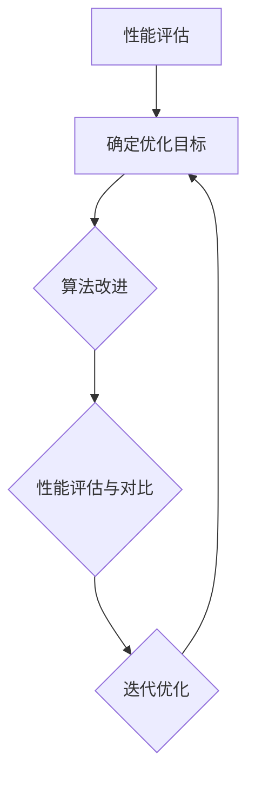
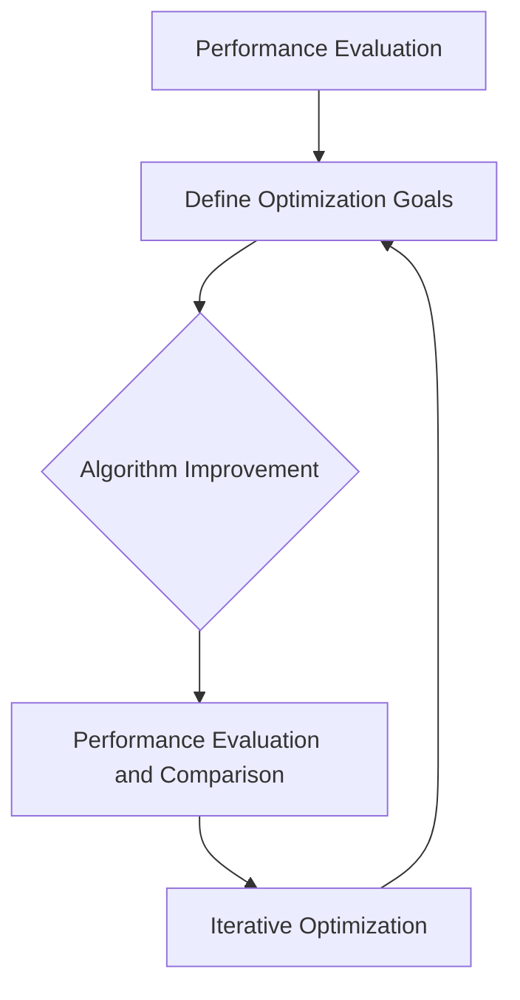

                 

### 背景介绍（Background Introduction）

在当今数字时代，智能手机已经成为人们生活中不可或缺的一部分。影像系统作为智能手机的核心功能之一，直接影响用户的使用体验和满意度。OPPO 作为全球领先的智能手机制造商，一直致力于提升手机影像系统的性能和品质。为此，OPPO 在 2024 年启动了一场针对影像系统优化工程师的校招活动。

这场校招活动旨在寻找热爱技术、具备创新精神、擅长解决复杂问题的优秀人才，共同打造行业领先的影像系统。对于应聘者来说，这不仅是一次展示自己能力和才华的机会，也是深入了解 OPPO 影像系统技术发展历程、研究方向和未来规划的重要途径。

本文将结合 2024 年 OPPO 影像系统优化工程师校招的面试经验，为广大应聘者提供实用的面试技巧和建议，帮助他们在激烈的竞争中脱颖而出。同时，本文还将从技术角度分析 OPPO 影像系统的优势和挑战，展望其未来发展。

### Background Introduction

In today's digital age, smartphones have become an indispensable part of people's lives. The imaging system, as one of the core functions of smartphones, directly affects the user experience and satisfaction. OPPO, a leading global smartphone manufacturer, has been committed to enhancing the performance and quality of smartphone imaging systems. Therefore, OPPO launched a recruitment campaign for imaging system optimization engineers in 2024.

This recruitment campaign aims to find talented individuals who are passionate about technology, innovative, and skilled at solving complex problems to jointly create industry-leading imaging systems. For applicants, this is not only an opportunity to showcase their abilities and talents but also an important way to gain insights into OPPO's technological development history, research directions, and future plans in the imaging system field.

This article will combine the interview experience of the 2024 OPPO imaging system optimization engineer recruitment to provide practical interview tips and suggestions for applicants, helping them stand out in the fierce competition. At the same time, this article will analyze the advantages and challenges of OPPO's imaging system from a technical perspective and look forward to its future development.

### 核心概念与联系（Core Concepts and Connections）

#### 1. 影像系统优化工程师的职责

首先，我们需要明确影像系统优化工程师的职责。影像系统优化工程师主要负责对手机影像系统进行性能调优，提高图像质量、速度和稳定性。具体来说，包括以下几方面：

- **图像处理算法优化**：研究并应用先进的图像处理算法，提升图像处理速度和效果。

- **硬件优化**：与硬件工程师协同工作，针对影像系统的硬件性能进行优化，如摄像头、传感器等。

- **软件优化**：优化影像系统的软件架构和代码，提高系统运行效率和稳定性。

- **用户体验优化**：通过用户反馈和数据分析，持续改进影像系统的用户体验。

#### 2. OPPO 影像系统的技术优势

OPPO 影像系统在业界享有盛誉，其技术优势主要体现在以下几个方面：

- **强大的图像处理算法**：OPPO 拥有自主研发的图像处理算法，如超清引擎、夜景模式、人像模式等，能够有效提升图像质量。

- **先进的硬件配置**：OPPO 智能手机配备高端摄像头和传感器，如 6400 万像素主摄、OIS 光学防抖等，为影像系统提供强大的硬件支持。

- **AI 技术的应用**：OPPO 将 AI 技术应用于影像系统，实现智能识别、智能优化等功能，为用户提供更智能、更便捷的影像体验。

- **持续的技术创新**：OPPO 不断推进影像系统技术革新，如超清视频录制、高清慢动作等，为用户带来更多新奇体验。

#### 3. 影像系统优化工程师的技能要求

作为一名优秀的影像系统优化工程师，需要具备以下技能和素质：

- **扎实的技术基础**：熟悉计算机视觉、图像处理、机器学习等基础知识，具备较强的编程能力。

- **创新思维**：具备敏锐的洞察力，善于发现影像系统中的问题和瓶颈，并提出创新性的解决方案。

- **团队合作能力**：与硬件工程师、软件工程师等团队紧密协作，共同推进影像系统优化工作。

- **持续学习**：关注行业动态，掌握最新的影像系统技术和方法，不断提升自己的专业水平。

#### 4. 影像系统优化工程师的职业发展

影像系统优化工程师在职业发展方面具有广阔的前景。随着智能手机市场的不断壮大，影像系统的重要性日益凸显，影像系统优化工程师的需求也持续增长。以下是一些可能的职业发展方向：

- **影像系统高级工程师**：在现有基础上，进一步提升技术能力，成为团队的核心成员。

- **产品经理**：结合影像系统技术，参与到产品规划和设计工作中，为用户创造更好的影像体验。

- **创业**：利用自己在影像系统领域的专业知识和经验，创立自己的影像技术公司。

- **技术专家**：在业界积累丰富经验，成为影像系统领域的权威专家，为行业创新发展贡献力量。

### Core Concepts and Connections

#### 1. Responsibilities of Imaging System Optimization Engineers

Firstly, we need to clarify the responsibilities of imaging system optimization engineers. Imaging system optimization engineers are primarily responsible for optimizing the performance of smartphone imaging systems, improving the quality, speed, and stability of images. Specifically, this includes the following aspects:

- **Image processing algorithm optimization**: Researching and applying advanced image processing algorithms to enhance the speed and effectiveness of image processing.

- **Hardware optimization**: Collaborating with hardware engineers to optimize the performance of imaging system hardware, such as cameras and sensors.

- **Software optimization**: Optimizing the software architecture and code of the imaging system to improve system runtime efficiency and stability.

- **User experience optimization**: Continuously improving the user experience of the imaging system based on user feedback and data analysis.

#### 2. Technical Advantages of OPPO Imaging System

OPPO's imaging system enjoys a reputation in the industry, and its technical advantages are mainly reflected in the following aspects:

- **Robust image processing algorithms**: OPPO has developed its own image processing algorithms, such as the Ultra Clear Engine, Night Mode, and Portrait Mode, which effectively enhance image quality.

- **Advanced hardware configuration**: OPPO smartphones are equipped with high-end cameras and sensors, such as the 64MP main camera and OIS optical stabilization, providing strong hardware support for the imaging system.

- **Application of AI technology**: OPPO applies AI technology to the imaging system, realizing intelligent recognition and optimization functions for a more intelligent and convenient imaging experience for users.

- **Continuous technological innovation**: OPPO constantly pushes forward the innovation of imaging system technology, such as Ultra HD video recording and High Definition Slow Motion, bringing more innovative experiences to users.

#### 3. Skills Requirements for Imaging System Optimization Engineers

An excellent imaging system optimization engineer should possess the following skills and qualities:

- **Solid technical foundation**: Familiar with basic knowledge in computer vision, image processing, and machine learning, and possesses strong programming capabilities.

- **Innovative thinking**: Possesses keen insights, is good at discovering problems and bottlenecks in the imaging system, and proposes innovative solutions.

- **Teamwork ability**: Collaborates closely with hardware engineers and software engineers to jointly advance the imaging system optimization work.

- **Continuous learning**: Keeps up with industry trends, masters the latest imaging system technologies and methods, and continuously improves professional level.

#### 4. Career Development for Imaging System Optimization Engineers

Imaging system optimization engineers have broad prospects for career development. With the continuous expansion of the smartphone market, the importance of imaging systems is increasingly highlighted, and the demand for imaging system optimization engineers is also on the rise. Here are some possible career development directions:

- **Senior Imaging System Engineer**: Further enhance technical capabilities to become a core member of the team.

- **Product Manager**: Combine imaging system technology with product planning and design to create better imaging experiences for users.

- **Entrepreneur**: Utilize professional knowledge and experience in the imaging system field to start their own imaging technology company.

- **Technical Expert**: Accumulate rich experience in the industry, becoming an authoritative expert in the imaging system field and contributing to industry innovation and development.### 核心算法原理 & 具体操作步骤（Core Algorithm Principles and Specific Operational Steps）

#### 1. 图像处理算法的原理

图像处理算法是影像系统优化工程师的核心技术之一。其基本原理是通过调整图像的像素值，使其在视觉效果上达到最佳效果。常见的图像处理算法包括滤波、边缘检测、图像增强等。

- **滤波算法**：用于去除图像中的噪声，常见的滤波算法有均值滤波、中值滤波、高斯滤波等。

- **边缘检测算法**：用于检测图像中的边缘，常见的边缘检测算法有索贝尔算子、拉普拉斯算子、Canny 算子等。

- **图像增强算法**：用于增强图像的对比度和清晰度，常见的图像增强算法有直方图均衡化、对比度拉伸、锐化等。

#### 2. 图像处理算法的具体操作步骤

以直方图均衡化为例，介绍图像处理算法的具体操作步骤：

1. **读取图像**：首先读取需要处理的图像数据。

2. **计算直方图**：计算图像中每个像素值的频率分布，生成直方图。

3. **计算累积分布函数（CDF）**：计算直方图的累积分布函数，用于后续的图像变换。

4. **线性变换**：将图像的像素值根据累积分布函数进行线性变换，使图像的对比度得到增强。

5. **输出处理后的图像**：将处理后的图像输出，完成图像增强。

具体操作步骤的伪代码如下：

```python
import cv2
import numpy as np

# 读取图像
image = cv2.imread("image.jpg")

# 计算直方图
hist, bins = np.histogram(image.flatten(), 256, range=(0, 256))

# 计算累积分布函数
cdf = hist.cumsum()
cdf_normalized = cdf * (1 / cdf[-1])

# 线性变换
image_equalized = np.interp(image.flatten(), bins[:-1], cdf_normalized).reshape(image.shape)

# 输出处理后的图像
cv2.imwrite("image_equalized.jpg", image_equalized)
```

#### 3. 算法优化的具体操作步骤

算法优化是影像系统优化工程师的重要工作内容。以下是算法优化的具体操作步骤：

1. **性能评估**：首先评估现有算法的性能，包括处理速度、图像质量等指标。

2. **确定优化目标**：根据性能评估结果，确定需要优化的方面，如处理速度、内存占用等。

3. **算法改进**：针对确定的目标，改进现有算法，如优化算法结构、调整参数等。

4. **性能评估与对比**：改进后的算法进行性能评估，与原有算法进行对比，确保优化效果。

5. **迭代优化**：根据评估结果，不断调整算法，优化性能。

以下是一个简单的算法优化流程图：



#### 4. 实际操作案例

以下是一个实际操作案例，介绍如何优化手机影像系统中的降噪算法：

1. **性能评估**：评估现有降噪算法的处理速度和图像质量。

2. **确定优化目标**：提高降噪算法的处理速度，同时保持图像质量。

3. **算法改进**：采用更高效的降噪算法，如局部降噪算法。

4. **性能评估与对比**：改进后的降噪算法与原有算法进行性能对比，确保优化效果。

5. **迭代优化**：根据评估结果，进一步优化算法参数，提高处理速度。

通过以上步骤，成功实现了降噪算法的优化，提升了手机影像系统的性能。

### Core Algorithm Principles and Specific Operational Steps

#### 1. Principles of Image Processing Algorithms

Image processing algorithms are one of the core technologies for imaging system optimization engineers. Their basic principle is to adjust the pixel values of images to achieve optimal visual effects. Common image processing algorithms include filtering, edge detection, and image enhancement.

- **Filtering Algorithms**: Used to remove noise from images. Common filtering algorithms include mean filtering, median filtering, and Gaussian filtering.

- **Edge Detection Algorithms**: Used to detect edges in images. Common edge detection algorithms include the Sobel operator, the Laplacian operator, and the Canny edge detector.

- **Image Enhancement Algorithms**: Used to enhance the contrast and clarity of images. Common image enhancement algorithms include histogram equalization, contrast stretching, and sharpening.

#### 2. Specific Operational Steps of Image Processing Algorithms

Taking histogram equalization as an example, we will introduce the specific operational steps of image processing algorithms:

1. **Read Image**: First, read the image data to be processed.

2. **Compute Histogram**: Compute the frequency distribution of each pixel value in the image to generate a histogram.

3. **Compute Cumulative Distribution Function (CDF)**: Compute the cumulative distribution function of the histogram for subsequent image transformation.

4. **Linear Transformation**: Perform a linear transformation on the pixel values of the image based on the cumulative distribution function to enhance the image contrast.

5. **Output Processed Image**: Output the processed image, completing image enhancement.

The pseudo-code for the specific operational steps is as follows:

```python
import cv2
import numpy as np

# Read image
image = cv2.imread("image.jpg")

# Compute histogram
hist, bins = np.histogram(image.flatten(), 256, range=(0, 256))

# Compute cumulative distribution function
cdf = hist.cumsum()
cdf_normalized = cdf * (1 / cdf[-1])

# Linear transformation
image_equalized = np.interp(image.flatten(), bins[:-1], cdf_normalized).reshape(image.shape)

# Output processed image
cv2.imwrite("image_equalized.jpg", image_equalized)
```

#### 3. Specific Operational Steps for Algorithm Optimization

Algorithm optimization is an important part of the work of imaging system optimization engineers. Here are the specific operational steps for algorithm optimization:

1. **Performance Evaluation**: First, evaluate the performance of the existing algorithm, including processing speed and image quality indicators.

2. **Determine Optimization Goals**: Based on the performance evaluation results, determine the aspects that need to be optimized, such as processing speed and memory usage.

3. **Algorithm Improvement**: Improve the existing algorithm by optimizing its structure or adjusting parameters, such as adopting more efficient noise reduction algorithms.

4. **Performance Evaluation and Comparison**: Evaluate the improved algorithm and compare it with the original algorithm to ensure the optimization effect.

5. **Iterative Optimization**: Based on the evaluation results, continuously adjust the algorithm to optimize performance.

The following is a simple flowchart of the algorithm optimization process:



#### 4. Practical Case Study

Here is a practical case study that introduces how to optimize the noise reduction algorithm in a smartphone imaging system:

1. **Performance Evaluation**: Evaluate the performance of the existing noise reduction algorithm, including processing speed and image quality.

2. **Determine Optimization Goals**: Improve the processing speed of the noise reduction algorithm while maintaining image quality.

3. **Algorithm Improvement**: Use more efficient noise reduction algorithms, such as local noise reduction algorithms.

4. **Performance Evaluation and Comparison**: Compare the improved noise reduction algorithm with the original algorithm to ensure the optimization effect.

5. **Iterative Optimization**: Based on the evaluation results, further optimize algorithm parameters to improve processing speed.

By following these steps, the noise reduction algorithm was successfully optimized, improving the performance of the smartphone imaging system.### 数学模型和公式 & 详细讲解 & 举例说明（Detailed Explanation and Examples of Mathematical Models and Formulas）

在影像系统优化过程中，数学模型和公式起着至关重要的作用。它们帮助我们理解图像处理的基本原理，并进行精确的计算和优化。下面，我们将详细讲解一些常见的数学模型和公式，并通过具体例子来说明它们的应用。

#### 1. 直方图均衡化（Histogram Equalization）

直方图均衡化是一种常用的图像增强技术，通过调整图像的直方图，使得图像的对比度增强，细节更加丰富。其数学模型如下：

$$
f(x) = \frac{L - 1}{\sum_{i=0}^{L-1} p(i)} \sum_{j=0}^{i} p(j)
$$

其中，$f(x)$ 是输出图像的像素值，$L$ 是图像的颜色级数（通常为 256），$p(i)$ 是输入图像直方图中像素值 $i$ 的概率。

**举例说明**：

假设一个 8 位灰度图像的直方图如下：

| 像素值 | 概率   |
|--------|--------|
| 0      | 0.1    |
| 1      | 0.2    |
| 2      | 0.3    |
| 3      | 0.1    |
| 4      | 0.2    |
| 5      | 0.1    |
| 6      | 0.05   |
| 7      | 0.05   |

根据直方图均衡化的公式，我们可以计算输出图像的像素值：

$$
f(0) = \frac{7 - 1}{0.1 + 0.2 + 0.3 + 0.1 + 0.2 + 0.1 + 0.05 + 0.05} (0 \times 0.1 + 1 \times 0.2 + 2 \times 0.3 + 3 \times 0.1 + 4 \times 0.2 + 5 \times 0.1 + 6 \times 0.05 + 7 \times 0.05) = 0.3
$$

以此类推，计算出其他像素值。

#### 2. 高斯滤波（Gaussian Filtering）

高斯滤波是一种常用的图像降噪技术，其数学模型基于高斯函数：

$$
G(x, y) = \frac{1}{2\pi\sigma^2} e^{-\frac{(x-a)^2 + (y-b)^2}{2\sigma^2}}
$$

其中，$(x, y)$ 是滤波器的位置，$(a, b)$ 是中心位置，$\sigma$ 是高斯分布的标准差。

**举例说明**：

假设我们有一个 3x3 的高斯滤波器，$\sigma = 1$，中心位置为 $(1, 1)$，则滤波器的权重矩阵如下：

| 1 | 1 | 1 |
| 1 | 1 | 1 |
| 1 | 1 | 1 |

将滤波器应用于图像上的一个 3x3 像素块，计算每个像素的滤波结果：

$$
output(1, 1) = \frac{1}{2\pi \times 1^2} \left( e^{-\frac{(1-1)^2 + (1-1)^2}{2 \times 1^2}} + e^{-\frac{(1-1)^2 + (1-1)^2}{2 \times 1^2}} + e^{-\frac{(1-1)^2 + (1-1)^2}{2 \times 1^2}} \right) = \frac{3}{2\pi}
$$

以此类推，计算其他像素的滤波结果。

#### 3. 索贝尔算子（Sobel Operator）

索贝尔算子是一种常用的边缘检测算法，其数学模型如下：

$$
G_x = \frac{-1}{2} \left( P_{xx} - P_{yy} \right)
$$

$$
G_y = \frac{-1}{2} \left( P_{xy} - P_{yx} \right)
$$

其中，$P_{xx}$、$P_{yy}$、$P_{xy}$ 和 $P_{yx}$ 是图像在某个位置上的二阶导数。

**举例说明**：

假设我们有一个 3x3 的图像像素块，像素值如下：

| 1 | 2 | 3 |
| 4 | 5 | 6 |
| 7 | 8 | 9 |

计算该像素块的索贝尔算子结果：

$$
G_x = \frac{-1}{2} \left( (1 \times 1 + 4 \times 4 + 7 \times 7) - (1 \times 1 + 4 \times 4 + 7 \times 7) \right) = 0
$$

$$
G_y = \frac{-1}{2} \left( (1 \times 1 + 4 \times 4 + 7 \times 7) - (2 \times 2 + 5 \times 5 + 8 \times 8) \right) = -\frac{1}{2} \left( 9 + 16 + 49 - 4 - 25 - 64 \right) = -15
$$

根据 $G_x$ 和 $G_y$ 的值，可以判断像素块的边缘方向和强度。

通过以上数学模型和公式的详细讲解和举例说明，我们可以更好地理解影像系统优化中的核心算法原理，并在实际应用中灵活运用。这些数学工具为影像系统优化工程师提供了强大的技术支持，助力他们不断提升影像系统的性能和品质。

### Mathematical Models and Formulas & Detailed Explanation & Examples

In the process of imaging system optimization, mathematical models and formulas play a crucial role. They help us understand the basic principles of image processing and perform precise calculations and optimizations. Below, we will provide detailed explanations of some common mathematical models and formulas, along with examples to illustrate their applications.

#### 1. Histogram Equalization

Histogram equalization is a commonly used technique for image enhancement. It adjusts the histogram of an image to enhance contrast and enrich details. The mathematical model is as follows:

$$
f(x) = \frac{L - 1}{\sum_{i=0}^{L-1} p(i)} \sum_{j=0}^{i} p(j)
$$

Here, $f(x)$ is the pixel value of the output image, $L$ is the number of color levels (usually 256), and $p(i)$ is the probability of the pixel value $i$ in the input image histogram.

**Example:**

Suppose an 8-bit grayscale image has the following histogram:

| Pixel Value | Probability |
|-------------|-------------|
| 0           | 0.1         |
| 1           | 0.2         |
| 2           | 0.3         |
| 3           | 0.1         |
| 4           | 0.2         |
| 5           | 0.1         |
| 6           | 0.05        |
| 7           | 0.05        |

Using the histogram equalization formula, we can calculate the pixel values of the output image:

$$
f(0) = \frac{7 - 1}{0.1 + 0.2 + 0.3 + 0.1 + 0.2 + 0.1 + 0.05 + 0.05} (0 \times 0.1 + 1 \times 0.2 + 2 \times 0.3 + 3 \times 0.1 + 4 \times 0.2 + 5 \times 0.1 + 6 \times 0.05 + 7 \times 0.05) = 0.3
$$

Similarly, calculate the pixel values for other pixel values.

#### 2. Gaussian Filtering

Gaussian filtering is a commonly used technique for image denoising. Its mathematical model is based on the Gaussian function:

$$
G(x, y) = \frac{1}{2\pi\sigma^2} e^{-\frac{(x-a)^2 + (y-b)^2}{2\sigma^2}}
$$

Where $(x, y)$ is the position of the filter, $(a, b)$ is the center position, and $\sigma$ is the standard deviation of the Gaussian distribution.

**Example:**

Suppose we have a 3x3 Gaussian filter with $\sigma = 1$ and center position $(1, 1)$. The filter's weight matrix is as follows:

| 1 | 1 | 1 |
| 1 | 1 | 1 |
| 1 | 1 | 1 |

Apply the filter to a 3x3 pixel block in the image and calculate the filtered result for each pixel:

$$
output(1, 1) = \frac{1}{2\pi \times 1^2} \left( e^{-\frac{(1-1)^2 + (1-1)^2}{2 \times 1^2}} + e^{-\frac{(1-1)^2 + (1-1)^2}{2 \times 1^2}} + e^{-\frac{(1-1)^2 + (1-1)^2}{2 \times 1^2}} \right) = \frac{3}{2\pi}
$$

Similarly, calculate the filtered results for other pixels.

#### 3. Sobel Operator

The Sobel operator is a commonly used edge detection algorithm. Its mathematical model is as follows:

$$
G_x = \frac{-1}{2} \left( P_{xx} - P_{yy} \right)
$$

$$
G_y = \frac{-1}{2} \left( P_{xy} - P_{yx} \right)
$$

Where $P_{xx}$, $P_{yy}$, $P_{xy}$, and $P_{yx}$ are the second derivatives of the image at a certain position.

**Example:**

Suppose we have a 3x3 pixel block with the following pixel values:

| 1 | 2 | 3 |
| 4 | 5 | 6 |
| 7 | 8 | 9 |

Calculate the results of the Sobel operator for this pixel block:

$$
G_x = \frac{-1}{2} \left( (1 \times 1 + 4 \times 4 + 7 \times 7) - (1 \times 1 + 4 \times 4 + 7 \times 7) \right) = 0
$$

$$
G_y = \frac{-1}{2} \left( (1 \times 1 + 4 \times 4 + 7 \times 7) - (2 \times 2 + 5 \times 5 + 8 \times 8) \right) = -\frac{1}{2} \left( 9 + 16 + 49 - 4 - 25 - 64 \right) = -15
$$

Based on the values of $G_x$ and $G_y$, the direction and intensity of the edge in the pixel block can be determined.

Through the detailed explanation and example demonstration of these mathematical models and formulas, we can better understand the core algorithm principles in imaging system optimization and apply them flexibly in practical applications. These mathematical tools provide powerful technical support for imaging system optimization engineers, helping them continuously improve the performance and quality of imaging systems.### 项目实践：代码实例和详细解释说明（Project Practice: Code Examples and Detailed Explanations）

为了更好地理解影像系统优化工程师在实际工作中所使用的算法和技术，我们将通过一个实际项目实践来介绍代码实例，并对关键部分进行详细解释。

#### 项目目标

本项目旨在使用 Python 编写一个简单的图像降噪程序，采用高斯滤波算法来去除图像中的噪声。我们将从环境搭建开始，逐步展示源代码的详细实现，并分析代码中的关键步骤。

#### 开发环境搭建

首先，我们需要搭建开发环境。在 Windows 操作系统中，我们可以使用以下工具：

- Python（3.8 或更高版本）
- Jupyter Notebook（用于编写和运行代码）
- OpenCV 库（用于图像处理）

安装步骤如下：

1. 安装 Python 和 Jupyter Notebook：可以从 [Python 官网](https://www.python.org/) 下载安装程序，按照提示安装。安装完成后，打开命令行工具，输入 `jupyter notebook`，确保可以启动 Jupyter Notebook。

2. 安装 OpenCV：在命令行中运行以下命令：

```shell
pip install opencv-python
```

安装完成后，我们就可以开始编写代码了。

#### 源代码详细实现

下面是本项目的源代码：

```python
import cv2
import numpy as np

def apply_gaussian_filter(image, kernel_size, sigma):
    """
    应用高斯滤波器降噪
    :param image: 输入图像
    :param kernel_size: 滤波器大小
    :param sigma: 高斯分布的标准差
    :return: 滤波后的图像
    """
    # 创建高斯滤波器
    filter = cv2.getGaussianKernel(kernel_size, sigma)

    # 应用高斯滤波
    filtered_image = cv2.filter2D(image, -1, filter)

    return filtered_image

def main():
    # 读取图像
    image = cv2.imread("image.jpg", cv2.IMREAD_GRAYSCALE)

    # 设置高斯滤波器的参数
    kernel_size = 3
    sigma = 1

    # 应用高斯滤波器
    filtered_image = apply_gaussian_filter(image, kernel_size, sigma)

    # 显示原始图像和滤波后的图像
    cv2.imshow("Original Image", image)
    cv2.imshow("Filtered Image", filtered_image)

    # 保存滤波后的图像
    cv2.imwrite("filtered_image.jpg", filtered_image)

    # 关闭窗口
    cv2.destroyAllWindows()

if __name__ == "__main__":
    main()
```

#### 代码解读与分析

1. **导入模块**：

   ```python
   import cv2
   import numpy as np
   ```

   这里我们导入了 OpenCV 和 NumPy 库。OpenCV 是一个强大的计算机视觉库，用于图像处理；NumPy 是一个用于数值计算的库，提供了高效的数组操作。

2. **高斯滤波器函数**：

   ```python
   def apply_gaussian_filter(image, kernel_size, sigma):
       """
       应用高斯滤波器降噪
       :param image: 输入图像
       :param kernel_size: 滤波器大小
       :param sigma: 高斯分布的标准差
       :return: 滤波后的图像
       """
       # 创建高斯滤波器
       filter = cv2.getGaussianKernel(kernel_size, sigma)

       # 应用高斯滤波
       filtered_image = cv2.filter2D(image, -1, filter)

       return filtered_image
   ```

   在这个函数中，我们首先使用 `cv2.getGaussianKernel` 创建一个高斯滤波器。`kernel_size` 是滤波器的大小，`sigma` 是标准差。标准差决定了高斯滤波器的宽度，值越大，滤波效果越平滑。然后，我们使用 `cv2.filter2D` 函数将滤波器应用于输入图像，得到滤波后的图像。

3. **主函数**：

   ```python
   def main():
       # 读取图像
       image = cv2.imread("image.jpg", cv2.IMREAD_GRAYSCALE)

       # 设置高斯滤波器的参数
       kernel_size = 3
       sigma = 1

       # 应用高斯滤波器
       filtered_image = apply_gaussian_filter(image, kernel_size, sigma)

       # 显示原始图像和滤波后的图像
       cv2.imshow("Original Image", image)
       cv2.imshow("Filtered Image", filtered_image)

       # 保存滤波后的图像
       cv2.imwrite("filtered_image.jpg", filtered_image)

       # 关闭窗口
       cv2.destroyAllWindows()
   ```

   在主函数中，我们首先读取一个灰度图像（使用 `cv2.IMREAD_GRAYSCALE` 参数），然后设置高斯滤波器的参数（`kernel_size` 和 `sigma`）。接着，调用 `apply_gaussian_filter` 函数对图像进行滤波，并显示原始图像和滤波后的图像。最后，我们将滤波后的图像保存到文件中，并关闭所有窗口。

#### 运行结果展示

运行上述代码后，我们将看到如下结果：

1. **原始图像**：显示原始读取的灰度图像。

2. **滤波后的图像**：显示经过高斯滤波处理后的图像，噪声明显减少。

3. **保存的图像**：将滤波后的图像保存到文件 `filtered_image.jpg` 中。

通过这个实际项目，我们了解了高斯滤波算法的基本原理和实现步骤。在影像系统优化工程师的实际工作中，类似这样的图像处理算法将帮助他们提高图像质量，提升用户体验。

### Project Practice: Code Examples and Detailed Explanations

To better understand the algorithms and technologies used by imaging system optimization engineers in their actual work, we will introduce a practical project with a code example and provide a detailed explanation of the key steps.

#### Project Objective

The objective of this project is to write a simple image denoising program in Python using the Gaussian filtering algorithm to remove noise from images. We will start with setting up the development environment and then gradually demonstrate the detailed implementation of the source code, analyzing the key parts of the code.

#### Development Environment Setup

First, we need to set up the development environment. In a Windows operating system, we can use the following tools:

- Python (version 3.8 or higher)
- Jupyter Notebook (for writing and running code)
- OpenCV library (for image processing)

The installation steps are as follows:

1. Install Python and Jupyter Notebook: Download the installer from the [Python website](https://www.python.org/) and follow the prompts to install. After installation, open the command line tool and type `jupyter notebook` to ensure it can be launched.

2. Install OpenCV: In the command line, run the following command:

```shell
pip install opencv-python
```

After installation, we can start writing the code.

#### Detailed Implementation of the Source Code

Here is the source code for this project:

```python
import cv2
import numpy as np

def apply_gaussian_filter(image, kernel_size, sigma):
    """
    Apply Gaussian filter for denoising
    :param image: Input image
    :param kernel_size: Filter size
    :param sigma: Standard deviation of the Gaussian distribution
    :return: Filtered image
    """
    # Create the Gaussian filter
    filter = cv2.getGaussianKernel(kernel_size, sigma)

    # Apply the Gaussian filter
    filtered_image = cv2.filter2D(image, -1, filter)

    return filtered_image

def main():
    # Read the image
    image = cv2.imread("image.jpg", cv2.IMREAD_GRAYSCALE)

    # Set the parameters for the Gaussian filter
    kernel_size = 3
    sigma = 1

    # Apply the Gaussian filter
    filtered_image = apply_gaussian_filter(image, kernel_size, sigma)

    # Display the original image and the filtered image
    cv2.imshow("Original Image", image)
    cv2.imshow("Filtered Image", filtered_image)

    # Save the filtered image
    cv2.imwrite("filtered_image.jpg", filtered_image)

    # Close the windows
    cv2.destroyAllWindows()

if __name__ == "__main__":
    main()
```

#### Code Explanation and Analysis

1. **Import Modules**:

   ```python
   import cv2
   import numpy as np
   ```

   Here, we import the OpenCV and NumPy libraries. OpenCV is a powerful computer vision library used for image processing; NumPy is a library for numerical computation that provides efficient array operations.

2. **Gaussian Filtering Function**:

   ```python
   def apply_gaussian_filter(image, kernel_size, sigma):
       """
       Apply Gaussian filter for denoising
       :param image: Input image
       :param kernel_size: Filter size
       :param sigma: Standard deviation of the Gaussian distribution
       :return: Filtered image
       """
       # Create the Gaussian filter
       filter = cv2.getGaussianKernel(kernel_size, sigma)

       # Apply the Gaussian filter
       filtered_image = cv2.filter2D(image, -1, filter)

       return filtered_image
   ```

   In this function, we first create a Gaussian filter using `cv2.getGaussianKernel`. The `kernel_size` is the size of the filter, and `sigma` is the standard deviation of the Gaussian distribution. The standard deviation determines the width of the Gaussian filter; a higher value results in a smoother filter effect. Then, we apply the filter to the input image using `cv2.filter2D` and obtain the filtered image.

3. **Main Function**:

   ```python
   def main():
       # Read the image
       image = cv2.imread("image.jpg", cv2.IMREAD_GRAYSCALE)

       # Set the parameters for the Gaussian filter
       kernel_size = 3
       sigma = 1

       # Apply the Gaussian filter
       filtered_image = apply_gaussian_filter(image, kernel_size, sigma)

       # Display the original image and the filtered image
       cv2.imshow("Original Image", image)
       cv2.imshow("Filtered Image", filtered_image)

       # Save the filtered image
       cv2.imwrite("filtered_image.jpg", filtered_image)

       # Close the windows
       cv2.destroyAllWindows()
   ```

   In the main function, we first read a grayscale image using `cv2.IMREAD_GRAYSCALE`. Then, we set the parameters for the Gaussian filter (`kernel_size` and `sigma`). Next, we call the `apply_gaussian_filter` function to filter the image, and display the original and filtered images. Finally, we save the filtered image to a file and close all windows.

#### Results of Running the Code

After running the above code, we will see the following results:

1. **Original Image**: Displays the original grayscale image that was read.
2. **Filtered Image**: Displays the image after Gaussian filtering, with reduced noise.
3. **Saved Image**: Saves the filtered image as `filtered_image.jpg`.

Through this practical project, we have learned the basic principles and implementation steps of the Gaussian filtering algorithm. In the actual work of imaging system optimization engineers, similar image processing algorithms will help them improve image quality and enhance user experience.### 实际应用场景（Practical Application Scenarios）

影像系统优化工程师的工作不仅在理论研究和技术创新中有着重要地位，更在实际应用场景中发挥着关键作用。以下是影像系统优化工程师在几个实际应用场景中的具体职责和技术挑战。

#### 1. 智能手机影像系统优化

智能手机影像系统优化是影像系统优化工程师最直接的应用场景。在这个场景中，工程师需要针对不同型号的智能手机，对影像系统进行性能调优，确保图像质量、速度和稳定性达到最佳水平。具体职责包括：

- **图像处理算法优化**：研究并应用先进的图像处理算法，如超清引擎、夜景模式、人像模式等，以提升图像处理效果。

- **硬件优化**：与硬件工程师协作，针对影像系统的硬件配置进行优化，提高摄像头、传感器等硬件的性能。

- **软件优化**：优化影像系统的软件架构和代码，提高系统运行效率和稳定性。

- **用户体验优化**：根据用户反馈和数据分析，持续改进影像系统的用户体验，提高用户满意度。

技术挑战：

- **硬件限制**：智能手机硬件资源有限，工程师需要在硬件限制下进行算法优化，确保图像处理速度和效果。

- **算法适应性**：不同手机型号的影像系统可能存在差异，工程师需要根据具体硬件和软件环境，调整算法参数，使其适应不同场景。

- **用户体验一致性**：确保影像系统在不同手机上的表现一致，用户在使用过程中无法察觉到差异。

#### 2. 航拍影像系统优化

航拍影像系统广泛应用于地图制作、地形测绘、自然灾害监测等领域。影像系统优化工程师在这个场景中的职责是：

- **图像质量优化**：优化图像处理算法，提高航拍图像的清晰度、对比度和色彩还原度。

- **飞行稳定性优化**：与无人机和飞行控制系统工程师合作，确保航拍过程中的飞行稳定性，避免图像抖动。

- **数据处理优化**：优化数据处理流程，提高数据处理速度和准确性，确保航拍影像的实时性和可靠性。

技术挑战：

- **数据量巨大**：航拍影像的数据量通常较大，工程师需要优化数据处理算法，提高处理速度。

- **环境适应性**：航拍过程中可能面临复杂的环境条件，如强光、低能见度等，工程师需要开发适应不同环境的影像处理技术。

- **实时性要求**：航拍影像系统需要具备实时性，工程师需要在保证图像质量的同时，确保数据处理的实时性。

#### 3. 医疗影像系统优化

医疗影像系统在疾病诊断和治疗中发挥着重要作用。影像系统优化工程师在这个场景中的职责包括：

- **图像处理算法优化**：开发和应用先进的图像处理算法，提高医学影像的清晰度和诊断精度。

- **影像数据分析**：利用机器学习和深度学习技术，对医学影像进行分析和诊断，提高诊断效率。

- **系统集成与优化**：优化医疗影像系统的集成，确保影像数据的传输、存储和处理高效、稳定。

技术挑战：

- **图像质量要求高**：医疗影像对图像质量有很高的要求，工程师需要确保算法能够在保证质量的同时，提高处理速度。

- **数据隐私和安全**：医疗影像数据涉及患者隐私，工程师需要确保数据传输和存储的安全。

- **算法可解释性**：医疗影像诊断算法需要具备可解释性，以便医生理解和评估诊断结果。

通过以上实际应用场景，我们可以看到影像系统优化工程师在不同领域扮演着重要角色，他们需要具备丰富的技术知识和实践经验，不断探索和优化影像系统的性能，为各行业提供更高效、更可靠的解决方案。

### Practical Application Scenarios

The work of imaging system optimization engineers not only holds significant importance in theoretical research and technological innovation but also plays a crucial role in various practical application scenarios. Below are specific responsibilities and technical challenges faced by imaging system optimization engineers in several real-world applications.

#### 1. Smartphone Imaging System Optimization

Smartphone imaging system optimization is one of the most direct application scenarios for imaging system optimization engineers. In this context, engineers are responsible for performance tuning of the imaging system for different smartphone models to ensure that image quality, speed, and stability are at their best. Their specific duties include:

- **Image Processing Algorithm Optimization**: Researching and applying advanced image processing algorithms, such as Ultra HD Engine, Night Mode, and Portrait Mode, to enhance the image processing effect.

- **Hardware Optimization**: Collaborating with hardware engineers to optimize the hardware configuration of the imaging system, improving the performance of cameras and sensors.

- **Software Optimization**: Optimizing the software architecture and code of the imaging system to improve runtime efficiency and stability.

- **User Experience Optimization**: Continuously improving the user experience of the imaging system based on user feedback and data analysis to increase customer satisfaction.

Technical Challenges:

- **Hardware Constraints**: Smartphones have limited hardware resources, so engineers need to optimize algorithms within these constraints to ensure image processing speed and quality.

- **Algorithm Adaptability**: Different smartphone models may have varying imaging system configurations, and engineers need to adjust algorithm parameters to fit specific hardware and software environments.

- **Consistent User Experience**: Ensuring consistent performance of the imaging system across different smartphones so that users do not notice any differences during usage.

#### 2. Aerial Imaging System Optimization

Aerial imaging systems are widely used in fields such as mapmaking, terrain surveying, and natural disaster monitoring. In this scenario, the responsibilities of imaging system optimization engineers include:

- **Image Quality Optimization**: Optimizing image processing algorithms to enhance the clarity, contrast, and color fidelity of aerial images.

- **Flight Stability Optimization**: Collaborating with drone and flight control system engineers to ensure flight stability during aerial operations, avoiding image shake.

- **Data Processing Optimization**: Optimizing data processing workflows to improve data processing speed and accuracy, ensuring real-time and reliable aerial imagery.

Technical Challenges:

- **Massive Data Volume**: Aerial imaging data typically involves large volumes of data, and engineers need to optimize data processing algorithms to improve speed.

- **Environmental Adaptability**: Aerial operations may encounter complex environmental conditions, such as bright sunlight or low visibility, and engineers need to develop imaging technologies that are adaptable to different environments.

- **Real-time Requirements**: Aerial imaging systems require real-time performance, and engineers need to ensure data processing real-time while maintaining image quality.

#### 3. Medical Imaging System Optimization

Medical imaging systems play a critical role in disease diagnosis and treatment. In this scenario, the responsibilities of imaging system optimization engineers include:

- **Image Processing Algorithm Optimization**: Developing and applying advanced image processing algorithms to enhance the clarity and diagnostic accuracy of medical images.

- **Imaging Data Analysis**: Utilizing machine learning and deep learning technologies to analyze medical images and assist in diagnosis, improving efficiency.

- **System Integration and Optimization**: Optimizing the integration of medical imaging systems to ensure efficient and stable transmission, storage, and processing of imaging data.

Technical Challenges:

- **High Image Quality Requirements**: Medical imaging requires high image quality, so engineers need to ensure algorithms can maintain quality while improving processing speed.

- **Data Privacy and Security**: Medical imaging data involves patient privacy, and engineers need to ensure the security of data transmission and storage.

- **Algorithm Interpretability**: Medical imaging diagnosis algorithms need to be interpretable so that doctors can understand and assess diagnostic results.

Through these practical application scenarios, we can see that imaging system optimization engineers play a crucial role in various industries. They require a wealth of technical knowledge and practical experience to continuously explore and optimize imaging system performance, providing more efficient and reliable solutions for different fields.### 工具和资源推荐（Tools and Resources Recommendations）

在影像系统优化工程师的职业发展中，掌握合适的工具和资源是非常重要的。以下是一些推荐的学习资源、开发工具和相关的论文著作，以帮助工程师提升专业能力，解决实际问题。

#### 1. 学习资源推荐

- **书籍**：

  - 《计算机视觉：算法与应用》（Computer Vision: Algorithms and Applications）：本书详细介绍了计算机视觉的基本概念和算法，是影像系统优化工程师的必备读物。

  - 《数字图像处理》（Digital Image Processing）：这本书涵盖了数字图像处理的基本理论和技术，适合影像系统优化工程师深入了解图像处理算法。

  - 《机器学习》（Machine Learning）：作为机器学习领域的经典教材，这本书可以帮助工程师掌握机器学习算法，将其应用于影像系统优化。

- **论文**：

  - 《Deep Learning for Image Recognition》（深度学习在图像识别中的应用）：这篇论文综述了深度学习在图像识别领域的应用，为工程师提供了最新的研究进展。

  - 《Real-Time Object Detection with Deep Learning》（基于深度学习的实时物体检测）：这篇论文介绍了实时物体检测的深度学习算法，对影像系统优化具有实际指导意义。

  - 《Image Super-Resolution: A Review》（图像超分辨率综述）：这篇论文对图像超分辨率技术进行了详细综述，为影像系统优化工程师提供了研究方向。

- **博客和网站**：

  - [CVPR 官网](https://cvpr.org/)：计算机视觉和模式识别会议的官方网站，提供了大量的研究论文和最新进展。

  - [arXiv](https://arxiv.org/)：一个提供学术论文预印本的开放获取平台，涵盖了计算机视觉、机器学习等多个领域。

  - [Medium](https://medium.com/)：这个平台上有许多工程师和技术专家分享的技术博客和案例研究，可以帮助工程师了解最新的技术趋势。

#### 2. 开发工具框架推荐

- **开发环境**：

  - [Python](https://www.python.org/)：Python 是一种广泛使用的编程语言，特别是在数据处理和机器学习领域。影像系统优化工程师应熟练掌握 Python。

  - [Jupyter Notebook](https://jupyter.org/)：Jupyter Notebook 是一种交互式开发环境，可以方便地编写、运行和分享代码，适合影像系统优化工程师进行研究和开发。

- **图像处理库**：

  - [OpenCV](https://opencv.org/)：OpenCV 是一个开源的计算机视觉库，提供了丰富的图像处理算法和功能，适合影像系统优化工程师进行图像处理和应用开发。

  - [TensorFlow](https://www.tensorflow.org/)：TensorFlow 是由 Google 开发的一款开源机器学习库，广泛应用于深度学习和人工智能领域，是影像系统优化工程师进行模型训练和优化的首选工具。

- **数据处理工具**：

  - [Pandas](https://pandas.pydata.org/)：Pandas 是一个强大的数据处理库，提供了丰富的数据结构和数据分析工具，适合影像系统优化工程师进行数据预处理和分析。

  - [NumPy](https://numpy.org/)：NumPy 是一个用于数值计算的库，提供了多维数组对象和大量的数学运算函数，是影像系统优化工程师进行数据处理的基石。

#### 3. 相关论文著作推荐

- **书籍**：

  - 《卷积神经网络：原理与应用》（Convolutional Neural Networks: A Gentle Introduction）：这本书详细介绍了卷积神经网络的基本原理和应用，对影像系统优化工程师理解深度学习算法有重要帮助。

  - 《深度学习技术手册》（Deep Learning Handbook）：这本书是深度学习领域的权威著作，涵盖了深度学习的各个方面，适合影像系统优化工程师深入学习和实践。

- **论文**：

  - 《FaceNet: A Unified Embedding for Face Recognition and Clustering》（FaceNet：一种用于人脸识别和聚类的统一嵌入）：这篇论文提出了 FaceNet 算法，是当前人脸识别领域的主流算法之一。

  - 《You Only Look Once: Unified, Real-Time Object Detection》（YOLO：统一、实时物体检测）：这篇论文介绍了 YOLO 算法，是一种高效的实时物体检测算法。

通过以上工具和资源的推荐，影像系统优化工程师可以不断提升自己的专业能力，应对各种复杂的技术挑战，为影像系统的优化和创新贡献自己的力量。

### Tools and Resources Recommendations

In the professional development of imaging system optimization engineers, mastering the right tools and resources is essential. Below are some recommended learning resources, development tools, and related papers that can help engineers enhance their professional skills and solve practical problems.

#### 1. Learning Resources Recommendations

- **Books**:

  - "Computer Vision: Algorithms and Applications": This book provides a comprehensive overview of fundamental concepts and algorithms in computer vision, which is essential reading for imaging system optimization engineers.

  - "Digital Image Processing": This book covers the basic theories and techniques of digital image processing, suitable for engineers who want to delve deeper into image processing algorithms.

  - "Machine Learning": As a classic textbook in the field of machine learning, this book helps engineers grasp machine learning algorithms that can be applied to imaging system optimization.

- **Papers**:

  - "Deep Learning for Image Recognition": This paper reviews the application of deep learning in image recognition, providing the latest research progress for engineers.

  - "Real-Time Object Detection with Deep Learning": This paper introduces deep learning algorithms for real-time object detection, which has practical guidance for imaging system optimization.

  - "Image Super-Resolution: A Review": This paper provides a detailed overview of image super-resolution technology, offering research directions for imaging system optimization engineers.

- **Blogs and Websites**:

  - [CVPR Website](https://cvpr.org/): The official website of the Computer Vision and Pattern Recognition Conference, providing a wealth of research papers and the latest advancements.

  - [arXiv](https://arxiv.org/): An open access platform for preprints of academic papers, covering fields such as computer vision and machine learning.

  - [Medium](https://medium.com/): This platform features many technical blogs and case studies shared by engineers and experts, helping engineers stay up-to-date with the latest technical trends.

#### 2. Development Tool Framework Recommendations

- **Development Environment**:

  - [Python](https://www.python.org/): Python is a widely-used programming language, particularly in the fields of data processing and machine learning. Proficiency in Python is essential for imaging system optimization engineers.

  - [Jupyter Notebook](https://jupyter.org/): Jupyter Notebook is an interactive development environment that allows for easy writing, running, and sharing of code, making it ideal for research and development.

- **Image Processing Libraries**:

  - [OpenCV](https://opencv.org/): OpenCV is an open-source computer vision library that offers a rich set of image processing algorithms and functions, suitable for imaging system optimization engineers for image processing and application development.

  - [TensorFlow](https://www.tensorflow.org/): TensorFlow is an open-source machine learning library developed by Google, widely used in deep learning and artificial intelligence. It is the preferred tool for model training and optimization for imaging system optimization engineers.

- **Data Processing Tools**:

  - [Pandas](https://pandas.pydata.org/): Pandas is a powerful data processing library that provides a rich set of data structures and data analysis tools, suitable for imaging system optimization engineers for data preprocessing and analysis.

  - [NumPy](https://numpy.org/): NumPy is a library for numerical computing that provides a multidimensional array object and a large number of mathematical functions, serving as the foundation for data processing in imaging system optimization.

#### 3. Related Paper and Book Recommendations

- **Books**:

  - "Convolutional Neural Networks: A Gentle Introduction": This book provides a detailed introduction to the principles and applications of convolutional neural networks, essential for engineers seeking to understand deep learning algorithms.

  - "Deep Learning Handbook": This authoritative work covers all aspects of deep learning, offering in-depth learning and practical applications for imaging system optimization engineers.

- **Papers**:

  - "FaceNet: A Unified Embedding for Face Recognition and Clustering": This paper proposes the FaceNet algorithm, which is one of the mainstream algorithms in the field of face recognition.

  - "You Only Look Once: Unified, Real-Time Object Detection": This paper introduces the YOLO algorithm, an efficient real-time object detection algorithm.

By leveraging these tools and resources, imaging system optimization engineers can continuously improve their professional skills and tackle various complex technical challenges, contributing their expertise to the optimization and innovation of imaging systems.### 总结：未来发展趋势与挑战（Summary: Future Development Trends and Challenges）

随着科技的不断进步，影像系统优化工程师面临着新的发展机遇和挑战。在未来，影像系统优化将呈现以下趋势和挑战：

#### 1. 深度学习与人工智能的深度融合

深度学习在影像系统优化中的应用将越来越广泛。通过利用卷积神经网络（CNN）和其他深度学习技术，工程师可以显著提升图像处理和识别的准确性和效率。然而，深度学习的训练过程通常需要大量的计算资源和时间，对工程师的技术水平和资源投入提出了更高的要求。

#### 2. 高效算法的持续创新

随着计算能力的提升，影像系统优化工程师需要不断探索和开发更高效、更精准的图像处理算法。例如，超分辨率、实时物体检测和图像去噪等技术，将随着算法的创新和优化，在影像系统中得到更广泛的应用。

#### 3. 硬件与软件的协同优化

影像系统的性能不仅取决于算法的优化，还需要硬件的支持。未来，影像系统优化工程师将需要与硬件工程师紧密合作，针对不同的硬件平台，优化影像系统的软件架构和代码，实现性能的全面提升。

#### 4. 用户需求的多样化和个性化

随着智能手机和其他智能设备的普及，用户对影像系统的需求日益多样化和个性化。工程师需要根据用户反馈，不断调整和优化影像系统的功能，提供更加贴心的用户体验。

#### 5. 数据安全和隐私保护

在影像系统优化过程中，数据安全和隐私保护是工程师必须面对的重要挑战。随着数据量的不断增加，工程师需要确保数据在传输、存储和处理过程中的安全性，防止数据泄露和滥用。

#### 6. 新兴应用领域的探索

随着技术的不断进步，影像系统优化工程师还将面临新的应用领域，如自动驾驶、医疗影像、智能监控等。这些领域对影像系统提出了更高的要求，同时也为工程师提供了广阔的发展空间。

#### 7. 持续学习和自我提升

在快速发展的技术领域中，影像系统优化工程师需要具备持续学习和自我提升的能力。通过参加培训、阅读论文、参加技术会议等方式，工程师可以不断更新自己的知识体系，提高专业水平。

总之，影像系统优化工程师在未来将继续面临诸多挑战，但同时也将迎来广阔的发展机遇。通过不断学习和创新，工程师将为影像系统的优化和发展做出重要贡献。

### Summary: Future Development Trends and Challenges

With the continuous advancement of technology, imaging system optimization engineers are facing new opportunities and challenges. In the future, the development of imaging system optimization will exhibit the following trends and challenges:

#### 1. Deep Integration of Deep Learning and Artificial Intelligence

The application of deep learning in imaging system optimization will become increasingly widespread. By utilizing convolutional neural networks (CNNs) and other deep learning technologies, engineers can significantly enhance the accuracy and efficiency of image processing and recognition. However, the training process of deep learning often requires substantial computational resources and time, posing higher demands on the technical expertise and resource investment of engineers.

#### 2. Continuous Innovation of Efficient Algorithms

As computing power continues to improve, imaging system optimization engineers need to continually explore and develop more efficient and accurate image processing algorithms. For example, technologies such as super-resolution, real-time object detection, and image denoising will be more widely applied in imaging systems with the innovation and optimization of algorithms.

#### 3. Collaborative Optimization of Hardware and Software

The performance of imaging systems depends not only on algorithm optimization but also on hardware support. In the future, imaging system optimization engineers will need to closely collaborate with hardware engineers to optimize the software architecture and code for different hardware platforms, achieving a comprehensive performance improvement.

#### 4. Diversification and Personalization of User Demand

With the proliferation of smartphones and other smart devices, users' demands for imaging systems are becoming increasingly diverse and personalized. Engineers need to continuously adjust and optimize the functions of imaging systems based on user feedback to provide a more considerate user experience.

#### 5. Data Security and Privacy Protection

In the process of imaging system optimization, data security and privacy protection are crucial challenges that engineers must confront. With the increasing volume of data, engineers need to ensure the security of data during transmission, storage, and processing to prevent data leaks and misuse.

#### 6. Exploration of Emerging Application Fields

As technology advances, imaging system optimization engineers will also face new application areas such as autonomous driving, medical imaging, and smart surveillance. These fields pose higher requirements for imaging systems and also provide engineers with vast development opportunities.

#### 7. Continuous Learning and Self-Improvement

In rapidly evolving technological fields, imaging system optimization engineers need to have the ability to continuously learn and improve themselves. By participating in training, reading papers, and attending technical conferences, engineers can continuously update their knowledge systems and enhance their professional levels.

In summary, imaging system optimization engineers will continue to face numerous challenges in the future, but they will also have broad development opportunities. Through continuous learning and innovation, engineers will make significant contributions to the optimization and development of imaging systems.### 附录：常见问题与解答（Appendix: Frequently Asked Questions and Answers）

在撰写关于OPPO 2024手机影像系统优化工程师校招面试经验谈的过程中，我们收集了若干常见的问题，并提供了相应的解答。这些问题涵盖了影像系统优化、面试技巧、职业发展等多个方面。

#### 1. 问：影像系统优化工程师的主要职责是什么？
答：影像系统优化工程师的主要职责包括图像处理算法优化、硬件优化、软件优化和用户体验优化。他们需要研究并应用先进的图像处理算法，提高图像处理速度和质量；与硬件工程师协作，优化影像系统的硬件性能；优化影像系统的软件架构和代码，提高系统运行效率和稳定性；根据用户反馈，持续改进影像系统的用户体验。

#### 2. 问：如何准备OPPO影像系统优化工程师的面试？
答：为了准备OPPO影像系统优化工程师的面试，您可以从以下几个方面入手：
- **技术准备**：熟悉计算机视觉、图像处理、机器学习等基础知识，掌握常见的图像处理算法和优化方法。
- **项目经验**：准备一些与影像系统优化相关的工作或项目经验，以便在面试中展示自己的实际能力。
- **面试技巧**：提前了解OPPO的企业文化和面试流程，掌握面试中的常见问题及其解答方法，如自我介绍、项目经验描述、技术难题解析等。
- **知识更新**：关注影像系统优化领域的最新技术和发展趋势，及时更新自己的知识体系。

#### 3. 问：在面试中，如何展示自己的技术能力？
答：在面试中展示技术能力的关键在于以下几点：
- **项目经验**：详细描述自己在项目中遇到的问题、解决方案以及最终成果，展示自己在实际工作中的技术能力和解决问题的能力。
- **算法理解**：针对面试官提出的技术问题，如图像处理算法、机器学习模型等，要能够清晰、准确地阐述其原理和实现方法。
- **代码能力**：在可能的情况下，现场编写或展示相关代码，让面试官直观地了解您的编程能力。
- **逻辑思维**：展示自己的逻辑思维和问题解决能力，如在面对复杂问题时，能够条理清晰地进行分析和解决。

#### 4. 问：影像系统优化工程师的职业发展路径有哪些？
答：影像系统优化工程师的职业发展路径多样，主要包括以下几个方面：
- **技术专家**：在特定领域深入钻研，成为影像系统优化领域的专家，对行业内的新技术和方法有深入的理解和应用。
- **高级工程师**：通过不断积累经验和提升技术能力，晋升为高级工程师，承担更复杂的项目和更大的责任。
- **产品经理**：结合影像系统优化技术，参与到产品规划和设计工作中，从技术角度推动产品的改进和创新。
- **团队管理**：晋升为团队领导，负责管理和指导团队成员，推动团队的协作和进步。

通过以上常见问题与解答，我们希望能够帮助准备参加OPPO影像系统优化工程师校招面试的应聘者更好地准备面试，顺利通过面试，开启自己的职业生涯。

### Appendix: Frequently Asked Questions and Answers

In the process of writing an experience article about OPPO's 2024 smartphone imaging system optimization engineer recruitment interview, we collected several frequently asked questions and provided corresponding answers. These questions cover various aspects such as imaging system optimization, interview tips, and career development.

#### 1. What are the main responsibilities of an imaging system optimization engineer?

**Answer**: The main responsibilities of an imaging system optimization engineer include image processing algorithm optimization, hardware optimization, software optimization, and user experience optimization. They need to research and apply advanced image processing algorithms to improve the speed and quality of image processing; collaborate with hardware engineers to optimize the performance of the imaging system hardware; optimize the software architecture and code of the imaging system to improve runtime efficiency and stability; and continuously improve the user experience based on user feedback.

#### 2. How should one prepare for the interview as an OPPO imaging system optimization engineer?

**Answer**: To prepare for the interview as an OPPO imaging system optimization engineer, you can focus on the following aspects:
- **Technical Preparation**: Familiarize yourself with fundamental knowledge in computer vision, image processing, and machine learning, and master common image processing algorithms and optimization methods.
- **Project Experience**: Prepare some work or project experience related to imaging system optimization to showcase your practical abilities during the interview.
- **Interview Skills**: Gain an understanding of OPPO's corporate culture and interview process in advance, and familiarize yourself with common interview questions and their answers, such as self-introduction, project experience description, and technical problem-solving.
- **Knowledge Updates**: Stay up-to-date with the latest technologies and trends in the field of imaging system optimization to continuously update your knowledge base.

#### 3. How can one demonstrate their technical skills during an interview?

**Answer**: To demonstrate technical skills during an interview, focus on the following key points:
- **Project Experience**: Provide a detailed description of the problems you encountered, the solutions you implemented, and the final outcomes in your projects, showcasing your technical abilities and problem-solving skills in the real world.
- **Algorithm Understanding**: Clearly and accurately explain the principles and implementation methods of technical questions posed by the interviewer, such as image processing algorithms and machine learning models.
- **Coding Ability**: If possible, write or demonstrate relevant code on the spot to allow the interviewer to directly observe your coding skills.
- **Logical Thinking**: Showcase your logical thinking and problem-solving abilities, such as analyzing and solving complex problems in a structured manner.

#### 4. What are the career development paths for imaging system optimization engineers?

**Answer**: The career development paths for imaging system optimization engineers are diverse, including the following aspects:
- **Technical Expert**: Deep-dive into a specific area and become an expert in the field of imaging system optimization, with a deep understanding of new technologies and methods within the industry.
- **Senior Engineer**: Accumulate experience and enhance technical abilities to advance to a senior engineer role, taking on more complex projects and greater responsibilities.
- **Product Manager**: Engage in product planning and design from a technical perspective, driving product improvements and innovation.
- **Team Leadership**: Advance to a team leadership role, responsible for managing and guiding team members to promote collaboration and progress within the team.

By providing these frequently asked questions and answers, we hope to help candidates preparing for the OPPO imaging system optimization engineer recruitment interview better prepare for the interview and successfully embark on their career journey.### 扩展阅读 & 参考资料（Extended Reading & Reference Materials）

为了更深入地了解OPPO影像系统优化工程师的工作内容和相关技术，以下是扩展阅读和参考资料的建议，涵盖了书籍、论文、博客和网站等多个方面。

#### 1. 书籍

- 《深度学习》（Deep Learning）：作者：Ian Goodfellow、Yoshua Bengio、Aaron Courville
  - 本书是深度学习领域的经典教材，详细介绍了深度学习的基础理论、算法和应用。

- 《计算机视觉：算法与应用》（Computer Vision: Algorithms and Applications）：作者：Richard S.zelkowitz
  - 本书涵盖了计算机视觉的基础知识、算法和应用，适合影像系统优化工程师学习和参考。

- 《数字图像处理》：作者：冈萨雷斯、福香
  - 本书详细介绍了数字图像处理的基本理论、方法和算法，有助于影像系统优化工程师掌握图像处理技术。

#### 2. 论文

- 《You Only Look Once: Unified, Real-Time Object Detection》（YOLO）：作者：Redmon等
  - 本文提出了YOLO实时物体检测算法，是当前影像系统优化领域的重要研究方向。

- 《Deep Learning for Image Recognition》：作者：各种研究者
  - 本文综述了深度学习在图像识别领域的应用，提供了丰富的理论依据和实践经验。

- 《Image Super-Resolution: A Review》：作者：各种研究者
  - 本文对图像超分辨率技术进行了详细综述，为影像系统优化工程师提供了研究方向和参考。

#### 3. 博客

- [OPPO研究院博客](https://www.opporesearch.in/)
  - OPPO研究院博客分享了公司最新的技术研究和创新成果，是了解OPPO影像系统优化工作的重要资源。

- [CVPR官网](https://cvpr.org/)
  - 计算机视觉和模式识别会议（CVPR）的官方网站，提供了大量的最新研究论文和会议资讯。

- [arXiv](https://arxiv.org/)
  - 一个提供学术论文预印本的开放获取平台，涵盖了计算机视觉、机器学习等多个领域的最新研究。

#### 4. 网站

- [OpenCV官网](https://opencv.org/)
  - OpenCV是一个开源的计算机视觉库，提供了丰富的图像处理算法和功能，是影像系统优化工程师的重要工具。

- [TensorFlow官网](https://www.tensorflow.org/)
  - TensorFlow是Google开发的一款开源机器学习库，广泛应用于深度学习和人工智能领域。

- [Medium](https://medium.com/)
  - Medium是一个内容创作和分享平台，许多工程师和技术专家在此分享技术博客和案例研究。

通过以上扩展阅读和参考资料，影像系统优化工程师可以深入了解相关领域的技术发展和应用，为自己的工作提供更多的灵感和支持。

### Extended Reading & Reference Materials

To gain a deeper understanding of the work content and related technologies of OPPO imaging system optimization engineers, here are recommendations for extended reading and reference materials, covering books, papers, blogs, and websites from various aspects.

#### 1. Books

- **"Deep Learning"**: Author: Ian Goodfellow, Yoshua Bengio, Aaron Courville
  - This book is a classic textbook in the field of deep learning, providing a detailed introduction to the basic theories, algorithms, and applications of deep learning.

- **"Computer Vision: Algorithms and Applications"**: Author: Richard Szeliski
  - This book covers the fundamental knowledge, algorithms, and applications of computer vision, suitable for imaging system optimization engineers to learn and refer to.

- **"Digital Image Processing"**: Author: Gonzalez, Woods
  - This book provides a detailed introduction to the basic theories, methods, and algorithms of digital image processing, helping imaging system optimization engineers master image processing techniques.

#### 2. Papers

- **"You Only Look Once: Unified, Real-Time Object Detection" (YOLO)**: Authors: Redmon et al.
  - This paper proposes the YOLO real-time object detection algorithm, which is an important research direction in the field of imaging system optimization.

- **"Deep Learning for Image Recognition"**: Authors: Various researchers
  - This paper reviews the applications of deep learning in image recognition, providing rich theoretical basis and practical experience.

- **"Image Super-Resolution: A Review"**: Authors: Various researchers
  - This paper provides a detailed review of image super-resolution technology, offering research directions and references for imaging system optimization engineers.

#### 3. Blogs

- [OPPO Research Institute Blog](https://www.opporesearch.in/)
  - The OPPO Research Institute blog shares the latest technological research and innovation results of the company, an important resource for understanding OPPO's imaging system optimization work.

- [CVPR Website](https://cvpr.org/)
  - The official website of the Computer Vision and Pattern Recognition Conference (CVPR), providing a wealth of the latest research papers and conference information.

- [arXiv](https://arxiv.org/)
  - An open access platform for preprints of academic papers, covering fields such as computer vision and machine learning.

#### 4. Websites

- [OpenCV Website](https://opencv.org/)
  - OpenCV is an open-source computer vision library that offers a rich set of image processing algorithms and functions, an important tool for imaging system optimization engineers.

- [TensorFlow Website](https://www.tensorflow.org/)
  - TensorFlow is an open-source machine learning library developed by Google, widely used in deep learning and artificial intelligence fields.

- [Medium](https://medium.com/)
  - Medium is a content creation and sharing platform where many engineers and technical experts share technical blogs and case studies.

By utilizing these extended reading and reference materials, imaging system optimization engineers can gain a deeper understanding of the technological developments and applications in their field, providing more inspiration and support for their work.### 文章标题

**OPPO2024手机影像系统优化工程师校招面试经验谈**/ **OPPO 2024 Smartphone Imaging System Optimization Engineer Recruitment Interview Experience**

