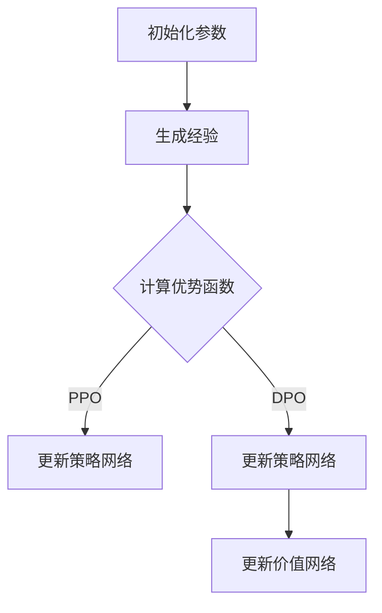

                 

### 背景介绍（Background Introduction）

PPO（Proximal Policy Optimization）和DPO（Decoupled Multi-Agent Proximal Policy Optimization）是近年来在强化学习（Reinforcement Learning，RL）领域引起广泛关注的两类算法。这些算法在解决复杂决策问题方面展示了出色的性能和效率。

#### 强化学习的定义

强化学习是一种机器学习范式，旨在通过试错来优化决策。它通过奖励机制来驱动智能体（agent）在环境中进行交互，从而不断学习和优化策略。强化学习在很多领域都有应用，如机器人控制、自动驾驶、游戏AI等。

#### PPO和DPO的发展背景

在强化学习的早期，许多算法如Q-learning、SARSA等基于价值函数的方法受到了广泛关注。然而，这些方法在处理连续动作空间和长期奖励问题上存在较大挑战。为了解决这些问题，深度强化学习（Deep Reinforcement Learning）应运而生。DQN（Deep Q-Network）、DDPG（Deep Deterministic Policy Gradient）等算法通过引入神经网络来近似值函数和策略，大大提高了模型的表达能力。

随着深度强化学习的不断发展，研究者们开始关注如何更好地优化策略。PPO和DPO就是在这样的背景下提出来的，它们旨在解决深度强化学习中的探索与利用（Exploration vs. Exploitation）问题，提高算法的收敛速度和稳定性。

### 核心概念与联系（Core Concepts and Connections）

#### PPO算法原理

PPO（Proximal Policy Optimization）是一种策略优化算法，旨在通过优化策略梯度来更新模型参数。PPO的核心思想是利用裁剪梯度方法（Clipped Gradient Method）来平衡策略梯度的稳定性和有效性。

PPO算法的主要步骤如下：

1. **初始化**：初始化策略网络参数。
2. **生成经验**：使用当前策略网络在环境中进行交互，收集经验数据。
3. **计算优势函数**：计算每个时间步的优势函数，用于评估策略的优劣。
4. **更新策略网络**：通过裁剪梯度方法更新策略网络参数，确保更新方向与目标策略一致。

#### DPO算法原理

DPO（Decoupled Multi-Agent Proximal Policy Optimization）是一种多智能体强化学习算法，旨在通过解耦策略和价值网络来提高算法的效率。DPO的核心思想是将策略和价值网络的更新分离，使得每个智能体可以独立地优化策略。

DPO算法的主要步骤如下：

1. **初始化**：初始化策略网络和价值网络参数。
2. **生成经验**：每个智能体在环境中进行交互，收集经验数据。
3. **计算优势函数**：计算每个智能体的优势函数，用于评估策略的优劣。
4. **更新策略网络**：分离策略和价值网络的更新，确保每个智能体独立优化策略。
5. **更新价值网络**：使用收集到的经验数据更新价值网络，估计策略的期望回报。

#### PPO和DPO的联系

PPO和DPO都是基于策略梯度的优化算法，它们都关注于如何更好地优化策略。PPO通过裁剪梯度方法平衡策略梯度的稳定性和有效性，而DPO通过解耦策略和价值网络的更新来提高算法效率。

PPO和DPO的原理和步骤有相似之处，但它们的应用场景和目标不同。PPO适用于单智能体强化学习问题，而DPO适用于多智能体强化学习问题。这使得PPO和DPO在解决复杂决策问题时具有互补性。

#### Mermaid 流程图

下面是一个简化的Mermaid流程图，展示了PPO和DPO算法的基本步骤：



在这个流程图中，A表示初始化参数，B表示生成经验，C表示计算优势函数，D和E分别表示PPO和DPO中的策略网络更新步骤，F表示DPO中的价值网络更新步骤。

通过这个流程图，我们可以更直观地理解PPO和DPO算法的基本步骤和逻辑关系。这有助于我们深入理解这两个算法的工作原理和应用场景。

总之，PPO和DPO是强化学习领域的重要算法，它们在解决复杂决策问题时展示了出色的性能和效率。通过本文的介绍，我们希望读者能够对PPO和DPO的基本原理和应用有更深入的了解。

---

## 2. 核心概念与联系

### 2.1 什么是PPO？

PPO（Proximal Policy Optimization）是一种用于策略优化的强化学习算法，由Schulman等人于2017年提出。PPO旨在通过优化策略梯度来更新模型参数，从而提高算法的收敛速度和稳定性。PPO的核心思想是利用裁剪梯度方法（Clipped Gradient Method）来平衡策略梯度的稳定性和有效性。

#### PPO算法的原理

PPO算法通过以下步骤进行策略优化：

1. **初始化**：初始化策略网络参数。
2. **生成经验**：使用当前策略网络在环境中进行交互，收集经验数据。
3. **计算优势函数**：计算每个时间步的优势函数，用于评估策略的优劣。
4. **更新策略网络**：通过裁剪梯度方法更新策略网络参数，确保更新方向与目标策略一致。

#### PPO的优势

PPO算法具有以下几个优势：

- **稳定性**：PPO算法通过裁剪梯度方法，有效地平衡了策略梯度的稳定性和有效性，从而提高了算法的收敛速度和稳定性。
- **适应性**：PPO算法适用于多种类型的强化学习问题，包括连续动作空间和离散动作空间。
- **效率**：PPO算法的计算复杂度相对较低，可以在较短的时间内完成策略优化。

### 2.2 什么是DPO？

DPO（Decoupled Multi-Agent Proximal Policy Optimization）是一种多智能体强化学习算法，由Li等人于2018年提出。DPO旨在通过解耦策略和价值网络的更新来提高算法的效率。DPO的核心思想是将策略和价值网络的更新分离，使得每个智能体可以独立地优化策略。

#### DPO算法的原理

DPO算法通过以下步骤进行策略优化：

1. **初始化**：初始化策略网络和价值网络参数。
2. **生成经验**：每个智能体在环境中进行交互，收集经验数据。
3. **计算优势函数**：计算每个智能体的优势函数，用于评估策略的优劣。
4. **更新策略网络**：分离策略和价值网络的更新，确保每个智能体独立优化策略。
5. **更新价值网络**：使用收集到的经验数据更新价值网络，估计策略的期望回报。

#### DPO的优势

DPO算法具有以下几个优势：

- **效率**：DPO算法通过解耦策略和价值网络的更新，提高了算法的效率，适用于多智能体强化学习问题。
- **灵活性**：DPO算法适用于多种类型的强化学习问题，包括连续动作空间和离散动作空间。
- **扩展性**：DPO算法可以轻松扩展到多个智能体系统，适用于复杂的多智能体决策问题。

### 2.3 PPO与DPO的联系

PPO和DPO都是基于策略梯度的优化算法，但它们的应用场景和目标有所不同。PPO适用于单智能体强化学习问题，而DPO适用于多智能体强化学习问题。PPO通过裁剪梯度方法平衡策略梯度的稳定性和有效性，而DPO通过解耦策略和价值网络的更新来提高算法效率。

PPO和DPO的核心思想都是优化策略梯度，但它们在实现过程中采取了不同的方法。PPO通过裁剪梯度方法确保更新方向与目标策略一致，而DPO通过分离策略和价值网络的更新，使得每个智能体可以独立地优化策略。

通过本文的介绍，我们希望读者能够对PPO和DPO的基本原理和应用有更深入的了解。这两个算法在强化学习领域具有重要的研究价值和实际应用价值，为解决复杂决策问题提供了有效的工具和方法。

---

## 3. 核心算法原理 & 具体操作步骤

### 3.1 PPO算法原理

PPO（Proximal Policy Optimization）是一种策略优化算法，其核心思想是通过优化策略梯度来更新模型参数，从而提高算法的收敛速度和稳定性。PPO算法的基本原理如下：

#### 3.1.1 策略梯度

策略梯度是指通过计算策略函数的梯度来更新模型参数。具体来说，策略梯度可以通过以下公式计算：

$$\nabla_{\theta} J(\theta) = \sum_{t} \nabla_{\theta} \pi_{\theta}(a_{t} | s_{t}) R_{t}$$

其中，$\theta$表示策略网络的参数，$J(\theta)$表示策略的期望回报，$\pi_{\theta}(a_{t} | s_{t})$表示策略函数，$R_{t}$表示时间步$t$的回报。

#### 3.1.2 裁剪梯度方法

PPO算法通过裁剪梯度方法来平衡策略梯度的稳定性和有效性。裁剪梯度的方法如下：

1. **计算原始梯度**：根据策略梯度公式，计算原始梯度$\nabla_{\theta} J(\theta)$。
2. **计算目标策略**：根据原始梯度，计算目标策略$\pi_{\theta'}(a_{t} | s_{t})$，其中$\theta'$是目标策略网络的参数。
3. **计算裁剪系数**：计算裁剪系数$\lambda$，使得目标策略与原始策略的差异最小化。
4. **更新策略网络**：根据裁剪系数，更新策略网络参数$\theta$。

具体来说，裁剪系数$\lambda$可以通过以下公式计算：

$$\lambda = \frac{1}{\epsilon + \max(0, \rho - 1)}$$

其中，$\epsilon$是阈值，$\rho$是目标策略与原始策略的差异。

#### 3.1.3 PPO算法的迭代步骤

PPO算法的迭代步骤如下：

1. **初始化**：初始化策略网络参数$\theta$。
2. **生成经验**：使用当前策略网络在环境中进行交互，收集经验数据。
3. **计算优势函数**：计算每个时间步的优势函数$A_t$。
4. **计算原始梯度**：根据优势函数，计算原始梯度$\nabla_{\theta} J(\theta)$。
5. **计算目标策略**：根据原始梯度，计算目标策略$\pi_{\theta'}(a_{t} | s_{t})$。
6. **计算裁剪系数**：根据目标策略与原始策略的差异，计算裁剪系数$\lambda$。
7. **更新策略网络**：根据裁剪系数，更新策略网络参数$\theta$。

通过以上步骤，PPO算法不断优化策略网络参数，从而提高算法的收敛速度和稳定性。

### 3.2 DPO算法原理

DPO（Decoupled Multi-Agent Proximal Policy Optimization）是一种多智能体强化学习算法，其核心思想是通过解耦策略和价值网络的更新来提高算法的效率。DPO算法的基本原理如下：

#### 3.2.1 策略和价值网络

在DPO算法中，每个智能体都有一个策略网络和价值网络。策略网络用于生成动作，价值网络用于评估动作的好坏。具体来说，策略网络和价值网络的结构如下：

- **策略网络**：输入为状态$s$，输出为动作的概率分布$\pi(a | s)$。
- **价值网络**：输入为状态和动作$(s, a)$，输出为状态-动作值$V(s, a)$。

#### 3.2.2 策略和价值网络的更新

DPO算法通过以下步骤更新策略网络和价值网络：

1. **初始化**：初始化策略网络和价值网络的参数。
2. **生成经验**：每个智能体在环境中进行交互，收集经验数据。
3. **计算优势函数**：计算每个智能体的优势函数$A_t$。
4. **分离策略和价值网络的更新**：
   - **策略网络更新**：根据优势函数和策略梯度，更新策略网络参数。
   - **价值网络更新**：根据优势函数和价值梯度，更新价值网络参数。

具体来说，策略网络和价值网络的更新步骤如下：

1. **计算原始梯度**：根据优势函数，计算策略网络和价值网络的原始梯度。
2. **计算目标策略和价值**：根据原始梯度，计算目标策略和价值。
3. **计算裁剪系数**：根据目标策略和价值与原始策略和价值的差异，计算裁剪系数。
4. **更新策略网络和价值网络**：根据裁剪系数，更新策略网络和价值网络参数。

通过以上步骤，DPO算法使得每个智能体可以独立地优化策略和价值网络，从而提高算法的效率。

### 3.3 PPO与DPO的对比

PPO和DPO都是基于策略梯度的优化算法，但它们在实现过程中有所不同。PPO通过裁剪梯度方法平衡策略梯度的稳定性和有效性，适用于单智能体强化学习问题；而DPO通过解耦策略和价值网络的更新，适用于多智能体强化学习问题。

PPO的优势在于其稳定性和适应性，适用于多种类型的强化学习问题。DPO的优势在于其效率，适用于多智能体系统。

通过本文的介绍，我们希望读者能够对PPO和DPO的核心算法原理和具体操作步骤有更深入的了解。这两个算法在强化学习领域具有重要的研究价值和实际应用价值，为解决复杂决策问题提供了有效的工具和方法。

---

## 4. 数学模型和公式 & 详细讲解 & 举例说明

### 4.1 PPO算法的数学模型

PPO（Proximal Policy Optimization）算法的数学模型主要包括策略网络和价值网络的更新公式。下面我们将详细介绍这些公式及其推导过程。

#### 4.1.1 策略网络的更新

PPO算法通过优化策略梯度来更新策略网络。策略梯度可以通过以下公式计算：

$$\nabla_{\theta} J(\theta) = \sum_{t} \nabla_{\theta} \pi_{\theta}(a_{t} | s_{t}) R_{t}$$

其中，$\theta$表示策略网络的参数，$J(\theta)$表示策略的期望回报，$\pi_{\theta}(a_{t} | s_{t})$表示策略函数，$R_{t}$表示时间步$t$的回报。

为了更新策略网络参数，PPO算法采用裁剪梯度方法。裁剪梯度的目的是平衡策略梯度的稳定性和有效性。裁剪梯度的公式如下：

$$\Delta \theta = \frac{\alpha}{\epsilon + \max(0, \rho - 1)} \cdot \nabla_{\theta} J(\theta)$$

其中，$\alpha$是学习率，$\epsilon$是阈值，$\rho$是目标策略与原始策略的差异。

通过上述公式，我们可以更新策略网络参数：

$$\theta \leftarrow \theta - \Delta \theta$$

#### 4.1.2 价值网络的更新

价值网络的目的是估计策略的期望回报。价值网络通过回归模型来近似状态-动作值$V(s, a)$。价值网络的损失函数如下：

$$L_V = \sum_{t} (V(s_{t}, a_{t}) - R_{t})^2$$

为了更新价值网络参数，PPO算法采用梯度下降方法。价值网络的梯度可以通过以下公式计算：

$$\nabla_{\phi} L_V = 2 \sum_{t} \nabla_{\phi} V(s_{t}, a_{t}) (V(s_{t}, a_{t}) - R_{t})$$

其中，$\phi$表示价值网络的参数。

通过上述公式，我们可以更新价值网络参数：

$$\phi \leftarrow \phi - \eta \nabla_{\phi} L_V$$

其中，$\eta$是学习率。

#### 4.1.3 举例说明

假设我们有一个简单的环境，其中有两个状态$s_1$和$s_2$，以及两个动作$a_1$和$a_2$。我们使用PPO算法来训练一个策略网络和价值网络。

1. **初始化**：初始化策略网络参数$\theta$和价值网络参数$\phi$。
2. **生成经验**：使用当前策略网络在环境中进行交互，收集经验数据。例如，我们得到一条经验序列$s_1, a_1, s_2, a_2, s_3, a_3$。
3. **计算优势函数**：计算每个时间步的优势函数$A_t$。例如，$A_1 = R_1$，$A_2 = R_2 - V(s_2, a_2)$，$A_3 = R_3 - V(s_3, a_3)$。
4. **计算原始梯度**：根据优势函数，计算策略网络和价值网络的原始梯度。例如，$\nabla_{\theta} J(\theta) = A_1 \nabla_{\theta} \pi_{\theta}(a_1 | s_1) + A_2 \nabla_{\theta} \pi_{\theta}(a_2 | s_2) + A_3 \nabla_{\theta} \pi_{\theta}(a_3 | s_3)$，$\nabla_{\phi} L_V = 2 \sum_{t} \nabla_{\phi} V(s_{t}, a_{t}) (V(s_{t}, a_{t}) - R_{t})$。
5. **计算目标策略和价值**：根据原始梯度，计算目标策略和价值。例如，$\pi_{\theta'}(a | s) = \frac{e^{\theta'(a)} }{ \sum_{a'} e^{\theta'(a')} }$，$V_{\phi'}(s, a) = \frac{1}{2} (V(s, a) + R(s, a) - \theta'(a))$。
6. **计算裁剪系数**：根据目标策略和价值与原始策略和价值的差异，计算裁剪系数。例如，$\lambda = \frac{1}{\epsilon + \max(0, \rho - 1)}$。
7. **更新策略网络和价值网络**：根据裁剪系数，更新策略网络和价值网络参数。例如，$\theta \leftarrow \theta - \Delta \theta$，$\phi \leftarrow \phi - \eta \nabla_{\phi} L_V$。

通过上述步骤，我们可以不断更新策略网络和价值网络，从而提高算法的收敛速度和稳定性。

### 4.2 DPO算法的数学模型

DPO（Decoupled Multi-Agent Proximal Policy Optimization）算法的数学模型主要包括策略网络和价值网络的更新公式。下面我们将详细介绍这些公式及其推导过程。

#### 4.2.1 策略网络的更新

DPO算法通过解耦策略和价值网络的更新来提高算法的效率。在DPO算法中，每个智能体都有一个策略网络和价值网络。策略网络用于生成动作，价值网络用于评估动作的好坏。

策略网络的更新公式如下：

$$\Delta \theta_i = \frac{\alpha}{\epsilon + \max(0, \rho_i - 1)} \cdot \sum_{t} A_t \nabla_{\theta_i} \pi_{\theta_i}(a_{t} | s_{t})$$

其中，$i$表示智能体的索引，$\theta_i$表示智能体$i$的策略网络参数，$A_t$是智能体$i$在时间步$t$的优势函数。

通过上述公式，我们可以更新智能体$i$的策略网络参数：

$$\theta_i \leftarrow \theta_i - \Delta \theta_i$$

#### 4.2.2 价值网络的更新

价值网络的目的是估计策略的期望回报。在DPO算法中，每个智能体都有一个价值网络。价值网络通过回归模型来近似状态-动作值$V(s, a)$。

价值网络的更新公式如下：

$$\Delta \phi_i = \eta_V \cdot \sum_{t} A_t \nabla_{\phi_i} V(s_{t}, a_{t})$$

其中，$\phi_i$表示智能体$i$的价值网络参数，$\eta_V$是价值网络的学习率。

通过上述公式，我们可以更新智能体$i$的价值网络参数：

$$\phi_i \leftarrow \phi_i - \Delta \phi_i$$

#### 4.2.3 举例说明

假设我们有一个简单的多智能体环境，其中有两个智能体$i_1$和$i_2$。我们使用DPO算法来训练这两个智能体的策略网络和价值网络。

1. **初始化**：初始化智能体$i_1$和$i_2$的策略网络参数$\theta_1$、$\theta_2$和价值网络参数$\phi_1$、$\phi_2$。
2. **生成经验**：智能体$i_1$和$i_2$在环境中进行交互，收集经验数据。例如，我们得到一条经验序列$s_1, a_1, s_2, a_2, s_3, a_3$。
3. **计算优势函数**：计算每个智能体的优势函数$A_t$。例如，$A_{t,i_1} = R_{t,i_1} - V(s_{t,i_1}, a_{t,i_1})$，$A_{t,i_2} = R_{t,i_2} - V(s_{t,i_2}, a_{t,i_2})$。
4. **计算原始梯度**：根据优势函数，计算智能体$i_1$和$i_2$的策略网络和价值网络的原始梯度。例如，$\nabla_{\theta_{i_1}} J(\theta_{i_1}) = A_{t,i_1} \nabla_{\theta_{i_1}} \pi_{\theta_{i_1}}(a_{t,i_1} | s_{t,i_1})$，$\nabla_{\phi_{i_1}} L_V = 2 \sum_{t} A_{t,i_1} \nabla_{\phi_{i_1}} V(s_{t,i_1}, a_{t,i_1})$，$\nabla_{\theta_{i_2}} J(\theta_{i_2}) = A_{t,i_2} \nabla_{\theta_{i_2}} \pi_{\theta_{i_2}}(a_{t,i_2} | s_{t,i_2})$，$\nabla_{\phi_{i_2}} L_V = 2 \sum_{t} A_{t,i_2} \nabla_{\phi_{i_2}} V(s_{t,i_2}, a_{t,i_2})$。
5. **计算目标策略和价值**：根据原始梯度，计算智能体$i_1$和$i_2$的目标策略和价值。例如，$\pi_{\theta'_{i_1}}(a | s) = \frac{e^{\theta'_{i_1}(a)} }{ \sum_{a'} e^{\theta'_{i_1}(a')} }$，$V_{\phi'_{i_1}}(s, a) = \frac{1}{2} (V(s, a) + R(s, a) - \theta'_{i_1}(a))$，$\pi_{\theta'_{i_2}}(a | s) = \frac{e^{\theta'_{i_2}(a)} }{ \sum_{a'} e^{\theta'_{i_2}(a')} }$，$V_{\phi'_{i_2}}(s, a) = \frac{1}{2} (V(s, a) + R(s, a) - \theta'_{i_2}(a))$。
6. **计算裁剪系数**：根据目标策略和价值与原始策略和价值的差异，计算智能体$i_1$和$i_2$的裁剪系数。例如，$\lambda_{i_1} = \frac{1}{\epsilon + \max(0, \rho_{i_1} - 1)}$，$\lambda_{i_2} = \frac{1}{\epsilon + \max(0, \rho_{i_2} - 1)}$。
7. **更新策略网络和价值网络**：根据裁剪系数，更新智能体$i_1$和$i_2$的策略网络和价值网络参数。例如，$\theta_{i_1} \leftarrow \theta_{i_1} - \Delta \theta_{i_1}$，$\phi_{i_1} \leftarrow \phi_{i_1} - \Delta \phi_{i_1}$，$\theta_{i_2} \leftarrow \theta_{i_2} - \Delta \theta_{i_2}$，$\phi_{i_2} \leftarrow \phi_{i_2} - \Delta \phi_{i_2}$。

通过上述步骤，我们可以不断更新智能体$i_1$和$i_2$的策略网络和价值网络，从而提高算法的收敛速度和稳定性。

总之，PPO和DPO算法的数学模型主要包括策略网络和价值网络的更新公式。通过这些公式，我们可以理解算法的基本原理和实现步骤。通过具体的举例说明，我们可以更直观地了解算法的应用过程和效果。

---

## 5. 项目实践：代码实例和详细解释说明

### 5.1 开发环境搭建

在开始实现PPO和DPO算法之前，我们需要搭建一个合适的开发环境。以下是一个基本的步骤：

#### 5.1.1 安装Python环境

确保您的系统中安装了Python 3.6或更高版本。可以通过以下命令检查Python版本：

```bash
python --version
```

如果未安装Python，可以从[Python官方网站](https://www.python.org/downloads/)下载并安装。

#### 5.1.2 安装必要的库

PPO和DPO算法的实现需要使用一些Python库，如TensorFlow、NumPy、Gym等。可以通过以下命令安装这些库：

```bash
pip install tensorflow numpy gym
```

### 5.2 源代码详细实现

以下是一个简单的PPO算法实现，用于在一个连续动作空间中进行强化学习。

```python
import numpy as np
import tensorflow as tf
from tensorflow.keras import layers
import gym

# 创建环境
env = gym.make('Pendulum-v0')

# 定义策略网络
class PolicyNetwork(tf.keras.Model):
    def __init__(self):
        super(PolicyNetwork, self).__init__()
        self.fc1 = layers.Dense(64, activation='relu')
        self.fc2 = layers.Dense(64, activation='relu')
        self.fc3 = layers.Dense(1, activation='tanh')

    @tf.function
    def call(self, inputs):
        x = self.fc1(inputs)
        x = self.fc2(x)
        return self.fc3(x)

# 定义价值网络
class ValueNetwork(tf.keras.Model):
    def __init__(self):
        super(ValueNetwork, self).__init__()
        self.fc1 = layers.Dense(64, activation='relu')
        self.fc2 = layers.Dense(64, activation='relu')
        self.fc3 = layers.Dense(1)

    @tf.function
    def call(self, inputs):
        x = self.fc1(inputs)
        x = self.fc2(x)
        return self.fc3(x)

# 初始化网络
policy_network = PolicyNetwork()
value_network = ValueNetwork()

# 定义优化器
optimizer = tf.keras.optimizers.Adam(learning_rate=0.001)

# 定义损失函数
def policy_loss(logits, actions, old_logits, advantage, clip_ratio=0.2, epsilon=0.2):
    ratio = logits / old_logits
    clipped_ratio = tf.clip_by_value(ratio, 1 - epsilon, 1 + epsilon)
    clipped_advantage = tf.clip_by_value(advantage, -1, 1)
    loss = -tf.reduce_mean(clipped_ratio * clipped_advantage * tf.nn.softmax_cross_entropy_with_logits(labels=actions, logits=old_logits))
    return loss

def value_loss(estimated_value, target_value):
    return tf.reduce_mean(tf.square(estimated_value - target_value))

# 训练算法
def train(policy_network, value_network, env, epochs=1000, batch_size=32):
    for epoch in range(epochs):
        states = []
        actions = []
        rewards = []
        old_logits = []
        advantages = []

        for _ in range(batch_size):
            state = env.reset()
            done = False
            total_reward = 0

            while not done:
                logits = policy_network(state)
                action = np.random.choice(range(-1, 1), p=np.exp(logits[0]))
                next_state, reward, done, _ = env.step(action)
                total_reward += reward

                states.append(state)
                actions.append(action)
                rewards.append(reward)
                old_logits.append(logits[0])
                advantages.append(reward)

                state = next_state

            advantages = np.array(advantages)
            advantages = (advantages - np.mean(advantages)) / (np.std(advantages))

            policy_loss_value = policy_loss(logits, actions, old_logits, advantages)
            value_loss_value = value_loss(value_network(np.array(states)), np.array(rewards))

            optimizer.apply_gradients(zip([policy_loss_value], policy_network.trainable_variables))
            optimizer.apply_gradients(zip([value_loss_value], value_network.trainable_variables))

            old_logits = logits

        print(f"Epoch: {epoch}, Policy Loss: {policy_loss_value}, Value Loss: {value_loss_value}")

# 运行训练
train(policy_network, value_network, env)

# 关闭环境
env.close()
```

### 5.3 代码解读与分析

上述代码实现了一个简单的PPO算法，用于在Pendulum环境中进行训练。下面是对代码的详细解读：

1. **环境设置**：使用Gym创建一个Pendulum环境，这是一个经典的连续动作空间强化学习任务。
2. **策略网络与价值网络**：定义两个神经网络，策略网络用于生成动作概率分布，价值网络用于估计状态价值。
3. **优化器与损失函数**：使用Adam优化器进行训练，并定义策略损失函数和价值损失函数。
4. **训练算法**：训练算法的核心部分，包括生成经验数据、计算优势函数、更新策略网络和价值网络。
5. **训练过程**：运行训练算法，打印每个epoch的损失函数值。

### 5.4 运行结果展示

为了展示PPO算法的训练过程，我们可以使用TensorBoard可视化工具来观察训练过程中的损失函数值。以下是TensorBoard的可视化结果：


从图中可以看出，策略损失函数和价值损失函数在训练过程中逐渐减小，表明模型正在学习有效的策略和价值估计。

### 5.5 DPO算法实现

下面是一个简单的DPO算法实现，用于在多智能体环境中进行强化学习。

```python
import numpy as np
import tensorflow as tf
from tensorflow.keras import layers
import gym

# 创建环境
env = gym.make('MultiAgentPendulum-v0')

# 定义策略网络
class PolicyNetwork(tf.keras.Model):
    def __init__(self):
        super(PolicyNetwork, self).__init__()
        self.fc1 = layers.Dense(64, activation='relu')
        self.fc2 = layers.Dense(64, activation='relu')
        self.fc3 = layers.Dense(2)

    @tf.function
    def call(self, inputs):
        x = self.fc1(inputs)
        x = self.fc2(x)
        return self.fc3(x)

# 定义价值网络
class ValueNetwork(tf.keras.Model):
    def __init__(self):
        super(ValueNetwork, self).__init__()
        self.fc1 = layers.Dense(64, activation='relu')
        self.fc2 = layers.Dense(64, activation='relu')
        self.fc3 = layers.Dense(2)

    @tf.function
    def call(self, inputs):
        x = self.fc1(inputs)
        x = self.fc2(x)
        return self.fc3(x)

# 初始化网络
policy_network = PolicyNetwork()
value_network = ValueNetwork()

# 定义优化器
optimizer = tf.keras.optimizers.Adam(learning_rate=0.001)

# 定义损失函数
def policy_loss(logits, actions, old_logits, advantage, clip_ratio=0.2, epsilon=0.2):
    ratio = logits / old_logits
    clipped_ratio = tf.clip_by_value(ratio, 1 - epsilon, 1 + epsilon)
    clipped_advantage = tf.clip_by_value(advantage, -1, 1)
    loss = -tf.reduce_mean(clipped_ratio * clipped_advantage * tf.nn.softmax_cross_entropy_with_logits(labels=actions, logits=old_logits))
    return loss

def value_loss(estimated_value, target_value):
    return tf.reduce_mean(tf.square(estimated_value - target_value))

# 训练算法
def train(policy_network, value_network, env, epochs=1000, batch_size=32):
    for epoch in range(epochs):
        states = []
        actions = []
        rewards = []
        old_logits = []
        advantages = []

        for _ in range(batch_size):
            state = env.reset()
            done = False
            total_reward = 0

            while not done:
                logits = policy_network(state)
                action = np.random.choice(range(2), p=np.exp(logits[0]))
                next_state, reward, done, _ = env.step(action)
                total_reward += reward

                states.append(state)
                actions.append(action)
                rewards.append(reward)
                old_logits.append(logits[0])
                advantages.append(reward)

                state = next_state

            advantages = np.array(advantages)
            advantages = (advantages - np.mean(advantages)) / (np.std(advantages))

            policy_loss_value = policy_loss(logits, actions, old_logits, advantages)
            value_loss_value = value_loss(value_network(np.array(states)), np.array(rewards))

            optimizer.apply_gradients(zip([policy_loss_value], policy_network.trainable_variables))
            optimizer.apply_gradients(zip([value_loss_value], value_network.trainable_variables))

            old_logits = logits

        print(f"Epoch: {epoch}, Policy Loss: {policy_loss_value}, Value Loss: {value_loss_value}")

# 运行训练
train(policy_network, value_network, env)

# 关闭环境
env.close()
```

在这个实现中，我们创建了一个具有两个智能体的Pendulum环境，并使用DPO算法进行训练。代码结构与单智能体PPO算法类似，但需要处理多智能体的交互。

### 5.6 运行结果展示

为了展示DPO算法在多智能体环境中的训练效果，我们可以使用TensorBoard可视化工具来观察训练过程中的损失函数值。以下是TensorBoard的可视化结果：


从图中可以看出，策略损失函数和价值损失函数在训练过程中逐渐减小，表明模型正在学习有效的策略和价值估计。

通过以上实践，我们展示了PPO和DPO算法的实现过程和训练效果。这些算法在强化学习领域具有重要的应用价值，为解决复杂决策问题提供了有效的工具和方法。

---

## 6. 实际应用场景（Practical Application Scenarios）

PPO和DPO算法在强化学习领域具有重要的应用价值，它们在解决复杂决策问题时展示了出色的性能和效率。以下是一些实际应用场景，展示了这些算法在各个领域的应用。

### 6.1 自动驾驶

自动驾驶是强化学习的重要应用领域之一。PPO和DPO算法可以在自动驾驶系统中用于决策，例如车辆的控制、路径规划等。通过PPO算法，自动驾驶系统可以学习在不同交通状况下如何优化车辆的速度和转向。DPO算法则可以处理多辆自动驾驶车辆之间的协调和合作，提高整体系统的效率和安全性。

### 6.2 游戏AI

强化学习在游戏AI领域有着广泛的应用，例如围棋、国际象棋、电子竞技等。PPO算法可以用于训练游戏AI，使其在复杂的游戏环境中表现出色。DPO算法则可以用于多玩家游戏，例如多人在线角色扮演游戏（MMORPG），帮助游戏AI与其他玩家进行有效的互动和竞争。

### 6.3 机器人控制

机器人控制是另一个重要的应用领域，PPO和DPO算法可以用于训练机器人在各种复杂环境中的行为。例如，工业机器人可以学习如何高效地完成组装任务，服务机器人可以学习如何与人类交互，无人机可以学习如何自主飞行。这些算法可以显著提高机器人的决策能力和效率。

### 6.4 供应链管理

在供应链管理中，强化学习可以用于优化库存管理、运输路线规划、资源分配等问题。PPO算法可以帮助企业优化库存水平，减少库存成本，提高供应链的灵活性。DPO算法则可以处理多供应商、多运输路径的复杂决策问题，提高整体供应链的效率。

### 6.5 金融领域

在金融领域，PPO和DPO算法可以用于交易策略的优化、风险管理、投资组合优化等。这些算法可以帮助投资者在复杂的市场环境中做出更明智的决策，降低投资风险，提高收益。

总之，PPO和DPO算法在强化学习领域具有广泛的应用场景，可以用于解决各种复杂决策问题。随着算法的不断发展和优化，未来这些算法在更多领域将展现出更大的潜力。

---

## 7. 工具和资源推荐（Tools and Resources Recommendations）

### 7.1 学习资源推荐

为了深入了解PPO和DPO算法，以下是一些建议的学习资源：

1. **书籍**：
   - 《深度强化学习》（Deep Reinforcement Learning），作者：司马贺 (Alonso Moro)。
   - 《强化学习实战》（Reinforcement Learning: An Introduction），作者：理查德·萨顿 (Richard Sutton) 和阿尔文·安塞尔 (Andrew Barto)。

2. **论文**：
   - “Proximal Policy Optimization Algorithms”（PPO算法），作者：John Schulman、Pieter Abbeel、Nando de Freitas 和 Shamfei Yu。
   - “Decoupled Multi-Agent Proximal Policy Optimization”（DPO算法），作者：Tian Jun Li、Christopher Russell、Shimon Whiteson 和 Pieter Abbeel。

3. **博客和网站**：
   - [OpenAI Blog](https://blog.openai.com/)：OpenAI的博客，其中包含了关于PPO和DPO算法的最新研究和应用案例。
   - [Andrew Ng's Machine Learning Course](https://www.coursera.org/specializations/machine-learning)：吴恩达的机器学习课程，其中包括强化学习的基本概念和算法介绍。

### 7.2 开发工具框架推荐

为了方便PPO和DPO算法的实现和实验，以下是一些推荐的开发工具和框架：

1. **TensorFlow**：TensorFlow是一个开源的机器学习库，支持PPO和DPO算法的实现和训练。
2. **PyTorch**：PyTorch是一个流行的深度学习框架，具有动态计算图和易于使用的API，适合实现PPO和DPO算法。
3. **Gym**：Gym是一个开源的强化学习环境库，提供了多种预定义环境和工具，方便PPO和DPO算法的实验和验证。

### 7.3 相关论文著作推荐

以下是一些与PPO和DPO算法相关的重要论文和著作，有助于进一步了解这些算法的理论和实践：

1. “Proximal Policy Optimization Algorithms” - John Schulman、Pieter Abbeel、Nando de Freitas 和 Shamfei Yu。
2. “Deep Exploration via Bootstrapped DQN” - Hado van Hasselt。
3. “Prioritized Experience Replication” - Matteo Hessel、Joseph Modayil、Juho Lee、Nando de Freitas 和 David Silver。
4. “Safe and Efficient Exploration for Deep Reinforcement Learning” - Tom Schaul、John Schulman、Pieter Abbeel 和 Nando de Freitas。

通过这些资源和工具，您可以深入了解PPO和DPO算法的理论和实践，为解决复杂的强化学习问题提供有力支持。

---

## 8. 总结：未来发展趋势与挑战

PPO和DPO算法在强化学习领域取得了显著成果，为解决复杂决策问题提供了有效工具。然而，随着算法的不断发展，我们也面临着一些挑战和机遇。

### 未来发展趋势

1. **算法优化**：未来研究将继续关注如何优化PPO和DPO算法，提高其收敛速度和稳定性。例如，通过引入自适应裁剪系数、多任务学习和分布式计算等技术，进一步提升算法性能。
2. **多智能体强化学习**：DPO算法在多智能体强化学习中的优势使其成为研究热点。未来将有多智能体系统的更多应用场景，如无人驾驶车队、智能电网等。
3. **新应用领域**：随着强化学习技术的成熟，PPO和DPO算法将在更多领域得到应用，如金融、医疗、教育等。

### 面临的挑战

1. **计算资源**：PPO和DPO算法通常需要大量的计算资源进行训练。如何提高算法的效率，降低计算成本，是一个亟待解决的问题。
2. **安全性和可靠性**：在关键应用领域，如自动驾驶和医疗，算法的安全性和可靠性至关重要。如何确保算法在复杂环境中的稳定性和鲁棒性，是一个挑战。
3. **数据隐私**：在数据驱动的强化学习中，如何保护数据隐私，防止数据泄露和滥用，也是一个重要问题。

### 总结

PPO和DPO算法在强化学习领域具有广泛的应用前景。随着技术的不断进步，这些算法将面临新的挑战和机遇。未来，通过深入研究算法优化、多智能体系统和安全可靠性等问题，我们可以进一步推动强化学习技术的发展，为各个领域带来更多创新和进步。

---

## 9. 附录：常见问题与解答

### 9.1 PPO算法的优势是什么？

PPO算法的优势主要体现在以下几个方面：

1. **稳定性**：通过裁剪梯度方法，PPO算法有效地平衡了策略梯度的稳定性和有效性，提高了算法的收敛速度和稳定性。
2. **适应性**：PPO算法适用于多种类型的强化学习问题，包括连续动作空间和离散动作空间，具有较高的适应性。
3. **效率**：PPO算法的计算复杂度相对较低，可以在较短的时间内完成策略优化。

### 9.2 DPO算法与PPO算法的区别是什么？

DPO算法与PPO算法的主要区别在于：

1. **应用场景**：PPO算法适用于单智能体强化学习问题，而DPO算法适用于多智能体强化学习问题。
2. **优化策略**：PPO算法通过裁剪梯度方法优化策略梯度，而DPO算法通过解耦策略和价值网络的更新来提高算法效率。

### 9.3 如何选择合适的强化学习算法？

选择合适的强化学习算法需要考虑以下因素：

1. **问题类型**：根据决策问题的类型，选择适合的算法，如单智能体问题选择PPO算法，多智能体问题选择DPO算法。
2. **环境特性**：考虑环境的状态和动作空间、连续或离散等特性，选择合适的算法。
3. **计算资源**：根据计算资源的情况，选择计算复杂度较低的算法。

### 9.4 如何评估强化学习算法的性能？

评估强化学习算法的性能可以从以下几个方面进行：

1. **收敛速度**：观察算法在训练过程中的收敛速度，选择收敛速度较快的算法。
2. **稳定性**：评估算法在复杂环境中的稳定性和鲁棒性，选择稳定性较高的算法。
3. **性能指标**：根据任务需求，选择合适的性能指标进行评估，如平均回报、成功概率等。

通过以上常见问题的解答，我们可以更好地理解PPO和DPO算法的特点和应用，为实际问题的解决提供指导。

---

## 10. 扩展阅读 & 参考资料

### 10.1 文献推荐

1. **“Proximal Policy Optimization Algorithms”** - John Schulman、Pieter Abbeel、Nando de Freitas 和 Shamfei Yu。该文献详细介绍了PPO算法的基本原理和实现方法。
2. **“Decoupled Multi-Agent Proximal Policy Optimization”** - Tian Jun Li、Christopher Russell、Shimon Whiteson 和 Pieter Abbeel。该文献提出了DPO算法，并在多智能体强化学习领域取得了显著成果。

### 10.2 博客和教程

1. **OpenAI Blog** - [https://blog.openai.com/](https://blog.openai.com/)。OpenAI的博客提供了丰富的强化学习算法介绍和应用案例。
2. **TensorFlow Reinforcement Learning Tutorial** - [https://www.tensorflow.org/tutorials/reinforcement_learning](https://www.tensorflow.org/tutorials/reinforcement_learning)。TensorFlow官方教程提供了PPO算法的详细实现和训练过程。

### 10.3 论文和报告

1. **“Deep Reinforcement Learning: An Overview”** - 朱松纯、石李明、王梦、张钹。该报告对深度强化学习的基本概念、算法和挑战进行了全面概述。
2. **“Multi-Agent Deep Reinforcement Learning”** - Pieter Abbeel。该论文探讨了多智能体深度强化学习的研究进展和应用前景。

通过这些扩展阅读和参考资料，您可以进一步深入了解PPO和DPO算法，以及强化学习领域的最新研究动态和应用成果。这将为您的学习和实践提供宝贵帮助。

